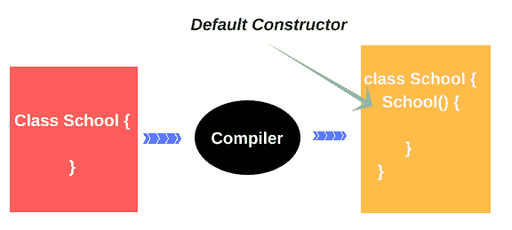

# 技术面试问答[更新]

> 原文：<https://hackr.io/blog/technical-interview-questions>

在这个高科技的世界里，没有人不知道网络及其重要性。网络工程是当今最流行的工作之一。

此前，如果一个人希望参加面试，需要一页一页地仔细阅读所有可用的书籍和资料。但是互联网，一个网络系统让这一切变得如此简单。不管你是新人还是有经验的人，如果你在准备一次人际关系面试，就要准备好面对一些基本的人际关系问题。

## 热门技术面试问题和答案

本文涵盖了基本网络、C、C++、Java 和 OS 技术的技术面试问题和答案。

### **网络面试问题**

#### 问:什么是计算机网络？

**答:**计算机网络是以资源共享为目的的相互连接的计算机的集合。当今最常见的共享工具是互联网连接。

**问题:传播和传递的区别？**

**答案:**传输是一个物理数据过程，涉及到比特极性、同步、时钟等问题。通信是指两个通信网络之间完全的信息交换。

#### 问:什么是网关？

**答案:**网关是网络中的一个节点。它们接受一种协议格式的数据包，在重新发送之前，它们将其转换为另一种协议格式的数据包。

#### 问题:什么是网络掩码？

**答案:**掩码是用于标识网络/子网地址的位模式。IP 地址由两部分组成:网络地址和主机地址。

IP 地址分为不同的类别，用于识别网络地址

#### 问题:TCP/UDP 有什么区别？

**答案:** **TCP(传输控制协议):** TCP 是一种基于链路的协议。可以在客户机和服务器之间建立一个链接，从那时起，一些数据可以沿着这条路径发送。

当你用 TCP 套接字发送消息时，如果连接完全失败，你将得到它。如果在途中丢失了，客户可以重新要求丢失的部分。它意味着正直；信息不会泄露。

**UDP(用户数据报协议):** UDP 是一种无连接协议。使用 UDP 时，您可以通过网络以块的形式发送消息(数据包)。

当你发送一条信息时，你不知道它是否会到达那里——它可能会在途中丢失。如果你发出两条信息，你不知道它们会以什么顺序到达。

#### 问题:比较 IPv4 和 IPv6 协议？

**答案:** Ipv4 和 Ipv6 是应用于网络层的互联网协议。Ipv4 是目前最常用的协议，Ipv6 是下一代互联网协议。

*   Ipv4 是互联网协议的第四个版本，它使用 32 位寻址，而 Ipv6 是一个 128 位协议，用于寻址下一代互联网。
*   Ipv4 有 4，294，967，296 个唯一地址，而 Ipv6 可以有 340 亿个唯一地址。
*   Ipv4 地址表示法:239.255.255.255，255.255.255.0。八组由冒号分隔的十六进制四位数代表 IPv6 地址。

**问题:**URL 如何处理成浏览器？

**答案:**这个问题没有确切的答案，尽管以下是处理 URL 的步骤:

*   为了找到 URL IP 地址，浏览器联系 DNS 服务器。
*   DNS 返回网站的 IP 地址。
*   客户端打开 TCP 端口 80 web 服务器链接。
*   浏览器获取所请求页面的 HTML 代码。
*   在显示窗口中，浏览器呈现 HTML。

#### 问:有哪些不同的路由协议？

**答案:**

*   边界网关协议
*   路由信息协议
*   首先打开最短路径

#### 问题:什么是 MAC 地址？

**答:**在网络中，MAC 地址是一个设备的唯一标识地址。通常，MAC 地址存储在网络适配器卡的 ROM 中。

#### 问:网络设备有哪些不同的类型？

**答案:**

##### 1.中心

网络集线器是一个节点系统，它在一个点上连接多台计算机。集中通信设备是集中器，连接在星形连接网络的中间。连接到网络集线器的所有设备平等地共享可用带宽。

##### 2.中继器

中继器是用来避免信号传输失真的电子设备。中继器在网络中接收信号，重新生成原始比特，然后通过相同的信道传输，以避免失真。

##### 3.路由器

路由器是将一个网络(局域网、广域网)连接到另一个网络(局域网、广域网)的系统。路由器根据发送方和接收方的位置选择最合适的路径来传输信号。

##### 4 .网关

网关用于将网络中的一种格式转换成另一种格式。如果同一网络的两个部分具有不同的通信格式，那么连接它们就需要网关。它们在 OSI 模型的所有七层中运行。

##### 5.布里奇斯

网桥是处理和记录网络中设备之间的信号流量信息的智能设备。然后，网桥使用该信息来决定发送设备和接收设备之间最有效的数据传输路径，而不必将数据发送到网络中的任何计算机。

### Java 面试问题

#### 问题:什么是 JAVA？

回答:Java 是一种面向对象的编程语言。Java 是为数字消费设备设计的，但后来被转移到了互联网上。现在 Java 是一种广泛使用的互联网编程语言。Java 开发的软件可以在世界上任何硬件或操作系统上运行。

欲了解更多信息，请阅读我们的博客。

#### 问题:应用程序在哪里可以用 Java 开发？

**答案:**

**独立应用程序:**在计算机的操作系统下，独立应用程序是在我们本地计算机上运行的程序，就像 C 或 C++程序一样。

小应用程序:小应用程序是一个小程序，它通过 Internet Explorer 或 Netscape Navigator 等与 Java 兼容的网络浏览器在客户端计算机上运行。

一个 applet 存储在 web 服务器中，通过网络传输，并在客户端计算机请求时动态下载到客户端计算机中。只有将其嵌入到 HTML 文档中，如声音文件或图像文件或视频剪辑，才能执行 Applet。

**分布式应用:**为了在 Java 应用中实现分布式应用，Java 将应用分成小的组，可以在单独的机器上运行。使用的对象可以在这些程序中相互交互。这些系统被称为分布式应用程序

网络应用程序:这些是在网络服务器上运行的程序。当我们在浏览器中使用 URL 搜索网站时，Web 服务器会处理这些应用程序。网络浏览器向网络服务器发送对该特定网站的请求。运行程序后，服务器将结果发送给客户端。

#### 问题:解释 Java 语言规范？

**答:**Java 语言规范是编写 Java 程序时应该遵循的一组规则，包括 Java 编程语言的语法和语义。规范包括 API、JDE、IDE。

**API:** 应用程序接口(API)仍在扩展规范，包含用于开发 Java 程序的预定义类和接口。

**JDK:** Java 开发工具包(JDK)用于开发测试 Java 程序，它包含一个单独的程序，调用每个命令行。

**IDE:** 集成开发环境(IDE)由图形用户界面组成，支持编辑、编译、构建、调试和在线帮助。只需在一个窗口中输入源代码或在浏览器中打开现有文件，然后单击按钮、菜单项或功能键即可编译并运行程序。

#### 问题:什么是 RMI 和 RMI 架构？

**答:**远程方法调用(RMI)支持在一台机器上执行 java 对象，在另一台机器上调用执行 Java 对象的方法。

RMI 架构由 4 层组成:

*   **应用层:**包含实际的对象定义。
*   **代理层:**由存根和骨架组成。
*   **远程参考层:**设置来自传输层的字节流，并将其传递给代理层。
*   **传输层:**负责机器对机器的实际通信。

#### 问:什么是 Servlet 链接？

**答:** Servlet 链使一个人能够参与一个或多个 Servlet 来服务单个请求。通过 servlet 链接，一个 servlet 的输出将通过管道传递到下一个 servlet 的输入。在到达最后一个 servlet 之前，循环继续。然后，输出将返回给客户端。

#### 问:什么是连接池？

**答:**打开与 servlets 的服务器链接是一个主要的瓶颈，因为对于每个页面查询，都要建立新的连接，这非常耗时。

使用连接池，我们可以只复制我们需要复制的资源，而不是整个 servlet，并且它可以管理池的大小。

#### 问题:什么是饼干？

**答:** Cookies 是 servlet 使用的一种工具，用来保持客户端持有少量用户相关的状态信息。简单地说，就是由 web 服务器发送到浏览器的小数据，稍后可以从该浏览器中读取

#### 问:如何跟踪客户？

**答:**从 servlet API 跟踪客户端有两种方式，它们是:

*   使用会话跟踪
*   饼干

#### 问:什么是 JDBC？

**回答:** JDBC 是 Java API 中的一系列 [SQL 语句](https://hackr.io/blog/sql-commands)。这个 API 由一组类和接口组成，允许程序员为 Java 数据库编写纯应用程序。

#### 问:JDBC 和 ODBC 有什么区别？

**答案:**

*   JDBC - Java 数据库连接，ODBC-开放式数据库连接
*   OBDC 代表微软，JDBC 代表 Java 应用
*   由于 ODBC 使用 C 接口，它不能直接用于 Java
*   对于简单的查询，ODBC 混合了简单和高级功能，并具有复杂的选项。但是 JDBC 旨在保持简单，并在必要时允许高级功能
*   ODBC 需要手动安装，而 JDBC 代码可以自动安装。

[完整的 Java 开发训练营](https://click.linksynergy.com/deeplink?id=jU79Zysihs4&mid=39197&murl=https%3A%2F%2Fwww.udemy.com%2Fcourse%2Fthe-complete-java-development-bootcamp%2F)

## c 编程面试问题

#### 问题:什么是 C 语言？

**答:**C 编程语言是为在 UNIX 操作系统上使用而开发的标准化编程语言。c 是编写系统软件最常用的编程语言，尽管它也用于编写应用程序。

#### 问:C 中有哪些不同的存储类？

**答案:** C 有三种存储类型:自动静态和已分配。具有块范围和自动处理长度的变量，没有静态说明符。块范围变量和静态说明符变量有静态范围。还有一个全局变量的动态作用域(即文件作用域)，有或没有静态说明符。通过调用 malloc()、alloc()或 realloc()获得的内存属于分配的内存类。

#### 问题:printf("%d ")的输出是什么？

**回答:**如果我们写 printf("%d，" x)；这意味着编译器将打印 x 值。但是像这里一样，在%d 之后什么也没有，所以编译器会在输出窗口中显示垃圾值。

#### 问题:printf()和 sprintf()有什么区别？

**回答:** Sprintf()写字符数组数据，而 printf(...)写入标准输出机器数据。

#### 问:你能告诉我如何检查一个链表是否是循环的吗？

**答案:**创建两个点，并将它们都设置在列表的开头，程序:

```
while (pointer1) {
pointer1 = pointer1->next;
pointer2 = pointer2->next;
if (pointer2) pointer2=pointer2->next;
if (pointer1 == pointer2) {
print ("circular");
}
}
```

#### 问:什么是哈希？

**回答:**哈希就是磨起来的意思，哈希就是这么回事。哈希算法的核心是一个哈希函数，它将你良好、平滑的数据研磨成看起来随机的整体。

哈希背后的概念是，一些数据要么没有固有的顺序(如图像)，要么比较起来很昂贵。如果数据没有基本顺序，则无法执行比较搜索。

#### 问题:解释一下字符串和字符数组的区别？

**回答:**一个主要区别是:string 会有静态存储长度，而 string 作为字符集不会有静态存储时长，除非用 static 关键字表示显式。

*   我们通常称之为 string 的多字节字符序列用于初始化一个静态的空间长度范围。这个集合的宽度足以容纳这些字符以及终止的 NUL 码。
*   没有规定如果该数组(即字符串)被修改会发生什么。
*   相同值的两个串可以共享相同的存储器字段。

#### 问题:为什么 n++执行速度比 n+1 快？

**回答:**进行增量运算，表达式 n++需要 INR 等单个机器指令，而 n+1 需要更多指令。

#### 问题:main()函数的用途是什么？

**回答:**main()函数调用其内部的其他函数。它是运行程序时要编写的第一个函数。

*   这是一个启动功能
*   它向调用程序的环境返回一个 int 值
*   还启用了对 main()的递归调用
*   这是一个用户定义的函数
*   当 main()函数关闭时，程序的执行结束。
*   它有两个参数 1)参数计数和 2)参数向量

#### 问题:c 语言中%d 和%*d 有什么区别？

**回答:**% d 给出变量的初始值%* d 给出变量的名称。

**例如:-**

```
int a=10,b=20;
printf("%d%d",a,b);
printf("%*d%*d",a,b);
```

这里，第一次 printf 的结果将是 10，20，第二次 printf 的结果给出的内存分配可以说是 1760。

## C++面试问题

#### 问题:什么是 C++？

**答案:** C++是一种面向对象的编程语言。C++保留了 C 语言的几乎所有元素，简化了内存管理并增加了多种功能。C++保留了允许访问低级内存的 C 特性，但也为程序员提供了改进内存管理的新工具。

#### 问:什么是构造函数？

**答:**构造函数是用来创建和初始化对象的。它还生成数字特征 vtable。这是一个不同于其他流程的特殊类别。



#### 问题:什么是继承？

**答:**继承允许一个类重用另一个类的状态和动作。派生类通过修改方法并添加其他属性和方法来继承和扩展基类的属性和方法实现。

#### 问题:什么是类？

**答:**类是数据结构的扩展定义:它可以包含数据和函数，而不是只保存数据。

#### 问:你怎么知道你的类需要一个虚析构函数？

**回答:**如果我们在类中只有一个虚函数，我们需要创建一个虚析构函数。这将允许您通过调用方从基类对象中移除动态对象。

#### 问题:realloc()和 free()有什么区别？

**答案:**free 子程序删除 malloc 子程序之前保留的一个内存块。如果指针参数不是有效的指针，则会出现不确定的结果。如果指针参数为空值，则不会发生任何操作。

realloc 子例程通过 Pointer 参数参考 size 参数定义的字节数来调整内存块的大小，并返回一个指向该行的新指针。由指针参数定义的指针必须是用 malloc、calloc 或 recordination 的子例程生成的，并且不处理 free 或 recordination 的子例程。

#### 问:写一个可以反转链表的函数？

**答案:**

```
void reverselist(void)
{
if(head==0)
return;
if(head->next==0)
return;
if(head->next==tail)
{
head->next = 0;
tail->next = head;
}
else
{
node* pre = head;
node* cur = head->next;
node* curnext = cur->next;
head->next = 0;
cur-> next = head;
for(; curnext!=0; )
{
cur->next = pre;
pre = cur;
cur = curnext;
curnext = curnext->next;
}
curnext->next = cur;
}
}
```

#### 问题:C++ & Java 有什么区别？

**答案:**

| **C++** | **Java** |
| 类和函数可以被模板化。 | 类和方法可以通用化 |
| 参数可以是任何类型或整数值。 | 仅引用类型参数 |
| 对于每个类型参数，编译时可能会创建单独的类或函数副本。 | 对于所有类型的参数，只有一种类型的类或函数被编译 |
| 必须包含模板化的类或函数的源代码，以便使用它 | 来自的类或函数的签名编译类就够用了。 |
| 模板可以专门化 | 不能专门化(通用) |
| 不允许使用边界类型参数 ，但元编程支持该参数。 | 支持“扩展”和“超级”类别参数的上下边界 |
| 对于静态方法和变量，可以使用模板化类的类型参数 | 对于静态方法和变量，不能使用模板化类的 form 参数。 |
| 不同类型参数的类之间不共享静态变量。 | 静态变量在不同类型类参数的实例间共享 |

#### 问:什么是 RTTI？

**答案:**运行时类型标识(RTTI)允许你在只有指针或者基类引用的情况下，找到一个对象的动态形式。RTTI 是标准 C++中发现对象类型和转换引用或指针类型的官方方法。

#### 问题:虚函数在 C++中是如何工作的？

**答案:**虚函数依赖于一个虚拟的桌子或板子。如果一个类的任何一个函数被认为是虚函数，那么就建立一个 v 表来存储这个类的虚函数的地址。编译器还在所有这样的类中添加了一个秘密的 vptr 变量，指向该类的 vtable。

如果派生类中的虚函数没有被重写，派生类中的 vtable 必须将函数地址存储在其父类中。

## 操作系统面试问题:

#### 问:什么是操作系统？

**答案:**操作系统(OS)是计算机用户与硬件的接口。操作系统有两个主要目的。一是确保计算机系统运行良好。另一个原因是它为系统开发和实现提供了一个框架。

一些流行的操作系统包括 Linux、Windows、OS X、VMS、OS/400、AIX、z/OS 等。

#### 问题:多处理器系统的优势是什么？

**回答:**随着处理器数量的增加，吞吐量会显著增加。但是，因为它们可以共享资源，所以可以节省更多的钱。最后，还有整体性能的提升。

#### 问题:什么是 SMP？

**答案:** SMP 是对称多处理的简称。这是最受欢迎的多处理器设备类型。每个处理器在该系统中运行操作系统的相同副本，并且这些副本根据需要相互通信。

#### 问:操作系统有哪些类型？

**答案:**

*   批处理操作系统
*   分时操作系统
*   分布式操作系统
*   网络操作系统
*   实时操作系统

#### 问题:设计操作系统时，最佳的页面大小是多少？

**答:**分页大小因系统而异。为了创建合适的页面大小，需要考虑许多因素，如页面表、分页时间及其对整个操作系统性能的影响。

#### 问题:什么是缓存？

**答:**缓存是使用快速内存区域来存储有限的数据和流程。由于高速缓存的存取速度快，它通常非常有效。

#### 问题:解释为什么 Ubuntu OS 是安全的，不受病毒影响？

**答案:**

*   它不接受恶意邮件和内容，在用户打开任何邮件之前，都会进行许多安全检查。
*   Ubuntu 使用 Linux，即一个超级安全的操作系统
*   与其他操作系统不同，无数的 Linux 用户将能够在任何时候看到代码并解决任何问题。

#### 问题:分页的作用是什么？

**答案:**分页是一种内存管理系统，允许一个进程在物理地址空间中不连续。这消除了在备份存储中安装不同内存块的问题。

#### 问:什么是翻译后备缓冲区(TLB)？

**答:**在缓存系统中，最后几个被引用页面的基址存储在称为 TLB 的寄存器中，这有助于更快地查找。TLB 包括最近使用的页表条目。通常，每个虚拟内存链接需要对物理内存进行两次访问——一次是获取正确的页表条目，另一次是获取所请求的信息。它将 TLB 的使用限制在只有一个物理内存访问，在 TLB 命中的情况下。

#### 问:服务器系统是如何分类的？

**答:**数据库系统既可以识别为计算机服务器系统，也可以识别为文件服务器系统。在第一个示例中，为客户提供了一个提交操作请求的应用程序。在第二种情况下，有为客户机创建、访问和更新文件的规定。

**人也在读:**