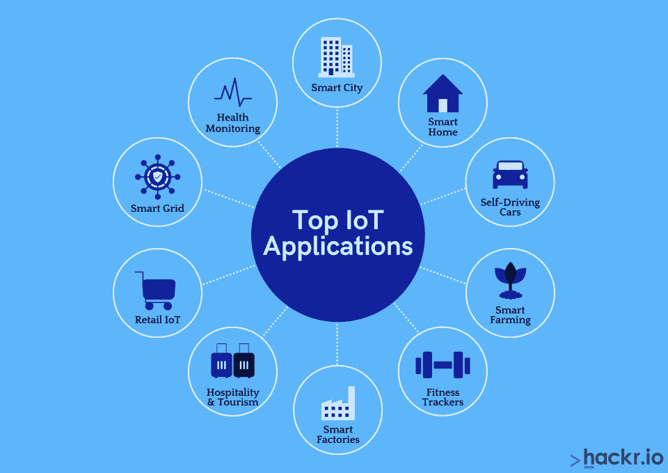
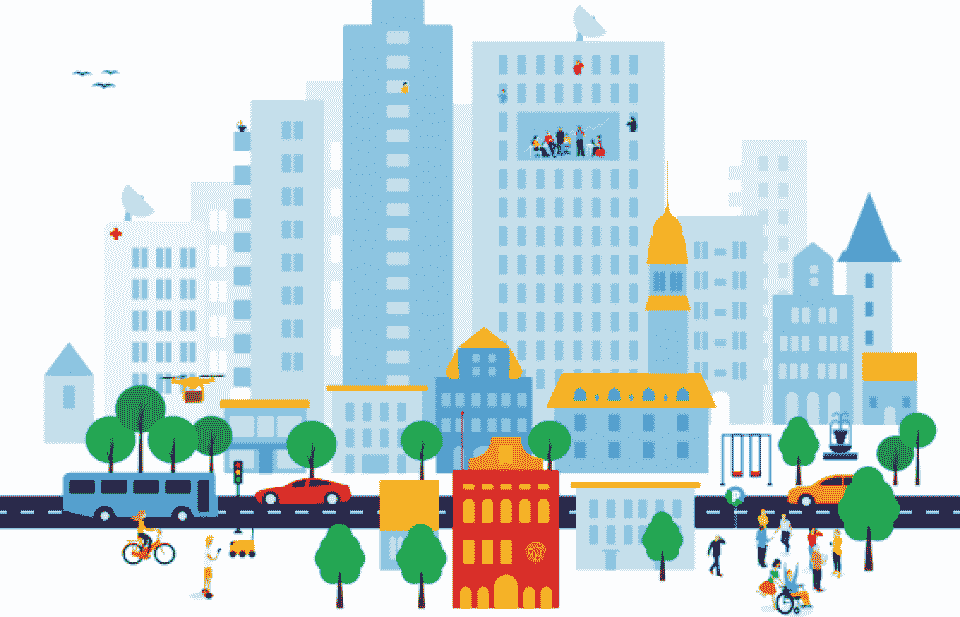
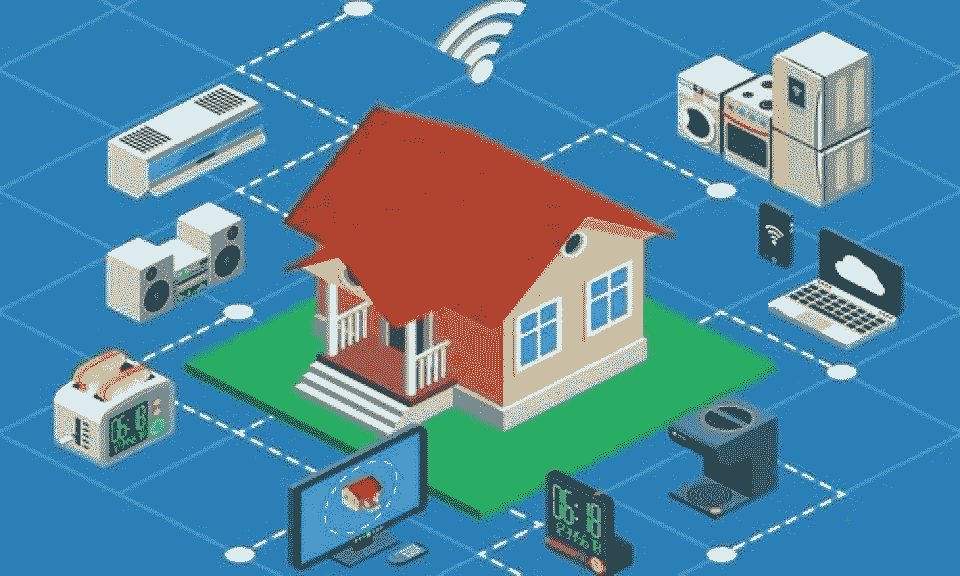
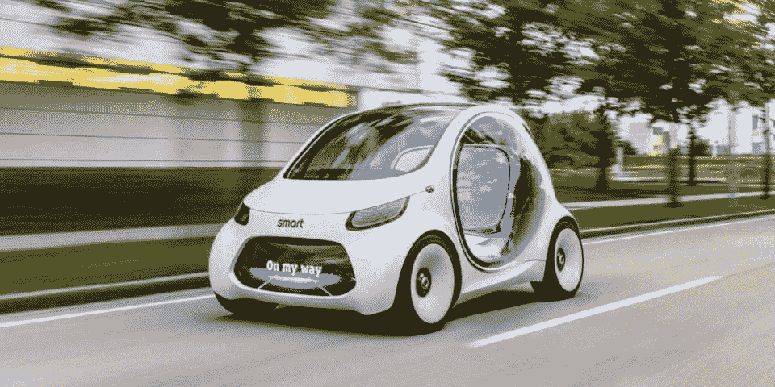
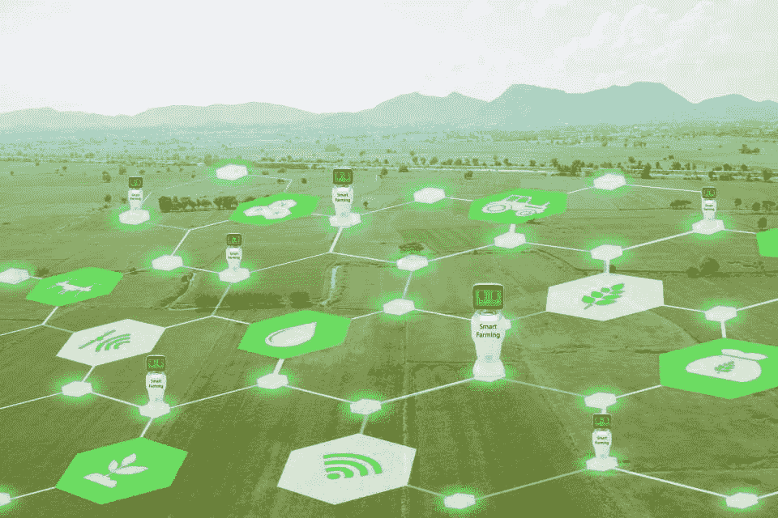
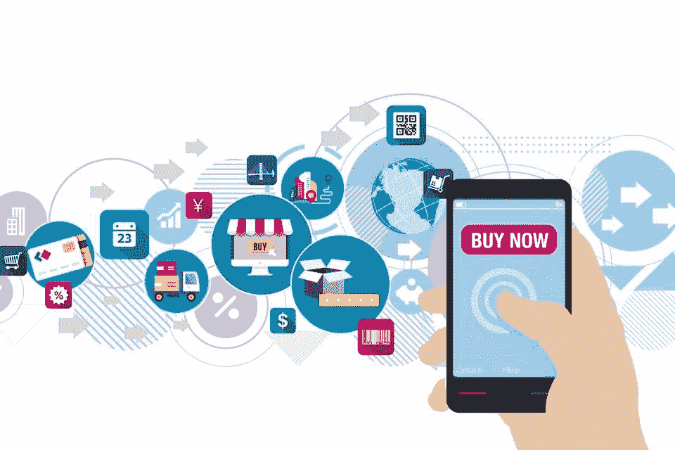
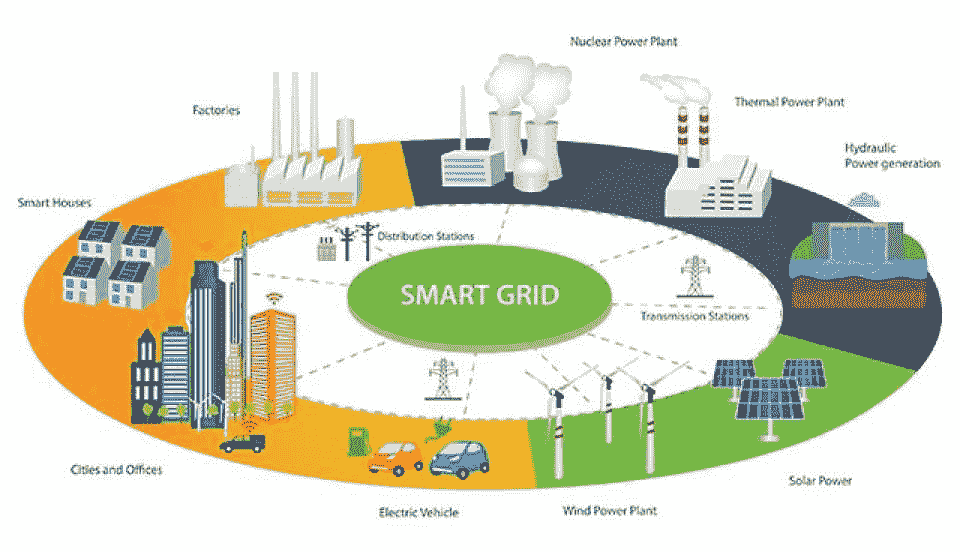

# 2023 年十大物联网应用

> 原文：<https://hackr.io/blog/top-10-iot-applications>

物联网是工业革命的下一阶段。技术允许物理设备进入数字领域。

物联网是“现实世界”和“数字世界”的融合，使得人、物体和过程之间的交流变得容易。

借助物联网，可以通过互联网网络基础设施远程激活和控制物体，从而以 安全 的方式为物理世界和计算机系统之间的集成创造机会。现实生活中的物联网应用正在改变我们处理各种社会功能的方式。

[物联网](https://hackr.io/blog/what-is-iot) 已经不是科幻了。互联网连接的力量已经超越了智能手机和电脑。现在，互联网允许物理对象记录、监控和交换 [数据](https://hackr.io/blog/what-is-data-analytics) ，几乎不需要人工干预。今天，我们来看看正在改变不同行业的 10 大最佳物联网应用(IoT 应用)!

## **十大真实物联网应用**

****

随着未来几年技术的发展，物联网应用的数量将会增加。在不久的将来，物联网可能会与 [【人工智能】](https://hackr.io/blog/what-is-artificial-intelligence) 一起使用，为每一个世俗的技术问题提供智能解决方案。这里我们介绍 10 个重要的现实世界 物联网应用实例 ！

### **1。智慧城市**

****

一个 [智慧城市](https://www.twi-global.com/technical-knowledge/faqs/what-is-a-smart-city) ，或“未来之城”是一个流行的 物联网应用 概念，将技术归类为负责改善城市基础设施，使城市中心更高效、更便宜、更适合居住。它还旨在促进经济增长和帮助保持环境的可持续性。

“智慧城市”的概念通过以创新和可持续的方式实现服务自动化来解决规划和公共管理问题。智能城市改善和现代化了许多部门，包括政府服务、运输和交通管理、能源、医疗保健、水、创新型城市农业和废物管理。

### **2。智能家居**

****

在这份物联网应用清单中，智能家居是最时尚的[。智能家居控制家用电器，包括灯、警报和水龙头的水流，同时通过精心设计的智能安全系统促进家庭安全。](https://techjury.net/blog/smart-home-statistics/#gref)

有了智能家居，房主可以通过他们的智能手机、平板电脑和笔记本电脑控制和监控家居过程。想象一下你忘记关烤箱了——你可以通过手机简单地关掉它。

智能家居允许您从一个地方管理所有家庭设备。

### **3。智能自动驾驶汽车**

****

自动驾驶和操作汽车曾经是未来的事情，现在是我们的现在。您可以使用智能汽车技术通过智能设备控制某些功能。

安装在汽车上的中央计算机接收来自安装在汽车各处的传感器的数据，以确定发动机油位、散热器水温等

你甚至可以通过手机应用程序监控汽车的状态，包括位置、油位、汽油等。

[新手高手班成物联网](https://click.linksynergy.com/deeplink?id=jU79Zysihs4&mid=39197&murl=https%3A%2F%2Fwww.udemy.com%2Fcourse%2Finternet-of-things-raspberrypi-azure%2F)

### **4。农业中的物联网**

****

农民可以使用智能物联网农业应用程序 [优化许多耗时的农场操作](https://www.sciencedirect.com/science/article/pii/S2589721721000350) ，为农业行业带来革命性的机遇。物联网可以帮助您确定收获作物的最佳时间，生成基于土壤化学的肥料剖面，并检测土壤养分和水分浓度。

在智能农业中，一系列传感器被安装在整个农业中，包括家畜，以监控动物的健康信息。

[Pynco 农业传感器](https://pycno.co/) 是智能农场技术的一个例子，它可以帮助农民预测天气数据并监控作物和牲畜的状态。

### **5。健身追踪器**

****

物联网设备可帮助您优化健身目标并跟踪进度。健身追踪器可以追踪你的日常活动，如睡眠模式、心率、活动模式、锻炼数据、消耗的卡路里等。这些设备通过从你的皮肤收集数据的传感器来完成这一切。

### **6。物联网工厂**

****

智能工厂使用物联网技术(也称为 [工业物联网](https://www.theatlantic.com/sponsored/vmware-2017/iot-manufacturing/1751/) )来收集工业流程和设备的数据，以形成战略计划并创造更多效率。机器设备和工厂项目连接到传感器，以改善分析。这种技术可以帮助工厂降低能耗，改善资产跟踪，并及早发现设备问题，以保护利润和提高供应链生产率。

### **7。物联网酒店和旅游业**

物联网在优化酒店和旅游运营方面有着巨大的潜力。对于酒店业的酒店和汽车旅馆来说，人员配备是一笔很大的开支，但物联网可以自动化某些交互，以减轻人员配备负担。例如，移动电子钥匙允许酒店客人进入和登记他们的房间，而不必与工作人员互动。

通过客人的智能手机，他们可以请求客房服务，分享任何房间问题，如缺少毛巾，帮助酒店更快地获得有用的信息。

### **8。零售物联网**

****

与工业部门类似，零售部门可以利用物联网技术实现节约、效率和创新。零售物联网可以完成很多事情，包括改善客户体验、准确和实时的产品跟踪、改善员工策略以及整体高效的库存管理。

零售商还可以利用物联网监控客户的购物模式，识别他们的购买历史、趋势和位置信息，从而更好地为客户策略提供信息。

### **9。智能电网**

****

智能电网是关注能源系统的物联网。公用事业公司使用智能电网技术通过各种方式来提高能源效率，包括监控能源消耗、预测能源短缺和停电，以及收集不同个人和公司如何使用能源的数据。

普通人也可以利用智能电网的洞察力来评估他们自己的能源使用情况，并提高他们家庭的效率。

### 10。用于健康监控的物联网应用

新冠肺炎疫情向世界展示了整个医疗保健行业需要认真升级，包括增强现代化、效率和灵活性。如果一个病人不能赴约，他们还能如何接受治疗？

物联网提供了一种将传感器连接到家中患者的途径。通过这些传感器，医生可以监测和跟踪病人的进展，警报可以通知医生任何紧急情况，例如心脏病发作。

## **常见问题解答**

### **1。Alexa 很大吗？**

物联网是指任何使用 wi-fi 传输数据的设备，所以 [Alexa](https://developer.amazon.com/en-US/alexa) 当然有资格！Alexa 使用人工智能来帮助你控制某些家庭设备，如扬声器、灯和锁。

### **2。最好的物联网平台是哪个？**

如今，物联网平台越来越多。一些流行的包括 Oracle IoT、Google Cloud IoT、Amazon AWS IoT Core 和 Microsoft Azure IoT Hub。

### **3。Apple Watch 是物联网设备吗？**

Apple Watch 当然是一款物联网设备，因为它使用 wifi 来执行许多控制任务，如健身跟踪、通话操作等！

### **4。物联网是什么设备？**

你在日常生活中看到的无数设备都使用物联网技术。一些例子包括智能冰箱、智能手表、健身追踪器、智能监控系统和门锁以及智能汽车。

[通过本课程创建您自己的物联网设备](https://coursera.pxf.io/Gj4jK9)

只需六门课程，即可设计并创建一个简单的物联网设备。

**结论**

## 物联网(IoT)是最新的技术创新，它有能力改善环境的可持续性，[增强安全性](https://hackr.io/blog/what-is-iot-security-technologies)，提高各个行业的业务效率，当然，还能提高日常任务和运营的便利性。

现在，您已经了解了一些顶级物联网应用示例，是时候在现实世界中尝试自己的物联网应用了！查看这些 [物联网教程](https://hackr.io/tutorials/learn-internet-of-things-iot) ，立即体验智能技术吧！

[https://www.youtube.com/embed/tBoVpVWUzKo](https://www.youtube.com/embed/tBoVpVWUzKo)

视频

**人也在读:**

**People are also reading:**