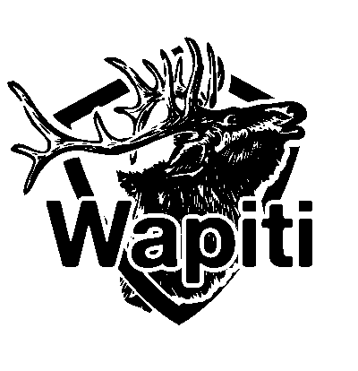
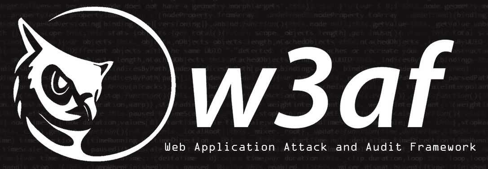
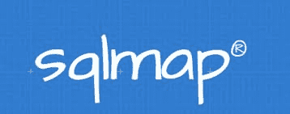
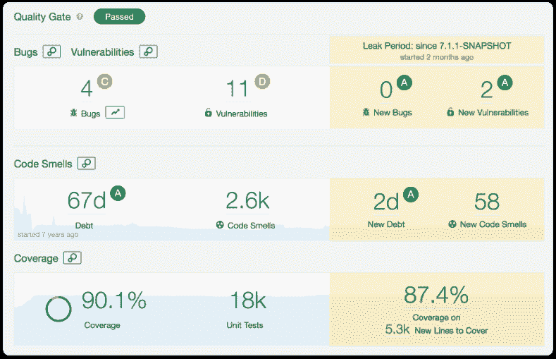
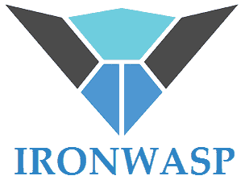
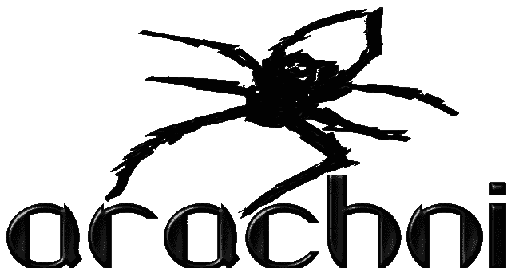

# 十大 Web 应用开源安全测试工具(更新)

> 原文：<https://hackr.io/blog/top-10-open-source-security-testing-tools-for-web-applications>

互联网发展了，但黑客活动也增加了。时不时会有一些关于网站被黑或者数据泄露的新闻。技术已经取得了长足的进步，但黑客攻击也是如此。就像数字世界一样，黑客技术和工具也变得越来越复杂，也越来越具有威胁性。

迟到总比后悔好！让你的网站或网络应用程序对恶意活动保持万无一失是很重要的。您需要做的是使用一些安全测试工具来识别和测量您的 web 应用程序的安全问题的程度。

安全测试的主要功能是在观察下执行 web 应用程序的功能测试，并尽可能多地发现可能导致黑客攻击的安全问题。所有这些都是在不需要访问源代码的情况下完成的。

在深入研究一些最好的开源安全测试工具来测试您的 web 应用程序之前，让我们先了解一下安全测试的定义、目的和需求。

## **安全测试**

**定义**–为了确保某些信息系统中的数据保持安全，不被未经授权的用户访问，我们使用安全测试。成功的安全测试可以保护 web 应用程序免受严重的恶意软件和其他恶意威胁，这些威胁可能会导致它崩溃或出现意外行为。

安全测试有助于在初始阶段找出 web 应用程序的各种漏洞和缺陷。此外，它还有助于测试应用程序是否成功地编码了安全代码。安全测试涵盖的主要领域有:

*   认证
*   授权
*   可用性
*   保密性
*   完整性
*   不可否认性

**意图**–安全测试被世界各地的组织和专业人士用来确保他们的 web 应用和信息系统保持安全。部署安全测试的主要目的是:

*   帮助提高产品的安全性和保质期
*   在开发的初始阶段识别并解决各种安全问题
*   评估当前状态下的稳定性

**需求**–我们为什么需要安全测试？嗯，有很多原因，从分析安全程度到防止未来意外故障。一些最重要的原因是:

*   避免不一致的性能
*   避免失去客户信任
*   避免以安全漏洞的形式丢失重要信息
*   防止身份不明的用户窃取信息
*   避免意外故障
*   节省解决安全问题所需的额外成本

有几种免费、付费和开源的工具可以用来检查你的 web 应用程序中的漏洞和缺陷。除了免费之外，开源工具最好的一点是你可以定制它们来满足你的特定需求。

因此，这里列出了 11 种开源安全测试工具，用于检查您的网站或网络应用程序的安全性:

### **1。Zed 攻击代理(ZAP)**

由 OWASP(开放 web 应用安全项目)开发， [ZAP 或 Zed 攻击代理](https://www.zaproxy.org/)是一个多平台、开源的 Web 应用安全测试工具。ZAP 用于在开发和测试阶段发现 web 应用程序中的大量安全漏洞。得益于其直观的 GUI，Zed Attach Proxy 可以让新手和专家一样轻松使用。安全测试工具支持高级用户的命令行访问。 除了是最著名的  OWASP  项目之一，更是被授予旗舰地位。ZAP 是用 Java 写的。除了用作扫描器之外，ZAP 还可以用于拦截代理，以手动测试网页。ZAP 曝光:

*   应用程序错误披露
*   Cookie not HttpOnly 标志
*   缺少反 CSRF 令牌和安全报头
*   私有 IP 泄露
*   URL 重写中的会话 ID
*   SQL 注入
*   XSS 注射剂

**主要亮点:**

*   自动扫描
*   易于使用
*   多平台
*   基于 Rest 的 API
*   支持认证
*   使用传统而强大的 AJAX 蜘蛛

下载 [Zed 攻击代理(ZAP)源代码](https://github.com/zaproxy) 。

### **2。Wfuzz**

用 Python 开发的 ， [Wfuzz](http://www.edge-security.com/wfuzz.php) 广泛用于暴力破解 web 应用程序。开源安全测试工具没有 GUI 界面，只能通过命令行使用。Wfuzz 暴露的漏洞有:

*   LDAP 注入
*   SQL 注入
*   XSS 注射剂

**主要亮点:**

*   认证支持
*   饼干起毛
*   多线程
*   多个注射点
*   支持代理和 SOCK

下载 [Wfuzz 源代码](https://github.com/xmendez/wfuzz) 。

### **3。马鹿**

领先的 web 应用安全测试工具之一， [Wapiti](http://wapiti.sourceforge.net/) 是来自 SourceForge 和 devloop 的免费开源项目。为了检查 web 应用程序的安全漏洞，Wapiti 执行黑盒测试。因为它是一个命令行应用程序，所以了解 Wapiti 使用的各种命令非常重要。 马鹿对于经验丰富的人来说很容易使用，但是对于新手来说却是一种考验。不过不用担心，你可以在官方文档上找到所有的马鹿说明。为了检查一个脚本是否易受攻击，Wapiti 注入了有效载荷。开源安全测试工具支持 GET 和 POSTHTTP 攻击方法。马鹿暴露的漏洞有:

*   命令执行检测
*   CRLF 注射剂
*   数据库注入
*   文件公开
*   Shellshock 或 Bash bug
*   SSRF(服务器端请求伪造)
*   虚弱。可以绕过的 htaccess 配置
*   XSS 注射剂
*   二十注射

**主要亮点:**

*   允许通过不同的方法进行认证，包括 Kerberos 和 NTLM
*   带有一个破坏者模块，允许暴力破解目标 web 服务器上的目录和文件名
*   类似于 [起毛器](https://en.wikipedia.org/wiki/Fuzzing)
*   支持攻击的 GET 和 POSTHTTP 方法

下载 [马鹿源代码](https://github.com/mbarbon/wapiti) 。

### **4。w3af**版

同样使用 Python 开发的最流行的 web 应用程序安全测试框架之一是 [W3af](http://w3af.org/) 。该工具允许测试人员在 web 应用程序中发现超过 200 种类型的安全问题，包括:

*   盲人 SQL 注入
*   缓冲区溢出
*   跨站点脚本
*   CSRF
*   不安全的 DAV 配置

主要亮点:

*   认证支持
*   易于上手
*   提供直观的 GUI 界面
*   输出可以记录到控制台、文件或电子邮件中

下载 [W3af 源代码](https://github.com/andresriancho/w3af) 。

### 5.**sqlcmap**的缩写

[SQLMap](http://sqlmap.org/)允许自动检测和利用网站数据库中的 SQL 注入漏洞，完全免费使用。该安全测试工具带有强大的测试引擎，能够支持 6 种类型的 SQL 注入技术:

*   基于布尔的盲
*   基于错误的
*   带外
*   堆叠查询
*   时基盲
*   联合查询

**主要亮点:**

*   自动执行发现 SQL 注入漏洞的过程
*   也可用于网站安全测试
*   鲁棒检测引擎
*   支持一系列数据库，包括 MySQL、Oracle 和 PostgreSQL

下载 [SQLMap 源代码](https://github.com/sqlmapproject/sqlmap) 。

### **6。声纳员〔t1〕**

 另一个合适的开源安全测试工具是 [SonarQube](https://www.sonarqube.org/) 。除了暴露漏洞，它还用于测量 web 应用程序的源代码质量。尽管是用 Java 编写的，SonarQube 能够对 20 多种编程语言进行分析。此外，它很容易与 Jenkins 等持续集成工具集成。sonar cube 发现的问题以绿灯或红灯高亮显示。前者代表低风险的漏洞和问题，而后者对应于严重的漏洞和问题。对于高级用户，可以通过命令提示符进行访问。对于测试新手来说，交互式 GUI 已经就位。SonarQube 暴露的一些漏洞包括:

*   跨站点脚本
*   拒绝服务(DoS)攻击
*   HTTP 响应拆分
*   内存损坏
*   SQL 注入

**主要亮点:**

*   检测棘手问题
*   DevOps 集成
*   设置拉取请求的分析
*   支持短期和长期代码分支的质量跟踪
*   优惠[质量门 ](https://docs.sonarqube.org/7.4/user-guide/quality-gates/)
*   可视化项目历史

下载[sonar cube 源代码](https://github.com/SonarSource/sonarqube) 。

### **7。能源性〔t1〕**

谷歌的网络流量安全测试工具， [Nogotofail](https://security.googleblog.com/2014/11/introducing-nogotofaila-network-traffic.html) 是一款轻量级应用，能够检测 TLS/SSL 漏洞和错误配置。Nogotofail 暴露的漏洞有:

*   MiTM 攻击
*   SSL 证书验证问题
*   SSL 注入
*   TLS 注射

**主要亮点:**

*   易于使用
*   轻量级
*   随时可部署
*   支持设置为路由器、代理或 VPN 服务器

下载 [Nogotofail 源代码](https://github.com/google/nogotofail) 。

### **8。铁黄蜂**

[Iron Wasp](https://ironwasp.org/)是一款开源的强大扫描工具，能够发现超过 25 种类型的 web 应用程序漏洞。此外，它还可以检测假阳性和假阴性。Iron Wasp 有助于暴露各种各样的漏洞，包括:

*   认证失败
*   跨站点脚本
*   CSRF
*   隐藏参数
*   权限提升

**主要亮点:**

*   可扩展插件或模块是用 C#、Python、Ruby 或 VB.NET 编写的
*   基于图形用户界面的
*   生成 HTML 和 RTF 格式的报告

下载 [铁黄蜂源代码](https://github.com/Lavakumar/IronWASP) 。

### **9。抓取器**

便携式抓取器设计用于扫描小型网络应用程序，包括论坛和个人网站。轻量级安全测试工具没有 GUI 界面，是用 Python 编写的。Grabber 发现的漏洞包括:

*   备份文件验证
*   跨站点脚本
*   文件包含
*   简单 AJAX 验证
*   SQL 注入

**主要亮点:**

*   生成统计分析文件
*   简单便携
*   支持 JS 代码分析

下载 [抓取器源代码](https://github.com/amoldp/Grabber-Security-and-Vulnerability-Analysis-) 。

### 10.蛛形纲动物

适用于渗透测试人员和管理员， [Arachni](http://www.arachni-scanner.com/) 旨在识别 web 应用程序中的安全问题。开源安全测试工具能够发现许多漏洞，包括:

*   无效重定向
*   本地和远程文件包含
*   SQL 注入
*   XSS 注射剂

**主要亮点:**

*   即时部署
*   模块化的高性能 Ruby 框架
*   多平台支持

下载 [蛛形纲源代码](https://github.com/Arachni/arachni) 。

## **结论**

这总结了 web 应用程序的十大开源测试工具。你最喜欢的应用安全测试工具是什么？请在评论中告诉我们。祝你的道德黑客之旅一切顺利！

如果你是黑客新手，那么[从头开始学习道德黑客](https://click.linksynergy.com/deeplink?id=jU79Zysihs4&mid=39197&murl=https://www.udemy.com/course/learn-ethical-hacking-from-scratch/)课程将是一个很好的起点。

如果你想更深入地了解信息安全，那么你可以在 Hackr.io 上查看社区推荐的最佳[信息安全和道德黑客教程](https://hackr.io/tutorials/learn-information-security-ethical-hacking?ref=blog)

**人也在读:**