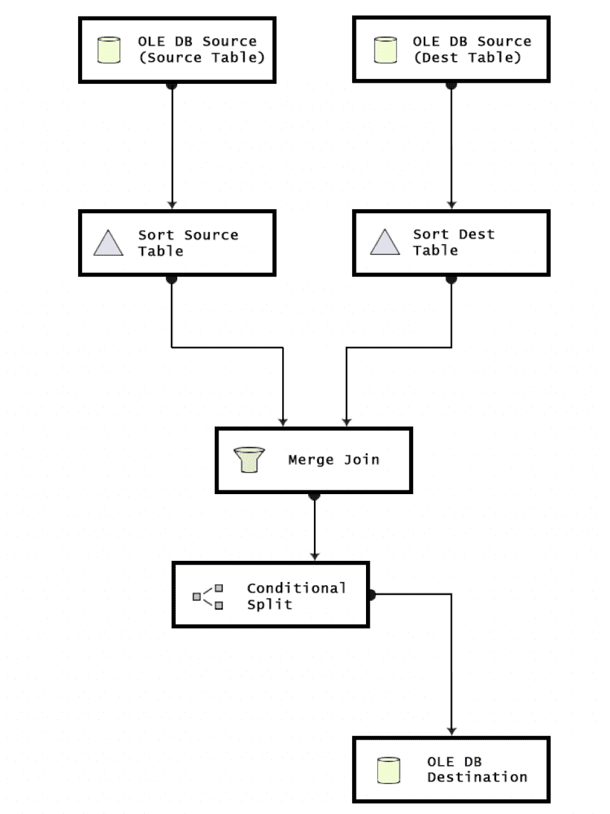
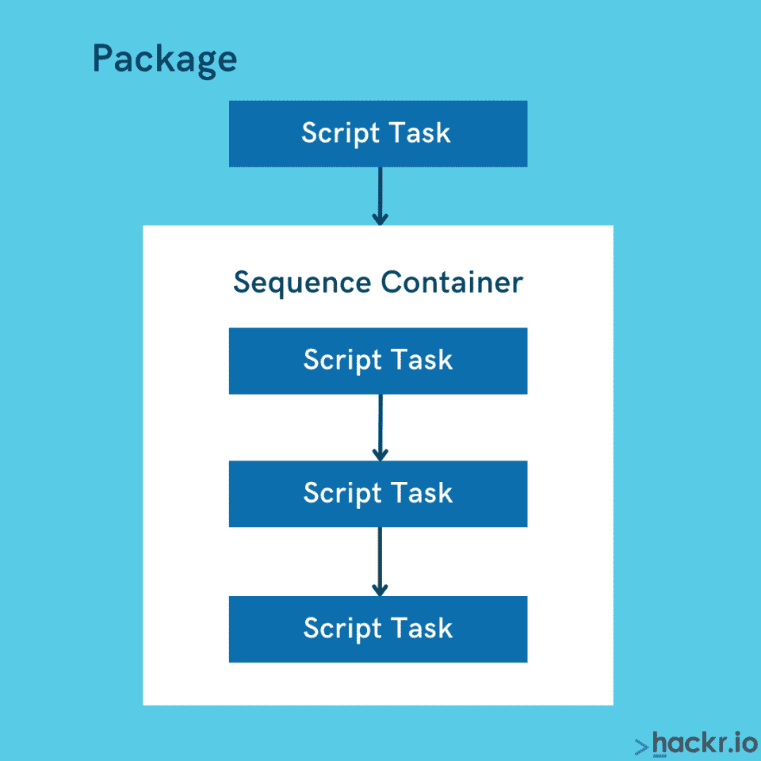
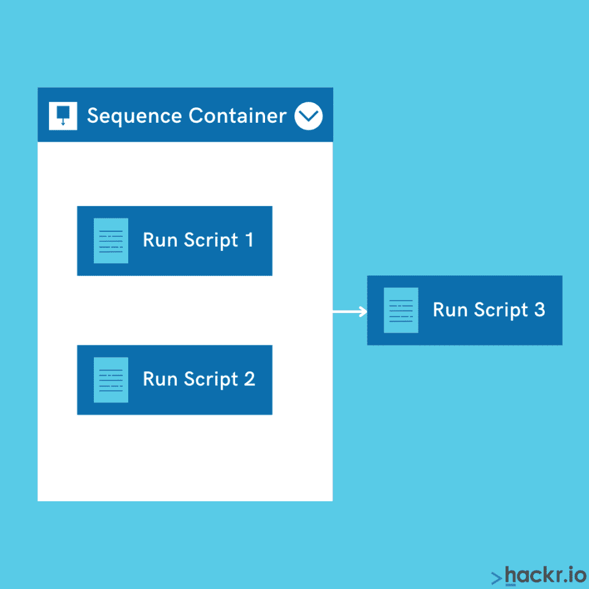

# 2023 年 50 大 SSIS 面试问答(更新)

> 原文：<https://hackr.io/blog/top-50-SSIS-interview-questions-and-answers>

SQL Server Integration Services，通常称为 SSIS，是 Microsoft SQL Server 2005 的一个重要组件，能够执行各种各样的数据迁移任务。它充当开发公司级数据转换和数据集成解决方案的平台。

人们将它作为高效的数据仓库工具，能够处理数据提取、数据转换和数据加载(ETL)。它能够从多个来源提取数据，如 Excel 文件、SQL Server 数据库和其他地方。此外，SSIS 使将存储在一个数据库中的数据迁移到另一个数据库变得更加容易。您可以使用 SSIS 自动化 SQL Server 维护和多维数据集数据的更新。

如果你最近正试图准备有关 SSIS 的面试，这篇文章将帮助你更好地了解这项技术。我们在这里总结了最常见的 SSIS 面试问题和答案。这些将有助于你做好准备，赢得面试，给你的潜在雇主留下深刻印象。

让我们开始吧。

## **顶级 SSIS 面试问答**

## **1。什么是 SSIS？**

SSIS 代表“SQL Server 集成服务”，由微软推出，作为微软 SQL Server 数据库的一个组件。它能够执行一系列数据迁移任务。此外，它还充当 ETL(提取、转换和加载)操作的数据仓库工具。

SSIS 附带了一套丰富的用于构建包的内置任务和转换工具。创建 SSIS 包有两种方法:一种是通过编程或 GUI 帮助用户创建包，而无需编写一行代码。

SSIS 的主要目标是使数据迁移、操作和转换过程变得简单易行。该工具具有定义流程和任务的工作流的能力；用户可以很容易地确定流程应该如何工作并执行各种任务。

## 2。**SSIS 有什么优势？**

以下是使用 SSIS 的优势:

*   SSIS 能够在同一个包中处理来自异构数据源的数据
*   处理复杂数据，如 FTP、HTTP、MSMQ、analysis services 等。
*   提供转换功能，更易于维护
*   与微软 Visual Studio 和 SQL Server 的紧密集成
*   帮助消除网络作为 SSIS 将数据插入 SQL 的瓶颈
*   擅长执行复杂的转换、结构化的异常处理、多步骤操作以及从多个数据源聚合数据。
*   允许跨多个目的地并行加载数据

## 3。**SSIS 的缺点是什么？**

以下是使用 SSIS 的缺点。

*   为了检查包执行报告，您将需要 Management Studio，而不是将其发布到 reporting services
*   您可能会遇到一个问题，或者发现同时运行多个包很有挑战性。这是因为 SSIS 使用大量的内存并与 SQL 冲突。
*   并行运行几个包时分配 CPU 资源也是一项挑战。您需要确保它在 SQL 和 SSIS 之间正确划分，因为 SQL 将被首先考虑，这使得 SSIS 运行非常慢。

## 4。**SSIS 的主要特征是什么？**

以下是 SSIS 最重要的一些特征

*   通过提供数据清理和分析提高数据质量
*   有助于顺利整合来自多个数据源的数据
*   轻松集成微软 SQL 产品的其他组件
*   丰富的工作室环境和图形工具
*   提供工作流功能，如文件传输协议
*   为 SSIS 对象建模提供 APIs】
*   高效实现高速数据连接
*   附带打包的数据源连接器
*   组织数据挖掘查询和查找转换

## 5。**为什么使用 SSIS？**

以下是使用 SSIS 的一些重要原因:

*   SSIS 帮助合并来自多个数据存储的数据，并将数据加载到不同的目的地，同时确保极高的速度
*   非常灵活多样，减少了对专业开发人员的需求
*   与微软产品家族紧密集成
*   经济高效的工具，提供强大的错误处理和智能编程风格，帮助开发人员快速编写冗长的代码
*   为商业智能输出提供数据转换过程
*   自动化数据加载过程和其他管理操作
*   详细的文档和强大的社区支持
*   该工具可以轻松地分析、清理、加载、转换、聚合、合并和提取数据。
*   易于配置、管理和操作

## 6。**什么时候可以使用 SSIS？**

你用 SSIS:

*   如果你想整合和分析来自不同来源的数据
*   每当您想要将商业智能融入数据转换过程时
*   当您必须处理各种业务工作流时，通过传递不同的参数集来检索信息
*   当您的项目需要分析各种数据集市和数据仓库时
*   当您想要自动执行管理任务时，例如备份、恢复、加载包等。
*   当您想要自动维护 SQL Server 数据库时

## 7。**列出 SSIS 整合流程的所有任务。**

以下是 SSIS 集成任务的列表:

*   一次处理一个或多个对象的 Analysis Services 处理任务
*   发送邮件任务将发送带有包工作流输出的电子邮件
*   XML 任务将处理 XML 文件，并将多个源合并成一个文件
*   执行包/流程任务将执行另一个包中的包或将它们分成更简单的包
*   执行 SQL 任务将执行包中的 SQL 语句
*   数据流任务将执行各种来源数据的 ETL
*   FTP 任务将用 FTP 上传和下载文件
*   脚本任务将为一个或多个不属于 SSIS 的任务添加代码

## 8。**SSIS 工作环境的重要组成部分是什么？**

以下是 SSIS 工作环境的主要组成部分:

*   **SSIS 工具箱:** 包含控制数据流所需的所有操作工具
*   **属性窗口:** 显示所选组件的属性
*   **SSIS 软件包:** 显示当前正在使用的确切软件包
*   **解决方案浏览器:** 决定浏览已有的解决方案和所有可用的文件
*   **连接管理器:** 显示现有的活动连接

## 9。**SSIS 有哪些套餐？**

在 SSIS 中，包是连接、数据流元素、参数、控制流元素、事件处理程序、变量和配置的集合。有两种方法可以将所有这些组件组装到一个 [SSIS 封装](https://docs.microsoft.com/en-us/sql/integration-services/integration-services-ssis-packages) 中，这可以通过 SSIS 的图形设计工具来完成，也可以通过编写程序来完成。

每个 SSIS 包都有一个控制流和数据流。所有其他元素，如变量、参数、事件句柄、配置，都是可选的。

您可以使用这些包来填充来自不同来源的数据，这些数据最终将用于执行管理任务。这些包是在商业智能开发工作室中创建的。

## 10。**什么是 SSIS 表情？**

在 SSIS，表达式主要用于根据各种条件过滤必要的信息。可以将表达式与循环、条件和动态连接结合使用。

这些表达式由符号、文字、标识符等组成。您还可以使用它们在运行时更新属性。您需要表达式计算器来解析表达式，从而验证表达式的规则。

## 11。**什么是清单文件？**

该文件是一个实用程序，它存储了在文件系统向导和 [SQL server 数据库](https://hackr.io/blog/mysql-create-database) 的帮助下部署软件包所需的信息。

## 12。**解释 SSIS 的数据转换。**

数据转换是将所需数据从各种数据源中提取出来的过程，称为数据抽取。提取后，数据被管理并传输到特定位置。数据向多个位置的传输基于预定义的规则。

变换有各种类型，例如:

*   商业智能转型
*   行转换
*   拆分和合并转换
*   行集转换
*   审计转换
*   自定义转换

## 13。**描述 SSIS 目录。**

SSIS 目录是一个数据库，它安全地存储所有已部署的包并有效地控制它们。您可以在 SSIS 目录中部署您的包，每个包都将作为集中式数据库存储在目录中。

## 14。**什么是 SSIS 集装箱？**

SSIS 容器是为 SSIS 包的控制流的结构和任务提供功能的对象。这些容器遍历所有任务集，直到它们被逻辑分组或满足特定标准。你甚至可以嵌套这些容器。这些容器是在“控制流”选项卡下的“包设计器”部分中设置的。

## 15。**什么是 SSIS 检查站？**

SSIS 检查点是确保用户从故障点获得重启点的属性。如果将此检查点属性设置为 true，则会创建一个检查点文件，其中包含有关如何从故障点运行包的所有必要信息。

如果包成功运行，该文件将被删除，并在包运行时重新创建。如果您想避免在失败时重新运行整个项目，这是很有用的。

## 16。**什么是优先约束？**

优先约束有助于确定 SSIS 包中出现的任务的顺序和逻辑次序，在这些任务中应该实现这些任务。它充当连接所有任务的连接器。

## 17。**什么是 SSIS 连接管理器？**

连接管理器负责配置 SSIS 软件包和所有其他外部异构数据源之间的连接，从这些数据源收集数据。它包括必要的信息，如服务器、数据源、身份验证细节等。

## 18。**为什么 SSIS 包优于存储过程？**

比起存储过程，人们更喜欢 SSIS 包有几个原因，如下所述:

*   SSIS 能够处理复杂的转变过程，包括缓慢变化的维度
*   它有效地管理内存，因此，与存储过程相比，它表现出更好的性能。
*   SSIS 有一个图形用户界面，允许开发者轻松创建复杂的转换

## 19。**什么是条件拆分转换？**

这些转换的工作方式类似于 IF-ELSE 条件，它检查特定条件是否为真，然后执行给定的代码。使用 split 转换，您还可以指定各种条件的执行顺序，然后提供默认值作为输出。

## 20。**解释 SSIS 中的错误处理流程。**

从各种数据源向目的地传输大量数据时，总有出错的可能性。因此，有必要识别导致错误的数据。要找到错误，您必须记录错误。

SSIS 的每个组件(源、转换和目的地)都应该有日志支持，使用二级管道来定义错误期间的行为。您可以根据需要将错误流连接到另一个转换。为了更好地理解，可以在错误日志中包含错误列、错误描述和代码等详细信息。

## 21。**您如何在 SSIS 创建部署实用程序？**

在 SSIS，部署是将包状态从开发模式更新为可执行模式的过程。您可以通过右键单击 integration services 项目上的操作，然后选择“生成”选项来进行部署。这将创建“包”。dtsc "文件放在 bin 文件夹下。您可以使用部署实用工具在 SQL server 上部署包。

您可以按照以下步骤创建部署实用程序:

*   导航到项目并右击它
*   双击属性选项
*   您可以通过选择创建部署实用程序下的“True”旁边的框来选择部署路径
*   保存所有更改后关闭窗口
*   再次右键单击项目，然后单击构建选项。将在 BIN 文件夹下创建一个部署文件夹。
*   找到。部署文件夹中的清单文件
*   要在 SQL server 上执行包部署，双击清单文件并选择部署选项

## 22。**什么是 merge 和 union all 转换？**

**合并转换:** 合并来自两个数据源的数据，生成一个输出。您可以使用这些转换来中断数据流路径并创建不同的错误路径。处理完错误后，您可以将其合并回主数据流。为了实现这种排序，您需要对数据进行排序，并且两个不同路径的元数据应该是相同的。

**联合所有转换:** 这类似于合并转换，但唯一的区别是你不必对数据进行排序。它将把不同来源的数据合并成一个单一的输出。

## 23。**SSIS 集装箱有哪些不同类型？**

不同类型的 SSIS 集装箱如下:

*   任务主机容器
*   序列容器
*   对于循环容器
*   每个集装箱

## 24。**什么是任务宿主容器？**

任务宿主容器是存储单个任务的默认容器。在 SSIS 设计器中，不能单独配置任务主机；但是您可以设置它存储在其中的任务的属性。使用这个容器，您可以将变量和事件处理程序扩展到任务级别。这个容器将使任务能够使用容器的特性。

## 25。**什么是序列容器？**

使用序列容器，你可以定义控制流作为包控制流的子集。这些容器会将包分组到几个包含一个或多个任务和容器的控制流中。

您可以在序列容器中包含许多任务和容器，这些容器显示在控制流选项卡中。此外，您可以从设计窗格下的工具箱中拖放容器，然后将一组任务添加到容器中。

您可以使用序列容器实现以下功能:

*   将特定任务分组，禁用部分未使用的包
*   将变量范围缩小到容器级别
*   通过设置容器属性来管理任务的属性
*   利用一种方法确保多个任务的执行
*   创建与数据相关的任务和事务，但不创建整体包
*   创建事件处理程序，如发送邮件

## 26。**什么是 for 循环容器？**

循环容器对于定义包内的重复控制流很有用。for 循环的工作原理类似于任何 [编程语言](https://hackr.io/blog/what-is-programming-language) 的 for 循环结构。对于 for 循环容器，它将计算一个表达式，然后重复代码的特定部分，直到表达式的计算结果为 false。

这个容器使用以下元素来定义循环:

*   向循环计数器赋值的可选初始化表达式
*   求值表达式，将对其求值以测试循环是否应该继续
*   改变循环计数器值的可选迭代表达式

## 27。**什么是“for each”容器？**

“for each”循环容器具有强大的循环机制，支持使用对象集合进行循环。它在 SSIS 包中定义了重复的控制流。“for each”循环容器在 SSIS 的实现类似于其他编程语言中的 for 循环。它使用“for each”枚举器来启用 SSIS 包中的循环。

## 28。**SSIS 有哪些不同类型的查找缓存模式？**

以下是 SSIS 可用的各种类型的查找缓存:

*   **全缓存模式:** 在此模式下，您可以在执行数据流任务之前查询数据库。这是数据流任务预执行的关键部分之一。在这种模式下，表的完整数据将被复制到 SSIS 的查找缓存中。
*   **部分缓存模式:** 在该模式下，可以从不同的数据源查询数据库的新行。匹配的数据将被缓存到 SSIS 查找缓存中。如果查找缓存已满，将根据使用统计信息删除以前存储的数据，并为新匹配的行腾出空间。
*   **无缓存模式:** 除非两个后续源中存在匹配的行，否则不会缓存数据。您可以在数据库上运行查询来获得匹配的数据。

## 29。**SSIS 死刑的记录是什么？**

SSIS 附带了日志记录过程，该过程将允许系统分析并写入每个运行时事件的日志。它可用于记录需要由开发人员手动启用的定制消息。

在 SSIS，我们使用各种数据源；因此，有必要支持多种格式的日志记录，如文本文件、XML 等。这些日志在包级别维护，这意味着每当包执行任务时，它都会被记录到其他包日志中。

## 三十岁。**可以预定套餐吗？**

是的，您可以根据需要安排任何时间的套餐。您可以通过设计工作步骤与 SSIS 包相似的 SQL Server 代理作业来实现这一点。该作业将获取用于执行捆绑包的“dtexec”订单实用程序。您可以运行这个包，也可以根据请求进行调度。

## 31。**SSIS 的配置文件是什么？**

配置文件向连接管理器提供关于包/任务在运行时使用的属性的输入。当我们必须将变更部署到多个服务器上，而不用担心包的配置时，这是很有用的。将根据服务器自动选择配置文件。您可以通过多种方式存储配置属性，如下所述:

*   **XML 配置文件:** 数据存储为 XML 文件
*   **环境变量:** 配置数据作为环境变量的一部分存储
*   **注册表项:** 配置存储在注册表中
*   **父包变量:**config 作为变量存储在任务的包中
*   **SQL Server:** 配置存储在 SQL Server 的数据库表中

## 32。**如何在脚本任务中添加记录集变量？**

您可以在脚本任务中使用变量来与包中的其他对象交换数据。脚本任务使用属性“Dts 对象的变量”来读写包的变量对象。为了使变量可用于自定义脚本，您可以将它们添加到只读或读写变量列表中。这些变量是区分大小写的，所以请确保在列表中添加了正确的变量名。

## 33。**什么是 SSIS 断点？**

在 SSIS，断点是一种属性，允许开发者暂停 BI 系统中的包的执行。它是任何状态的停止点，使开发人员能够检查变量、数据或整个包的状态。

## 34。**应用或移除断点的步骤有哪些？**

SSIS 的所有断点都在 BIDS 中配置，您可以按照下面的步骤来应用或删除 SSIS 的断点。

*   首先，进入 BIDS 下的控制流程界面
*   右击我们想要应用/删除断点的对象
*   点击【编辑断点】选项
*   然后，您可以根据自己的需要设置断点或禁用断点

## 35。**错误是如何发生的？提及 SSIS 的一些严重错误。**

错误可能有各种原因，例如意外的数据输入、应用数据转换、将数据加载到目的地以及许多其他原因。

以下是在 SSIS 遇到的最严重的错误:

*   **数据连接错误:** 当您无法用连接字符串初始化连接管理器时，就会出现此错误。此错误可能发生在源位置或目标位置。
*   **数据转换错误:** 在数据从源传输到目的地的过程中可能会发生
*   **表达式求值错误:** 在运行时对值求值时出现

## 36。什么是 SSIS 的数据分析？

它是分析源数据状态的过程，以获得对数据清理、模式识别等的正确理解。这个过程通常在项目开发的初始阶段执行，以确保它支持目标设计模式。此外，它将使您能够了解数据是否可以使用，以及在当前的开发周期中在哪里使用它。

## 37。**SSIS 的忽略失败选项是什么？**

SSIS 中的忽略功能通常用于忽略转换过程中的错误。转换时，错误将被忽略，数据行将被迭代以移动到下一个转换。当我们需要处理来自数据源的不正确数据时，这个函数非常有用。使用此选项，只有有效数据将被移动到目标，无效数据将被移动到单独的文件。

## 38。**SSIS 有哪些不同的事件记录模式属性？**

每个任务和包都有一个属性“日志模式”，它接受以下三个选项:

*   **启用:** 使用该选项记录组件
*   **禁用:** 使用该选项禁用组件
*   **用户父母设置:** 使用该选项修改或优化父母的设置

## 39。**我们能在 SSIS 停止一个永远运行的包吗？如果是，如何实现？**

是的，你可以停止一个永远运行的包，但是这取决于包在哪里运行。如果包在 SQL 代理中运行，您可以使用 T-SQL 终止整个进程。但是如果包在 SSIS 目录中运行，您需要使用停止操作方法。除此之外，您还可以使用活动操作窗口来停止 SSIS 目录的运行进程。

## 40。**SSIS 支持哪些不同的文件格式和连接？**

以下是 SSIS 支持的不同文件格式和连接:

*   XML
*   Excel
*   ODBC
*   OLEDB
*   平面文件
*   。net SQLClient

41。**如何在生产环境中部署 SSIS 软件包？**

## 为了部署 SSIS 包，您将需要一个可以在文件系统或 SQL server 上运行的清单文件。

42。**SSIS 的数据流由哪些部分组成？**

## 三个数据流组件是:

转换

*   来源
*   目的地
    T2
    
*   43。**什么是 OLE DB 命令转换？**

## 在 SSIS，OLE DB 命令转换用于为输入流中的每一行执行 [SQL 语句](https://hackr.io/blog/sql-commands) 。它类似于 ADO 命令，将为结果集的每一行创建、准备和执行对象。然后，将为您可以在 SQL 语句中设置的参数提供数据。

44。**为什么在 SSIS 使用批量插入任务？**

## 您可以使用批量插入任务将大量数据从平面文件上传到 SQL server。该任务将只支持目标数据库的 OLE DB 连接。

45。**SSIS 有哪些不同类型的数据查看器？**

## 以下是 SSIS 可用的不同数据查看器:

网格

*   直方图
*   散点图
*   柱形图
*   46。**保存 SSIS 套餐的可能位置有哪些？**

## 以下是可能的位置:

SQL 服务器。

*   包商店
*   文件系统
*   47。**您如何通知团队关于包失败的信息？**

## 有两种方法可以通知团队关于包失败的信息。一个是在 SSIS 包的事件处理程序中添加发送邮件任务，另一个是每当包运行时在 SQL 代理中设置通知。

48。**使用 SSIS 时有哪些最佳实践？**

## 以下是使用 SSIS 的一些最佳实践:

确保避免执行记录的操作

*   为有效利用资源制定清晰的计划
*   优化数据源、查找转换和目的地
*   49。**在 SSIS 中,“事件处理者”选项卡的作用是什么？**

## 在“事件处理程序”标签的帮助下，您可以配置工作流程以响应数据包事件。

50。**您如何执行增量加载？**

## 您可以使用源表中可用的时间戳列执行增量加载，然后存储最后一个 ETL 时间戳。

**这些 SSIS 面试问题应该让你做好准备**

## SSIS 是微软 SQL Server 的关键组件，也是商业智能套件的基本元素。SSIS 的主要目标是解决工作流应用和数据集成中遇到的问题。

许多用户认为 SSIS 是市场上最好的 ETL 工具之一，也是熟练的 SQL 开发人员的最佳伙伴。SSIS 适合处理大量复杂数据的开发人员。开发人员通常使用 Visual Studio 来编写复杂的代码，这确保了很大的出错空间。

如果你要参加一个与 SSIS 有关的面试，这篇文章可以作为很好的准备。

为了开始熟悉 SSIS 与 SQL 的集成，我们建议您从本课程开始:

[【SQL Server 集成服务(SSIS)](https://click.linksynergy.com/link?id=jU79Zysihs4&offerid=1045023.905246&type=2&murl=https%3A%2F%2Fwww.udemy.com%2Fcourse%2Fsql-server-ssis-an-introduction%2F)

**人也在读:**

**People are also reading:**