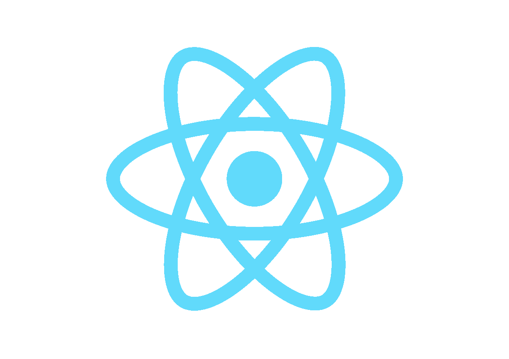
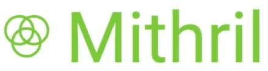
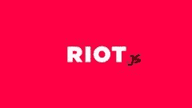
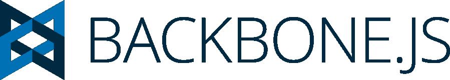
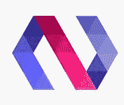

# 2023 年的最佳角度选择[更新]

> 原文：<https://hackr.io/blog/top-angular-alternatives>

Angular 是最流行的 JavaScript 框架之一，被 Paypal、Upwork、Nike、Google、Sony、HBO 等公司使用。谷歌开发的网络应用于 2009 年发布，名为 AngularJS。但该框架的第二个版本被重命名为 Angular，最初于 2014 年发布，并进行了不同的预览，以在 2016 年完全发布。Angular 的最新版本是 2018 年 5 月发布的 6.0.0，它更专注于工具链，而不是底层框架。尽管 Angular 的受欢迎程度与日俱增，但它并不缺少自己的缺点。

## **顶角选择**

为了帮助新手和专家开发者，我们在 2023 年为你带来了顶级的角度选择。

## **1。奥雷利亚**

被它的创造者称为“下一代 UI 框架”的 Aurelia 由于它的一些特性而非常受欢迎。尽管 Aurelia 是一个完整的框架，但它包含了许多库，这些库与定义良好的接口协同工作，使它具有模块化和灵活性，这是 Angular 所没有的功能，因为它被理想地构建为一个整体框架，所有组件都放在一个包中。此外，不像 Angular，不需要指定视图模型的控制器。Aurelia 的灵活性使它成为一个易于使用的框架，也是 Angular 的完美替代品。

Vue.js 是一个开源框架，主要用于构建用户界面(UI)。Vue.js 于 2014 年发布，其创建理念是提取 Angular 的最佳功能，并构建一个轻量级框架。尽管 Angular 的最新版本已经达到了相当低的大小，但 Vue.js 在大小上很容易击败 Angular，因为与 angular-cli 生成的项目相比，全功能的 Vue 项目是轻量级的。说到灵活性，Vue 比 Angular 灵活得多，它让开发人员能够自由地构建他们的应用程序。最后，Vue.js 是一个容易学习的框架，不像 Angular 有一个稍微陡峭的学习曲线。

** ** 自从 React 发布以来，它已经成为一个流行的 JavaScript 库，并成为许多人的选择。React 于 2013 年发布，由脸书维护，主要用于构建用户界面。它已经成为许多开发人员的首选，他们选择 React 而不是 Angular，因为它容易学习，更灵活，更新率高，轻量级，并且脸书支持简化不同版本之间的迁移过程。由于这些特点，网飞、雅虎、Codecademy、Whatsapp 和许多其他公司都选择了 React。

**4。秘银**

## ** **  Mithril 是微型易学的 JavaScript 库，最初发布于 2014 年。它是一个小 API，只需要用户学习几个函数就可以开始使用，这使它成为许多人的首选。除了简单的学习曲线，Mithril 与 Angular 相比速度非常快，因为它运行时使用的代码量较少。定期更新使得 Mithril 的速度更快，新的插件使得编辑和格式化更加容易。

**5。暴乱**

## ** ** Riot 是一个简单的基于组件的 UI 库，提供了一些超越市场上其他竞争者的惊人特性。Riot 将定制标签融入其中，它通过相关 HTML 和 JavaScript 的组合创建了一个可重用的组件。这些标签允许开发人员使用 HTML 构建复杂的视图，这使得语法更容易理解。此外，它是轻量级的，但不会损害 UI 库所需的特性。伴随着一个可以忽略的重量，它非常容易学习，这就是为什么它在开发人员中非常受欢迎。

**6。淘汰赛**

## Knockout.js 于 2017 年初发布，作为带有模板的模型-视图-视图模型模式的独立 JavaScript 实现，它已经在开发人员的领域中占据了一席之地。淘汰赛主要在初学者中流行，因为它非常容易学习，而且入门门槛低。Knockout 的主要功能包括深度浏览器支持、便于学习的内置练习、动态模型、简单的数据绑定和内置模板支持。虽然它可能不是 Angular 的完美替代，但越来越多的开发人员正在从 Angular 重新定位为 Knockout。

Angular 之后不久发布，Backbone.js 是一个基于 Model-view-presenter(MVP)应用设计模型的 JavaScript 库。Backbone 中的集合与 JavaScript 库下划线. js 紧密集成，允许开发人员直接在 Backbone 对象上调用下划线方法(允许开发人员操作数据的函数)。此外，Backbone 非常灵活和轻量级，与 Angular 不同，它有一个更加独立的方法。因为它存在的时间比市场上大多数可用的框架都长，所以它拥有大量的追随者，并且大量的项目创建的主干网都可以在网上获得。

 Polymer 是一个开源的 JS 库，是为了使用组件构建 web 应用而创建的。它已经获得了许多稳定的版本，并且正在由 Google 开发人员和 GitHub 的许多贡献者开发。聚合物的受欢迎程度可以从网飞、艺电(EA)、可口可乐、IBM 和麦当劳等公司使用聚合物，以及 Google 服务如 Google Play Music、YouTube 及其部分 YouTube Gaming 和新的 Google Earth 来理解。这是因为它的特点，如轻量级系统，灵活的布局组件，以及易于接近的生态系统。

Ember.js 是 2011 年 12 月发布的开源 JS web 框架。它在开发人员中很受欢迎，因为它帮助他们创建可伸缩的 web 应用程序，在框架中使用常见的习惯用法。该框架基于模型-视图-视图模型(MVVM)。LinkedIn、Vine、Twitch、Chipotle、Apple Music、Discourse 等很多热门网站和应用都使用 Ember。这是因为易于理解的 API，更容易访问 jQuery 的特性和一组自动更新的模板。但是 Ember 最大的缺点是它的大小，这可能会使它在简单的项目上使用起来有些矫枉过正。

10。Sencha Ext JS

## Sencha Ext JS 是一个应用程序框架，用于为多个平台构建交互式网络应用程序。虽然它是构建单页面应用程序的完整框架，但它也可以用作在静态页面上创建动态网格的最小组件框架。尽管它是在 2007 年作为附加库扩展创建的，但新版本减少了对外部库的依赖，并使它们的使用不是强制性的。最新的更新使得这个框架既可以作为一个单独的脚本使用，也可以作为 Sencha Cmd 应用程序构建的补充。

[现代棱角分明的训练营](https://click.linksynergy.com/deeplink?id=jU79Zysihs4&mid=39197&murl=https%3A%2F%2Fwww.udemy.com%2Fcourse%2Fthe-modern-angular-bootcamp%2F)

**总结**

## 对于许多开发商来说，框架的选择可能并不重要，但最终，材料决定了建筑的强度。每个框架或库都有自己的优缺点，开发人员可以决定他们希望使用哪个框架。虽然 Angular 自发布以来已经取得了成功，但还有许多替代产品正在慢慢获得动力。

**人也在读:**

**People are also reading:**