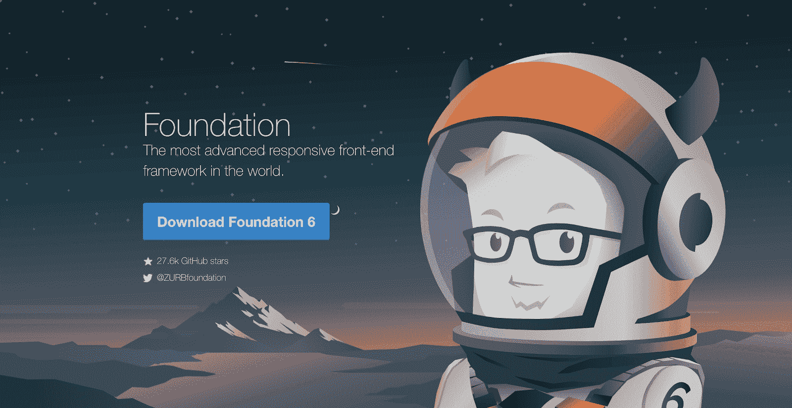
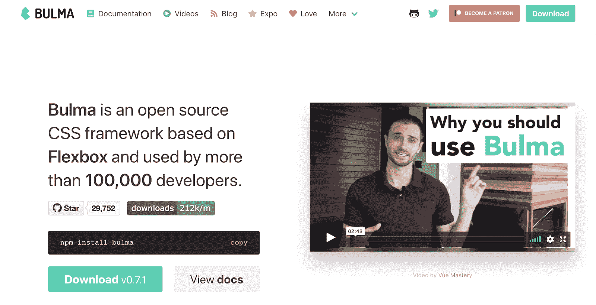
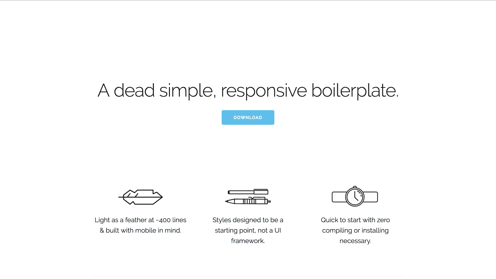
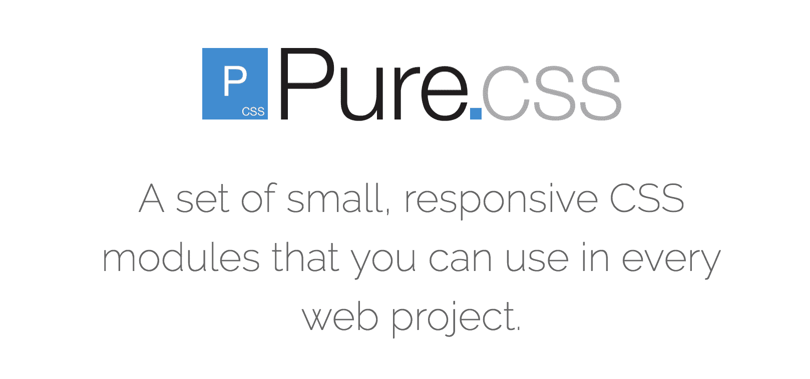
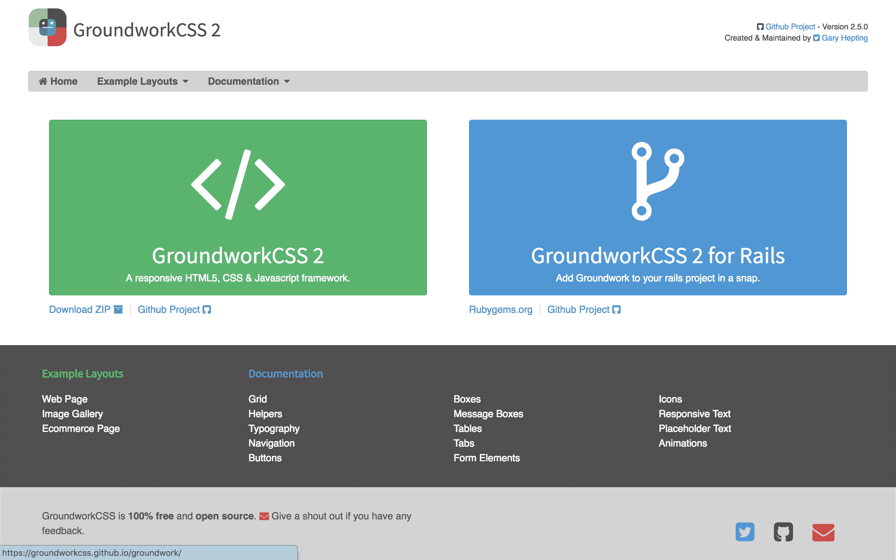
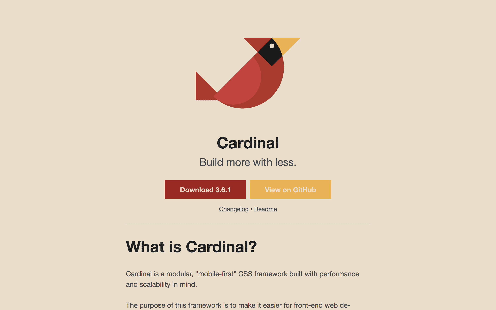
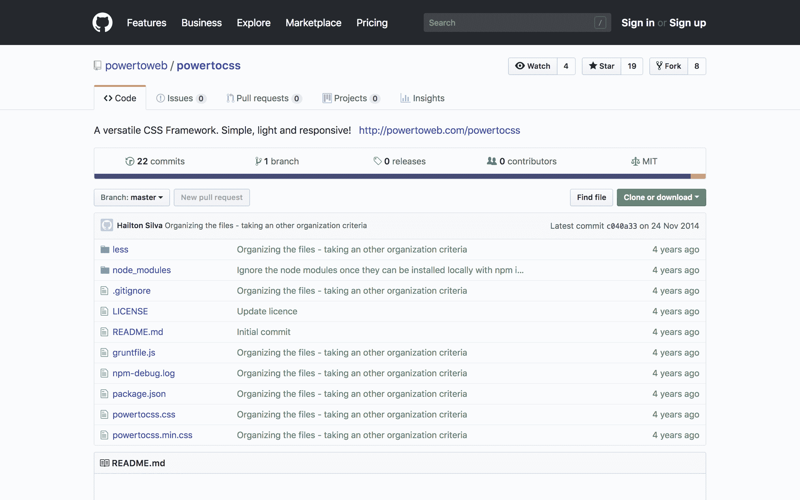
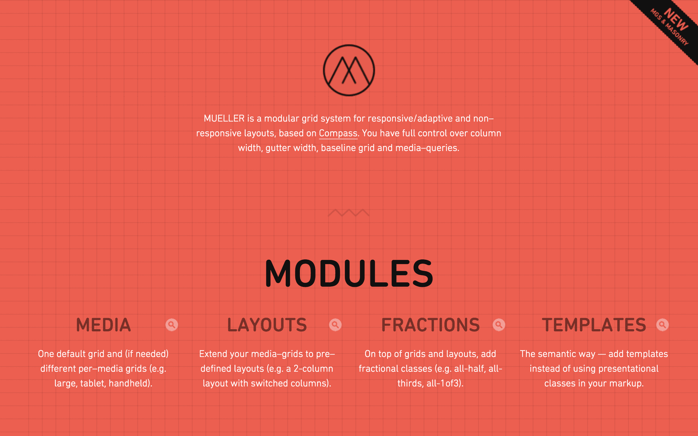
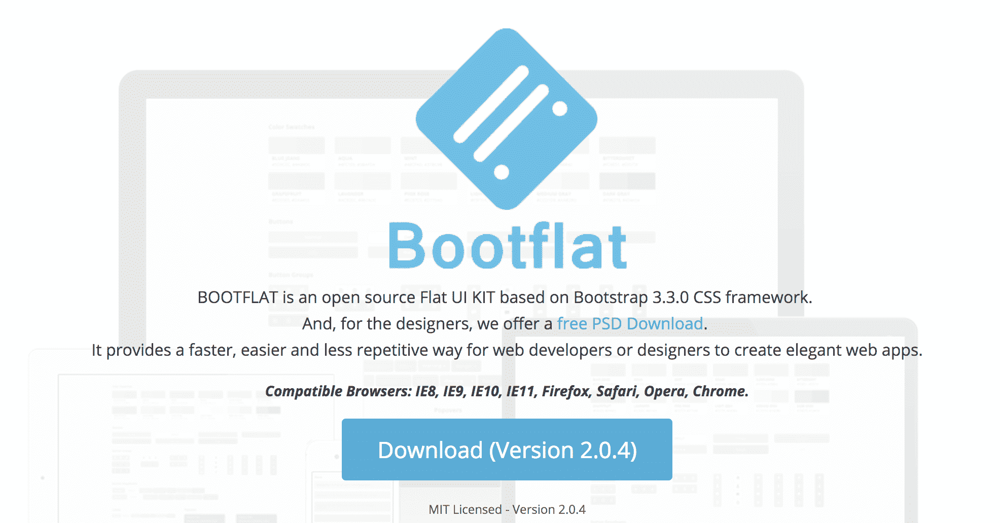
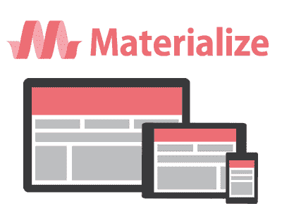

# Bootstrap 替代方案(十大最佳前端框架)

> 原文：<https://hackr.io/blog/top-bootstrap-alternatives>

很长一段时间以来，Bootstrap 一直是最流行的前端框架之一，并且在许多开发人员的列表中名列前茅。在设计出色的前端网站时，没有多少框架像 Bootstrap 一样。Bootstrap 的用户群确实非常庞大，是 GitHub 上第二大明星项目，截至 2022 年 12 月已有超过 161K 的明星。虽然 bootstrap 在它所做的事情上无疑是惊人的，但是还有一些其他的框架或 Bootstrap 替代方案；它们同样不错，可能更符合您的要求。

## 顶级自举替代方案

下面是十大前端网页设计替代方案(引导程序替代方案)供你尝试。

### **1。Zurb 基金会**

**一个适用于任何设备、媒介和可访问性的框架是他们对自己的称呼，他们当然是真实的。有了高级框架的所有好处， [Foundation](https://foundation.zurb.com/) 无疑是 Bootstrap 的最强替代方案。世界上一些最大的组织正在使用它，例如 Adobe、亚马逊、惠普、易贝等。它包含了应用程序的所有必要组件，比如响应网格、按钮、基本的排版和许多其他 UI 元素。**

 **不仅如此，他们还有“电子邮件基础”，这是一个编码响应 HTML 电子邮件的框架。因此，当你在寻找 Bootstrap 的替代品时，一定要试试 Foundation。

### **2。布尔玛**

** ** [【布尔玛】](https://bulma.io/)大约 3 年前上市，并迅速走红。它是第一个实现了成熟 flexbox 网格的 CSS 框架[之一。除此之外，它有一个巨大的组件选择需要编码任何类型的网站。布尔玛提供了一系列开箱即用的漂亮颜色，如果我们称之为市场上最漂亮的框架，这不会有错。它可以直接用来获得非常好看的网站，而不需要太多的努力。](https://hackr.io/blog/best-css-frameworks)

与 Bootstrap 和 Foundation 相比，它唯一的缺点是，它只是一个 CSS 框架，没有 JavaScript。因此，您必须编写自己的 JavaScript 或 Jquery 来切换下拉菜单或执行其他类似的基本交互。总的来说，它是 Bootstrap 的一个很好的替代品，Bootstrap 也经常更新。

### **3。骨架**

 [Skeleton](http://getskeleton.com/) 是一个轻量级的 CSS 框架，最受欢迎的是它的 12 列流体网格，由行和列组成，类似于其他 CSS 网格。新版 Skeleton 采用了移动优先的方法，这使得布局成为吸引人的中心，而不管屏幕大小如何。由于是轻量级的，Skeleton 可以加快前端开发过程。

如果你想创建一些小而简单的东西，而不需要通过大量的大型框架工具，Skeleton 是 Bootstrap 的完美替代品。Skeleton 将为开发人员提供基本组件，如按钮、列表、表单、表格等，足以让他们入门。

### **4。纯**

 [Pure.css](https://purecss.io/) 是一个 css 框架，是一堆聚集在一起的 CSS 模块。纯粹的关键在于它的分量。它是难以置信的轻量级，因为它是在考虑移动设备的情况下制作的，其中小文件大小是必不可少的。这个框架本质上纯粹是 CSS，名副其实。

它允许开发人员通过使用网格、菜单、菜单、表单、按钮等等来创建响应性布局。这个小而有用的框架在移动设备上的表现优于 Bootstrap。

[纯 HTML & CSS 从零开始](https://click.linksynergy.com/deeplink?id=jU79Zysihs4&mid=39197&murl=https%3A%2F%2Fwww.udemy.com%2Fcourse%2Fpure-html-css%2F)

### **5。基础工作**

 [基础](https://groundworkcss.github.io/)是一个响应迅速、轻量级、灵活的前端框架，它允许开发者创建可扩展和可访问的 web 应用。它利用了一个高度可配置、响应性和适应性的流体网格系统，这使得该框架能够在任何类型的屏幕上工作——手机、笔记本甚至大屏幕。

这个框架很容易定制，你可以加入自己的风格和附加功能。该框架建立在 Sass 和 Compass 之上，包括创建响应性标题、文本块和书写板所需的工具。

### **6。红衣主教**

 [Cardinal](https://cardinalcss.com/) 是一个为高性能、可伸缩性和可维护性而构建的 CSS 框架。这种“移动优先”的框架使得开发者更容易构建、扩展和维护用户界面、应用程序和响应网站。

该框架附带了许多 helper 类，用于在元素上快速应用样式，从而减少开发时间。Cardinal 还扩展了对大多数现代浏览器的支持，如 Google Chrome、Mozilla Firefox、Safari、iOS Safari 和 Android。它的移动优先方法和 CSS 盒子模型使它成为 Bootstrap 的完美替代。

### **7。动力系统**

 [powertocss](https://github.com/powertoweb/powertocss) 是一个轻量级前端框架，基于 css (SMACSS)的可扩展和模块化架构原则设计，不重复你的(干巴巴的)CSS。该框架易于学习，具有简单易懂的类名，如。按钮，。专栏等。

与市场上领先的产品相比，这个小框架的速度快得像闪电一样，并且遵循快速学习、快速加载和快速开发的原则。基于开源技术，它是可定制的，你也可以添加你自己的主题。

### **8。穆勒**

模块化响应网格系统，[穆勒](https://muellergridsystem.com/)建立在语法上令人敬畏的样式表(Sass)和 Compass(开源 CSS 创作框架)之上。Mueller 允许开发人员使用网格函数(grid())创建网格，而不是直接向元素添加类，以保持 HTML 元素的整洁。

网格系统对于创建响应性和适应性的布局特别有用，就像流行的网站 Pinterest 一样。该系统提供对列宽、媒体查询、基线网格和槽宽的全面访问，以进行定制。

### **9。靴筒**

boot flat 建立在 Bootstrap 3 的基础上，是一个开源的 CSS 框架，旨在产生令人惊叹的网页设计。使用 Bootflat 的开发人员可以更快、更容易地创建优雅的 web 应用程序，减少重复。该框架的组件是使用 HTML5 和 CSS3 构建的，它带有多个内置的配色方案，便于轻松和出色的定制。保持移动第一，Bootflat 专注于提供屏幕外导航和使用轻量级高功能插件以实现最佳性能和小尺寸。

### 10。物化

 [Materialize](https://materializecss.com/) 是基于 Google 材料设计原则的现代响应式前端框架。材料设计是谷歌创造的一种设计语言，它结合了传统的设计方法以及创新和技术。这个框架非常适合那些希望在自己的网站上融入一点材料设计而不需要任何复杂代码的开发者。它提供了卡片设计、Sass mixins、拖出式移动菜单、涟漪效果动画等等。该框架的开发人员还提供了代码示例和详细的文档来帮助新用户开始使用该框架。

## **总结**

找到正确的框架不亚于一项艰巨的任务，因为有无数的选择，但最重要的是要找到一个完全符合您需求的框架，就像拼图中的最后一块。上面列出的是前端程序员使用的最常用的自举替代方案。

文章中提到的 Bootstrap 的替代方案各有利弊，但它们可能是您项目的正确选择。即使 Bootstrap 仍然是领先的前端框架，许多替代方案现在也越来越流行。

**人也在读:****