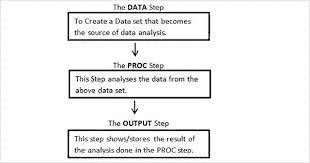
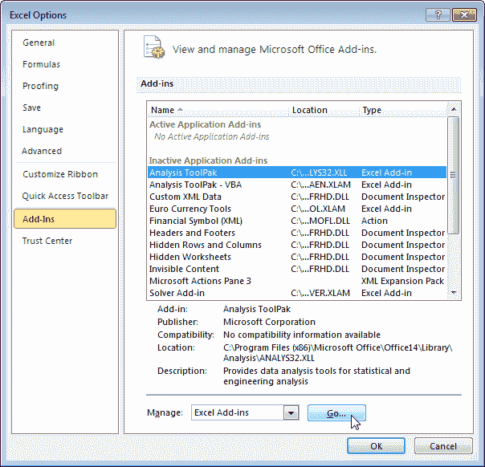
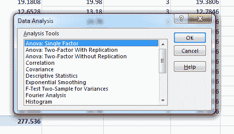
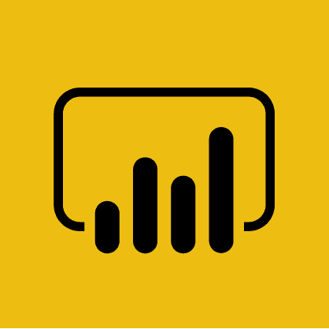
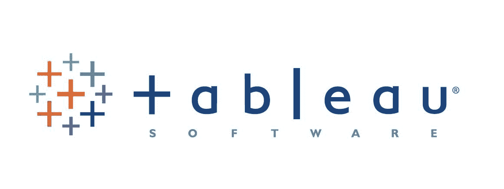

# 2023 年将使用的 7 大数据分析工具[更新]

> 原文：<https://hackr.io/blog/top-data-analytics-tools>

想象一下，你带着梦想中的度假目的地醒来，然后跳到网上探索更多关于它的信息。你搜索更多关于这个地方的信息，并喜欢阅读信息。然后，你登录到脸书。你看到了什么？你梦想中的目的地的广告会出现在屏幕的每个角落。这意味着智能数字助理会跟踪你的搜索，并为你提供可能帮助你实现梦想的额外信息。

这就是**大数据和数据分析工具**和[技术](https://hackr.io/blog/what-is-data-analysis-methods-techniques-tools#data-analysis-techniques)帮助展现隐藏但有针对性的信息世界的地方。

一项预测称——每个用户每秒将产生 1.7 兆字节的新数据。一年之内，全球将积累 44 万亿千兆字节的数据。需要对这些原始数据进行分析，以便制定业务决策、优化业务绩效、研究客户趋势以及提供更好的产品和服务。

有许多工具可以帮助这个数据驱动的决策过程，选择正确的工具对数据科学家或数据分析师来说是一个挑战。您脑海中可能会出现的常见问题有:有多少用户使用工具，学习起来有多容易，它在市场上的地位如何，如果您是企业所有者，您可能会关心这些工具的拥有成本。

以下是当今流行的 7 大数据分析工具:

1.  计算机编程语言
2.  稀有
3.  斯堪的纳维亚航空公司
4.  擅长
5.  功率 BI
6.  （舞台上由人扮的）静态画面
7.  阿帕奇火花

让我们逐一了解这些工具。

### **1。Python**

****

*   Python 最初是作为一种面向对象的编程语言设计的，用于软件和 web 开发，后来被增强用于数据科学。Python 是当今发展最快的编程语言。
*   它是一个强大的数据分析工具，并且有一套非常友好的库，可用于科学计算的任何方面。
*   Python 是免费的开源软件，而且很容易学。
*   Python 的数据分析库 Pandas 是建立在 NumPy 之上的，NumPy 是 Python 中最早的数据科学库之一。

有了熊猫，你可以做任何事情！您可以使用数据框执行高级数据操作和数值分析。

熊猫支持多种文件格式；例如，您可以将 Excel 电子表格中的数据导入到处理集中进行时序分析。(根据定义，时间序列分析是一种分析时间序列数据的统计技术，即以一定时间间隔收集的数据)

Pandas 是一个强大的工具，用于数据可视化、数据屏蔽、合并、索引和分组数据、数据清理等等。

要了解更多关于熊猫的信息，请查看 Python 熊猫教程。

*   其他库，如 Scipy、Scikit-learn、StatsModels，用于统计建模、数学算法、机器学习和数据挖掘**。**
*   Matplotlib、seaborn 和 vispy 是用于数据可视化和图形分析的包
*   Python 有广泛的开发人员社区支持，是使用最广泛的语言
*   使用 Python 进行数据分析的顶级公司有 Spotify、网飞、美国宇航局、谷歌和欧洲核子研究中心等等

### **2。R**

*   r 是统计建模、可视化和数据分析的领先编程语言。它主要被统计学家用于统计分析、大数据和机器学习。
*   r 是一种免费的开源编程语言，并且以用户编写的包的形式对它进行了许多增强
*   r 有一个陡峭的学习曲线，需要一些编码的工作知识。然而，就语法和一致性而言，它是一种很棒的语言。
*   谈到 EDA，r 是赢家(根据定义——在统计学中，探索性数据分析(EDA)是一种分析数据集以总结其主要特征的方法，通常采用可视化方法)。
*   使用 plyr、dplyr 和 tidy 等包，R 中的数据操作很容易。
*   当使用 ggplot、lattice、ggvis 等包进行数据可视化和分析时，r 是非常优秀的。
*   r 有一个庞大的开发者社区来提供支持。
*   r 由使用

*   **脸书-** 用于与状态更新和个人资料图片相关的行为分析。
    *   **Google -** 用于广告效果和经济预测。
    *   **Twitter -** 用于数据可视化和语义聚类
    *   **优步-** 进行统计分析
    *   要了解更多关于 R 的信息，您可以[访问此处](https://hackr.io/tutorials/learn-r?ref=blog-post):

【2023 年数据科学课程:完整的数据科学训练营

**3。SAS**

### ****

SAS 是一个统计软件套件，广泛用于 BI(商业智能)、数据管理和预测分析。

*   SAS 是专有软件，公司需要付费使用。免费的大学版已经推出，供学生学习和使用 SAS。
*   SAS 有一个简单的 GUI 因此很容易学习；然而，良好的 SAS 编程知识是使用该工具的额外优势。
*   SAS 的数据步骤(数据步骤是创建、导入、修改、合并或计算数据的地方)有助于低效的数据处理和操作。SAS 的数据分析流程如下所示:
*   

SAS 的可视化分析软件是一个强大的工具，用于交互式仪表盘、报告、BI、自助服务分析、文本分析和智能可视化。

*   SAS 广泛应用于制药行业、商业智能和天气预报。

*   由于 SAS 是一项付费服务，它有 24X7 的客户支持来帮助解决您的疑问。
*   谷歌、脸书、网飞、推特是使用情景应用程序的几家公司。
*   SAS 用于诺华和 Covance 的临床研究报告，花旗银行、苹果、德勤以及更多的公司使用 SAS 进行预测分析
*   **4。Excel**

### ****

Excel 是一个电子表格，是一个简单而强大的数据收集和分析工具。

*   Excel 不是免费的；它是 Microsoft Office 程序“套件”的一部分。
*   Excel 不需要用户界面来输入数据；你可以马上开始。
*   它容易获得，广泛使用，易于学习和开始数据分析
*   Excel 中的数据分析工具库提供了多种选项来对数据进行统计分析。Excel 中的图表和图形为您的数据提供了清晰的解释和可视化，这有助于决策，因为它们易于理解。
*   需要在 Excel 中启用和配置分析工具库功能，如图所示。

设置好工具库后，您将看到工具列表。您可以根据您的目标和想要分析的信息来选择工具。

全世界有超过 7.5 亿用户使用 Excel。

*   **5。功率 BI**

### ****

Power BI 是微软的另一个强大的商业分析解决方案。

*   Power BI 有三个版本–桌面版、专业版和高级版。桌面版对用户免费；但是，Pro 和 Premium 是定价版本。
*   您可以可视化您的数据连接到许多数据源，并在整个组织内共享结果。
*   借助 Power BI，您可以通过实时仪表盘和报告让您的数据栩栩如生。
*   Power BI 与包括 Microsoft Excel 在内的其他工具相集成，因此您可以快速上手，并与现有解决方案无缝协作。
*   Gartner 表示——微软是分析和商业智能平台魔力象限的领导者

*   使用 Power BI 的顶级公司有雀巢、天纳克、艺康等。

*   了解更多 Power BI，可以点击[链接](https://powerbi.microsoft.com/en-us/what-is-power-bi/)。

**6。表**

### ****

Tableau 是为数据分析师开发的 BI(商业智能)工具，用户可以在其中可视化、分析和理解他们的数据。

*   Tableau 不是自由软件，价格根据不同的数据需求而变化
*   学习和部署 Tableau 很容易
*   了解和学习 Tableau，可以访问[链接](https://click.linksynergy.com/link?id=jU79Zysihs4&offerid=1045023.2107526&type=2&murl=https%3A%2F%2Fwww.udemy.com%2Fcourse%2Ftableau-for-beginners-a-course-to-accelerate-your-career%2F)。

Tableau 提供快速分析；它可以探索任何类型的数据–电子表格、数据库、Hadoop 上的数据和云服务

*   它很容易使用，因为它有一个强大的拖放功能，任何有直觉思维的人都可以处理。
*   智能仪表板的数据可视化可以在几秒钟内共享。
*   使用 Tableau 的顶级公司有亚马逊、花旗银行、巴克莱、LinkedIn 等等。
*   **7。阿帕奇火花**

### ****

Spark 是为开发人员、研究人员和数据科学家设计的大数据处理集成分析引擎。

*   它是免费的、开源的，众多开发者为其开发做出了贡献
*   这是一个高性能的工具，适用于批处理和流数据。
*   学习 Spark 很容易，您也可以从 Scala、Python、R 和 SQL shells 中交互使用它。
*   Spark 可以运行在任何平台上，如 Hadoop、Apache Mesos、独立平台或云中。它可以访问不同的数据源。

*   Spark 包括如下库

*   对于 SQL 和结构化数据
    *   机器学习- MLlib
    *   实时数据流处理-火花流
    *   图表分析。
    *   优步、Slack、Shopify 和许多其他公司使用 Apache Spark 进行数据分析。
*   要了解和学习 Apache Spark，可以[访问链接](https://hackr.io/tutorials/learn-apache-spark?ref=blog-post)。

摘要

## 我现在肯定了；你会对数据分析工具有相当的了解。为了在您的数据分析之旅中继续前进并寻找合适的工具，您需要投入相当多的时间来了解您和/或您的组织的数据需求，然后搜索分析市场上可用的各种工具，然后做出决定。

**人也在读:**

**People are also reading:**