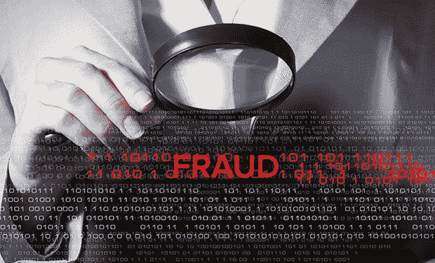
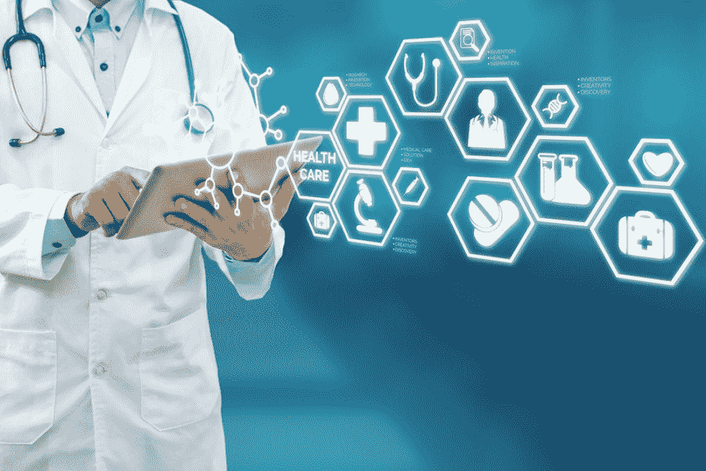
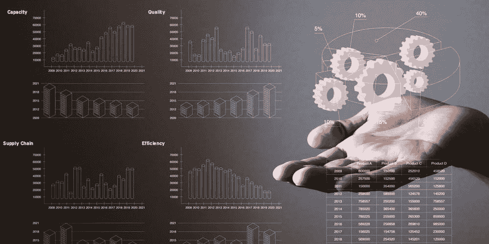
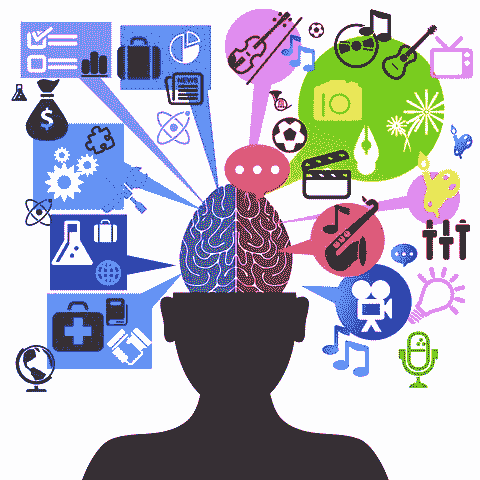

# 2023 年十大数据科学应用[更新]

> 原文：<https://hackr.io/blog/top-data-science-applications>

## 介绍

数据科学是大数据的一个领域，它评估大量复杂的数据，并提供对数据的重要见解。该领域一直主导着今天的大多数行业，并已成为工业的燃料。它塑造了一个新世界，彻底改变了感知数据的方式。它已经成为全球的新趋势，包括各种医疗保健、银行、电子商务、制造业等等。它有许多相关的数据科学应用程序。亚马逊、谷歌和脸书等大数据巨头将数据科学概念用于其组织的业务洞察和决策。这篇文章解释了最好的数据科学应用。让我们看一看。

## **顶级数据科学应用**

### **1。欺诈和风险检测**

Finance made 是数据应用领域的新成员。金融和数据科学密切相关，就像数据科学一样，金融也与数据有关。早期的公司有大量的文书工作来启动批准贷款、维持贷款、招致损失和负债。所以数据科学实践被认为是解决方案。为了分析风险概率，他们学会了通过客户档案、过去的支出和其他必要的变量来分离数据。这也有助于根据客户的购买力推销他们的银行产品。另一个应用可能是客户组合管理通过数据科学的商业智能[工具分析数据趋势。](https://hackr.io/blog/data-science-tools) [数据科学](https://hackr.io/blog/what-is-data-science)也引入算法训练；金融机构可以通过严格的数据分析做出数据驱动的决策。因此，使用户的客户体验更好，因为通过对客户体验的广泛分析和偏好的修改，金融机构可以与他们的客户建立个性化的关系。

### **2。医疗保健**

医疗保健领域的各种行业利用数据科学来获得有价值的见解。让我们来研究这些热门行业，以及它们如何与数据科学相结合，以使其成果富有成效。

#### **2.1。图像分析和诊断**

传统上，医学图像由医生自己研究，在病人的报告中寻找发现异常的线索。最终，核磁共振成像、x 光和 CT 扫描对分析医学图像产生了影响。随着计算技术的进一步发展和数据的激增，已经创建了机器和图像识别工具来自动检测图像中的缺陷。不同的方法和框架，如 MapReduce，可以帮助医生进行手术和诊断各种疾病，如检测肿瘤、器官描绘等。

#### **2.2。遗传学和基因组学研究**

遗传学和基因组学研究出现了新的转折，并倾向于通过数据科学整合进行更好的数据分析的高级治疗水平。数据科学帮助生物信息学家和遗传学家分析基因对各种药物的反应。它旨在了解和研究 DNA 对个人健康的影响，试图找到疾病、基因和药物反应之间的生物学联系。众所周知，MapReduce 等大数据技术可以显著减少基因组测序的处理时间。

#### **2.3。药物发现和开发**

探索和发现一种新药需要多年的研究和测试，直到它进入生产阶段，并最终获准进入药店和医院为患者服务。该过程还涉及时间和金钱方面的大量支出。数据科学通过显著简化和缩短流程，对药品生产产生了重大影响。

它提供了特定的算法，使我们能够及时了解新发现药物的成功率。

【2023 年数据科学课程:完整的数据科学训练营

### **3。图像识别和语音识别**

数据科学算法统治着语音和图像识别领域。我们可以在日常生活中遇到这些算法的伟大作品。有没有发现自己正在从谷歌助手、Alexa 或 Siri 等虚拟语音助手那里获得帮助？嗯，它的语音识别算法在系统背后工作，试图理解和评估你的话，并返回你使用的富有成效的结果。图像识别也可以遍布你的社交媒体网站，如脸书、Instagram 和 Twitter。这些应用程序可以识别你名单上的人，并在你上传他们的照片时给他们加标签。

### **4。航线规划**

西南航空公司、阿拉斯加航空公司等公司已经开始在航班处理中引入数据科学，以带来工作方式的新变化。早期的航空公司由于燃料价格上涨遭受了巨大的损失，因为他们很难保持入住率和营业利润。借助数据科学，航空公司可以考虑战略改进，如预测航班延误、决定购买的飞机、规划航线和中途停留，以及营销战略，如客户忠诚度计划。

### **5。游戏**

****

它们也是机器和数据科学算法，随着玩家在游戏中进入更高的级别，它们会将自己升级到一个新的级别。该算法被设计和开发来分析游戏者以前的表现并相应地塑造游戏。在这种算法的帮助下，Zynga、EA Sports 等顶级游戏工作室已经完全升级到一种新的体验。

### **6。银行业**

数据科学使全球的银行更加安全，并更有效地管理其资源。它还使他们能够做出更明智、更具战略性的决策，避免遭受欺诈。它还有助于管理客户数据、风险分析和建模、预测分析等等。

数据科学允许银行家评估客户的终身价值，允许他们监控并由此得出一些预测，并分析客户对其业务的投资模式。机器学习算法实时改进分析策略。

### 7 .**。电子商务**

数据科学算法和机器学习概念，如自然语言处理和推荐系统，极大地有利于电子商务市场。电子商务平台可以使用这种技术研究客户购买和反馈，以获得对其业务发展的有力见解。他们利用自然语言处理来分析文本和在线调查。它用于协作和基于内容的过滤，以分析数据并为客户提供更好的服务。

数据科学影响数据科学行业的其他方式包括识别客户群、预测商品和服务、识别流行产品的风格、优化定价结构等等。

### **8。制造**

数据科学家是制造业中新的工厂劳动力，因此在制造业和零售业中获得了至关重要的地位。它通过使用强化学习等机器学习技术引入强大的机器，减少了多余的工作岗位。此外，与物联网(IoT)等技术的集成让行业能够预测潜在问题、监控系统并分析持续的数据流。让我们看看数据科学如何影响制造业:

*   优化能源成本和生产时间。
*   根据客户评论改进决策和提高产品质量。
*   使用历史和实时数据构建一个自治系统，以提升生产线。

### **9。运输**

数据科学给我们在交通领域带来的最重要的进步或发展是引入自动驾驶汽车。数据科学通过对燃料消耗模式、驾驶员行为和车辆监控的广泛分析，在交通领域建立了一个据点。它通过为驾驶员提供更安全的驾驶环境、优化车辆性能、增加驾驶员的自主性等等而闻名。通过强化学习和引入自主，汽车制造商可以创造智能汽车和更好的物流路线。像优步这样受欢迎的出租车服务使用数据科学来使用各种变量，如客户概况、位置、经济指标和物流供应商，以优化价格和交付路线以及资源的合理分配。

### 10。教育

数据科学在培养一个人的学术、非学术和社交技能方面发挥着至关重要的作用。它提供了衡量教师绩效、监控学生需求的工具。它在教育中扮演着不同的角色，大学正在利用它们来创新课程。

## **结论**

总之，数据科学已经在教育、银行、金融、制造等每个行业留下了印记，以使他们的产品和服务更好地为客户服务。由于如此多样的数据科学应用，在竞争激烈的世界中，行业需要保持更新，并随着技术向前发展。我希望你觉得这篇文章很有趣。在下面的评论里分享吧！您是否有其他数据科学应用来分享数据科学的应用？

**人也在读:**