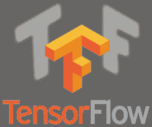

# 十大数据科学 Python 库[更新]

> 原文：<https://hackr.io/blog/top-data-science-python-libraries>

[学习 Python](https://hackr.io/tutorials/learn-python?ref=blog-post) 为了建立职业生涯，必须学习 Python 库。Python 库是帮助完成特定任务的函数和方法的集合。此外，它节省了开发人员大量的时间和头痛。

不同的 Python 库有不同的用途。例如，Python 图像库，或 PIL，就是用于图像处理的。另一方面，我们有 TensorFlow 库，这对使用 Python 开发和训练深度学习模型很重要。

由于 Python 库的范围更广，我们将这篇文章分成两部分。这一篇将涵盖 10 大数据科学 Python 库，而第二篇将解释 10 大通用 Python 库。

## **十大数据科学 Python 库——由 Python 开发者调查支持**

到目前为止，有几个数据科学 Python 库可用。虽然其中一些已经很受欢迎，但其他一些正在逐步改进，以达到同龄人的接受水平。

我们用 [Python 开发者调查 2018](https://www.jetbrains.com/research/python-developers-survey-2018/) 来支持我们的十大 Python 库名单。这是 Python 软件基金会和 JetBrains 共同努力的结果。

来自 150 多个国家的 2 万多名开发者参与了 2018 年 Python 开发者调查，并得出了调查结论。所以，这里是 10 大 Python 数据科学库:

**主要意图** **:** 机器学习 **次要意图** **:** 将图像、其他二进制原始流和声波表示为 N 维数组中的实数数组

NumPy 是一个用于科学计算的基本 Python 库。它支持强大的 N 维数组对象和广播功能。

此外，NumPy 还提供傅立叶变换、随机数功能以及用于集成 C/C++和 Fortran 代码的工具。对于参与使用 Python 的机器学习项目的全栈开发人员来说，拥有 NumPy 的工作知识是必不可少的。

**人们还读到: [Numpy 矩阵乘法](https://hackr.io/blog/numpy-matrix-multiplication)**

一个有趣的事实是，TensorFlow 和其他几个机器学习 Python 库在内部利用 NumPy 对张量执行多重操作。NumPy 最好也是最重要的特性是数组接口。

**亮点:**

*   易于使用和互动
*   开源贡献和大量的社区支持
*   简化复杂的数学实现过程

### 熊猫

**主要意图** **:** 在 Python 中完成实际的、真实世界的数据分析 **次要意图** **:** 无

使用 Pandas 库使开发人员更容易、更直观地处理标签数据或关系数据。它提供了富有表现力的、快速的和灵活的数据结构。Pandas 旨在成为使用 Python 进行真实世界数据分析的基础高级构建模块。

Pandas 最强大的功能之一就是只用一两个命令就能翻译复杂的数据操作。此外，机器学习库不缺乏用于组合、过滤和分组数据的内置方法。它还具有时序功能。

**亮点:**

*   能够执行定制类型的操作
*   确保数据操作的整个过程更加容易
*   与其他 Python 库和工具一起使用时，提供高度的灵活性和功能性
*   出色的速度指标
*   为应用方法选择最适合的输出
*   支持聚合、连接、迭代、重新索引和可视化操作

### **Matplotlib**

**主要意图** **:** 2D 策划 **次要意图** **:** 以多种硬拷贝格式制作出版物质量的数字

Matplotlib 是一个用于 [Python 编程](https://hackr.io/blog/python-programming-language)语言的二维绘图库。它能够以不同的硬拷贝格式和交互式跨平台环境制作高质量的图形。

除了用于 Python shell、 [Python 脚本](https://hackr.io/blog/how-to-run-python-script) 和 IPython shell 之外，Matplotlib 还可以用于:

*   Jupyter 笔记型电脑
*   网络应用服务器
*   GUI 工具包；GTK+、Tkinter、Qt 和 wxPython

根据 Matplotlib 官网的说法，Python 库试图“让简单的事情变得简单，让困难的事情变得可能。”2D 绘图 Python 库允许生成条形图、误差图、直方图、曲线图、散点图等。代码行更少。

**亮点:**

*   完全控制轴属性、字体属性、线条样式等。通过面向对象的接口
*   散点图例
*   提供了一个类似 MATLAB 的界面，用于简单绘图
*   辅助 x/y 轴支架
*   适用于多种图形后端和操作系统

### **轨道**轨道

**初级意图** **:** 机器学习，科学编程 **次级意图** **:** 求解数学函数

SciPy Python 库附带了许多用于集成、线性代数、优化和统计的模块。开源 Python 库允许开发人员和工程师使用傅立叶变换、ODE 解算器、信号和图像处理等等。

SciPy 使用 NumPy 数组作为基本的数据结构。各种 SciPy 子模块提供的所有功能都有很好的文档记录。因此，使用[机器学习库](https://hackr.io/blog/best-machine-learning-libraries)很容易上手。

**亮点** :

*   轻松处理数学运算
*   使用子模块提供高效的数值例程，如数值积分和优化
*   支持信号处理

### 推荐 Python 课程

[用 Python 完成从零到英雄的 Python boot camp](https://click.linksynergy.com/deeplink?id=jU79Zysihs4&mid=39197&murl=https%3A%2F%2Fwww.udemy.com%2Fcourse%2Fcomplete-python-bootcamp%2F)

### **Scikit-Learn**

**主要意图** **:** 数据分析和数据挖掘 **次要意图** **:** 无

Scikit-Learn 被认为是处理复杂数据的最佳 Python 库之一，它建立在 Matplotlib、NumPy 和 SciPy 库之上。机器学习 Python 库提供了一系列简单而高效的工具来完成数据分析和挖掘任务。

Scikit-Learn 是发展最快的 Python 库之一。几个训练方法，比如逻辑回归和最近邻，已经在版本中得到了一些小的改进。

Scikit-Learn 最新版本的另一个重要改进是交叉验证功能，它允许使用多个指标。

Scikit-Learn 提供了许多用于实现数据挖掘和机器学习任务的算法，特别是分类、聚类、模型选择、降维以及回归。

**亮点:**

*   从图像和文本中提取特征的能力
*   可在多种环境中重复使用
*   检验监督模型对未知数据准确性的几种方法
*   广泛的算法，包括聚类、因子分析、主成分分析到无监督神经网络

**主要意图** **:** 开发、训练和设计深度学习模型 **次要意图** **(s):** 执行数值计算

任何参与使用 Python 的机器学习项目的人都必须至少听说过 TensorFlow。它由 Google 开发，是一个使用数据流图进行数值计算的开源符号数学库。

典型 TensorFlow 数据流图中的数学运算由图节点表示。另一方面，图边表示多维数据数组，也称为张量，在图节点之间流动。

TensorFlow 标榜灵活的架构。它允许 Python 开发人员将计算部署到桌面、移动设备或服务器中的一个或多个 CPU 或 GPU，而无需重写代码。TensorFlow 中创建的所有库都是用 C 和 C++编写的。

广泛使用的谷歌产品，如谷歌照片和谷歌语音搜索，都是使用 TensorFlow 构建的。这个库有一个复杂的 Python 前端。Python 代码将被编译，然后在 TensorFlow 分布式执行引擎上执行。

**亮点:**

*   允许训练多个神经网络和多个 GPU，使得模型对于大规模系统非常有效
*   可在 CPU 和 GPU 上轻松训练，用于分布式计算
*   可操作性方面的灵活性，这意味着 TensorFlow 提供了取出您想要的部分并留下您不需要的部分的选项
*   社区和开发者的大力支持
*   与其他数据科学 Python 库不同，TensorFlow 简化了图形每个部分的可视化过程

### **Keras**

**主要意图** **:** 开发和训练深度学习模型，深度学习研究 **次要意图** **:** 处理图像和文本数据

被认为是最酷的机器学习 Python 库之一，Keras 提供了一种更简单的表达神经网络的机制。它还具有编译模型、处理数据集、可视化图形等强大功能。

用 Python 编写的 Keras 能够运行在 CNTK、TensorFlow 和 Theano 之上。Python 机器学习库的开发主要着眼于允许快速实验。所有 Keras 型号都是便携式的。

与其他 Python 机器学习库相比，Keras 速度较慢。这是因为它首先使用后端基础设施创建一个计算图，然后使用它来执行操作。Keras 在做创新研究时非常有表现力和灵活性。

**亮点:**

*   完全基于 Python 使得调试和探索更加容易
*   本质上模块化
*   神经网络模型可以结合起来开发更复杂的模型
*   在 CPU 和 GPU 上都能流畅运行
*   支持神经网络的几乎所有模型，包括卷积、嵌入、全连接、池化和递归

### **Seaborn**

**一级意图** **:** 数据可视化，用 Python 制作统计图形 ****:**无**

 **Seaborn 基本上是一个 Python 的数据可视化库，建立在 Matplotlib 库之上。此外，它与 Pandas 数据结构紧密集成。Python 数据可视化库提供了一个高级界面，用于绘制有吸引力且信息丰富的统计图。

Seaborn 的主要目标是让可视化成为探索和理解数据的重要部分。它的面向数据集的绘图功能对包含整个数据集的数组和数据框进行操作。该库是检查多个变量之间关系的理想工具。

Seaborn 在内部执行所有重要的语义映射和统计聚合，以生成信息丰富的图。Python 数据可视化库还提供了在调色板中进行选择的工具，有助于显示数据集中的模式。

**亮点:**

*   自动估计以及线性回归模型的绘制
*   复杂数据集整体结构的舒适视图
*   使用构建多地块网格的高级抽象简化复杂的可视化构建
*   用于可视化二元或一元分布的选项
*   专门支持使用分类变量

### **NLTK**

**主要意图** **:** 自然语言处理 **次要意图** **:** 实证语言学、信息检索、机器学习

NLTK 是自然语言工具包的缩写，是一套用 Python 实现符号和统计 NLP 的库。Python 库包括图形演示和样本数据。NLTK 附有一本书和一本食谱，以便更容易入门。

除了用作原型和构建研究系统的平台，NLTK 还被广泛地用作教学工具和个人学习工具。

NLTK 提供对分类、解析、语义推理、词干分析、标记和记号化功能的支持。

**亮点:**

*   附带一个词性标签
*   n-gram 和搭配
*   命名实体识别
*   支持词法分析

### **Gensim**

**主要意图:**自然语言处理、无监督主题建模、文档索引

****:**信息检索**

 **使用现代统计机器学习，Gensim 可用于完成自然语言处理和无监督主题建模任务。除了 Python，NLP 库也可以在 Cython 中实现，以增强性能和可伸缩性。

Gensim 是专为通过数据流和增量在线算法处理大型文本集合或语料库而开发的。Gensim 最显著的特点是，与同时代的产品不同，它不仅仅针对内存处理。

**亮点:**

*   doc 2 vec、fastText 和 word2vec 算法的流并行实现
*   支持潜在狄利克雷分配、潜在语义分析、非负矩阵分解、随机投影和 tf-idf

**全部抓起来！**

这总结了十大数据科学 Python 库的列表。随着数据科学和机器学习的兴起，Python 数据科学库也在不断进步。此外，更新的 Python [机器学习库](https://hackr.io/blog/best-machine-learning-libraries)正在开发中。

完成较小的数据科学项目可能需要使用一个 Python 数据科学库。然而，成熟的数据科学和研究项目需要大量 Python 数据科学库的工作知识。所以学的越多越好！

想更好地学习数据科学？或者希望消化新的数据科学概念？今天就来看看这些 [最佳数据科学教程](https://hackr.io/tutorials/learn-data-science?ref=blog-post) ！

**人也在读:******