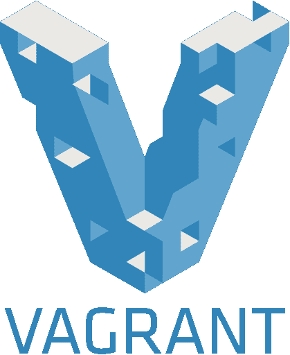
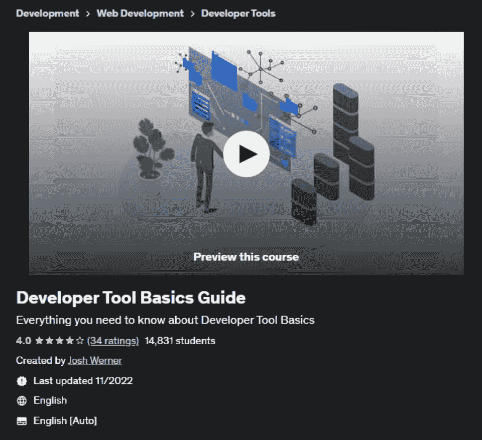

# 2023 年十大开发运维工具[更新]

> 原文：<https://hackr.io/blog/top-devops-tools>

作为技术界的一个核心概念，DevOps 是软件开发和操作相遇的地方，以确保持续集成(CI)和交付(CD)。对于那些不熟悉这个概念的人来说，DevOps，如果用外行的话来说，就是:

软件工程师和操作工程师在整个软件开发周期(从构思到生产支持)中作为统一战线工作的过程组合。

最初，开发和服务被认为是两个独立的实体，负责处理软件周期中的不同方面。然而，存在许多孤立的挑战，例如增加的开发时间、低吞吐量等。因为这个而面临。

增加生产时间、改善沟通、降低成本和部署失败是 DevOps 背后的主要推动因素。对于一家完全利用 DevOps 的公司来说，他们需要关注五个主要流程，即通信、CI/CD、配置管理、安全性以及监控和警报。

随着技术的进步，已经开发了许多 DevOps 工具来简化协作和开发。为了帮助您完善 DevOps 战略，我们提到了您应该在 2023 年使用的 10 个顶级 DevOps 工具。

### 1.松弛的

于 2013 年推出的 Slack 仍然是团队在项目中有效协作的顶级沟通工具之一。全球各地的技术组织都在使用 DevOps 工具库中的这个工具来消除障碍，并为所有团队成员提供对工作流的清晰洞察。Slack 的一个令人兴奋的特性是，它允许开发人员在与其他维护和服务成员交流的相同环境中使用工具链进行协作。

### 2.詹金斯

作为一个开源的持续集成服务器，Jenkins 自动化了一个软件项目的整个构建周期。这个工具的 USP 是它提供的管道特性，开发人员可以利用它自动将代码提交到存储库中，运行测试用例，以及获取测试后获得的报告。

这个高度可定制的工具提供了即时的反馈，因此如果一个特定的 sprint 导致了一个坏的构建或者损害了构建，它会警告你。使用 Jenkins 可以自动完成 [SDLC](https://hackr.io/blog/sdlc-methodologies) 中涉及的大多数任务和工具，从而允许团队成员提高他们的生产能力。

3.码头工人

### Docker 是一种处于容器化中心的工具，这种趋势在 IT 界正迅速发展。Docker 允许安全打包、部署和运行应用程序，而不考虑运行环境。每个应用程序容器都包含源代码、支持文件、运行时、系统配置文件等。负责应用程序的执行。

使用 Docker 引擎，可以访问容器，容器又可以在远程环境中执行应用程序。该应用使组织能够降低基础设施成本。根据一份报告，三分之二尝试过该应用程序的公司在使用后的 30 天内采用了它。

4.幽灵

### 软件的安全性是任何 DevOps 团队首要关注的问题之一。因此，Phantom 工具对于希望从 SDLC 一开始就构建可防御的基础设施的开发人员来说是一个巨大的帮助。

使用 phantom 工具，您可以在一个集中的环境中就一个事件进行协作，同时还能意识到不断增加的安全威胁。该工具还为 DevOps 专业人员提供了一个选项，可以使用文件引爆、设备隔离等技术即时降低此类风险。

5.纳吉奥斯

### 与 Phantom 类似，Nagios 也是一个监控工具，它倾向于监视应用程序、服务器以及您的整体业务基础设施。该工具对于拥有无数电路(路由器、服务器、交换机等)的大型组织来说是一个巨大的帮助。)在后端。它会在后端发生特定故障或任何设备出现故障时提醒用户。它还定期维护性能图表并监控趋势，以提醒用户可能发生的故障。

6.无赖

### 
流浪者是一个在单个工作流中管理和使用虚拟机的工具。使用 vagger，团队成员可以共享软件运行环境，并且可以更快地测试应用程序，而不必浪费时间来设置配置。

该工具确保特定项目的环境在每个开发人员的机器上保持相同，并且“在我的系统上运行”的借口可以被扔出窗外。

7.Ansible

### Ansible 是市场上最简单有效的 IT 协调和配置管理工具之一。与 Puppet 和 Chef 等功能丰富的竞争对手相比，Ansible 的外观更加柔和，不会在后台占用你的设备资源。

该工具主要用于在现有系统中推动新的变化，以及配置新部署的机器。降低基础设施的成本和提高可扩展性的复制速度仅仅是使其成为 IT 公司绝对青睐的两个原因。

8.开源代码库

### GitHub 于 2000 年推出，至今仍是易于协作的顶级 DevOps 工具之一。使用这个工具，开发人员可以对代码进行快速迭代，迭代通知会即时发送给其他团队成员。如果出现任何错误或后果，可以在几秒钟内立即回滚到以前的版本，这要归功于工具中连续存储的分支更改历史。

9.哨兵

### 优步和微软等公司使用的工具 Sentry 是最好的错误或 bug 检测 DevOps 工具之一。这个免费工具支持 Ruby、IOS、JavaScript 等语言。并且还内置了 SDK，可以定制以支持大多数语言和框架。

该工具持续扫描整个系统中的代码行，如果发现错误或问题，就会发送通知。它不仅突出了问题，而且提供了一个可能的解决方案的选择，只需点击一下就可以合并。

10\. BitBucket

### 与 GitHub 类似，BitBucket 也是一个帮助在整个软件开发周期中管理项目代码的工具。虽然 GitHub 仍然是顶级存储库，但人们正在转向 BitBucket，因为它的成本更低，并且具有私有存储库的功能(只有 GitHub 的付费版本才有这种功能)。虽然 BitBucket 的核心功能类似于 GitHub，但诸如与[【吉拉】](https://atlassian.sjv.io/c/2890636/1541686/17715)和 Trello 的轻松集成、内置的 CI/CD 功能等特性往往会使该工具具有 Atlassian 优势。

结论

## 这些是全球越来越多的公司采用的十大 DevOps 工具。如果你认为还有我们遗漏的更好的工具，不要忘记在下面的评论部分提到它们。

**相关开发工具课程**

**人也在读:**

**People are also reading:**