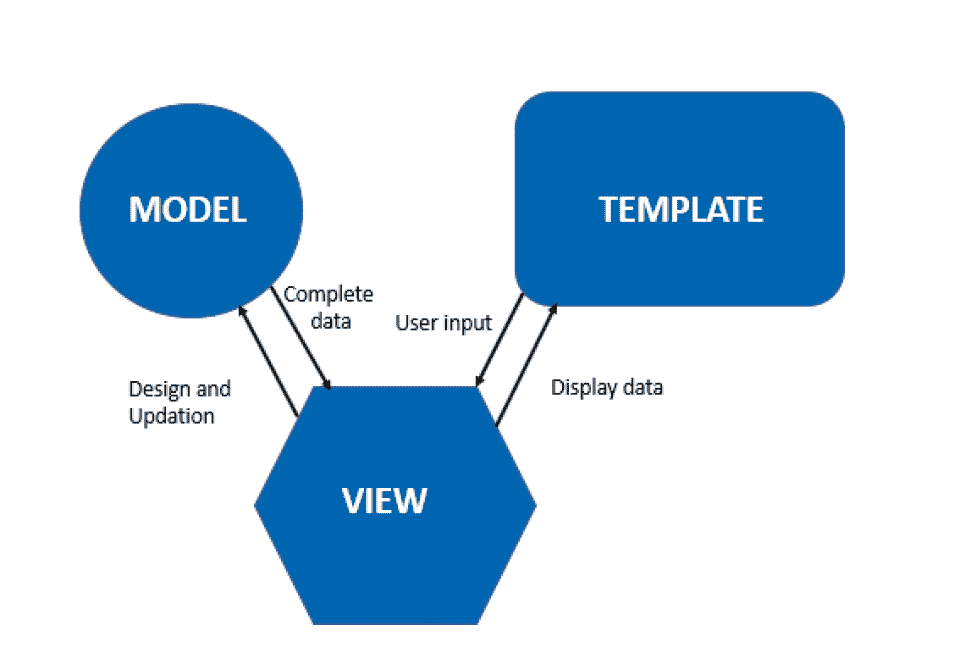
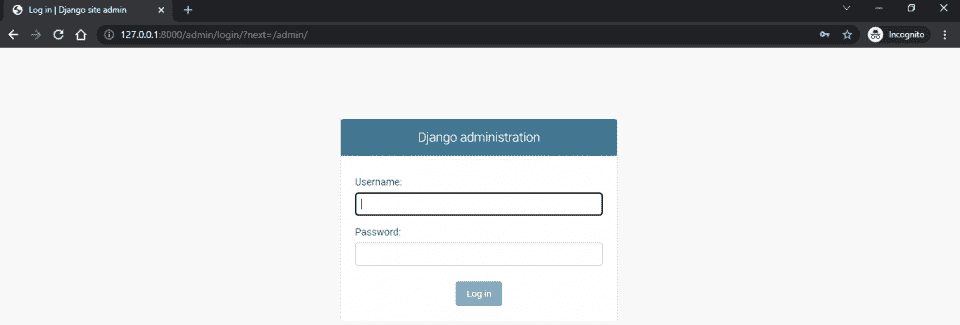
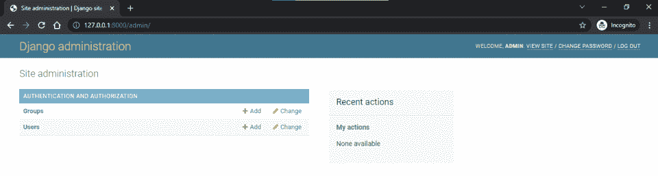
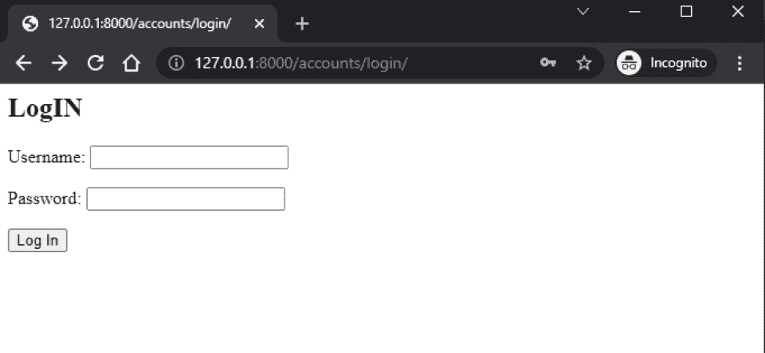
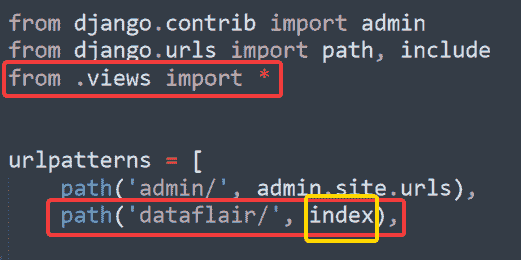
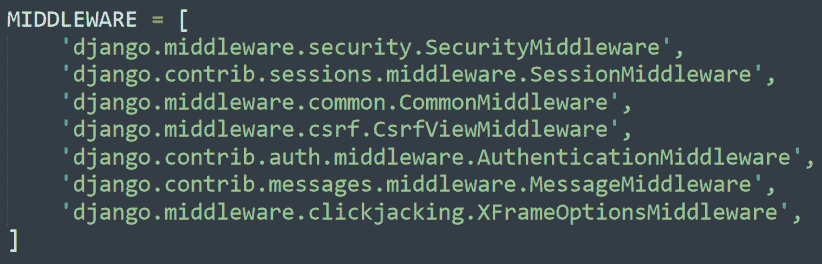
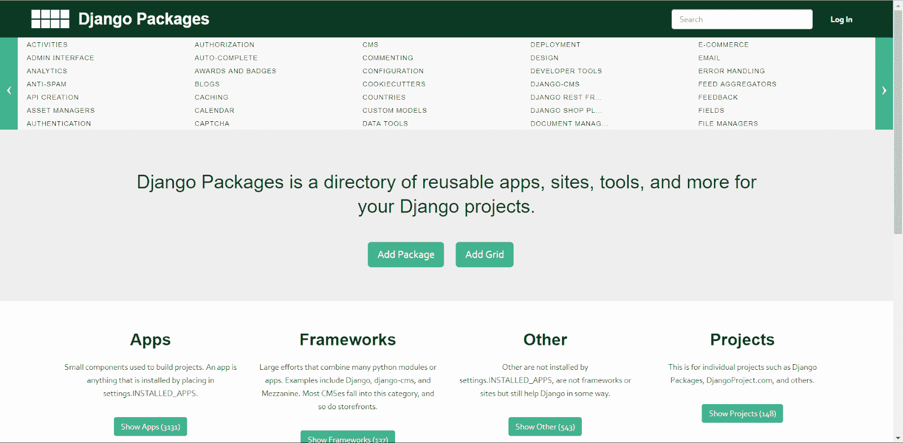
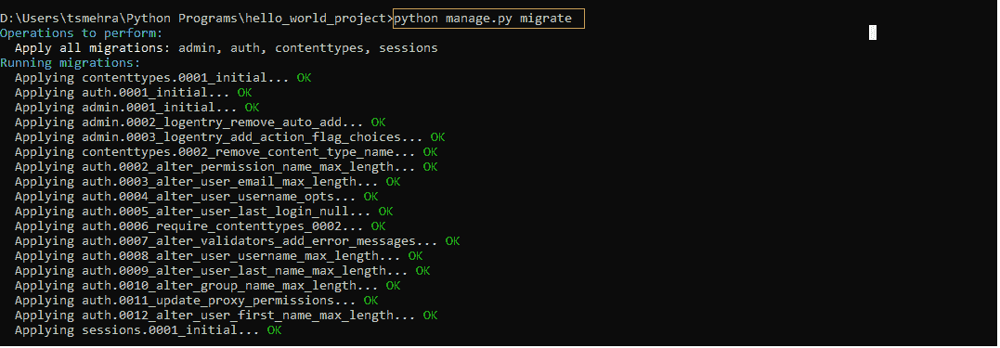
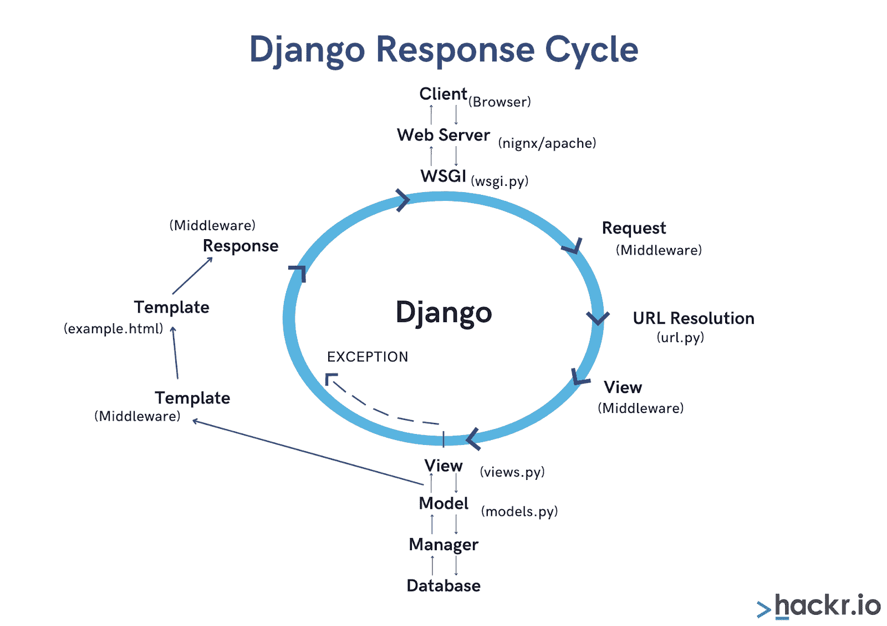

# 2023 年 50 大 Django 访谈问答

> 原文：<https://hackr.io/blog/top-django-interview-questions-and-answers>

Django 是一个开源的、基于 Python 的高级 web 框架，用于创建数据库驱动的 web 应用程序和网站。该框架基于 MVT(模型-视图-模板)架构模式。Django 由 Django 软件基金会(DSF)维护。

这个 [web 开发框架](https://hackr.io/blog/web-development-frameworks) 让 Python 开发者更容易构建复杂的数据库驱动的网站。它的特点是组件的可插拔性和可重用性，快速开发，低耦合，以及不重复(DRY)原则。

随着 Python 成为最流行和最广泛使用的编程语言之一，它成为许多开发人员的首选。由于 Django 是被广泛接受的 [Python web 框架](https://hackr.io/blog/python-frameworks)之一，学习它将会打开数十个就业机会。

本文重点介绍了 Django 面试常见问题和答案，这将有助于你赢得面试。它涵盖了从最基础的想法到更高级的概念。如果你已经有了关于 [Django](https://hackr.io/tutorials/learn-django) 的先验知识，那么你可以随时准备这篇文章来温习你的概念。

我们开始吧！

## **Django 面试问题**

### **1。姜戈是什么？**

Django 是一个基于 [Python 语言](https://hackr.io/blog/python-programming-language)的开源 web 开发框架，允许 Python 开发者创建数据库驱动的网站。它于 2003 年在《劳伦斯世界日报》上推出。

这个流行的框架由一个名为 Django 软件基金会(DSF)的非营利组织维护。后来，在 2005 年，Django 在 3 条款 BSD 许可下公开发布。

让我们看看如何使用 Django 编写 Hello World 程序。

**第一步:创建一个项目**

django-admin start project hello _ world _ project

**第二步:将目录改为** **hello_world_project**

cd hello_world_project

**第三步:创建一个新文件 views.py，并为 hello world 编写函数视图**

**#views.py【新】**

```
from django.shortcuts import HttpResponse

#hello world view
def hello_world(request):
    return HttpResponse("Hello World")
```

**步骤 4:编辑 urls.py 文件以路由 hello world view 的 URL**

**#urls.py**

```
from django.contrib import admin
from django.urls import path
from .views import hello_world

urlpatterns = [
    path('admin/', admin.site.urls),
    path('', hello_world, name="hello-world")

] 
```

**步骤 4:使用 python manage.py runserver 命令运行服务器**

python manage.py runserver

以上步骤是用 Django 编写 hello world 程序最简单的方法。

Django 是独一无二的，它是专为大型项目设计的，所以即使是编写一个像 Hello World 这样的小程序，我们也必须经历许多过程。

### **2。Django 有什么优势？**

大多数开发人员更喜欢 Django，因为它在市场上占主导地位，显示出很高的计算和统计能力。以下是 Django 的一些优点:

*   Django follows Python’s ‘batteries included’ trait. Python is generally referred to as ‘batteries included’ because it has a unified standard library, helping developers use readymade packages to add features to a web project. 
*   Most of the packages in Python’s standard library are open-source. With these packages, you can even implement authentication, admin interfacing, session management, and other advanced functionalities. 
*   Python and Django are core technologies in IT giants, the Internet of Things (IoT), and blue chip companies. Therefore, learning it would help you establish a lucrative career. 
*   Security is yet another advantage of using the Django framework. Applications developed on Django are protected against SQL injection, clickjacking, XSS and CSRF attacks, etc.
*   The built-in template language of Django promotes the process of building applications. 
*   Django enables developers to create applications and configure frameworks on the go. Also, it offers support for external libraries and packages. Django focuses on explicit programming, allowing the developers to create applications that require frequent changes.
*   It helps in faster development and is thus used by most companies. If the configuration is correct, then you can use Django for optimizing web applications.
*   Django has a REST framework, a python library, that helps develop APIs for many applications. Using these APIs, you can add advanced functionalities to your applications.
*   Django comes with ML capabilities and libraries such as PyTorch, NumPy, etc. 

### **3。Django 的缺点是什么？**

尽管有很多优势，开发人员仍然发现进行这种转变很有挑战性。以下是使用 Django 框架的一些缺点:

*   Django 缺乏可供开发者用于 web 开发的约定。
*   对于需求较少的小型项目并不理想，因为其结构庞大，功能繁多
*   The Django framework is monolithic, i.e., developers have to work on the given patterns

### **4。Django 有哪些应用？**

下面是您可以使用 Django 框架创建的一些项目类型:

*   具有各种功能的金融平台，如根据数据分析计算产量
*   定制 CRM 系统内部数据
*   B2B CRM 系统，帮你处理组织内部的沟通
*   购物网站

*   文件管理系统
*   创建发送通知的电子邮件系统
*   基于照片验证系统
*   Platforms for managing investment funds

### **5。Django 有什么特点？**

以下是 Django 框架的最佳特性:

*   与其他 Python 框架相比，Django 拥有市场上最好的文档
*   这是一个基于 Python 的框架，它提供了应用程序中使用的所有 Python 库，以增加额外的功能
*   Django 主要使用 URL 而不是服务器上的 IP 地址来维护网站，这使得 SEO 工程师更容易将网站添加到服务器上
*   它具有高度的通用性和可扩展性
*   Django 高度安全并经过全面测试
*   这也保证了快速发展

[Python Django -实用指南](https://click.linksynergy.com/deeplink?id=jU79Zysihs4&mid=39197&murl=https%3A%2F%2Fwww.udemy.com%2Fcourse%2Fpython-django-the-practical-guide%2F)

### **6。描述 Django 架构。**

Django 遵循基于流行的模型-视图-控制器(MVC)架构模式的模型-视图-模板(MVT)架构，随后是流行的 web 框架，如 Ruby on Rails、Laravel 等。

Django 的模型-视图-模板架构将完整的应用分为三大逻辑组件:

1.  型号
2.  视图
3.  模板

所有这三个组件负责处理 web 应用程序的不同方面。

模型: 模型处理 web 应用程序的数据库模式。它在数据库中维护和表示完整的应用程序数据。模型使用的默认关系数据库是 SQLite，它通常在开发中使用，但是在生产中我们可以使用 MySQL 和 Postgres。

**视图:** 视图组件管理我们想要在用户浏览器上呈现的应用程序的所有逻辑。在 Django 中，视图充当了模型和模板之间的桥梁。在视图中，我们可以从模型中获取数据，并将其呈现在模板上。

**模板:** 模板组件是应用程序静态部分的集合，如 HTML、CSS、JavaScript 和图像文件。视图使用模板作为数据显示的基础，因为最终，web 应用程序使用静态文件来表示用户浏览器上的内容。



### 7 .**。Django 中的项目目录结构是怎样的？**

下面是 Django 中的项目目录结构:

*   这是一个命令行工具，允许用户与他们的 Django 项目进行交互
*   **__init__。py:** 一个空文件，指定 Python 将当前目录视为一个 Python 包
*   **settings.py:** 它包含了项目的必要配置，比如 DB 连接
*   **urls.py:** 它保存了一个项目的所有 URLs】
*   wsgi.py: 它是一个应用程序的入口点，由 web 服务器用来服务于项目

### **8。Django 有哪些模特？**

在 Django 中，模型是映射到数据库表或数据库集合的类。Models 类包含表示数据库字段的属性，在 app/models.py 文件中定义。这些模型充当抽象层，帮助构建和操作数据。模型是 django.db.models.Model 类的子类。

**例子**

让我们创建一个包含名称、价格和描述属性的产品表。

**#models.py**

```
from django.db import models

#product model

class Product(models.Model):

    name= models.CharField(max_length=30)

    price= models.models.IntegerField()

    description = models.TextField()

    def __str__(self):

        return f'{self.name}'
```

### **9。Django 架构的组成部分是什么？**

Django 的架构由以下组件组成:

*   **模型:** 它规定了数据库模式和数据结构
*   **视图:** 控制用户将看到什么，视图用于从适当的模型中检索数据，对数据进行计算，并将其传递给所需的模板
*   **模板:** 它指定了用户如何看待它。它描述了从视图接收的数据应该如何被格式化以显示在页面上
*   **控制器:**Django 框架和 URL 解析

### 10。解释 Django 中的管理界面。

管理界面是 Django 中已经存在的界面。它通过消除创建另一个管理面板的需要来帮助 web 开发人员节省他们的时间。Django admin 是一个应用程序，可以很容易地从名为 django.contrib 的包中导入。

Django 管理界面有两个默认模型，组和用户，在迁移项目和创建一个新的超级用户后，它们被包含在管理界面中。

要登录默认的管理空间，我们需要将 URL 路由到管理面板，默认为[http://127 . 0 . 0 . 1:8000/admin/](http://127.0.0.1:8000/admin/)。



为了获得登录凭证，我们可以使用命令 ***python manage.py 创建超级用户*** 来创建一个超级用户。

登录到管理面板后，我们有两个默认模型:组和用户。



*   **组:** 定义特定组中用户所拥有权限的组表。
*   **用户:** 在用户表中存储了所有用户的详细信息。

组和用户模型属于身份验证和授权模块。

### 11。Django 的代码复用性如何优于其他框架？

Django 提供了比其他基于 Python 的 web 框架更好的代码重用性。它是各种应用程序的集合，如登录应用程序、注册等。通过对 settings.py 文件进行必要的更改，可以将此类应用程序从一个目录复制到另一个目录。因此，不需要从头开始为注册应用程序编写完整的代码。这就是 Django 帮助快速开发 web 应用程序的原因。

Django 是一个包含电池的 web 框架，这意味着它带有一些内置的通用组件，如登录、注册、会话和认证功能。

通过将这些预先编写的组件代码导入到脚本中，我们可以轻松地在我们的 web 应用程序中使用它们。

**例如**

让我们使用 Django 帐户模块在 Django 中创建一个内置的登录表单。

**第一步:将 auth app 包含到项目 urls.py 文件中。**

**# URLs . py**

```
from django.contrib import admin

from django.urls import path, include # add

urlpatterns = [

    path('admin/', admin.site.urls),

    path('accounts/', include('django.contrib.auth.urls')), # add

]
```

**第二步:在项目目录下的 templates/registrations 目录下创建一个 login.html 文件。**

```
<h2>LogIN</h2>

<form method="post">

  

  {{ form.as_p }}

  <button type="submit">Log In</button>

</form>
```

**第三步:配置 settings.py 文件**

```
TEMPLATES = [

    {

        ....  

       'DIRS': [BASE_DIR / 'templates'],

        ....

    },

]

LOGIN_REDIRECT_URL = '/'
```

现在我们可以从 [进入](http://127.0.0.1:8000/accounts/login/) 的登录页面。



### 12。Django 网站收到请求时会发生什么？

每当用户在浏览器中输入 URL，Django 服务器就会收到请求。服务器在其 URL-config 中查找 URL。如果服务器在那里找到匹配，它将返回相应的视图函数。

然后，向应用程序的模型发出请求以获取数据。如果有要传递的数据，将其传递给相应的模板。之后，模板在浏览器中呈现。如果该过程没有按预期工作，用户将得到一个“404”错误页面。

### 13。你能定制 Django 的管理界面吗？如果是，那怎么做？

是的，你可以定制 Django 的管理界面。Django 的 admin 是另一个完全可定制的应用程序。它使您能够为不同的视图下载另一个第三方应用程序。您可以创建自己的管理应用程序来完全控制它。此外，为了定制 Django 管理站点，您可以更改管理站点对象的设置。

此外，您可以对您的模型进行所需的更改，然后在 Django admin 中应用它们来添加特定的应用程序，比如搜索栏。您甚至可以定制 Django 管理界面的一个更小的细节。尽管如此，建议创建一个新的管理员，而不是在较低的级别进行这么多的更改。

### 14。为什么 Django 被认为是一个松散耦合的框架？

Django 被认为是一个松散耦合的框架，因为它基于 MVT 架构，这是 MVC 架构的一个变种。MVT 架构非常有用，因为它将服务器代码与客户端机器完全分开。

模型和视图在客户端机器上是可用的。然而，客户机只接收模板 HTML 和 CSS 代码——以及来自模型的数据。

由于这些组件是不同的，前端和后端开发人员可以在同一个项目中一起工作。两个团队对一个项目所做的更改不会互相影响，因此 Django 是一个松散耦合的框架。

### 15。解释 Django REST 框架。

借助 Django 的 REST 框架，您可以快速高效地创建 RESTful APIs。这个框架得到了各大公司的资助，由于其多种值得称赞的特性(如序列化、身份验证策略等)而广受欢迎。

RESTful APIs 非常适合创建 web 应用程序，因为它们使用低带宽，并且可以通过 GET、POST 和 PUT 方法在互联网上通信。

### 16。 什么是 settings.py 文件，它包含什么？

无论何时启动 Django 服务器，最初，它都会查找 settings.py 文件，其中包含关于 web 应用程序的主要设置。此外，它还包含与您的 web 应用程序相关的一切，如数据库、后端引擎、模板引擎、静态文件地址、服务器、安全密钥、中间件、URL 配置和其他基本数据。

因此，当您启动 Django 服务器时，它将首先执行 settings.py 文件，然后加载所需的引擎和数据库。

settings . py 文件驻留在主项目目录中。

```
project_name

│   db.sqlite3

│   manage.py

│

├───project_name

│   │   asgi.py

│   │   settings.py

│   │   urls.py

│   │   views.py

│   │   wsgi.py

│   │   __init__.py
```

### 17。为什么使用正则表达式来定义 URL？

Django 有一种强大的方法来存储 URL，这些 URL 是正则表达式。您可以轻松地将正则表达式格式用于字符串搜索算法，从而加快搜索过程。

然而，在 Django 2.2 和更高版本发布后，不再需要使用正则表达式来定义 URL。相反，您可以使用普通字符串。每当您希望通过 URL 传递来自用户的一些数据时，就会使用正则表达式。但是无论您使用什么，Django 服务器都需要匹配它们。

**例子**

```
urlpatterns = [

    path(products/', views.all_products),

    path('articles/<int:id>/', views.product_detail),

]
```

有时普通的字符串模式对于 url 模式来说是不够的。在这里我们可以使用 **re_path()** 函数对 URL 进行正则表达式。

```
urlpatterns = [

    re_path(r'^product/(?P<year>[0-9]{4})/$', views.product_year_archive),

]
```

### 18。在 Django 解释 ORM。

ORM 代表对象关系映射器，Django 的一个特殊功能工具。该工具帮助开发人员以更类似 Python 的方式与数据库进行交互。它充当模型和存储主要数据的数据库之间的抽象。

使用 ORM，您可以从数据库中检索、保存和删除数据，而无需为其编写任何 SQL 代码。这个工具将有助于消除许多漏洞，因为它让您保持对代码的控制，并且是用 Python 开发的。

无论数据库是 SQLite、MySQL、Postgre 还是 Oracle，ORM 都会确保开发人员为所有数据库编写相同的代码。

Django 使用被称为 Django ORM 的 ORM，它使用从模型继承的类。在任何数据库下创建表。

我们唯一需要调整的是 setting.py 文件中的数据库设置。

【PostgreSQL 连接的 Django 设置

```
DATABASES = {

    'default': {

        'ENGINE': 'django.db.backends.postgresql',

         'NAME': 'DB_NAME',

        'USER': 'DB_USER',

        'PASSWORD': 'DB_PASSWORD',

        'HOST': 'localhost',  

        'PORT': '5432',

    }

}
```

【MySQL 连接的 Django 设置

数据库 = {

【默认】 : {

【引擎】:【django . db . backends . MySQL】，

【姓名】:【DB _ 姓名】 ，

【用户】:【DB _ 用户】 ，

【密码】:【DB _ 密码】 ，

【主机】 : 【本地主机】 ， #或者您的数据库所在的 IP 地址

【港口】:【3306】，

}

}

### 19。Django 中的模板是如何工作的？

模板是 Django 能够创建动态网页的原因。这些模板是作为 HTTP 响应返回的 HTML 代码。此外，Django 有一个能够处理模板的模板引擎。在声明变量、控制逻辑和注释时，可以使用一些模板语法。

一旦你在 HTML 结构中提供了所有的模板语法，网页就会被视图函数请求和调用。稍后，Django 模板引擎将获得包含变量的 HTML 结构和替换这些变量的数据。模板引擎将在执行控制逻辑和生成过滤器时替换这些。然后，它将呈现所需的 HTML 并将其发送到浏览器。

### 20。 什么是视图功能？可以直接导入 URL 中的函数吗？

视图是模型和模板之间的中间层，它将从模型中获取数据并将其传递给模板。Django 中的每个应用程序都有存储视图函数的 view.py 文件，这些函数接受参数并返回浏览器可呈现的格式。

您可以在 URL 文件中轻松导入视图功能。为此，您需要在 urls.py 文件中导入 view 函数，并添加浏览器调用该函数所需的路径。



在上面的例子中，你可以看到我们已经从视图模块中导入了所有的函数。后来，我们在 urlpatterns 列表中添加了 URL(红框)。当搜索“dataflair/”时，将调用“index”函数(黄色框)。

### 21。django.shortcuts.render 函数是什么？

当网页被视图函数返回为 HttpResponse 而不是简单的字符串时，使用 render()函数。该功能将允许开发人员使用模板传递数据字典。然后，这个函数将使用模板引擎来组合模板和数据字典。

之后，这个函数将返回 HttpResponse 和模型返回的渲染文本。这样，这个功能将为开发者节省大量时间，并允许他们使用不同的模板引擎。

基本渲染语法:

| render(请求，模板 _ 名称， 上下文=无， 内容 _ 类型=无， 状态=无， 使用=无) |

当请求是将生成响应的参数时，template_name 将指定存储模板的值，模板名将用于传递字典。为了更好地控制，您可以提到内容类型、数据状态。

### 22。如何在 urls.py 文件中添加视图函数？

以下是向 urls.py 文件添加视图功能的两种方法:

*   通过添加函数视图: 使用此方法，需要将视图作为函数导入。您从特定视图导入函数，然后将 URL 添加到 urlpattern 列表中。
*   通过添加基于类的视图:这是一种面向对象的方法，从 views.py 文件导入类，然后将 URL 添加到 urlpattern 列表中。为此，您将需要一个内置的方法来调用作为视图的类。

### 23。urls-config 文件包含什么？

这个配置文件存储了所有的 URL 列表以及到它们各自视图函数的映射。这些 url 可以映射到另一个应用程序的视图函数、基于类的视图和 url-config。

默认的 URL 列表名称是 urlpatterns ，它包含所有的 path()或 re_path() URL 模式。项目 URL 带有根 urls.py 文件，对于每个应用程序，我们也可以为该应用程序创建一个独立的 urls.py 文件。

例子

#urls.py

```
from django.contrib import admin

from django.urls import path, include

urlpatterns = [

    path('admin/', admin.site.urls),

    path(blog/', include('blog.urls')),

]
```

### 24。说姜戈是铁板一块是什么意思？

Django 基于 MVT 架构，由于 Django 是该架构的控制者，它定义了一些规则，所有开发人员都需要遵循这些规则才能在正确的时间执行适当的文件。

在 Django 中，您可以通过实现获得极大的可定制性。但是不允许您更改文件名、预定义列表和变量名。您必须创建新的变量，但是您不能更改预定义的变量。

整体行为有助于开发人员更容易理解项目。即使公司变了，项目布局也不会变。因此，开发人员花更少的时间来理解代码，提高了生产率。

### 26。什么是 Jinja 模板？

Django 支持许多流行的模板引擎，默认情况下，它有一个非常强大的模板引擎，叫做 Jinja 模板。最新版本是金贾 2。

下面是 Jinja 模板的一些特性，这使它成为比其他可用模板引擎更好的选择。

*   沙盒执行: 这是一个受保护的框架，用于自动化测试过程
*   HTML 转义: Jinja 2 自带自动 HTML 转义，作为模板中有特殊值的<、>、&字符。如果你把它当作普通文本，这些符号会导致 XSS 攻击，由金佳自动处理。
*   它显示了模板继承，生成 HTML 模板的速度比默认引擎快得多
*   与默认引擎相比，纪娜更易于调试

### 27。Django 中的用户认证是什么？

Django 有一个内置的用户认证系统，能够处理不同的对象，比如用户、组、用户权限和一些基于 cookie 的用户会话。

Django 的用户认证不仅有助于认证，还有助于授权用户和检查用户拥有什么权限。

系统对以下对象进行操作:

*   用户
*   权限
*   组
*   密码哈希系统
*   表单验证
*   一个可插拔的后端系统

可以使用第三方网络应用程序代替默认系统，因为您可以更好地控制用户认证和许多其他功能。

### 28。Django 中中间件的用途是什么？

在 Django 中，中间件是处理请求并将其传递给视图的组件，在将请求传递给模板引擎之前，它开始处理响应。



上图显示了 Django 框架中默认安装的中间件列表。

它有多种用途，包括会话管理和用户认证。

### 29。djangopackages.org 网站有什么用？

在 Django 中，软件包网站是所有第三方应用程序上传的地方。您可以将它们安装在您的系统中。



### 三十岁。有哪些热门网站用 Django？

Django 是一个引人注目的框架，被许多著名的组织所使用。一些使用 Django 的高流量网站有:

*   Instagram
*   Pinterest
*   缺陷
*   Mozilla
*   Bitbucket
*   YouTube
*   Spotify
*   美国宇航局
*   Eventbrite

### 31。 如何在 Django 中建立数据库？

你可以编辑 mysite/setting.py，一个代表 Django 设置的模块。默认情况下，Django 使用 SQLite，它易于使用，不需要任何类型的安装。

如果您的数据库选择不同，您必须在数据库“默认”项中输入以下键，以匹配您的数据库连接设置:

*   引擎: 您可以使用' django.db.backends.sqlite3 '、' django.db.backeneds.mysql '、' django . db . backends . PostgreSQL _ psycopg 2 '、' django.db.backends.oracle '等对数据库进行更改。
*   名称: 如果你使用 SQLite 作为你的数据库，数据库文件将在你的计算机上。该名称应该是完整的绝对路径，包括该文件的文件名。

但是，如果您不选择 SQLite，您需要添加密码、主机、用户等设置。

### 32。如何在 Django 中设置静态文件？

在 Django 中设置静态文件，需要考虑以下步骤:

*   首先，在 settings.py 文件中设置 STATIC _ ROOT
*   运行 manage.py 集合文件
*   最后，在 PythonAnywhere web 选项卡上设置一个静态文件条目

### 33。Django 中的会话框架是什么？

Django 自带的会话框架有助于在每个站点访问者的基础上存储和检索任意数据。它将所有数据保存在服务器端，并将 cookies 的接收和发送抽象化。您可以通过中间件实现会话。

### 34。Django 中有多少种类型的继承风格？

Django 有三种继承风格，如下所述。

*   抽象基类: 当你想让一个父类只存储你不想用于每个子模型的信息时，你可以使用这种风格
*   多表继承: 如果你是一个现有模型的子类，并且需要每个模型都有自己的数据库表，你可以使用这种风格。
*   代理模型: 如果你只想改变模型的 Python 级行为而不需要改变模型的字段，你可以使用这个模型

### 35。Django 有哪些中间件的应用？

以下是 Django 中中间件的一些应用:

*   会话管理
*   用户认证
*   跨站点请求防伪
*   内容压缩

### 36。 姜戈有哪些信号？

信号是一段段代码，保存着关于正在发生的事情的信息。您可以使用调度程序来发送信号并监听这些信号。

在某个事件发生之前或之后，当我们想对数据做些什么时，这些信号变得非常有用。

以下是我们可以使用 Django 信号的事件列表:

*   pre_save()在 save()之前触发。
*   post_save()在 save()之后触发。
*   pre_delete()在 delete()之前触发。
*   post_delete()在 delete()之后触发。
*   当 ManyToMany 字段发生变化时，m2m_changed()触发。
*   django 启动 HTTP 请求时，request_started()触发。
*   django 完成 HTTP 请求时，request_finished()触发。

例子

```
Send an email when the user creates a new post.

from django.db.models.signals import post_save

from .models import Blog

from django.core.mail import send_mail

@receiver(post_save, sender=Blog)

def create_profile(sender, instance, created, **kwargs):

    #if created for the first time

    if created:

        blog_title = instance.title

        send_mail("Subject", "Message", "from_email", ['toemail@.com'])
```

### 37。信号的一些重要参数是什么？

以下是信号的两个重要参数:

*   接收器: 指定连接到信号的回拨功能
*   发送方: 指定接收信号的特定发送方

### 38。Django 的 mixin 是什么？

Mixin 是一种多重继承，它结合了多个父类的行为和属性。它提供了一种从多个类中重用代码的极好方法。

例如，通用的基于类的视图有一个叫做 TemplateResponseMixin 的 mixin。这个 mixin 用于定义 render_to_response()方法。当您将它与视图中存在的类结合时，它会产生一个 TemplateView 类。

mixin 的唯一缺点是，如果它的代码分散在多个类之间，那么分析子类在做什么以及覆盖哪些方法变得很困难。

### 39。Django 中的缓存策略是什么？

缓存意味着存储计算的输出，以避免重复执行相同的计算。Django 提供了一个强大的缓存系统来帮助创建动态页面。因此，它消除了对每个请求重复评估页面的需要。下表重点介绍了一些重要的缓存策略:

| 策略 | 描述 |
| Memcached | 它是一个基于内存的缓存服务器。 |
| 文件系统缓存 | 这种缓存策略有助于以序列化顺序缓存存储为独立文件的值。 |
| 本地内存缓存 | 这是默认的高速缓存，如果您没有指定任何其他高速缓存，则使用它。它是一个基于进程和线程安全的缓存。 |
| 数据库缓存 | 数据库存储缓存数据。 |

### 40。Django 中的 manage.py 文件是什么？

无论何时创建项目，都会自动创建 manage.py 文件。这是一个命令行实用程序，帮助您与 Django 项目进行交互。它执行与 Django-admin 相同的工作，并设置 DJANGO_SETTINGS_MODULE 环境变量以指向您项目的设置。如果您正在处理单个项目，最好使用 manage.py 而不是 Django-admin。

### 41。Django 中的“migrate”命令是如何使用的？

在 Django 中，迁移用于传播对模型所做的更改。您可以使用 migrate 命令来应用和移除对模型所做的迁移更改。

该命令有助于将当前的模型和迁移集与数据库状态同步。您也可以在传递或不传递参数的情况下使用该命令。如果不指定任何参数，所有应用程序的所有迁移都将运行。

命令:

```
python manage.py migrate
```

输出

第一次迁移项目会显示类似的结果。



### 42。Django 的响应周期是怎样的？

每当用户请求一个网页时，Django 都会创建一个 HttpRequest 对象，其中包含关于该请求的重要元数据。之后，Django 将加载一个特定的视图，将 HttpRequest 作为第一个参数传递给视图函数。然后每个视图返回一个 HttpResponse 对象。



以下是 Django 收到请求时发生的步骤:

*   首先，加载包含各种中间件类的 settings.py 文件
*   所有中间件类都按照它们被提及的顺序执行
*   现在，请求将被移动到 URL 路由器。URL 路由器从请求中获取 URL 路径，然后尝试在 urls.py 中映射给定的 URL 路径。
*   映射后，它调用等价的视图函数，从那里生成相应的响应。
*   现在，响应通过响应中间件发送回客户机/浏览器

### 43。select _ related 和 prefetch_related 有什么区别？

| select_related() | 预取 _ 相关() |
| select_related()是对查询集的查找，它将附加的 forward foreignkey 数据添加到返回的查询集中。 | prefetch_related()是对查询集的另一种查找，它将额外的前向外键、一对一和后向一对一数据添加到返回的查询集中。 |
| 它使用 JOIN 语句减少了后台 SQL 查询。 | 它使用 SQL joins 和 SELECT 命令来减少复杂的查询集。 |
| 当我们选择单个对象时，它起作用。 | 用于选择一组多个对象。 |
| 例子

```
queryset = Blog.objects.select_related('Author').all()
```

 | 例子

```
queryset = Blog.objects.prefetch_related('Categories').all()
```

 |

举例:

```
from django.db import models
class Country(models.Model):
   country_name = models.CharField(max_length=5)
class State(models.Model):
   state_name = models.CharField(max_length=5)
   country = model.ForeignKey(Country)
>> states = State.objects.select_related('country').all()
>> for state in states:
...   print(state.state_name)  
```Query Executed
SELECT state_id, state_name, country_name FROM State INNER JOIN Country ON (State.country_id = Country.id)
```
>> country = Country.objects.prefetch_related('state').get(id=1)
>> for state in country.state.all():
...   print(state.state_name)
```Query Executed
SELECT id, country_name FROM country WHERE id=1;
SELECT state_id, state_name WHERE State WHERE country_id IN (1);
```

44。使用 Django-admin 可以执行哪些不同的任务？` ``

Django-admin 是 Django 的命令行实用程序，用于执行管理任务。下表强调了使用 Django-admin 执行的各种任务:

| 任务 | 命令 |
| 显示每个应用程序提供的使用信息和命令列表。 | django-管理帮助 |
| 显示可用命令列表 | django-管理帮助-命令 |
| 获取特定命令的描述及其可用选项列表 | django-admin 帮助<命令> |
| 检查 Django 的版本 | django-管理版本 |
| 根据模型中所做的更改创建新的迁移 | django-admin make migrations |
| 将数据库状态与其当前的模型和迁移集同步 | django-admin 迁移 |
| 启动开发服务器 | django-管理运行服务器 |
| 发送测试邮件以确认 Django 是否正常工作 | django-admin sendtestemail |
| 启动 Python 交互式解释器 | django-管理外壳 |
| 显示项目中的所有迁移 | django-admin 显示迁移 |

### 45。如何将 Django 项目与数据库连接起来？

默认情况下，Djagno 连接到 SQLite 数据库，设置如下:

```
DATABASES = {

    'default': {

        'ENGINE': 'django.db.backends.sqlite3',

        'NAME': BASE_DIR / 'db.sqlite3',

    }

}
```

但我们也可以将其连接到生产级数据库，如 [MySQL 和 PostgreSQL。](https://hackr.io/blog/postgresql-vs-mysql)

**用 MySQL 连接 Django**

要连接 Dango 和 mysql，我们首先必须安装作为适配器的 mysqlclient 。

**pip 安装 MySQL client**

我们还需要更改 setting.py 文件中的默认数据库设置

```
DATABASES = {

    'default': {

        'ENGINE': 'django.db.backends.mysql',

        'NAME': 'DB_NAME',

        'USER': 'DB_USER',

        'PASSWORD': 'DB_PASSWORD',

        'HOST': 'localhost',   # Or an IP Address that your DB is hosted on

        'PORT': '3306',

    }

}
```

**用 PostgreSQL 连接 Django**

要连接 Dango 和 PostgreSQL，我们首先必须安装作为适配器的 psycopg2 。

**pip 安装 psycopg2**

我们还需要更改 setting.py 文件中的默认数据库设置

```
DATABASES = {

    'default': {

        'ENGINE': 'django.db.backends.postgresql_psycopg2',

        'NAME': 'myproject',

        'USER': 'myprojectuser',

        'PASSWORD': 'password',

        'HOST': 'localhost',

        'PORT': '',

    }

}
```

在 setting.py 文件中进行更改并安装适当的适配器后，我们需要迁移数据库，以便 Python ORM 可以在新选择的数据库中创建表。

1.  **python manage . py migrate:****该命令查看 INSTALLED_APPS 设置并相应地创建数据库表**
***   **python manage . py make migrations:**这将通知 Django 您已经创建/更改了您的模型*   **python manage . py SQL migrate<应用程序的名称，后跟生成的 id > :** Sqlmigrate 获取迁移名称并返回它们的 SQL**

 **### 46。Django 中有哪些类型的异常类？

下面是 Django 中可用的异常类:

| 异常 | 描述 |
| AppRegistryNotReady | 当我们在应用程序加载过程之前尝试使用模型时出现。 |
| 对象目标神经学家 | 不存在异常的基类。 |
| 经验值结果集 | 如果查询没有返回任何结果时引发。 |
| 字段不存在 | 如果请求的字段不存在，则引发。 |
| 返回了多个对象 | 如果只需要一个对象，但返回了多个对象，查询将引发此异常。 |
| 可疑操作 | 当用户执行了可疑操作时引发。 |
| 权限被拒绝 | 当用户没有执行指定操作的适当权限时引发。 |
| ViewDoesNotExist | 如果请求的视图不存在，则由 django.urls 引发。 |
| 未使用的中间件 | 如果服务器配置中没有使用中间件，则引发此问题。 |
| 配置不正确 | 如果 Django 配置不正确，则引发此问题。 |
| 字段错误 | 模型字段有问题时引发。 |
| 验证错误 | 如果数据验证未能通过表单或模型字段验证时引发。 |

### 47。具体的 Django 字段类类型有哪些？

字段类类型指定以下内容:

*   数据库的列类型。
*   呈现表单字段时使用的默认 HTML 小部件。
*   Django admin 中使用的最低验证要求有助于自动生成表单。

### 48。 什么是 Django 的模特？

模型被指定为从模型类派生的 Python 类。这个模型类是从 django.db.models 库中导入的。Django 模型的主要概念是创建对象，以用户定义的格式存储来自用户的数据。

模型类是一个预定义的类，有很多好处。您可以像在 SQL 中一样定义具有特定属性的字段，但在 Python 中也可以实现同样的功能。

这个类由 Django ORM 或后端引擎解析，不需要做任何与数据库相关的事情，比如创建表和定义字段，然后用类的属性映射字段。

**例如**

```
from django.db import models

class Student(models.Model):

    id = models.IntegerField(max_length=30)

    name = models.CharField(max_length=30)

    dob = models.DateField()
```

### 49。Django 中有哪些不同类型的视图？

以下是 Django 中可用的两种不同类型的视图:

*   基于功能的视图: 它允许您将视图作为功能导入
*   基于类的视图: 它是一种面向对象的方法

### 50。哪些公司用 Django？

以下是一些使用 Django 的公司列表:

*   PBS
*   Instagram
*   Mozilla
*   华盛顿时报
*   圆盘、比特桶
*   隔壁
*   YouTube
*   Pinterest
*   铁饼

## 这些 Django 面试问题会让你做好准备

以上总结了 Django 面试的问题和答案。我们讨论了一些基本的和常见的问题，这对你参加 Django 相关的面试会有帮助。

如果你彻底学会了 Django，职业机会就是你的了。如果你对 Python 有很强的 [知识，你会发现学习 Django 很容易。祝你好运！](https://hackr.io/blog/best-python-courses)

人也在读:**