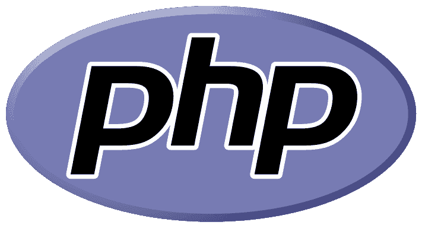

# 2023 年你应该知道的前 20 个 Javascript 库

> 原文：<https://hackr.io/blog/top-javascript-libraries>

库提供了许多标准功能，因此开发人员不必担心许多标准功能，并且可以使用库通过 UI 组件、语言实用程序、数学函数等轻松创建网页。JavaScript 是任何 web 应用程序不可或缺的一部分，只需要根据您的需要准备好这些库，以节省**开发**和测试时间，并将所有东西放在一个地方。

## 前 20 名 Javascript 库

如果你想学习如何使用这些 JS 库，请阅读[这篇内容丰富的博客](https://hackr.io/blog/best-javascript-courses)，它详细介绍了你应该如何着手[学习 Javascript](https://hackr.io/tutorials/learn-javascript) 。

Dojo 是一个开源的 JavaScript 库，有助于以更快的方式开发跨平台、JS 和基于 Ajax 的网站。DOJO 有大量的 API 和模块。DOJO toolkit 有几个部分

*   **Dojo—**由核心模块组成
*   **dijit–**帮助设置布局和小部件的用户界面模块
*   **Util–**包括用于测试、样式检查等的实用程序和构建工具。
*   **dojox–**这个额外的 dojo 工具包有助于制图、网格和 DTL。

DOJO 中的模块是独立的、轻量级的。它们可以异步加载，这意味着更快的响应。DOJO 易于使用，并且有很多社区支持和文档。

### 2.jQuery

jQuery 极大地简化了 JS 编程，并且易于学习和使用。它是高度可扩展的，并使网页加载速度更快。jQuery 封装了许多标准函数，使得开发人员的工作变得简单。几行 JS 代码可能只是在 jQuery 中调用的一个方法。它也有许多插件来执行不同的任务。jQuery 的一些特性包括 CSS 操作、HTML/DOM 操作、HTML 事件、动画和效果、实用程序和 AJAX。jQuery 最好的部分是它处理浏览器兼容性问题的方式，而无需开发人员担心。一些主要的 IT 公司如微软、网飞和谷歌都使用 jQuery。在网页中包含 jQuery 是毫不费力的。

jQuery 的语法类似于 CSS 语法，这使它成为最容易学习的语法，即使对于初学者也是如此。

### 3.谷歌聚合物

由 Google 创建的 Polymer 是一个 JS 库，它允许开发人员重用 HTML 元素，并使用 HTML、CSS 和 JS 创建自定义元素来创建更多的交互式应用程序。它兼容不同的平台。一旦使用命令行界面或 Bower 方法安装了 Polymer，您就可以重用已经开发的元素，而不必担心这些元素是如何创建的。您也可以使用聚合填充(即 web 组件规范)来构建自定义元素。定制元素可以分布在整个网络中，只需导入所需的 HTML 即可使用。要安装和使用 Polymer，您应该熟悉 node.js、npm、Bower、Git 和 Polymer CLI。

### 推荐的 JavaScript 课程

【JavaScript 全教程 2023:从零到专家！

[创意编码:用 JavaScript 制作视觉效果](https://domestika.sjv.io/c/2890636/1558123/17608?u=https%3A%2F%2Fwww.domestika.org%2Fen%2Fcourses%2F2729-creative-coding-making-visuals-with-javascript&partnerpropertyid=2722169)

[创意编码 2.0:动画、声音、&色彩](https://domestika.sjv.io/c/2890636/1558123/17608?u=https%3A%2F%2Fwww.domestika.org%2Fen%2Fcourses%2F3862-creative-coding-2-0-in-js-animation-sound-color)

如果您想创建交互式的、易于整合的数据可视化，InfoVis 是您的不二之选。除了常见的条形图、饼图、区域图等之外，工具包中还有一些最先进的可视化工具，如 Hypertree、TreeMap、RGraph 等。

使用这个工具包是一种愉快而有用的体验。它可以用必要的输入信息创建漂亮的彩色编码图形。你不需要做任何额外的编码就可以得到大量的效果。您可以下载您想要的可视化效果，而不是整个包，这样就不会在网页上显得太大。因为这个工具包是用于数据可视化的，你可能认为它对[数据分析师](https://hackr.io/blog/what-is-data-analytics)有用；但是，您需要一些编码经验来使用它。

### 5.D3.js

D3 代表数据驱动文档。使用 D3，您可以将数据驱动的转换应用于 DOM 对象。D3 的关键字是“数据驱动”，这意味着文档是根据接收到的数据进行操作的。数据可以以任何格式接收，并与 DOM 对象绑定。D3 非常快，支持动画和交互的动态行为。有许多已经开发的模块为代码重用提供了空间。D3 非常灵活，充分利用了 HTML、SVG(可缩放矢量图形)和 CSS 的全部功能。D3 代码很容易调试，因为它使用浏览器的内置检查器来显示路径。因为 D3 应用了声明性方法，所以它为开发人员节省了许多代码行。D3.js 是目前使用最广泛的 js 工具包之一。

### 6.Pixi.js

Pixi js 可以创建令人惊叹的数字内容。这个开源的、跨平台的 2D 引擎帮助创建游戏和交互式的、基于动画的网站。迪士尼是众多使用 Pixi 创建数字内容的大公司之一。Pixi 是一个超快速的渲染引擎，使用 WebGL 来提高性能，但是当不支持 WebGL 时，会使用 HTML canvas。Pixi 坚固而简单，因为它将一些最复杂的功能隐藏在一个简单的、随时可用的库中。如果你懂 Adobe flash，Pixi 是接下来最容易学的。

### 7.swf 对象

这个简单而强大的 JS 库主要用于在 HTML 文档中嵌入 flash SWF 文件。它只支持 SWF 文件，不能使用 SWFObject 嵌入其他媒体类型。有两个选项-动态发布和静态发布来添加标记。许多流行的网站如微软、YouTube 等都使用 SWFObject。要使用这个库，应该在用户的浏览器上启用 JS。SWFObject 有许多实用程序函数来完成不同的任务，例如使用 DOM 或识别是否安装了最新版本的 flash player。

### 8.三. js

Three.js 依赖于 WebGL，而不是传统的浏览器插件。通过它的库工具，开发者可以毫不费力地在他们的网站上包含复杂的 3D 动画。Three.js 包括许多功能，如几何图形、灯光、材质、着色器、效果、场景、数据加载器、动画等等。这个库是一个单独的 js 文件。由于源代码托管在 GitHub 存储库中，因此 Three.js 有很多可用的支持和文档。

### 9.速度. js

有了 velocity.js，网页动画变得轻而易举。它是一个快速的性能引擎，可以简化网站动画。它是免费的开源软件。Velocity 和 CSS、jQuery 一样快(甚至更快)，尤其是在移动设备上。我们可以以一种简洁的方式一个接一个地运行一系列动画，不像 jQuery 或 CSS 那样需要大量的编码。优步、 [WhatsApp](https://www.whatsapp.com/) 、HTC 以及更多的网站都使用 velocity 来增强他们的用户界面。包含 velocity 很简单——包含 JS 文件。

### 10.反应 js

 React 易于理解，使用 JS 库构建 web 应用的用户界面(MVC 架构的前视图或模型)。React 由脸书和其他几家公司维护。React 具有足够的声明性、高效性和灵活性，允许开发人员使用现有的代码片段(也称为组件)构建更复杂的 ui。React 速度快且可伸缩，因此对应用程序的任何更改都不需要重新加载页面。

### 11.view . js-检视. js

Vue js 基于虚拟 DOM 模型，很像 React，有一个基于组件的架构。使用 Vue.js 的模板，可以更快地创建应用程序。同样的任务，Vue 需要更少的代码行，而其他库需要更多的代码。如果您需要在更短的时间内构建一个小应用程序，Vue 应该是您的最佳选择。通过将 Vue 与其他工具和实用程序相结合，您可以获得一个成熟的框架。作为一个框架，Vue 可以处理复杂的功能，比如路由、构建工具和状态管理。

### 12.WinJS

由微软开发的 WinJS 是一个开源的 JS 库，有助于为 Windows 版本 8 & 10 安全开发 Windows 应用。开发人员可以加载整个包，也可以加载应用程序所需的单个模块。WinJS 有一套广泛的 API 来执行简单和复杂的任务，其中一些有标准的实现(不特定于 Windows)。WinJS 提供了高性能，是一个有用的库，可以学习各种控件和功能。

### 13.服务器端编程语言（Professional Hypertext Preprocessor 的缩写）

顾名思义，JsPHP 是在 JS 环境中可用的 PHP API 的 Javascript 库。它是开源的，为使用 PHP 的 JS 开发人员提供了一个引人注目的接口。JsPHP 可以与应用程序中的其他库协同工作。JsPHP 支持 PHP 函数，包括正则表达式、日期时间评估、JSON、错误处理、对象操作、字符串、XML、URL 等等。

### 14.插座。超正析象管(Image Orthicon)

一个高度可靠的库，允许服务器和浏览器窗口之间基于事件的双向通信。它有一个 node.js 服务器和浏览器客户端库。它可以检测断开连接，并提供自动连接支持以及其他重要功能，如二进制支持、通道支持和多路复用支持。

### 15.MathJAX

MathJAX，顾名思义，是一个跨浏览器的 javascript 库，可以显示数学符号，并使用 LaTeX、ASCIIMathML 和 MathML 等标记。MathJAX 在不同的浏览器中完美地表现了数学。它是完全可访问和可重用的，并产生 HTML、CSS、SVG 或 MathML 输出。它有丰富的 API。由于 MathJAX 不使用位图图像或 flash，开发人员不需要编写任何代码。

### 16.块状的

Blockly 是谷歌的一个创造，是一个基于网络的可视化编程编辑器。当添加到代码中时，该库将编辑器添加到应用程序中，该编辑器将代码片段(如循环、表达式、变量等)表示为块。最好的部分是您可以创建自定义代码，并且输出在您选择的编程语言中是语法正确的。Blockly 没有服务器端依赖；这是一个完全客户端的库。Blockly 有助于获得计算机知识，因为它的拖放编辑器。

### 17.现代化 zr

Modernizr 提供功能检测，也就是说，它会告诉你你的浏览器拥有的 JS、HTML 和 CSS 功能。这有助于了解和避免未实现的特性。通过对每个要测试的特征使用布尔属性来检测特征是否存在。例如，如果浏览器支持 WebSockets，则对应的属性' Modernizr.websockets '为 real。使用这个库可以测试超过 250 个特性。

### 18.Verge3D

添加 Verge3D 工具包，开发人员可以在网站上创建漂亮的 3D 可视化效果，例如，谜题、UI 和网站布局、动画、AR/VR 等等。由于 Verge3D 是交互式的，将你的艺术家气质展现在屏幕上变得如此容易，而且你不必是编码专家。此外，该工具包使用逼真的颜色和 PBR 材料给你最精致的 3D 网络体验。Verge3D 使用 WebGL 进行渲染。Verge3D 已被美国宇航局用于创建火星着陆器的 3D 视觉体验。

### 19.Anime.js

Anime.js 是最好的动画库之一，它让令人震惊的后续动画变得如此简单，它是轻量级的，并带有一个干净而强大的 API。对于动画来说，计时起着重要的作用，你可以在不同的时间对同一元素设置 CSS 的各种属性，元素会随着变换平滑地移动。动画可以处理 SVG、CSS、HTML、DOM 和 JS 对象。

### 20.欧芹

在需要用户填写信息的网站上，我们花费大量时间在前端表单验证上。欧芹图书馆使这种形式的验证过程简单。它检测表单数据的变化并动态调整验证，几乎立即给出结果。您所要做的就是在 HTML 中编写表单验证要求。欧芹有不同类型的验证器，以 UX 为中心，可以定制。欧芹是免费的、开源的、高度可靠的。

### 21\. QUnit

QUnit 是一个单元测试工具(而不是框架),可以测试任何通用的 JavaScript 代码。大多数 jQuery 项目都使用 QUnit。QUnit 已经变得必不可少，因为 JS 现在是任何 web 项目不可或缺的一部分，而对如此多的功能进行手动测试既复杂又不可靠。此外，QUnit 功能强大且易于使用。为一个应用程序编写的单元测试可以跨浏览器为其他应用程序重用。

## **总结**

如上所述，每个最好的 javascript 库都有不同的用途，可以组合使用以达到最佳效果。总的来说，这些都是优秀的库，可以给用户带来丰富的网络体验。看看我们关于 [JavaScript 框架](https://hackr.io/blog/best-javascript-frameworks)的博客，你会体会到不同的代码是如何协同工作来创建神奇的网站的。

**人也在读:**