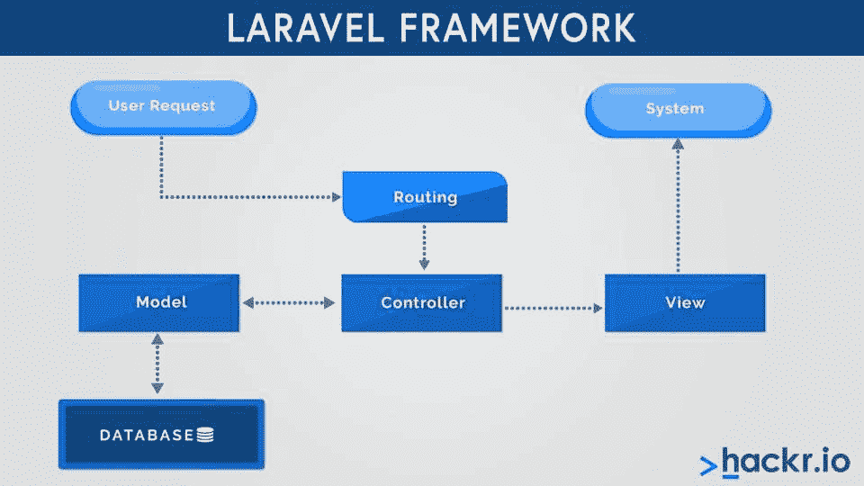

# 2023 年 50 大 Laravel 面试问答

> 原文：<https://hackr.io/blog/top-laravel-interview-questions-and-answers>

Laravel 是一个开源的 PHP web 框架，用于开发响应式 web 应用。它由 Taylor Otwell 创建，遵循模型-视图-控制器(MVC)架构设计模式。它也是一个在麻省理工学院许可下的免费网络框架。

今天，[拉勒维尔开发商](https://hackr.io/blog/laravel-cheat-sheet)需求量很大。然而，要成为一名 PHP 或 Laravel 开发人员，你必须具备大量的知识和经验，包括:

*   使用 Laravel 框架的实践经验
*   计算机科学或任何其他相关课程的学士学位
*   扎实的面向对象 PHP 知识和 Laravel 5 [PHP 框架](https://hackr.io/blog/best-php-frameworks)
*   精通 SQL 模式设计、REST API 设计和坚实的原则
*   软件测试、MySQL 评测、查询优化知识

这篇文章探讨了常见的面试问题和答案。它既包括初学者的基本问题，也包括更复杂的问题。如果你的目标是参加 Laravel 的面试并取得好成绩，下面的问题和答案肯定会有所帮助。

让我们开始吧。

## **Laravel 面试问题**

### **1。什么是 Laravel？**

Laravel 是一个开源的新一代 PHPweb[框架，由 Taylor Otwell 于 2011 年开发。它是专门为开发基于 web 的应用程序而设计的，遵循 MVC 模型，适合创建简单、优雅、结构良好的应用程序。它目前的稳定版本是 2020 年 9 月 8 日发布的版本 8。](https://hackr.io/blog/best-php-frameworks)

Laravel 附带了一个名为 Lumen 的框架，它构建在 Laravel 组件之上，是创建基于 Laravel 的微服务应用程序的完美选择。



### **2。Laravel 有哪些利弊？**

以下是 Laravel 框架的优点和缺点。

**Laravel 的优点:**

*   为了管理项目依赖关系，Laravel 使用了 Composer，允许开发人员提及包名、版本和可以在项目中使用的预建功能，从而加快了应用程序的开发速度
*   它带有一个易于学习和理解的刀片模板引擎。这在使用 PHP/HTML 语言时很有用。通过 Laravel 进行的 Web 开发允许以布局形式编写普通的 PHP 代码，从而有助于改进复杂任务的执行。
*   你可以通过 [Laracast](https://laracasts.com/browse/frameworks) 学习 Laravel，它提供免费和付费视频，简单易学
*   Laravel 有一个名为口才的对象关系映射器，帮助实现活动记录模式并与关系数据库交互。它作为一个包提供给 Laravel。
*   Laravel 有一个名为 Artisan support 的内置命令行工具，用户可以快速轻松地执行重复性任务
*   在 Laravel 模式的帮助下，开发人员可以通过编写简单的迁移脚本来创建数据库表和添加所需的列
*   它具有反向路由功能，使您的应用更加灵活

**拉勒维尔的缺点:**

*   将遗留系统迁移到 Laravel 具有挑战性
*   它附带了大量文档，对于初学者来说可能难以理解
*   升级不顺利

### **3。拉勒维尔有什么活动？**

事件是由程序识别和处理的动作。这些事件基于观察者-订阅者模式。Laravel 中的所有事件都存储在 app/Events 目录中，列表存储在 app/listeners 目录中。事件可以将应用程序的各个方面解耦为单个事件，这能够处理多个侦听器。

### **4。什么是 Laravel 中的验证？**

在 Laravel 中，ValidatesRequests 是类用来验证用户输入的特征。为了存储数据，我们通常使用在 Laravel 路由中定义的 create 或 store 方法和 get 方法。

可以在 Illuminate\Http\Request 对象中获取 Laravel validate 方法。如果规则中没有错误，并且成功通过，代码将按预期执行。但是如果验证失败，代码将不会运行，用户将得到 HTTP 请求的错误响应。

下面是如何在 Laravel 中定义验证规则的示例:

```
/**
* Store a post.
*
* @param  Request $request
* @return Response
*/
public function store(Request $request)
{
  $validatedData = $request->validate([
      'title' => 'required|unique:posts|max:255',
      'body' => 'required',
  ]);
}
```

在上面的代码中，标题和正文是必填字段。验证规则是连续的，因此如果任何验证失败，将不会检查进一步的验证。

### **5。如何通过 composer 安装 Laravel？**

作曲者以依赖关系管理器的身份出现。如果您的系统上没有安装，您可以使用 [这个链接](https://getcomposer.org/download/) 来安装。

在您的系统上成功安装了 composer 之后，您需要为您的 Laravel 项目创建一个项目目录。稍后，您需要导航到您创建 Laravel 目录的路径，并运行以下命令:

```
composer create-project laravel/laravel --prefer-dist
```

这个命令将帮助在当前目录下安装 Laravel。如果您想启动 Laravel，运行下面的命令。

```
php artisan serve 
```

Laravel 将在开发服务器上开始。现在，在浏览器上运行[http://localhost:8000/](http://localhost:8000/)。安装 Laravel 的服务器要求如下。

*   PHP > = 7.1.3。
*   OpenSSL PHP 扩展
*   PDO PHP 扩展
*   Mbstring PHP 扩展
*   令牌化器 PHP 扩展
*   XML PHP 扩展
*   Ctype PHP 扩展
*   JSON PHP 扩展

### **6。什么是 Laravel 的 PHP 工匠？**

PHP artisan 是 Laravel 中的一个命令行工具，它提供了各种有用的命令，可以帮助快速、轻松地创建应用程序。默认情况下，您将获得每个重要任务的命令，如数据库播种、迁移、配置缓存和许多其他任务。

以下是一些重要的 PHP artisan 命令:

*   php artisan make:控制器 :用于创建控制器文件
*   php artisan make:model :用于制作模型文件
*   php artisan make:迁移 :用于制作迁移文件
*   php 匠制作:播种器 :用于制作播种器文件
*   php 工匠制作:工厂 :用于制作工厂文件
*   PHP artisan make:Policy:用于制作策略文件
*   php 工匠制作:命令 :用于制作新工匠命令

### **7。Laravel 中的中间件是什么？**

中间件提供了一种机制，帮助过滤传入应用程序的 HTTP 请求。用认证来解释基本的中间件。如果用户没有通过身份验证，他们将被重定向到登录页面，如果用户通过身份验证，他们将被允许进行进一步的处理。在中间件的帮助下，所有这些都是可能的。

Laravel 有一个PHP artisan make:middleware<middleware _ name>命令，帮助在你的应用内定义新的中间件。默认情况下，中间件将存储在 app/Http/Middleware 目录中。

如果您想为每个 HTTP 请求运行中间件，请在 app/Http/Kernel.php 类的＄middleware 属性中列出中间件类。如果您想专门分配中间件，请在 app/Http/kernel . PHP class $ routemidleware 属性的键-值对中分配它。

### **8。Laravel 引擎用的是什么模板？**

Laravel 自带 Blade 模板引擎，帮助用户在视图中使用普通 PHP 代码，然后编译并缓存该视图，直到下一次修改。您可以在 resources/views 目录中获得与刀片视图相关的文件，扩展名为. blade.php.

下面是刀片文件的一个例子。

```
<!-- /resources/views/alert.blade.php -->
<div class="alert alert-danger">
  {{ $slot }}
</div>
```

在变量$slot 中，您可以指定任何想要的值来注入组件。

组件将如下所示:

```
@component('alert')
  <strong>Whoops!</strong> Something went wrong!
@endcomponent
```

@component 在这里是刀片指令。 ****

### **9。解释 CSRF 保护和拉勒维尔的 CSRF 令牌。**

CSRF 被定义为跨站点伪造攻击，这是一种恶意利用，通过验证的用户运行未经授权的命令。在这种情况下，Laravel 将为每个活跃用户的会话自动生成 CSRF 令牌。这个令牌将验证向应用程序发出未授权请求的已验证用户。

```
<form method="POST" action="/profile">
  @csrf
  ...
</form>
```

假设您正在为您的应用程序创建一个 HTML 表单。确保在表单中包含一个隐藏的 CSRF 令牌字段，这样中间件将检查并验证该字段。VerifyCsrfToken 中间件包含在 web 中间件组中。您可以使用@csrf blade 指令在应用程序的表单上生成令牌字段。

如果您使用的是 JS 驱动的应用程序，JS HTTP 库会自动将 CSRF 令牌附加到每个 HTTP 请求上。

### 10。解释一下 Laravel 的门面。

Laravel facade 为应用程序的服务容器中可用的类提供了一个静态接口。在 Laravel 中，所有的外观都存储在 Illuminate\Support\Facades 名称空间中。您可以在不需要注入的情况下轻松实现 facade，从而允许您在同一个类中使用多个 facade。它有一个表达性的语法，确保比传统的静态类的方法更高的灵活性。

入口外观将看起来像:

```
use Illuminate\Support\Facades\Cache;
Route::get('/cache', function () {
  return Cache::get('key');
});
```

### **11。拉勒维尔的雄辩是什么？**

在继续讨论雄辩的概念之前，理解什么是 ORM(对象关系映射)是很重要的。ORM 是一种编程方法，可以帮助用户在关系数据库和面向对象编程语言之间转换数据。您可以将其称为对象关系映射器。

雄辩是 Laravel 中常用的一种 ORM，允许用户高效地使用数据库。每个数据库都有一个与表交互的特定模型。

口才有以下几种关系:

*   一对一
*   多对一
*   一对多
*   多对多
*   有一个到
*   Has_many 到

**12。Laravel 框架的优点是什么？**

### 以下是使用 Laravel 框架的优势:

免费

有助于应用程序的简单配置

*   该框架基于 MVC 模式
*   提供广泛的模块和库，帮助开发人员加快开发过程
*   确保高性能并简化布线过程
*   提供了一个雄辩的 ORM，允许你处理各种数据库相关的任务
*   支持单元测试的内置设施
*   拥有强大的社区支持

*   13。Laravel 框架有什么特点？

以下是 Laravel 框架的重要特征:

### 为处理数据库相关任务提供了雄辩的 ORM

附带一个查询生成器

*   为反向布线提供了一个简单的过程
*   提供类自动加载，并附带 Restful 控制器
*   自带刀片模板引擎
*   您可以选择惰性收集
*   单元测试更容易
*   提供数据库播种并支持轻松迁移

*   **14。Laravel 最新版本包含哪些功能？**

Laravel 的最新稳定版本是 Laravel 8。下面是 Laravel 8 的一些好的特性:

### 拉勒维尔急流

车型目录

*   模型工厂类
*   迁移挤压
*   时间测试助手
*   动叶片组件
*   限速改进

*   15。如何检查 Laravel 的安装版本？

首先，打开命令行终端，导航到项目目录。接下来，执行以下任何命令来检查 Laravel 的安装版本。

### 或

16。Laravel 项目的项目结构是怎样的？

这是任何 Laravel 项目的目录结构:

```
php artisan --version
```

**app 文件夹:** 包含一个应用的源代码，由五个子文件夹组成，分别是控制台文件夹、异常文件夹、Http 文件夹、模型文件夹、提供者文件夹。这些子文件夹进一步包含异常处理程序、控制器、中间件、服务提供者和模型。

```
php artisan -v
```

### ***注意:**在 Laravel 7 中，你没有任何名为 Models 的文件夹。所有模型文件都存在于 app 文件夹中，而不是 app/Models 文件夹中。*

*   **引导文件夹:** 包含引导文件

**config 文件夹:** 包含配置文件

**数据库文件夹:** 包括数据库相关文件和三个子文件夹，即工厂文件夹、迁移文件夹、种子文件夹和。gitignore 文件。这些子文件夹进一步存储大量数据、数据库迁移和种子。

**公共文件夹:** 有初始化应用程序所需的文件

*   **resources 文件夹:** 包含 HTML、CSS 和 JavaScript 的文件。它包含四个子文件夹，即 CSS 文件夹、js 文件夹、lang 文件夹和 views 文件夹。
*   **路线文件夹:** 包含路线定义
*   **存储文件夹:** 由缓存文件、会话文件等组成
*   **tests 文件夹:** 包含测试文件，就像单元测试文件一样。
*   **厂商文件夹:** 包含所有的 composer 依赖包
*   **。env 文件:** 包含环境变量
*   **composer.json 文件:** 包含依赖关系
*   **package.json 文件:** 该文件用于应用的前端，类似于 composer.json 文件

*   **17。Laravel 中的 bundles 是什么？**
*   Laravel 中的包用于增加应用程序的功能。您也可以将包称为包含配置、路由、迁移、视图等的包。

18。什么是路由？

### 路由是一种接受输入请求并将其发送到控制器内相关功能的技术。Laravel 中有两种类型的路由文件，如下所述:

routes 文件夹中的 web.php 文件

routes 文件夹中的 api.php 文件

**19。如何在拉勒维尔创建一条路线？**

*   如果您想在 Laravel 中创建一条路线，使用控制器或直接将代码添加到路线中。下面是一个例子，帮助您通过直接添加代码来创建路线。
*   示例:替换 routes/web.php 文件中的代码，并添加以下代码段。

在浏览器中运行项目，您将看到“欢迎！”作为输出。

### 20。什么是 Laravel 中的认证？

在 Laravel 中，认证是验证应用程序用户的过程。您可以通过识别用户的用户名和密码来实现这一点。此外，您可以使用另一个参数进行身份验证。如果提供的凭证正确，则用户通过了身份验证；否则，用户未经身份验证。

Laravel 在认证过程中使用保安和提供商。守卫将指定如何为每个请求验证用户，而提供者将指定如何从持久存储中检索用户。

```
<?php
use Illuminate\Support\Facades\Route;

Route::get('/', function () {
return "Welcome!";
});
```

### **21。Laravel 中 GET 和 POST 方法有什么区别？**

下面是 Laravel 中 GET 和 POST 方法的一些主要区别:

**获取方法**

**发布方法**

### 此方法将从特定资源请求数据。

它会将数据发送到服务器。

| 它将包括 URL 中的参数。 | 它将包括正文中的参数。 |
| URL 将显示数据。 | URL 不会显示数据。 |
| 此方法将只允许 ASCII 字符。 | 该方法允许 ASCII 字符和二进制数据。 |
| 您只能将有限的数据用于 GET 方法。 | 使用的数据没有限制。 |
| 您可以在浏览器历史记录中查看请求。 | 您无法在浏览器历史记录中查看请求。 |
| 您可以将 GET 请求加入书签。 | 您不能将发布请求加入书签。 |
| 可以缓存。 | 它不能被缓存。 |
| 与 POST 方法相比，它不太安全。 | 与 GET 方法相比，它是高度安全的。 |
| 您不能用它来发送敏感数据，如密码。 | 您可以用它来发送敏感数据，如密码。 |
|  | 以下是 Laravel 中发送邮件的一些常用工具: |
| 邮件陷阱 | 气枪 |

Mailchimp

顶杆

*   亚马逊简易电子邮件服务(SES)
*   Swiftmailer
*   邮戳
*   **23。解释 Laravel 中的反向路由。**
*   反向路由是根据名称或符号以及路由声明生成 URL 的过程。在反向路由的帮助下，应用程序变得更加灵活，并提供了更好的接口，这使得编写代码更加容易。
*   **例如:**

 **24。Laravel 有哪些服务商？**

### Laravel 的服务提供商扮演着核心角色，帮助配置所有应用和核心服务。它们是帮助维护类依赖性和执行注入的健壮工具。它还为 Laravel 提供了在 Laravel 的服务容器中绑定各种组件的指令。

为了生成服务提供者，使用下面的 artisan 命令:

Laravel 中的每个服务提供商都会扩展 Illuminate \ Support \ ServiceProviderclass，并附带以下两个功能:

```
Route:: get('list', 'blog@list');

{{ HTML::link_to_action('blog@list') }}
```

**25。拉勒维尔的宅地是什么？**

这是一个预先打包的官方虚拟机，允许开发者使用所有必要的工具来开发 Laravel。它附带了 Ubuntu、Gulp、Bower 和其他基本的开发工具，允许开发全面的基于 web 的应用程序。它将为开发人员提供一个开发环境，而无需在您的机器上安装 PHP、web 服务器或其他与服务器相关的软件。

**26。为什么 Laravel 比其他 PHP 框架更受青睐？**

```
php artisan make: provider ClientsServiceProvider 
```

以下是相比其他 PHP 框架更喜欢 Laravel 的原因:

### 与其他选项相比，Laravel 允许快速设置和定制

附带多个文件系统。

提供预装套餐，如 Laravel 交际花、Laravel 收银员、Laravel 护照等。

### 内置认证系统

为处理数据库相关操作提供了雄辩的表单

*   **27。Laravel 中的 dd()是什么？**
*   Laravel 提供了 dd()函数，允许用户将变量的内容转储到浏览器中，然后停止进一步脚本的执行。dd 代表转储和终止，它首先转储一个变量或对象并终止(终止)脚本的执行。如果您愿意，可以很容易地将这个函数隔离在一个可重用的函数文件或类中。

*   **28。拉勒维尔的产量是多少？**
*   Offers an “Artisan” command-line tool for running various commands for carrying out various functions in Laravel

    Laravel 提供@yield 来定义布局中的一个部分，从子页面获取内容，并提交给母版页。因此，每当您使用 Laravel 执行刀片文件时，它首先会检查您是否扩展了主布局。如果是这样，它将移动到主布局并开始获取@sections。

**29。Laravel 中的请求是什么？**

在 Laravel 中，请求被用来与传入的 HTTP 请求进行交互，还有会话、cookies，甚至文件，如果它们与请求一起提交的话。类 Illuminate\Http\Request 负责 Laravel 中的请求。

### 无论何时你向 Laravel 路由提交任何请求，它都会转到控制器方法，在依赖注入的帮助下，该请求的对象将在控制器方法中可用。您可以对请求执行各种操作，例如验证和授权。

您甚至可以创建一个请求验证类来存储验证规则和相关的错误消息。考虑下面的例子:

### **30。服务提供者类中的注册和引导方法是什么？**

在服务提供者类中，register 方法用于将类或服务绑定到服务控制器。您不能使用它来访问应用程序中的任何其他功能或任何类，因为您想要访问的服务可能还没有加载到容器中。

服务提供者类中的引导方法有助于运行容器中包含的所有依赖项，并且您可以访问引导方法中的功能。

```
/**
* Store a new blog post.
*
* @param  \Illuminate\Http\Request  $request
* @return \Illuminate\Http\Response
*/
public function store(Request $request)
{
    $validated = $request->validate([
        'title' => 'required|unique:posts|max:255',
        'body' => 'required',
    ]);

    // The blog post is valid...
}
```

31。Laravel 中的依赖注入是什么？

Laravel 的服务控制器帮助解决所有控制器中的所有依赖关系。因此，您可以很容易地在控制器方法或构造函数中对依赖关系进行类型提示。方法中的依赖将被解析并注入到方法中，这种注入将解析被称为依赖注入的类。

32。你怎么能关闭 CSRF 保护一个特定的路线在拉韦？

如果您想关闭 Laravel 中特定路由的 CSRF 保护，您需要在**app/Http/Middleware/verifycrsftoken . PHP 文件** 中添加以下几行。

###  **33。你如何更新 Laravel？** 

如果您想将 Laravel 框架更新到最新版本，您需要打开 composer.json 文件，并对 Laravel 框架的版本进行所需的更改，使其成为最新版本。执行以下命令更新 laravel 框架:

34。Laravel 中的闭包是什么？

```
//add an array of Routes to skip CSRF check
private $exceptUrls = ['controller/route1', 'controller/route2'];
//modify this function
public function handle($request, Closure $next) {
//add this condition foreach($this->exceptUrls as $route) {
if ($request->is($route)) {
  return $next($request);
}
}
return parent::handle($request, $next);
}
```

闭包是 Laravel 中用作回调函数的匿名方法，你也可以把它作为函数中的参数。

### 通过改变 handle()方法中的闭包函数调用，可以很容易地将参数传递给闭包。借助闭包，您可以访问变量范围之外的变量。

例子

```
composer update
```

可以给 handle()方法添加闭包参数，现在可以调用 handle()方法，将一个服务作为参数传递。

35。Laravel 中的 with()是什么？

在 Laravel 中，with()函数用于急切加载。您可以在第一个命令后使用 with()方法，而不是使用两个或多个单独的查询从数据库中获取数据。您将获得更好的用户体验，因为您不必等待更长时间来从数据库获取数据。

```
function handle(Closure $closure) { 
    $closure(); 
} 
handle(function(){ 
echo "Hello"'; 
}); 
```

**36。Laravel 中的软删除是什么？**

在 Laravel 中，软删除是一个帮助软删除模型而不是从数据库中实际删除它们的特性。如果希望对模型启用软删除，需要在模型中提及软删除属性，如下图:

*使用* **照亮\数据库\雄辩\软删除；**

你可以用这个

### 使用 **软删除；** *在我们的模型属性中。*

在使用 delete()查询之后，如果记录没有从数据库中删除，则在记录上设置 deleted_at 时间戳。

37。什么是 Laravel 中的存储库模式？

在存储库模式的帮助下，你可以在不知道一个对象是如何存在的情况下使用它。它充当数据层的抽象，这意味着不需要知道数据是如何持久存储的。因此，业务逻辑依赖于存储库来获取正确的数据。简而言之，它用于分离应用程序中的数据访问层和业务逻辑。

38。Laravel 中的 singleton 设计模式是什么？

在 Laravel 中，单例设计模式是一种类呈现自身的单个实例的模式。这样，您可以将一个类的实例的创建限制为一个对象。只要系统中需要该类的单个实例，就可以使用它。如果您正确地实现了它，第一个调用将实例化该对象，其余的调用将返回到同一个实例化的对象。

39。拉勒维尔的观点是什么？

Laravel 中的视图由应用程序所需的 HTML 代码组成。此外，我们可以将 Laravel 中的视图定义为一种方法，将控制器逻辑和域逻辑从表示层中分离出来。resources 文件夹包含视图，其路径是 resources/views。

### **例如:**

 **40。什么是 Laravel 中的方法欺骗？**

通常，HTML 表单不支持上传、修补或删除操作。因此，如果您想从 HTML 表单中调用这些操作，您需要通过向该表单添加 hidden _method 字段来定义它们的路径。因此，用 _method 字段发送的值将被用作 HTTP 请求方法，如下所示:

### 为了生成 _method 输入，需要使用@method Blade 指令，比如: 

在 Laravel 中，这被称为方法欺骗。

```
<html>
<body>
  <h1>Best Interview Question<h1>
</body>
</html>
```

### 41。拉勒维尔的廷克是什么？

在 Laravel 中，tinker 是一个强大的 REPL 工具，用于在交互式 shell 中使用命令行与 Laravel 应用程序进行交互。它附带了 5.4 的发布版本，解压在一个单独的包中。

```
<form action="/foo/bar" method="POST">
<input type="hidden" name="_method" value="PUT">
<input type="hidden" name="_token" value="{{ csrf_token() }}">
</form>
```

要安装 Tinker，运行以下命令:

```
<form action="/foo/bar" method="POST">
@method('PUT')
@csrf
</form>
```

执行 Tinker，执行以下命令:

### **42。如何清除 Laravel 中的缓存？**

要清除 Laravel 中的缓存，按相同的顺序运行以下命令:

 **43。拉勒维尔的 REPL 是什么？**

```
composer require laravel/tinker
```

REPL 代表读取-评估-打印循环。它是一个交互式 shell，接受单个用户输入，处理它，并将结果返回给客户端。

```
php artisan tinker
```

### **44。Laravel 中的 updateOrinsert()方法有什么用？**

该方法用于在条件匹配时更新数据库中的现有记录，或者在没有匹配记录时创建记录。它将返回布尔值。

```
php artisan config:clear
php artisan cache:clear
composer dump-autoload
php artisan view:clear
php artisan route:clear
```

您可以使用以下语法:

**45。如何在 Laravel 中更改默认的数据库类型？**

### 为此，您需要更新 config/database.php 文件中的以下内容。可以选择 MySQL 数据库。

**46。你如何在拉弗尔停止一个 Artisan 服务器？**

```
DB::table('blogs')->updateOrInsert([Conditions],[fields with value]);
```

您可以分三步停止 Artisan 服务器，如下:

### 首先，同时按 Ctrl + Shift + ESC。定位 php 系统走匠，用合适的点击- >杀死进程将其杀死。

稍后，重新打开命令行并再次启动服务器

```
'default' => env('DB_CONNECTION', 'mysql')
```

你可以通过 Ctrl + C 发送杀死标志来杀死这个方式

**47。如何在 Laravel 中生成应用程序密钥？**

*   运行以下命令在 Laravel 中生成应用程序密钥:

*   **48。如何在 Auth 中延长登录到期时间？**

如果您想延长登录到期时间，请对 config\session.php 文件进行必要的更改。您需要更新变量“生命线”的值，也可以根据您的要求更新变量。

49。如何回滚 Laravel 中的最后一次迁移？

```
php artisan key:generate
```

您可以运行以下 artisan 命令来回滚 Laravel 中的最后一次迁移:

50。如何检查当前的路线名称？

您可以使用以下方法查看当前路线名称:

### Laravel 是所有 PHP web 开发者中最常用的 web 框架之一。Laravel 7 版和 Laravel 8 版有中度差异；但是，其他功能仍然相同。

这些简单的面试问题会让你做好准备。

```
php artisan migrate:rollback --step=1
```

Laravel 框架借助路由、控制器、中间件、视图、刀片模板和雄辩模型等特性，帮助开发人员无缝地创建响应迅速、可靠的基于 web 的应用程序。

### 如果你的目标是成为一名 Laravel 或 PHP 开发人员并参加面试，这篇文章会帮助你做好准备。祝你好运！

```
request()->route()->getName()
```

**对初学者学习 Laravel 感兴趣？检查本课程！**

[从零飞到打造 Laravel CMS！](https://click.linksynergy.com/link?id=jU79Zysihs4&offerid=1045023.2275171&type=2&murl=https%3A%2F%2Fwww.udemy.com%2Fcourse%2Fphp-laravel-for-beginner-from-zero-fly-to-the-heaven%2F)

**Interested in learning Laravel for beginners? Check this course!**

[From zero fly to build Laravel CMS!](https://click.linksynergy.com/link?id=jU79Zysihs4&offerid=1045023.2275171&type=2&murl=https%3A%2F%2Fwww.udemy.com%2Fcourse%2Fphp-laravel-for-beginner-from-zero-fly-to-the-heaven%2F)