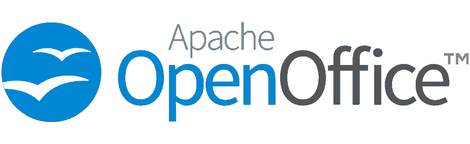
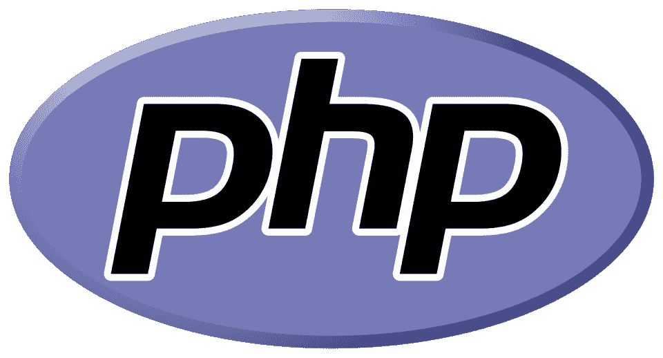
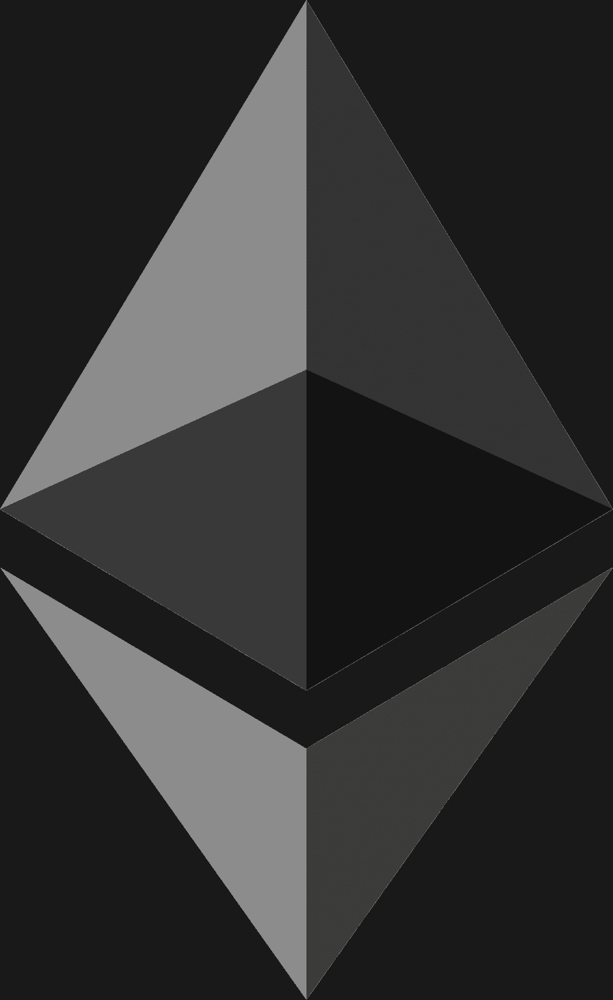

# 2023 年流行的顶级开源软件示例[更新]

> 原文：<https://hackr.io/blog/top-open-source-software>

这年头几乎感觉什么都有一个 app。最糟糕的是，许多应用程序是为非常特殊或特定的目的而创建的，这意味着你需要各种应用程序来做各种事情。随着你对程序需求的增加，你可能会发现你也不得不开始花更多的钱直接购买软件或者订阅某些服务。

有了这么多与软件相关的成本，人们现在寻找免费的替代品才是有意义的。这就是开源的用武之地。

为了帮助您减轻钱包的压力，我们列出了 2023 年可用的一些最佳开源软件示例。我们开始吧！

## 什么是开源软件？[定义]

描述开源软件最简单的方式是，它是在特定许可下发布的计算机软件(即程序和应用程序)。这些许可证允许用户免费使用开源程序。它还允许一些其他的事情——例如，用户可以检查一个开源软件的源代码。用户也可以自由地为开源项目做出贡献，或者对某些软件进行改进。最后，用户也可以自由地分发开源软件和他们在此基础上构建的任何东西。

Chromium 是开源软件的一个很好的例子。Chromium 本身是一个浏览器项目，旨在为用户提供更快、更安全、更好的浏览体验。因为它是开源的，人们能够看到它的源代码。人们开始进行改造和修改，甚至开始在 Chromium 的源代码上构建。结果呢？你有像谷歌 Chrome、微软 Edge 和 Brave Browser 这样的浏览器，它们都是由 Chromium 构建的。

## **为什么要使用开源软件？**

如果你想知道为什么你应该考虑使用开源软件，这里有几个原因:

*   成本——人们选择使用开源软件的第一个也是最大的原因之一就是节省成本。开源软件通常是免费的，尽管许多项目欢迎(完全自愿的)捐赠支持。

*   **安全性和稳定性** -在大多数情况下，开源软件会吸引更多的人关注，这意味着人们也倾向于发现更多的漏洞和问题，然后可以得到修复。

*   大多数开源软件是由越来越多的使用、测试、修改、改进和评审软件的人来支持和维护的。如果您在使用开源应用程序时遇到问题，找到支持是相对容易的。

*   **控制**——开源软件允许你查看它的源代码，所以你可以确切地看到一个程序在做什么——如果你知道如何做，甚至可以改变它的工作方式。

## **2023 年最佳开源软件范例**

### **浏览器**

[****](https://www.mozilla.org/en-US/firefox/new/)

Firefox 将永远是许多人使用和喜爱的开源软件的典范。尽管由于谷歌 Chrome 巨大的市场份额和大量的其他竞争，它目前的受欢迎程度有所下降，但仍然有相当大的群体因为其安全性、隐私性、速度和性能而使用和喜爱这款浏览器。对于 Mozilla 和 Firefox 的未来有一些担忧，所以我们将会看到 Firefox 在未来几年会是什么样子。

**优点**

*   具有内置的安全和隐私功能
*   良好的用户体验
*   有很多可用的扩展，包括广告拦截器
*   轻量级；快速性能

**缺点**

*   可能会对您的计算机资源要求很高
*   对未来寿命或支持的一些担忧

[点击此处查看更多。](https://www.mozilla.org/en-US/firefox/new/)

[****](https://brave.com/download/)

勇敢浏览器在 2019 年 11 月首次发布了完整、稳定的版本，其余的都是历史了。Brave 经常出现在任何开源软件列表中，由于其许多内置功能有助于保护用户的隐私和安全，因此受到许多人的使用和喜爱。例如，它内置了广告和跟踪拦截器。

**优点**

*   关注用户隐私和安全
*   原生广告和跟踪拦截器
*   基于铬打造，速度快，重量轻

**缺点**

[点击此处查看更多。](https://brave.com/download/)

### **设计与艺术**

[****](https://www.gimp.org/downloads/)

GIMP 是一个图像编辑软件，可以在 GNU/Linux、Windows、Sun OpenSolaris 甚至 macOS 上运行。它有许多工具可以帮助用户处理图像，这样他们就可以修饰、恢复或创建新的作品。还有一些工具可以帮助创建图标、图形设计元素和艺术。作为一个免费的工具，GIMP 比付费选项更受限制，但许多人还是喜欢这个软件。

**优点**

*   用户友好，即使是初学者
*   可以从云、本地文件夹或外部驱动器运行
*   可以打开。PSD (Photoshop)文件

**缺点**

*   有限—只能处理灰度、8 位 RGB 和索引图像
*   有限的第三方插件
*   如果编辑包含大量图层的较大文件，性能会受到影响
*   比其他付费选项少的工具

[点击此处查看更多。](https://www.gimp.org/downloads/)

[开源贡献:开发者指南](https://click.linksynergy.com/deeplink?id=jU79Zysihs4&mid=39197&murl=https%3A%2F%2Fwww.udemy.com%2Fcourse%2Foss-developers%2F)

[****](https://krita.org/en/download/krita-desktop/)

在这份开源软件列表中，Krita 脱颖而出，成为 2D 动画和数字绘画的优秀艺术工具。它可以在 macOS、Linux 和 Windows 上运行，对于初学者和专业人士都是一个很好的选择。Krita 提供了许多功能，也支持 OpenGL。这个应用程序的伟大之处在于它有一个专门的、积极参与的社区，活跃在它的论坛上。

**优点**

*   大量可供选择的画笔
*   支持图层并具有图层管理功能
*   附带大量资料，帮助您学习该计划
*   有论坛的活跃社区

**缺点**

*   功能比 Photoshop 少
*   不太直观，对初学者来说可能有些吓人
*   比照片编辑或处理更适合数字艺术和绘画
*   如果你快速移动画笔，会有些滞后

[点击此处查看更多。](https://krita.org/en/download/krita-desktop/)

[****](https://www.blender.org/download/)

如果你曾经想学习如何做一些 3D 建模工作，Blender 是你最好的选择。它经常被认为是在 3D 管道中工作的最佳开源软件，包括:动画，建模，渲染，装配，模拟，合成，甚至运动跟踪。Blender 是用户友好的，尽管它确实有一点学习曲线。好消息是网上有大量免费教程可以帮助你学习！

**优点**

*   可以做任何事情，从雕刻和 3D 建模到照片和视频编辑
*   Blender 周围有一个庞大的在线社区
*   大量的教程和学习资源是免费的

**缺点**

*   有时会有问题
*   可能令人生畏且难以学习
*   对系统资源的需求

[点击此处查看更多。](https://www.blender.org/download/)

### **音频-视频**

[****](https://www.videolan.org/vlc/)

VLC 自 2001 年 2 月以来一直存在。从那时起，它就成了全世界许多人的首选媒体播放器。它是免费的、轻量级的，并具有多种功能，使您的媒体消费变得轻而易举。

**优点**

*   不受限制地在所有平台上工作
*   有很多工具，包括视频转换器等等
*   允许您播放各种类型的媒体文件

**缺点**

*   用户界面不是最好的，也不是最吸引人的
*   有时会崩溃
*   通过 VLC 将音量提高超过 100%会损坏您的扬声器

[点击此处查看更多。](https://www.videolan.org/vlc/)

[****](https://www.audacityteam.org/download/)

Audacity 也已经存在了一段时间。众所周知，对于需要处理音频文件的人来说，它是最好的开源软件之一。Audacity 不仅仅是一个多声道录音机，它还是一个编辑器，让人们能够编辑音频记录，整合音乐等等。Audacity 还支持各种插件，使得使用这个工具更加有趣。

**优点**

*   支持大多数操作系统
*   出色的功能可帮助您编辑音频并创造高品质的声音
*   支持大量插件

**缺点**

*   对于您可能遇到的任何问题，很难获得支持

[点击此处查看更多。](https://www.audacityteam.org/download/)

### **操作系统和实用程序**

[****](https://www.linux.org/pages/download/)

如果你以前从未听说过 Linux，你可能会感到惊讶，但它实际上是最好的开源技术例子之一。 [Linux](https://www.linux.com/what-is-linux/) 是一个操作系统，很像 Windows 或者 macOS。但是仅仅因为你以前没有听说过它，并不意味着你在某些方面没有使用过它。Linux 在技术上无处不在；你可以在家用电器，汽车，甚至智能手机中找到它。

**优点**

*   非常安全，可以抵御潜在的威胁和病毒
*   简单的用户界面
*   轻巧快速
*   适应性很强
*   对计算机资源要求不高

**缺点**

*   更陡峭的学习曲线，不适合初学者
*   软件兼容性问题——并非所有软件都可以在 Linux 上使用
*   硬件驱动程序可用性
*   不是游戏的最佳选择

[点击此处查看更多。](https://www.linux.org/pages/download/)

[****](https://www.7-zip.org/download.html)

你可能已经听说过 [WinRAR](https://www.win-rar.com/start.html?&L=0) 了。WinRAR 是试用软件，这意味着你可以试用它，并在许可证到期时升级(尽管人们可以几年甚至几十年不升级，因为 WinRAR 从未严格执行其许可证)。

7Zip 很像 WinRAR，因为它也是一个文件归档程序。然而，它是完全开源的，而不是试用软件。它可以在 Windows、Linux、macOS、ReactOS 和 BSD 上运行。

**优点**

*   适用于各种压缩格式
*   易于使用的界面使得初学者也可以使用
*   与 Windows 文件资源管理器集成良好

**缺点**

*   在某些情况下，压缩过程可能需要一段时间

[点击此处查看更多。](https://www.7-zip.org/download.html)

[****](https://filezilla-project.org/download.php?platform=win64)

FileZilla 是一个 FTP(文件传输协议)应用程序，允许您将文件从服务器传输到客户端。它可以在 Windows、Linux、macOS 和其他平台上运行，并且易于使用和理解。它也有各种语言版本，以便更好地访问。FileZilla 确实有其专业版，以防你发现自己需要比免费版更多的功能。

**优点**

*   跨平台
*   支持 FTP
*   灵活且免费，但要获得更多功能，你可以付费购买专业版
*   可用的服务器版本

**缺点**

*   对初学者来说不是最容易掌握的

[点击此处查看更多。](https://filezilla-project.org/download.php?platform=win64)

### **生产力和 CMS**

[****](https://www.openoffice.org/download/)

听说过一个叫微软 Office 的软件套件吗？Apache OpenOffice 就是这样——只不过它是完全免费的。这个开源例子为微软昂贵的生产力工具提供了一个很好的选择。有了 Apache OpenOffice，您可以进行文字处理，处理演示文稿，并随心所欲地平衡电子表格。为了方便起见，OpenOffice 还提供了许多其他工具。

**优点**

*   可靠的
*   支持大多数流行的生产力文件格式
*   拥有大多数 Microsoft Office 产品的软件替代品
*   系统重量轻

**缺点**

*   到处都有一些设计和格式问题
*   可能需要一段时间来适应，尤其是来自微软办公室
*   缺少 Microsoft Office 上的一些可用功能

[点击此处查看更多。](https://www.openoffice.org/download/)

[****](https://wordpress.org/download/)

WordPress 是一个内容管理系统(CMS ),是开源软件中最好和最受欢迎的例子之一。WordPress 最初是作为一个博客服务开始的(在转变为网站建设者之前，它以 WordPress 的名字存在了一段时间)。然后，它成为一个独立的实体作为 CMS，并基本上采取了世界风暴。如今，世界上 43%的网站运行在 WordPress 上，我们不会对这个数字的增长感到惊讶。

**优点**

*   用户友好且相对容易学习
*   大量的插件和附件可以帮助扩展它的功能
*   Responsive 有大量免费和付费主题可供选择
*   有内置的功能，以帮助用户改善他们的搜索引擎优化

**缺点**

*   需要你自己的网络主机
*   对主题、插件甚至 WordPress 本身的更新有时会导致问题，需要恢复到旧版本(在更新之前一定要创建一个备份！)
*   易受黑客攻击，尤其是如果你下载和使用不可信的插件和主题
*   容易使 WordPress 超负荷膨胀，降低网站性能

[点击此处查看更多。](https://wordpress.org/download/)

### **编程**

[****](https://www.python.org/downloads/)

Python 是当今最流行的编程语言之一，而且它是完全开源的。这种语言可以用于多种用途，例如创建 web 应用程序、桌面应用程序，甚至视频游戏。Python 是初学者最好的编程语言之一，因为它的学习曲线较低。它在机器学习和人工智能领域也变得越来越受欢迎。

实际上，你可以用 Python 做的事情是没有限制的，尤其是当你使用一些 IDE 或库的时候！

**优点**

*   周围有一个大型社区，如果您遇到任何问题，可以很容易地找到支持
*   大量可供选择的图书馆
*   灵活、可扩展
*   非常适合机器学习、人工智能、科学和数字应用

**缺点**

*   不是最快的
*   不太适合创建移动应用
*   会占用大量内存

[点击此处查看更多。](https://www.python.org/downloads/)

[****](https://guides.rubyonrails.org/v5.0/getting_started.html)

随着其他语言和框架越来越流行，Ruby on Rails 已经慢慢失去了活力。然而，Ruby on Rails 至今仍是构建网站和 web 应用程序最流行的框架之一。Rails 是用 Ruby 编程语言构建的，被互联网上的许多大公司和网站所使用。Basecamp、GitHub、Crunchbase、Airbnb、Cafepress 等网站都使用 Ruby on Rails。

**优点**

*   可以帮助开发者更快更高效
*   有许多库和有用的工具
*   背后有一个庞大的社区
*   严格遵守标准

**缺点**

*   不是最灵活的
*   需要适当的优化，否则项目运行时间会受到负面影响

[点击此处查看更多。](https://guides.rubyonrails.org/v5.0/getting_started.html)

[****](https://www.php.net/downloads.php)

PHP 是一种编程语言，通常用于开发动态和交互式网站。它甚至可以嵌入到 HTML 中，这使得开发人员可以在任何网页上添加功能，而不必使用任何外部数据文件。PHP 也很容易掌握和使用，即使对初学者来说也是如此，这是它如此受欢迎的另一个原因。

**优点**

*   跨平台支持；平台独立性
*   加载相当快，即使在较慢的互联网
*   方便用户的
*   稳定可靠
*   灵活的
*   许多图书馆可供使用

**缺点**

*   一些安全问题；开发人员需要小心加强他们项目的安全性
*   不适合开发大型 web 应用程序
*   有时表现不佳

[点击此处查看更多。](https://www.php.net/downloads.php)

## **特别提及:开源区块链软件**

简单来说，区块链就是一个记录交易的系统。每次交易发生时，都会记录信息(通常在电子表格上)。然后，所有参与者都可以访问这些电子表格和记录。

区块链是完全开源的，这意味着它对社区参与和贡献开放。它是安全的，在金融领域应用最广泛。然而，它现在开始在其他行业取得进展，如电子商务、电子政务、在线投票等。

下面，您会发现一些最受欢迎的区块链开源示例:

[****](https://ethereum.org/en/)

尽管以太坊现在更广泛地被认为是最大的加密货币之一(很像比特币)，但它实际上也是将用户和企业联系在一起的软件，有助于创造“智能合约”。以太坊的开发团队不断更新和改进它，目标是提供更好的用户体验。

[点击此处查看更多。](https://ethereum.org/en/)

[****](https://ripple.com/)

Ripple 通常帮助企业管理金融交易。它确保数据安全，同时将银行和公司与全球各种服务提供商连接起来。

[点击此处查看更多。](https://ripple.com/)

[****](https://www.hyperledger.org/)

Hyperledger 有助于企业层面的业务更安全地进行全球交易。这是一个致力于改进跨平台区块链技术的平台。

[点击此处查看更多。](https://www.hyperledger.org/)

## **结论**

开源软件可以真正赋能人们的日常生活。它可以鼓励崭露头角的艺术家和音乐家进行创作，或将对技术感兴趣的人推向编程和计算机科学的世界。当今世界上有一个浩瀚的开源软件海洋。我们希望这份最好的开源软件示例列表能够帮助您找到一些瑰宝！

做一些测试？我们列出了几款[最佳开源应用安全测试工具](https://hackr.io/blog/top-10-open-source-security-testing-tools-for-web-applications)。

**人也在读:**