# 2023 年最佳编程课程:18 大在线课程

> 原文：<https://hackr.io/blog/top-programming-courses>

你想学习编程，但是从哪里开始呢？有很多在线编程课程。一些最好的甚至是免费的。今天，我们将看看各种各样的编程课程，从免费、简单的课程到约翰霍普金斯大学和哈佛大学提供的证书。

## 需要什么编程课程？

虽然有通用的“编程类”，但大多数程序员选择一种语言或一系列语言。问问你自己:你想开发什么类型的应用程序？要不要开发 web 应用？移动应用？桌面游戏？

你最终的职业目标将决定哪门在线计算机编程课程最适合你。对于 web 开发，JavaScript 或 Python 编程课程可能是最佳选择。对于物联网或轻量级移动开发，你可能会选择 C 编程课程或 Java 编程课程。

如果你不确定你想要什么类型的编程，通用编程课程会向你介绍多种语言。

我们已经创建了一个完整的计算机编程课程列表，包括 C、Java、全栈和 Python。看看今天为你找到的最好的编程课程。

## 通用编程课程

一般的计算机编程课程可以作为编程语言的入门。如果你需要一个通用的在线编程课程，这些是最健壮、最实用、最容易获得的。

[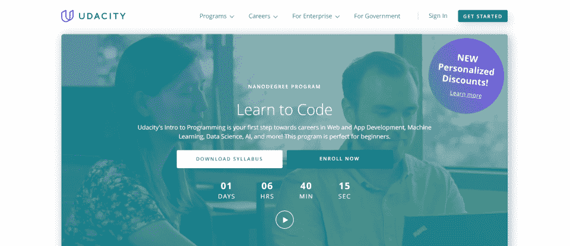](https://imp.i115008.net/DVQ6My)

在 Udacity 的编程入门 NanoDegree 项目中，学生将学习 HTML、CSS、Python 和 JavaScript——四种流行的标记和编程语言，这是作为程序员建立基础所必需的。这个课程是一个“非学位”项目，不需要任何编程经验。学生们被分配到一个可以帮助他们学习和成长的群体中。该课程预计学习时间为四个月，每周工作 10 小时。

课程规格:

*   级别:初学者
*   费用:1356 美元
*   包含:

*   现实世界的项目
    *   项目审查
    *   导师支持
    *   恢复支持
    *   结业证书:是
    *   [在此注册](https://imp.i115008.net/DVQ6My)

[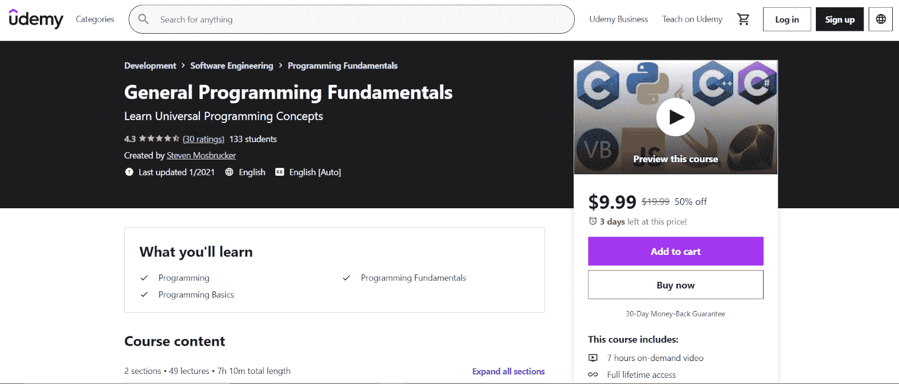](https://click.linksynergy.com/deeplink?id=SeYHzlfZEmI&mid=39197&murl=https%3A%2F%2Fwww.udemy.com%2Fcourse%2Fgeneral-programming-fundamentals%2F)

通过本通用基础课程学习通用编程概念。通用编程基础课程涵盖编程基础，包括程序的各个部分、变量如何工作、循环如何工作等等。这门编程基础课程旨在让学生在不使用特定语言的情况下，全面了解编程的能力和工作原理。

课程规格:

级别:初学者

*   价格:19.99 美元
*   包含:
*   Contains:

*   7 小时的视频
    *   基本概念和中间概念
    *   结业证书:是

*   [在此注册](https://click.linksynergy.com/deeplink?id=SeYHzlfZEmI&mid=39197&murl=https%3A%2F%2Fwww.udemy.com%2Fcourse%2Fgeneral-programming-fundamentals%2F)

[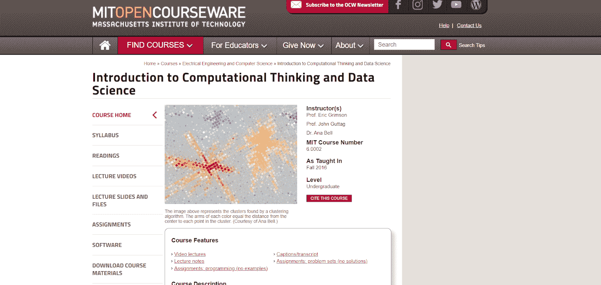](https://ocw.mit.edu/courses/electrical-engineering-and-computer-science/6-0002-introduction-to-computational-thinking-and-data-science-fall-2016/)

透过麻省理工学院的开放式课程，麻省理工学院提供各种程度的大学课程。这门课涵盖了编程的基础，不需要编程经验。学生将学到更多关于计算在解决问题中的作用，而不是学习代码本身。课程中给出的任何例子都是用 Python 编写的，学生在完成程序时将能够编写小程序。他们不需要预先的编程知识。

课程规格:

级别:初学者

*   费用:免费
*   包含:
*   本科班

*   视频讲座
    *   课堂笔记
    *   分配
    *   竣工证书:否
    *   [在此注册](https://ocw.mit.edu/courses/electrical-engineering-and-computer-science/6-0002-introduction-to-computational-thinking-and-data-science-fall-2016/)

*   c 编程课程

c 语言是当今最流行的语言之一——也绝对是最古老的语言之一。所以，有很多 C 编程课程才有意义。一些[最好的 C 编程课程](https://hackr.io/blog/best-c-courses)相当先进，但是非常值得。以下是 C 语言的最佳入门课程。一旦你学会了 C，你会发现继续学习 C++编程课程或 C#编程课程会更容易。

## [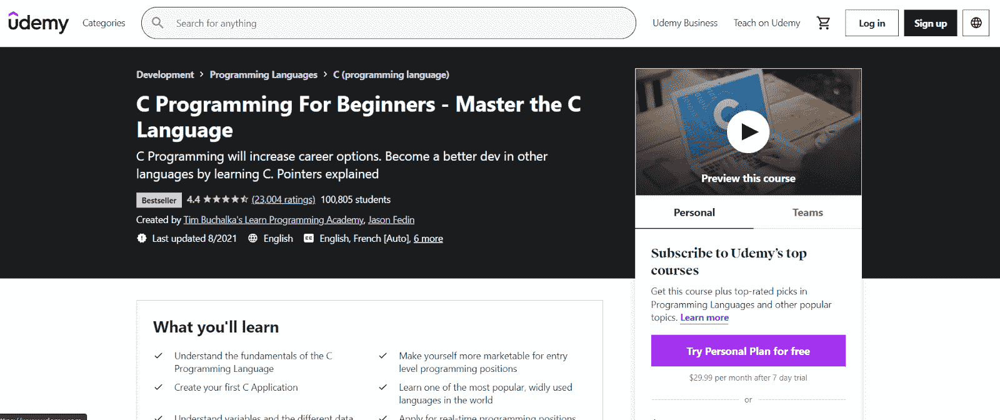](https://click.linksynergy.com/deeplink?id=SeYHzlfZEmI&mid=39197&murl=https%3A%2F%2Fwww.udemy.com%2Fcourse%2Fc-programming-for-beginners-%2F)

通过本课程，你将学习 C 编程语言的基础，创建一个 C 应用程序，甚至学习如何申请真正的编程职位。这门课程将带领一个对编程了解有限的人积极寻找该领域的工作。初学者应该仍然了解编程的基础知识和它是如何工作的，但这门课程涵盖了大多数基础知识。

课程规格:

级别:初学者

成本:109.99 美元

*   包含:
*   Cost: $109.99
*   24 小时视频

*   1 个可下载资源
    *   1 篇文章
    *   结业证书:是
    *   [在此注册](https://click.linksynergy.com/deeplink?id=SeYHzlfZEmI&mid=39197&murl=https%3A%2F%2Fwww.udemy.com%2Fcourse%2Fc-programming-for-beginners-%2F)

*   [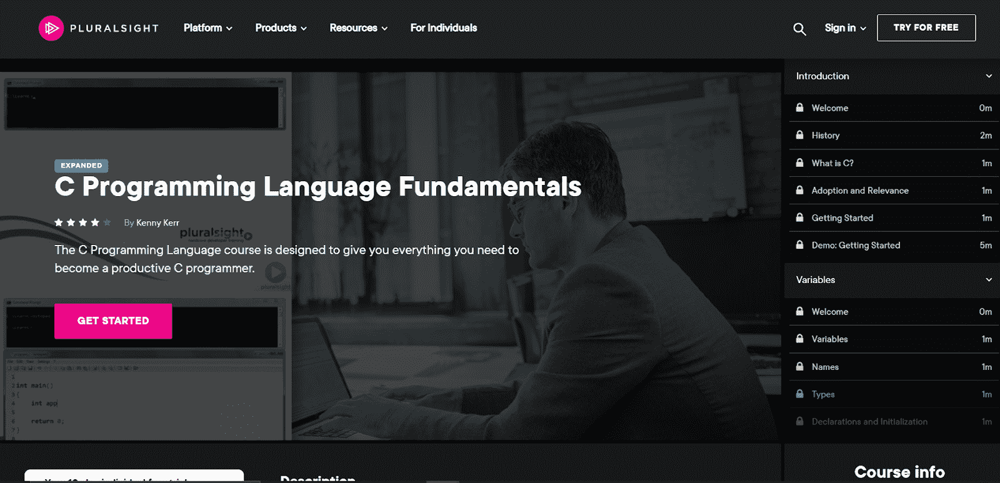](https://pluralsight.pxf.io/yRL9kv)

在 C 编程语言基础中学习关于 C 语言的一切。这门复数视觉课程是为那些想掌握这门语言的 C 语言初学者设计的。它包括变量、运算符、表达式、语句、指针、数组、函数和结构。在整个项目中，学生将学习如何开发 C 编程项目。

课程规格:

级别:初学者

费用:299 美元(PluralSight 图书馆)

*   包含:
*   1 小时 26 分钟的材料
*   演示代码

*   竣工证书:否
    *   [在此注册](https://pluralsight.pxf.io/yRL9kv)
    *   [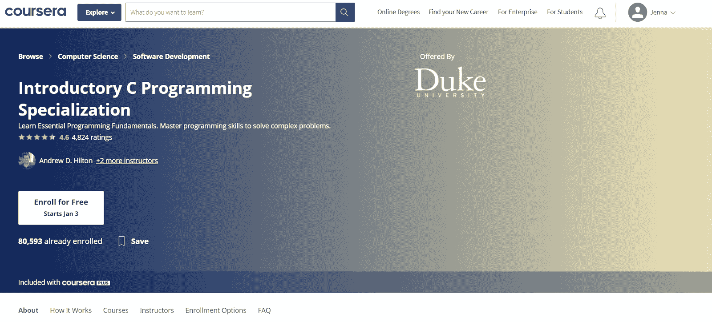](https://coursera.pxf.io/e454KQ)

*   该课程由杜克大学通过 Coursera 提供；对于那些已经拥有 Coursera Plus 的人来说，这是一门免费的 C 编程课程。一门面向对象的编程课程，它是 C 编程专业化的开始。该课程从初级水平开始，到相当高级，大约需要五个月才能完成整个课程。它将涵盖核心编程语言概念、问题解决和算法。

课程规格:

级别:初学者

费用:39 美元/月(Coursera 图书馆)

包含:

*   四门课程认证课程
*   编程基础
*   用 C 语言编写、运行和修复代码

*   指针、数组和递归
    *   与系统交互和管理内存

*   竣工证书:否
    *   [在此注册](https://coursera.pxf.io/e454KQ)
        *   **Java 编程课程**
        *   有许多面向初学者的免费在线编程课程，都是从 Java 开始的。Java 是中流砥柱；这是一种流行的语言，也是最容易学习的语言之一。从 Java 开始是个好主意，因为它是许多语言的基础。一旦你懂了 Java，你就能扩展到其他编程语言。
        *   [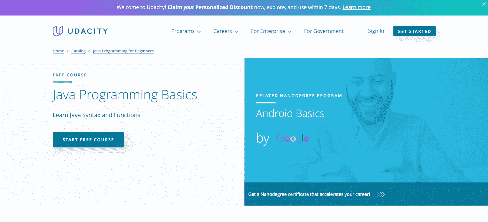](https://imp.i115008.net/LPr4mL)
        *   这是一门免费的在线 Java 课程，Udacity 课程的特色是从 Java IDE (IntelliJ)到基础编程技能。初学者可以通过行业专家提供的一系列课程、交互式测验和讲座来学习 Java。学完这门课程后，学生可以选修 Java 的面向对象课程。整个课程大约需要六周时间，对于那些以前从未编程过或者只是需要学习更多 Java 知识的人来说，这是一个很好的入门课程。

*   课程规格:

级别:初学者

## 费用:免费

包含:

如何编写 Java 语法

使用方法和条件语句

如何创建函数

*   如何创建循环
*   IntelliJ 和调试
*   竣工证书:否

*   [在此注册](https://imp.i115008.net/LPr4mL)
    *   
        *   《面向程序员的 Java》是为已经有一定经验的程序员设计的，它专门教授学生 Java 编程语言的来龙去脉。这包括基本语法、数组、面向对象编程等等。本课程面向已经了解另一种编程语言的学生，因此主要侧重于让他们理解 Java 的复杂性。
        *   课程规格:
        *   级别:中级
        *   费用:免费
        *   包含:

*   Java 入门

Java 的基本语法

Java 中的数组

Java 中的面向对象编程

Java 的内置数据结构

*   动态规划与实践
*   竣工证书:否
*   [在此注册](https://www.gopjn.com/t/TUJGR0lLR0JHRklKSkdCR0ZISk1N?url=https%3A%2F%2Fwww.codecademy.com%2Flearn%2Fjava-for-programmers)

*   [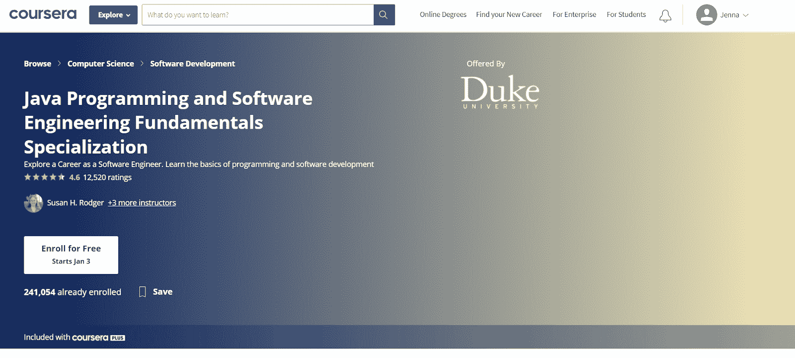](https://coursera.pxf.io/Ao1oWN)
    *   只要你有 Coursera plus，就可以通过 Coursera 免费注册杜克大学的 Java 编程和软件工程基础专业。这门编程课程旨在帮助您探索软件工程师的职业生涯，了解 Java，并了解软件开发。对于那些以前没有涉足编程或软件开发的人来说，这个课程非常理想，它涵盖了从基础知识到更高级的编程理论的所有内容。
        *   课程规格:
        *   级别:初学者
        *   费用:免费
        *   包含:
        *   JavaScript、HTML 和 CSS 编程基础
        *   Java 编程:用软件解决问题

*   Java 编程:数组、列表和结构化数据

Java 编程:软件设计原理

Java 编程:构建推荐系统

结业证书:是

[在此注册](https://coursera.pxf.io/Ao1oWN)

*   全栈编程课程
*   全栈开发从未如此受欢迎。随着应用程序越来越基于 web，许多人都在关注 web 开发。全栈程序员可以在前端(CSS，JavaScript)和后端(PHP，Python)开发。
*   [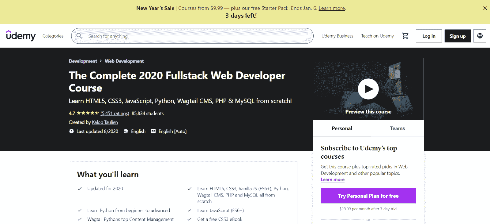](https://click.linksynergy.com/deeplink?id=SeYHzlfZEmI&mid=39197&murl=https%3A%2F%2Fwww.udemy.com%2Fcourse%2Fthecompletewebdeveloper%2F)

*   HTML5、CSS3、JavaScript、CMS、PHP、MySQL 这门课无所不包。本课程涵盖了开发人员在开发前端和后端应用程序时需要了解的一切。希望成为 web 开发人员的学生将能够通过本课程学习从 HTML 开发到 Python 的所有知识，本课程包括 60 多个小时的视频。
    *   课程规格:
        *   级别:中级
        *   成本:109.99 美元
        *   包含:
        *   67 小时的视频
        *   16 种可下载资源

*   21 篇文章

分配

## 结业证书:是

[在此注册](https://coursera.pxf.io/Ao1oWN)

[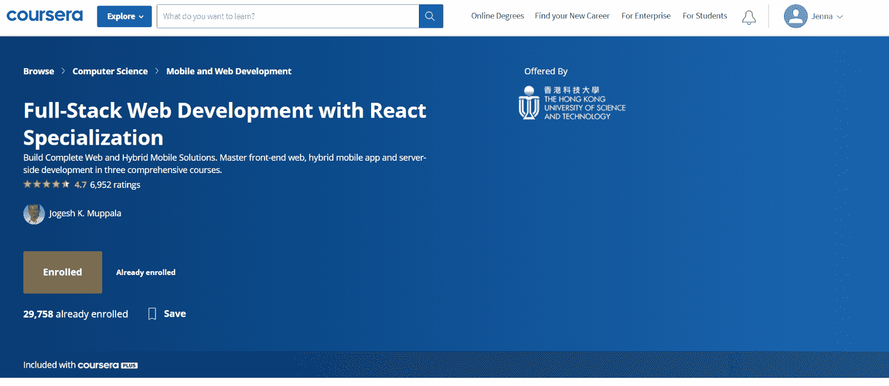](https://coursera.pxf.io/MXvXmn)

该课程由香港科技大学提供，涵盖了与 react 相关的所有内容:前端开发、混合移动应用和服务器端开发等。学生将[了解 Bootstrap](https://hackr.io/tutorials/learn-bootstrap) ，Node。JS、JQuery、SASS、Authentication、MongoDB 和 Express.JS。这一为期 3 个月的课程旨在帮助具备一些全栈开发编程知识的学生做好准备，包括创建一个功能齐全的项目。

课程规格:

*   级别:中级
*   费用:免费
*   包含:

*   前端 Web UI 框架和工具:引导
    *   使用 React 进行前端 Web 开发
    *   使用 NodeJS、Express 和 MongoDB 进行服务器端开发
    *   竣工证书:否
    *   [在此注册](https://coursera.pxf.io/MXvXmn)

*   [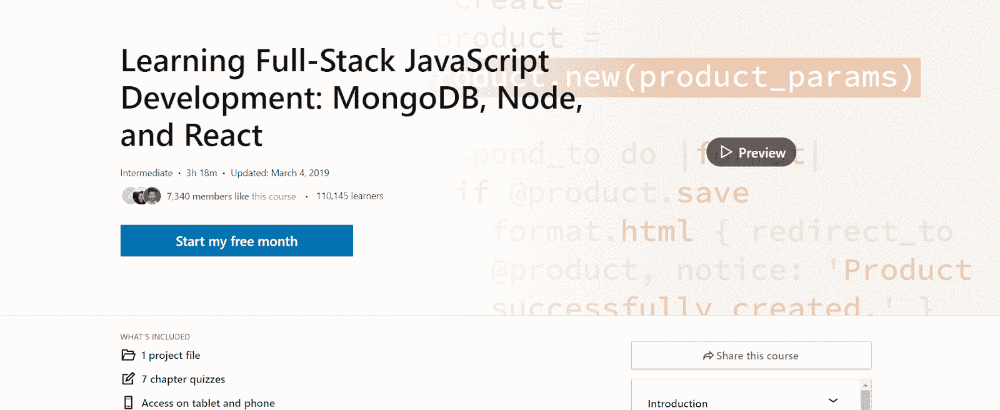](https://linkedin-learning.pxf.io/NK6Kyv)

关于全栈开发的综合课程(侧重于 JavaScript)，该课程侧重于“边做边学”。在整个项目中，您将使用上述技术构建一个 web 应用程序。您将学习如何使用 MongoDB，如何使用 React 构建功能全面的应用程序，以及如何使用 JavaScript 将它们结合在一起。

课程规格:

级别:初学者

费用:26 美元/月(LinkedIn 图书馆)

*   包含:
*   Cost: Free
*   7 个部分

*   章节测验
    *   项目开发
    *   结业证书:是
    *   [在此注册](https://linkedin-learning.pxf.io/NK6Kyv)

*   Python 编程课程

需要一个 [Python 速成班](https://hackr.io/blog/best-python-courses)？Python 是当今最受欢迎的编程学科之一；对于一个优秀的 Python 程序员来说，有很多工作可以做。在某种程度上，这是因为 Python 是一种如此通用的语言。它可以用于桌面应用程序、web 应用程序和移动应用程序。您可以从这些课程中的任何一门开始学习 Python。

[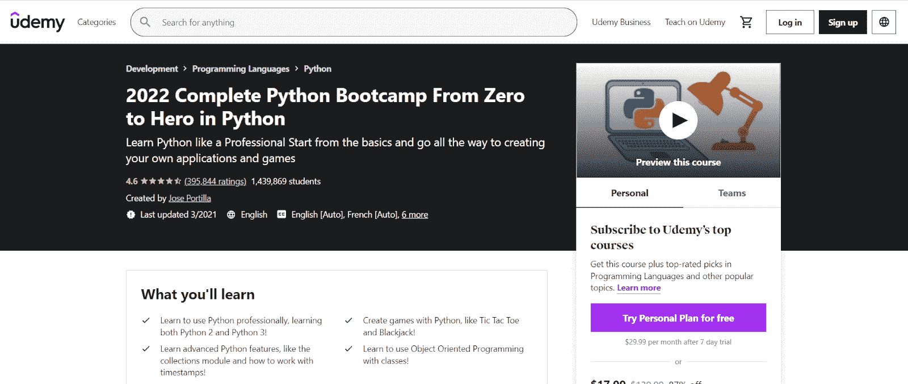](https://click.linksynergy.com/deeplink?id=SeYHzlfZEmI&mid=39197&murl=https%3A%2F%2Fwww.udemy.com%2Fcourse%2Fcomplete-python-bootcamp%2F)

在一门课程中学习 Python 的所有知识，即使你还不是程序员。通过本课程，您将学习 Python、面向对象编程以及如何创建像井字游戏和二十一点这样的游戏的所有知识。这门编程课程包括全面的内容，旨在让您更深入地了解 Python 语言以及正确的编程和开发方法。

课程规格:

*   级别:初学者
*   价格:139.99 美元
*   包含:

*   结业证书:是

[在此注册](https://click.linksynergy.com/deeplink?id=SeYHzlfZEmI&mid=39197&murl=https%3A%2F%2Fwww.udemy.com%2Fcourse%2Fcomplete-python-bootcamp%2F)

## [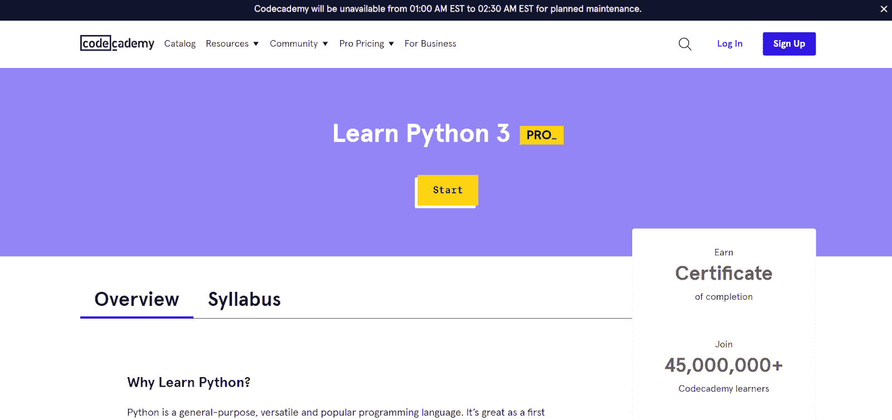](https://www.pntrs.com/t/TUJGR0lLR0JHRklKSkdCR0ZISk1N?url=https%3A%2F%2Fwww.codecademy.com%2Flearn%2Flearn-python-3)

这门 Codecademy 课程结束后，学生将了解 Python 的基础知识、基本编程概念，以及如何从事 web 开发、软件开发和数据科学。这个 24 小时的课程是为想要学习更多编程和 Python 知识的初学者设计的。课程包括交互式编码挑战，旨在测试程序员的技能和记忆力。

课程规格:

级别:初学者

费用:免费

*   包含:
*   25 小时的材料
*   代码挑战

*   结业证书:是
    *   [在此注册](https://www.pntrs.com/t/TUJGR0lLR0JHRklKSkdCR0ZISk1N?url=https%3A%2F%2Fwww.codecademy.com%2Flearn%2Flearn-python-3)
    *   [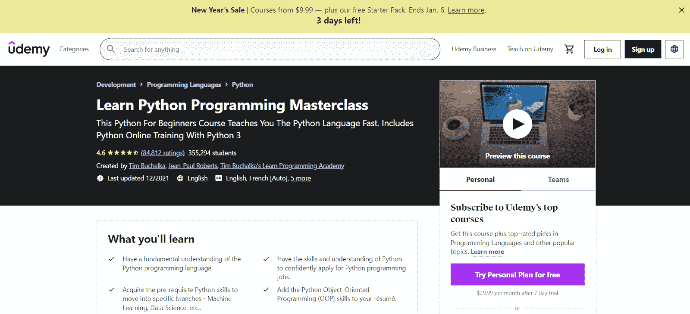](https://click.linksynergy.com/deeplink?id=SeYHzlfZEmI&mid=39197&murl=https%3A%2F%2Fwww.udemy.com%2Fcourse%2Fpython-the-complete-python-developer-course%2F)
    *   学完本课程后，学生将对 [Python 编程语言](https://hackr.io/blog/python-programming-language)有深入的了解。学生将能够进入编程的其他分支，如机器学习或数据科学，将能够开发自己的程序，并将理解面向对象编程的基础。更好的是，他们应该有信心和知识开始申请 Python 编程职业。这门价格适中的课程包含超过 450 堂课和超过 60 小时的材料。

*   课程规格:

级别:初学者

价格:139.99 美元

包含:

Course specifications:

*   21 个部分
*   471 场讲座
*   65 小时 9 分钟的内容

*   结业证书:是
    *   [在此注册](https://click.linksynergy.com/deeplink?id=SeYHzlfZEmI&mid=39197&murl=https%3A%2F%2Fwww.udemy.com%2Fcourse%2Fpython-the-complete-python-developer-course%2F)
    *   其他编程课程

*   当然，也有其他编程课程。虽然这些是最受欢迎的编程语言，但仍有一些你可能感兴趣的特殊类型的编程。以下是一些针对特定兴趣的最佳编程语言和课程。

[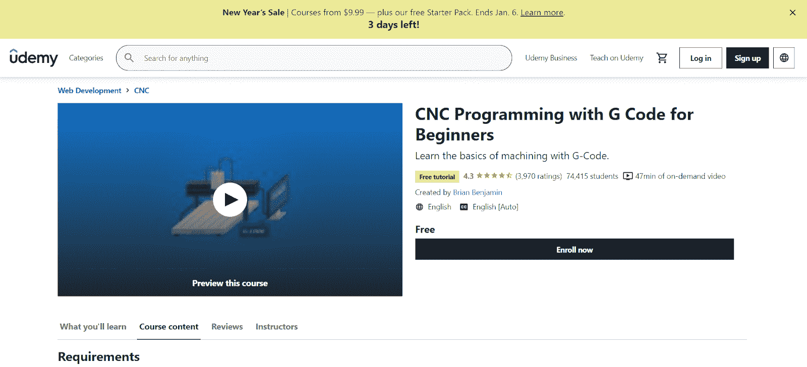](https://click.linksynergy.com/deeplink?id=SeYHzlfZEmI&mid=39197&murl=https%3A%2F%2Fwww.udemy.com%2Fcourse%2Fcnc-programming-for-beginners%2F)

你有没有想过操作 CNC 或 3D 打印机？如果是这样，你需要一门数控编程课程。本 CNC 编程课程帮助您学习基本的 g 代码，用于驱动 CNC 机器和 3D 打印机等系统。通过这种方式，您将获得独家在线视频内容，能够与讲师进行问答，并获得结业证书。

课程规格:

级别:初学者

*   费用:免费
*   包含:
*   Contains:

*   6 个部分
    *   16 场讲座
    *   1 小时 8 分钟的内容
    *   结业证书:是

*   [在此注册](https://click.linksynergy.com/deeplink?id=SeYHzlfZEmI&mid=39197&murl=https%3A%2F%2Fwww.udemy.com%2Fcourse%2Fcnc-programming-for-beginners%2F)

[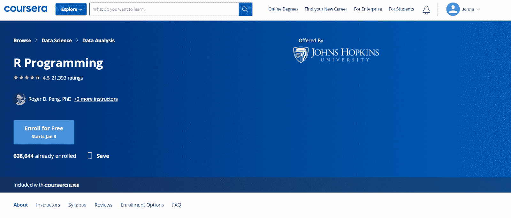](https://coursera.pxf.io/15M5rx)

## 约翰霍普金斯大学通过 Coursera 提供这门课。这门 [R 编程课程](https://hackr.io/blog/best-r-courses)教学生使用 R 进行有效的数据分析。许多 R 程序员的职业不是程序员，而是科学家。通过本课程，非程序员将能够学习统计编程和一般编程概念。

课程规格:

级别:中级

费用:免费

包含:

*   4 周的学习
*   背景，入门
*   用 R 编程

*   循环功能和调试
    *   模拟和编程
    *   结业证书:是
    *   [在此注册](https://coursera.pxf.io/15M5rx)

*   [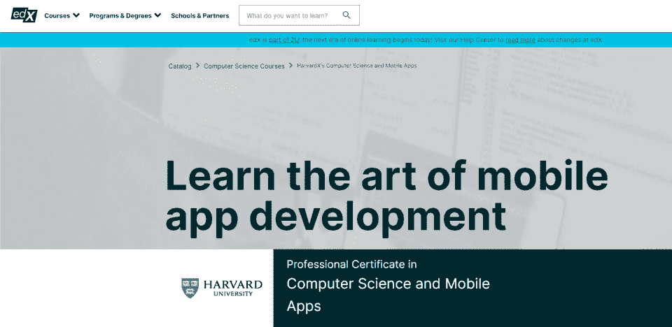](https://www.awin1.com/cread.php?awinmid=6798&awinaffid=428263&ued=https%3A%2F%2Fwww.edx.org%2Fprofessional-certificate%2Fharvardx-computer-science-and-mobile-apps)

通过 edX，你可以参加哈佛大学提供计算机科学和移动应用专业证书的课程。移动应用程序开发是它自己的编程子集，这在今天是非常可取的。这个价格合理的程序涵盖了 JavaScript、C、Python、React Native 等，并帮助您完全按照自己的设计创建应用程序。

课程规格:

级别:初学者

费用:313.20 美元

*   包含:
*   CS50 计算机科学导论
*   使用 React Native 开发 CS50 的移动应用程序
    *   结业证书:是
    *   [在此注册](https://www.awin1.com/cread.php?awinmid=6798&awinaffid=428263&ued=https%3A%2F%2Fwww.edx.org%2Fprofessional-certificate%2Fharvardx-computer-science-and-mobile-apps)
    *   下一步是什么？
    *   一旦你找到了合适的编程课程，你的学习之旅还没有结束。许多程序员花费大量时间尝试新项目、学习新技能和获得新证书。
    *   在雇主看来，在网上参加免费的编程课程通常是不够的。你需要建立一个投资组合，还要学习编程课程。
*   如果你有兴趣成为一名程序员(或者提升你的编程生涯)，考虑获得一个编程认证，[构建组合应用程序](https://hackr.io/blog/best-computer-science-projects)，或者参加一个[编程训练营](https://hackr.io/blog/free-coding-bootcamps)。

在线教程还可以帮助你学习更多的编程语言来充实你的简历。

**向顶级 *Udemy* 导师**
[顶级编程基础课程](https://www.udemy.com/topic/programming-fundamentals/)学习*编程*的基础知识

**人也在读:**

Course specifications:

*   Level: Beginner
*   Cost: $313.20
*   Contains:

*   Certificate of Completion: Yes

[Enroll Here](https://www.awin1.com/cread.php?awinmid=6798&awinaffid=428263&ued=https%3A%2F%2Fwww.edx.org%2Fprofessional-certificate%2Fharvardx-computer-science-and-mobile-apps)

## What’s Next?

Once you’ve found the right programming course, your learning journey isn’t over. Many programmers spend a considerable amount of time trying out new projects, learning new skills, and acquiring new certifications.

In the eyes of an employer, it often isn’t enough to take free coding classes online. You need to build out a portfolio as well as take programming courses.

If you’re interested in becoming a programmer (or enhancing your programming career), consider getting a programming certification, [building out portfolio applications](https://hackr.io/blog/best-computer-science-projects), or attending a [programming Bootcamp](https://hackr.io/blog/free-coding-bootcamps).

Online tutorials can also help you learn [additional programming languages](https://hackr.io/tutorials/learn-intro-to-programming) to bulk up your resume.

**Learn the fundamentals of *programming* from a top-rated *Udemy* instructor**
[Top Programming Fundamentals Courses](https://www.udemy.com/topic/programming-fundamentals/)

**People are also reading:**