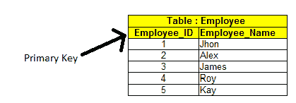
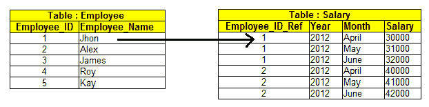
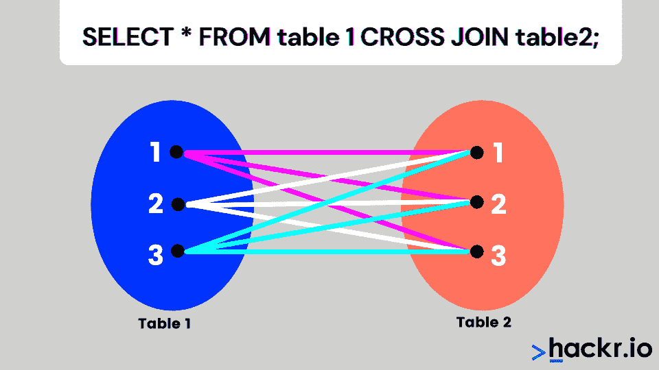
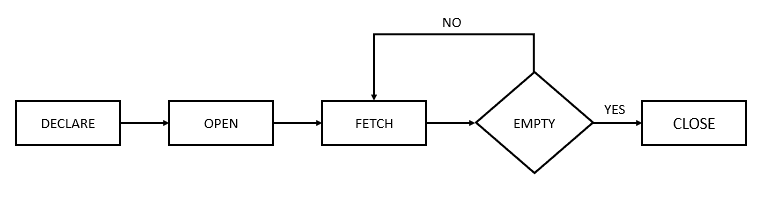
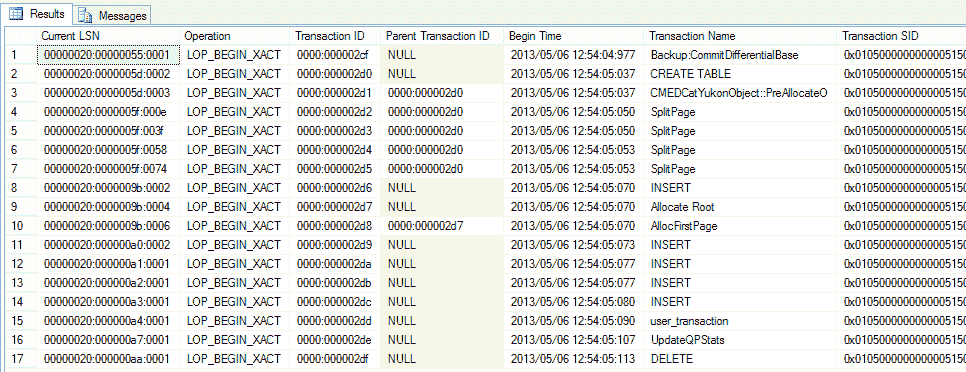
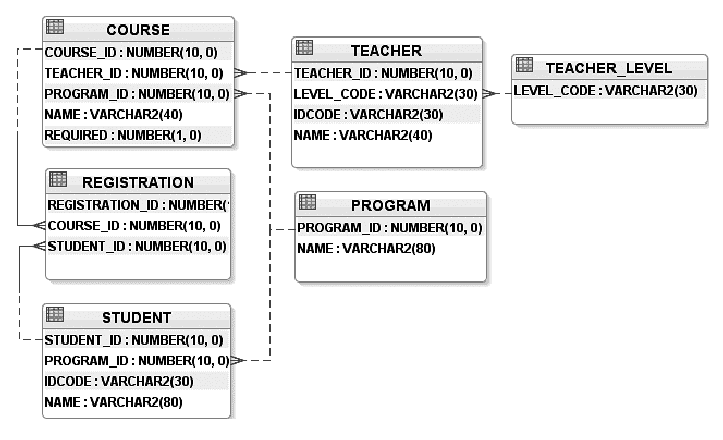
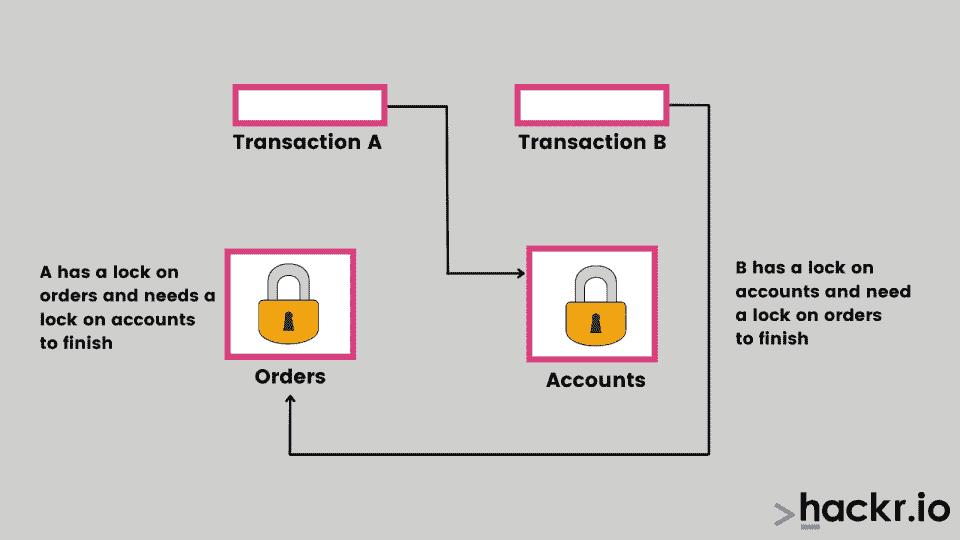
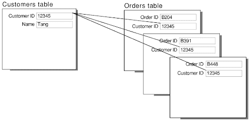

# 2023 年 75+热门 SQL 面试问答[更新]

> 原文：<https://hackr.io/blog/top-sql-interview-questions>

如果你正在准备 SQL 面试，你必须确保你准备好处理各种各样的问题，从基本的到高级的 SQL 面试问题。一点点准备可以大大增强你对下一次数据库开发人员工作面试的信心。

这里的一组常见 SQL 面试问题涵盖了所有 SQL 功能，分为初级、中级和高级难度三个部分。如果你想复习一下，你可能想看看为你推荐的 SQL 教程。

但是在我们进入这些 SQL server 面试问题之前，让我们先来看看一些关于 SQL 和相关面试的一般性问题。

## 我该如何准备 SQL 面试？

就像你准备其他面试一样，尽管你可能会发现自己在 SQL 面试中更注重理论。一定要了解命令，以及流程和决策背后的理论。动手学习和阅读相结合是准备 SQL 面试的最佳方式。

## 对于 SQL 面试，我需要知道些什么？

您需要了解一些关于如何操作数据库的基本概念和命令。本质上，你必须证明你能在实际环境中完成你需要的功能。幸运的是，这里列出的 SQL 面试问题和答案涵盖了你需要知道的一切。

## **怎样才能练好 SQL？**

练习 SQL 的最好方法是下载数据库软件并开始使用它。这意味着创建一个表，输入数据，然后修改它。在软件中查找各种 SQL 命令并执行它们。当然，不要忘记阅读 SQL 查询面试问题。

## SQL 面试常见问题和答案

### **基本 SQL 面试问题**

下一节介绍基本概念，下一节重点介绍中级和高级 SQL 问题。

#### **1。5 个基本的 SQL 命令是什么？**

5 个基本的 SQL 命令是 ALTER、UPDATE、DELETE、INSERT 和 CREATE。当然，还有更多的命令，有些更微妙，但前面提到的是基本的。

#### **2。DBMS 和 RDBMS 有什么区别？**

数据库管理系统(DBMS)是一个帮助你建立和维护数据库的软件应用程序。关系数据库管理系统(RDBMS)是 DBMS 的一个子集，它基于 DBMS 的关系模型。

#### **3。可以在 SQL 中嵌入 Pl/SQL 吗？证明你的答案。**

PL/SQL 是一种过程化语言，里面有一条或多条 SQL 语句，所以 SQL 可以嵌入到一个 PL/SQL 块中；但是，PL/SQL 不能嵌入到 SQL 中，因为 SQL 一次只执行一个查询。

```
DECLARE                            /* this is a PL/SQL block */

  qty_on_hand  NUMBER(5);         

BEGIN

  SELECT quantity INTO qty_on_hand FROM inventory     /* this is the SQL statement embedded in the PL/SQL block   */

    WHERE product = 'TENNIS RACKET';

 END;
```

#### **4。你说的数据操作语言(DML)是什么意思？**

[数据操作语言](https://en.wikipedia.org/wiki/Data_manipulation_language) (DML)包括最常用的 SQL 语句来存储、修改、删除和检索数据。它们是选择、更新、插入和删除。

```
DECLARE                            /* this is a PL/SQL block */

  qty_on_hand  NUMBER(5);         

BEGIN

  SELECT quantity INTO qty_on_hand FROM inventory     /* this is the SQL statement embedded in the PL/SQL block   */

    WHERE product = 'TENNIS RACKET';

 END;
```

#### **5。什么是 SQL 中的连接？连接的类型有哪些？**

联接用于根据字段之间的关系查询多个表中的数据。

有四种类型的连接:

**内部连接**

当表之间至少有一个匹配行时，将返回行。

```
select first_name, last_name, order_date, order_amount

from customers c

inner join orders o

on c.customer_id = o.customer_id
```

/*客户和订单是两个表。将显示 customer 表中 customer_id 匹配的两个表中的数据

订单表中的 customer_id。*/

**右连接**

Right join 返回右表中的所有行以及表之间共享的行。如果左表中没有匹配的行，它仍将返回右表中的所有行。

```
select first_name, last_name, order_date, order_amount

from customers c

left join orders o

on c.customer_id = o.customer_id
```

/*客户和订单是两个表。Orders 表中的所有行都与 Customers 表中的匹配行一起返回(如果有的话*/

**左连接**

Left join 返回左表中的所有行以及表之间共享的行。如果右表中没有匹配的行，它仍将返回左表中的所有行。

```
select first_name, last_name, order_date, order_amount

from customers c

left join orders o

on c.customer_id = o.customer_id
```

/*客户和订单是两个表。customers 表中的所有行都与 orders 表中的匹配行一起返回(如果有的话*/

**完全加入**

当任何一个表中有匹配的行时，完全联接将返回行。这意味着它返回左侧表中的所有行和右侧表中的所有行。

```
select first_name, last_name, order_date, order_amount

from customers c

full join orders o

on c.customer_id = o.customer_id
```

/*客户和订单是两个表。将返回订单表和客户表中的所有行*/

#### **6。SQL 中的 CHAR 和 VARCHAR2 数据类型有什么区别？**

CHAR 用于存储固定长度的字符串，VARCHAR2 用于存储可变长度的字符串。

例如，假设您将字符串“Database”存储在 CHAR(20)字段和 VARCHAR2(20)字段中。

CHAR 字段将**使用** 22 个**字节** (2 个**字节** **为** **前导** **长度**)。

VARCHAR2 **字段**将**使用** 10 个**字节** **仅** (8 个**为**字符串，2 个**字节** **为** **前导** **长度**)。

#### **7。解释 SQL 约束。**

约束用于指定表中数据类型的规则。它们可以在创建和修改表时指定。以下是 SQL 中的约束条件:

*   **NOT NULL:** 限制将空值插入到列中
*   **CHECK:** 验证字段中的所有值是否满足条件
*   **默认值:**如果没有为字段指定值，则自动分配默认值
*   **唯一:**确保字段中插入的值是唯一的
*   **索引:**索引字段，提供更快的记录检索
*   **主键:**唯一标识表中的每条记录
*   **外键:**确保另一个表中记录的参照完整性

#### **8。什么是主键、外键和唯一键？**

**主键**



主键是表中唯一标识一行的字段。它不能为空

**外键**



外键是一个表中的字段，它是另一个表中的主键。通过引用一个表的外键和另一个表的主键，在两个表之间创建关系。

在下面的示例中，salary 表中的 employee_id_ref 是外键。

**唯一键**

唯一键唯一标识表中的记录。一个表上可以定义许多唯一的键约束。

| 员工标识 | 员工姓名 | 政府 ID |
| 222 | （英、瑞）哈里（人名） | 111-203-987 |
| 333 | 斯蒂芬 | 789-456-123 |
| 444 | 局域网 | 745-562-321 |

在上表中，Emp_id 是主键，而 Government_id 是唯一键。您可能希望每个雇员的政府标识都是唯一的。由于数据属于政府，您可能不希望它成为主键。

[完整的 SQL Bootcamp 2023:从零到英雄](https://click.linksynergy.com/deeplink?id=jU79Zysihs4&mid=39197&murl=https%3A%2F%2Fwww.udemy.com%2Fcourse%2Fthe-complete-sql-bootcamp%2F)

#### **9。什么是触发器？**

触发器是存储的程序，当 INSERT、DELETE 和 UPDATE (DML)语句等事件发生时，会自动执行这些程序。还可以调用触发器来响应数据定义语句(DDL)和数据库操作，例如服务器错误、登录。

```
create trigger dbtrigger  

on database  

for 

create_table,alter_table,drop_table 

as 

print'you can not create ,drop and alter table in this database'  

rollback;

create trigger emptrigger  

on emp  

for 

insert,update,delete 

as 

print'you can not insert,update and delete this table i'  

rollback;
```

#### 10。SQL 和 MySQL 有什么区别？

SQL 是一种用于访问 DBMS 的结构化查询语言，而 MYSQL 是一种开源的关系 DBMS。后者在关系模型上操作，允许用更高级的方法处理数据。

#### **11。什么是空值字段？**

空值是没有值的字段。

#### **12。事务中的 ACID 属性是什么？**

为了保持数据库“前后”事务的一致性，需要遵循某些属性。它们是:

*   **原子性:**事务必须完全发生，不能中途退出
*   **一致性:**这维护了完整性约束，以确保有效数据进入数据库
*   **隔离:**控制并发
*   **持久性:**事务一旦提交，就保持提交状态

#### 13。SQL 中的 Dateadd 是什么？

Dateadd 是一个函数，用于向日期的指定部分添加一个数字，并返回修改后的日期。语法是 DATEADD(日期部分，值，输入日期)。

日期部分可以采用以下任何形式:

| 日期 _ 部分 | 缩写 |
| 年 | yy，yyyy |
| 四分之一 | qq，q |
| 月 | 嗯，嗯 |
| 一年一天 | dy，y |
| 一天 | dd，d |
| 周 | 周，周 |
| 小时 | 倍硬 |
| 分钟 | 米，n |
| 第二 | ss，s |
| 毫秒 | 女士 |
| 微秒 | 计算机科学硕士 |
| 十亿分之一秒 | 纳秒 |

#### **14。事务控制中的保存点是什么？**

保存点是事务中的一个点，此时您可以将事务回滚到某个点，而无需回滚整个事务。

```
SQL> SAVEPOINT A

SQL> INSERT INTO TEST VALUES (1,'Savepoint A');
```

插入 1 行。

```
SQL> SAVEPOINT B

SQL> INSERT INTO TEST VALUES (2,'Savepoint B');
```

插入 1 行。

```
SQL> ROLLBACK TO B;
```

回滚完成。

```
SQL> SELECT * FROM TEST;

ID MSG

-------- -----------

1  Savepoint A
```

#### 15。什么是自然连接？

```
SELECT * FROM COUNTRIES NATURAL JOIN CITIES

SELECT * FROM COUNTRIES JOIN CITIES

    USING (COUNTRY, COUNTRY_ISO_CODE)
```

默认情况下，自然联接是一种内部联接，它基于被联接的两个表中的公共列创建隐式联接:

自然联接可以是内部联接、左外部联接或右外部联接。默认值是内部联接。

如果表 COUNTRY 和 city 有两个名为 COUNTRY 和 COUNTRY_ISO_CODE 的公共列，则以下两个 SELECT 语句是等效的:

#### 16。什么是交叉连接？



在 SQL 交叉连接中，两个表中每一行的组合都包含在结果集中。这也称为跨产品联接。

例如，如果表 A 有 10 行，表 B 有 20 行，如果 SQL 语句中有一个 NOWHERE 子句，则结果集将有 10 * 20 = 200 行。

#### **17。SQL 的子集是什么？**

以下是 SQL 的子集

1.  **DDL(数据定义语言)**:包括 SQL 命令，如创建、更改和删除
2.  **DML(数据操作语言):**访问和操作数据，包括插入和更新命令
3.  **DCL(数据控制语言):**控制对数据库的访问。使用 GRANT 和 REVOKE 等命令。

#### 18。SQL 中的标量函数是什么？

标量函数用于根据输入值返回单个值。标量函数如下:

*   **UCASE():** 将指定字段转换为大写

```
SELECT UCASE("SQL Tutorial is FUN!") AS UppercaseText;

UppercaseText

SQL TUTORIAL IS FUN!
```

*   **LCASE():** 将指定字段转换为小写

#### **19。什么是光标，你什么时候使用它？**



游标是一种数据库对象，用于通过在结果集中逐行遍历来操作数据。当需要从结果集中一次一行地检索数据，以及需要一次一行地更新记录时，可以使用游标。

```
 DECLARE @CustomerId INT

        ,@Name VARCHAR(100)

         ,@Country VARCHAR(100)

     --DECLARE AND SET COUNTER.

     DECLARE @Counter INT

     SET @Counter = 1

     --DECLARE THE CURSOR FOR A QUERY.

     DECLARE PrintCustomers CURSOR READ_ONLY

     FOR

     SELECT CustomerId, Name, Country

      FROM Customers

     --OPEN CURSOR.

      OPEN PrintCustomers

     --FETCH THE RECORD INTO THE VARIABLES.

     FETCH NEXT FROM PrintCustomers INTO

      @CustomerId, @Name, @Country

     --LOOP UNTIL RECORDS ARE AVAILABLE.

     WHILE @@FETCH_STATUS = 0

     BEGIN

        IF @Counter = 1

        BEGIN

                       PRINT 'CustomerID' + CHAR(9) + 'Name' + CHAR(9) + CHAR(9) + CHAR(9) + 'Country'

                       PRINT '------------------------------------'

        END

         --PRINT CURRENT RECORD.        PRINT CAST(@CustomerId AS VARCHAR(10)) + CHAR(9) + CHAR(9) + CHAR(9) + @Name + CHAR(9) + @Country

        --INCREMENT COUNTER.

        SET @Counter = @Counter + 1

        --FETCH THE NEXT RECORD INTO THE VARIABLES.

        FETCH NEXT FROM PrintCustomers INTO

        @CustomerId, @Name, @Country

      END

     --CLOSE THE CURSOR.

     CLOSE PrintCustomers

      DEALLOCATE PrintCustomers
```

#### 20。什么是基于集合的解决方案？

游标对单个行进行操作，在集合的情况下，它对数据的结果集进行操作，该结果集可以是表/视图或两者的连接。结果集是 SQL 查询的输出。

#### **21。什么是向前光标？**

前向游标支持从结果集中从头到尾提取行。您不能转到结果集中的上一行。

#### **22。陈述一个基于集合的解决方案优于基于光标的解决方案的情况。**

当您处理结果集时，基于集的解决方案可以提供更好的性能，而不是一次处理一行。它们简明扼要，可读性更强。

#### **23。什么是正常化，正常的形式有哪些？**

[规范化](https://hackr.io/blog/dbms-normalization)是数据库设计中最大限度减少数据冗余和依赖性的过程。数据库被分成两个或更多的表，并定义了它们之间的关系。

**第一范式**

每个记录在表中都是唯一的，由主键或组合键标识。

StudiD 名称电话号码

-----------------------

约翰一书 9176612 . 56666666666

2 苏西 9176645789

3 吉姆 9176696325

在上表中，字段“phonenum”是一个多值属性，因此它不在 1NF 中。

由于没有多值属性，下表采用 1NF 格式。

StudiD 名称电话号码

------------------

约翰一书 9176612345

约翰一书 9176645698

2 苏西 9176645789

3 吉姆 9176696325

**第二范式**

该表必须采用第一范式，并且应该有一个列作为主键。2NF 试图减少存储在内存中的冗余数据。为了将上面的表转换成 2NF，我们将该表分成两个表:

StudiD 名称/*学生表*/

1.  约翰

2 苏希

3.  吉姆(人名)

StudiD phone num/* student phone number 表格*/

------------------

1 9176612345

1 9176645698

2 9176645789

3 9176696325

**第三范式**

该表必须采用第二范式，并且必须没有传递函数依赖关系，即一个非键列不能依赖于同一表中的另一个非键列。

考虑 EMPLOYEE_DETAIL 表:该表不是第三范式，因为字段 emp_state 和 emp_city 依赖于 emp_zip，而不是依赖于主键 emp_id。

| 员工标识 | 员工姓名 | EMP_ZIP | 员工状态 | 员工 _ 城市 |
| 222 | （英、瑞）哈里（人名） | 201010 | 计算机化 X 线体层照相术 | 蒙罗 |
| 333 | 斯蒂芬 | 02228 | 谢谢 | 达拉斯 |
| 444 | 局域网 | 060007 | 伊利诺伊 | 芝加哥 |

上面的表被分成两个表，现在这些表是第三范式。

**员工表:**

| 员工标识 | 员工姓名 | EMP_ZIP |
| 222 | （英、瑞）哈里（人名） | 201010 |
| 333 | 斯蒂芬 | 02228 |
| 444 | 局域网 | 060007 |

**员工 _ZIP 表:**

| EMP_ZIP | 员工状态 | 员工 _ 城市 |
| 201010 | 计算机化 X 线体层照相术 | 蒙罗 |
| 02228 | 谢谢 | 达拉斯 |
| 060007 | 伊利诺伊 | 芝加哥 |

#### **24。什么是反规格化，什么时候用？**

反规范化是一种用于提高性能的技术，因此表设计允许您避免带有冗余数据的复杂连接。如果应用程序涉及大量读取操作，则以牺牲写入操作性能为代价来使用反规范化。

#### **25。** **什么是聚集索引和非聚集索引？**

一个表只能有一个聚集索引。在这种类型的索引中，它根据键值对表进行重新排序，并按照这个顺序存储它们。

非聚集索引没有表中数据的物理顺序；它有一个逻辑顺序。

```
CREATE CLUSTERED INDEX IX_tblStudent_Gender_Score

ON student(gender ASC, total_score DESC)
```

上面的脚本在学生表上创建了一个名为“IX_tblStudent_Gender_Score”的聚集索引。该索引是在“性别”和“总分”列上创建的。在多个列上创建的索引称为“复合索引”。

非聚集索引不对表中的物理数据进行排序。非聚集索引存储在一个地方，表数据存储在另一个地方。这允许每个表有多个非聚集索引。

```
CREATE NONCLUSTERED INDEX IX_tblStudent_Name

ON student(name ASC)
```

上面的脚本在 student 表的“name”列上创建了一个非聚集索引——该索引按名称升序排序。表数据和索引将存储在不同的地方。

#### **26。什么是 T-SQL？**

它是由 Sybase 开发、微软使用的 SQL(结构化查询语言)的扩展。

#### **27。什么是系统功能？举个例子。**

系统函数是在数据库服务器上执行的操作，并相应地返回值。示例@@ERROR -如果前面的 Transact-SQL 语句没有遇到错误，则返回 0。否则，它返回一个错误号。

@@ERROR -如果前面的 Transact-SQL 语句没有遇到**错误，则返回 0 **。****

#### **28。什么是事务日志？**



日志是一个审计跟踪文件，其中存储了 DBMS 执行的操作的历史记录。

#### **29。当一个表中的删除自动导致另一个表中的删除时，如何维护数据库的完整性？**

ON DELETE CASCADE 是在父表中发生删除时使用的命令，它会自动删除所有子记录，并且父表中的外键会引用子表。

```
CREATE TABLE products

( product_id INT PRIMARY KEY,

 product_name VARCHAR(50) NOT NULL,

 category VARCHAR(25)

);

CREATE TABLE inventory

( inventory_id INT PRIMARY KEY,

 product_id INT NOT NULL,

 quantity INT,

 min_level INT,

 max_level INT,

 CONSTRAINT fk_inv_product_id

   FOREIGN KEY (product_id)

   REFERENCES products (product_id)

   ON DELETE CASCADE

);
```

Products 表是父表，inventory 表是子表。如果从父表中删除了一个 productid，则该 productid 的所有库存记录都将从子表中删除

#### 三十岁。我们可以在 WHERE 子句中使用 TRUNCATE 吗？

不，我们不能在 WHERE 子句中使用 TRUNCATE。

#### 31。定义提交。

当在事务中使用 COMMIT 时，所做的所有更改都将永久写入数据库。

```
BEGIN TRANSACTION;  

DELETE FROM HumanResources.JobCandidate 

   WHERE JobCandidateID = 13;   

COMMIT TRANSACTION; 
```

以上示例删除了 SQL server 中的一个求职者。

#### 32。检查约束是做什么的？

Check 约束限制了可以进入数据库表中某一列的值。它被用作完整性约束检查。

当创建“Persons”表时，下面的 SQL 在“Age”列上创建一个检查约束。检查约束确保您不能有任何 18 岁以下的人:

下面的语法在 MySQL 中。

```
CREATE TABLE Persons (

ID int NOT NULL,
LastName varchar(255) NOT NULL,
FirstName varchar(255),
Age int,
    CHECK (Age>=18)

);
```

#### 33。什么是模式？



模式是数据库中特定用户/所有者的数据库对象的集合。对象可以是表、视图、索引等。

#### 34。如何从现有的表中创建一个空表？

```
CREATE TABLE NEW_TABLE_NAME AS SELECT [column1, column2 ……column]

FROM EXISTING_TABLE_NAME [WHERE ]
```

#### 35。什么是组合键？

当使用多个列来定义主键时，就称为组合键。以下是在 MySQL 中创建组合键的 SQL 语法:

```
CREATE TABLE SAMPLE_TABLE  
(COL1 integer,  
COL2 varchar(30),  
COL3 varchar(50),  
PRIMARY KEY (COL1, COL2)); 
```

#### 36。如何对表格中的记录进行排序？

ORDER BY 子句用于对表中的记录进行排序。

```
SELECT * FROM Emp ORDER BY salary; 
```

默认情况下，记录按升序返回。

#### 37。什么是共享锁？

当两个事务被授予对同一数据的读访问权限时，它们就获得了一个共享锁。这使得能够读取相同的数据，并且直到共享锁被释放，数据才被更新。

#### 38。什么是死锁？



死锁是指两个或多个事务无限期地等待对方释放锁的情况。

以下是死锁情况的一个示例:

#### 39。什么是锁升级？

锁升级是将行锁或页锁转换为表锁的过程。它是 SQL Server 等 [RDBMS](https://en.wikipedia.org/wiki/Relational_database) 动态使用的优化技术。

#### 40。什么是 SQL 注入？

SQL 注入是一种代码注入技术，用于破解数据驱动的应用程序。

#### 41。什么是视图，为什么使用它们？

SQL 视图是从一个或多个表创建的虚拟表。视图是数据的子集；因此，它可以限制表中数据的公开程度。

以下 SQL 创建了一个显示所有巴西客户的视图:

```
CREATE VIEW Brazil_Customers_view AS
SELECT CustomerName, ContactName
FROM Customers
WHERE Country = "Brazil";
```

您可以按如下方式查询上面的视图:

```
SELECT * FROM Brazil_Customers_view;
```

#### **42。我们如何避免在查询中得到重复的条目？**

Select DISTINCT 用于使用查询从表中获取不同的数据。

以下 SQL 语句仅从“Customers”表的“Country”列中选择不同的值:

```
SELECT DISTINCT Country FROM Customers;
```

#### **43。举一个 SQL 中比较运算符的例子。**

等于写成=用于比较数据值

#### **44。什么是子查询？**

子查询是嵌套在更大查询中的 SQL 查询。

```
SELECT
   employee_id, first_name, last_name
FROM
   employees
WHERE
   department_id IN (SELECT 
           department_id
       FROM
           departments
       WHERE
           location_id = 1700)
ORDER BY first_name , last_name;
```

括号中的查询称为子查询。它也称为内部查询或内部选择。包含子查询的查询称为外部查询或外部选择。

非相关子查询是一个独立的查询，子查询的输出在主查询中被替换。

### **高级 SQL 面试问答**

#### **46。什么是系统特权？**

这时，用户(通常是 DBA)有权对数据库模式对象执行特定的操作，比如创建表空间。

以下是可以授予用户的系统权限示例:

*   CREATE TABLE 允许被授权者在被授权者的方案中创建表
*   CREATE USER 允许被授权者在数据库中创建用户
*   创建会话允许被授权者连接到 Oracle 数据库来创建用户会话

#### **47。什么是对象特权？**

对象级权限是授予数据库用户帐户或角色对数据库对象执行某些操作的权限。这些对象权限包括 SELECT、INSERT、UPDATE、DELETE、ALTER、INDEX on tables 等。

以下示例是可以授予用户的对象权限:

*   在 hr.employees 上选择 myuser
*   向我的用户插入 hr.employees

#### **48。BCP 指挥部是做什么的？**

BCP(批量复制)是一个实用程序或工具，可以将数据从表中导出/导入到文件中，反之亦然。

#### **49。方差函数有什么作用？**

此函数返回一组数字的方差:

```
CREATE TABLE EMP (EMPNO NUMBER(4) NOT NULL,

                 ENAME VARCHAR2(10),
                 JOB VARCHAR2(9),
                 SAL NUMBER(7, 2),
                 DEPTNO NUMBER(2));

INSERT INTO EMP VALUES (1, 'SMITH', 'CLERK',     800, 20);
INSERT INTO EMP VALUES (2, 'ALLEN', 'SALESMAN', 1600,    30);
INSERT INTO EMP VALUES (3, 'WARD',  'SALESMAN', 1250, 30);
INSERT INTO EMP VALUES (4, 'JONES', 'MANAGER',  2975, 20);
INSERT INTO EMP VALUES (5, 'MARTIN','SALESMAN', 1250,    30);
INSERT INTO EMP VALUES (6, 'BLAKE', 'MANAGER',  2850, 30);
INSERT INTO EMP VALUES (7, 'CLARK', 'MANAGER',  2850, 10);
INSERT INTO EMP VALUES (8, 'SCOTT', 'ANALYST',  3000, 20);
INSERT INTO EMP VALUES (9, 'KING',  'PRESIDENT',3000, 10);
INSERT INTO EMP VALUES (10,'TURNER','SALESMAN', 1500,    30);
INSERT INTO EMP VALUES (11,'ADAMS', 'CLERK',    1500, 20);

SQL> SELECT VARIANCE(sal)

 2  FROM emp;

VARIANCE(SAL)

-------------

   759056.818
```

#### 50。授权和撤销命令的作用是什么？

GRANT 命令启用数据库对象上的特权，REVOKE 命令删除这些特权。它们是 DCL 命令。

```
GRANT CREATE ANY TABLE TO username
GRANT sysdba TO username
GRANT DROP ANY TABLE TO username
REVOKE CREATE TABLE FROM username
```

#### 51。什么是联合运算符？

UNION 运算符通过删除重复行来组合两个或多个 SELECT 语句的结果。SELECT 语句中的列和数据类型必须相同。

```
SELECT City FROM Customers
UNION
SELECT City FROM Suppliers
ORDER BY City;
```

#### **52。存储过程存储在哪里，我们可以在其中调用一个吗？**

[存储过程](https://hackr.io/blog/stored-procedures)存储在数据库的数据字典中。

是的，我们可以从一个存储过程调用另一个存储过程。例如，过程 2 是被称为过程 1 的过程。过程 1 和过程 2 都可以在其中实现业务逻辑。

```
Create PROCEDURE Procedure1
AS BEGIN
Exec Procedure2
END
```

#### 53。存储在存储过程中的数据会增加访问时间或执行时间吗？

存储在存储过程中的数据比存储在 SQL 数据库中的数据检索起来要快得多。数据可以预编译并存储在存储过程中。这缩短了查询和编译之间的时间间隔，因为数据已经过预编译并存储在过程中。过程可能返回值，也可能不返回值。

#### 54。如果删除了基表，视图还可以是活动的吗？

不，如果父表被删除，视图不能是活动的。

#### **55。SQL 中的一对多关系是什么？**



在一对多关系中，一个表中的记录可以与另一个表中的许多记录关联或相关。

#### 56。区分 SQL 中的表和字段。

以列和行的形式组织的数据集合指的是表。表中的列数指的是字段。

**表:**员工 _ 详细信息

**字段:**员工标识，员工姓名，员工部门，员工薪资

#### **57。什么是数据完整性？**

数据完整性定义了存储在数据库中的数据的准确性、一致性和可靠性。

有四种数据完整性:

1.  行完整性
2.  色谱柱完整性
3.  参照完整性
4.  用户定义的完整性

#### **58。什么是实体和关系？**

*   **实体:**一个人，一个地方，或者任何现实世界中可以用表格来表示的东西，叫做实体。一个例子是雇员表，它表示组织中雇员的详细信息。

*   **关系:**关系定义了实体之间共享的依赖关系。例如，雇员姓名、ID、薪水可能属于相同或不同的表。

#### 59。截断和删除有何不同？

| **删除** | **截断** |
| DML 命令 | DDL 命令 |
| 可以用在哪里 | 无法使用 WHERE |
| 从表格中删除一行 | 从表中删除所有行 |
| 可能回滚 | 不回滚 |

#### 60。null、零和空格之间的区别是什么？

NULL 是指未知、不可用、不适用或未分配的值。零是数字，空格被视为字符。

#### 61。在 SQL 中，哪个函数用于返回除法运算符中的余数？

MOD 函数返回除法运算的余数。

#### 62。什么是案例操作功能？

大小写操作函数将表中的现有数据转换为小写、大写或混合大小写字符。

#### 63。SQL 中有哪些不同的大小写操作函数？

1.  **LOWER:** 将所有字符转换成小写
2.  **大写:**将所有字符转换成大写
3.  **INITCAP:** 将每个单词的首字母转换成大写

#### **64。有哪些不同的角色操纵功能？**

*   **CONCAT:** 连接两个或多个字符串值
*   提取特定长度的字符串
*   **LENGTH:** 返回字符串的长度
*   **INSTR:** 返回特定字符的位置
*   **LPAD:** 右对齐值的左侧字符值的填充
*   **RPAD:** 左对齐值的右侧字符值的填充
*   **TRIM:** 从开头和/或结尾删除已定义的字符
*   **替换:**用另一个字符序列替换一个特定的字符序列

#### 65。定义不一致的依赖关系。

由于路径可能中断或丢失，访问数据的难度定义了不一致的依赖性。不一致的依赖关系使用户能够在错误的不同表中搜索数据，这将导致输出错误。

#### 66。什么是组函数？我们为什么需要它们？

组函数处理一组行，并为每个组返回一个结果。普遍使用的组函数是 AVG，最大，最小，总和，方差，计数

#### **67。区分条件运算符中的和。**

BETWEEN 根据值的范围显示行。IN 检查特定值集中包含的值。

**举例:**

```
SELECT * FROM Students where ROLL_NO BETWEEN 10 AND 50;
SELECT * FROM students where ROLL_NO IN (8,15,25);
```

#### 68。什么是 MERGE 语句？

该语句支持条件更新或向表中插入内容。如果行存在，它将更新该行；如果不存在，它将插入该行。

#### 69。解释递归存储过程。

在到达某个边界条件之前一直调用自身的存储过程是递归存储过程。它使程序员可以任意次数地使用一组代码。

#### 70。如何执行动态 SQL？

它可以通过以下方式执行:

*   通过执行带参数的查询。
*   通过使用 EXEC
*   通过使用 sp_executesql

#### 71。什么是存储过程？

它是一个由许多访问数据库系统的 SQL 语句组成的函数。几个 SQL 语句被合并到一个存储过程中，并在需要时随时随地执行。

#### 72。什么是自动增量？

该关键字允许每当向表中插入新记录时生成一个新的唯一编号。它可以用在我们需要主键的任何地方。

#### 73。什么是数据仓库？

来自多个信息源的数据存储在一个称为数据仓库的中央存储库中。数据仓库有称为数据集市的数据子集。存储的数据被转换并用于在线挖掘和处理。

#### 74。什么是用户自定义函数？

为在需要时使用特定逻辑而编写的函数是用户定义函数。它通过避免再次编写相同的逻辑来避免冗余。

#### 75。什么是别名命令？

此命令为表或列提供另一个名称。它可以用在 SQL 查询的 WHERE 子句中，使用**作为**关键字。

**举例:**

```
SELECT S.StudentID, E.Result from student S, Exam as E where S.StudentID = E.StudentID
```

s 和 E 分别是学生表和考试表的别名。

#### 76。什么是校对？

归类被定义为确定如何存储和比较数据的一组规则。

#### **77。提及不同类型的校对敏感度。**

以下是区分排序规则的类型:

#### 78。什么是填充和替换函数？

**STUFF:** 覆盖现有字符或将一个字符串插入另一个字符串。语法是:

```
STUFF(string_expression,start, length, replacement_characters)
```

**替换:**替换所有出现的现有字符。语法是:

```
REPLACE (string_expression, search_string, replacement_string)
```

## **开始准备这些 SQL 面试问题**

在这份 SQL 面试问题清单的帮助下，你将有更好的机会获得数据库管理员和 SQL 开发人员职位的面试机会。

它甚至有助于获得 SQL server 认证。你也可以使用《10 分钟内完成 [SQL，Sam 自学](https://geni.us/xqyw)书来帮助准备。

[SQL 面试问题/答案 PDF](https://drive.google.com/file/d/1Hv7gWSYt-f2uCQBaFg3ZB-zGNw6pU3T1/view?usp=sharing)

祝你好运！别忘了，除了阅读面试用的 SQL 问题，你还得动手练习。

**人也在读:**