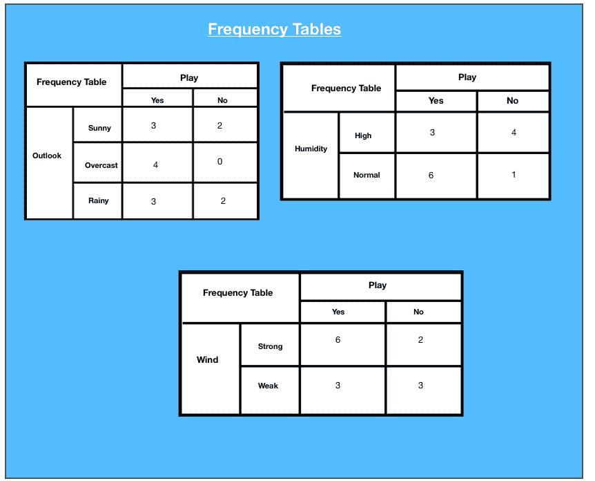
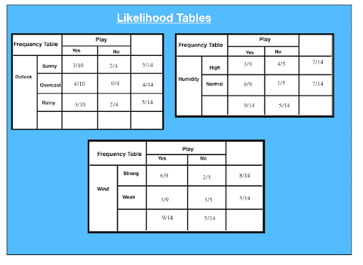
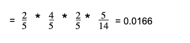

# 学习朴素贝叶斯算法的首要步骤

> 原文：<https://hackr.io/blog/top-steps-to-learn-naive-bayes-algorithm>

## 什么是朴素贝叶斯算法？

朴素贝叶斯模型，不管它做出什么样的强假设，由于其简单性和所需的参数分类数量少，在实践中经常被使用。该模型通常用于分类——根据给定实例的证据变量的值，决定该实例最有可能属于哪个类。

一种基于贝叶斯定理的朴素贝叶斯分类器算法，它提供了一种洞察力，即随着新数据的引入，可以调整事件的概率。这是一种概率算法，这意味着它计算给定文本的每个标签的概率，然后输出最高的标签。该算法不是单一的，而是使用统计独立性的不同机器学习算法的集合，易于编写，运行效率比复杂的贝叶斯算法更高。

## 朴素贝叶斯的工作:例子

### 分类

假设我们有一个数据集，其中有天气情况，湿度，我们需要确定那天我们是否应该比赛。前景可能是晴天、阴天或雨天，湿度较高或正常。风分为弱风和强风两类。

### 资料组

| 一天 | 观点 | 湿度 | 风 | 玩 |
| D1 | 快活的 | 高的 | 无力的 | 不 |
| D2 | 快活的 | 高的 | 强烈的 | 不 |
| D3 | 遮蔽 | 高的 | 无力的 | 是 |
| D4 | 雨 | 高的 | 无力的 | 是 |
| D5 | 雨 | 常态 | 无力的 | 是 |
| D6 | 雨 | 常态 | 强烈的 | 不 |
| D7 | 遮蔽 | 常态 | 强烈的 | 是 |
| D8 | 快活的 | 高的 | 无力的 | 不 |
| D9 | 快活的 | 常态 | 无力的 | 是 |
| D10 | 雨 | 常态 | 无力的 | 是 |
| D11 | 快活的 | 常态 | 强烈的 | 是 |
| D12 | 遮蔽 | 高的 | 强烈的 | 是 |
| D13 | 遮蔽 | 常态 | 无力的 | 是 |
| D14 | 雨 | 高的 | 强烈的 | 不 |

数据集每个属性的频率表如下所示:



以下是为每个频率表生成的可能性表:



P(x | c)= P(Sunny | Yes)= 3/10 = 0.3
P(x)= P(Sunny)= 5/14 = 0.36 P(c)= P(Yes)= 10/14 = 0.71

### 属性:展望:阳光明媚

假设 sunny 回答“是”的可能性是:

P(c|x) = P(是|晴)= P(晴|是)* P(是)| P(晴)
= 0.3 x 0.71/ 0.36 = 0.591

给 sunny“否”的可能性是:

P(c | x)= P(No | Sunny)= P(Sunny | No)* P(No)| P(Sunny)
= 0.4 x 0.36/0.36 = 0.40

### 属性:湿度:高

鉴于湿度较高，回答“是”的可能性为:

P(c|x) = P(是|湿度)= P(湿度|是)* P(是)| P(高)
= 0.33 x 0.6 / 0.36 = 0.42

给定高湿度条件下“否”的可能性为:

P(c|x) = P(无|高)= P(高|无)* P(无)| P(高)。
= 0.8×0.36/0.5 = 0.58

### 属性:风:弱

在弱风的情况下，“是”的可能性为:

P(c|x) = P(是|湿度)= P(湿度|是)* P(是)| P(高)
= 0.67 x 0.64 / 0.57 = 0.75

给定弱风的“否”的可能性为:

P(c|x) = P(无|高)= P(高|无)* P(无)| P(高)
= 0.4 x 0.36/ 0.57 = 0.25

假设我们有一天有以下值:

展望:雨
湿度:高 风力:弱 发挥:？

那天“不”的可能性。

P(展望=下雨|无)* P(湿度=高|无)* P(风=弱|无)* P(无)



P(是)= 0.0199/(0.0199+0.0166)= 0.55
P(否)= 0.0166 / (0.0199 + 0.0166)= 0.45

因此，该模型预测明天有 55%的可能性会有一场比赛。

[数据科学&机器学习:Python 中的朴素贝叶斯](https://click.linksynergy.com/deeplink?id=jU79Zysihs4&mid=39197&murl=https%3A%2F%2Fwww.udemy.com%2Fcourse%2Fdata-science-machine-learning-naive-bayes-in-python%2F)

## 步骤涉及朴素贝叶斯算法

**示例:PIMA 糖尿病测试**

该问题包括对患者记录的医疗细节的 768 次观察，描述了从患者获取的即时测量，例如他们的年龄、怀孕次数、血型。所有属性都是数字，单位因属性而异。每个记录都有一个类值，指示患者在五年内是否患有糖尿病。整个过程可以归结为五个步骤:

#### 步骤 1:处理数据

数据从 [CSV 文件](https://github.com/dtroupe18/SimpleNaiveBayes/blob/master/pima-indians-diabetes.data.csv)加载，并传播到培训和测试资产中。

#### 步骤 2:汇总数据

总结训练数据集中的属性，以计算概率并进行预测。

#### 第三步:做预测

使用数据集的摘要来进行单个预测，从而进行特定的预测。

#### 第四步:做所有的预测

给定一个测试数据集和一个汇总数据集，生成预测。

#### 第五步:评估准确性

测试数据集预测模型的准确性，以所有预测中正确的百分比表示。

#### 第六步:把所有东西绑在一起

最后，我们将所有步骤结合在一起，形成我们自己的朴素贝叶斯分类器模型。

### 密码

```
import csv
import random
import math
import numpy as np

def load_csv(filename):
 """
 :param filename: name of csv file
 :return: data set as a 2 dimensional list where each row in a list
 """
 lines = csv.reader(open(filename, 'r'))
 dataset = list(lines)
 for i in range(len(dataset)):
 dataset[i] = [float(x) for x in dataset[I]]
 return dataset
 # data = load_csv('pima-indians-diabetes.data.csv')
 # print(data)

def split_dataset(dataset, ratio):
 """
 split dataset into training and testing
 :param dataset: Two dimensional list
 :param ratio: Percentage of data to go into the training set
 :return: Training set and testing set
 """
 size_of_training_set = int(len(dataset) * ratio)
 train_set = []
 test_set = list(dataset)
 while len(train_set) < size_of_training_set:
 index = random.randrange(len(test_set))
 train_set.append(test_set.pop(index))
 return [train_set, test_set]

# training_set, testing_set = split_dataset(data, 0.67)
# print(training_set)
# print(testing_set)

def separate_by_label(dataset):
 """
 :param dataset: two dimensional list of data values
 :return: dictionary where labels are keys and
 values are the data points with that label
 """
 separated = {}
 for x in range(len(dataset)):
 row = dataset[x]
 if row[-1] not in separated:
 separated[row[-1]] = []
 separated[row[-1]].append(row)

return separated

# separated = separate_by_label(data)
# print(separated)
# print(separated[1])
# print(separated[0])

def calc_mean(last):

 return sum(lst) / float(len(last))

def calc_standard_deviation(last):
 avg = calc_mean(last)
 variance = sum([pow(x - avg, 2) for x in lst]) / float(len(lst) - 1)
 return math.sqrt(variance)

# numbers = [1, 2, 3, 4, 5]
# print(calc_mean(numbers))
# print(calc_standard_deviation(numbers))

def summarize_data(last):

 """
 Calculate the mean and standard deviation for each attribute
 :param lst: list
 :return: list with mean and standard deviation for each attribute
 """

 summaries = [(calc_mean(attribute), calc_standard_deviation(attribute)) 
 for attribute in zip(*lst)]
 del summaries[-1]

 return summaries

# summarize_me = [[1, 20, 0], [2, 21, 1], [3, 22, 0]]
# print(summarize_data(summarize_me))

def summarize_by_label(data):

 """
 Method to summarize the attributes for each label
 :param data:
 :return: dict label: [(atr mean, atr stdv), (atr mean, atr stdv)....]
 """
 separated_data = separate_by_label(data)
 summaries = {}
 for label, instances in separated_data.items():
 summaries[label] = summarize_data(instances)
 return summaries

# fake_data = [[1, 20, 1], [2, 21, 0], [3, 22, 1], [4,22,0]]
# fake_summary = summarize_by_label(fake_data)

def calc_probability(x, mean, standard_deviation):
 """
 :param x: value
 :param mean: average
 :param standard_deviation: standard deviation
 :return: probability of that value given a normal distribution
 """
 # e ^ -(y - mean)^2 / (2 * (standard deviation)^2)
 exponent = math.exp(-(math.pow(x - mean, 2) / (2 * math.pow(standard_deviation, 2))))
 # ( 1 / sqrt(2π) ^ exponent
 return (1 / (math.sqrt(2 * math.pi) * standard_deviation)) * exponent

# x = 57
# mean = 50
# stand_dev = 5
# print(calc_probability(x, mean, stand_dev))

def calc_label_probabilities(summaries, input_vector):
 """
 the probability of a given data instance is calculated by multiplying together
 the attribute probabilities for each class. The result is a map of class values
 to probabilities.
 :param summaries:
 :param input_vector:
 :return: dict
 """
 probabilities = {}
 for label, label_summaries in summaries.items():
 probabilities[label] = 1
 for i in range(len(label_summaries)):
 mean, standard_dev = label_summaries[I]
 x = input_vector[I]
 probabilities[label] *= calc_probability(x, mean, standard_dev)

return probabilities

# fake_input_vec = [1.1, 2.3]
# fake_probabilities = calc_label_probabilities(fake_summary, fake_input_vec)
# print(fake_probabilities)

def predict(summaries, input_vector):

 """
 Calculate the probability of a data instance belonging
 to each label. We look for the largest probability and return
 the associated class.
 :param summaries:
 :param input_vector:
 :return:
 """
 probabilities = calc_label_probabilities(summaries, input_vector)
 best_label, best_prob = None, -1
 for label, probability in probabilities.items():
 if best_label is None or probability > best_prob:
 best_prob = probability
 best_label = label
 return best_label

# summaries = {'A': [(1, 0.5)], 'B': [(20, 5.0)]}
# inputVector = 1.1
# print(predict(summaries, inputVector))

def get_predictions(summaries, test_set):

 """
 Make predictions for each data instance in our
 test dataset
 """
 predictions = []
 for i in range(len(test_set)):
 result = predict(summaries, test_set[i])
 predictions.append(result)

 return predictions

# summaries = {'A': [(1, 0.5)], 'B': [(20, 5.0)]}
# testSet = [1.1, 19.1]
# predictions = get_predictions(summaries, testSet)
# print(predictions)

def get_accuracy(test_set, predictions):

 """
 Compare predictions to class labels in the test dataset
 and get our classification accuracy
 """
 correct = 0
 for i in range(len(test_set)):
 if test_set[i][-1] == predictions[i]:
 correct += 1

 return (correct / float(len(test_set))) * 100

# fake_testSet = [[1, 1, 1, 'a'], [2, 2, 2, 'a'], [3, 3, 3, 'b']]
# fake_predictions = ['a', 'a', 'a']
# fake_accuracy = get_accuracy(fake_testSet, fake_predictions)
# print(fake_accuracy)

def main(filename, split_ratio):

 data = load_csv(filename)
 training_set, testing_set = split_dataset(data, split_ratio)
 print("Size of Training Set: ", len(training_set))
 print("Size of Testing Set: ", len(testing_set))

 # create model
 summaries = summarize_by_label(training_set)

 # test mode
 predictions = get_predictions(summaries, testing_set)
 accuracy = get_accuracy(testing_set, predictions)
 print('Accuracy: %'.format(accuracy))
 main('pima-indians-diabetes.data.csv', 0.70)
```

### 算法的优点

1.  朴素贝叶斯算法是一种高度可扩展的快速算法。
2.  二元和多元分类使用朴素贝叶斯算法。GaussianNB、MultinomialNB、BernoulliNB 是不同种类的算法。
3.  算法依赖于做一堆计数。
4.  文本分类问题的绝佳选择。这是垃圾邮件分类的普遍选择。
5.  它可以很容易地在小数据集上训练。

### 算法的缺点

*   根据“零条件概率问题”，如果给定的特征和类别的频率为 0，则该类别的条件概率估计值为 0。这个问题很麻烦，因为它也抹去了其他概率中的所有信息。"拉普拉斯校正。"是解决这个问题的示例校正技术之一。
*   另一个缺点是，它对独立性类特性做了强有力的假设。在现实生活中几乎不可能找到这样的数据集。

## 朴素贝叶斯算法的应用

朴素贝叶斯算法在多种现实场景中的应用有:

1.  **文本分类**:用作文本分类的概率学习方法。当对文本文档进行分类时，即，无论文本文档属于一个还是多个类别，该算法都是最成功的算法。
2.  **垃圾邮件过滤**:文本分类的一个例子，是区分合法邮件和垃圾邮件的一种流行机制。许多现代电子邮件服务实施贝叶斯垃圾邮件过滤。一些服务器端的电子邮件过滤器，如 SpamBayes、SpamAssassin、DSPAM、ASSP 和 Bogofilter，就利用了这种技术。
3.  **情绪分析**:用于分析推文、评论、评论的语气，即正面、中性、负面。
4.  **推荐系统**:朴素贝叶斯算法与协同过滤相结合，用于构建混合推荐系统，帮助预测用户是否喜欢某个给定的资源

## 结论

希望现在你已经理解了什么是朴素贝叶斯，文本分类利用了它。这个简单的方法对于分类问题非常有效，而且从计算上来说，它也非常便宜。无论用户是不是机器学习专家，他们都有工具来构建自己的朴素贝叶斯分类器。

你在哪里看到这个算法在使用？让我们知道！下面评论。

**人也在读:**