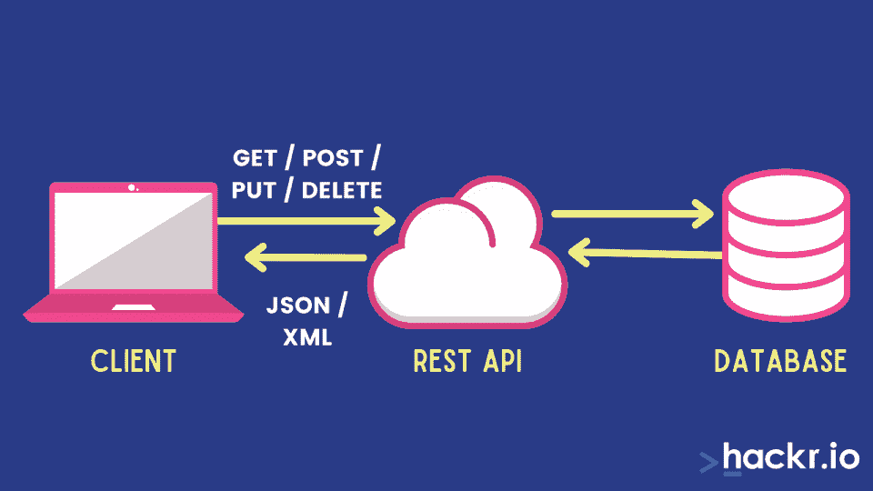
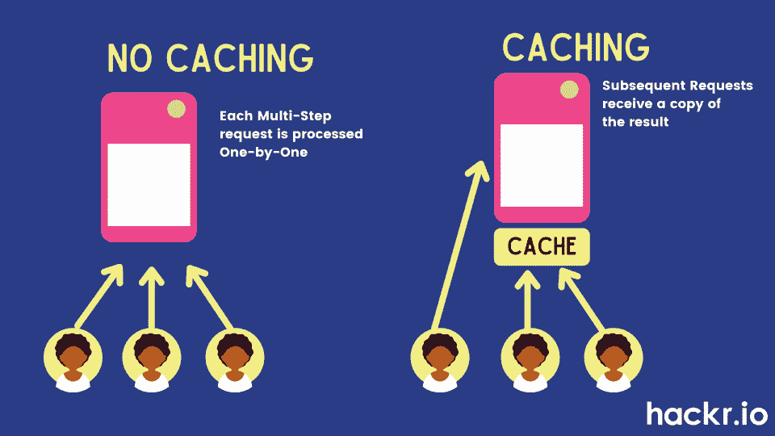
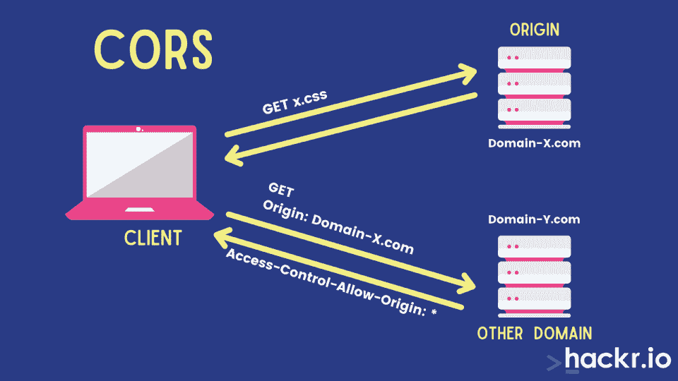
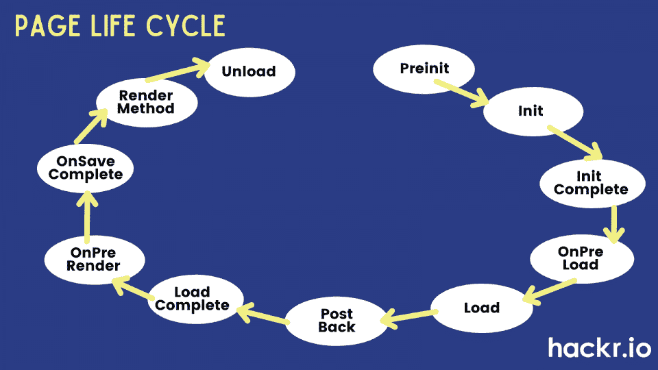

# 2023 年 50 大 Web API 面试问答

> 原文：<https://hackr.io/blog/top-web-api-interview-questions>

Web API 是一个应用程序编程接口，允许浏览器和设备(如平板电脑、手机等)使用 Web 服务。它于 2000 年 2 月由 Salesforce 首次推出。从那时起，Web API 因其轻量级、简单的服务和独立的 Web 服务应用程序而广受欢迎。

无论你是一个初学者还是有经验的 IT 专业人士试图进入发展中的领域，你必须知道拥有一个强大的资源对破解你即将到来的面试的重要性。

随着技术的不断变化，Web API 领域也在不断发展。如果你打算申请任何 web API 职位，看看这些 Web API 面试问题做准备吧！

## **Web API 面试问答**

以下是一些最常见的 Web API 面试问题，分为三个级别:初级、中级和高级

### **Web API 初学面试问题**

#### **1。Web API 为什么重要？**

Web API 是一种从服务器向您提供信息或数据的服务。这对业务增长至关重要。以下是 Web API 之所以重要的几个原因:

*   为网站和客户端应用程序提供访问数据的接口
*   支持各种文本格式，如 [XML 和 JSON](https://hackr.io/blog/json-vs-xml) 等。
*   在低带宽设备上运行良好
*   通常用于创建用户界面/UX，增加网站的流量
*   兼容任何类型的浏览器和设备

#### **2。Web API 的商业优势是什么？**

以下是 Web API 的一些商业优势:

*   通过集中业务逻辑，高效、一致地维护业务信息，减少手动工作
*   能够通过多个 HTTP 客户端访问 Web APIs，如 Windows (7、8)、Android、iPad 等。
*   开源
*   具有与 [MVC 控制器类似的控制器模式，](https://hackr.io/blog/mvc-interview-questions)使其易于理解
*   Asp.net 框架的一部分，这意味着不依赖于开发和部署。

#### **3。Web API 有什么技术上的好处？**

Web API 有一些技术优势:

*   简单的配置
*   独立于 UI 开发
*   使用 rest-client 等高级工具进行简单的业务逻辑测试
*   轻量级架构，适用于低带宽设备
*   基于 HTTP，更容易定义
*   受许多 MVC 特性支持，如动作结果、模型绑定器等。
*   附带了确定内容类型的描述性消息头，以及解释如何保护内容、缓存信息等的消息头。
*   通过 HTTP 表单执行标准的 CRUD(创建、读取、更新、删除)操作，比如 GET、PUT、POST 和 Delete
*   使您能够开发功能全面的休息服务
*   API 服务接口由 URL 模式和 HTTP 方法组成
*   帮助您访问非基于 SOAP 的服务，如 XML 或 JSON 字符串

#### **4。Web API 的缺点是什么？**

以下是 Web API 的一些缺点:

*   Web API 在开发时间和维护方面会产生成本。
*   Web API 使你的网站容易受到网络攻击。
*   API 的使用并不总是可预测的。
*   你需要有构造 API 的技术知识。
*   API 在测试时可能会崩溃，导致维护成本增加。

#### **5。解释 Web API 和 WCF 的区别。**

WCF 是一个创建分布式和可互操作应用的框架。它还适用于构建面向服务的连接应用程序，以便将异步数据从一个服务点传输到另一个服务点。

**Web API 是**网络浏览器和网络服务器的接口。浏览器 API 只是扩展了 web 浏览器的功能，而服务器 API 只是扩展了 web 服务器的功能。

#### **6。为什么选择 Web API 而不是 WCF？**

以下是您应该选择 Web API 而不是 WCF 的几个原因:

*   Web API 附带了 HTTP 特性，如 URIs，并支持各种内容格式、版本控制等。
*   您不必为支持不同的设备定义不同的设置。
*   由于 XML 的使用，Web API 更快，更适合轻量级服务。
*   Web API 更加灵活。
*   它通过令牌认证和其他方法来确保安全性。

#### **7。REST API 和 RESTful API 之间的区别是什么？**

****

REST API 代表表述性状态转移 API，遵循在应用程序和服务之间建立通信的规则。

RESTful API 是基于 REST 架构的应用编程接口(API)，使用 RESTful web 服务进行交互。

下表强调了 REST API 和 RESTful API 之间的区别:

| **属性** | **REST API** | **RESTful API** |
| 定义 | 用于开发 API，支持客户端和服务器之间的通信。 | 遵循 REST 基础设施的 Web 应用程序，提供网络上不同系统之间的互操作性。 |
| 网络服务 | URL 工作基于请求和响应。 | RESTful 工作完全基于 REST 应用程序。 |
| 数据格式 | 基于 HTTP。 | 基于 JSON、HTTP 和 Text。 |
| 适应性 | 适应性强且用户友好 | 灵活的 |
| 草案 | 强大的协议和令人印象深刻的安全措施 | 多层，传输协议降低了系统的安全性。 |

#### **8。为什么在 Web APIs 中使用 REST？**

出于几个原因，您可能会在 Web APIs 中使用 REST:

*   更容易理解
*   降低应用程序的复杂性，并将其转换为易于使用的资源
*   能够使用 HTTP 代理和缓存处理高负载
*   帮助新客户使用其他人的应用程序，不管他们的目的是什么
*   使用标准 HTTP 过程调用来访问数据。
*   REST API 依赖于代码，允许您轻松地跨网站同步数据，而不会带来复杂性。
*   遵循灵活的方法并序列化 JSON 或 XML 格式的数据。
*   基于标准的安全性使用 OAuth 协议来验证每个 REST 请求。

#### **9。陈述 SOAP 和 REST 的区别。**

REST(表述性状态转移):web 服务的一种高级形式，描述了网络系统的架构风格。向服务器发送请求不需要更大的带宽。

**SOAP(简单对象访问协议):**一种轻量级协议，用于在 Web 上交换结构化和类型化的信息。它适用于 HTTP 和 RPC(远程过程调用)以及 B2B 应用程序。SOAP 消息包含大量数据，需要更大的带宽。

| **类别** | **REST API** | **SOAP API** |
| 履行 | 它没有官方标准，因为它是一种建筑风格。 | 它有一个官方标准，因为它是一个协议。 |
| 内部交流 | REST API 使用各种标准进行数据传输，比如 HTTP、JSON、URL 和 XML。 | 它只使用 HTTP 和 XML。 |
| 所需资源 | 它需要更少的资源和带宽。 | SOAP API 需要更多的资源和带宽来转换 XML 格式的数据，从而导致负载增加和文件变大。 |
| 描述 | 使用 web 应用程序描述语言来描述 Web 服务的功能。 | 使用 Web 服务描述语言。 |
| 安全性 | 附带 SSL 和 HTTPS 以确保安全性。 | 具有 SSL(安全套接字层)和 WS-security。 |
| 交换 | REST 可以使用 SOAP 作为 web 服务的底层协议。 | SOAP 不能使用 REST，因为 SOAP 是一种协议。 |

媒体类型格式化程序是负责序列化数据的类。序列化包括将数据转换成易于传输和以后重构的格式。

通过序列化请求/响应数据，Web API 可以有效地理解请求数据格式，并以客户端期望的格式发送数据。它指定在 HTTP 响应或请求中客户机和服务器之间交换的数据。

| **媒体类型格式化程序类** | **描述** |
| JsonMediaTypeFormatter | 处理 JSON 格式 |
| XmlMediaTypeFormatter | 处理 XML 格式 |
| formurlencodemediatypeformatter | 处理 HTM 表单 URL 编码的数据 |
| jquerymvcformurlencodeformatter | 处理模型绑定的 HTML 表单 URL 编码的数据 |

#### **11。Web API 支持哪种协议？**

Web API 支持 HTTP 协议。

#### **12。JSON 和 XML 是什么？**

XML(可扩展标记语言)设计用于以结构化格式存储和传输数据。它的工作方式类似于 HTML，但更灵活，因为用户可以创建自己的定制标签。

另一方面，JSON (JavaScript Object Notation)是一种用于存储和传输数据的轻量级格式。它采用基于文本的格式来表示结构化数据，这使得它更容易理解，使用起来也更快。

#### 13。Web API 中有哪些不同的过滤器？

过滤器允许您在 Web API 框架的不同级别添加额外的逻辑。以下是 Web API 中的不同过滤器:

*   **认证过滤器:**该过滤器负责认证和授权 HTTP 请求。例如，检查用户的身份。
*   **授权过滤器:**这个过滤器检查用户的真实性，如果用户没有通过验证，就调用 HTTP 状态代码 401。
*   **AuthorizeAttribute:** 这是一个内置的授权过滤器。
*   **动作过滤器:**您可以将此过滤器应用于控制器动作或整个控制器。您可以使用它在执行控制器操作之前或之后添加逻辑。
*   **异常过滤器:**处理 Web API 中控制器动作抛出的所有未处理的异常。
*   **覆盖过滤器:**从全局过滤器中排除特定的操作方法，并帮助修改其他过滤器的行为。

#### **14。谁使用 Web API？**

浏览器和移动设备通常使用 Web API。您还可以将它用于需要 web 服务的本机应用程序。最后，使用 HTTP 动词的客户端可以使用它。

#### 15。解释 Web API 中的错误处理。

Web API 提供了各种错误处理类:

*   **HttpResponseException:** 返回异常构造函数中提到的 HTTP 状态码。
*   **HttpError:** 使用 HttpResponseMessage 向客户端返回有意义的错误代码。
*   **异常过滤器:**缓存 Web API 中生成的未处理异常或错误，在控制器动作方法抛出未处理错误时很有用。

#### 16。解释 MVC 以及它与 Web API 的不同之处。

MVC 代表模型、视图和控制器。开发人员通常使用它来开发模型用户界面。MVC 将数据和显示分开，使开发人员能够在不影响彼此的情况下修改两者。

以下几点描述了 MVC 和 Web API 的不同之处:

*   MVC 通常用于开发同时返回数据和视图的应用程序。另一方面，Web API 毫不费力地生成只返回数据而不返回视图的 HTTP 服务。
*   MVC 使用动作名来执行跟踪。Web API 使用 HTTP 服务操作来执行跟踪。
*   Web API 以 JSON、XML 和其他格式返回信息。MVC 只返回 JSON 格式的数据。
*   Web API 支持自托管和协商，而 MVC 不支持。
*   Web API 有助于使用。Net 框架，而 MVC 不支持。

#### **17。如何托管 Web API？**

您可以使用自托管和 IIS 托管来托管 Web API。

### **ASP.NET Web API 面试问题**

#### 18。什么是 ASP.NET 网络应用编程接口？

ASP.NET Web API 是一个框架，是在[上开发 RESTful 应用程序的完美解决方案。NET 框架](https://hackr.io/blog/what-is-net)。使用 ASP.NET Web API 框架，您可以无缝地创建 HTTP 服务来响应各种客户端，包括浏览器和移动设备。

微软提供了这个框架，用于在。Net 框架。

#### **19。ASP.NET Web API 有什么优势？**

以下是 ASP.NET Web API 的一些优势:

*   非常适合在。NET 框架。
*   类似于 HTTP，使用 GET、POST、PUT、DELETE 来执行 CRUD 操作。
*   创建 Web API 的灵活选项。
*   支持路由。
*   支持模型绑定、验证、Odata 等。
*   使用 ApiExplorer 开发自定义帮助和测试页面。
*   可以无缝地创建非基于 SOAP 的服务，比如 XML、JSON 等。

#### 20。什么是缓存？什么是几种不同类型的缓存？

****

缓存包括临时存储信息以供快速参考。它的内存中包含所有经常访问的文件。每当您重新访问这些文件时，高速缓存会向您显示这些文件，而不是一次又一次地将您引导到实际的网站。

几种不同类型的缓存包括:

*   页面缓存
*   片段缓存
*   数据缓存

#### **21。解释 Web API 中的内容协商。**

内容协商是指为特定响应选择最佳可能表示的方法。有两种类型的头可用于内容协商:

*   **Content-Type:** 这个头告诉服务器它将从客户端接收到的信息。
*   **Accept:** 这个头显示了客户端向服务器请求的数据格式。

#### **22。解释 ASP.NET Web API 路由。**

路由是使用 Web API 将 URI 与动作匹配的过程。它有助于决定调用哪个动作和控制器。控制器是一个处理 HTTP 请求的类，这个类带有称为 action 方法的公共方法。

路由有两种不同的实现方式:

*   **基于约定的路由:**这种类型的路由使用路由模板来选择控制器和执行方法。
*   **基于属性的路由:**Web API 2 支持这种类型的高级路由。它使用属性来定义路由并将其添加到路由表中。

#### **23。如何保护 ASP.NET Web API？**

众所周知，Web API 是基于 Web 的交互编程。任何人都可以通过 URL 访问这些应用程序，从而将它们暴露给黑客。因此，保护 Web API 并将其访问权限仅限于授权用户是非常重要的。

这里有两种方法可以使 Web API 更加安全:

*   **认证:**该方法通过确认用户的用户名和密码来检查用户。如果细节不准确，服务器会返回一个 401 HTTP 状态码，指明未经授权的访问。为了消除这个错误，您可以使用 OAuth 2.0。
*   **授权:**该措施确认用户具有执行特定操作的适当权限。

#### **24。ASP.NET 支持哪些退货类型？**

支持的返回类型有:

*   HttpResponseMessage
*   HttpActionResult，
*   虚空，
*   线
*   （同 Internationalorganizations）国际组织
*   等等。

#### **25。解释 ASP.NET Web API 中的异常过滤器。**

这个异常过滤器用于处理 Web API 引发的所有意外异常。此过滤器类实现 IExceptionFilters 接口。每当控制器抛出意外异常时，就会执行该过滤器。

#### **26。解释 Web API 中的 CORS。**

****

CORS 代表跨来源资源共享，允许用户在浏览器内从一个网站向另一个网站提出请求。它处理来自不同来源的跨来源请求和数据传输。它无缝地消除了 JavaScript 同源的限制。您可以使用 web API 包为 Web API 启用 CORS。

#### **27。如何对 Web API 进行单元测试？**

Fiddler 是 Web API 常用的单元测试工具之一。它是一个免费的调试代理，任何浏览器都可以使用它来编写和执行几个 HTTP 请求并检查它们的响应。它还能有效地测试 RESTful web 服务。

在 Fiddler 工具上，你可以按照下面的步骤来进行单元测试:

fiddler–编写选项卡->输入请求标题->输入请求正文，然后执行。

#### **28。解释 DelegatingHandler 如何工作。**

DelegatingHandler 在 ASP.NET Web API 中开发了一个定制的服务器端 HTTP 消息处理程序。它用于在 Web API 中路由消息之前表示消息处理程序。

#### **29。哪种方法可以验证页面上的所有控件？**

这一页。Validate()方法验证页面上的所有控件。

#### 三十岁。可以从 ASP.NET Web API 方法返回视图吗？

不，不能从 ASP.NET Web API 方法返回视图。web API 创建 HTTP 服务来提供信息。ASP.NET MVC 应用程序中的 ApiController 只呈现序列化的数据并发送给客户端。您可以使用控制器来提供普通视图。

#### 31。Web API 中哪种方法处理错误码？

CreateErrorResponse 是一个返回错误代码和错误消息的扩展方法。它将创建一个 HttpError 对象，并将其包装在 HttpResponseMessage 对象中。

#### 32。陈述 HTTP GET 和 HTTP POST 的区别。

以下是 HTTP GET 和 HTTP POST 方法之间的主要区别:

| **HTTP GET** | **HTTP 帖子** |
| 这些参数包含在 URL 中。 | 参数包含在主体中。 |
| 您可以使用它从指定的资源请求数据，而不会产生任何影响。 | 您可以使用它向服务器发送数据以更新指定的资源。 |
| 请求参数附加在 URL 字符串中。 | 请求参数在消息体中，使得从客户端向服务器发送数据更加安全。 |
| 您可以使用 GET 缓存请求方法。 | 不能使用 POST 缓存请求方法。 |
| GET 请求不如 POST 方法安全 | 相比之下，Post 请求更安全。 |
| 数据类型在 GET 方法中受到限制，只能使用 ASCII 字符。 | 这种方法对数据类型没有限制，甚至可以使用二进制数据。 |
| 每个人都能看到 URL 中的数据。 | URL 中不显示数据。 |

## **Web API 高级面试问题**

#### 33。什么是 ApiController？

ApiController 以串行方式返回数据，然后将数据发送给客户端。**例如:**

```
public class TBController : ApiController
{
// GET: /Api/TB/
public List<Tweet> Get()
{
return Twitter.GetTweets();
}
}
```

#### 34。什么是控制器？

您可以使用控制器来提供普通视图:

```
public class TBController : Controller
{
// GET: /Tweets/ [HttpGet] public ActionResult Index()
{
return Json(Twitter.GetTweets(), JsonRequestBehavior.AllowGet);
}
}
```

#### 35。ASP.NET Web API 2.0 有什么特点？

以下是 ASP.NET Web API 2.0 的功能:

*   属性路由
*   CORS(跨产地资源共享)
*   OWIN(开放网络接口。NET)自托管
*   IHttpActionResult
*   Web API OData

#### 36。进行 Web API 版本控制的不同方法有哪些？

以下是执行 Web API 版本控制的不同方法:

*   [URI](https://hackr.io/blog/url-vs-uri)
*   查询字符串参数
*   自定义标题参数
*   接受标题参数

#### 37。如何全局注册异常过滤器？

您可以使用以下代码全局注册异常过滤器:

```
GlobalConfiguration.Configuration.Filters.Add (new MyTestCustomerStore.NotImplExceptionFilterAttribute());
```

#### 38。TestAPI 是什么？

TestAPI 是一个 API 实用程序库，帮助开发人员创建测试工具和自动化测试。Net 应用程序。

#### 39。如何确保 Web API 只返回 JSON 格式的数据？

您需要打开“WebApiConfig.cs”文件并添加以下行:

```
config.Formatters.JsonFormatter.SupportedMediaTypes.Add(new MediaTypeHeaderValue("application/json"))
```

#### 40。我们可以在 C#控制台应用程序中使用 Web API 2 吗？

是的，你可以在控制台应用程序、MVC、Angular JS 或任何其他应用程序中使用 Web API 2。

#### 41。如何在 Web API 中启用 HTTPS？

ASP.Net Web API 运行在 HTTPS 协议之上。您可以创建一个新类并获得一个具有 AuthorizationFilterAttribute 的类，然后检查请求的 URL 是否具有 HTTPS。

#### **42。解释基于令牌的身份验证。**

基于令牌的身份验证是一个安全的身份验证过程，在此过程中，用户使用签名令牌进行身份验证。

#### **43。解释不同的 HTTP 方法。**

有 8 种不同的 HTTP 方法:

*   **GET:** 使用特定的 URI 从各自的服务器中检索数据。
*   **HEAD:** 类似于 GET，但是只发送状态行和头部分。
*   **PUT:** 用上传的内容更新和替换所有现有资源。
*   **POST:** 向各自的服务器发送数据。
*   **删除:**删除当前所有由 URI 给出的资源。
*   **选项:**指定目标资源的通信选项。
*   **CONNECT:** 根据给定的 URI 创建到服务器的隧道。
*   **TRACE:** 沿着到目标资源的路径执行消息环回测试。

HTTP 头允许客户端和服务器通过 HTTP 请求和 HTTP 响应传输附加信息。它是 HTTP 请求和响应的组成部分。换句话说，我们可以将 HTTP 头定义为在 web 服务器和客户端之间传输数据的代码。

#### **45。什么？NET 框架支持 ASP.NET Web API？**

ASP.NET Web API 的第一个版本是在。NET 框架 4。之后，一切。NET 框架版本带有 ASP.NET Web API 支持。

#### **46。描述页面生命周期。**

****

在任何 ASP.Net 页面的执行过程中，甚至在页面初始化到呈现之前都会发生几个事件。这些事件按时间顺序发生，如下所示:

#### **47。哪个文件有助于自定义 ASP.Net 应用程序？**

要自定义 ASP.net 应用程序，可以对 web.config 文件进行必要的更改。

#### **48。什么是 web 服务？**

这些软件服务通过网络从一台机器服务到另一台机器。这些服务使用 XML，并为数据传输提供 SSL 和 WSS。

#### **49。什么是会话对象？**

会话对象是存储关于用户会话的必要信息的对象。标准信息包括姓名、id、偏好、设置更改等。会话对象在会话开始时初始化，在会话到期时销毁。

#### 50。web 服务支持像 POM 对象这样的数据读取器吗？

是的，web 服务支持数据读取器对象，因为它们包含业务逻辑。因此，我们可以在 web 服务中使用数据读取器对象，比如 POM。

[。NET/ C#面试大师班-500 强问题&答案](https://click.linksynergy.com/deeplink?id=jU79Zysihs4&mid=39197&murl=https%3A%2F%2Fwww.udemy.com%2Fcourse%2Fcsharp-oops-mvc-asp-dotnet-core-webapi-sql-questions-mock-interviews%2F)

## **Ace Web API 面试技巧**

现在你有了一个很好的常见 Web API 面试问题的资源，你可以很容易地通过 Web API 面试。但是，这里有一些有用的提示，可以进一步增加你成功的机会！

**准备情景型问题。**面试官可能会要求你描述一下你使用 Web API 的情况。在面试日期前想几个成功的故事。

**沟通技巧。恰当的沟通对赢得面试至关重要。进行眼神交流，清晰地说话，并确保在必要的地方给你的答案添加上下文。**

**提问。**在面试结束时，你会被问到:“你有什么问题要问我吗？”一定要提前想出一对情侣来证明你对这个角色和公司的兴趣。

**自信。**说起来容易做起来难，我们知道！但是当谈到自信的时候，准备是至关重要的。面试前几天回顾一下你的简历和成就，和朋友一起测试一下这篇文章的面试问题！

从之前的面试中学习。你是否记得在面试中被某个特定的问题绊倒了？写下这个问题或其他类似的问题，并在面试前练习回答。

## **结论**

Web API 通常在所有基于 Web 的应用程序中使用，用于有效和安全的数据传输。如果你[想成为一名成功的 web 开发人员](https://hackr.io/blog/how-to-become-a-web-developer)，你必须了解 Web API 的基础和高级特性，它们在市场上的最新版本，它们是如何工作的，等等。

我们希望这篇博文能帮助你了解采访中常见的 web API 问题。我们已经讨论了 Web API 上常见的面试问题，这些问题有助于你完善知识，赢得下一次 Web API 面试。

有兴趣扩展你的知识面吗？查看我们关于 API 测试的文章。

**人也在读:**