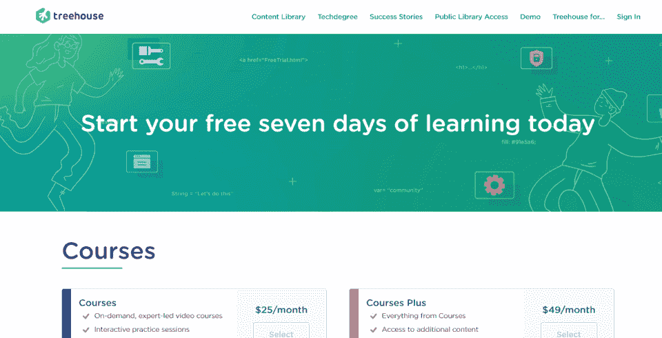
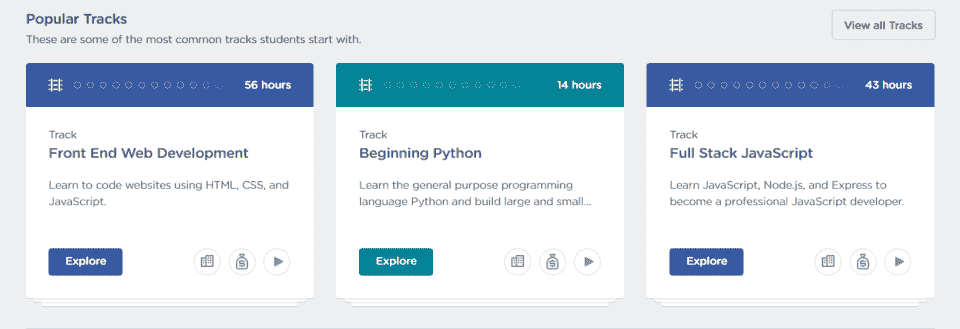
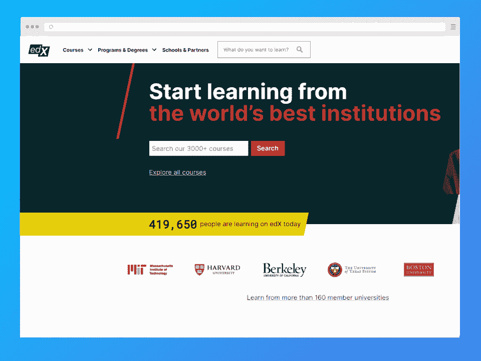

# 2023 年树屋回顾:利弊与选择

> 原文：<https://hackr.io/blog/treehouse-review>

Team Treehouse 是 PHP、JavaScript、CSS 等在线编码类的完整存储库。你可以探索团队的树屋内容库，或者浏览他们的 tech degree path——一个合法的、每月一次的在线编码训练营，包括一个作品集。

| 教练 | 3/5 |
| 课程 | 5/5 |
| 经验 | 4/5 |
| **总计** | **4/5** |

一目了然:

*   Team Treehouse 拥有丰富的编程课程库，包括前端 web 开发、初级 Python 和全栈 JavaScript。
*   团队树屋技术学位可能是完整训练营体验的完美项目。
*   Team Treehouse 比许多在线编码营稍微贵一些，并且可能不会提供比免费版本更多的内容。
*   Team Treehouse 最显著的与众不同之处在于，它的课程是通过视频提供的，而不仅仅是文本。
*   课程是非常自我导向的，所以你不应该期望从讲师那里得到很多指导。

但是有很多编码训练营——团队树屋适合你吗？我们将涵盖你需要知道的一切，从团队树屋评论中的常见投诉到团队树屋的证书是否重要。

## 团队树屋能提供什么？

Team Treehouse 提供 104 个练习课程、283 个课程、205 个工作坊、24 个奖励系列和三个会议。实践课程、课程和工作坊是项目的基石。

*   **实践课程**。这些课程是互动练习，您可以通过完成这些练习来提高特定技能。如果你已经对某项技术略知一二(比如一门[编程语言](https://hackr.io/blog/best-programming-languages-to-learn)，可以利用这些实践课程来温习一下。
*   **课程**。这些是关于特定技术和编程语言的深入课程，比如 Python 编程的*介绍*。课程很详细，但简短而具体。
*   **车间**。这些是关于特定技术的研讨会，比如*在 CSS* 中启用黑暗模式。如果你有一个具体的问题，研讨会可以帮助你了解答案。

当然，所有这些练习、课程和研讨会都是值得的。但是大多数学生对课程感兴趣，这些课程是完整的教案。

此外，树屋还提供课程集。此外，该平台的 Techdegrees 适合那些想要认证的人。你可以获得五个学科的技术学位，包括前端 Web 开发和全栈 JavaScript。

| 树屋得到认证了吗？Team Treehouse 未经认证，但其 Techdegree 课程提供经过验证的结业证书和作品集。理想情况下，你应该带着一份雇主现成的投资组合走出团队树屋。 |

## 团队树屋是给谁的？

团队树屋是学习的理想场所:

*   Web 开发
*   Java Script 语言
*   UX 设计
*   UI 设计
*   Python 开发
*   数据分析

虽然 Team Treehouse 有其他课程、练习和研讨会，但它绝对是对前端 web 开发感兴趣的人的最佳选择。

## 团队树屋是如何运作的？

Team Treehouse 包括一系列广泛的模块(练习、课程、技术路线),您可以报名参加。一旦你注册了，你就加入了一个自定进度的课程，这个课程充满了你可以利用自己的时间进行的练习。

课程结合了点播视频、互动会议和社区支持。但是你不应该期望和老师有太多的互动。在很大程度上，你将独立处理课程内容。

课程是通过订阅付费的，因此您最终支付的金额取决于您完成课程的时间。

### **如何开设团队树屋账户**

你可以注册团队树屋，免费试用 7 天。您需要首先选择您想要的帐户类型(课程、课程升级或技术学位计划)。如果你不取消它，它将自动续费。

免费试用是确定您是否喜欢 Team Treehouse 内容的好方法。请记住，您需要在它自动更新之前取消，否则您将被收取每月的树屋编码费用。然而，根据大多数团队的树屋评论，如果你没有按时取消，退款并不难。

## **Team Treehouse 的订阅选项**

当您注册 Team Treehouse 时，请选择您的订阅类型。有三种类型的订阅服务:

*   **课程**。每月 25 美元，你就可以参加团队树屋的所有课程、练习和研讨会。
*   **课程加**。每月 49 美元，您就可以访问额外的课程内容和下载视频进行离线学习。
*   **技术学位**。每月 199 美元，你可以参加任何 Techdegree 项目，需要 3 到 9 个月，取决于项目的严格程度。

大多数人将能够通过团队树屋课程。但是如果你想做一个 Techdegree 的路径，费用相对于很多其他训练营还是相当合理的。

| 你是视觉学习者吗？ |
| 一些学生报告说通过视频学习效果最好，而另一些学生通过文本学习效果最好。根据研究，[视频和文本学习的保持率](https://www.microassist.com/learning-dispatch/video-or-text-better-for-retention/)大致相当。这是个人喜好的问题。Team Treehouse 以可视格式(视频和互动练习)制作课程，而它的大多数替代品(Codecademy，freeCodeCamp)主要使用文本。如果你是视觉学习者，团队树屋是一个很好的解决方案。 |

## **团队树屋课程:学习基础知识**

团队树屋课程是个人或独立技术中的小型离散课程，如技术面试、基本面向对象 Python 或设计思维介绍。这些课程往往只有一两个小时，可以根据难度进行分类，比如“初级”、“中级”和“高级”

### **最受欢迎的团队树屋课程**

以下是一些最受欢迎的团队树屋课程:

*   [CSS 基础知识](https://teamtreehouse.com/library/css-basics-5)。一个 191 分钟的交互式课程，关于选择器、值、单位和 CSS 的其他基本概念。这个简短的课程将向[前端网站开发者](https://hackr.io/blog/how-to-become-a-front-end-developer)介绍如何用 CSS 格式化和设计网站。
*   [基本面向对象 Python](https://teamtreehouse.com/library/basic-objectoriented-python) 。127 分钟的 Python 介绍。开发人员将学习 Python 的基础知识，包括类创建、对象创建、类属性、实例属性和方法。
*   [设计思维入门](https://teamtreehouse.com/library/intro-to-design-thinking)。在这个 75 分钟的课程中，设计师将学习如何从用户的角度理解设计和开发，理解和构建同理心地图和旅程地图。

如果你不确定下一步想学什么，你可以参加团队树屋课程。使用类来测试不同的编程语言和 web 开发技术。

## **团队树屋曲目:深入了解更多信息**

****

Team Treehouse tracks 是一系列 Team Treehouse 课程，旨在教您更多关于某个给定领域的知识，如前端 Web 开发、Python 入门或全栈 JavaScript。这些曲目有时长达 10 到 20 个小时，但甚至可以持续 50 个小时。他们会给你一门学科更深入的知识。

### **最受欢迎的团队树屋曲目**

以下是一些最受欢迎的团队树屋曲目:

*   [前端 Web 开发](https://teamtreehouse.com/tracks/front-end-web-development)。这门 56 小时的课程包括 HTML、CSS 和 JavaScript。开发人员将学习 HTML 基础知识、CSS 基础知识、JavaScript 函数、移动优先设计、响应式布局以及如何使用 Git。
*   [开始 Python](https://teamtreehouse.com/tracks/beginning-python) 。14 小时的课程，包括 Python 基础知识、列表、元组、函数、序列和字典。程序员将从这门课程中学会从头到尾使用 Python 进行基本应用。
*   [全栈 JavaScript](https://teamtreehouse.com/tracks/full-stack-javascript) 。一个 43 小时的[关于前端和后端开发的 JavaScript](https://hackr.io/blog/best-javascript-courses) 课程。学员将涉及数字、函数、循环、数组、对象、Node.js 等等。

这些轨道不是你开始职业生涯所需要的一切，但它们是开始学习的一个极好的地方。如果你发现有你喜欢的技术，你可以去读一个相关的技术学位。

## **团队树屋技术学位:你需要的一切**

Team Treehouse 的 Techdegrees 包括实时学生支持、真实世界项目、交互式测验和同行的深入代码审查。虽然他们仍然是自我导向的，但他们提供了更多的支持和深入的活动。

这些项目比课程或赛道更昂贵。你需要每月支付 199 美元来完成这些工作。它们也明显更长，许多平均约为半年。

理想情况下，你可以使用团队树屋技术学位来促进或改变你的职业生涯。

### **最受欢迎团队树屋度**

以下是一些最受欢迎的团队树屋学位途径:

*   [前端 Web 开发](https://teamtreehouse.com/techdegree/front-end-web-development)。本课程将教你如何开发 HTML、CSS 和 JavaScript 网站。您将在整个计划中创建一系列项目，包括交互式照片库、游戏节目应用程序和 WebApp 仪表板。学位之路以一个顶点项目结束。本课程包括九个项目，耗时 3-9 个月。
*   [全栈 JavaScript 开发](https://teamtreehouse.com/techdegree/full-stack-javascript)。该全栈开发课程包括随机报价生成器、React Gallery、SQL Library Manager 和全栈应用顶点项目等项目。您将同时使用客户端和服务器端 JavaScript。本课程包括十个专题，耗时 3-9 个月。
*   [UX 设计](https://teamtreehouse.com/techdegree/ux-design)这个 UX 设计学位证书课程包括设计 t 恤网站、创建杂货应用程序和开发 UX 作品集等项目。你将学习满足用户需求的基础设计。本课程包括十个项目，耗时 3-8 个月。

虽然这些被称为“学位”，但它们本质上是以认证结束的训练营。因为他们每月花费 199 美元，你的付款将与你完成课程的时间相关。

## **如何在团队树屋中找到最好的班级**

与 Coursera 或 Udemy 等平台不同，Team Treehouse 只提供一个主题的课程。例如，在 Coursera 上，可能有 200 门不同的“Python 入门”课程，由不同的教师讲授。相反，Team Treehouse 将有一个单独的、精心创建的“Python 介绍”类。

要想在 Team Treehouse 上找到最好的课程，决定你想要深入到什么程度。您是否需要一个关于特定功能的简单研讨会？了解如何在 Netbeans 中使用 Node.js。或者你需要一门特定技术的课程吗？在这种情况下，你可能需要 Node.JS 的介绍。或者，你可能想学习 web 开发——一个完整的技术学位。

你可以根据技术和经验水平搜索 Team Treehouse，并继续学习。

## **团队树屋回顾:雇主们认真对待团队树屋吗？**

如果不讨论雇主的看法，我们的树屋编码审查是没有帮助的。Team Treehouse 不像其他学术学习项目那样出名。但这并不意味着它们对找工作没用。

重要的是，Team Treehouse 是基于项目的。您将在团队树屋课程、路线和 Techdegree 路径中构建的许多项目将为您的投资组合留下项目。因为这是一个自定进度的项目，所以你投入多少，收获多少。

如果你通过了 Team Treehouse Techdegree 路径，你将获得一个可共享的、有效的证书。雇主是否认真对待它取决于你和你的投资组合，因为团队树屋学位是不被认可的。

## 团队树屋评审编码:优点、缺点和用户评审

| **优点** | **缺点** |
| 用于 web 开发的扩展库

*   负担得起的订阅费
*   强大的技术学位计划
*   在市场上认知度不高

 | 总共只有大约 100 道菜

*   如果不看看其他流行的树屋评论，我们的团队树屋评论就不完整。根据 TrustPilot，团队树屋[在 5 个](https://www.trustpilot.com/review/teamtreehouse.com)中排名第 4.1。不难找到负面的 TeamTreehouse 评论，但大多数人抱怨在免费订阅过期或课程被取消后被收费。
*   虽然 Team Treehouse 不是一家新公司(它成立于 2011 年)，但它不如 Codecademy 甚至 freeCodeCamp 等替代产品那样知名。它没有太多的认知度，但它确实有一个强大的内容库，而且它的低层比类似的平台更实惠。

 |

**团队树屋的替代方案**

今天，我们将重点关注树屋团队的三个主要替代方案。Codecademy 是最大和最受欢迎的选择。对于那些想要“可识别证书”的人来说，edX 是一个替代选择。而 freeCodeCamp 是完全免费的替代品。

## **团队树屋**

**代码学院**

| **edX** | **freeCodeCamp** | **类** | 283 |
| 1,800+ | 3,000+ | 8,000+ | **学生** | 未经报道的 |
| 四千五百万 | 1.1 亿 | 217,000 | **成本** | 25 美元/月 |
| 39 美元/月 | 50 到 300 美元 | $0 |  | Codecademy 可能是计算机程序员和开发人员自定进度学习中最容易识别的名字。 |

你会在 Codecademy 评审中看到与团队 Treehouse 编程评审相同的评论:内容基本相同。然而，有两个主要的区别。第一，Codecademy(如前所述)更容易识别。第二，Codecademy 提供文本课程，而 Team Treehouse 使用视频。

[阅读我们完整的 Codecademy 评论](https://hackr.io/blog/codecademy-review)

[****](https://www.awin1.com/cread.php?awinmid=6798&awinaffid=428263&ued=http%3A%2F%2Fedx.org)

我们提到没有多少人知道树屋团队。与其他教育平台相比，Team Treehouse 有点小众，只有大约 280 门课程。edX 是一个更广为人知的名字，它提供麻省理工学院、哈佛大学和伯克利大学的课程。如果你想参加一流学校的编程训练营或编程课程，可以考虑 edX。

[阅读我们完整的 edX 评论](https://hackr.io/blog/edx-review)

freeCodeCamp 是教程的免费汇编，虽然他们提供付费/高级证书。freeCodeCamp 的平台大部分由互动练习和教程组成。虽然证书是可以共享的，但它们对体验来说是最有价值的。但是如果你想完全免费开始，freeCodeCamp 是你的第一站。

除此之外，还有其他选择，比如 Udemy 和 Coursera。这些网站提供的不仅仅是编程和开发课程。尽管如此，team Treehouse 仍然是编程和开发中低成本课程的一个很好的选择。与其他解决方案相比，它稍微便宜一点，即使缺乏多样性。

[阅读我们完整的免费代码营评论](https://hackr.io/blog/freecodecamp-review)

结论:树屋适合你吗？

你可以报名参加为期 7 天的免费团队树屋试用，以测试课程材料并确定它是否适合你。如果说我们在团队 Treehouse 评估中学到了什么，那就是:这个平台是一个学习的好地方，但因为它是一个基于订阅的账户，它的价值取决于你完成课程的速度。

## 在以下情况下注册团队树屋:

你想学习更多关于编程和开发的知识。

通过视频等视觉媒体学习效果最好。

*   你想练习你的编程技巧。
*   还是不确定？在你注册 Team Treehouse 之前，你可能想温习一下你的编码。深入挖掘面向初学者的[编码](https://hackr.io/blog/coding-for-beginners)，或者[探索免费的编码训练营](https://hackr.io/blog/free-coding-bootcamps)。
*   **常见问题解答**

**1。树屋证书值得吗？**

## 证书是向雇主展示你的奉献精神和对你的手艺的理解的好方法。尽管如此，一张证书本身(无论是来自树屋还是其他地方)并不能证明你的技能。你需要建立一个文件夹来补充证书。

#### **2。树屋课程是免费的吗？**

树屋课程前七天免费试用。理论上，如果你能在七天内完成一门课程，那将是免费的。否则，您必须每月支付订阅费，才能在课程和曲目上工作超过七天。

#### **3。Treehouse 学编码好吗？**

Treehouse 是自学和可视化学习者学习编码的好方法。然而，Treehouse 确实有有限的编程课程可供选择；它最适合 HTML、CSS、JavaScript 和 Python 等流行语言。

#### **4。树屋对你找工作有帮助吗？**

向 Team Treehouse 学习可以帮助你找到工作，只要你在学习的同时建立一个作品集。树屋不会帮你自己找到工作。你仍然需要学习课程和实践项目。

#### **4\. Does Treehouse help you get a job?**

Learning from Team Treehouse can help you get a job as long as you build a portfolio while learning. Treehouse won’t help you get a job on your own. You still need to learn the lessons and practice projects.