# 终极打字稿备忘单[2023]

> 原文：<https://hackr.io/blog/typescript-cheat-sheet>

TypeScript 是一种[面向对象的](https://hackr.io/blog/oops-concepts-in-java-with-examples)，经过编译的强类型语言。作为一个 Javascript 超集，它具有 Javascript 的许多特性，另外还有一些特性。因此，所有现有的 JavaScript 程序也是类型脚本程序。

TypeScript 代码与任何可以运行 JavaScript 的浏览器、操作系统或环境兼容。因此，这种语言越来越受欢迎——许多科技巨头，如 Meta、Google 和微软都在利用 TypeScript 的强大功能。

学习打字可以带来许多薪水丰厚的工作机会。对学习命令的 TypeScript 列表感兴趣，或者想要快速参考任何 TypeScript 语法？我们已经为您准备了这份全面的打字稿备忘单。

我们的 TypeScript React 备忘单将涵盖 TypeScript 和 React TypeScript 类型。但是首先，让我们探索一下 TypeScript 是如何工作的，以及为什么它优于 Javascript。

## **设置打字稿**

安装 TypeScript 需要以下工具:

*   [**Node.js**](https://hackr.io/tutorial/nodejs-tutorial-for-beginners) **:** 运行 TypeScript 编译器的环境——不需要任何技术知识！
*   **TypeScript 编译器:**将 TypeScript 代码转换成 JavaScript 的模块。
*   **Visual Studio 代码或者 VS 代码**:代码编辑器，用来写打字稿代码。VS 代码优于其他选项，因为它允许您使用 Live Server 扩展来加速开发过程。

让我们开始吧:

1.[安装](https://nodejs.org/en/download/) Node.js 的最新版本 Node.js，完成安装过程。您可以通过在终端上执行“node -v”命令来验证它。

2.之后，执行以下命令:

```
npm install -g TypeScript
```

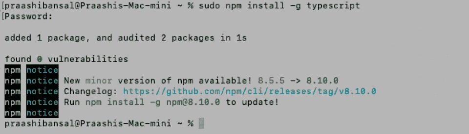

3.使用以下命令检查安装的版本:

```
tsc --v
```


4.将以下路径添加到 path 变量中。

*"C:\Users\ <用户> \AppData\Roaming\npm"*

注意:对于这个备忘单，我们使用的是版本 4.0.2。

5.使用以下命令全局安装“ts 节点”模块:

```
npm install -g ts-node
```

6.根据您需要的平台安装 VS 代码并下载最新版本。安装过程完成后，启动 VS 代码。

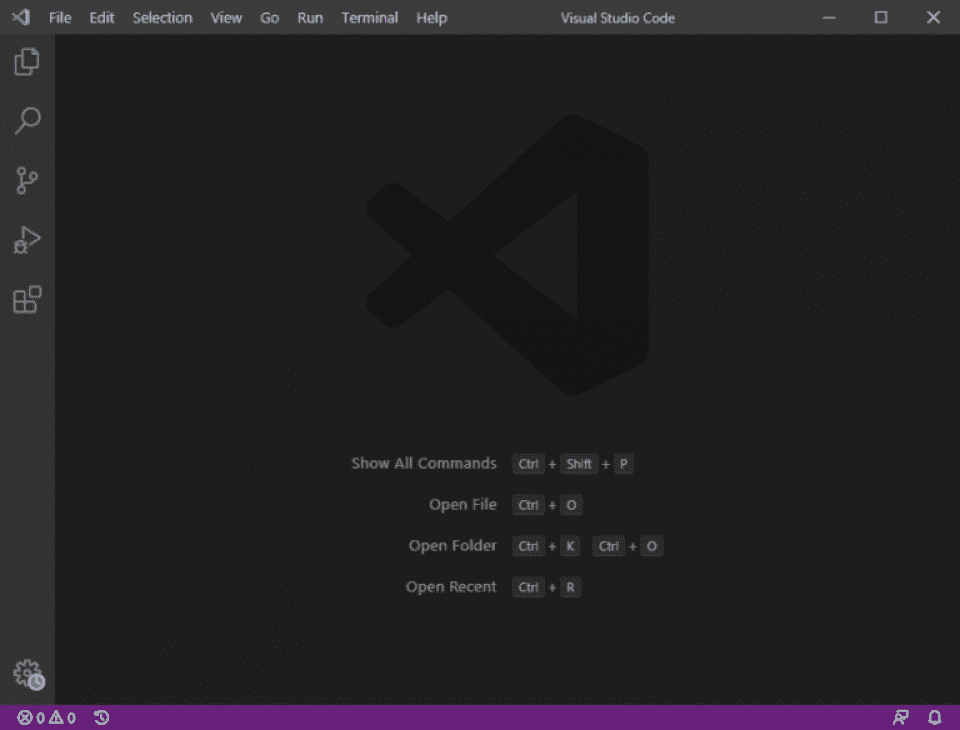

7.要安装 live Server 扩展，请转到“扩展”选项卡，搜索 live Server 并单击“安装”按钮。

都准备好了吗？现在，让我们进入编码。

## **基本打字稿示例**

下面是我们如何创建一个基本的 TypeScript 示例。

1.创建一个文件夹来存储代码，命名为“helloworld”

2.现在，要编写代码，请在 VS 代码编辑器中打开文件夹。之后，创建一个名为“app.ts”的类型脚本文件。

```
let message: string = 'Hello, User!';

console.log(message);
```

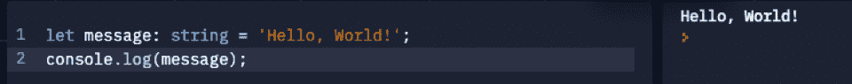

3.使用键盘快捷键“Ctrl+”从 VS 代码启动终端，或者转到 VS 代码上的终端选项卡并选择“新建终端:”

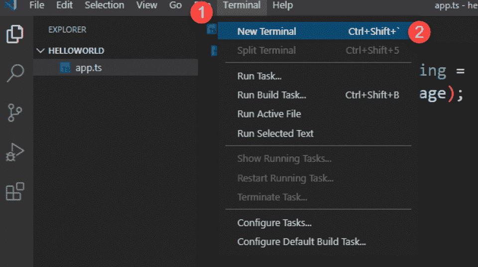

4.现在，在终端上使用以下命令编译“app.ts”文件:

```
tsc app.ts
```

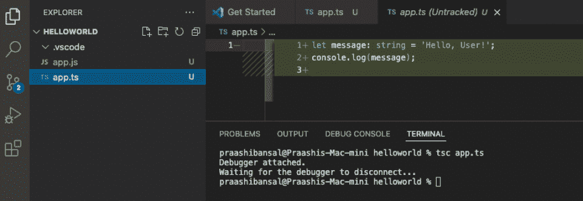

5.“app.js”文件已创建，并列在 helloworld 文件夹下。使用 belo 命令执行 app.js 文件:

```
node app.js
```

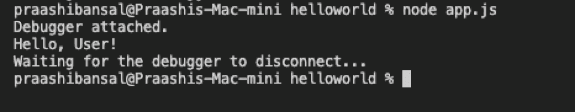

这是您的基本类型脚本示例。现在，让我们看看如何在 web 浏览器中运行 TypeScript 程序！

### 在 web 浏览器中运行 TypeScript 程序。

1.创建 index.html 文件并包含 app.js 文件:

```
<!DOCTYPE html>

<html lang="en">

<head>

<meta charset="UTF-8">

<meta name="viewport" content="width=device-width, initial-scale=1.0">

<title>TypeScript: Hello User!</title>

</head>

<body>

<script src="app.js"></script>

</body>

</html>
```

2.更改 app.ts 代码:

```
let message: string = 'Hello user!';

// create a new heading 1 element

let heading = document.createElement('h1');

heading.textContent = message;

// add the heading the document

document.body.appendChild(heading);
```

3.使用以下代码编译 app.ts 文件:

```
tsc app.ts
```

4.右键单击 index.html 代码并使用实时服务器打开:

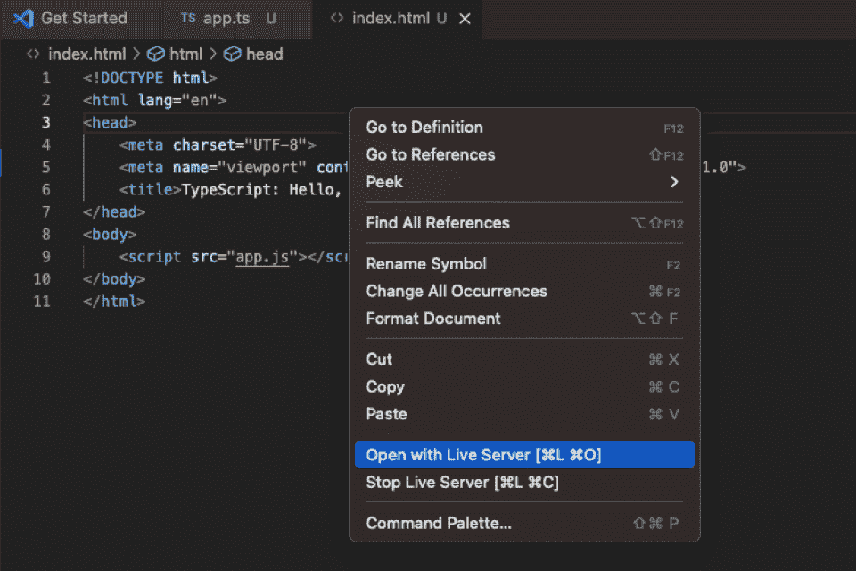

5.以下是输出。

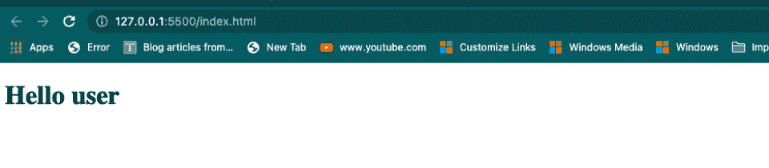

[了解 TypeScript - 2023 版](https://click.linksynergy.com/deeplink?id=jU79Zysihs4&mid=39197&murl=https%3A%2F%2Fwww.udemy.com%2Fcourse%2Funderstanding-typescript%2F)

## **打字稿备忘单**

### **1。基本类型**

类型有助于您引用值的不同属性和功能。该值是指可以赋给变量的任何东西，如数字、字符串、数组、对象和函数。例如，“Sam”指定值是字符串类型，因此将具有字符串的属性。

假设“Sam”值有一个名为 *length* 的属性，该属性将返回该值中存在的字符数。

```
console.log(“Sam”.length); // 5

Code language: JavaScript (javascript)
```

除了字符之外，它还可以有许多方法，如 match()、indexOf()和 toLocaleUpperCase()。

例如:

```
console.log(‘Sam’.toLocaleUpperCase()); // SAM

Code language: JavaScript (javascript)
```

因此，类型是描述值的不同属性和方法的标签，每个值都有一个类型。有两种不同类型的类型脚本类型:

*   **原语类型:**字符串、数字、布尔、空、未定义、符号。
*   **对象类型:**函数、数组、类等。

### **在类型脚本中键入注释**

TypeScript 中的批注显式指定各种标识符的类型。这些标识符包括变量、函数、对象等。

语法:

```
:Type 
```

在标识符名称后使用它。

一旦用某个类型注释了标识符，就只能用该类型来使用它。如果将该标识符用作不同的类型，TypeScript 编译器将显示错误。

#### **变量和常数**

您可以使用以下语法来指定变量和常量的注释类型。

```
let variableName: type;

let variableName: type = value;

const constantName: type = value;

The following example specifies the number annotation for a variable:

let counter: number;

Code language: JavaScript (javascript)
```

请记住，您只能为计数器变量分配一个数字:

```
counter = 1;
```

如果尝试将字符串赋给计数器变量，可能会遇到以下错误:

```
let counter: number;

counter = 'Hello'; // compile error
```

两种类型都可以使用以下语法来注释和初始化变量:

```
let counter: number = 1;
```

#### **数组**

您可以像注释变量和常量一样注释数组类型，并添加方括号作为后缀。

```
:type[]

let arrayName: type[];

Code language: JavaScript (javascript)
```

下一个示例帮助您声明一个字符串数组:

```
let names: string[] = ['Jolly', 'Jam', 'Pam', 'Dam', 'Sam'];
```

#### **物体**

使用注释来定义对象的类型。

```
let person: {

name: string;

age: number

};

person = {

name: 'John',

age: 25

}; // valid
```

这里，我们创建了一个具有两个属性的对象“person ”:姓名(字符串)和年龄(数字)

#### **函数参数&返回类型**

这里我们将讨论带有函数参数和返回类型的注释:

```
let greeting : (name: string) => string;
```

对于返回类型，分配一个只接受和返回指定变量的函数。

```
greeting = function (name: string) {

return `Hi ${name}`;

};
```

在下面的代码中，我们分配给“greeting”的函数与函数类型不匹配。因此，它会导致错误。

```
greeting = function () {

console.log('Hello');

};
```

### **打字稿号**

要声明具有浮点值的变量，可以使用以下语法:

```
let price: number;
```

您也可以将变量初始化为一个数字:

```
let price = 9.95;
```

像任何其他语言一样，TypeScript 也支持十进制、十六进制、二进制和八进制的数字文本。

#### **十进制数字**

```
let counter: number = 0;

let x: number = 150, 

y: number = 240;
```

#### **二进制数**

```
let bin = 0b100;

let anotherBin: number = 0B010;
```

0b 或 0B 后使用 0 或 1 必须是 0 或 1。

#### **十六进制数字**

它们以零开始，后面是小写或大写字母 x(0x 或 0X)。0x 后面的数字应该在范围内(0123456789ABCDEF)。

例如:

```
let hexadecimal: number = 0XA;

Code language: JavaScript (javascript)
```

#### **大整数**

对于大整数，可以表示大于 253 的整数。您必须在大整数文字的末尾指定“n”字符。

例如:

```
let big: bigint = 9007199254740991n;
```

### **打字字符串**

我们可以利用双引号(")或单引号(')来表示字符串文字。

```
let firstName: string = 'Linda';

let title: string = "Web Developer";

Code language: JavaScript (javascript)
```

为了表示字符，TypeScript 使用了反斜杠(')。利用模板字符串，我们可以创建多行字符串。

以下示例显示如何使用反勾号(')创建多行字符串。

```
let description = `Welcome to Hackr.io

Get tutorials you need 

and master`;

Code language: JavaScript (javascript)
```

要将变量合并到字符串中，您需要利用字符串。

例如:

```
let firstName: string = `Sam`;

let title: string = `Content Writer`;

let profile: string = `I'm ${firstName}. 

I'm a ${title}`;

console.log(profile);
```

### **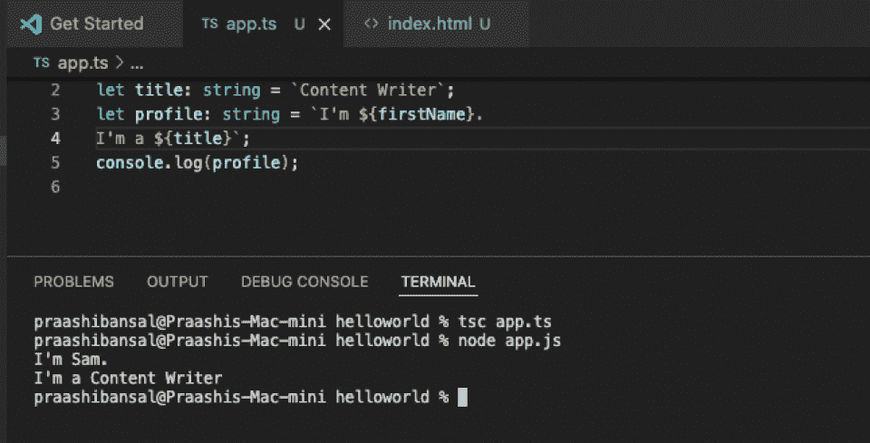**

### **打字稿布尔型**

TypeScript boolean 是一种基本类型，它允许使用两个值:true 和 false。

例如:

```
let pending: boolean;

pending = true;

// after a while

// ..

pending = false;

Code language: JavaScript (javascript)
```

布尔类型的字母 B 是大写的，这使它不同于布尔类型。我们的建议？避免使用布尔类型。

例如:

```
let pending: boolean;

pending = true;

// after a while

// ..

pending = false;

Code language: JavaScript (javascript)
```

JavaScript 带有一个布尔类型，我们称之为非原始装箱对象。布尔类型不同于布尔类型，因为前者有大写的 b。

### **类型脚本对象类型**

TypeScript 对象类型表示所有基元类型值。

TypeScript 中的基元类型:

*   number
*   bigint
*   string
*   boolean
*   null
*   未定义符号
*   下面的示例指定如何声明保存对象的变量。

例如:

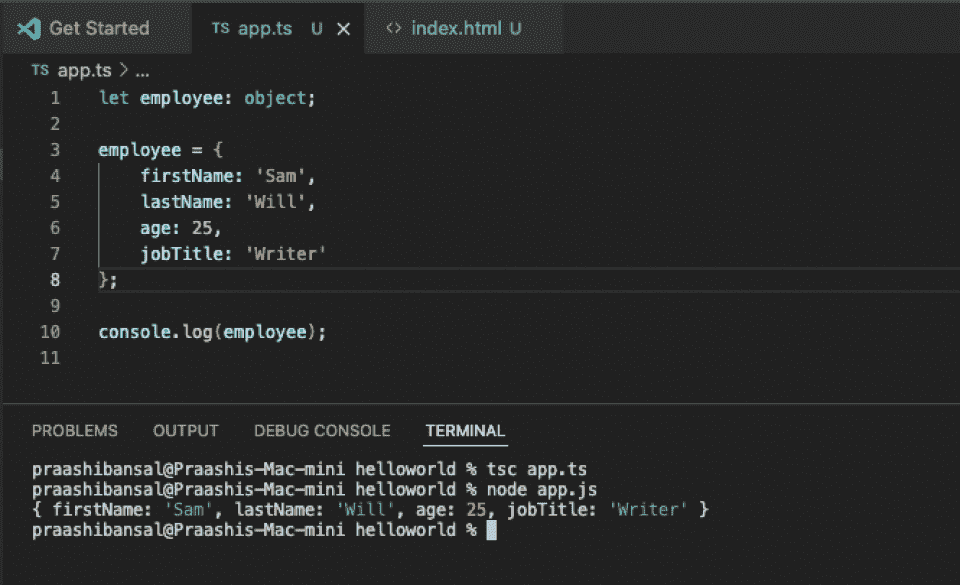

```
let employee: object;

employee = {

firstName: 'Sam',

lastName: 'Will',

age: 25,

jobTitle: 'Writer'

};

console.log(employee);
```

如果您想将一个基本值重新分配给 employee 对象，您将会收到一个错误:

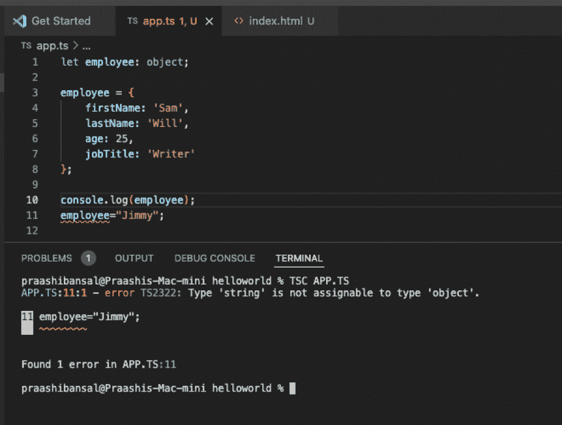

```
employee = "Jimmy";

Code language: JavaScript (javascript)
```

这里的“雇员”是一个具有固定属性集的对象类型。如果访问“雇员”范围之外的属性，可能会遇到错误

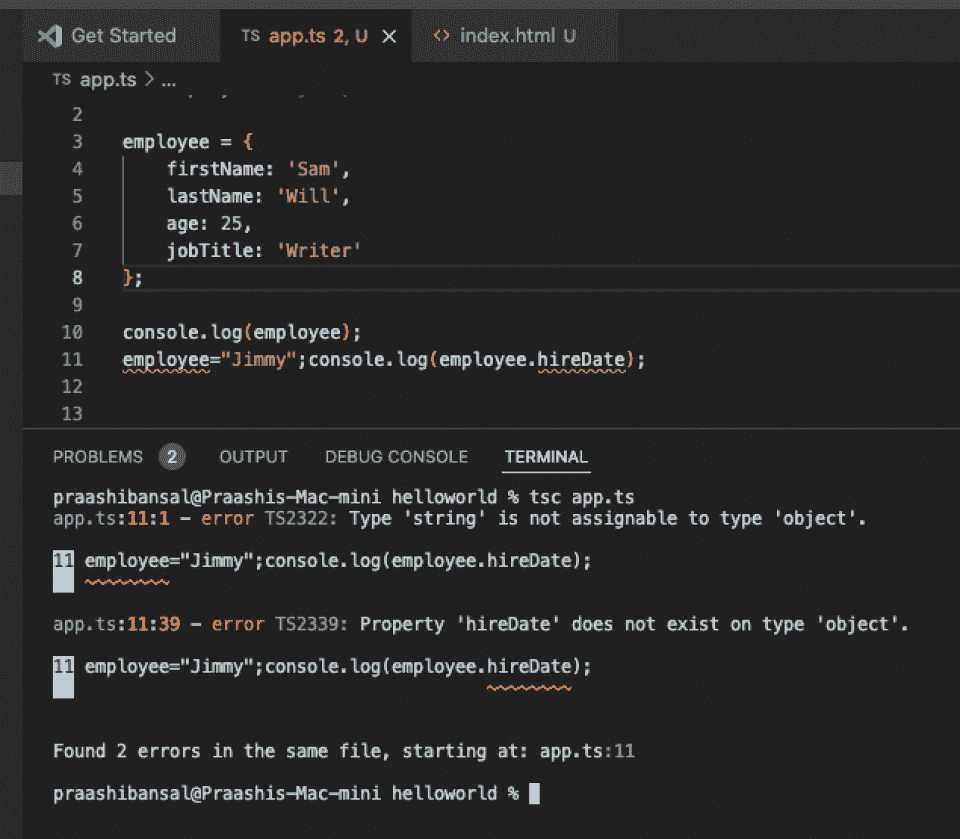

```
console.log(employee.hireDate);

Code language: CSS (css)
```

以下语法允许您显式定义 employee 对象属性:

将 employee 对象分配给文字对象:

```
let employee: {

firstName: string;

lastName: string;

age: number;

jobTitle: string;

};
```

或者，您可以在同一语句中使用组合语法:

```
employee = {

firstName: ‘Jimmy’,

lastName: ‘Will’,

age: 30,

jobTitle: 'Writer'

};
```

**物体对物体**

```
let employee: {

firstName: string;

lastName: string;

age: number;

jobTitle: string;

} = {

firstName: ‘Jimmy’,

lastName: ‘Will’,

age: 30,

jobTitle: 'Writer'

};
```

#### TypeScript 支持另一种名为 Object 的类型，其大写字母为 O。

我们知道对象类型表示所有非原始值。同时， *O* 对象类型代表所有对象的功能。

**空型{}**

#### 类似于对象类型，TypeScript 具有由空类型{}指定的空类型。它描述一个没有属性的对象。如果您尝试使用这样的对象访问任何属性，将会收到以下编译时错误:

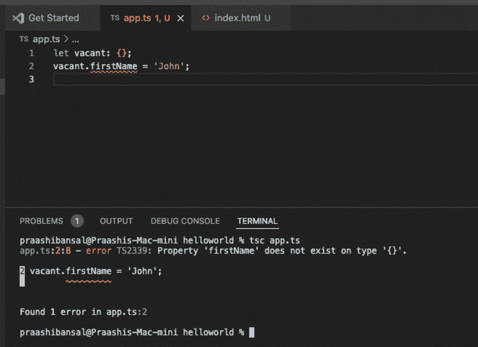

```
let vacant: {};

vacant.firstName = 'John';
```

但是，您可以轻松地访问对象类型上声明的所有属性和方法。例如:

**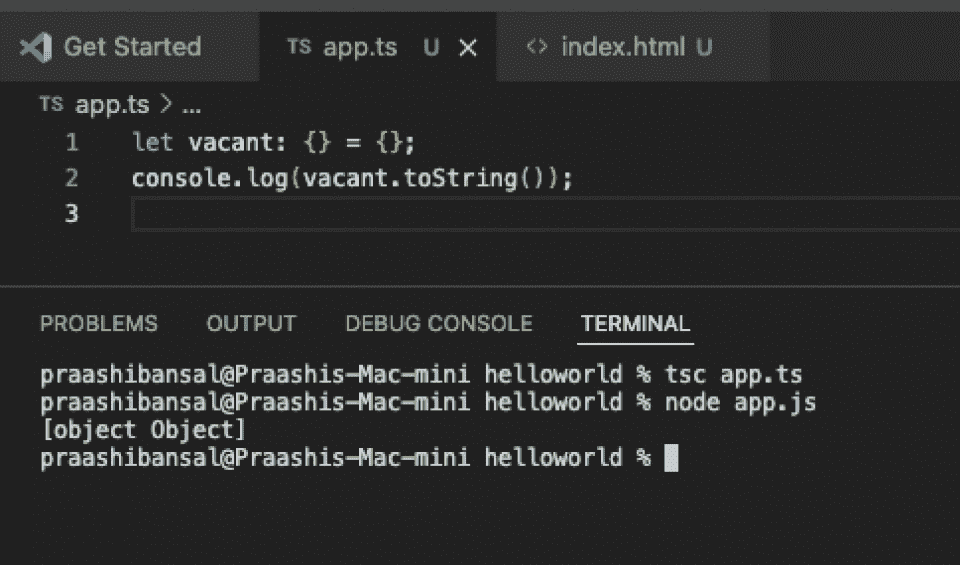**

```
let vacant: {} = {};

console.log(vacant.toString());
```

### **TypeScript 数组类型**

### TypeScript 数组被称为数据的有序列表。

以下语法声明了一个具有特定类型值的数组:

例如，您可以使用以下语法来声明字符串数组:

```
let arrayName: type[];
```

此外，您可以向上述数组中添加多个字符串值:

```
let skills: string[];
```

或者可以使用 push()方法向现有数组中输入新值:

```
skills[0] = "Game";

skills[1] = "Study";
```

在一行中定义一个数组:

```
skills.push('Science');
```

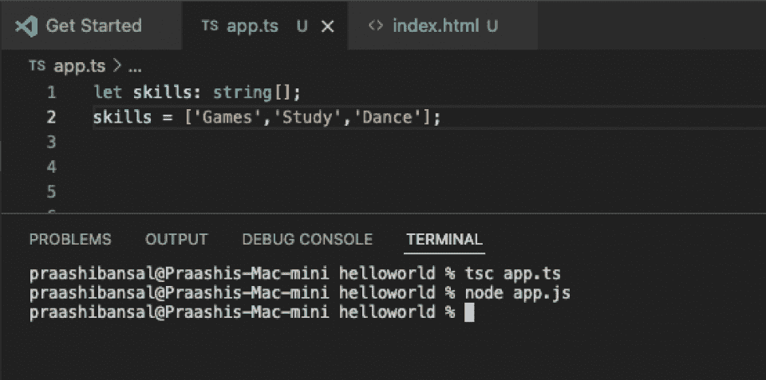

```
let skills = ['Games','Study','Dance'];
```

一旦定义了特定类型的数组，就不能向数组中添加任何不兼容的值，否则会收到一条错误消息:

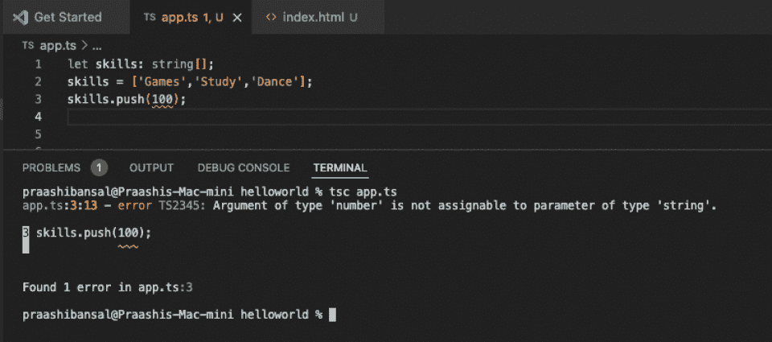

```
skills.push(100);
```

现在，让我们提取数组的第一个元素:

发生类型推断。

```
let skill = skills[0];

console.log(typeof(skill));
```

我们已经提取了“技能”数组的第一个元素。后来，我们把它赋给了变量‘skill’。

**存储混合类型的值**

#### 现在让我们讨论如何将不同类型的值添加到数组中。

上面的数组是混合类型的数组，即 string | number:

```
let scores = ['Programming', 5, 'Software Design', 4];
```

**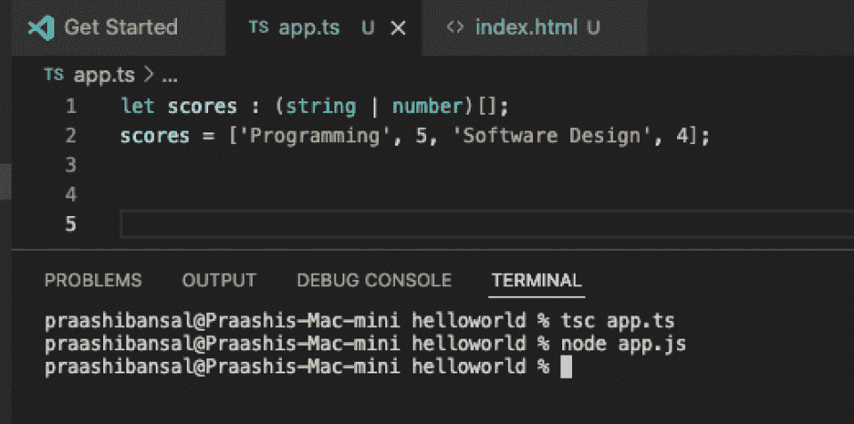**

```
let scores : (string | number)[];

scores = ['Programming', 5, 'Software Design', 4];
```

### **打字脚本元组**

### 元组的工作方式类似于数组，但有一些额外的考虑。一个元组有固定数量的元素，没有一个元素是相同的。例如，您可以使用元组将值指定为一对字符串和一个数字:

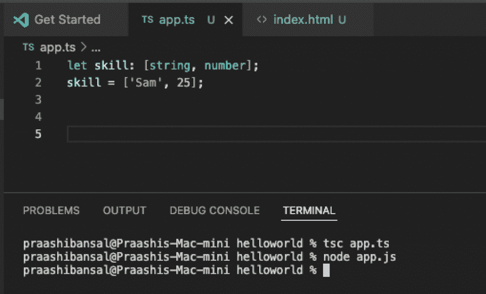

```
let skill: [string, number];

skill = [‘Sam’, 25];
```

始终注意存储值的顺序。如果您错误地更改了顺序，您将得到一个错误:

**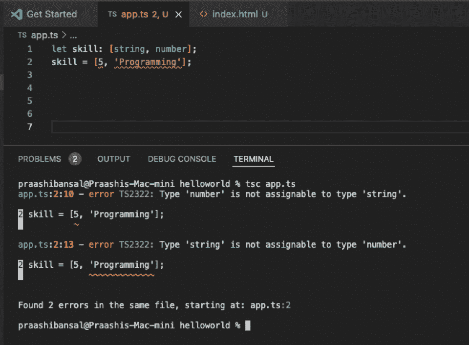**

```
let skill: [string, number];

skill = [5, 'Programming'];
```

### **类型脚本枚举**

### 枚举(枚举类型)是指一组命名的常数值。enum 关键字用于将 enum 定义为枚举名称的前缀。然后，为枚举定义常数值。

下面是语法:

在这里，常数 1、常数 2 等。是枚举成员。

```
enum name {constant1, constant2, ...};
```

示例:

在此示例中，枚举名称为 Month，常量值为 Jan、Feb、Mar 等。

```
enum Month { Jan,Feb,Mar,Apr,May,Jun,Jul,Aug,Sep, Oct,Nov,Dec};
```

现在，我们将使用月份枚举作为参数来声明一个函数。

**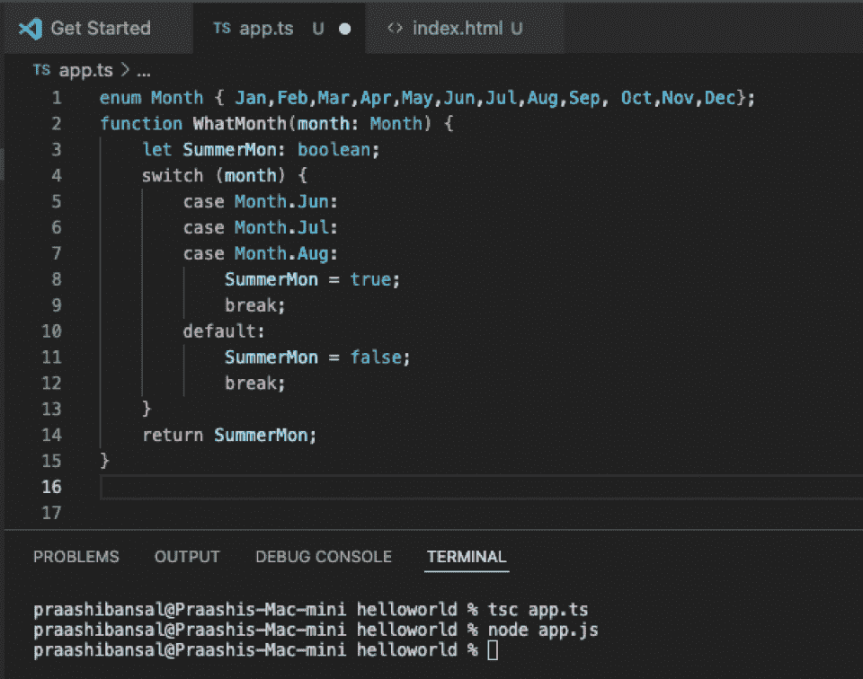**

```
function WhatMonth(month: Month) {

let SummerMon: boolean;

switch (month) {

case Month.Jun:

case Month.Jul:

case Month.Aug:

SummerMon = true;

break;

default:

SummerMon = false;

break;

}

return SummerMon;

}

console.log(SummerMon(Month.Jun)); 
```

### **打印任何类型**

### 在某些情况下，您可能需要在不知道变量类型的情况下将值存储在变量中。第三方 API 或用户输入可以提供该值。在这种情况下，可能需要进行类型检查，并且该值可以通过编译时检查。

为此，我们使用“any”类型。

“任意”类型允许您为任意类型变量赋值。

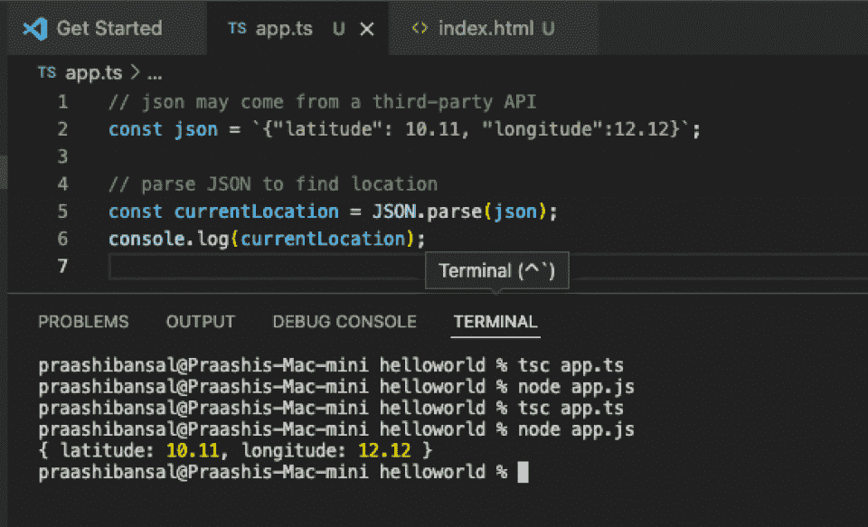

```
// json may come from a third-party API

const json = `{"latitude": 10.11, "longitude":12.12}`;

// parse JSON to find location

const currentLocation = JSON.parse(json);

console.log(currentLocation);
```

在本例中，JSON.parse()函数返回一个对象，我们将 currentLocation 变量赋给该对象。但是，当使用 currentLocation 访问对象属性时，TypeScript 不会执行任何检查:

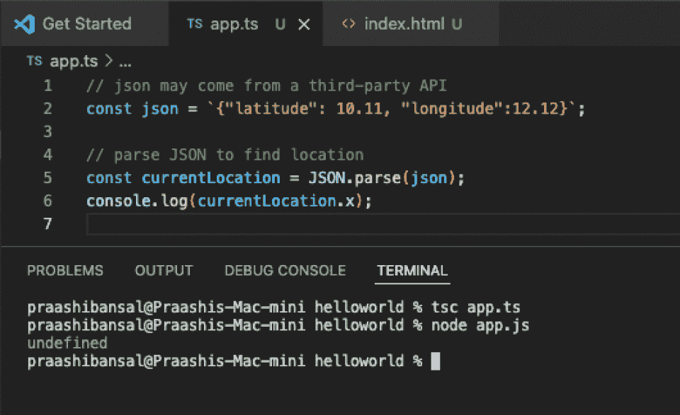

```
console.log(currentLocation.x);
```

编译时不会有问题。

如果您声明了一个变量而没有提到类型，TypeScript 会将其假定为任何类型，这就是所谓的类型推断。这意味着 TypeScript 将猜测变量类型。

**打字稿作废类型**

### void 类型指定没有特定的类型。它在某种程度上与“任何”类型相反。

例如:

当任何函数不要求你返回值时，使用 void 类型。这将提高代码的清晰度，并确保类型安全。此外，不需要导航整个函数体来检查它是否返回任何东西。

```
function log(message): void {

console.log(message);

}
```

假设你对一个变量使用 void 类型，并赋值“undefined”这样的空类型是没有用的。例如:

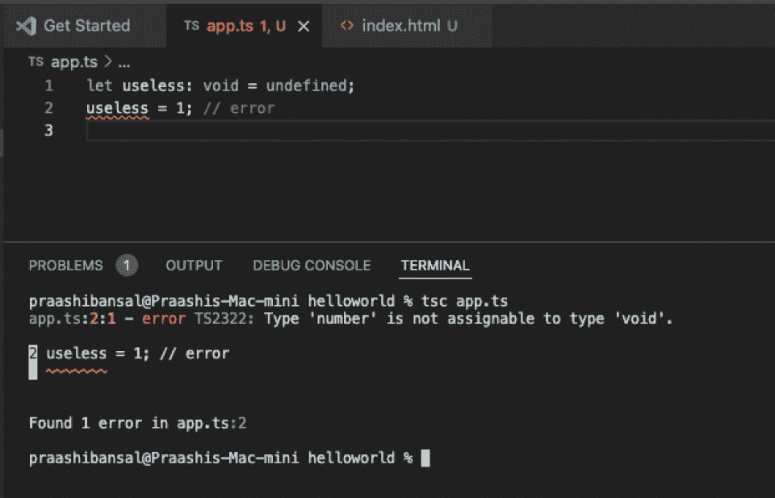

```
let useless: void = undefined;

useless = 1; // error
```

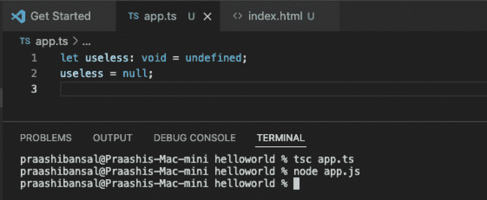

```
If the --strictNullChecks flag is not specified, you can assign the useless to null:

useless = null; 
```

**打字稿从不打字**

### never 类型意味着不包含任何值，因此不能将任何值赋给 never 类型的变量。当函数的返回类型抛出错误时，使用 never 类型。

例如:

表达式包含无限循环的函数具有 never 类型。

```
function raiseError(message: string): never {

throw new Error(message);

}

In this next example, the return type of the never type.

function reject() { 

return raiseError('Rejected');

}
```

例如:

**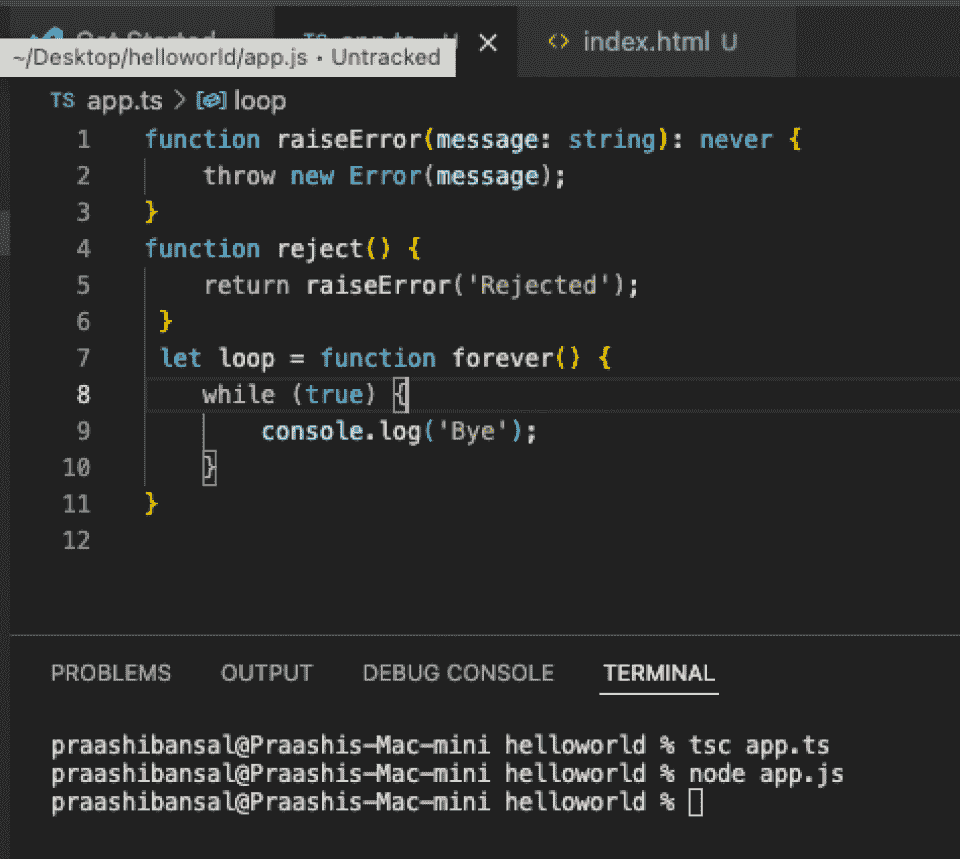**

```
let loop = function forever() {

while (true) {

console.log(‘Bye’);

}

}
```

### **打印联合类型**

### 很多时候，您可能会遇到需要数字或字符串类型参数的函数。

例如:

我们尚未在函数“add()”中指定参数的类型。因此，如果参数是数字，add()执行加法。如果它们是字符串，add()连接这些字符串。

```
function add(x: any, y: any) {

if (typeof x === 'number' && typeof y === 'number') {

return x+y;

}

if (typeof x === 'string' && typeof y === 'string') {

return x.concat(y);

}

throw new Error('Parameters must be numbers or strings');

}
```

但是，如果参数既不是数字也不是字符串，add()将抛出一个错误。

这就是 TypeScript 联合类型发挥作用的地方。使用联合类型，您可以将各种类型合并为一个。

```
add(true, false);
```

例如，以下变量属于数字或字符串类型:

联合类型描述可以是几种类型之一的值。

```
let result: number | string;

result = 20; // OK

result = 'Bye'; // also OK

result = true; // a boolean value, not OK
```

**TypeScript 类型别名**

### 类型别名允许您为现有类型创建新名称。但是，现有类型应该是有效的。

下面让我们来看一个别名类型的例子。

```
type alias = existingType;
```

这里，我们将类型字符串赋给 chars。

**TypeScript 字符串文字类型**

```
type chars = string;

let message: chars; // same as string type
```

### 在字符串类型的帮助下，您可以定义一个只接受一个指定字符串的类型。

在下面的代码中，我们定义了一个字符串文字类型，它接受一个文字字符串“click:”

这里，click 是一个字符串类型，只接受字符串“click”

```
let click: 'click';
```

如果您将“单击”指定给单击，它将是有效的:

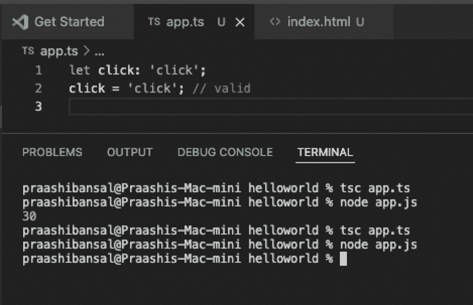

```
click = 'click'; // valid
```

如果将另一个字符串文字“dbclick”赋给 click，它会给出一个编译时错误:


```
click = 'dblclick'; 
```

当您希望在变量中限制一个可能的字符串值时，字符串文字类型就派上了用场。

**打字稿类型推断**

### 类型推断描述了 TypeScript 在没有显式批注的情况下推断类型的位置和方式。一般来说，我们使用注释来明确定义变量的类型。

例如:

根据上面的代码，TypeScript 将计数器类型视为数字。

```
let counter: number;
```

例如:

此外，无论何时设置任何函数的参数值，TypeScript 都将其类型视为默认值类型。

```
let counter = 0;

Or 

let counter: number = 0;
```

例如:

在此示例中，TypeScript 推断 type max 参数类型是一个数字。

```
function setCounter(max=100) {

// ...

}
```

**2。控制流语句**

## 如果..其他

### if 语句根据条件执行一段代码。在下面的语法中，“if”中的主体仅在给定条件的计算结果为 true 时执行:

示例:

```
if(condition) {

// if-statement

}
```

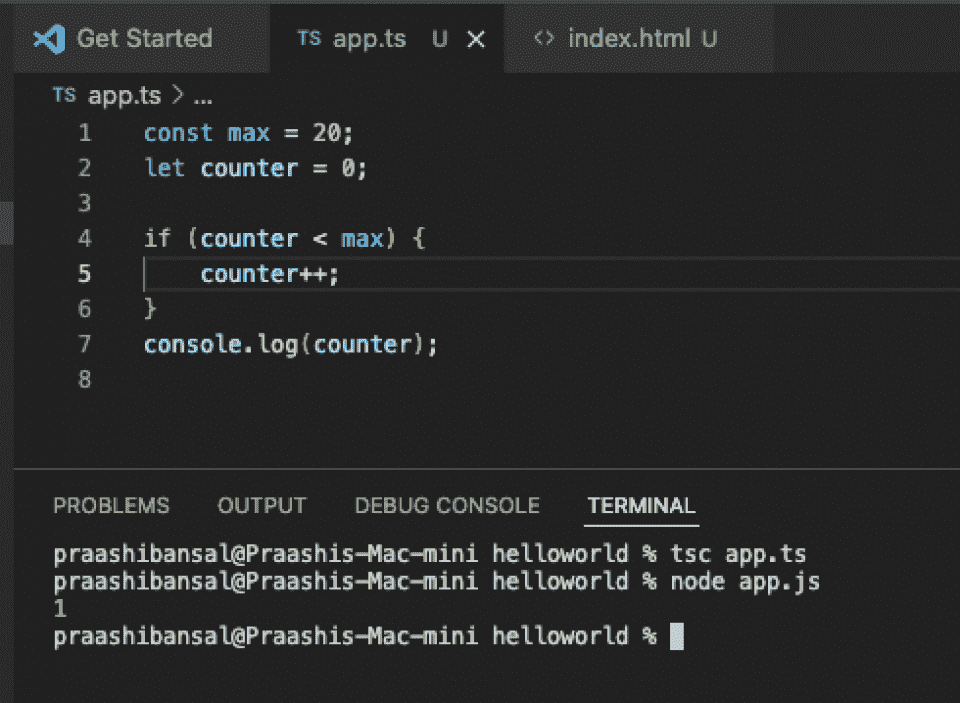

```
const max = 20;

let counter = 0;

if (counter < max) {

counter++;

}

console.log(counter); 
```

在上面的代码中，只有当 counter 的值小于 max 时，它的值才会增加。

**键入 if…else 语句**

### 如果“If”中的条件为 false，则控制移至执行“else”中的主体。

例如:

```
if(condition) {

// if-statements

} else {

// else statements;

}
```

**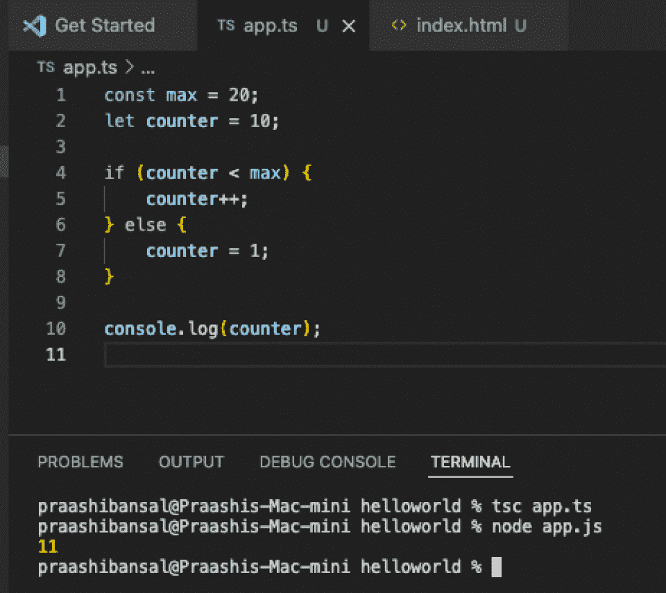**

```
const max = 20;

let counter = 10;

if (counter < max) {

counter++;

} else {

counter = 1;

}

console.log(counter);
```

### **三元运算符？:**

### 三元运算符(？:)用于使代码更短。是简单条件下 if-else 的替代。

例如:

**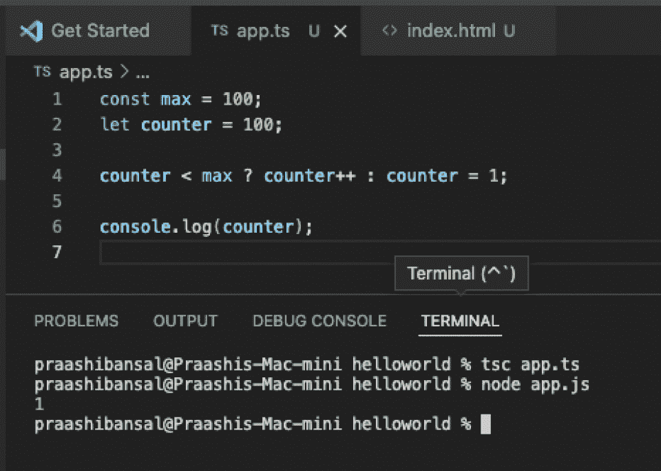**

```
const max = 100;

let counter = 100;

counter < max ? counter++ : counter = 1;

console.log(counter);
```

### **键入 if…else if…else 语句**

### 如果...否则如果...当您想要检查多个条件时，else 语句是理想的。

示例:

**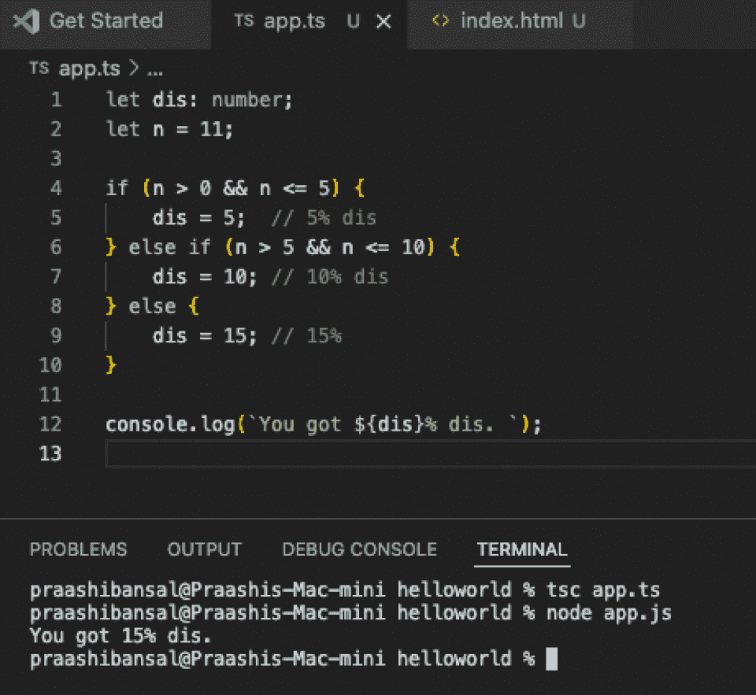**

```
let dis: number;

let n = 11;

if (n > 0 && n <= 5) {

dis = 5; // 5% dis

} else if (n > 5 && n <= 10) {

dis = 10; // 10% dis 

} else {

dis = 15; // 15%

}

console.log(`You got ${dis}% dis. `);
```

### **打字开关盒**

### 当您希望根据多个值检查 expression 的值并对找到的匹配项执行代码时，switch case 非常有用。

语法:

示例:

```
switch ( expression ) {

case value1:

// statement 1

break;

case value2:

// statement 2

break;

case valueN:

// statement N

break;

default: 

// 

break;

}
```

**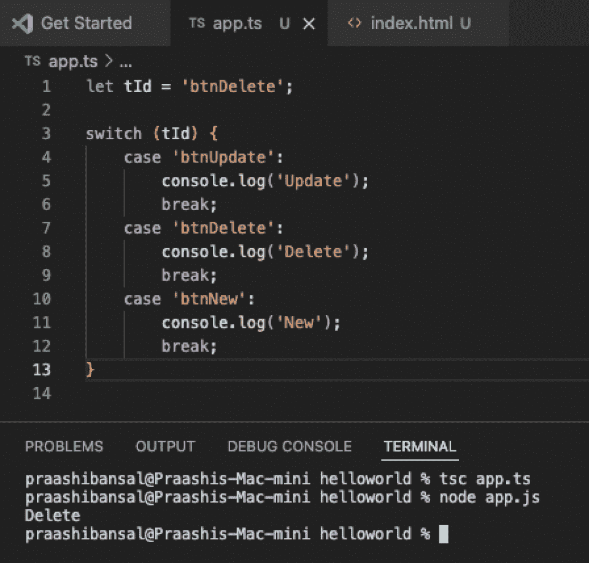**

```
let tId = 'btnDelete';

switch (tId) {

case 'btnUpdate':

console.log('Update');

break;

case 'btnDelete':

console.log('Delete');

break;

case 'btnNew':

console.log('New');

break;

}
```

### **为**打字稿

### 下面是使用“for”循环语句的语法。

在 for 循环中，有三个可选表达式，用分号(；)并用括号括起来。

```
for(initialization; condition; expression) {

// statement

}
```

初始化

*   情况
*   表示
*   这三个表达式都是可选的，这意味着您可以使用 for 循环语句:

*例如:*

```
for(;;) {

// do something

}
```

**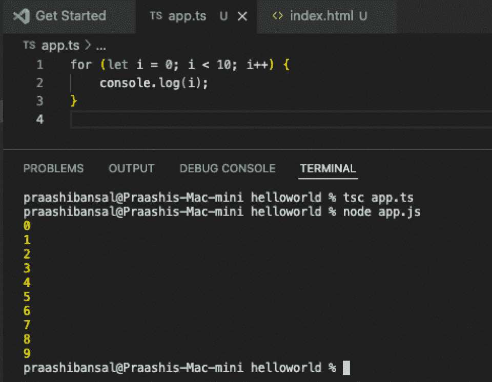**

```
for (let i = 0; i < 10; i++) {

console.log(i);

}
```

### **打字稿，而**

### 使用 while 语句，您可以创建一个循环，只要条件为真，该循环就会执行一段代码。

下面是 while 循环的语法。

要根据另一个条件不成熟地中断循环，需要使用 break 语句:

```
while(condition) {

// do something

}
```

例如:

```
while(condition) {

// do something

// ...

if(anotherCondition) 

break;

}
```

**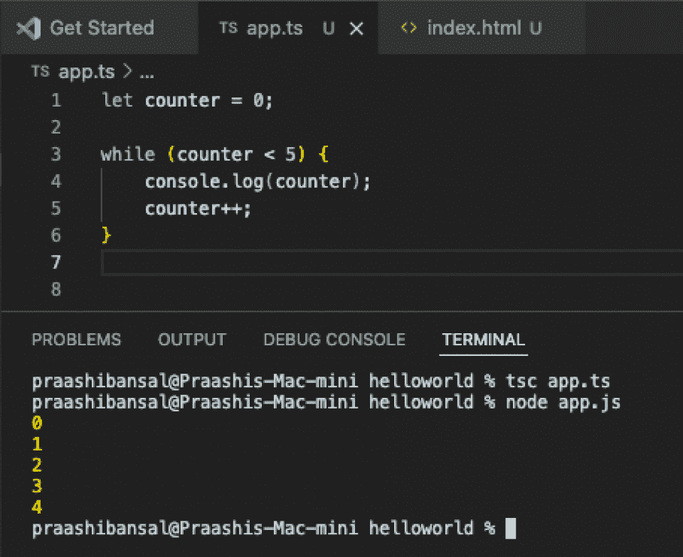**

```
let counter = 0;

while (counter < 5) {

console.log(counter);

counter++;

}
```

### 打字稿做什么..而

### 下面显示了 do 的语法...while 语句。

这将运行代码块，直到条件评估为 false。该语句总是至少执行一次循环体，因为条件将在代码末尾执行。

```
do {

// do something

} while(condition);
```

例如:

**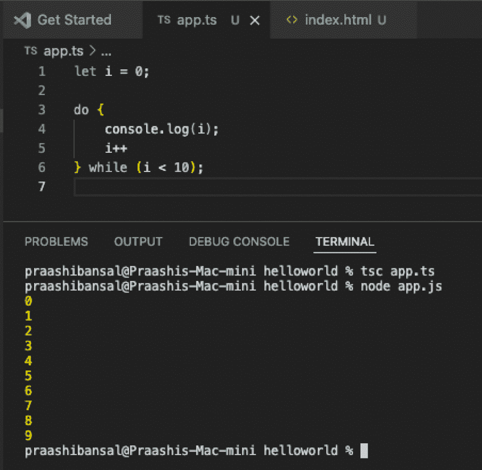**

```
let i = 0;

do {

console.log(i);

i++

} while (i < 10);
```

### **打字稿中断**

### break 语句用于终止任何循环，并将程序流传递给下一个立即语句。for、while 和 do...while 语句支持使用 break 语句。

例如:

**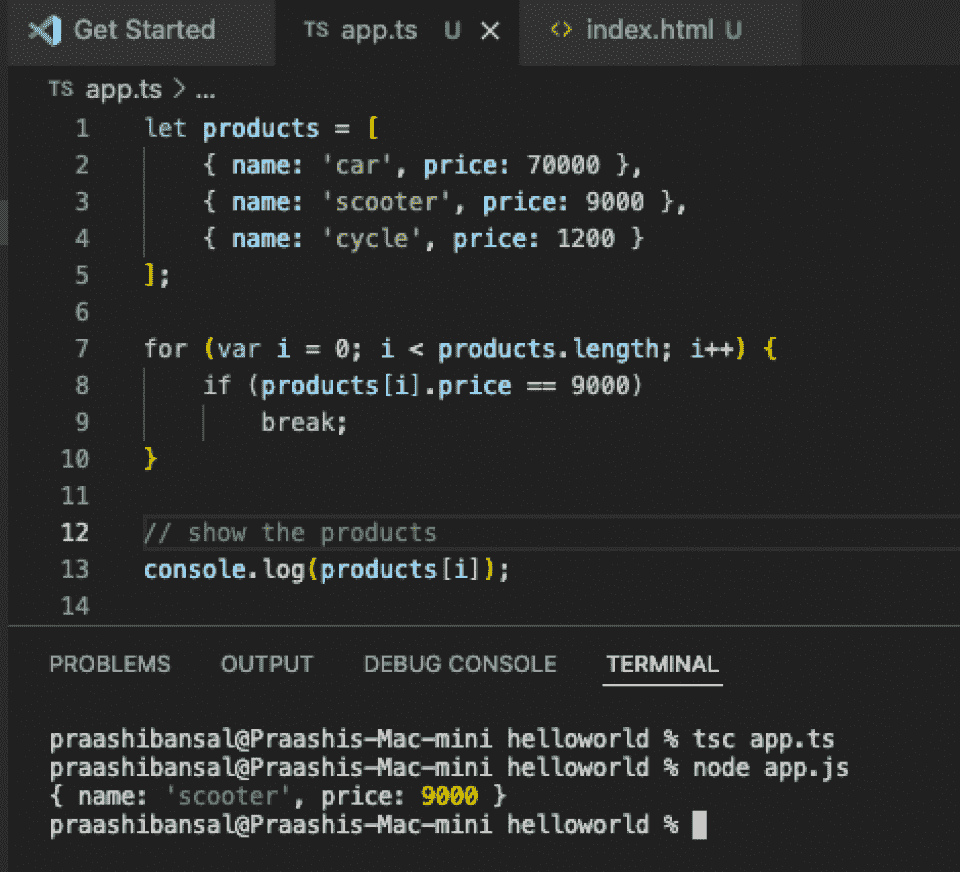**

```
let products = [

{ name: ‘car’, price: 70000 },

{ name: ‘scooter’, price: 9000 },

{ name: ‘cycle’, price: 1200 }

];

for (var i = 0; i < products.length; i++) {

if (products[i].price == 9000)

break;

}

// show the products

console.log(products[i]);
```

### **打字稿继续**

### 此语句有助于控制循环，如 for 循环、while 循环或 do 循环...while 循环。它跳到循环的末尾，继续下一次迭代。

例如，您可以在 For 循环中应用 continue 语句:

**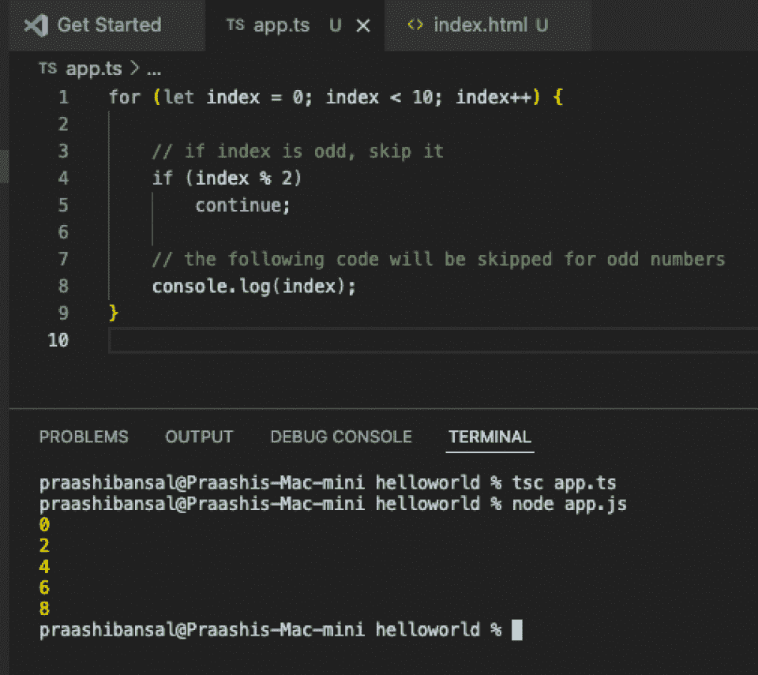**

```
for (let index = 0; index < 10; index++) {

// if index is odd, skip it

if (index % 2)

continue;

// the following code will be skipped for odd numbers

console.log(index);

}
```

## **3。功能**

## TypeScript 函数是执行特定任务的任何代码块。若要声明函数，请使用关键字“function”

您还可以在函数的函数参数返回值中使用类型批注。

```
function name(parameter: type, parameter:type,...): returnType {

// do something

}
```

例如:

在上面的例子中，add()函数将接受两个 number 类型的参数。

```
function add(a: number, b: number): number {

return a + b;

}
```

每当您在程序中调用 add()函数时，TypeScript 编译器都会验证每个参数是否为数字。如果您传递任何其他类型的衣服号码，它会抛出一个错误:

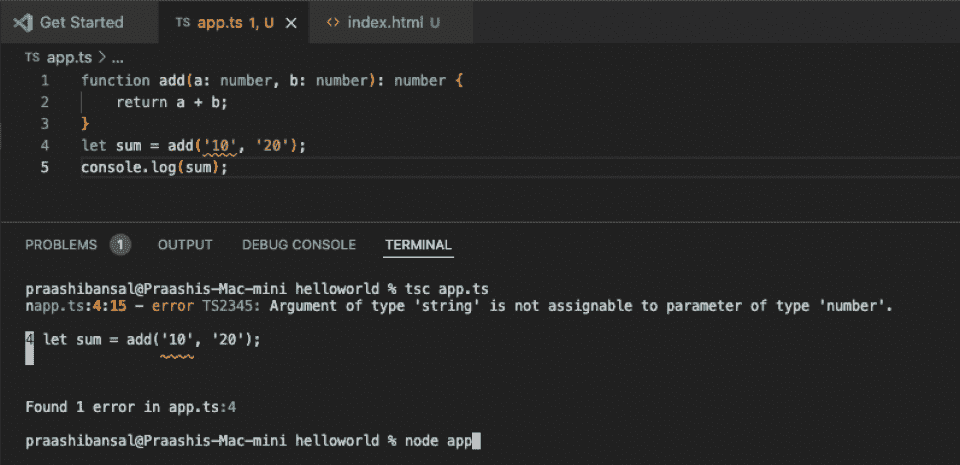

```
let sum = add('10', '20');
```

返回类型由括号后面的:号表示。在这种情况下，add()函数将返回数字类型的值。编译器将检查每个返回语句，以确保返回值与函数的返回类型(如果存在)兼容。

如果函数返回 null，则可以指定 void 类型。如关键字 void 所示，该函数不返回值。

例如:

在下面的示例中，TypeScript 编译器尝试将 add()函数的返回类型推断为 number 类型，这是所期望的。

```
function echo(message: string): void {

console.log(message.toUpperCase());

}
```

**可选参数**

```
function add(a: number, b: number) {

return a + b;

}
```

### 与 JavaScript 不同，在 TypeScript 中，编译器将检查每个函数调用，如果实参的数量与函数中列出的参数数量不同，将会产生错误。此外，如果参数的类型和函数参数的类型不兼容，将会返回错误。

您必须注释可选参数，以指示编译器在您丢失任何参数时不产生错误，因为编译器会仔细检查传递的参数。使用？符号，使函数参数成为可选的。

例如:

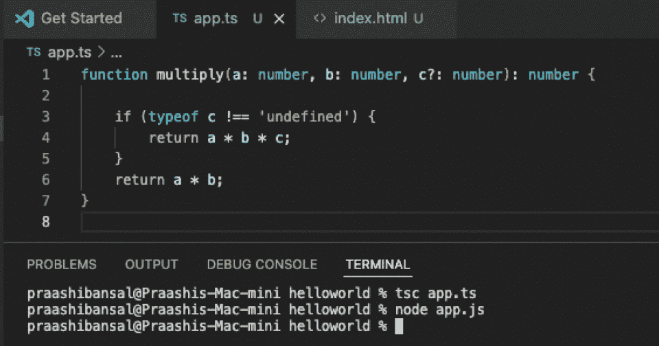

```
function multiply(a: number, b: number, c?: number): number {

if (typeof c !== 'undefined') {

return a * b * c;

}

return a * b;

}
```

你需要使用？在 c 参数之后。然后，您需要使用表达式 typeof c！检查参数是否传递给了函数！== '未定义'。

可选参数列表后面是必需参数列表。

例如，如果您将 b 参数设为可选，而 c 参数设为必需，您将得到一个错误:

**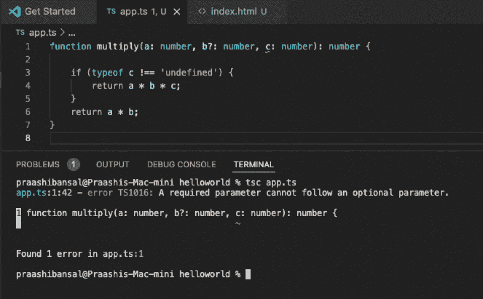**

```
function multiply(a: number, b?: number, c: number): number {

if (typeof c !== 'undefined') {

return a * b * c;

}

return a * b;

}
```

### **默认参数**

### 自 ES2015(或 ES6)以来，JavaScript 支持默认参数，语法如下:

调用函数时，如果没有传递任何参数或传递未定义的参数，它将采用默认的初始化值。

```
function name(parameter1=defaultValue1,...) {

// do something

}
```

例如:

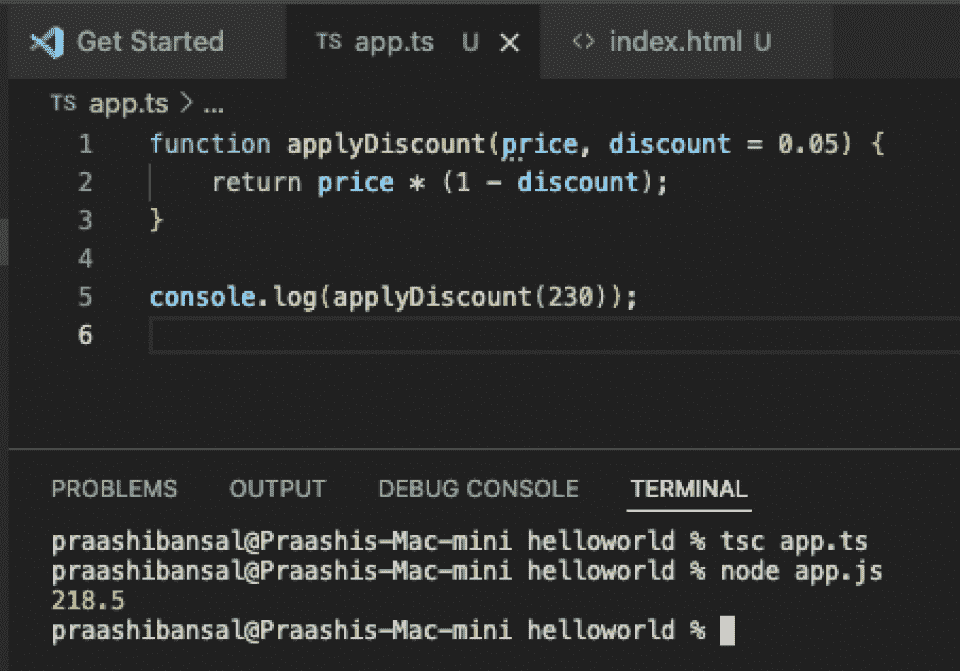

```
function applyDiscount(price, discount = 0.05) {

return price * (1 - discount);

}

console.log(applyDiscount(230)); 
```

这里，折扣参数是默认参数。如果在调用 applyDiscount()函数时没有传递 Discount 参数，它将使用默认值 0.05。

如果在函数类型定义中传递默认参数，将会出现错误。

**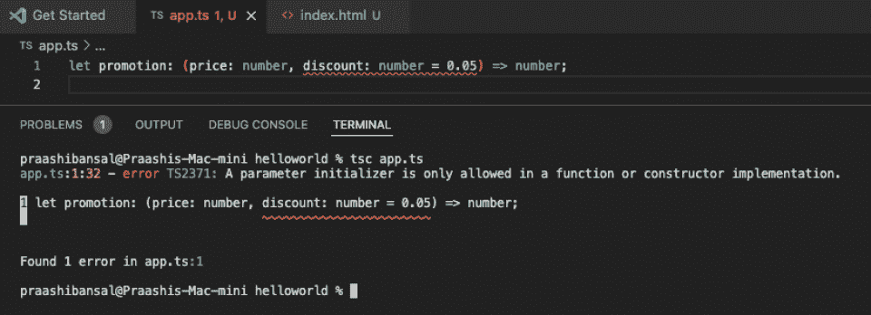**

```
let promotion: (price: number, discount: number = 0.05) => number.
```

### **函数重载**

### 使用函数重载，可以创建函数的参数类型和结果类型之间的关系。

例如:

第一个函数返回两个数的和，而后一个函数连接两个字符串。

```
function addNumbers(a: number, b: number): number {

return a + b;

}

function addStrings(a: string, b: string): string {

return a + b;

}
```

4.班级

## **打字稿类**

### 构造函数和原型继承允许你创建一个“类”

例如，我们使用构造函数创建了一个具有三个属性的 Person 类:

要访问一个人的详细信息，请定义一个原型方法:

```
function Person( firstName, lastName) {

this.firstName = firstName;

this.lastName = lastName;

}
```

然后，为“person”类创建一个对象并使用它。

```
Person.prototype.getFullName = function () {

return `${this.firstName} ${this.lastName}`;

}
```

但是，在 ES6 中，您可以定义一个类来创建构造函数和原型继承:

```
let person = new Person('Jimmy','Dwell');

console.log(person.getFullName());
```

这里，我们已经在类内部定义了构造函数。现在，让我们向同一个类添加 getFullName()方法

```
class Person {

firstName;

lastName;

constructor( firstName, lastName) {

this.firstName = firstName;

this.lastName = lastName;

}

}
```

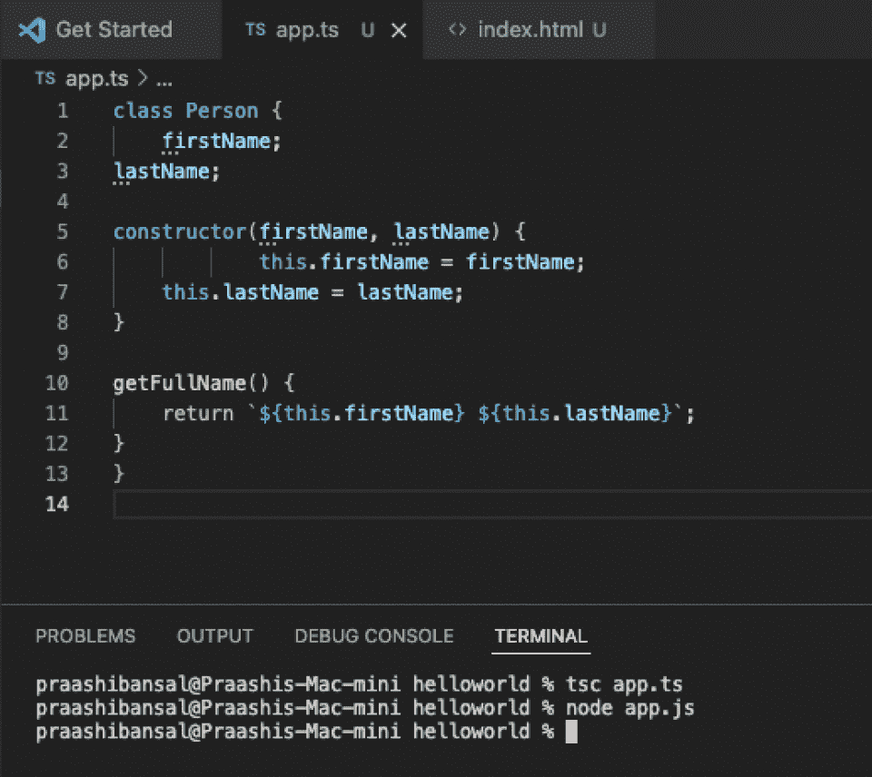

```
class Person {

firstName;

lastName;

constructor(firstName, lastName) {

this.firstName = firstName;

this.lastName = lastName;

}

getFullName() {

return `${this.firstName} ${this.lastName}`;

}

}
```

Person 构造函数的功能与“Person”类相同:

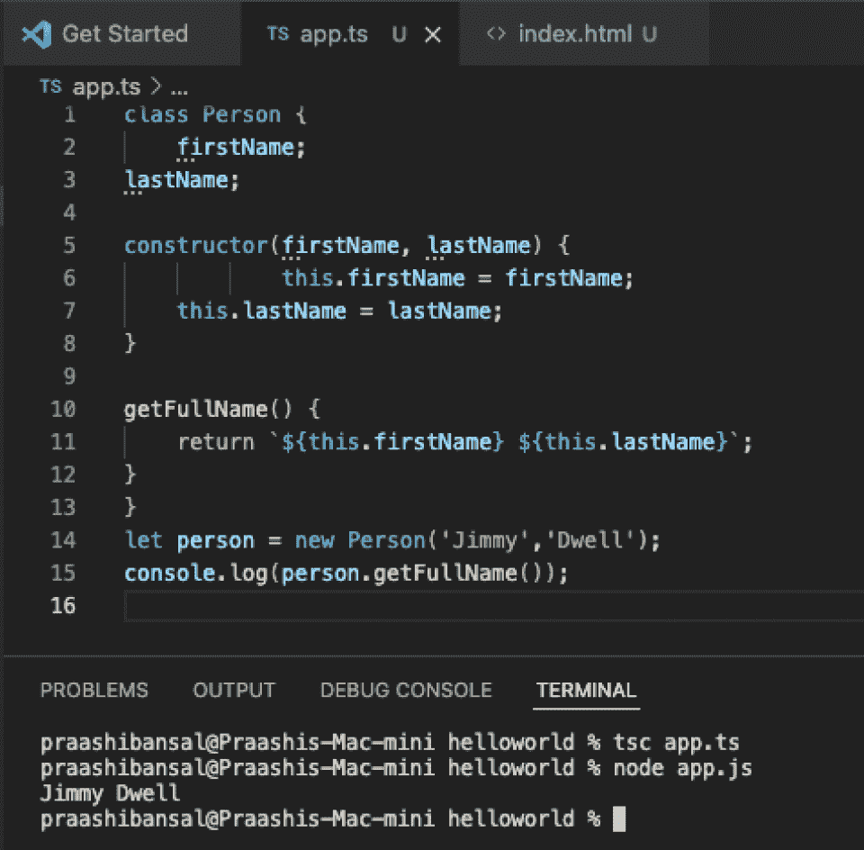

```
let person = new Person('Jimmy','Dwell');

console.log(person.getFullName());
```

下面的代码将类型批注添加到类的属性和方法中:

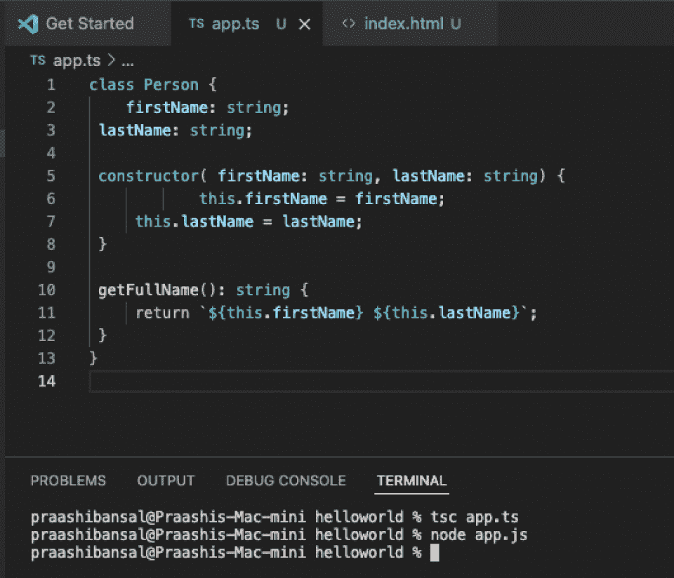

```
class Person {

firstName: string;

lastName: string;

constructor( firstName: string, lastName: string) {

this.firstName = firstName;

this.lastName = lastName;

}

getFullName(): string {

return `${this.firstName} ${this.lastName}`;

}

}
```

TypeScript 编译器将在对属性、构造函数和方法进行类型注释后执行类型检查。

**类型脚本访问修饰符**

### 类的属性和方法的可见性是由访问修饰符决定的。私有、受保护和公共是三个类别。在编译期间而不是运行时，访问在逻辑上由 TypeScript 控制。

**私有修改器**

#### 当对类中的任何属性或方法使用 private 修饰符时，可以在同一个类中访问它们，但不能在类外访问它们。

**公共修饰符**

```
For example:

class Person {

private firstName: string;

private lastName: string;

// ...

}
```

#### 它是所有方法和属性的默认访问修饰符。它允许您从程序中的任何位置访问类的属性和方法。

示例:

**受保护的修饰符**

```
class Person {

// ...

public getFullName(): string {

return `${this.firstName} ${this.lastName}`; 

}

// ...

}
```

#### 当您将属性和方法定义为 protected 时，它们只能在同一个类及其子类中访问。如果试图从其他位置访问受保护的属性或方法，将会出现错误。

**打字稿只读**

```
class Person {

protected ssn: string;

// other code

}
```

### TypeScript 支持 readonly 修饰符，它将类的属性标记为不可变的。您可以在属性声明或同一类的构造函数中声明 readonly 属性。

例如:

在这个例子中，我们在 Person 类构造函数中将 birthdate 属性初始化为 readonly 属性。

```
class Person {

readonly birthDate: Date;

constructor(birthDate: Date) {

this.birthDate = birthDate;

}

}
```

如果重新分配 birthDate 属性，将会出现错误:

**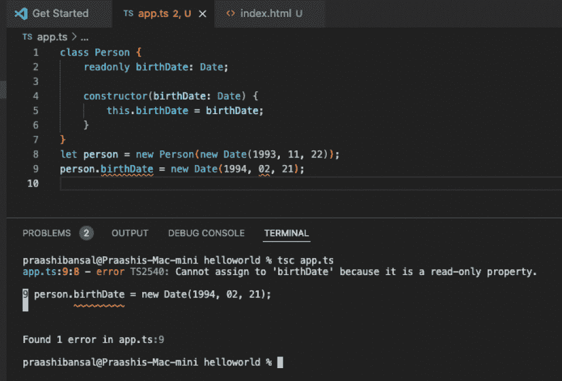**

```
let person = new Person(new Date(1993, 11, 22));

person.birthDate = new Date(1994, 02, 21); 
```

### **getter 和 setter**

### 考虑下面的代码，其中用户输入一个人的年龄。

在代码中到处应用检查是相当令人畏惧的。这就是 getters 和 setters 出现的原因。它们允许您控制对类属性的访问。

```
class Person {

public age: number;

}

person.age = inputAge;

The inputAge can take any valid number. However, we will apply a condition for age:

if( inputAge > 0 && inputAge < 50 ) {

person.age = inputAge;

}
```

**打字稿继承**

```
class Person {

private _age: number;

public get age() {

return this._age;

}

public set age(theAge: number) {

if (theAge <= 0 || theAge >= 50) {

throw new Error('The age is invalid');

}

this._age = theAge;

}

public getFullName(): string {

return `${this._age}`;

}

}
```

### 一个类可以通过继承使用其父类的属性。为了做到这一点，子类必须继承父类。术语“子类”是指将继承另一个类的类，而“父类”是指另一个类。

例如:

如果希望子类继承父类，则需要像任何其他编程语言一样使用 extends 关键字:

```
class Person {

constructor(private firstName: string, private lastName: string) {

this.firstName = firstName;

this.lastName = lastName;

}

getFullName(): string {

return `${this.firstName} ${this.lastName}`;

}

describe(): string {

return `This is ${this.firstName} ${this.lastName}.`;

}

}
```

**构造器**

```
class Employee extends Person {

//..code

}
```

### 在上一节的示例中，您可以看到 person 类带有一个初始化属性的构造函数，比如 firstName 和 lastName 属性。

之后，在 Employee 类的构造函数中初始化这些属性。这个类调用 person 类的构造函数来扩展它。

使用 super()访问父类的构造函数。

下面的代码将为 employee 类创建实例:

```
class Employee extends Person {

constructor(

firstName: string,

lastName: string,

) {

// calling person’s class constructor

super(firstName, lastName);

}

}
```

使用 employee 类的实例，您可以访问 persons 类方法:

```
let employee = new Employee('Jimmy','Dwell');
```

**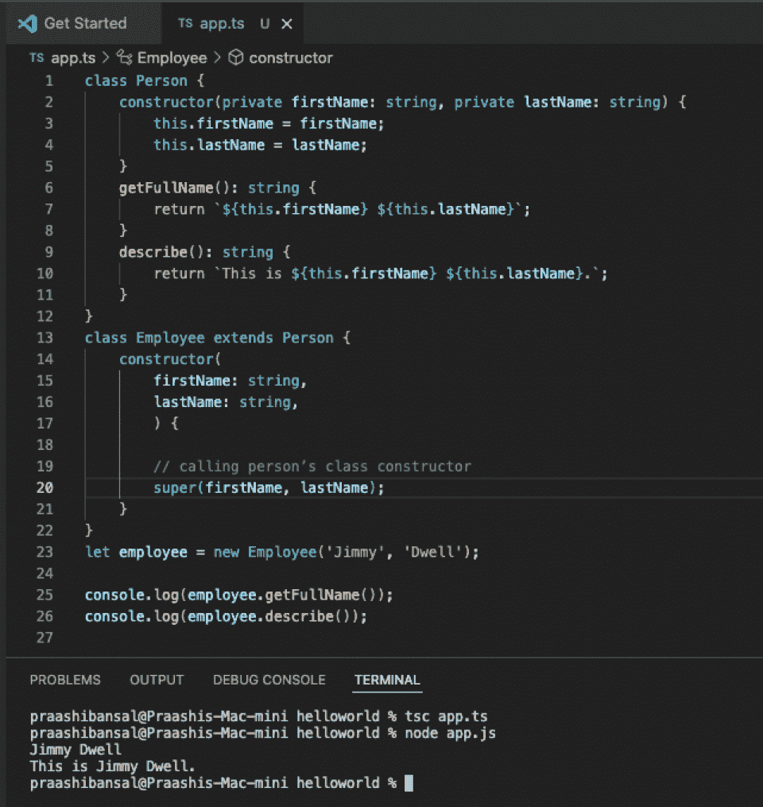**

```
let employee = new Employee('Jimmy', 'Dwell');

console.log(employee.getFullName());

console.log(employee.describe());
```

### **静态属性**

### 静态属性在所有类之间共享，要求您使用 Static 关键字。此外，如果您想访问静态属性，您必须提到类名或属性名:

在上面的例子中，我们已经提到人数静态初始化为零。每当创建一个对象，人数就会增加一。

```
class Employee {

static headcount: number = 0;

constructor(

private firstName: string,

private lastName: string,

) {

Employee.headcount++;

}

}
```

现在，我们将创建两个雇员对象:

输出将是 2。

```
let john = new Employee('Jam', 'Dam');

let jane = new Employee('Sam', 'Gam');

console.log(Employee.headcount);
```

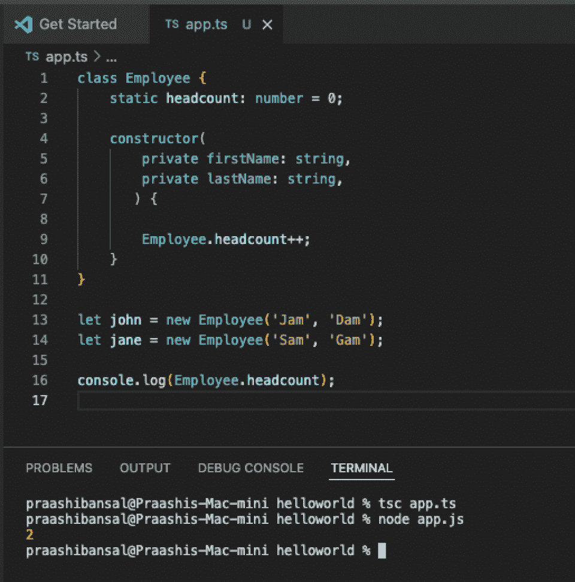

静态方法

### 静态方法类似于静态属性，因为它也是跨类实例共享的。要指定一个静态方法，必须在方法名前使用 static 关键字。

例如:

**抽象类**

```
class Employee {

private static headcount: number = 0;

constructor(

private firstName: string,

private lastName: string,

) {

Employee.headcount++;

}

public static getHeadcount() {

return Employee.headcount;

}

}
```

### 抽象类定义了派生类要扩展的公共行为。abstract 关键字用于声明抽象类。

更有趣的是，抽象类包含没有实现的方法。扩展抽象类的类包含这些方法的实现。

```
abstract class Employee {

//...

}
```

以下代码将“Employee”作为抽象类，将“getSum”作为抽象方法:

您不能创建“Employee”类的对象，因为它是一个抽象类。

```
abstract class Employee {

constructor(private firstName: string, private lastName: string) {

}

abstract getSum(): number

get fullName(): string {

return `${this.firstName} ${this.lastName}`;

}

compensationStatement(): string {

return `${this.fullName} makes ${this.getSum()} a month.`;

}

}
```

您将得到一个错误。

```
let employee = new Employee('Jimmy','Dwell');
```

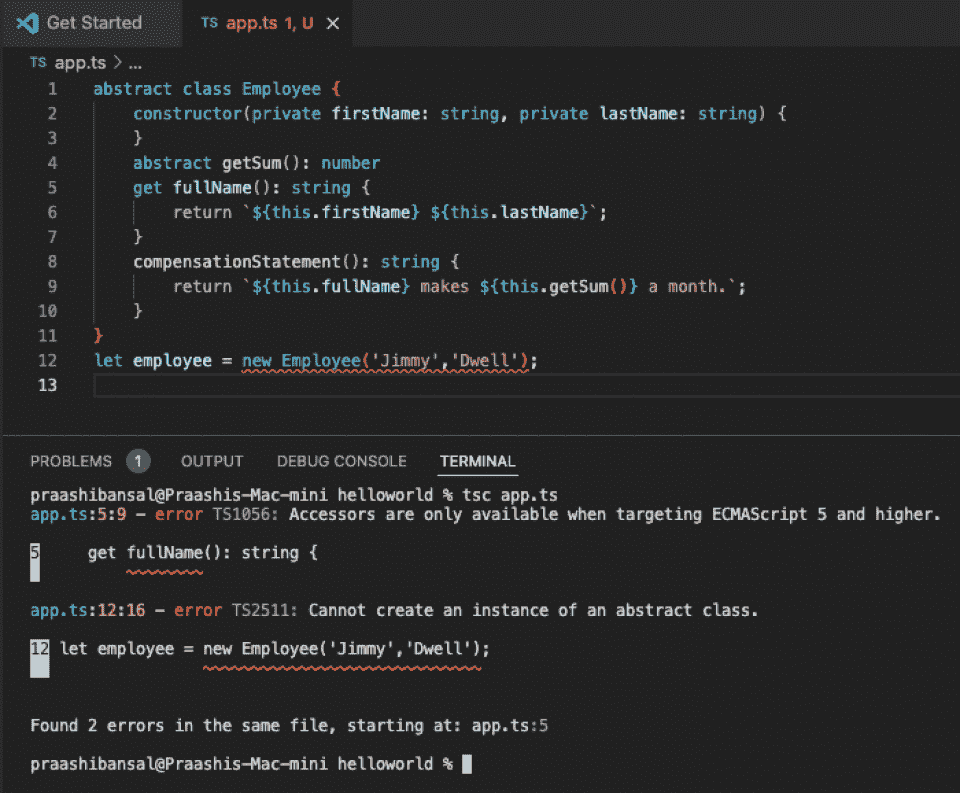

Emp 类继承了 Employee 类:

**5。接口**

```
class Emp extends Employee {

constructor(firstName: string, lastName: string, private salary: number) {

super(firstName, lastName);

}

getSum(): number {

return this.salary;

}

}

let jim = new FullTimeEmployee('Jim', 'Dim', 3400);

console.log(john.compensationStatement());
```

## **接口**

### 如果希望在 TypeScript 代码中定义协定，可以使用接口。它允许您使用显式名称进行类型检查。例如:

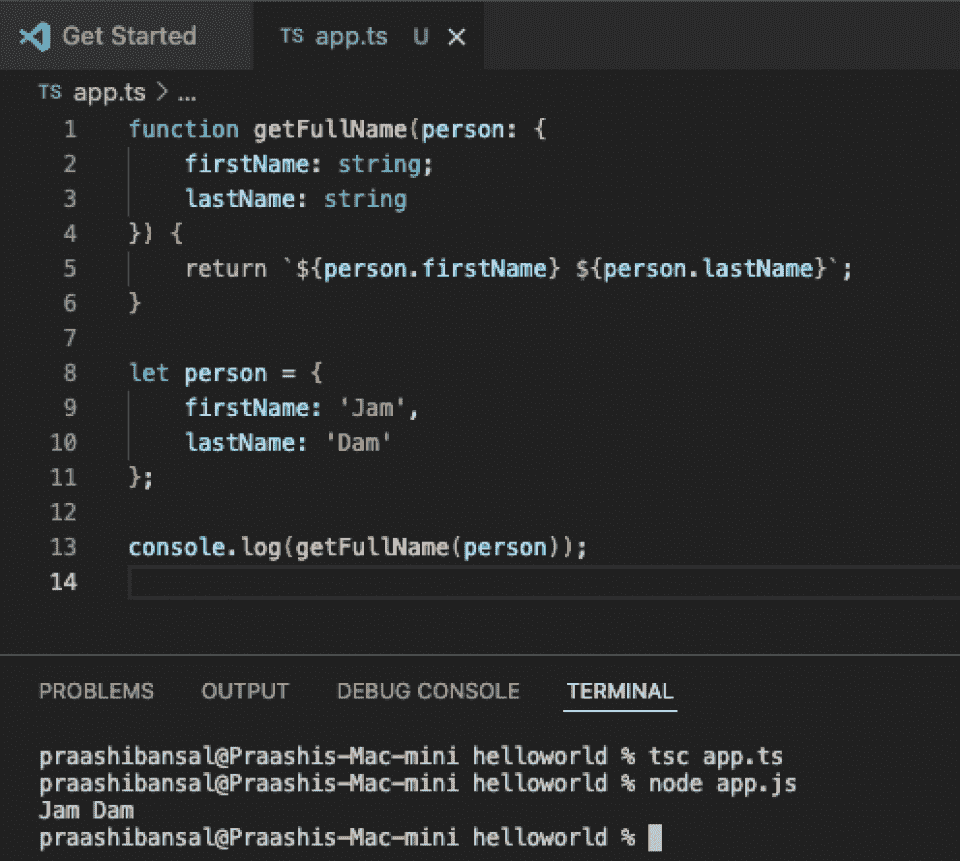

```
function getFullName(person: {

firstName: string;

lastName: string

}) {

return `${person.firstName} ${person.lastName}`;

}

let person = {

firstName: 'Jam',

lastName: 'Dam'

};

console.log(getFullName(person));
```

编译器将检查 getFullName 函数传递的参数。如上所述，传递的参数应该是字符串。

如果它们中的任何一个不匹配，就会导致错误。但是，正如您看到的，由于类型注释，代码变得复杂和难以阅读。因此，我们使用接口来克服这个可读性问题。

我们创建了一个名为“Person”的接口，它有两个属性:

您可以使用上面的接口来定义其他类或方法。

```
interface Person {

firstName: string;

lastName: string;

}
```

**可选属性**

### 通过接口，您还可以拥有可选的属性。问号(？)在声明部分的属性名的末尾:

在上面的例子中，中间名被声明为可选参数。如果用户不传递此变量的参数，将不会出现编译错误。

```
interface Person {

firstName: string;

middleName?: string;

lastName: string;

}
```

**接口扩展一个接口**

```
function getFullName(person: Person) {

if (person.middleName) {

return `${person.firstName} ${person.middleName} ${person.lastName}`;

}

return `${person.firstName} ${person.lastName}`;

}
```

### 对于这个概念，我们使用一个名为 person 的接口，它包含两个名为 male()和 female()的方法:

假设这个接口已经被几个类实现了。也许我们想在“人”的界面上增加一个方法女孩。

```
interface Person {

male(g: string): boolean

female(g: string): boolean

}
```

但是，它会破坏当前的代码。为了避免这种情况，我们将创建一个新界面，并将其扩展到“Person”界面:

```
girl(g: string): void
```

我们使用 extend 关键字将一个接口扩展到另一个接口:

```
interface family extends Person {

girl(g: string): boolean

}
```

**6。高级类型**

```
interface A {

a(): void

}

interface B extends A {

b(): void

}
```

## **打字稿交集类型**

### 如果要通过组合几个现有类型来创建新类型，可以在 TypeScript 中使用交集类型。新创建的类型将具有现有类型的功能。要组合这些类型，您需要使用&运算符:

新的 typeAB 将同时具有 A 和 b 的特性。此外，联合类型(|)确保变量可以具有 A 或 b 类型的值。

```
type typeAB = typeA & typeB;
```

为了解释这个概念，我们使用三个接口:业务伙伴、身份和联系。

```
let varName = typeA | typeB; // union type
```

下面是两种不同的交叉点类型:

```
interface BusinessPartner {

name: string;

credit: number;

}

interface Identity {

id: number;

name: string;

}

interface Contact {

email: string;

phone: string;

}
```

**类型员工** =身份&联系人；//包含标识和联系类型的属性。例如:

**类型客户** =业务伙伴&联系人；//包含业务伙伴和联系人类型的所有属性。例如:

```
let e: Employee = {

id: 10,

name: 'ping pong',

email: 'ping.pong@example.com',

phone: '(408)-897-5684'

};
```

**打字稿型防护罩**

```
type Customer = BusinessPartner & Contact;

let c: Customer = {

name: 'ABC Inc.',

credit: 10000,

email:’hello@abcinc.com',

phone: '(408)-897-5735'

};
```

### 如果想缩小条件块中变量的类型，可以使用类型保护。

**类型**

#### 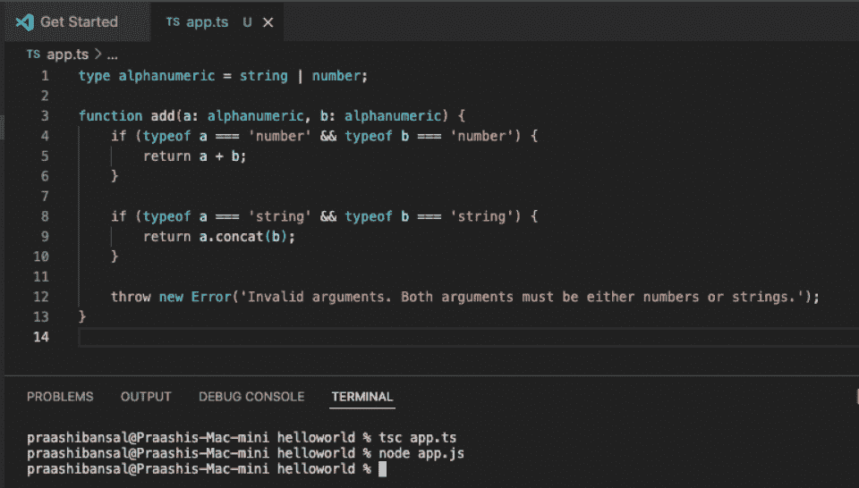

```
type alphanumeric = string | number;

function add(a: alphanumeric, b: alphanumeric) {

if (typeof a === 'number' && typeof b === 'number') {

return a + b;

}

if (typeof a === 'string' && typeof b === 'string') {

return a.concat(b);

}

throw new Error('Invalid arguments. Both arguments must be either numbers or strings.');

}
```

上面的函数检查两个参数类型是否都是数字并且都使用了 typeof 运算符。如果这两个参数使用 typeof，它将计算它们的总和。

字符串类型参数也是如此。但是，它将连接两个参数，而不是执行求和。

如果参数既不是数字也不是字符串，您将得到一个错误。

**7。仿制药**

## 为了创建可重用和通用形式的函数、类和接口，TypeScript 提供了泛型。

下面是一个从 R 类型数组返回随机元素的通用函数的示例:

上述函数将使用 R 类型数组，该数组在调用函数时捕获所提供的类型。此外，该函数的返回类型为 getRandomElement()函数作为泛型工作，因为它可以处理任何数据类型。你可以用任何字母代替 r。

```
function getRandomElement<R>(items: R[]): R {

let randomIndex = Math.floor(Math.random() * items.length);

return items[randomIndex];

}
```

**调用通用函数**

### getRandomElement()也可以处理数组:

上面的代码将数字作为 R 类型传递给 getRandomElement()函数。

```
let numbers = [1, 5, 7, 4, 2, 9];

let randomEle = getRandomElement<number>(numbers); 

console.log(randomEle);
```

这里，我们对参数使用类型推断，因此 TypeScript 编译器可以根据您将传递的参数类型自动设置 R 的值。

这里，我们没有指定函数的返回类型，这将由编译器通过查看传递的参数来完成。getRandomElement()函数现在也是类型安全的。但是，如果指定字符串变量，将会出现错误。

```
let numbers = [1, 5, 7, 4, 2, 9];

let randomEle = getRandomElement(numbers); 

console.log(randomEle);
```

**类型脚本泛型类**

```
let numbers = [1, 5, 7, 4, 2, 9];

let returnElem: string;

returnElem = getRandomElement(numbers);
```

### 泛型类由泛型类型参数列表组成。类名跟在尖括号<>内的参数列表后面。

一个参数列表中可以有多个泛型类型。

```
class className<T>{

//... 

}
```

例如:

**类型脚本通用接口**

```
class className<K,T>{

//...

}
```

### 您还可以创建一个通用接口，就像我们对类所做的那样。泛型接口由泛型类型参数列表组成。接口名称遵循尖括号<>内的参数列表。

接口的所有成员都可以看到类型参数 r，类型参数列表中可以有更多的类型。

```
interface interfaceName<R> {

// ...

}
```

例如:

**8。类型脚本模块**

```
interface interfaceName<U,V> {

// ...

}
```

## **创建模块**

### 您可以在 TypeScript 中创建模块。下面我们用声明的接口检查创建 Check.ts:

我们在接口之前使用了 export 关键字，因此其他模块可以使用这个接口。否则，check 接口将是 Check.ts 模块的私有接口。

```
export interface Check {

isValid(s: string): boolean

}
```

**导出报表**

### 要从模块中导出声明，可以使用 export 语句:

您还可以重命名模块的声明:

```
interface Check {

isValid(s: string): boolean

}

export { Check };
```

另一个模块可以使用 Check 接口作为 StringCheck 接口。

```
interface Check {

isValid(s: string): boolean

}

export { Check as StringCheck };
```

**导入新模块**

### 在代码中使用 import 语句来使用新模块。在以下代码中，我们使用 Check.ts 模块创建了一个新的模块校验和:

导入模块时，您可以对其进行重命名:

```
import { Check } from './Check';

class CheckSum implements Check {

isValid(s: string): boolean {

const emailRegex = /^[^\s@]+@[^\s@]+\.[^\s@]+$/;

return emailRegex.test(s);

}

}

export { CheckSum };
```

在校验和模块内部，您使用 Check 接口作为 StringCheck 接口:

```
import { Check as StringCheck } from './Check';
```

**从模块导入所有内容**

```
import { Check as StringCheck } from './Check';

class CheckSum implements StringCheck {

isValid(s: string): boolean {

const emailRegex = /^[^\s@]+@[^\s@]+\.[^\s@]+$/;

return emailRegex.test(s);

}

}

export { CheckSum };
```

#### 要从模块中导入所有内容，可以使用以下语法:

**再出口**

```
import * from 'module_name';
```

### 下面，我们将使用 Check.ts 模块创建一个名为 CheckSal.ts 的新模块:

**打字稿反应备忘单**

```
import { Check } from './Check';

class CheckSal implements Check {

isValid(s: string): boolean {

const numberRegexp = /^[0-9]+$/;

return s.length === 5 && numberRegexp.test(s);

}

}

export { CheckSal };
```

## 在这份 react 打字稿备忘单中，我们将学习 react 打字稿类型。要导入 React，请使用以下命令:

**功能组件**

```
import * as React from "react";

import * as ReactDOM from "react-dom";
```

### 您可以将它们用作普通函数，接受 props 参数并返回 JSX 元素:

**结论**

```
// Declaring type of props

type AppProps = {

message: string;

}; 

// Declare a Function Component; return type is inferred.

const App = ({ message }: AppProps) => <div>{message}</div>;

// Annotate the return type 

const App = ({ message }: AppProps): JSX.Element => <div>{message}</div>;

// Inline the type declaration

const App = ({ message }: { message: string }) => <div>{message}</div>;
```

## 在这个 React TypeScript 备忘单中，我们已经用简单的语法和运行 VS 代码编辑器输出的例子涵盖了每个方面。

与任何其他面向对象的编程语言一样，TypeScript 是一种简单的交互式语言，它允许您使用对象、类、模块、接口、继承等。你可以把这份打字稿备忘单放在手边，为即将到来的面试做准备。

有兴趣用 React 学习 TypeScript 吗？

**[查看我们的 React 面试问题](https://hackr.io/blog/react-interview-questions)**

**人也在读:**

**People are also reading:**