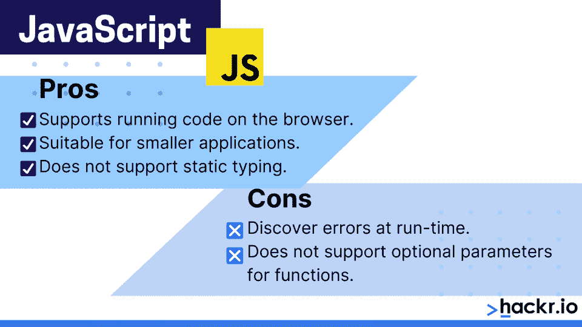
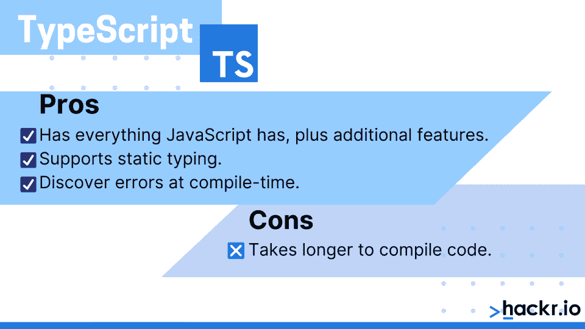

# TypeScript vs JavaScript:2023 年哪个最好[更新]

> 原文：<https://hackr.io/blog/typescript-vs-javascript>

JavaScript 在互联网上无处不在。作为许多 web 项目最流行的脚本语言，它已经成为许多人的网关编程语言。但它不是同类中唯一的一个。

TypeScript 是一种开源编程语言，适用于大多数大型应用程序。它是由微软在 2012 年开发的，主要是因为 JavaScript 代码变得太复杂，以至于无法处理大规模的应用程序。

这种 TypeScript 与 JavaScript 的正面比较将会看到两者之间的相同点和不同点。

## TypeScript 与 JavaScript:亮点

*   JavaScript 更适合小型应用程序，而 TypeScript 更适合大型应用程序。
*   TypeScript 支持静态类型，但 JavaScript 不支持。
*   TypeScript 支持接口，但 JavaScript 不支持。
*   TypeScript 具有原型功能，但 JavaScript 没有。
*   JavaScript 支持在浏览器上运行代码，但 TypeScript 不支持。
*   TypeScript 支持模块，但 JavaScript 不支持。
*   在 TypeScript 中，可以在编译时发现并纠正错误；在 JavaScript 中，eros 只能在运行时找到，因为它是一种解释型语言。
*   函数可以在 TypeScript 中有可选参数，但在 JavaScript 中没有。

## 【JavaScript 和 TypeScript 的区别

JavaScript 和 TypeScript 之间的区别可以归结为几个方面。这就是我们下面要描述的。

### **JavaScript 是什么？**

JavaScript 是 Netscape 与 Sun Microsystems 合作开发的，是 web 上最流行的核心技术之一。从一开始，它就是 web 应用程序的一个组成部分，使 web 页面具有交互性和动态性。它是一种高级语言，具有 JIT(实时)编译器和动态类型。

很长一段时间，JS 只是一个客户端实现，但是一些较新的 JS 引擎也有服务器端实现。JS 的语法类似于 Java，标准库也是如此。首先，JS 是最好的脚本语言。你可以查看一些 JavaScript 教程了解更多信息。

使用 TypeScript 的公司包括微软、谷歌、贝宝、网飞和优步。

JavaScript 的一些独特特性是:

*   灵活、动态和跨平台
*   用于客户端和服务器端实现
*   轻量级解释
*   所有浏览器都支持
*   弱类型化
*   JIT 编译

### 推荐 JavaScript 课程

【JavaScript 全教程 2023:从零到专家！



### **什么是 TypeScript？**

本质上，你所有的 JavaScript 代码在 TypeScript 中也是有效的——这意味着 TypeScript 是 JavaScript 的超集——它只是具有更多特性的 JavaScript。所以，如果你保存你的 JavaScript(。js)文件。ts)扩展，它将工作得非常好。但这并不意味着 TypeScript 和 JavaScript 是一样的。

TypeScript 在用途上与 JavaScript 没有什么不同，但是用于开发大型应用程序。TypeScript trans 编译(源到源编译)为 JavaScript。它遵循面向对象的编程语言结构，支持类、接口、命名空间和继承等特性。通过类型注释(数字、字符串和布尔值)，静态类型在 TypeScript 中是可能的。

TypeScript 是强类型的。这使得调试(在编译时)更好，对于大型项目来说，这是一种更有效的编码方式。TypeScript 程序通常由模块、函数、变量、注释、表达式和语句组成，就像任何其他成熟的编程语言一样。

当代码变得庞大、复杂、容易出错时，最好在编译时就发现错误。这就是 TypeScript 的用处。

使用 TypeScript 的公司包括微软、Slack、Medium 和埃森哲。

TypeScript 的一些最突出的特性是:

*   易于维护并提高项目生产率。
*   静态类型和注释是可能的。
*   支持面向对象的特性，如接口、继承和类。
*   易于调试和早期发现错误。
*   支持 ES6 (ECMAScript ),它提供了更简单的语法来处理对象和继承特性。
*   良好的成熟 IDE 支持。



## **TypeScript vs JavaScript:面对面的比较**

| **打字稿** | **JavaScript** |
| JavaScript 的超集，为克服大型项目的代码复杂性而开发。 | 一种帮助创建动态网页内容的脚本语言。 |
| 可以在编译时发现并纠正错误。 | 只有在运行时才能发现错误，因为它是一种解释型语言。 |
| 强类型，支持静态和动态类型。 | 弱类型，没有静态类型选项。 |
| 转换成浏览器可以理解的 JavaScript 代码。 | 可以直接在浏览器中使用。 |
| 因为它是一个超集，所以所有的 JavaScript 库和其他 JavaScript 代码都可以工作，不需要任何修改。 | JS 库默认工作。 |
| 支持 ES3、ES4、ES5 和 ES6。 | 不支持编译额外的 ES3、ES4、ES5 或 ES6 功能。 |
| 支持模块、泛型和接口来定义数据。 | 不支持模块、泛型或接口。 |
| 函数可以有可选参数。 | 函数不能有可选参数。 |
| 示例代码:

```
function multiply (a, b) { return a*b; } var result = multiply(a, b); console.log(‘The answer is - ’ + result);
```

 | 示例代码:

```
<script> function multiply (a, b) { return a*b; } var result = multiply(a, b); document.write (‘The answer is – ’ + result); </script>
```

 |
| 数字和字符串被认为是接口。 | 数字和字符串是对象。 |
| 用于大型项目的强大而直观的语言。 | 整洁干净，最适合简单的 web 应用程序。 |
| 社区支持仍在增长。 | 巨大的社区支持，大量的文档和解决问题的支持。 |
| 原型是可能的 | 不支持原型。 |
| 需要时间来学习和编码，脚本知识是必须的。 | 可以在旅途中学习，不需要以前的脚本编写经验。 |
| 静态类型定义需要正确的构建设置(npm 包) | 不需要构建设置。 |

## **结论**

正如我们已经确定的，当您的团队是新的并且正在处理小型 web 项目时，JavaScript 是最适合的。如果您有一个拥有良好专业技能和知识的团队，并且希望他们处理一个复杂的项目，那么使用 TypeScript 是一个完美的选择。

当涉及到 TypeScript 或 JavaScript 时，没有必要局限于一个。TypeScript 与 JavaScript 之间的差异并不像您想象的那么多，尽管这些差异可能很大。

也就是说，如果你在寻找学习曲线和工作机会，TypeScript 比 JavaScript 有优势。TypeScript 开发人员的平均年薪为 148，000 美元，而 JS 开发人员的年薪通常在 110，000 美元左右。

如果你学习了 TypeScript，你可以在 JS 和 TypeScript 项目中工作。今天开始[学习打字稿](https://hackr.io/tutorials/learn-typescript?ref=blog-post)。

## **常见问题解答**

#### **1。TypeScript 比 JavaScript 好吗？**

TypeScript 不是 JavaScript 的替代品。对于较小的项目，使用 TypeScript 可能会有很高的开销，因为将代码转换成 JavaScript 需要时间，这是一个额外的步骤。JavaScript 直接在浏览器上运行，所以对于小代码块，刷新和调试代码更容易。对于 TypeScript，我们需要一个合适的 IDE 来运行代码。

#### **2。TypeScript 比 JavaScript 简单吗？**

难度水平相当。在某些情况下，TypeScript 可能更难理解，JavaScript 也是如此。

#### **3。我应该学 JavaScript 还是 TypeScript？**

对于完全的初学者来说，JavaScript 可能是更好的选择。如前所述，TypeScript 只是 JavaScript 的超集。JS 可能是一个更好的选择，因为它很受欢迎，可以带来更多的就业机会。

#### **4。TypeScript 比 JavaScript 更安全吗？**

有很多人说，TypeScript 作为 JavaScript 的更新版本，比后者更安全。然而，如果您知道自己在做什么，并遵循最佳的安全实践，JavaScript 在任何情况下都是安全的。

#### **5。Google 用 JavaScript 还是 TypeScript？**

Google 使用 TypeScript 作为其 web 应用程序框架 Angular。使用 TypeScript 的一个例子是 Google Analytics。

**人也在读:**