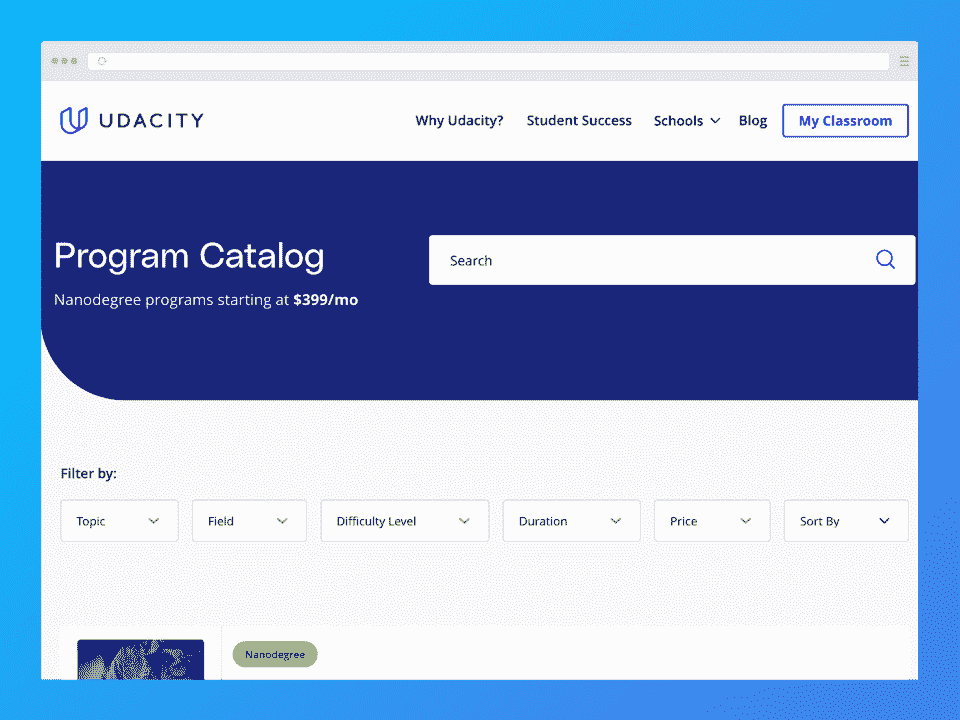
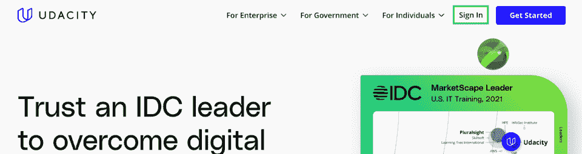
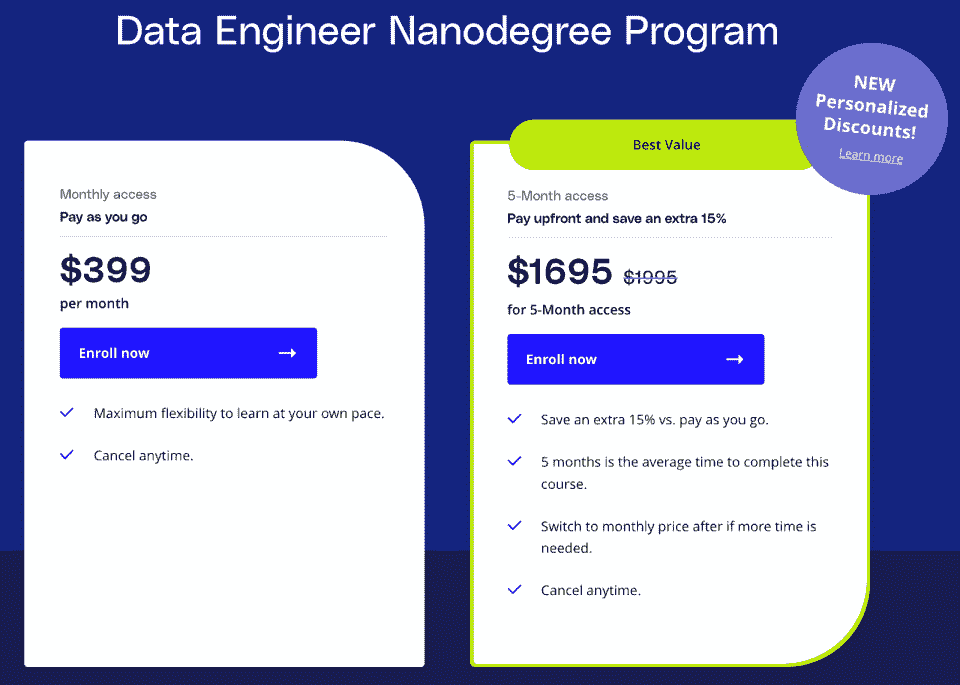
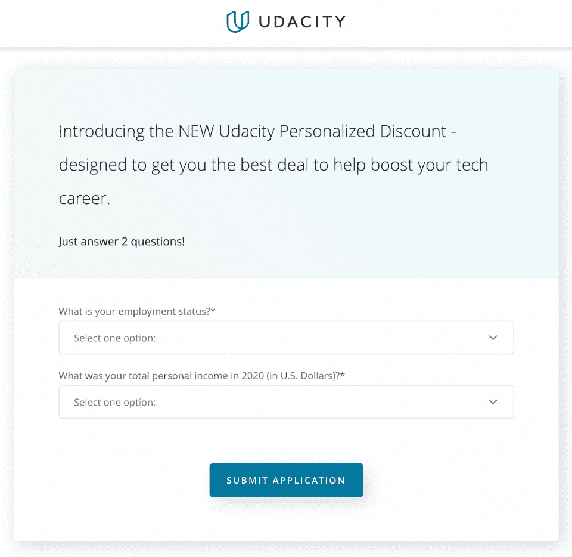
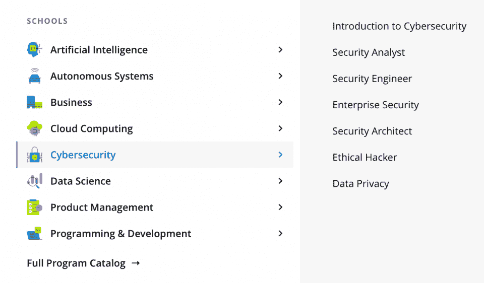

# Udacity 评论:这个电子学习平台适合你吗？

> 原文：<https://hackr.io/blog/udacity-review>

Udacity 是当今最好的在线学习平台之一。自 2011 年以来，它提供个人付费课程和纳米学位项目，帮助学习者获得新的[技能](https://hackr.io/blog/apply-for-job-when-you-match-70-percent-of-skills)，帮助他们找到梦想中的工作。学生从经过审查的行业专家创建的高质量课程中学习，并可以获得 Udacity 的独家导师体验。

| 教练 | 5/5 |
| 课程 | 5/5 |
| 经验 | 3.5/5 |
| **总计** | **4.5/5** |

**一览:**

*   Udacity 的证书没有被认可，但由于与 IBM 和谷歌等行业领导者的合作，仍然得到了雇主的广泛认可。
*   Udacity 的教师经过严格的审查程序，确保他们是各自领域经验丰富的专家。这些教师还必须有至少一年的教学经验。
*   Udacity 的学生享受着强烈的导师体验。
*   参加纳米学位项目的学生可以获得 Udacity 职业服务。
*   该平台提供 200 多门免费课程。

那么，Udacity 值得吗？

请继续阅读完整的 Udacity 评论，我们将讨论课程、教师、成本，甚至看看雇主如何看待这个平台。

## ****

## **什么是 Udacity？**

Udacity 是一个 MOOC(大规模开放在线课程)平台，提供数百个名为 Nanodegrees 的顶级课程。每个纳米学位需要 3-10 门课程才能获得结业证书。Udacity 经常与行业领导者合作，提供由该领域专家创建和指导的课程。

### Udacity 合法吗？

对 Udacity 持保留态度是有道理的，尤其是考虑到纳米学位的高昂价格。然而，我们可以毫不含糊地说，Udacity 是 100%合法的。自 2011 年成立以来，Udacity 提供了高质量的按需就业技能课程。该平台还不断与行业领先的公司合作。

如果你担心为一门课程付费却发现它不适合你，你会很高兴知道 Udacity 有退款政策。但是，退款期限是有限的，所以您应该在投资一个计划之前仔细阅读政策。

### Udacity 是否得到认可和认证？

如果你想知道 Udacity 证书的价值，你并不孤单。在完成一个相对昂贵的项目后，考虑你获得的证书的价值是可以理解的。不幸的是，Udacity 的证书没有得到认证，因为它是一家私人机构。如果你想把你的证书转换成大学学分，你就没那么幸运了。

这可能会让你止步不前，但不要担心——事实是许多雇主认可简历上的毕业证书。这在很大程度上得益于该平台与领先科技公司合作提供高质量课程的声誉。

### **谁应该使用 Udacity？**

任何想通过学习商业、编程、数据科学等技能来推进职业发展的人都可以从 Udacity 的项目中受益。平台上的导师支持使个人能够很好地学习。Udacity 的职业服务也可以帮助像你这样的学生准备申请和面试工作。

值得一提的是，Udacity 不仅面向个人，也面向企业和政府客户。

## 【Udacity 是如何运作的？

即使你以前从未尝试过使用电子学习平台，Udacity 也让体验变得简单明了、用户友好，因此毫无疑问你可以找到自己的路。开始很容易，只需创建一个帐户，选择一个计划或单一课程，并购买必要的订阅(不要忘记首先回答您的个性化折扣调查)。

一旦你成功注册，你需要完成入职流程，这是 Udacity 独有的功能，可以帮助你设定学习目标，帮助你取得成功。你要回答一份问卷，看看你的教学大纲，并在整个过程中计划你的时间表。您还可以设置学习和完成作业的提醒，这可以与您的日历应用程序同步！

然后，剩下的就是学习了。

要知道，只要你完成了所有的课程，你可以按照你喜欢的任何顺序来选择你的课程。课程通常以视频讲座的形式进行，其间穿插一些测验和学生项目(评分)。

### **如何开立 Udacity 账户**

报名 Udacity 轻而易举。只需遵循以下步骤:

1.进入 [Udacity 网站](https://udacity.com)，点击右上角的**登录**链接。

2.选择使用谷歌、电子邮件或脸书登录。否则，转到第三步。

3.如果你想用你的电子邮件地址注册，点击**注册**并填写表格。

4.验证您的电子邮件地址。

## **uda city 的利弊**

Udacity 适合你的情况吗？让我们看看利弊，找出答案:

| **优点** | **缺点** |
| 由行业专家打造的顶级课程

*   经过审查的讲师通常尊重来自全球 2000 强和财富 500 强公司的专业人士
*   Udacity 经常与行业领先的公司合作，如谷歌、亚马逊 AWS、IBM 和英伟达。
*   导师经验
*   注册后可以立即访问 Udacity 的职业服务，包括简历模板和求职信、简历、GitHub、个人资料和 LinkedIn 个人资料的评论
*   Udacity 提供了非常用户友好和直观的学习体验。
*   平台上有 200 多门免费提供的课程。
*   同行聊天功能允许与平台上的其他学习者进行协作和讨论。
*   完成一门课程会给你一张结业证书，虽然没有被认可，但在业内是被广泛认可的。

 | 每月订阅定价模式

*   没有移动应用
*   课程只有英文版，尽管有些节目可能有其他语言的字幕。
*   Udacity 的课程不像其他平台那样提供那么多实践练习。
*   商业和计算机科学范围之外的课程不多

 |

## 【Udacity 课程多少钱？

## 如果你在互联网上搜索 Udacity Nanodegree plus cost，你可能会发现该项目的月订阅费用通常为 399 美元。单一课程和纳米学位课程的费用都是 399 美元/月。

纳米学位由单一课程组成，每个课程估计需要一个月才能完成。好消息是，如果你提前几个月付款，你可以享受总额 15%的折扣。以下图中的纳米学位项目为例。

如果您的计划需要五个月才能完成，您可以预购五个月的捆绑访问，享受 15%的折扣。你不用每月支付 399 美元(总共 1995 美元)，而是每月支付 339 美元(总共 1695 美元)。

查看“新的个性化折扣！”就在那上面？Udacity 最近推出了个性化折扣，帮助您获得尽可能好的交易。要获得折扣，您需要首先回答几个问题，如下所示:

然后，Udacity 将向您反馈您的个性化折扣。

【Udacity 提供免费课程吗？

### Udacity 免费吗？不幸的是，没有。该平台上的大多数课程和纳米学位项目都是要花钱的——许多学生认为费用并不便宜，而且很快就会增加。

还好 Udacity 有一些免费的课程。大约有 200 门课程是免费的，但缺点是完成后你不会获得证书。你也无法在 Udacity 上获得独家导师体验。

大多数免费课程都是该平台一些纳米学位的简介，而其他课程则帮助学生解决与职业相关的问题，如面试准备。

可以退 Udacity 课程吗？

### 是的。Udacity 有[退款和取消政策](https://udacity.zendesk.com/hc/en-us/articles/360015466632-Refund-and-cancellation-policy)但是说实话？这不是我们见过的最好的。密切关注，这样如果你不满意，你可以退回你的课程并获得全额退款。在冒险之前，看一两篇 Udacity 纳米学位的评论可能对你也有好处。

**包月和捆绑服务**

#### 一旦注册，退款期就开始了。您有**两天**的时间取消您的注册**以获得订阅费的全额退款**。我们知道:*两天*的时间似乎不足以决定一门课程是否适合你。可惜政策就是这样！

如果你错过了两天的时间，你就不走运了。**在窗口后取消和取消注册将不再给予您退款**，但这将意味着 Udacity 在下一个计费周期不再向您收费。您的套餐在当前计费周期结束前一直有效。

万一你在两天内从该计划毕业，你将没有资格获得退款。

欧盟居民

#### 由于欧盟强有力的消费者保护法，欧盟居民获得了短暂退款窗口的缓刑。如果您居住在欧盟，只要您在注册后 14 天内申请取消注册，您将获得全额退款。注册后，退款窗口将立即开始，并在您注册之日起 14 天或之前结束。

同样，万一你在这 14 天内毕业，你将不再有资格获得退款。

[重要]附加信息

#### Udacity 的退款政策还规定，每个纳米学位项目、高管项目或个别课程的学生只能获得一次退款。加入计划使您有权享受两天的退款窗口。如果您取消全额退款并再次参加同一计划，您将不再有资格享受两天退款政策。

Udacity 上有哪些课程？

## 尽管 Udacity 主要是技术相关的课程，但也有相当多的其他课程。您会发现主要类别如下:

云计算

*   人工智能
*   商业
*   数据科学
*   自治系统
*   编程和开发
*   在主要类别下，大量的子类别有助于缩小您对完美计划的搜索范围，如下所示:

**

**如何找到最好的 Udacity 课程**

## Udacity 课程的评论在互联网上随处可见，可以帮助你决定是否注册。尽管我们毫不怀疑您可以选择最适合您需求的课程，但我们也汇总了这些提示来帮助您做出决定:

**使用 Udacity 的搜索过滤器**

### 浏览平台时，过滤器可以帮助您缩小搜索结果的范围。有针对难度级别、课程/项目持续时间、价格和领域的过滤器。

**检查讲师和项目组织者**

### 为了帮助你衡量一个纳米学位项目的质量，看看课程的指导老师。该平台的许多讲师都是领域专家，为一些最大和最好的公司工作。您还可以查看 Udacity 与谁合作创建了该程序。

**查看计划/课程大纲和课程**

### Udacity 的计划和课程都有详细的课程和教学大纲。在里面，你会找到关于主题或课题的详细信息，你将要做的项目，以及课程的周计划。当您查看任何计划的登录页面时，您将看到诸如估计学习持续时间、计划难度或水平以及计划先决条件(如某一主题的现有知识或经验)等信息(如果有)。

**阅读评论**

### Udacity 允许过去的学员对他们所学的课程和项目发表评论。不幸的是，你不会总是在平台上找到每门课程的 Udacity 课程评论——其中一些可能太新，无法提供反馈。

**观看演示/预览视频**

### 在 Udacity，每个纳米学位项目都有一个介绍教学大纲、项目和教师的预览视频。这些预览视频可能会有所帮助，但你可能不想仅仅根据它们做出决定，因为它们也是为了让你花钱。

如果你仍然难以决定，你可以随时购买课程，仔细看看。如果你不满意，可以全额退款。然而，Udacity 只允许您从购买之时起两天内申请全额退款(不要错过您的窗口！).

**最佳 Udacity 节目**

## Udacity 课程评论告诉你一门课程(或 Nanodegreee 项目)是否值得上。然而，该平台确实有一些我们可以轻松归类为最佳的程序:

编程入门纳米学位项目估计需要四个月才能完成。因为它是为完全的初学者设计的，所以不要求学生有任何经验。这个项目是迈向 web 开发、应用程序开发、人工智能/机器学习、数据科学等职业生涯的第一步。

*   [深度学习](https://imp.i115008.net/mg30E1)是与脸书人工智能和 AWS 合作开发的纳米学位计划。作为中级课程，学生需要具备基本的 Python 知识。该课程向学生讲授深度学习(和深度神经网络)以及它如何推动人工智能的进步。
*   与谷歌合作开发的 [Android 基础](https://imp.i115008.net/QOrWn3) Nanodegree 项目需要大约四个月才能完成。作为一个针对初学者的基础程序，学生不需要有任何 Android 开发经验。通过这门课程，学生学习 Java 编程、Android 开发、XML 布局、Android Studio 等。
*   如果你对技术不太感兴趣，[数字营销](https://imp.i115008.net/AoM7zD)纳米学位可能适合你。这个初级课程比较短，只需要三个月(估计)就可以完成。参加本课程有助于您掌握必要的技能，在当今竞争激烈的环境中成为成功的数字营销人员。了解营销基础知识、社交媒体营销、搜索引擎优化(SEO)、谷歌分析、品牌战略等。不需要经验。
*   [前端 Web 开发人员](https://imp.i115008.net/XxdXkG) Nanodegree 项目是一门中级课程，要求学生具备 HTML、CSS 和 JavaScript 的基础知识。这个为期四个月的项目旨在教会学生成为一名成功的前端开发人员所需的一切。学生学习如何构建令人惊叹的网站和动态 web 应用程序，以帮助提供难忘的用户体验。
*   想要了解更多用户体验设计的创意人员可以报名参加 Udacity 的 [UX 设计](https://imp.i115008.net/DVgJe2)纳米学位项目。这门初级课程不需要以前的经验，教学生如何做出有影响力的 UX 设计。学生学习用户研究，用户界面设计，UX，交互设计，原型设计等。
*   与谷歌子公司 Kaggle 合作开发的[数据分析师](https://imp.i115008.net/ZdXyWK) Nanodegree 教授中级水平的学生如何开发数据驱动的解决方案。它还帮助学生学习如何使用 SQL、Python 和统计学来寻找见解，同时向他们展示如何有效地传达他们的重要发现。必须有以前的 Python 和 SQL 知识。
*   [商业分析](https://imp.i115008.net/e4MbEO)是与 Mode 合作开发的纳米学位项目。这种初级水平需要大约三个月的时间来完成，不需要事先的知识或经验。学生获得适用于任何行业的基本技能，并学习收集数据，然后进行分析。学生还学习用 Excel、SQL 和 Tableau 交流他们的发现。
*   数据科学家纳米学位项目是由一长串公司开发的。与 Kaggle、贝塔斯曼、IBM Watson、Figure Eight、Insight 和星巴克合作开发(是的，*即*星巴克！)，这个高级课程预计需要四个月才能完成。学生必须精通 Python、统计学和 SQL。该计划旨在向学生展示如何建立优雅和有效的机器学习模型，以及其他许多事情。
*   **我们的 Udacity 回顾:总结**

## 想要根据各种标准快速总结我们的 Udacity 评估吗？看一看:

用户友好度:5/5 -毫无疑问，Udacity 提供了当今最直观和用户友好的学习体验之一。这种体验在很大程度上要归功于平台在其存在的许多年中经历的无数次重新设计。

*   **便利性:3/5**-uda city 的自定进度学习提供了最大的便利。你可以通过下载课程的视频和成绩单来离线学习，但这是这个平台上离线学习的范围。不幸的是，Udacity 没有可用的 iOS 或 Android 应用程序，这导致我们在这一标准上失去了两颗星。

*   可访问性:3/5——与其他一些平台(如 Udemy)不同，Udacity 的课程主要只有英语版本。如果英语不是你的第一语言，你可能会很难跟上。有一些*的*课程有其他语言的字幕，但这还不足以让这个平台更容易被所有人使用。

*   虽然该平台上有免费课程，但不可否认的是，Udacity 的纳米学位花了很多钱。Udacity 不一定是最实惠的平台之一，但如果你提前支付几个月的课程访问费，你可以节省 15%的费用。

*   Udacity 与众不同的一点是它提供的许多第三方奖学金。这些通常是授予合格个人的全额奖学金。奖学金来自 Cognizant、Infosys、微软、埃森哲、渣打银行等公司。
    *   **认证:5/5** - Udacity 的证书是不被认可的，所以大学不会接受它们作为学分。然而，由于 Udacity 的课程质量，雇主通常会将 Udacity 证书视为凭据。

*   毫无疑问，Udacity 已经在商业和科技领域找到了自己的位置。正因如此，平台上的课程都在这个保护伞之下。主要有六大类:AI、编程、数据科学、云计算、自主系统、商业。每个类别都有各种各样的课程。

*   **课程质量:5/5** -由于与顶级科技公司的合作以及成为 Udacity 讲师的审查程序和严格要求，您可以放心，该平台上的课程是最高质量的。你的课程将包括测试和现实生活中的项目，以帮助你应用你的知识。

*   **课程/结构:4.5/5** -除了直观的用户界面，Udacity 的课程结构良好，可提供流畅的学习体验。每门课程都分为五节课，每节课侧重于一个不同的主题。主题被进一步分解成概念，使一切更容易理解。您还可以在课程中搜索关键词，并在课程资源中找到视频和抄本。我们唯一的抱怨是有时很难找到课程信息。

*   Udacity 在其知识库中提供了丰富的信息。数据库中充满了关于平台、常见问题和故障排除支持的信息。如果你有关于平台的问题，大概可以在这里找到答案。或者，您可以通过聊天机器人或电子邮件联系 Udacity 支持人员，尽管他们可能需要一些时间来回复。

*   Udacity 有一个非常简洁的功能:它允许学生发送关于课程和纳米学位的反馈。如果你有问题，你可以给出详细的反馈来指出问题或者给平台提出建议。
    *   Udacity 的学生将体验到该平台独有的奇妙的导师体验。通过这种指导，你可以向专家寻求建议或反馈。您还可以获得关于该计划的迫切问题的答案。
    *   **付款方式:4/5** - Udacity 接受[各种付款方式](https://udacity.zendesk.com/hc/en-us/articles/360015664711-What-types-of-payment-options-does-Udacity-offer-)取决于您所在的位置。一般来说，Udacity 接受信用卡和贝宝支付。然而，在一些地方，学生可以选择通过 PayPal 信用或确认付款来拆分付款并减轻即时财务成本。这两种方式都允许你将费用分成几个月，但值得一提的是，延期付款将收取利息。在 Affirm 的情况下，利率可能会过高(*有时高达 30%！*)。

*   退款政策:2/5 -如果你读过上面关于 Udacity 退款政策的部分，你就会知道为什么我们在这个标准上只给了该平台两星。在我们看来，两天根本不足以评估一个项目是否适合你。幸运的是，欧盟居民有 14 天的时间来退款。
*   **最终裁决和评级**

## 毫无疑问，Udacity 高质量的课程和无与伦比的学习体验值得称赞。我们还喜欢 Udacity 为学生提供职业服务和独特的导师体验，这是他们在其他地方可能找不到的。

那么 Udacity 到底有多好呢？

嗯，对我们来说，这将是一个令人印象深刻的 **4.5/5 星**。Udacity 是最好的课程电子学习平台之一，可以帮助你实现你的梦想工作。

不幸的是，我们不得不从 Udacity 的整体体验中扣除半颗星，原因有三个:缺乏移动应用程序，没有其他语言的课程，以及极短的两天退款窗口。

尽管如此，我们还是很乐意向想要学习热门技能并获得行业认可证书的学生推荐这个平台。

**uda city 的替代品**

## Udacity 是一个优秀的在线学习平台，提供一流的教育，有可能帮助你获得梦想中的工作。然而，它的成本可能会让许多人望而却步。如果你觉得 Udacity 遥不可及或者不适合你，你可以考虑其他平台，比如:

**[Edureka！](https://www.edureka.co/)** 是一个优秀的教师指导的电子学习平台，为学生提供课程和计划，帮助他们推进职业发展。虽然它还是很贵，Edureka！的定价模式不需要每月订阅(你可以一次性购买课程，通常费用在 300 美元以上)。该平台不仅有认证课程来帮助你准备获得证书，它还与该领域的顶级大学合作提供高级课程。一些项目可以让你获得像普渡大学这样的机构颁发的证书，而其他项目甚至可以最终获得学位。

*   Udemy 很可能是世界上最大的在线学习平台，拥有各种主题和行业的数十万门课程。Udemy 最大的优势在于它的价格低廉，这要归功于它的课程经常以很高的折扣出售。此外，由于其移动应用程序和离线学习功能，Udemy 提供了无与伦比的学习便利。Udemy 的课程通常有许多不同的语言版本，以方便学习。如果不满意，你可以在 30 天内退货。如果你想了解更多关于 Udemy 的信息，你可以阅读我们的综合评论。
*   **结论**

## 总的来说，Udacity 仍然是最好的电子学习平台之一。尽管获得纳米学位的成本很高，但许多人都会同意，该平台上由专家创建的课程可以帮助你在自己选择的领域变得更加博学。

Udacity 的课程选择可能看起来有限，但事实是他们已经非常舒适地在计算机科学和商业领域安顿下来。有很多方法可以确定一门课程是否适合你，如果不适合，你还有很短的时间申请全额退款。

我们希望这篇 Udacity 评论能帮助你探索这个著名的电子学习平台。如果你还没有准备好投资高额的纳米学位费用，你可能想看看我们的 Udemy 评论。

**[参见我们的 Udemy 评论](https://hackr.io/blog/udemy-review)**

**常见问题解答**

## **1。Udacity 上的课程值得吗？**

#### 一个 Udacity 纳米学位值得吗？在互联网上搜索“Udacity Nanodegree plus review”，你很可能会看到以前的学生分享他们的经历。然而，只有你才能决定 Udacity 的项目是否适合你。权衡成本/收益，看看你是否愿意支付 Udacity 的费用——让我们面对现实吧，它们并不便宜。然而，它的特色、职业服务、导师、专家指导和广泛认可的证书可以让你的职业生涯受益匪浅。

**2。Udacity 纳米学位能让你找到工作吗？**

#### Udacity Nanodegrees 是由行业专家开发的。虽然 Udacity 的课程不一定能保证就业，但完成纳米学位可以让你获得帮助你找到梦想工作的技能。你还可以获得 Udacity 的职业服务和行业认可的证书的帮助。

**3。Udacity 安全吗？**

#### 是啊！Udacity 是一个 100%合法的平台，自 2011 年以来一直存在。在这段时间里，它帮助了无数学生推进他们的职业生涯。如果你对你的购买不满意，公司也有退款政策(在投资一门课程之前，请务必通读该政策！).

**4。Udacity 多少钱？**

#### 你可以在这个平台上找到 200 多门免费课程，尽管完成一门免费课程并不能给你颁发结业证书。Nanodegrees 可以按月订阅，每个月的费用通常为 399 美元。您可以按使用量付费，也可以提前支付几个月的捆绑接入费，享受 15%的折扣(例如，购买五个月的接入费可以降低到每月约 339 美元)。

**5。是什么让 Udacity 与众不同？**

#### 有许多 Udacity 的评论都会同意 Udacity 是独一无二的，因为它与大型科技公司合作创建其程序。因此，他们的证书在行业内得到广泛认可，尽管没有得到认可。此外，学生在注册时会经历一次独特的入职体验，以帮助他们在课程中取得成功。导师经验也有助于将这个平台与其他平台区分开来。

**6。可以把 Udacity 放在简历里吗？**

#### 是的——有些人甚至鼓励你这样做。Udacity 因提供由行业专家制作的高质量和最新课程而闻名。

**人也在读:**

**People are also reading:**