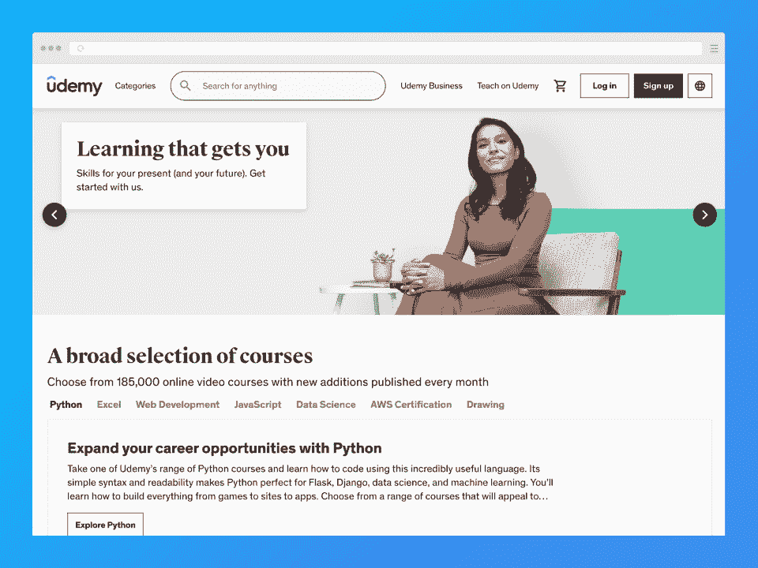
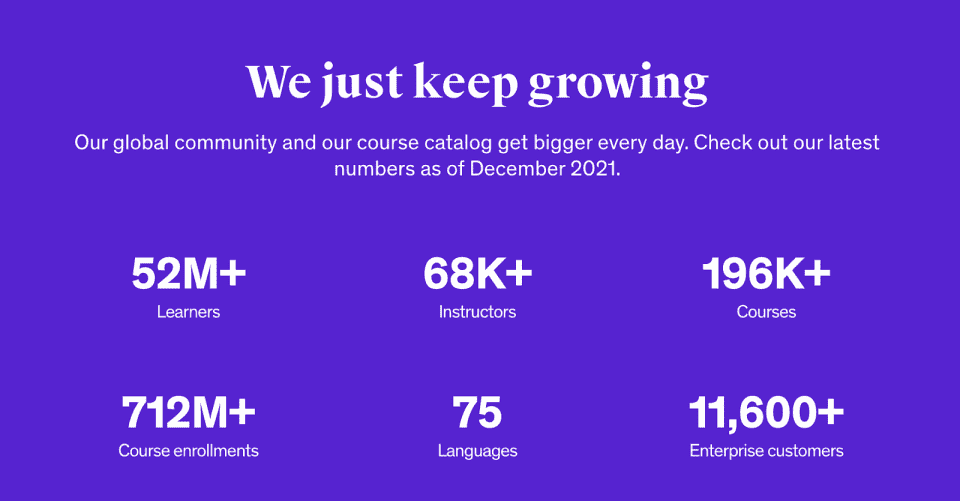
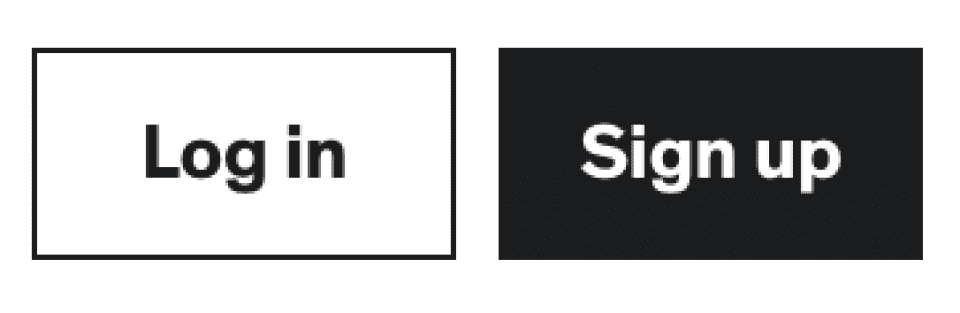
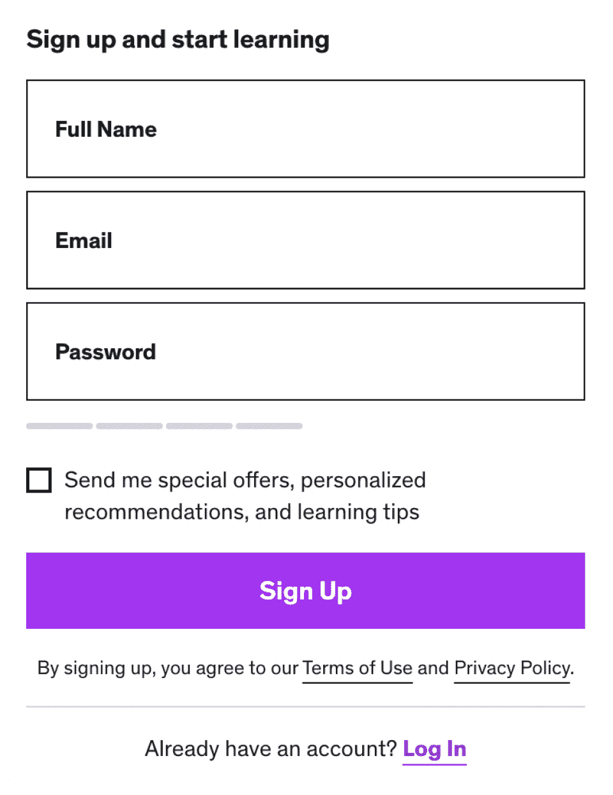
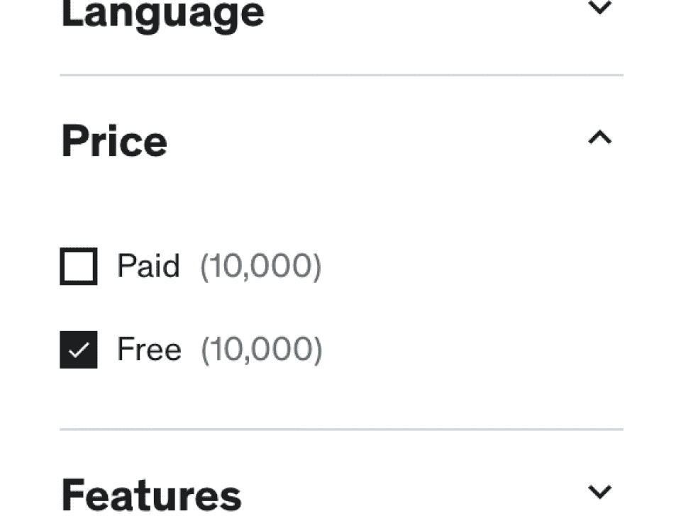

# Udemy 评论:利弊和替代方案[2023]

> 原文：<https://hackr.io/blog/udemy-review>

Udemy 是全球最大的在线学习平台之一。在这里，你可以找到几乎任何科目的课程，按照自己的进度学习。你可以在任何你喜欢的设备上在线或离线学习。Udemy 允许学生学习在生活或职业生涯中对他们有帮助的技能——而且是经济实惠的。

| **教官** | 4/5 |
| **课程** | 4.5/5 |
| **经历** | 5/5 |
| **总计** | 4.5/5 |

**Udemy 一览:**

*   Udemy 平台上有大约 20 万门课程。完成付费课程会给你一张结业证书。
*   有成千上万的免费课程可供选择。
*   与其他在线平台相比，Udemy 的课程价格适中。Udemy 频繁的大折扣销售进一步使价格触手可及。
*   尽管大多数课程质量都很好，但任何人都可以创建课程这一事实意味着一些不太优秀的课程可能会被漏掉。

那么，Udemy 值得吗？

如果你想学习新的东西，你可能会喜欢在线学习平台 Udemy。

想了解更多？这篇 Udemy 评论将向你展示你需要知道的关于当今最大的电子学习平台之一的一切，包括它的教程、价格等等。

**我们的总体优度评分:4.5/5**

## 什么是 Udemy？

Udemy 是 2023 年最受欢迎的在线学习平台之一，并且每天都在持续增长。今天，Udemy 拥有超过 190，000 门课程，超过 5，000 万名学习者，超过 7 亿名过去的课程注册者——尽管没有人知道这些数字在几个月后会是什么样子。

Udemy 的主要目标是为那些因为这样或那样的原因而无法接受教育的人带来新的知识和技能。平台提供深度折扣的平价课程或完全免费的课程来实现这一目标。

### Udemy 合法吗？

拥有超过五千万的学习者，很明显 Udemy 是一个合法的学习平台。该平台过去曾被提名并获奖。《福布斯》和 Mashable 等知名出版物也一直提到它。

### 谁应该使用 Udemy？

有了 Udemy 庞大多样的课程库，在这个平台上你能学到的东西是无限的。任何想学习新技能的人都可以从这里的课程中受益匪浅。因为课程有不同的级别，任何技能水平或经验的学生都能找到适合自己的。你可以来 Udemy，无论你是想[学习初学者编程](https://hackr.io/blog/coding-for-beginners)还是打磨你已经很高级的技能。

那么 Udemy 到底是为谁服务的呢？Udemy 是给想:

*   获得技能，帮助他们找到工作或促进他们的职业发展
*   转行
*   查找免费课程
*   发布课程
*   用他们的母语查找课程

得益于 Udemy Business，Udemy 还能很好地为那些希望投资员工的中小企业和企业服务。

### Udemy 是否得到认可和认证？

Udemy 不是被认可的教育机构，主要是因为课程可以来自任何人。由于这个原因，Udemy 证书并不总是被潜在雇主认可为官方证书。然而，一些雇主还是看重技能和经验，而不是文凭。

## Udemy 是如何工作的？

Udemy 最棒的一点是它简单的学习过程。有了直观的用户界面和用户体验，即使不太懂技术的学习者也可以轻松跟上。

**它是这样工作的:**

*   你创建自己的账户，然后开始在平台上搜索或浏览课程。
*   将您喜欢的课程添加到购物车中，并遵循结账流程。
*   你现在可以终身访问你的课程，只要你登录，你可以通过 Udemy 的网站或手机应用程序访问。
*   通过跟随课程中的讲座和视频开始学习！

### **如何开立 Udemy 账户**

按照以下步骤创建您的 Udemy 帐户。

**1。**点击 Udemy 网站右上方的 [**报名**](https://click.linksynergy.com/deeplink?id=jU79Zysihs4&mid=39197&murl=https%3A%2F%2Fwww.udemy.com%2F) 或通过手机 app 报名。

**2。**填写表格，点击“注册”按钮。

**3。**查看您的电子邮件以获取确认邮件。

就这样，你已经准备好学习了！

## **Udemy 的利与弊**

Udemy 对每个学生的情况都有好处吗？让我们来看看该平台的优缺点:

| **优点** | **缺点** |
| 价格合理的课程，经常会有很大的折扣

*   大多数人的可访问性(字幕、语言、离线学习)
*   提供免费课程
*   当你购买一门课程时，终身访问
*   如果你对你的购买不满意，30 天退款保证
*   近 200，000 门课程的庞大目录
*   付费课程的结业证书
*   物超所值
*   轻松便捷的支付

 | 证书不被认可，有时不被雇主接受

*   课程质量不一致
*   讲师支持并不总是可用的
*   Udemy 课程多少钱？

 |

## 教师设定我的课程价格。一般来说，课程价格从免费到 300 美元不等。即使讲师停止更新课程，您也可以通过购买获得永久访问权限。

课程经常以 70-90%的大折扣出售。Udemy 和讲师都可以设定这些销售。

或者，你可以订阅 Udemy 的个人计划，每月 29.99 美元，点播 6，000 多门课程，涉及 web 开发、IT、设计和插图、数据科学、数字营销、沟通、领导力等。

Udemy 提供免费课程吗？

### ****

是啊！Udemy 上有很多免费的课程。它们要么是免费推广的，要么是永久免费的。

你能返回我的课程吗？

### 是的。如果你购买了课程，如果你不满意，你可以在 30 天内退货。但是，如果您已经消费了课程的大部分内容，您将没有资格获得回报。Udemy 也行使酌情权，如果他们注意到连续退款，所以不要滥用退款制度！

Udemy 上有哪些课程？

## 当我们说 Udemy 有大量的课程目录时，我们不是在开玩笑。有近 200，000 个可用的类别，你会发现它们下面有很多子类别。

**该平台的一些主要类别包括:**

业务发展

*   信息技术和软件
*   财务与会计
*   人的能力发展
*   办公室生产力
*   营销
*   设计
*   摄影和视频
*   生活方式
*   健康与健身
*   教学和学术
*   音乐
*   **如何在 Udemy 上找到最好的课程**
*   当你探索你的选择时，你应该有信心进行你自己的 Udemy 课程回顾。以下是一些有用的提示，让你能够根据自己的需要选择最佳课程:

## **使用 Udemy 的过滤器**

当你浏览平台时，过滤器会帮助你找到最完美的课程。您可以使用 Udemy 的过滤器返回符合您的参数的搜索结果。Udemy 的过滤器包括:

### 课程评级

视频材料持续时间

*   主题
*   子类别
*   难度/水平
*   课程语言
*   课程价格
*   包括的功能(测验、练习/项目和模拟测试)
*   副标题
*   **浏览 Udemy 评论**
*   每门 Udemy 课程都有五星的学生评分，除非是全新的。

### 评语是一门课程质量的重要指标。为了获得最准确的评估，请检查有多少学生参加了该课程，以便更好地了解评级的可信度。

**检查课程发布或更新的时间**

许多领域都在不断发展，因此您可以考虑评估课程的发布日期或最新更新。例如，你不会想学习一门教授你过时的搜索引擎优化或编程信息的课程。

### **了解更多关于讲师的信息**

Udemy 上的每个课程网页都有课程作者的信息。讲师的传记中有一小段介绍他们和他们的经历。

### 我们的建议？随时研究导师，以评估他们的资格。

**预习课程**

每门课程都有一个关于课程基础的预览视频，这是一个衡量课程是否会教给你所寻求的知识和技能的绝佳方式。然而，有些预览并不总是完整或完全准确的。请查看每门课程的目录以获取更多信息。

### **考虑您的需求**

当你寻找合适的课程时，考虑你的学习需求和目标。考虑一些因素，比如课程的长度——它是否长到你没有时间完成它？还要考虑它的特点，比如它是否有作业或测验，来帮助你学以致用。即使一门课程被高度评价和重视，除非你能完成它，否则它对你是没有用的。

### **考虑你的预算**

虽然 Udemy 经常推出折扣很大的课程，但在购买之前考虑课程成本仍然是一个好主意。毕竟，如果你不小心花钱，即使是负担得起的课程加起来也要几百美元。

### 好消息是，如果你对课程不满意，你可以在 30 天内退货。但是，如果 Udemy 发现您过度退款，他们可以酌情拒绝退款请求。此外，如果您已经消费了一定数量的课程内容，则不能退款。

**最佳 Udemy 课程**

这并不意味着是一个 Udemy *courses* 的回顾，所以我们将只简单地提到课程，让你对平台上最好的课程有一个概念！

## Web 开发者训练营 2023 最近进行了改版，因此新老学员都可以享受这些变化！课程涵盖了你需要学习的关于 web 开发的一切，包括 [HTML](https://hackr.io/blog/how-to-create-a-website-using-html) ，CSS，Node，JS 等。它拥有超过 79 万名学生，评分为 4.7/5 颗星。

**[极限绘画课程——从初级到高级](https://click.linksynergy.com/deeplink?id=jU79Zysihs4&mid=39197&murl=https%3A%2F%2Fwww.udemy.com%2Fcourse%2Fthe-ultimate-drawing-course-beginner-to-advanced%2F)** 是一门教你如何绘画的课程。作为艺术的基本组成部分，绘画是一项需要掌握的重要技能。这门课程向你展示从基础到高级技术的一切。如今，该课程已有近 50 万名学生注册，评分为 4.6/5。

*   [**从零开始学习道德黑客**](https://click.linksynergy.com/deeplink?id=jU79Zysihs4&mid=39197&murl=https%3A%2F%2Fwww.udemy.com%2Fcourse%2Flearn-ethical-hacking-from-scratch%2F) 对于那些想要在[网络安全](https://hackr.io/blog/best-cybersecurity-certification)领域谋职的人来说是一个绝佳的选择，在这里你可以找到系统漏洞并修补它们。该课程拥有超过 50 万名学生，获得了 4.6/5 的优秀评分。

*   **[微软 Excel - Excel 从初级到高级](https://click.linksynergy.com/deeplink?id=jU79Zysihs4&mid=39197&murl=https%3A%2F%2Fwww.udemy.com%2Fcourse%2Fmicrosoft-excel-2013-from-beginner-to-advanced-and-beyond%2F)** 将向你展示使用微软 Excel 需要知道的一切。本 A-Z 课程介绍了基础知识，并深入探讨了适用于 Microsoft Excel 版本 2010、2013、2016、2019 和 Microsoft 365 的更高级的概念。这门课程有超过 100 万名学生，评分高达 4.7/5。

*   [**平面设计大师班——学习伟大的设计**](https://click.linksynergy.com/deeplink?id=jU79Zysihs4&mid=39197&murl=https%3A%2F%2Fwww.udemy.com%2Fcourse%2Fgraphic-design-masterclass-everything-you-need-to-know%2F) 是一门向你展示如何成为一名设计师的优秀课程。它教你平面设计的基础，甚至提供设计思维的入门。您还将学习如何使用一些行业领先的图形设计软件。特别是这门课程，已有超过 150，000 名学生，目前的评分为 4.7/5。

*   **[完整的 Blender Creator:初学者学习 3D 建模](https://click.linksynergy.com/deeplink?id=jU79Zysihs4&mid=39197&murl=https%3A%2F%2Fwww.udemy.com%2Fcourse%2Fblendertutorial%2F)** 非常适合想要使用 Blender 进行 3D 建模的学生。这个初级课程从基础开始，带你学习更高级的概念，让你更好地使用 Blender。自从出版以来，这门课程已经有超过 250，000 名学生。它目前的评分是 4.6/5。

*   **如想了解更多平台最佳课程:**[**2023 年 30+最佳 Udemy 课程查看**](https://hackr.io/blog/best-udemy-courses) **。**

*   **了解更多免费课程:** [**十大免费 Udemy 课程**](https://hackr.io/blog/free-udemy-courses) **。**

**我们的 Udemy 回顾 2023**

**这是我们基于各种标准的完整 Udemy 评论**

## 用户友好度:5/5 -对于学习者和教师来说，Udemy 的入门非常简单和直观。该平台的用户界面和用户体验干净、直观、易于理解。课程经过精心组织和分类，因此像您这样的学习者更容易找到您需要的内容。

便利性:5/5 -大多数人选择在线学习是因为他们很忙，需要根据自己的进度灵活学习。Udemy 可以提供这种便利，允许您通过移动应用程序(或您的 PC，如果离线选项已启用，但并不总是如此)离线完成您的教育。

*   **可访问性:4.5/5** - Udemy 可在各种平台上使用。它可以在任何有浏览器和互联网连接的电脑上运行。它也可以通过 iOS 或 Android 应用程序在移动设备上运行。根据课程的主题和要求，学生可以完全通过移动应用程序学习。该平台的许多课程都有多种语言版本，因此更多的人可以接受教育。此外，还可以提供字幕(如果教师允许的话)。*我们取消了半星课程，因为并非所有课程都可以在桌面上离线使用。*

*   **负担能力:5/5**——除了学习平台上的许多**免费**课程，付费课程通常是负担得起的。全价课程的价格从 3 美元到 300 美元不等。然而，频繁的大折扣销售使得这些课程更加实惠。

*   **认证:4/5**——Udemy 为完成 ***付费*** 课程的学员提供结业证书。该证书是炫耀的资本，也是你简历上的亮点，但是请记住，它不是一个正式的证书，因为 Udemy 不是一个被认可的教育机构。一些雇主认为 Udemy 证书是有效的，但不是所有的。记住这一点，因为仅仅依靠 Udemy 课程证书通常不足以找到工作。

*   **目录:5/5** - Udemy 随着时间的推移不断成长。截至 2022 年 5 月，平台拥有 19 万+课程。这些课程被分成各种科目的类别和子类别。了解从商业到 IT，甚至健康和保健的一切。

*   **课程质量:3/5** -每门课程在发布前必须通过质量检查。课程必须有高质量的音频和高清视频，至少有五节课和 30 分钟的视频。但是 Udemy 的课程质量参差不齐，因为任何人都可以成为讲师。一些最畅销的课程质量很高，因为是该领域的专家创造的。其他的都很平庸。在提交之前，一定要检查评论！

*   课程设置/结构:5/5-Udemy 上的自定进度课程有不同的形式和结构。值得注意的是，Udemy 课程通常会有视频、pdf、幻灯片和其他由讲师决定的资源。小测验、模拟测试和其他作业对想吸收所学知识的学生很有帮助。

*   Udemy 通过极其详细的知识库为学生和教师提供客户支持。你可以直接向 support@udemy.com 的[提问。](mailto:support@udemy.com)

*   *   虽然 Udemy 提供了出色的客户支持，但我们取消了 1.5 星，因为一些用户表示课程支持可能是中等甚至一般。教师处理他们自己的常见问题和支持部分。虽然你通常会找到有求必应、乐于助人的导师，但你可能偶尔会遇到一些太忙而没有时间回应的导师。

*   **付款和退款方式:5/5**
    *   Udemy 接受各种支付方式，包括借记卡和信用卡(Mastercard、Visa、Discover 和 American Express)、现金支付、PayPal、通过 Apple app stores 支付、通过 Google Pay 支付和银行转账。

*   作为一名教师，所有课程的费用都由 Udemy 支付，因此您不需要自己的支付处理器。Udemy 每月通过 Payoneer、PayPal 或直接银行存款(仅适用于美国用户)向讲师支付费用。有关更多信息，请查看他们的[支持页面](https://click.linksynergy.com/deeplink?id=jU79Zysihs4&mid=39197&murl=https%3A%2F%2Fsupport.udemy.com%2Fhc%2Fen-us%2Farticles%2F229604008-Instructor-Payment-Overview)。

*   如果你对在 Udemy 上学习没有 100%的把握，你可以从免费课程开始，看看你对这个平台的感觉如何。Udemy 提供 24/7 的免费课程，这使得它成为一个更好的学习场所。这些课程中的许多都有相当出色的质量，并且是相关的、受欢迎的科目。值得一提的是，有些课程是由作者选择永久提供的。
*   **最终裁决和评级**

那么，Udemy 到底有多好？对我们来说，它带回家一个坚实的 **4.5/5** **明星**。Udemy 是学习新事物和发展技能的绝佳方式，无论是为了个人成长、爱好还是职业。实惠的价格、丰富的目录、灵活性和可访问性造就了一个优秀的学习平台。

## Udemy 值得吗？ ***是*** **。**尤其是如果你能在大折扣销售期间购买课程。

我们在 Udemy 发现的唯一真正的问题是，你获得的证书不被许多雇主认为是“官方的”。如果你想要官方证书，试试 Coursera 或 edX，这都是很好的选择。

[访问 Udemy](https://click.linksynergy.com/deeplink?id=jU79Zysihs4&mid=39197&murl=https%3A%2F%2Fwww.udemy.com%2F)

Udemy 的替代品

Udemy 是学习新技能的好地方吗？通常是的，但是如果你在简历中寻找普遍接受的证书，这个平台可能不太适合。相反，您可以考虑:

## **[Coursera](https://imp.i384100.net/AoD4WK)** 是一个与大学和行业领袖合作的平台，提供各种主题的课程、项目、专业甚至学位。该平台在 7 天免费试用后每月收费 59 美元。或者，你可以每年支付 399 美元(有 2 周退款保证)。但是，如果你想参加一些证书或学位课程，你将不得不支付单独的价格。

edX 是一个在世界上最好的教育机构(超过 160 所大学，包括一些常春藤联盟)学习的绝佳平台。

*   **结论**
*   总的来说，Udemy 物有所值——尤其是如果你在投资一门课程之前等待销售的话。有很多方法可以验证课程的质量和是否符合你的需求——但是即使它不适合你，你也可以把钱拿回来。最后，Udemy 是获得更多职业发展技能的好方法，即使雇主并不总是认为这些证书有效。

## 我们希望这篇 Udemy 综述能为您探索这个有价值的平台提供帮助。如果你对其他学习网站感兴趣，可以考虑看看我们的 Coursera 评论！

[阅读我们的 Coursera 评论](https://hackr.io/blog/coursera-review)

**常见问题解答**

**1。Udemy 的课程值得吗？**

## 许多学生都会同意 Udemy 是值得的。然而，这取决于价格、价值和课程质量。同样重要的是要记住，虽然 Udemy 奖励完成大多数课程的证书，但这些证书不是“官方”证书，因为 Udemy 不是一个经认可的教育机构。

#### **2。我能给你找份工作吗？**

Udemy 可能不会马上给你一份工作。它能做的是给你获得工作或潜在晋升所需的技能。然而，如果你想在简历中获得更好的证明，可以考虑 Coursera 和 edX 这样的平台。

#### **3。Udemy 在美国有认证吗？**

世界各地的人都会问:“Udemy 被认证了吗？”可惜答案是**没有**。Udemy 在任何地方都没有被认可为教育机构，所以从该平台获得的证书并不总是被接受为官方证书。然而，如果你能证明你的技能，一些雇主仍然接受这些证书。

#### **4。Udemy 课程会过期吗？**

不，Udemy 的课程不会过期。如果您一次性付费购买了一门课程，您将获得该课程的**终身使用权**。这意味着无论发生什么，您都可以访问您购买的内容，即使课程创建者停止更新他们的产品。

#### **5。我可以离线看 Udemy 吗？**

是的，你可以在 iOS 和 Android 应用上离线观看 Udemy 课程。如果你在电脑浏览器上使用 Udemy，你仍然可以离线观看，但是有一些限制。在桌面上，有些课程没有启用离线功能。

#### **6。Udemy 有月租费吗？**

如果您只通过购买终身访问的课程来使用 Udemy，则无需支付月费。不过， **Udemy 计划订阅**(比如[个人计划](https://click.linksynergy.com/deeplink?id=jU79Zysihs4&mid=39197&murl=https%3A%2F%2Fwww.udemy.com%2Fpersonal-plan%2F))是有月租费的。在最初的七天试用期后，个人计划费用为每月 29.99 美元。

#### 7 .**。Udemy 值多少钱？**

我的课程价格从免费到 300 美元不等。教师为他们的课程定价。课程折扣高达 80%至 90%的情况并不少见。Udemy 或者导师都可以设置这些销售。

#### **Udemy 的个人计划费用为每月 29.99 美元，而 Udemy Business 的团队计划费用为每个用户/月 360 美元，适用于 5-20 个用户。*

Udemy course prices vary between free and $300\. Instructors set the prices for their courses. It’s not uncommon to find courses deeply discounted for as much as 80 to 90% off. Either Udemy or instructors can set these sales.

**Udemy’s personal plan costs $29.99 per month, while Udemy Business’ Team plan costs $360 per user/month for 5-20 users.*