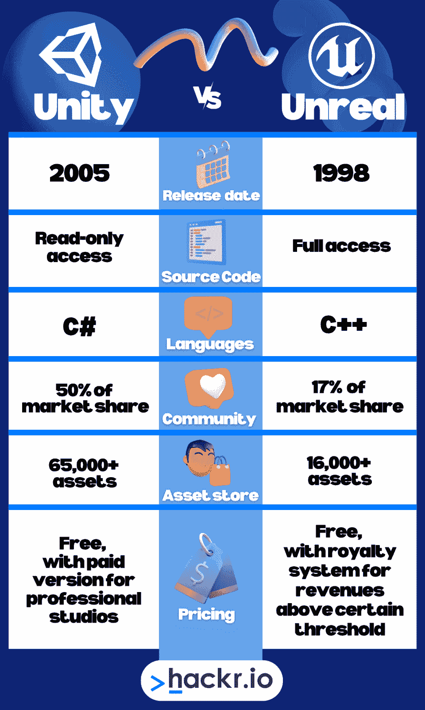

# Unity vs Unreal:应该选择哪个游戏引擎？

> 原文：<https://hackr.io/blog/unity-vs-unreal-engine>

游戏引擎是具有预构建游戏组件的软件开发环境，游戏开发人员可以使用这些组件为 PC、控制台、移动设备等规划和构建交互式视频游戏框架。

这些游戏设计工具为开发人员提供了现成的功能，如物理引擎、2D 和 3D 渲染、人工智能、物体碰撞检测、声音、颜色、脚本等，而无需从头开始编写这些元素的代码。

市场上有几个游戏引擎，但我们将重点放在统一与虚幻的流行问题上。那么，是虚幻引擎比 Unity 好，还是相反？让我们找出答案。

首先，我们总结了一下 Unity 和 Unreal Engine 的区别。

## **统一与虚幻:势均力敌的对比**

|  | **虚幻引擎**  | **统一** |
| **发动机类型** | 跨平台 | 跨平台 |
| **由**开发 | 史诗游戏 | Unity 技术公司 |
| **编程语言** | 用于开发的 C++ | C#开发 |
| **用途** | 为电脑、手机、游戏机等开发游戏 | 为电脑、手机、游戏机等开发游戏 |
| **特性** | 一个强大的多人游戏框架，VFX 和粒子模拟 | 2D 改进，动画，创建快照 |
| **源代码** | 开源 | 不是开源的。 |
| **定价** | 自由的 | 基本版是免费的 |
| **学习曲线** | 难学 | 直观的界面易于学习 |
| **图形** | AAA 游戏中使用的真实感图形 | 良好的整体图形，但不如不真实的精致 |

## **什么是团结？**

[https://www.youtube.com/embed/eXYUNrgqWUU](https://www.youtube.com/embed/eXYUNrgqWUU)

视频

Unity 是由 Unity Technologies 开发的跨平台游戏引擎，在苹果 2005 年世界开发者大会(WDC)上发布。

Unity 支持超过 25 种游戏平台，包括个人电脑(Windows、macOS、Linux)、游戏机(Xbox、PlayStation 等)。)，以及 PlayStation VR 和 Oculus Rift 等几个虚拟现实(VR)平台。

许多用户已经采用了 Unity 游戏引擎，因为它允许他们创建和体验 2D、3D 和 VR 游戏。它还被游戏之外的各种行业采用，包括电影动画和效果、汽车、建筑、工程和建筑。

**如果你想学习如何使用 Unity 来制作游戏，请查看游戏开发最佳 Unity 课程******和最佳 Unity 书籍******。******

 ****### **迄今为止团结的历史**

*   2005 年:为 Mac OS X 推出 Unity
*   **2007:** Unity 2.0 推出 50 项新功能
*   2008 年:苹果推出应用商店后，Unity 增加了对 iPhone 的支持
*   2010 年: Unity 3.0 发布，提供扩展的图形工具和 Android 支持
*   **2012:** Unity 4.0 推出& Unity 被游戏开发者杂志评为顶级手机游戏引擎
*   2013 年:脸书为 Unity games 增加 SDK 集成
*   **2015:** Unity 5.0 发布，增加了平台支持，改进了高清图形、照明和音频以及虚拟现实支持
*   **2017:** Unity 5.6 (Unity 2017)发布，提供实时图形渲染和与 3D 设计工具的集成
*   **2017:** Unity 2017.2 发布，增加了电影和视频工具
*   **2018:** Unity 2018 作为第一个集成了机器学习(ML)工具的引擎推出，同时还有可脚本化的渲染管道
*   **2019:** 发布面向数据的技术堆栈(DOTS)以改进处理
*   **2020:** 推出混合和增强现实工作室(MARS)
*   **2021:** Unity 2021 推出增强的多人游戏库和高清渲染

### **Unity 的主要特性**

*   易于理解的快速游戏开发工作流程和架构
*   通过 AAA 显卡、流畅的帧速率和高清音频制作高质量游戏
*   Unity Scripting API 提供了对游戏特性的精确控制
*   专用工具使创建 2D 或 3D 游戏变得容易
*   在所有平台上进行一键式游戏部署，包括电脑、手机或游戏机
*   大型资产商店中现成的游戏资产缩短了开发时间
*   可以使用内部包和资产来扩展 Unity 引擎
*   一系列渲染管道选项可优化游戏性能
*   创建和销毁自定义游戏对象的能力

### **使用 Unity 制作的游戏**

当问及 Unity 是否比虚幻引擎更好这个问题时，看看有抱负的独立游戏开发者和游戏工作室用 Unity 游戏引擎制作了什么会有所帮助。结果是**一些最受欢迎的游戏:**

*   口袋妖怪 go 使命召唤:手机
*   顶盖
*   纪念碑谷
*   Ori 和盲目的森林/Ori 和精灵的意志
*   糖豆人
*   空心骑士
*   **Unity 游戏引擎优点&缺点**

### **优点**

| **缺点** | 免费使用 |
| 图形质量低于虚幻引擎 | C#代码开发速度很快 |
| 资产存储质量是可变的 | 简单易学 |
| 不太受 AAA 游戏工作室的欢迎 | 庞大的用户群 |
| 缺乏实时多人游戏能力 | 广泛的 2D 游戏支持 |
| 缺乏开源代码库 | 庞大的资产商店 |
| [完成 C# Unity 游戏开发者 3D](https://click.linksynergy.com/deeplink?id=jU79Zysihs4&mid=39197&murl=https%3A%2F%2Fwww.udemy.com%2Fcourse%2Funitycourse2%2F) |

**什么是虚幻引擎？**

## 

[https://www.youtube.com/embed/qC5KtatMcUw](https://www.youtube.com/embed/qC5KtatMcUw)

视频

第一代虚幻引擎由 Tim seve eny(Epic Games 创始人)于 1998 年发布，其开场展示是第一人称射击游戏(FPS)游戏《虚幻》。

虚幻引擎以其可移植性和对各种平台的支持而闻名，包括 Windows，macOS，和 Linux PCs，游戏主机(PS4，PS5，Xbox One，任天堂 Switch 等。)，以及 iOS 和 Android 手机。

自问世以来，Unreal Engine 已被证明是创建高清图形和下一代物理效果的强大选择，在获得各种奖项的同时，也赢得了行业标准的声誉。

考虑到这一点，许多有抱负的游戏开发者在选择游戏引擎时选择虚幻就不足为奇了。

**无论你是游戏开发新手，还是想扩展你的技能以包括虚幻，请查看这些** [**课程，学习如何使用虚幻引擎**](https://hackr.io/tutorials/learn-unreal-engine) **。**

**虚幻引擎的历史至今**

### **虚幻引擎第一代**

#### 1995 年:蒂姆·塞弗尼开始开发

*   **1998:** 以 FPS 游戏《虚幻》出道
*   1998 年:集成的未隐藏编辑器，创新的图形、颜色和纹理
*   1999 年: 16 个外部项目使用了该技术
*   **虚幻引擎 2**

#### 2002 年:推出增强的渲染、电影剪辑和对 3D 库的集成支持。多人射击游戏，美国的军队是第一个发布

*   2002 年:《虚幻冠军》是 Xbox Live 上的首批游戏之一
*   2003 年: Karma 物理引擎，通过碰撞和刚体接触实现车辆物理，用于虚幻锦标赛 2003
*   2004 年:虚幻锦标赛 2004 通过 Karma 物理引擎为大型锦标赛提供了增强的车辆物理性能
*   **虚幻引擎 3**

#### **2006:** 面向 Windows、PS3 和 XBOX 360 发布，支持高动态范围渲染和可编程着色器硬件

*   2006 年:第一款游戏，Xbox 360 的战争机器和 Windows 的 Robobiltz
*   2010 年: Android 和 iOS 支持
*   2011 年:为 Wii U 开发增加了对 Adobe flash player 的支持
*   2013 年:与 Mozilla 合作，为网络游戏提供支持
*   **虚幻引擎 4**

#### **2014:** 推出面向非编码人员的蓝图可视化脚本，以及增强的照明功能，以取代预计算的灯光效果

*   **2014:** 对使用虚幻引擎构建的游戏实行月订阅付费模式和 5%的版税费用
*   **2015:** 免费提供未来更新，但仍对产生足够收入的游戏收取 5%的版税
*   **虚幻引擎 5**

#### **2022:** 推出 Nanite 引擎，允许用户导入 3D 渲染图形或照片来创建摄影测量世界，Lumen 以增强的照明取代光照贴图，Shadow Map 改善阴影

*   **2022:** 针对下一代游戏主机进行优化，包括 PlayStation 5 和 Xbox 系列
*   **2022:** 游戏销售的 5%版税，除非在 Epic 游戏商店出售
*   **虚幻引擎的主要特性**

### 面向非编码游戏开发者的蓝图可视化脚本系统

*   用于丰富音频的虚幻音频引擎和元声音
*   支持增强现实(AR)、混合现实(MR)和虚拟现实
*   FBX、美元和 Python 脚本的管道集成
*   用虚幻编辑器编辑世界建筑和风景
*   包含机器学习的角色动画
*   用于渲染、照明和材质的 Nanite 引擎
*   粒子模拟和效果
*   虚幻运动图形(UMG)用户界面
*   C++源代码访问和 API
*   **使用虚幻引擎制作的游戏**

### 如果你正在试图找出虚幻引擎与 Unity 之战中哪个更好，那么它可能会帮助你知道一些最高质量的 AAA 游戏工作室已经使用虚幻引擎制作了一些市场上最知名的**游戏:**

《堡垒之夜》

*   星球大战绝地:堕落秩序
*   地狱之刃:塞纳的牺牲
*   俄罗斯方块效应
*   齿轮 5
*   **虚幻引擎优点&缺点**

### **优点**

| **缺点** | 免费使用和开源 |
| 由于 C++，更难学 | 卓越的 3D 逼真图形质量 |
| 缺乏 2D 能力 vs 团结 | 受 AAA 工作室欢迎 |
| 与 Unity 相比，较小的资产存储 | 实时多人游戏功能 |
| 较小的用户群 | 渲染速度比 Unity 快 |
| 难以在较旧的硬件上运行 | **统一与虚幻的相似之处** |

## 尽管存在竞争，Unity 和 Unreal 都为游戏设计和开发提供了类似的工具和功能，包括:

能够为大多数行业标准软件生成 AAA 级质量的图形和桥接

*   一个广泛的工具箱，包括地形编辑器、动画、物理模拟和虚拟现实支持等
*   **统一与虚幻的区别**

## ****

在决定使用虚幻引擎还是 Unity 时，您应该记住的一些主要区别包括:

**源代码:**虚幻引擎提供对源代码的完全访问，而 Unity 提供只读访问

1.  **发布日期:**虚幻引擎于 1998 年首次亮相，而 Unity 于 2005 年宣布发布
2.  **语言:**虚幻引擎用 C++，Unity 用 C#，通常被认为比 C++学起来更快，更适合新手游戏开发
3.  两个引擎都有一个庞大的活跃用户群体，但 unity 目前占据了将近 50%的市场份额，相比之下，Unreal 只占 13%
4.  文档:两者都提供了详细的文档来解释它们的工具和特性
5.  **资产商店:**资产商店允许用户为他们的游戏下载新的贴图或道具。虚幻提供大约 16，000 项资产，而统一提供超过 65，000 项资产
6.  **图形:**这两种工具都能生成出色的图形，但虚幻引擎更适合最高质量的图形和环境细节
7.  **渲染:** Unreal 支持比 Unity 更快的渲染，可以加快后期处理和游戏开发的速度
8.  定价:虚幻引擎是完全免费的，但收入超过某个阈值时会有一个版税系统。Unity 也是免费的，但为专业工作室提供付费版本(基于许可数量)
9.  **结论:虚幻还是统一？**

## 统一与虚幻之争的答案并不简单，因为如果没有这两个令人难以置信的引擎，游戏开发将是难以想象的。

虽然两者各有利弊，但正确的选择最终取决于开发人员的需求和语言偏好。

有了 Unity，游戏开发者可以使用一个因其庞大的用户群和对 2D 和 3D 游戏的出色支持而闻名的引擎；另外，由于使用了 C#，新开发人员更容易学习。

由于其高保真和逼真的 3D 图形，虚幻引擎是构建大型和更复杂游戏的理想选择。然而，需要知道(或学习)C++可能意味着新的编码人员会发现它更难使用。所以，虚幻引擎可能更适合有经验的开发者。

如果你还在试图决定是使用虚幻还是统一，那么看看 2022 年游戏的最佳编程语言****可能会有所帮助。那些喜欢游戏设计概述而不是特定编程语言的人，应该去看看大师班[的威尔·莱特课程。它从一个行业老手的角度涵盖了设计和理论。](https://masterclass.pxf.io/c/2890636/1357434/16021)****

 ****常见问题解答**

## **1。unity vs . Unreal:2022 年有什么更好的游戏引擎？**

#### 这取决于开发者的要求。虚幻是复杂的，但它可以构建高质量的环境。Unity 更简单，非常适合小规模游戏。

**2。虚幻引擎比 Unity 好吗？**

#### 没有一个引擎比另一个更好，因为它们各有优缺点。

**3。Unity 和虚幻引擎哪个更适合新手？**

#### Unity 通常更适合初学者，因为它更容易学习和用户友好。

**4。虚幻比统一难吗？**

#### Unreal 比 Unity 更难学，因为你需要用 C++。所以如果你是初学者，你可能更喜欢 Unity。

Unreal is more difficult to learn than Unity because you need to use C++. So if you’re a beginner, you might prefer Unity.******