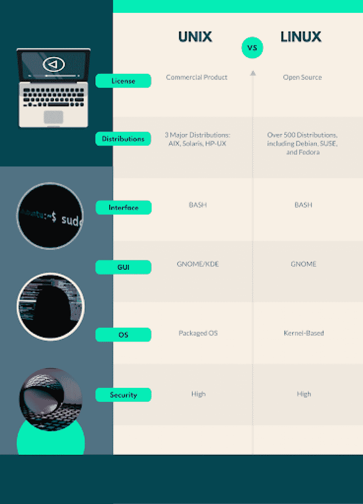

# Unix vs Linux:区别在哪里？[已更新]

> 原文：<https://hackr.io/blog/unix-vs-linux>

对于外行人来说， [Unix](https://unix.org/) 和 [Linux](https://www.linux.org/pages/download/) 几乎是一样的。这是有道理的——Linux 最初是基于 Unix 操作系统的。但是 Linux 和 Unix 是一样的吗？不完全是。这两个系统在几十年前就已经分开了，从那以后发生了相当多的变化。

## Unix 和 Linux 有什么区别？

关于 Linux 与 Unix 的问题，你需要理解的第一件事是 Linux 实际上不是一个操作系统。它是在发行版中实现的开源内核*。Unix *是*一个打包的操作系统。因此，虽然你可以有一台运行“Unix”的计算机，但你不能有一台运行“Linux”的计算机——这台计算机将运行 Linux 的一个特定的*发行版*。*

让我们深入了解一下 Unix 和 Linux 的区别，包括 Unix 和 Linux 命令的区别，以及关于 Unix Linux 区别你需要知道的其他一切！

[Unix 初学者](https://click.linksynergy.com/deeplink?id=jU79Zysihs4&mid=39197&murl=https%3A%2F%2Fwww.udemy.com%2Fcourse%2Funix-for-beginners%2F)

## **一览:Unix vs Linux**

贝尔实验室早在 1965 年就开发了 Unix 系统。1991 年，Linus Torvalds 发布了类似 Unix 的 Linux 系统。今天，Unix 基本上已经不存在了；它只用于最大的数据中心。与此同时，Linux 有大约 500 个 Linux 发行版(分销商)正在积极部署中。

今天的大多数人永远不会看到 Unix 系统。Unix 系统将主要存在于金融、政府或医疗保健等行业——在这些领域，改变技术是极其困难的，或者安全性是非常重要的。

Linux 和 Unix 都是高度稳定、安全的系统。有些人可能会选择 Linux 或 Unix，而不是 Microsoft Windows 操作系统或 macOS，因为它们提供:

*   更好地控制操作环境
*   更安全(Linux/Unix 上的病毒数量少得可怜)
*   显著提高正常运行时间。

那么在 Unix 和 Linux 的问题上，哪个更好呢？让我们找出答案。

## Linux 和 Unix 的主要区别是什么？

Linux 被设计为 Unix 的开源版本，这就是为什么 Linux 和 Unix 看起来如此相似。因为 Linux 已经获得了如此巨大的市场份额，并且因为它是基于 Unix 的，所以它通常被称为基于 Unix 的系统——所有的 Linux 衍生产品都是如此。

但是这两个系统有很大的不同。

Unix 是一个专有系统，而 Linux 是开源的，每个人都可以使用——这是最大的区别。开源给 Linux 带来了许多优势。Linux 已经以称为“发行版”或“分发版”的变体形式被修改以适应许多任务。如果 Linux 出现问题，社区通常会很快解决。

尽管 Unix 是一个“打包”的系统，但是理解 Unix 本身并不分布系统是很重要的。更确切地说，Unix 许可基于 Unix 标准 *的[系统。](https://www.opengroup.org/membership/forums/platform/unix)*这就是为什么 Unix 有多个版本的原因，所有版本都必须满足这些标准才能获得许可。

用户和开发人员更有可能在 Unix 上遇到 Linux。智能手机、物联网设备、台式电脑和服务器上都有 Linux。同时，Unix 主要是为高级服务、工作站和大型机保留的。如果有人在 Unix 服务器上工作，他们已经非常了解它了。

大多数开发人员至少对 Linux 略知一二。相反，许多开发人员和用户永远不会在野外遇到 Unix 机器。

也就是说，理解 Linux 和 Unix 机器的深度是有好处的。具体来说，基于 Unix 的专有系统，如 Solaris，可以获得高薪和受欢迎的劳动力。Unix 是一个正在消失的技能集；每年，有经验的 it 系统管理员越来越少。

## **Linux vs Unix 中的命令**

Linux 和 Unix 在命令方面的操作几乎相同。事实上，有人可以将一个脚本从 Linux 移植到 Unix(反之亦然)，并且很可能不需要任何修改就可以工作。Linux 被设计成模仿 Unix。那些在 Unix 上操作的人可以无缝地迁移到 Linux，也可以从 Linux 迁移到 Unix。

虽然命令有所不同，但其中许多都可以归结为单独的分发包。例如，Kali Linux 是专门为安全分析设计的，具有专用的安全功能。其他更通用的 Linux 发行版的命令彼此非常相似。

简而言之，大多数了解一个系统的人确实“了解”另一个系统，因为 Linux 是基于 Unix 模型构建的。

## **Linux vs Unix 中的发行版**

开源解决方案的一个主要优势是它可以根据需要进行修改。Linux 是一个通用的*内核*，已经在超过 500 个活跃的操作系统发行版中实现。

三个最流行的 Linux 发行版是:

*   [Debian](https://www.debian.org/) 。Debian 是一个免费的 Linux 发行版，有一个繁荣活跃的社区。它最初是在 1993 年 Linux 内核发布后不久建立的，现在仍然是一个流行的发行版。
*   [SUSE](https://www.suse.com/) 。SUSE 是由一家销售 Linux 产品的公司设计的开源 Linux 发行版。它是第一批直接面向企业销售的 Linux 发行版产品之一。
*   [Fedora](https://getfedora.org/) 。Fedora 开发于 2003 年，是一个较新的 Linux 发行版，尽管它是在 20 年前开发的。它由 Red Hat 和 IBM 赞助，并得到了社区的支持。

许多发行版实际上是基于其他发行版的，所以你可能有多个版本的 Debian、SUSE 或 Fedora。最初的 Linux 内核只是分布在软盘上的源代码，然后由用户实现以创建文件管理系统。

不知道第一个 Linux 发行版是什么——但是有一些很好的猜测。中冶中期 Linux，软着陆 Linux 系统，ygdrasil Linux/GNU/X 都是最早的。

还应该注意的是，尽管 Linux 是开源的，但有些发行版*是商业的*。

另一方面，Unix 是一个完全专有的系统。虽然有模仿 Unix 的系统(如 Minix)，但只有少数系统真正基于 *Unix，*包括:

*   **AIX:**IBM 开发的基于 Unix 的环境。
*   **Solaris:**Sun Microsystems 使用的专有系统。
*   **惠普-UX:** 惠普为其服务器实施的 Unix 系统。

在上面的例子中，Unix 被授权给特定的公司(IBM、Sun 和 HP)为他们的机器创建 Unix 系统。这也是 Unix 在诸如服务器群这样的大规模企业运营中仍然占据优势的主要原因之一。

Linux 和 Unix 发行版可能会令人困惑。社区可能将 Linux 或 Minix 称为 Unix 的“风味”、基于 Unix 的系统或类似 Unix 的系统。事实上，这些系统都是受 Unix 的启发。它们不是构建在 Unix 本身上的。

类似地，BSD 系统是早期 Unix 规范的一个分支，由 Berkeley Software Distribution team 开发——但它不是 Unix。

## **Linux 与 Unix 的市场份额**

当您查看 Unix/Linux 的市场份额时，Unix 和 Linux 之间的差异变得非常明显。令人震惊的是，96.3%的世界顶级服务器[运行在 Linux](https://hostingtribunal.com/blog/linux-statistics) 上。操作系统的[桌面市场份额是 Windows (45.3%)、mac OS (29.2%)、Linux (25.3%)和 Unix/BSD (0.1%)。](https://en.wikipedia.org/wiki/Usage_share_of_operating_systems)

换句话说，尽管 Unix 对计算世界有很大的影响，但它的市场份额非常小。Unix 受欢迎的唯一原因是“类 Unix”操作系统通常包含 Linux。

但是 Unix 和 Linux 的区别并不小；Unix 是一个专有系统这一事实很重要。

## **Linux vs Unix 支持**

Linux 支持偏向于基于社区的，尽管有商业 Linux 系统提供强大的、付费的客户支持。

Unix 支持通常由销售 Sun、HP 和 IBM 工作站和服务器的经销商提供。还有 SGI 系统，也就是基于 Unix 的 IRIX 系统。

## **Linux 与 Unix 的使用**

Unix 和 Linux 之间的一个主要区别是，Unix 用于大型企业服务器，而 Linux 更通用；它用于从服务器到桌面环境的所有东西。

从最终用户的角度来看，Unix 对 Linux 几乎是一个无关紧要的问题。最终用户实际上可能看不到 Unix 和 Linux 之间的许多差异，因为 Unix 和 Linux 命令之间的差异非常小。

Linux 也经常用于服务器环境，因为 Linux 比 Windows 或 Mac OSx 安全得多。大多数超级计算机、移动设备和互联网服务也使用 Linux。与此同时，尽管 Unix *被*用在许多专有服务器环境中，但它的使用正在淡出。

## **在 Linux vs Unix 中的就业**

实际上，Unix 管理员有 45，000 个工作，而 Linux 管理员有 106，000 个工作。这是一个显著的区别——但没有人们想象的那么大，因为 Linux 更加普遍。部分原因可能是因为 Unix 和 Linux 经常被混为一谈。

Linux 或 Unix 中的大多数工作岗位将是系统管理。系统管理员需要非常熟悉操作系统环境。他们必须能够监控、维护、配置和正确排除系统故障。

Unix 管理员的平均年薪是 8 万到 13 万美元(T1)，Linux 管理员的平均年薪是 7.7 万到 10.9 万美元(T3)。这种差异很可能是因为 Unix 管理员本来就要处理大型企业级系统。

Linux 或 Unix 的专家不太可能因为工作而受伤。这两个系统都需要管理和架构，为有抱负的专家提供乐观的工作保障和收入。

| **参数** | Unix 系统 | **Linux** |
| **执照** | 商业 | 开源 |
| **由**开发 | 莱纳斯和 GNU 基金会 | 在& T 实验室 |
| **文件系统支持** | 小于 Linux | 更 |
| **支持的文件系统** | jfs，gpfs，hfs，hfs+，ufs，xfs，zfs | Ext2，Ext3，Ext4，Jfs，ReiserFS，Xfs，Btrfs，FAT，FAT32，NTFS |
| **操作系统** | 打包操作系统 | 基于内核的 |
| **图形用户界面** | 普通桌面环境 | KDE 和侏儒 |
| **用例** | 工作站、服务器和个人电脑 | 从个人电脑、服务器、平板电脑和智能手机到大型机 |
| **界面** | 谍影重重外壳 | BASH(伯恩再出壳) |
| **支持的架构** | PA-RISC 和安腾机器 | 对于超过 20 种 CPU 类型 |
| **分布** | SunOS、Solaris、SCO UNIX、AIX、惠普/UX、ULTRIX 等。 | Ubuntu，Debian GNU，Arch Linux 等。 |
| **到日期**为止发现的病毒 | 85 -120 病毒 | 60-100 个病毒 |
| **价格** | 不自由 | 免费 |

## **常见问题解答**

#### **1。我有 Linux 还是 Unix？**

你有 Linux。如果你有 Unix，你会知道的。Unix 是一个专有系统，目前只有很少的应用程序，主要用于非常广泛的服务器阵列。Linux 受到 Unix 的启发，但不是直接从它派生出来的。Linux 系统看起来非常像 Unix 系统，但它本身不是 Unix 系统。

#### **2。Mac 是 Unix 还是 Linux 操作系统？**

很多人认为 Mac 是 Linux 系统或者 Unix 系统，其实不是。Mac 实际上是建立在免费的 BSD“Unix”之上的，这是一个很早就脱离了 Unix 规范的系统。因此，虽然 Mac OS 是建立在类似 Unix 的内核上，但它不是 Unix 或 Linux 系统。

#### **3。还有人用 Unix 吗？**

许多企业级服务器银行仍然使用 Unix。HP、IBM 和 Sun 仍然在他们自己专有的 Unix 版本上运行他们的服务器。Unix 仍然是一个最新的成熟系统——它只是没有太多的市场份额。因为 Linux 是一个拥有 500 多个发行版的开源系统，所以即使在服务器行业，它也能战胜 Unix。

#### **4。Ubuntu 是基于 Unix 的操作系统吗？**

Ubuntu 是众多活跃的 Linux 发行版之一。它基于 Linux 内核，特别是以前的发行版(Debian)。它是当今最流行的 Linux 发行版之一。可以说 Ubuntu 是一个基于 Unix 的系统，因为它是一个 Linux 系统，因为 Linux 是基于 Unix 的。但它不是 Unix 系统；它只是基于 Unix 上的。

## **我应该学习 Linux 还是 Unix？**

除非你对特别小众的工作感兴趣，**不如学 Linux** 。大多数 Linux 管理员将能够使用 Unix，反之亦然。如果您有机会使用 Unix 系统，您可能会使用该系统的专有版本，比如操作 Sun 微系统。在这种情况下，无论如何你都需要学习那个专有版本。

当考虑 Unix 和 Linux 时，请记住它们作为操作系统提供非常不同的功能。Linux 仍然是世界上最受欢迎的操作系统之一，许多发行版都在维护中，甚至刚刚出现。同时，Unix 是一种相对过时的专有技术，可能会随着时间的推移而逐渐消失。

**如果你对学习 Linux 感兴趣，你可以:**