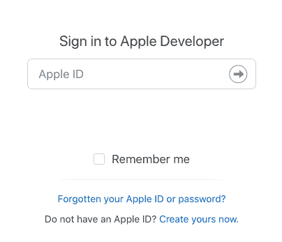
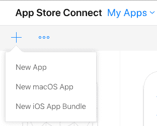
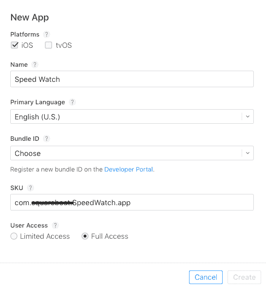
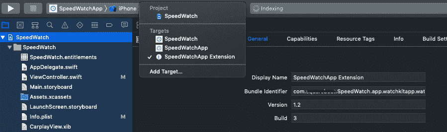
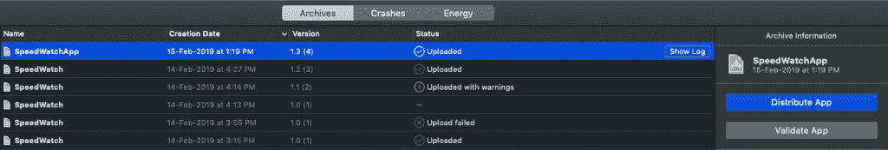
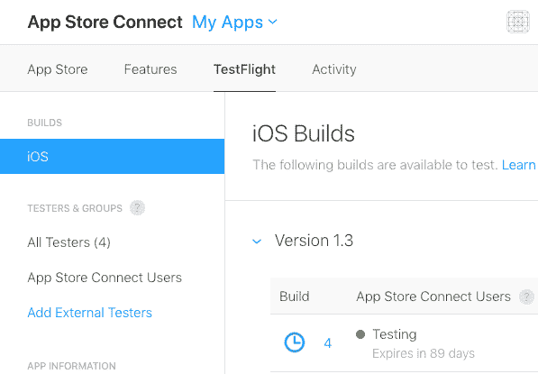
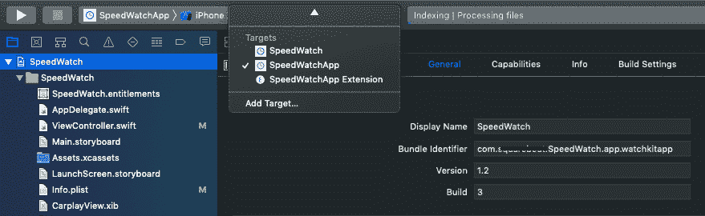
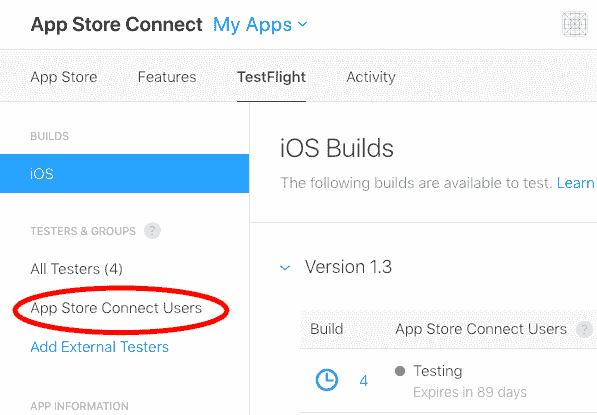

# 在 App Store 上传 WatchOS 应用

> 原文：<https://hackr.io/blog/upload-watchos-app-on-app-store>

Apple Watch / watchOS -“人与科技关系的新篇章”
Apple watch 让你的应用体验离用户更近了一步。Apple watch 使用 watchKit 框架，让你可以为 Apple watch 创建应用程序，并将其与你的原生应用程序相链接。
在本文中，你将学习如何在 App store 上传你的第一款 WatchOS 应用。这需要一个工作的 WatchOS 应用程序，如果你没有任何项目，请阅读这篇文章:[你的第一个 WatchOS 应用程序，并建立一个。](https://www.raywenderlich.com/287-watchos-4-tutorial-part-1-getting-started)

## 在 App Store 上传 WatchOS 应用

### 要求

1.  你需要一个开发者账户。[登录或者买一个](https://developer.apple.com/)。
2.  包含 3 个目标应用程序的 Xcode 项目:iOS 应用程序、WatchOS 应用程序和 Watchkit 扩展应用程序。

### 步伐

*   点击我的应用程序，在那里创建一个新的应用程序。

*   创建一个新的 iOS 应用程序，选择相应的应用程序 ID，并将其复制到 SKU

*   现在在 Xcode 中打开你的项目，从文件选择器中选择 app，进入常规设置，使用开发团队对 App 进行签名。
*   选择监视应用程序，并确保构建标识符遵循该模式。watchkitapp

*   遵循 watchkit 扩展应用程序的步骤 4，并确保构建标识符遵循模式. watchkitapp.watchkitextension

### 将应用上传到 App store

若要在 App store 上上传新应用程序

*   选择 iOS 应用和归档应用。
*   在管理器窗口中，选择您的应用程序，然后选择上传应用程序

*   随后按照说明操作，你会在 App Store Connect 中看到你的应用在试飞中上传

*   要单独更新手表
*   从 Xcode 中选择 Watchkit app only

*   增加内部版本号和版本号
*   之后按照上面的步骤。

### 测试手表应用程序

*   从 App Store connect 添加测试人员

*   在 iPhone 中打开试飞应用程序
*   在 iPhone 上安装应用程序之后，你会看到一个切换按钮，将应用程序安装在 iWatch 上

### 结论

现在你可以通过 TestFlight 在手表上运行你的应用了。WWDC19 发生了，公布了 watchOS6 和 SwiftUI。有了它，你不需要为手表应用程序安装 iOS 应用程序，它现在有一个专用的应用程序商店，这意味着现在你可以为 Apple Watch 创建独立的应用程序。现在你可以使用 SwiftUI 制作 iOS 应用、watchOS 应用、tvOS 应用和 iPadOS 应用。[这里是 iOS 的 SwiftUI 示例项目的示例代码](https://github.com/squareboat/swiftUI-sample-project)。第一个使用 SwiftUI 的 watchOS 应用程序的博客即将推出。

**人也在读:**