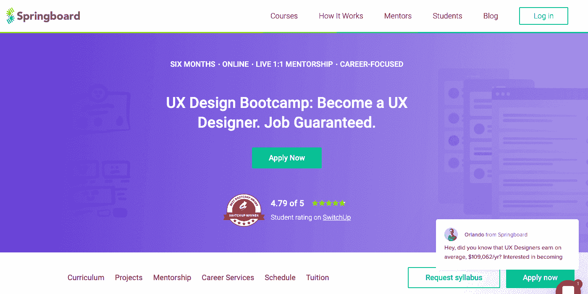
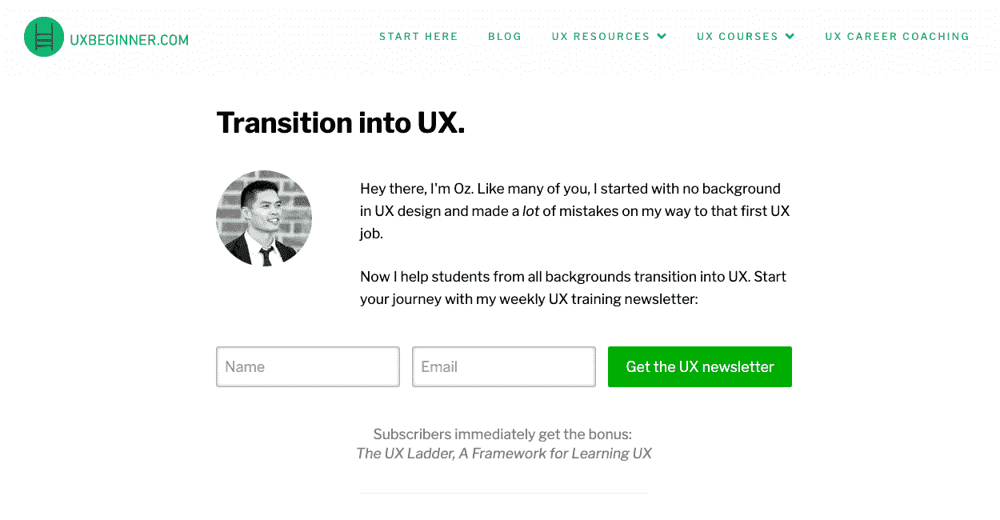
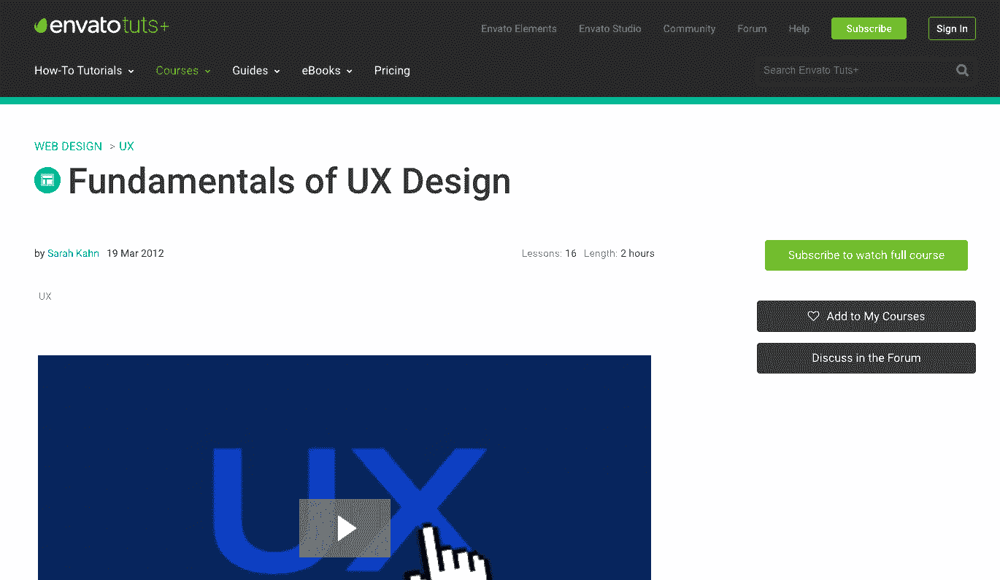
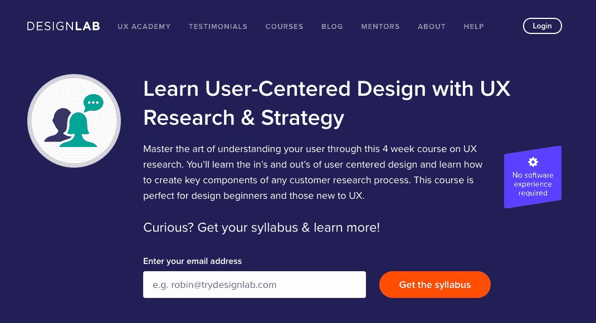
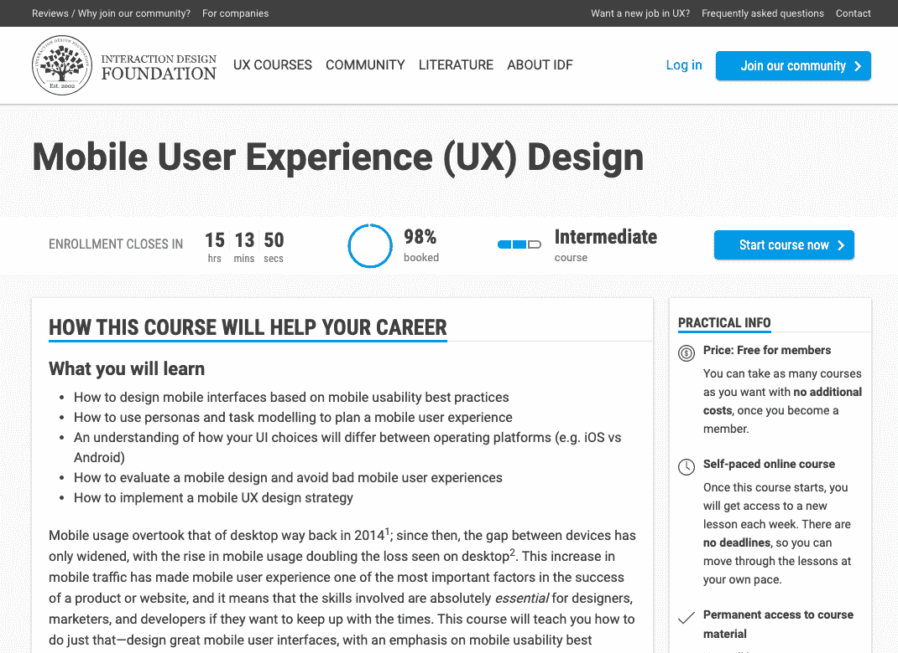
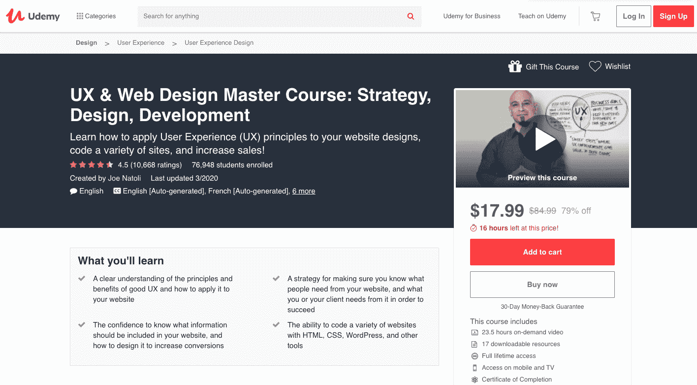
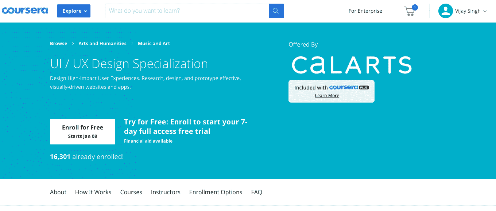
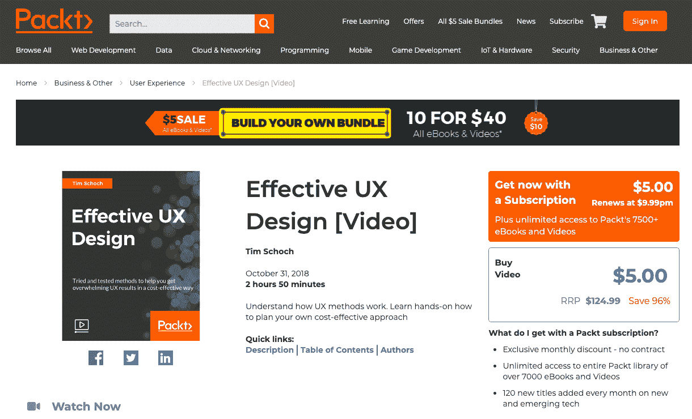
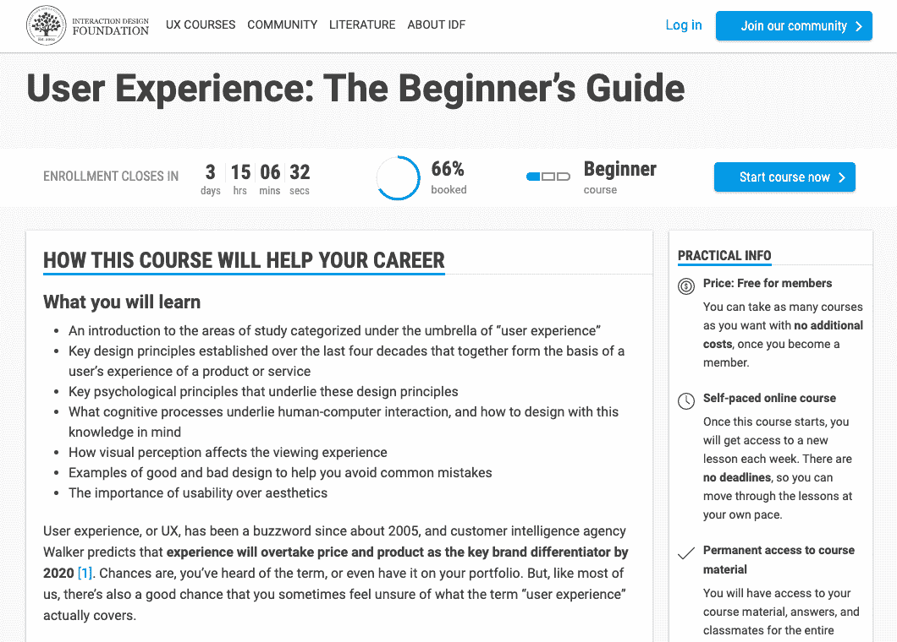
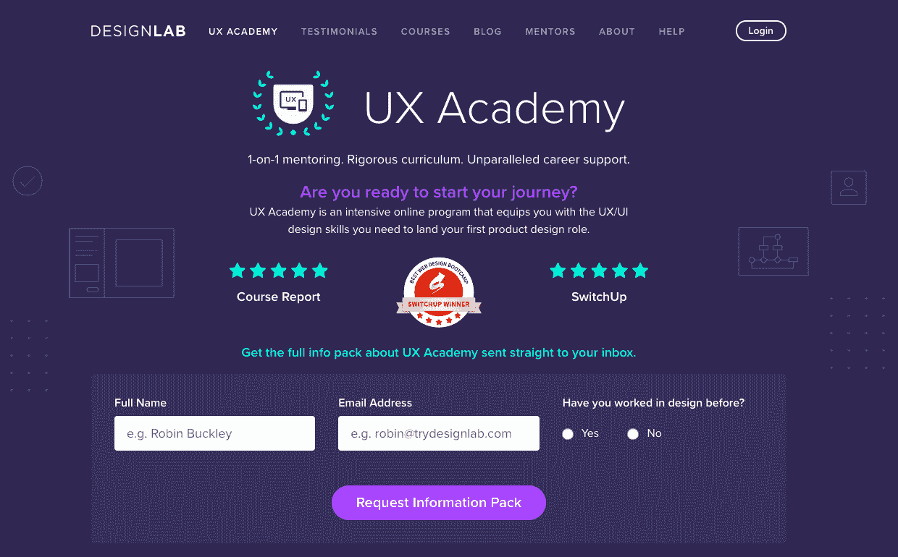

# 2023 年要学的 10 门最佳 UX 设计课程[更新]

> 原文：<https://hackr.io/blog/ux-design-courses>

根据维基百科，用户体验或 UX 指的是一个人在使用特定产品、服务或系统时的态度和情绪。也就是说，这是现代人机交互的一个重要方面。

考虑到上面提到的意义，我们可以推断 UX 设计是指设计和开发产品、系统或服务的视觉外观，从而成功地激发用户的情感。

今天，UX 设计是一个欣欣向荣的利基。由于 UX 设计的迅速发展，许多人都趋之若鹜，以获取最大利益。

## **UX 设计课程，开发和激发你的创造力**

如果你也对 UX 设计感兴趣，或者想在这方面做得更好，那么这里是我们推荐的 10 个最好的在线 UX 设计课程:

[****](https://www.springboard.com/workshops/ux-career-track/)

类型-6 个月在线课程
级别-中级

UX 设计训练营(保证工作)课程是为那些想成为 UX 设计师的人准备的。由毅进计划提供，为期 6 个月的课程包括各种小型项目和三个组合项目，其中一个是顶点项目和一个 40 小时的工业设计项目。

除了获得一对一的指导，UX 设计训练营(工作保证)课程还能让你从经验丰富的教练和学生顾问那里获得宝贵的职业建议。UX 课程还保证你在完成课程后的六个月内获得一份 UX 的设计工作；否则你会得到全额退款。

UX 设计训练营的完整课程包括与职业相关的作业、动手设计项目、深度文章和视频。

该课程要求候选人至少有一年的书面专业经验或用户设计或开发领域的学位。

**涵盖的主题:**

*   设计冲刺
*   设计思维
*   空状态
*   阅读和设计
*   入职流程
*   原型制作和演示
*   草图、线框和用户界面
*   战略和服务设计
*   综合和展示
*   用户研究

你可以在这里注册。

[****](https://www.uxbeginner.com/)

类型-专用学习网站
级别-初学者

你猜对了，Uxbeginner.com 是一个提供一切关于 UX 设计的网站:博客、资源、课程和职业指导。该网站由 UX 设计师 Oz 运营，他决定帮助不同背景的学生向 UX 设计转型。

这个网站最好的一点是，除了付费的课程之外，它完全免费使用。你也可以报名参加每周一期的 UX 培训时事通讯，了解 UX 设计领域的最新动态。

Uxbeginner.com 网站上列出的免费 UX 资源包括常见的 UX 问题及答案和 UX 词典，这是一个用户体验术语、缩写和定义的词汇表。

**涵盖的主题:**

*   UX 设计基础
*   常见的可用性问题及其解决方案
*   用户界面模式
*   用户研究
*   UX 设计师作品集

你可以在这里注册。

[****](https://webdesign.tutsplus.com/courses/fundamentals-of-ux-design)

类型-视频系列
级别-初学者

tutsplus 提供的 UX 设计基础课程旨在教育学习者关于用户体验设计的基础知识。它是由 Adzerk 的 UX 工程师 Sarah Kahn 提供的。这门课程将教会你所有可用性的基本理论，以及如何与客户打交道。

完整的 UX 设计课程由 16 节课组成，每节课都以视频形式提供。所有课程的总运行时间只有 2 小时左右。顺利完成本课程后，您将能够创建用户档案并识别您的目标用户。

UX 设计课程也详细介绍了网页的结构。它还解释了如何设计和运行可用性测试，以及如何从用户那里获得有用的反馈。

**涵盖的主题:**

*   创建设计
*   创建人物角色
*   设计测试
*   识别可用性问题
*   信息架构
*   交互和视觉设计
*   用户体验剖析
*   UX 设计的基础
*   用户体验和项目管理方法
*   线框化

你可以在这里注册。

[****](https://share.trydesignlab.com/hackio-ux-design)

类型–4 周在线课程
级别–初学者

UX 设计课程帮助学习者掌握理解用户需求的艺术，做 UX 研究，并建立一个适当的 UX 设计策略。本课程解释了为完成任何客户研究而创建关键组件的流程。

由 Designlab 提供，没有 UX 设计课程要求的以前的设计经验。课程持续时间为四周，每周投资 10 小时。课程结束时，你将能够更好地理解用户需求。

为期 4 周的 UX 设计课程是为初学者设计的。除了教你如何进行彻底和相关的客户研究之外，这门课程还教你为打造一个伟大的、有吸引力的产品奠定基础的策略。

**涵盖的主题:**

*   UX 设计基础
*   使用情境调查、客户访谈和日记研究等技术建立共鸣
*   设计 UX 作品集；客户旅程图、同理心图、人物角色和故事板
*   启发式审查和特征矩阵
*   思维能力
*   识别和组织客户数据中的模式
*   样机研究
*   定量和定性测试、可用性测试和实践测试
*   获取客户洞察力的各种研究技术

你可以在这里注册。

[****](https://www.interaction-design.org/courses/mobile-user-experience-design)

类型–5 周在线课程
级别–中级/高级

交互设计基金会提供的移动用户体验(UX)设计课程旨在教育学习者如何设计引人注目的移动界面。因为这是一门中级课程，所以注册时必须有设计方面的经验。

参加移动用户体验(UX)设计课程让你加入一个全球性的，经验丰富的设计师团队，他们将教你并帮助你进步。你将有机会与全球志同道合的人一起学习和成长。

课程总时长估计为 12 小时 29 分钟，分五周进行。一周一节课，让你轻松消化知识，自己动手练习。而且，你可以设定你个人的学习节奏。

**涵盖的主题:**

*   增强现实
*   移动应用的概念建模
*   移动用户体验设计的要素
*   移动 UX 的目标
*   移动时代的信息架构
*   手机 UX 设计简介
*   微力矩
*   移动优先和移动计算的重要性
*   移动可用性研究
*   移动 UX 问题
*   移动 UX 生命周期
*   本地与混合与响应
*   移动应用原型
*   响应式设计与适应性设计
*   移动用户界面风格指南

你可以在这里注册。

类型–教程
级别–初学者

通过 Udemy 提供的 UX 和网页设计硕士课程:策略、设计、开发，学习并应用用户体验原则到网站设计中。由乔·纳托里(Joe Natoli)创建的这门最畅销的课程已有超过 6.35 万名学员注册，该课程还打出了浮华的 4.4 星评级。

除了在你的系统上安装 Adobe Photoshop 和 Axure RP 的免费试用版，你不需要任何学习 UX 设计课程的经验。为了方便非英语母语者的学习，该课程还提供 7 种其他语言版本，包括法语和意大利语。

UX 和网页设计硕士课程是在 187 个视频讲座，总计 23.5 小时的点播视频。为了加强学习，本课程提供了 18 种可下载的资源。购买该课程将授予您终身学习的权利，完成该课程将获得结业证书。还不错吧！

**涵盖的主题:**

*   用 CSS、HTML 和 WordPress 编码
*   内容标签和文件命名
*   内容策略:识别、组织和交付
*   网页设计基础
*   IA 型号
*   信息架构
*   导航设计
*   UX 设计原理
*   线框化:创建、社交和验证

你可以在这里注册。

[****](https://coursera.pxf.io/n1eO3a)

类型–8 个月在线课程
级别–初学者

coursera 提供的 UI/UX 设计专业化课程旨在教授学习者如何设计高影响力的用户体验。这门为期 8 个月的课程由加州艺术学院提供，重点是以设计为中心的 UI/UX 设计方法。

UX 课程包括四门课程，你可以自由选择如何完成它们。成功完成课程后，学生将通过动手项目来测试他们的学习。

除了用户体验和交互设计，课程还详细介绍了人机交互和网页设计的基础知识。为了使交易更加有利可图，学习者可以获得 Optimal Workshop 的全套 UX 工具的一个月免费试用。

**涵盖的课程:**

*   用户界面设计的视觉元素(课程 1)
*   UX 设计基础(课程 2)
*   网页设计:策略和信息架构(课程 3)
*   网页设计:原型的线框(课程 4)

你可以在这里注册。

[****](https://www.packtpub.com/gb/business/effective-ux-design-video)

类型–视频课程
级别–高级

当专业开发人员在寻找一个有利可图的学习平台时，Packt 是一个有名的名字。按需出版平台提供的有效的 UX 设计视频课程是对各种 UX 方法的深入回顾。

视频课程是高级 UX 设计学习的一部分，因此对 UI/UX 设计的基础有很好的理解是必须的。

通过有效的 UX 设计课程，你将能够学习和理解如何规划一个具有成本效益的用户体验设计方法。UX 设计视频课程的总时长为 2 小时 50 分钟，即使时间很紧，也能轻松完成。

有效的 UX 设计课由瑞士自由 UX/交互设计师 Tim Schoch 讲授。作者将他多年从事图形设计师、前端和后端开发的经验融入到这个简短而有效的课程中。

**涵盖的主题:**

*   将 UX 加入到[敏捷开发](https://hackr.io/blog/sdlc-methodologies)
*   探索双钻石工艺
*   验证 UX 设计的快速方法
*   早期研究的快速方法
*   理解 UX 设计

你可以在这里注册。

[****](https://www.interaction-design.org/courses/user-experience-the-beginner-s-guide)

类型–7 周在线课程
级别–初学者

这个名字对于用户体验来说是不言自明的:初学者指南课程。它向学习者介绍了大量属于用户体验(UX)设计的领域。这是一门为期 7 周的课程，完全采用在线方式授课。

《用户体验:初学者指南》课程除了解释过去四十年中关于用户体验的关键设计原则之外，还深入探讨了支撑这些 UX 设计原则的基本心理学原则。

为了帮助你避免犯常见的 UX 设计错误，交互设计基金会提供的课程详细列举了一系列用户体验设计的优秀和糟糕的例子。完成本课程的总预计时间为 9 小时 1 分钟。

**涵盖的主题:**

*   设计思维过程的五个阶段
*   UX 设计的基础和重要性
*   加工的行为水平
*   系统中的情感
*   诺曼设计的三个层次
*   情感设计的反思层次
*   用户研究:什么和为什么
*   内脏加工水平

你可以在这里注册。

[****](https://share.trydesignlab.com/hackriouxa)

类型–6 个月在线认证
级别–初学者

由 Designlab 提供的 UX 学院认证面向那些希望在 UX 设计领域抓住有利可图机会的学习者。除了严格的课程和专家导师的支持，UX 学院让你加入一个蓬勃发展的 UX 设计学生社区。

为期 6 个月的在线认证计划通过 480 多个小时的课程和 100 多个实践练习，向学习者传授设计要点。此外，你将在课程导师和活跃的 UX 学院社区的帮助下建立四个作品集项目。

除了教你 UX/用户界面设计，在线认证将为你找到第一份工作做好准备。为了实现这一目标，认证计划提供模拟面试，制作您的 UX 作品集，并通过专业职业教练的建议帮助您实现职业目标。

**涵盖的主题:**

*   产品开发方法的基础
*   用户界面设计基础
*   信息架构
*   交互设计
*   UX 设计概论
*   迭代和实现
*   原型工具和技术
*   通过访谈、观察和测试进行用户研究
*   线框技术

你可以在这里注册。

## **结论**

这就完成了我们挑选的十个最好的 UX 设计课程，以建立和提高你的 UX 设计技能，更有创造力。设计是一个创新的过程。首先，你需要不断寻找新的想法和实验来工作。

除了深入的知识之外，你还需要有活跃的想象力，才能在用户体验/界面设计这个快速变化的领域取得成功。祝你未来的设计事业一切顺利！

如果你想用你的 UX 设计技巧来设计你自己的网站，我们推荐你使用 NameCheap 来

[buy your domain name](https://www.namecheap.com/?clickID=wUoTbQ3KtxyNR9L3K50RiSEKUkAx6n2NkXBZwI0&irgwc=1&utm_source=IR&utm_medium=Affiliate&utm_campaign=2890636&affnetwork=ir&ref=ir)

和

[web hosting services](https://www.namecheap.com/hosting/shared/?clickID=wUoTbQ3KtxyNR9L3K50RiSEKUkAx6E09kXBZwI0&irgwc=1&utm_source=IR&utm_medium=Affiliate&utm_campaign=2890636&affnetwork=ir&ref=ir)

。它们是业内最好的，而且超级实惠。

另外，看看这些[最佳 UX 设计教程和课程](https://hackr.io/tutorials/learn-user-experience-design?ref=blog-post)。

**人也在读:**