# 运动中的 UX 入门指南

> 原文：<https://hackr.io/blog/ux-in-motion>

## 什么是交互设计

交互设计(IxD)是对响应式产品和服务的设计，在这种设计中，设计师的关注点超出了开发中的项目，还包括用户与它交互的方式。因此，对用户需求、环境和限制等的审查。创建产品或系统与其用户的对话。主要目的是不要让它变得尴尬，因为自然的讨论是最好的。人们给他们的软件产品赋予人类的特征——所以你也可以为它设计。

[https://www.youtube.com/embed/KWtWqbJSP5E](https://www.youtube.com/embed/KWtWqbJSP5E)

VIDEO

## 为什么 IxD 和用户体验(UX)合作？

UX 设计有三个重叠的关注点:

1.  形式:*工业设计师，平面设计*
2.  行为:*交互设计师*
3.  内容:*信息架构师、文案、动画师、声音设计师*

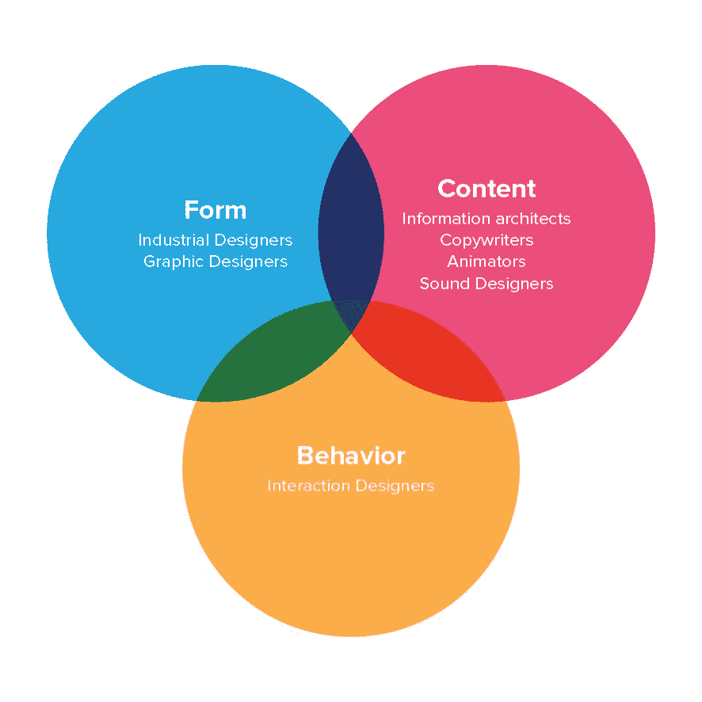

交互设计关注于行为的设计，但也关注行为与内容的关系。信息架构关注内容的结构以及如何将内容呈现给用户。工业设计和平面设计关注产品和服务的形式，但也必须确保它们的形式支持使用，这需要关注行为和内容。

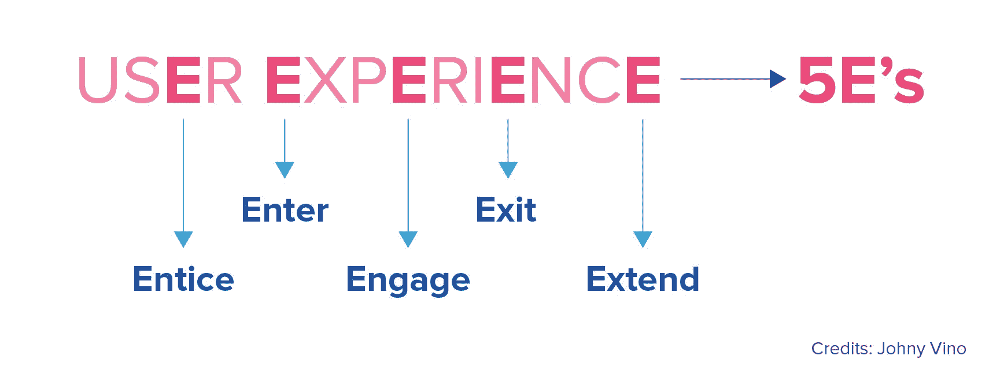

# 运动中的 UX

UX 给用户他们需要的，而不是他们想要的，因为用户通常不知道他们需要什么。用户体验设计通常与“可用性”和“用户界面设计”等术语同义。虽然可用性和用户界面设计是 UX 设计的重要方面，但它们只是其中的一部分。用户体验设计也涵盖了大量的其他领域。UX 设计师关心的是获得和整合产品的完整过程，包括 T2 品牌、设计、可用性和功能。这是一个甚至在设备还没有拿到用户手中之前就开始的故事。用户体验基于五个基本要素，如下所述:

*   吸引——让用户意识到并好奇你的产品/品牌/想法
*   进入车载用户，获得愉快的体验
*   吸引——保持用户的兴趣和兴趣，基本上是对用户的需求做出回应。
*   出口——给用户提供出口，不要只是告诉他们
*   延伸-一旦产品制成，真正的工作现在就开始了！！

和 UX 一起工作时，有一个指导方针是很重要的。四个法则可以帮助你为移动和网络应用程序的用户创造一个好的 UX:

【Figma 的运动设计:动画、运动图形、UX/UI

### 1.触摸屏移动应用的菲特定律

根据菲特定律，将动作组件保持在用户的自然环境中。类似地，在移动设备上，将 CTA 保持在自然区域(右下角)周围，并遵循拉伸区域(屏幕中间)和硬区域(最不重要或用于菜单等)中的其他次要动作。).

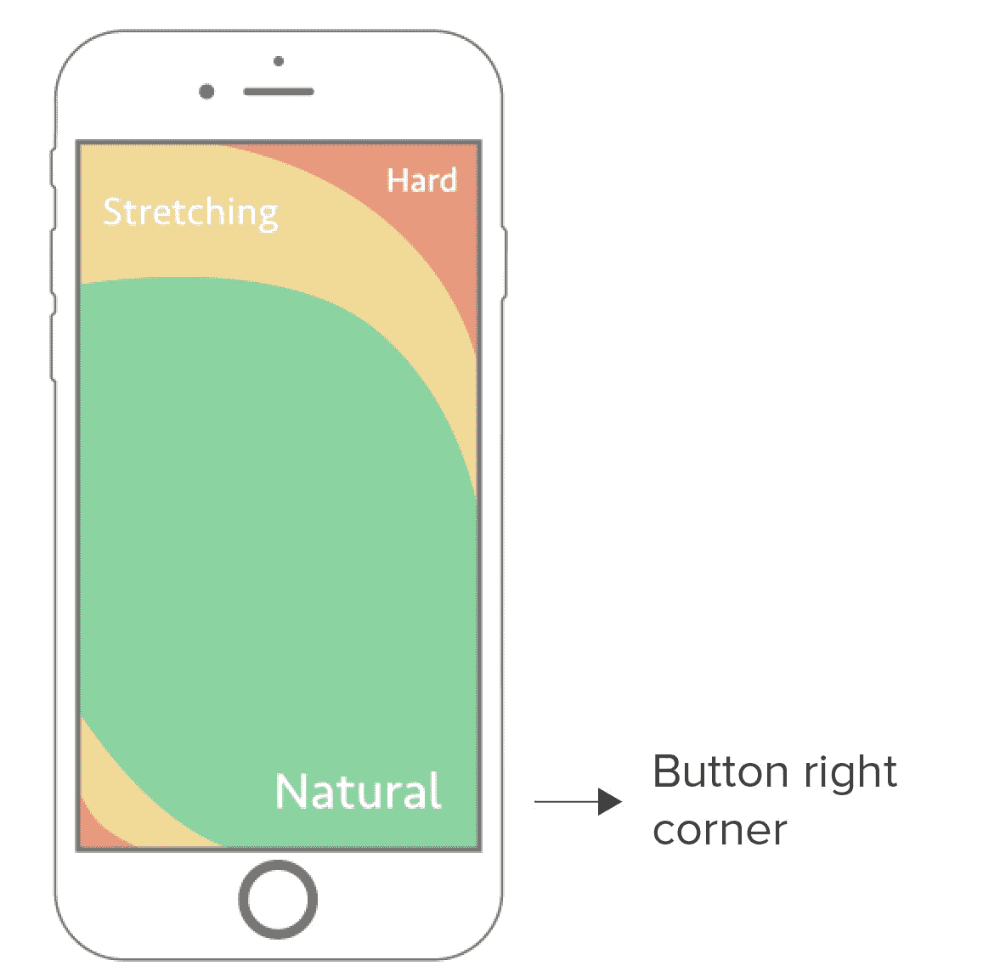

### 2.网页上的 f 布局

F 布局依赖于各种眼球追踪研究，因为它是一个基本概念。科学研究表明，网络用户以“F”模式阅读屏幕——最先看到顶部，然后是屏幕的左上角和左侧...很少朝屏幕右侧看。

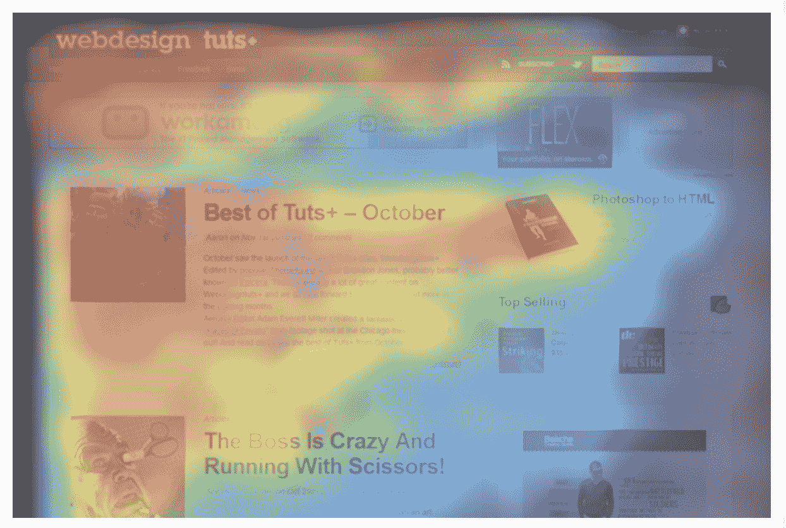

### 3.模仿

以用户熟悉的物理对象为例来激发灵感。图形设计真实物体的颜色和阴影帮助用户感觉实用和容易理解。把网络上的按钮想象成现实生活中的开关按钮，以及它发生的速度。这同样适用于你的手机锁和解锁。

例如，用于音乐应用的电视音乐和收音机音乐

### 4.美学可用性效果

用户认为有吸引力的产品比视觉上不太吸引人的产品使用起来更舒适。你可以大胆和丰富多彩，但不要忘记要有意义。美学仅仅指产品的视觉吸引力。

## 移动

运动是下一级技术。这是一种与事物互动的有机方式，对未来的设计至关重要。Motion 讲述故事——它讲述了一个应用程序是如何组织的，以及它能做什么。Motion 推动了完整的 UI——它重新定义了导航，并通过为*交互设计*增加新的深度来产生更自然的体验。对于每一个点击的按钮和屏幕转换，都有一个故事随之而来，良好的基于动作的设计可以帮助你讲述这个故事。

### 创建有意义的动画的目的是用户界面

#### 1.方向和连续性

强化界面的心理模型，展示内容之间的关系。

例如

*   当你点击购买全部收藏时，bucket 如何出现在 jollycons 上的简单流程

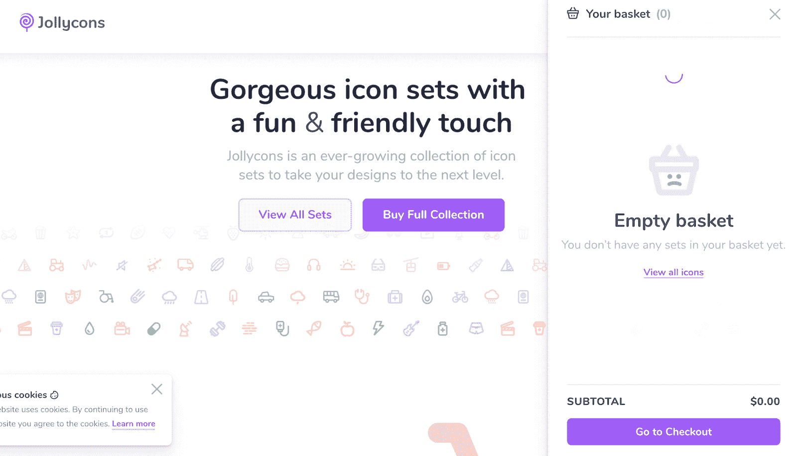

*   隐藏在图标后面的 Trello 侧菜单

#### 

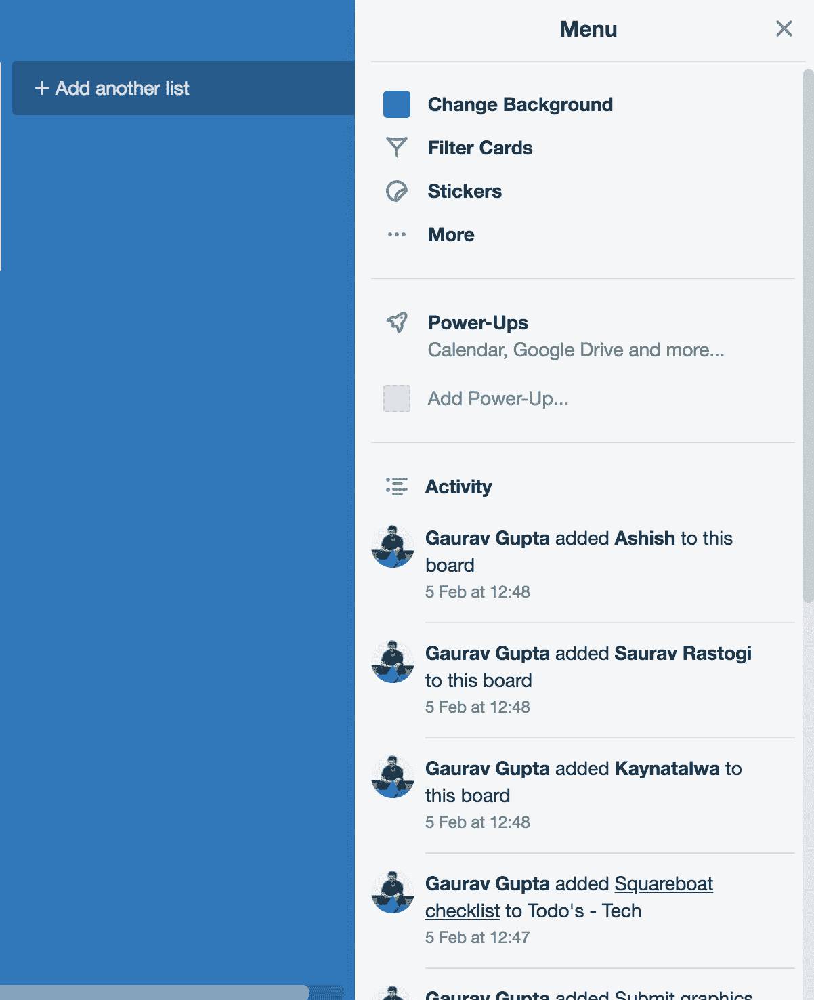

#### 2.视觉连续性

通过与手势配合良好的过渡点来保持对象的“事物性”。

*   谷歌字体-尝试改变颜色

*   在 iPhone 上，一个摄像头图标就放在滑动手势旁边，让用户相信摄像头就在那里。

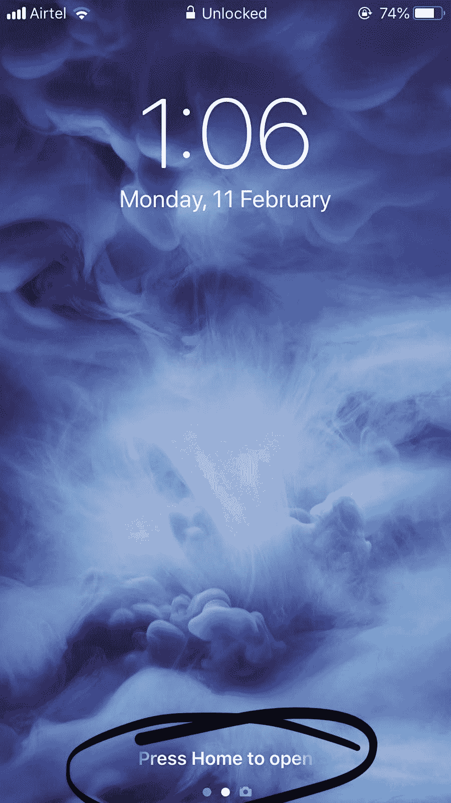

#### 3.反馈

让用户知道某事已经发生或正在发生。

*   时间作为空间-网络上的动画按钮
*   应用程序上的支付(Swiggy 支付成功屏幕)

*   用户反馈-评级等

#### 4.暗示和启示

帮助用户看到他们行为的潜在影响

*   iPhone 滑动接听电话，当手机被锁定，以防止意外点击和提示用户如何接电话。而当手机解锁时，他们会在自然区的右下角显示“接受”按钮。

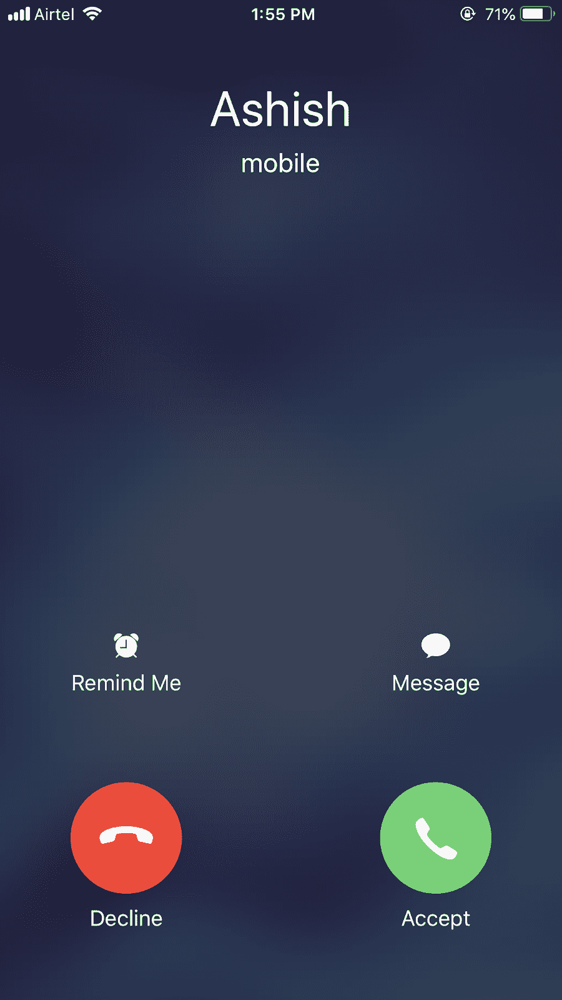 

#### 5.指导任务和愉快的经历

显示结果和原因并暗示当前或潜在的行动

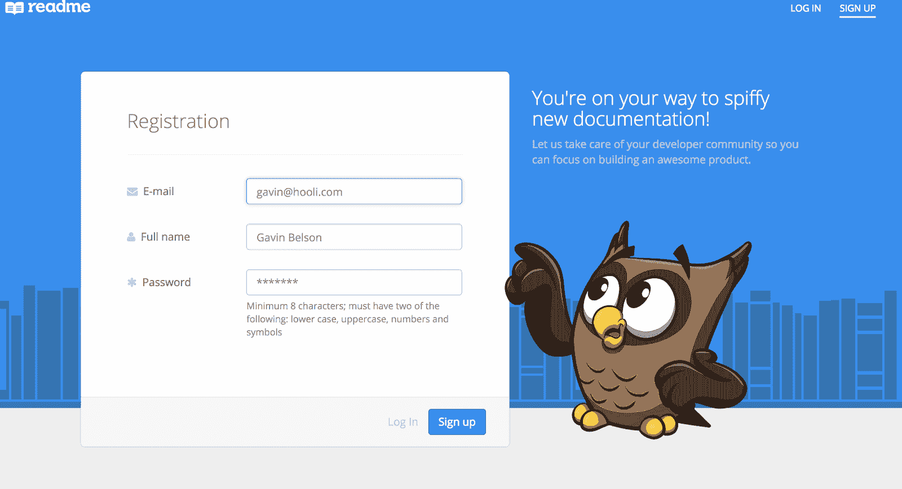

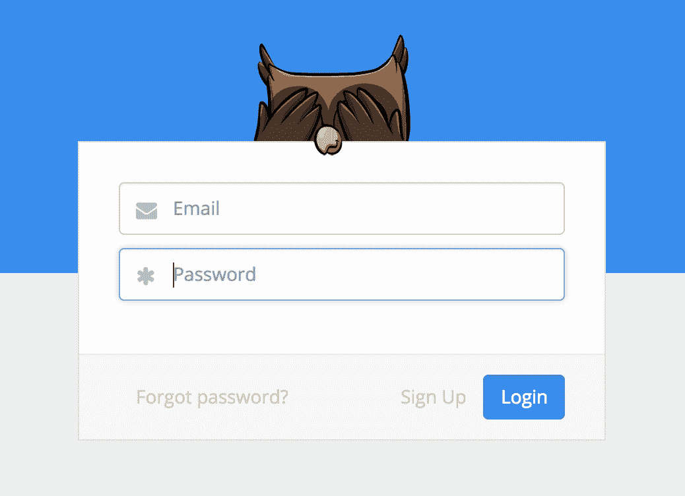

*   Reddit 指导-用户关于功能，以及用户登录后的行为

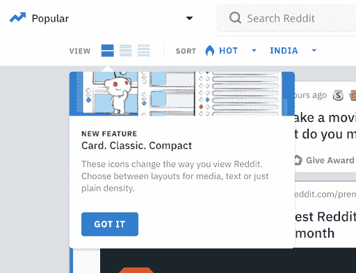

#### 6.引导注意力

引起注意，将目光引向变化和重要的项目

*   Fitbit ios 应用程序-显示统计数据
*   代码打开保存更改动画

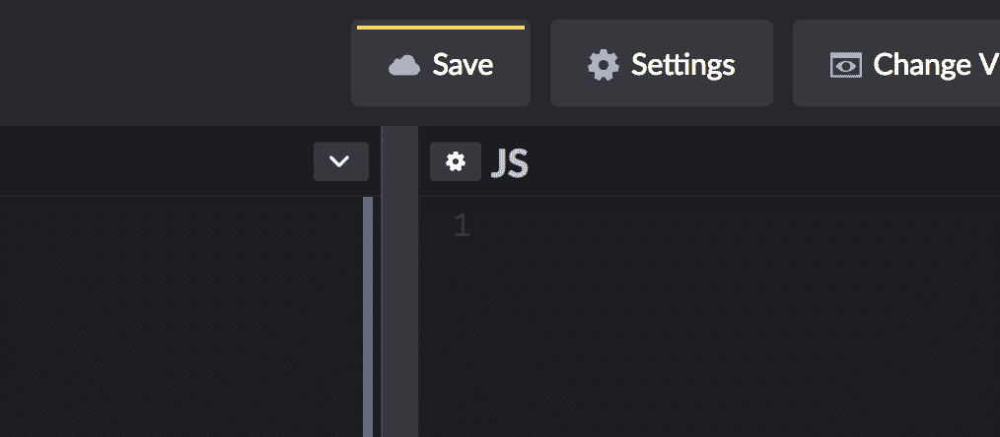

#### 7.感知性能

动画可以让不可避免的等待看起来更短

*   Fitbit ios 应用程序-显示统计数据
*   让用户感觉内容正在加载
*   装载机
*   进度条(多林哥)
*   定制装载机设计(Airbnb)

#### 8.讲故事和传递信息

声音和音调也在运动中出现

*   苹果网站菜单栏
*   船上

## 界面动画

动画是指创造运动的印象。迪士尼的原则产生“更吸引人的动画”，UI 动画原则带来更多实际体验。

延伸阅读[点击这里](https://tubikstudio.com/interface-animation-the-force-of-motion/)。

有各种类型的界面动画:

### 1.微观互动

微互动就像你的健康——当它正常工作时你不会注意到它，但当出现问题时你会明白它的重要性。由界面动画实现的微交互对用户来说也很难被注意到，直到他们面临缺少界面动画的问题。

**微交互的主要类型:**

*   动画按钮——即使对于计算机文化水平较低的群体来说，也是一个常见的触发器，因为它模仿了现实生活中的交互。
*   应用程序上的下拉-刷新-强化心智模型
*   让用户保持兴趣，让用户相信网速很慢

**拿走**

*   不应该太长太烦人
*   适用于不同设备上的目标用户
*   不应该是高分心
*   应该是应用程序或网站的风格概念(当用户看到应用程序的自定义加载程序时，他们会认为内容很快就会加载)

**例子**

*   Instagram“喜欢”按钮
*   Airbnb 为搜索保留了一个任意位置
*   餐馆页面上的 Zomato 浮动菜单按钮
*   Hugeinc 隐藏导航链接
*   脸书反应特征

### 2.显示流程/流程路径的动画

这样的动画帮助用户/显示过程的阶段

例子

*   Swiggy 顺序是“滴答动画”/“轨道顺序”。
*   在网站页面侧边滚动-帮助用户知道他现在在哪里(中等文章)
*   Duolingo 进度条和游戏化

### 3.阐明/解释动画

这些在教程和工具提示中很流行，用来解释复杂的操作

**例子**

*   Slack 老品牌解说视频。
*   标志品牌视频/动画
*   中-我们的故事视频
*   Swiggy-pop 打开动画(加载时感觉像有东西弹出来)
*   网站的鼠标动画
*   工具提示

### 4.装饰动画

装饰性的动画经常被用来创造原始的和引人入胜的用户界面设计体验，引人注目和明亮

例子

*   Hubspot.com(阿凡达和动画)
*   Snoopdogs.dogstudio.co
*   Gameoftheyear.withgoogle.com
*   灵魂.游戏
*   middlechildphilly.com
*   工具提示

## 界面动画的例子和目的

### 1.显示流程正在进行中(应用和网络)

微交互是最好的，因为它们提供了多种选择，比如动画按钮、下拉刷新和预加载。动画按钮是一个频繁的触发器，即使对于计算机文化水平较低的群体来说也是如此，因为它模仿了现实生活中的交互。(例如:Bira 网站)。下拉刷新强化了应用程序上的心智模型，预加载器让用户参与进来，让用户认为网速很慢

### 2.显示操作已完成(应用程序和网络)

例如:带有过渡动画和计费网关按钮的汉堡包菜单图标。

### 3.数据分组(应用和网络)

这是通过澄清和装饰来实现的。例如，像优步吃单页分组转换类别的食品应用程序的菜单是标题导航。

### 4.吸引对特定元素的注意(主要是应用程序)

一个很好的例子就是 Myntra 应用程序产品传送带。

### 5.向用户提供提示(主要是应用程序)

微交互，给用户一个线索。主要是导航(谷歌地图)，它们需要足够合适，不会让用户不知所措，但仍然切中要点。

### 6.支持一般风格和品牌(主要是网络)

微交互和装饰极大地实现了它。例如，优步卡片的造型、向上滑动、吉祥物、标志等。

### 6.保持过渡的一致性(主要是网络)

装饰在[视觉](https://hackr.io/tutorials/learn-invision)设计基因组计划模型和视觉设计-更好的网站

### 7.震惊和敬畏(主要是网络)

让用户好奇尝试，向外移动事物。例如，Twitter 闪屏，每日一词页面变化交互，Swiggy 闪屏，和 nikka.com.au

## 实时和非实时交互

### 1.实时互动

在这种交互中，用户直接与 UI 中的对象进行交互

*   Swiggy 卡片滚动是实时交互的一个很好的例子。我们按下和滚动它卡的方式类似。在这里，输入和输出是实时的。

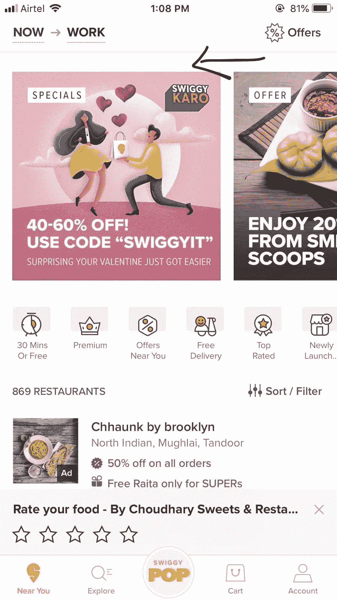

### 2.非实时交互

它发生在用户操作之后，主要是过渡性的，有一个加载时间/滞后

*   Swiggy 餐厅列表-点击页面加载内容(它是像 Onclick - load -最终结果阶段的过渡)

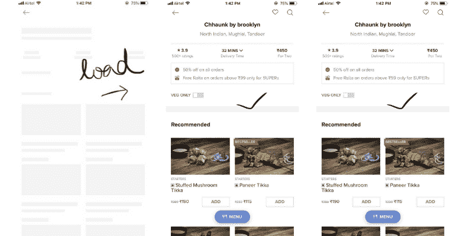

## 如何在运动中创造 UX

下面提到的是用动作创造可用性的 12 个原则。

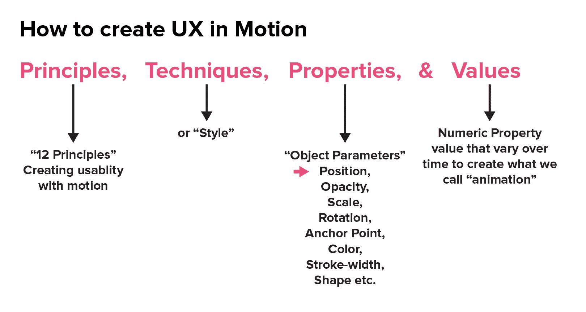

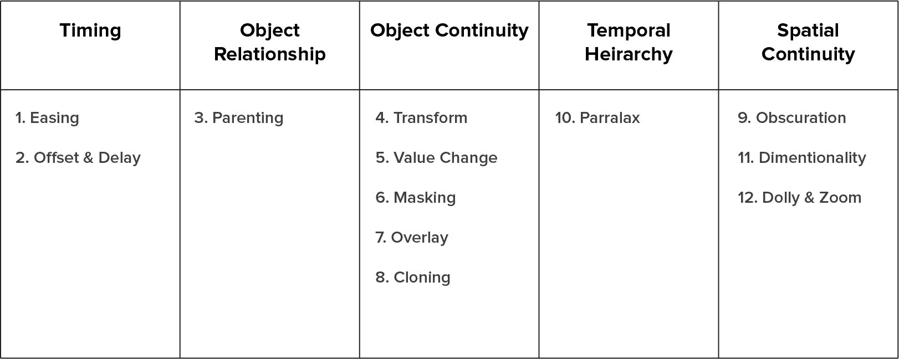

### 1.缓动(显示向内和缓慢向外)

迪士尼称之为“慢进慢出”。它创造并强化了“自然主义”。所有接口对象都表现出时态行为。现实世界中的物体，如动物、人体、车辆等。需要时间加速和减速。例如坐下、站起来，对象运动可以是实时的或非实时的

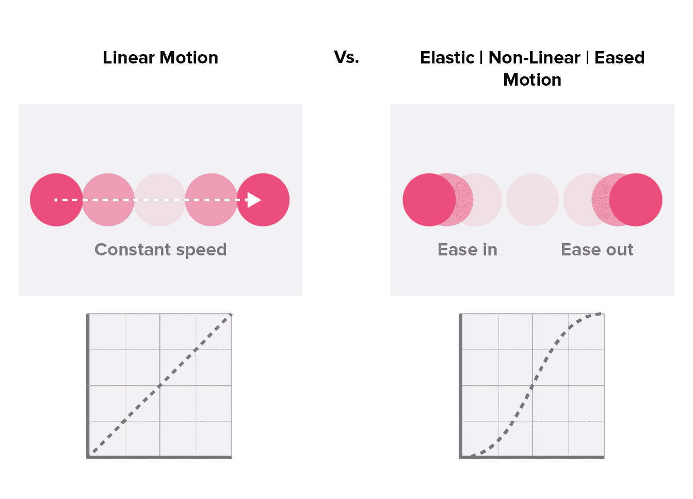

具有讽刺意味的是，线性运动更“简单”和更容易掌握，而我们适应的是非线性的、更复杂的运动，这最终会影响用户体验的质量。

例如，移动的人，如果我们用直脚移动，没有重量转移，移动将不是真实的。

[https://www.youtube.com/embed/uDqjIdI4bF4](https://www.youtube.com/embed/uDqjIdI4bF4)

VIDEO

### 2.偏移和延迟(跟随和重叠动作拖动)

跟随是身体在某一点停止后继续运动的方式，而重叠是身体与其他部分的计时之间的偏移。

在这个原则中——甚至在用户注册什么是对象之前，设计者已经通过一个动作向她传达了对象在某种程度上是“分离的”。这是极其强大的。这个原则的用处在于，它通过告知用户界面中对象的性质，让用户有意识地为成功做准备。例如，任务应用程序-添加新的任务按钮功能

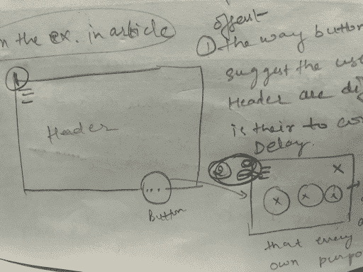

在图 1 中-偏移

按钮出现触发的方式提示用户，按钮和标题是不同的，按钮是为了完成它的功能。

在图 2 中-延迟

一旦按钮被触发，不同圆圈的动画方式表明每个圆圈都有其用途。

#### 这一原则的实施

*   **视差效应:**当你滚动时，重叠的内容通常会“漂浮”在它出现的内容上。举个例子，
*   werkstatt.fr
*   Restaurantleduc.com
*   愿景:基因组计划
*   **可变阴影效果:**除了光线的实际物理属性之外，你会期望堆叠的元素有不同的阴影分布。
*   **UI 调出:**使用重叠图像调出一个 UI。
*   **背景图片:**背景内容是设置心情的照片。这是有意义的，因为重叠模糊了它。例如 Hugeinc(图像部分)

### 3.养育

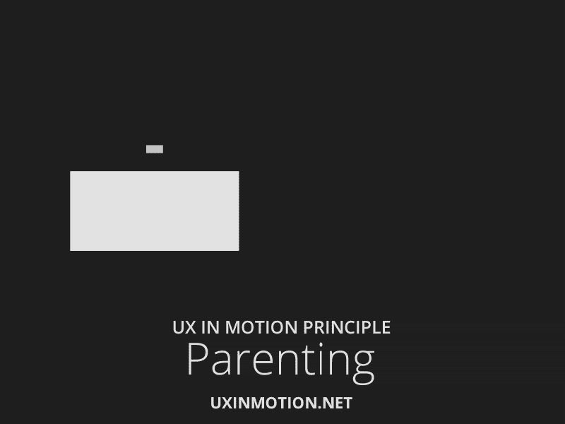

这是在用户界面中“关联”对象的原则。它是对象属性与其他对象属性的链接，以支持可用性的方式创建对象关系和层次结构。“子”对象依赖于“父”对象

养育有三种类型:

#### 1.直接养育

子对象依赖于父对象。

#### 2.延迟养育

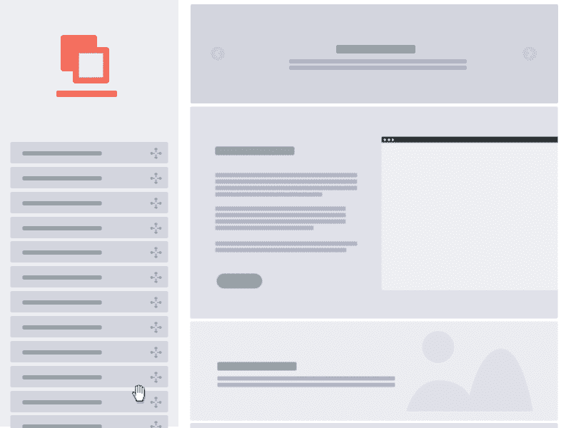

当父对象被触发时，子对象相应地起作用，但有一个延迟。

#### 3.逆向养育

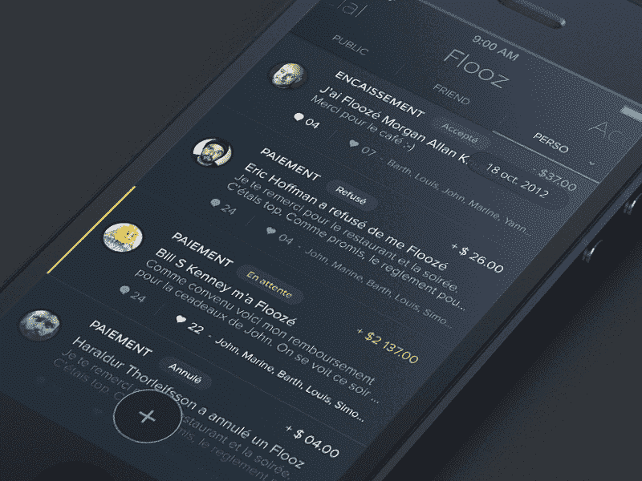

在 iPhone 上向右滑动信息。

### 4.改变

当对象效用改变时，它创造了叙事流的连续状态。例如，在不同阶段具有不同形状变化的按钮、支付按钮。

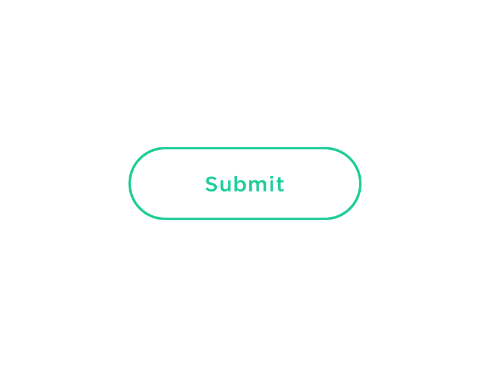

### 5.价值变化

在实时事件中，用户与对象交互以改变值。例如设置闹钟。在非实时事件中，例如加载器和转换，值在没有用户输入的情况下改变以反映动态叙述。秒表

### 6.掩蔽(Dribbble Ashish Chandran)

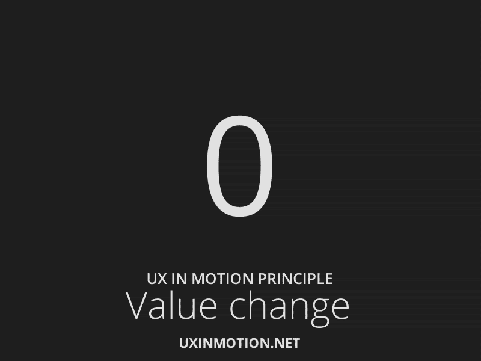

在“动态”设计中，当通过取消或显示组或对象的哪一部分来确定效用时，掩蔽在界面或对象组中创建连续性。例如，屏蔽手机中的应用图标以打开应用。

### 7.覆盖层(Dribbble Ashish Chandran)

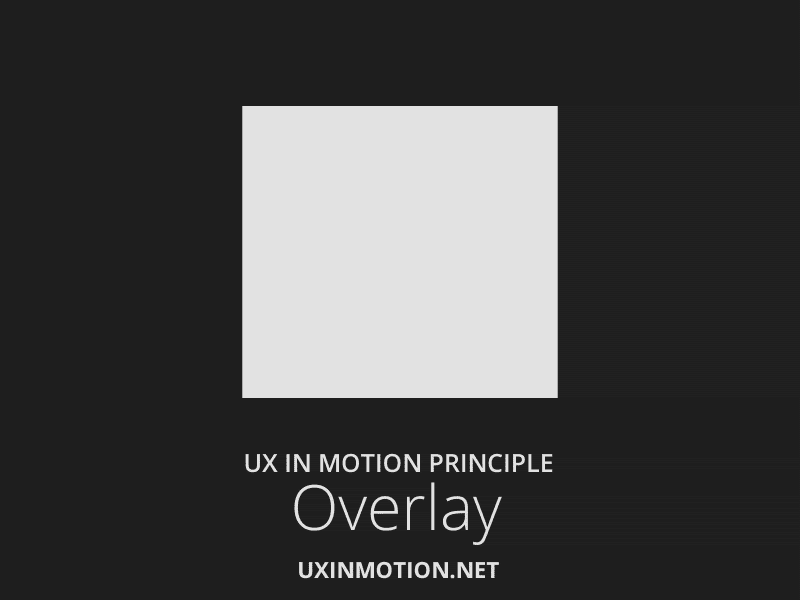

当分层物体是“位置相关的”时，它在视觉平面中创建叙事和物体空间(涉及或占据空间)关系，并将非 3D 空间转换为 3D 空间。例如，每日一词逐页动画

### 8.克隆

1.  当新的对象产生和离开时，创造连续性、关系和叙事。
2.  克隆与掩蔽和维度一起工作。
3.  例如，我们如何从单个浮动按钮中选择不同的选项。

### 9.蒙昧(维吉尔·帕纳·德里布尔)

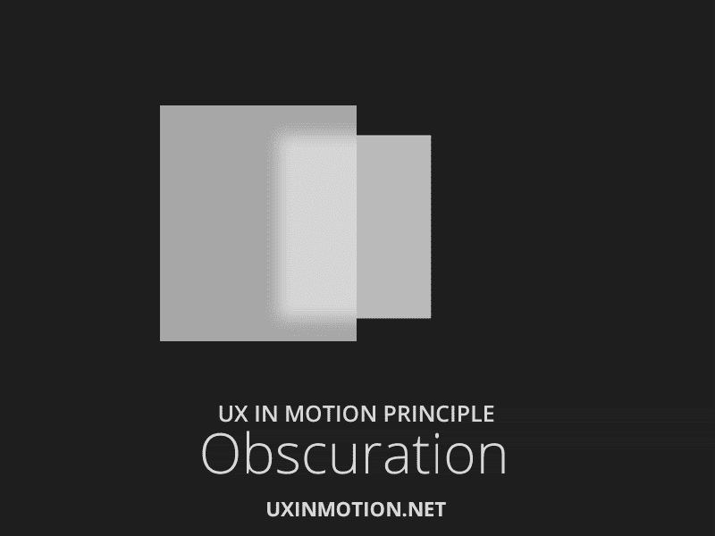

这是一种静态的时间现象，允许用户通过场景或物体在空间上定位自己，而不是在主要的视觉层次中。例如，iPhone 上的应用程序图标，长按获得许多可操作的模糊层。

### 10.视差(可滴的美学面纱)

Parallax 允许用户在保持设计完整性的同时专注于主要动作和常量。只是不同的接口对象以不同的速率移动。

### 11.维度(维吉尔·帕纳，埃迪·洛巴诺夫斯基格·德里布尔)

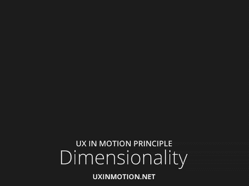

当新的物体产生和离开时，它提供了一个空间叙事框架，并克服了视觉平面中缺乏深度的物体存在于同一平面上，但出现在其他物体的“前面”或“后面”的分层悖论。

维度以三种方式呈现

#### 1.折纸手工

3D 界面对象，多个对象组合成折纸结构，隐藏的对象仍然可以“存在”。短消息应用程序初级动画。

#### 2.浮动的

给界面对象一个空间起点和起点，使得交互模型直观且高度叙事化。

#### 3.目标

具有真正深度和形式的结果。

### 12.推拉和缩放

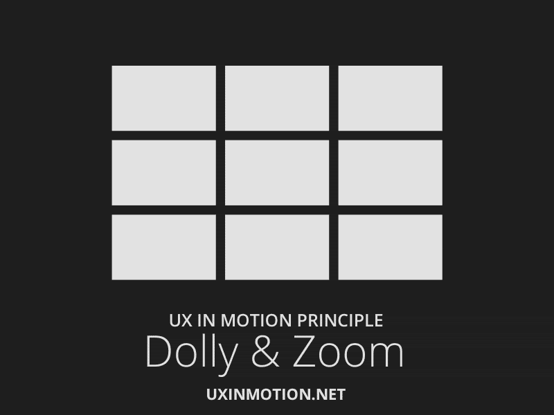

多莉是一个电影术语，适用于相机远离或靠近对象的运动。推拉还涉及维度、更多的空间体验、更多的深度，以及向用户传达在当前视图“前面”或“后面”的附加区域或内容。打开苹果手机旧风格

视角和对象都没有在空间上移动，而是对象本身在缩放的事件被称为缩放。这向视图传达了附加界面对象在其他对象或场景“内部”的信息。它允许无缝过渡-实时和非实时动画。画廊苹果手机

**人也在读:**