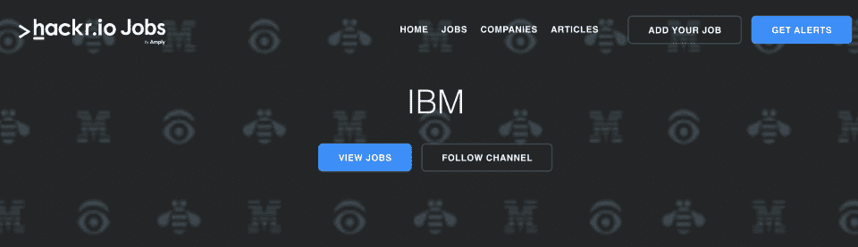
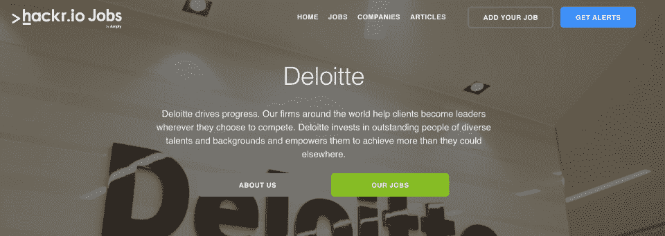

# 获得第一份 IT 工作的 5 种方法

> 原文：<https://hackr.io/blog/ways-to-land-your-first-job-in-it>

从大学毕业或在一个新的领域找到第一份难以捉摸的工作并不容易。这些水未经测试，需要时间才能恢复正常。下面，我们有几条建议可以帮你铺平道路。

## 1。精心制作你的简历和求职信

首先，你的简历符合要求吗？你的教育经历可能是雇主关注和感兴趣的主要点，对你申请的任何职位都有最大的相关性。

按顺序列出你的学位以及你的成绩。如果你在大学期间参加过暑期实习或其他工作经验，把它们也包括进来，因为它们会展示你有一些工作经验的事实。

## 2。进入相关社交网络

确保你出现在任何相关的求职网站上，并在其他相关的社交媒体上关注你感兴趣的行业人士。

通过关注创始人和知名人士，Twitter 可以成为收集行业见解和知识的有用途径。也要精心策划你自己的社交形象——雇主会检查的。

## 3。准备投资组合

展示你的技能是必不可少的——雇主会经常问你能做什么，手头有一份作品集是快速展示你技能的绝佳方式。

对于开发者来说，GitHub 概要文件是必须的。

## 4。网络

查看一下你可以亲自参加的相关专业会议和网络活动，目的是建立联系。

不要害怕利用你可能有的任何私人关系，因为导师在你的早期职业生涯中可能是一个无价的资源，指导你度过棘手的时刻，并提供经过时间考验的建议。

## 5。磨砺你的技能

这是一个不断变化的领域，因此，你的技能也应该不断变化。看看 [课程](https://hackr.io/blog/best-python-courses) 或 [训练营](https://hackr.io/blog/free-coding-bootcamps) ，在那里你可以磨练或提高你的技能(确保完成后将它们添加到你的简历中)。

表现出对学习和发展的兴趣是向雇主表明你对自己的职业和未来挑战充满热情的好方法。

现在准备好找新工作了吗？下面我们有三个角色可以探索——在 [Hackr.io 工作板块](https://jobs.hackr.io/) 上还有数千个角色可以探索。

通过英语面试:获得你梦想的工作！

## **探索工作机会**

### **测试分析师，Infosys**

**职位:** 印孚瑟斯正在寻找一名 [测试分析师](https://jobs.hackr.io/job/test-analyst-at-infosys-3) 来担任验证和质量保证专家，并审查现有系统的功能。您将有机会与业内一些最优秀的人才合作，创造创新的高质量和无缺陷的解决方案，以满足客户的业务需求。

职责: 你将进行需求分析，定义测试策略，设计并领导执行，以保证出色的结果。你还需要设计一个最佳的测试环境来模拟实时场景。

要求: 你需要一个认证机构的学士学位或同等学历，以及至少两年的信息技术经验。

出色的口头和书面沟通能力。

申请 [测试分析师](https://jobs.hackr.io/job/test-analyst-at-infosys-3) 职位或在[Infosys](https://jobs.hackr.io/company/infosys-3)查看更多机会。

### **IBM 应用数据库管理员**

**角色:**[应用数据库管理员](https://jobs.hackr.io/job/application-database-administrator-3-at-ibm-1) 将为具有轮流待命系统的客户端系统提供 24x7 数据库管理支持。

**职责:** 您将参与监控、备份和恢复、系统资源管理和容量管理，并通过服务请求为特定项目执行数据库更改。根据影响、时间表和工作量，少量增强功能可用于执行某些转型项目，如重新搭建平台、迁移项目(特定于数据库)。

**要求:** 应具备 Oracle 核心物理 DBA 技能，技术知识扎实，沟通能力非常好。您应该能够自如地处理大型生产环境，并且应该在从 11.2 到 19c 版本的安装、修补、升级、性能调优、数据库 rman 克隆和刷新等活动方面经验丰富。

更多关于 [应用程序数据库管理员](https://jobs.hackr.io/job/application-database-administrator-3-at-ibm-1) 的信息，以及 IBM 的其他 [角色。](https://jobs.hackr.io/company/ibm-1)

## 德勤软件工程师

**角色:**[软件工程师](https://jobs.hackr.io/job/software-engineer-at-deloitte-4) 负责开发符合用户需求的软件程序或系统。职责包括与客户或商业专业人士会面，为有益的软件制定策略，与其他 IT 专业人士协调设计软件，并运行测试以捕捉编码错误。

职责: 你将分析最终用户的需求并实施解决方案，为现有系统和程序提供升级建议，并开发软件的独立元素，使其在整个程序中运行良好。您还将确保在软件维护和测试期间程序的持续功能。

**要求:** 本科学历，需要精通 SQL、Python web 应用框架(Flask、Django 等)。)、前端工具(CSS、HTML、bootstrap、JavaScript、jQuery、jinja2 模板等。)，并且有云应用托管经验(AWS，Azure)。

了解更多关于 [软件工程师](https://jobs.hackr.io/job/software-engineer-at-deloitte-4) 工作的信息，或者发现更多 [德勤](https://jobs.hackr.io/company/deloitte-4) 的职位空缺。