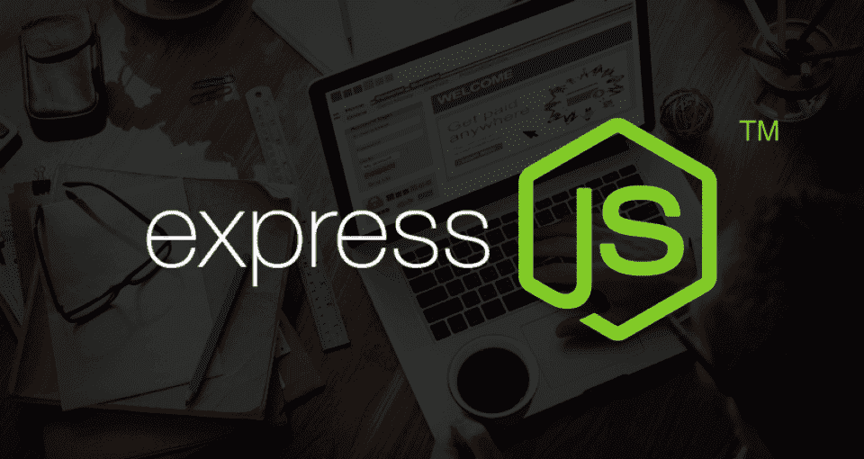
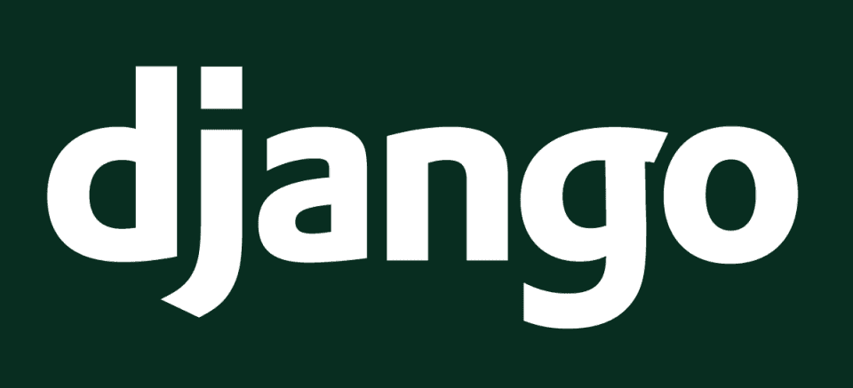
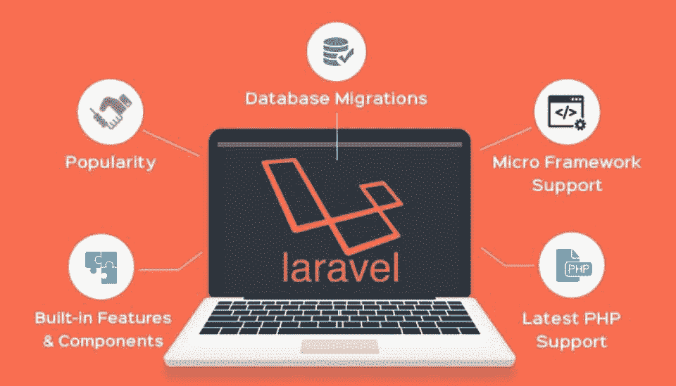
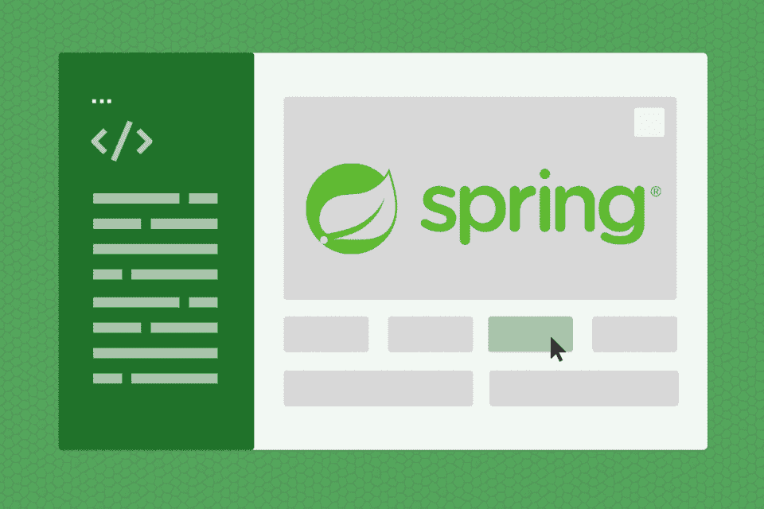
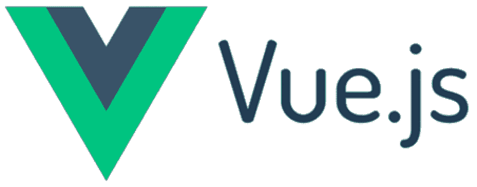
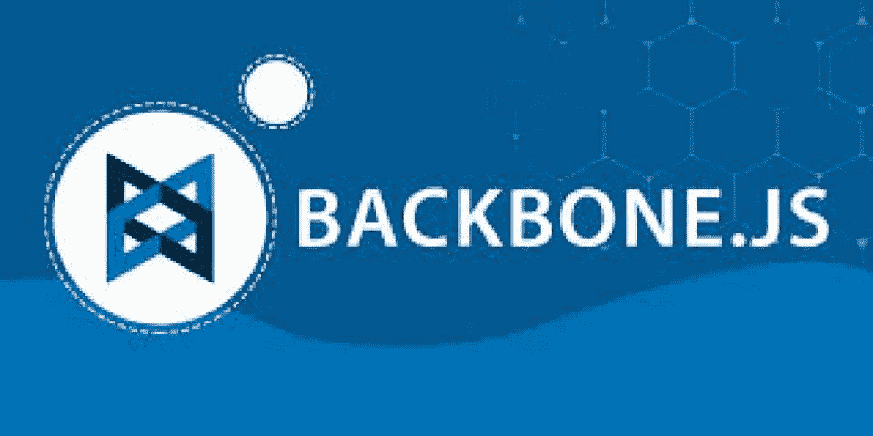

# 2023 年使用的 10 个最佳 Web 开发框架[更新]

> 原文：<https://hackr.io/blog/web-development-frameworks>

随着 web 应用程序的标准不断提高，所需技术的复杂性也不断增加，框架已经成为 web 开发的一个重要部分。为如此复杂的技术重新发明轮子是完全不合理的——假设你可以重新发明这一切。这就是为什么使用全球成千上万开发者认可的**框架**是构建丰富的交互式 web 应用程序的非常明智的方法。一个 web 应用有一个后端(服务器端)和一个前端(客户端)，所以我们既讨论**最好的后端框架**，也讨论**前端框架**。

以下是 2023 年**最佳网络开发框架**的列表:

## **最佳后端框架**

从 RESTful APIs 到完整的 MVC 框架，这里有一些 2023 年最健壮的后端框架，你可能有兴趣学习。

### **1。快递**

****

得益于 Node.js 的飞速发展， [Express](https://expressjs.com/) 正迅速成为当今最流行的 web 开发最佳框架之一。它在埃森哲、IBM 和优步以及许多其他公司中很受欢迎，它也与其他框架兼容，如北海巨妖、Sails 和 Loopback。

Express 自诩为一个最小的、快速的、非个性化的框架。它提供了一些核心的框架功能，而没有掩盖 Node 的特性，并利用了异步 Node.js 的强大性能。它还非常灵活，支持完整的应用程序以及 REST API。也许 Express 最大的缺点是没有明确的做事方式，至少对初学者来说是这样。

快递 GitHub 链接:[https://github.com/expressjs/express](https://github.com/expressjs/express)

### **2。姜戈**

****

Django 是一个使用 Python 进行 web 开发的模型-视图-模板框架。谷歌、Youtube 和 Instagram 等大牌都使用这个框架。Django 吹嘘它的内置电池特性，这是 Django 拥有的一系列特性，比如身份验证和消息传递。它遵循配置模式和干模式的惯例。Django 的安全至关重要。Django 为开发人员提供了构建安全网站的技术和工具，或者实现了框架本身的安全特性，比如防止模板层的代码执行。这里是我们关于 Django 的详细帖子:[Django 是什么？使用 Django 的优缺点](https://hackr.io/blog/what-is-django-advantages-and-disadvantages-of-using-django)

Django Github 链接:[https://github.com/django/django](https://github.com/django/django)

如果你想学习 Django，没有比 udemy 课程 [Python 和 Django 全栈 Web 开发者 Bootcamp](https://click.linksynergy.com/deeplink?id=Qouy7GhEEFU&mid=39197&murl=https://www.udemy.com/course/python-and-django-full-stack-web-developer-bootcamp/) 更好的了。

### **3。轨道**

[Rails](https://hackr.io/blog/getting-started-with-rails) 是一个使用 Ruby 的模型-视图-控制器框架，它是一个受许多开发人员喜爱的流行框架。Airbnb、GitHub、Hulu 和 Shopify 是 Rails 的主要用户。Rails 被认为是一个初学者友好的框架，事实上它的优点和缺点是有争议的，这有助于初学者很快开始 web 开发。rails 有许多有用的宝石，它们是类似库的依赖项，扩展了应用程序的功能，并帮助您更快、更有效地开发。rails 社区非常可靠和友好，有许多教程、截屏和资源可以帮助您很快成为 Rails 专家。

rails 的主要缺点在于，在生产环境中部署和运行 rails 需要花费相当多的精力，一旦你更深入地探究框架背后的魔力，rails 的学习曲线就会变得陡峭。

Rails Github Link:[https://github.com/rails/rails](https://github.com/rails/rails)

### **4。拉勒维尔**

****

Laravel 是一个使用 PHP 的模型-视图-控制器框架，PHP 是最流行的网络语言之一。与这个列表中的其他框架相比，它相对年轻。

Laravel 自带 API 支持，并且拥有大量可以扩展其应用范围的软件包。Laracasts 是一个截屏教程网站，有超过一千个关于 PHP、Laravel 和 Laravel 生态系统中前端技术的视频，可以被认为是初学者的天堂。然而，就性能而言，Laravel 无法与 Django 或 Express 相比，这可能是大型项目的一个缺点。

Laravel Github 链接:[https://github.com/laravel/laravel](https://github.com/laravel/laravel)

想掌握 Laravel？面向初学者的 PHP 与 Laravel】是一门很棒的在线课程。

### **5。弹簧**

****

[Spring](https://spring.io/) 是一个模型-视图-控制器框架，使用了 Java 这种空前流行的语言。Wix、TicketMaster、BillGuard 等网站都是这个框架的用户。Spring 拥有许多姐妹项目，这些项目提高了它的性能，并让您快速扩展您的业务。它使用 Java，一种强类型语言，这一事实对许多 web 开发人员来说是一个严峻的挑战。学习曲线可能会很陡，尤其是如果你不懂 Java 的话。

Spring Github 链接:[https://github.com/spring-projects/spring-framework](https://github.com/spring-projects/spring-framework)

## **前端 Javascript 框架**

### **6。角度**

****

[Angular](https://angular.io/) 是一个前端框架，专门构建丰富的单页面应用。这是一个充满活力的框架，能够构建完整的客户端应用程序，在 Angular 中有太多的事情要做和学习。Angular 1.x 使用了 Javascript，但后来的版本采用了 Typescript，这是 Javascript 的超集。Angular 的主要缺点是与其他框架相比它的大小，以及它本质上不是 SEO 友好的，尽管它可以进行 SEO 优化。谷歌开发了 angular ，谷歌、微软、Paypal 都用它 。

这里是我们关于棱角分明的详细帖子: [为什么要学棱角分明？](https://hackr.io/blog/why-should-you-learn-angular)

角 github link:https://github . com/angular

### 7 .**。反应**

****

[React](https://reactjs.org/) 不是一个框架，它是一个前端库，但许多开发人员认为它是一个框架，并且通常在那个上下文中进行比较。React 是第一个采用 Angular 和 Vue 的基于组件的架构的，后来许多其他框架也开始采用。React 的虚拟 dom 使得 dom 操作更快，而且很容易掌握，这主要归功于它的 JSX 语法。React 可以用于服务器端或客户端。它由脸书开发和维护，脸书和 Instagram 使用它。

React Github 链接:[https://github.com/facebook/react](https://github.com/facebook/react)

### **8 .视图〔t1〕**

****

[Vue.js](https://vuejs.org/) 是新的后起之秀；它从一个独立的项目开始，并迅速成长为最流行的 JS 框架之一。Vue 有很多很酷的地方。首先，它是一个渐进的框架，这意味着如果你有一个现有的项目，你可以在项目的一部分采用 Vue，一切都会很好。其次，它还带来了组件架构，Vue 生态系统可以帮助您构建完整的前端应用程序。一些人对使用 Vue 持谨慎态度，因为像脸书或谷歌这样的大公司不支持它，但随着大公司开始投资 Vue，这种情况正在迅速改变。

Vue.js Github 链接:[https://github.com/vuejs/vue](https://github.com/vuejs/vue)

### **9。余烬**

****

2015 年，Ember 被评为最佳 Javascript 框架。今天，Ember 社区是巨大的，而且它还在不断扩大，不断增加新的功能和版本。Ember 拥有 Angular 所拥有的双向数据绑定，并且它附带了许多您可以开箱即用的特性和组件。谷歌、微软、Heroku 和网飞经常使用这个框架。Ember 围绕着开发人员的生产力，并试图通过消除浪费时间的活动或在其核心设计中采用一些 JS 最佳实践来最大化它。

Ember.js Github 链接:[https://github.com/emberjs](https://github.com/emberjs)

### 10。主干

****

[Backbone](http://backbonejs.org/) 是一个非常轻量级的前端框架，适合构建丰富的单页面应用程序。它遵循 MV*模式，部分实现了 MVC 设计。Backbone 只有一个核心依赖项，那就是下划线库，它有一个活跃的生态系统，当添加到 Mustache 和牵线木偶时，它允许您构建完整的客户端应用程序。

Backbone.js Github 链接:[https://github.com/jashkenas/backbone](https://github.com/jashkenas/backbone)

## **最后一句话**

我希望你会发现我们列出的[最受欢迎的 web 框架](https://digitalya.co/blog/best-web-development-frameworks/)很有用。不要害怕拿起一个框架并开始工作，它让你洞察如何做事，你会发现框架之间有许多相似之处，甚至在同一类别的不同语言之间。请记住，大公司总是在迁移和尝试新的东西，所以没有所谓的死胡同。

**人也在读:**