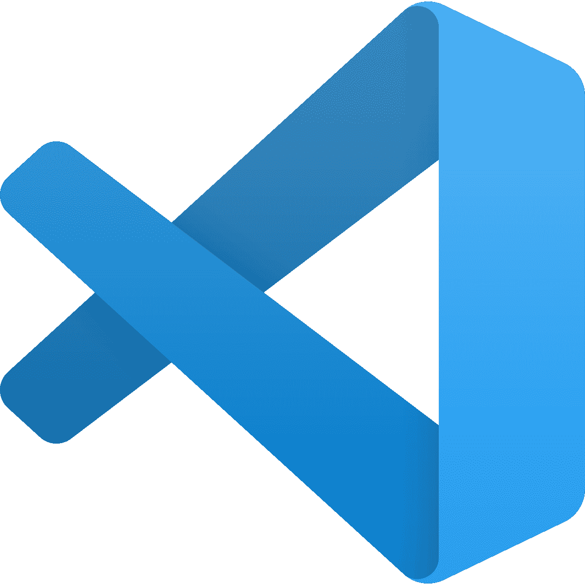

# 2023 年你应该挑选的 15 个最佳 Web 开发 IDE 更新]

> 原文：<https://hackr.io/blog/web-development-ide>

## **简介**

编辑 HTML 和 CSS 代码只需要一个简单的文本编辑器。然而，如果您想将您的编程技能(和输出)提高到一个新的水平，那么值得考虑集成开发环境或 IDE。

一个基本的 IDE 将允许你编码、编辑、测试和调试。然而，一个高级的 IDE，比如这里列出的那些，将提供许多增强您的编程体验的特性，比如自动化、可视化和定制化。

## **最佳 Web 开发 IDE**

以下是最佳 web 开发 IDE 列表:

被  TMS 外包 评为 Windows、Mac 和 Linux 的最佳 [JavaScript IDE](https://hackr.io/blog/best-javascript-ide-source-code-editors) ，并在 2018 年 JS  的 [ 状态调查中被评为最受欢迎，Visual Studio Code 是一个强大的源代码编辑器，它附带了一系列用于 JavaScript 开发的工具。IDE 内置了对 JavaScript、TypeScript 和 Node.js 的支持。它还为其他语言(如 C++、C#、Python 和 PHP)提供了大量扩展。由 Windows 开发的 Visual Studio 代码非常适合新程序员，因为它解释了从 HTML 标记到语法和错误处理的一切。](https://2018.stateofjs.com/other-tools/)

**功能包括:**

*   语法高亮显示
*   基于变量类型的智能感知自动完成
*   功能定义
*   导入模块
*   从调试代码的能力
*   自定义热键
*   模板和样板
*   与 GitHub 集成
*   智能感知，提供基于变量类型的智能完成
*   可定制主题

 Atom 是 [JavaScript 编程](https://hackr.io/tutorials/learn-javascript?ref=blog-post)的绝佳 IDE。因为它是由 GitHub 创建的，这意味着如果你遇到任何问题，有一个欣欣向荣的社区可以求助。它可以与 Mac、Windows 和 Linux 一起工作，并附带了一个用于安装新软件包的软件包管理器。这款应用高度可定制，但也可以很好地使用，无需配置或定制任何东西。

**功能包括:**

*   在所有项目中查找、预览和替换您在文件中键入的文本
*   在一个窗口中轻松浏览和打开文件和项目
*   Teletype tool——支持在编辑器中与其他开发人员协作
*   非常可定制/可破解
*   包管理器

Sublime Text 3 是一个灵活、免费的 IDE，适用于 Windows、Mac 和 Linux。它支持许多不同的编程和标记语言，包括 Python、C、HTML、JavaScript 和 CSS。众所周知，该界面简洁、快速。

**功能包括:**

*   代码自动完成-代码片段和宏
*   可以调整以提高生产力
*   增强的窗格管理
*   转到定义
*   转到符号
*   多选
*   命令面板
*   分割编辑
*   即时项目切换
*   可定制的按键绑定、菜单、代码片段等

PyCharm 是一个不错的免费 IDE，可以用多种语言进行 web 开发，包括 Python、CSS、HTML、JavaScript、Node.js 等等。IDE 与 Mac、Windows 和 Linux 兼容，如果你想要更可靠的东西，你可以购买一个付费的姊妹软件。根据一些用户的说法，免费版的 PyCharm 可能会有问题，尤其是自动完成功能。

**功能包括:**

*   与 Git、Mercurial 和 SVN 的轻松集成
*   带有 VIM 仿真的可定制界面
*   JavaScript、Python 和 Django 调试器，
*   支持谷歌应用引擎

IntelliJ IDEA 是一个[以 Java 为中心的 IDE](https://hackr.io/blog/best-java-ides) ，旨在最大化生产力。这个 IDE 最好的特性之一是它能够自动添加与上下文相关的便利工具。除了支持 Java 语言，它还支持 HTML、PHP、Python、Ruby 等等。它是免费的，但有一个付费的对应部分，有一套更全面的开发工具。

**功能包括:**

*   测试跑步者 UI
*   代码覆盖率
*   Git 集成
*   支持多个构建系统
*   广泛的数据库编辑器和 [UML 设计器](http://www.umldesigner.org/)
*   支持谷歌应用引擎，Grails，GWT
*   大多数应用服务器的部署和调试工具
*   【HTML、CSS 和 Java 的智能文本编辑器
*   集成版本控制
*   自动化重复性编程任务
*   高级代码完成
*   内置静态代码分析器

对于那些使用 PHP 框架的人来说，PHPStorm 是一个很好的编码环境，比如 T2、WordPress、Drupal、Magento 等等。它有一个界面，既好看又容易使用。它与 Mac、Windows 和 Linux 兼容，并支持许多不同的前端编程语言，如 HTML5、CSS、JavaScript 等。可以使用主题和扩展对 IDE 进行定制，以增强您的编程体验。

**功能包括**

*   可视化调试器
*   自动代码完成
*   错误高亮显示
*   远程部署
*   数据库/SQL
*   HTML、CSS 和 JavaScript 编辑器
*   命令行工具
*   智能代码导航器
*   重构和调试工具
*   码头工人
*   休息客户端
*   作曲家
*   单元测试

Webstorm 是一个功能丰富、界面友好的 IDE。它旨在生成最先进的 web 应用程序，并支持 HTML、JavaScript、CSS、React 等语言。IDE 与 Mac、Windows 和 Linux 兼容。

**特征包括:**

*   智能代码完成
*   多行待办事项
*   自动重构
*   调试器
*   语法错误检测
*   单元测试
*   与 VCS 整合
*   跨平台特性
*   强大的导航
*   参数提示
*   无缝工具集成
*   Git 集成

NetBeans 是一个免费的、易于使用的 IDE，可以很好地与 JavaScript、HTML、PHP、C 和 C++一起工作。除了支持多种[不同的编程语言](https://hackr.io/blog/best-programming-languages-to-learn)，它还有英语、巴西葡萄牙语、日语、俄语和简体中文版本。NetBeans 对于那些刚开始编程的人来说并不理想，因为这个包很难安装。

**功能包括:**

*   行缩进
*   单词和括号匹配
*   源代码高亮显示
*   代码重构
*   可用的编码技巧、模板和生成器
*   可修改的工作空间

Komodo Edit 是付费的 Komodo IDE 的免费开源版本。这是一个很好的 JavaScript 编程环境，允许你使用不同的框架和语言。IDE 可以在 Mac、Windows 和 Linux 上很好地工作，并且是在使用 Komodo IDE 之前测试 Komodo 平台的好方法。

**功能包括:**

*   可定制的 UI(分割视图和多窗口编辑)
*   Python 和 PHP 代码剖析
*   多用户编辑的代码协同
*   自动完成
*   重构
*   许多可用的附件

RJ TextEd 作为免费软件发布，是一个支持 Unicode 的全功能文本和源代码编辑器。它支持 JavaScript、PHP、ASP、HTML 和 [CSS](https://www.goskills.com/Course/Intro-CSS) 。

**功能包括:**

*   自动完成
*   代码折叠
*   列模式
*   多重编辑和多重选择
*   文档图
*   注释栏
*   高级排序
*   ASCII 和二进制文件
*   CSS 和 HTML 向导
*   在 CSS/SASS/LESS 中突出显示颜色。
*   可以在颜色格式之间转换的高级颜色提示。
*   可停靠面板。
*   FTP 与 SFTP 客户端同步。
*   文件浏览器，文本剪辑，代码浏览器，项目管理器。
*   在代码页、Unicode 格式和文本格式之间转换。
*   Unicode 和 ANSI 代码页检测。
*   打开/保存无签名的 UTF-8 编码文件(BOM)。
*   Unicode 文件路径和文件名。
*   HTML 验证、格式化和修复。
*   语法编辑器、颜色选择器、charmap 等可用工具

由网页设计师为网页设计师打造(FWDBWD？)，括号是一个功能强大但轻量级的编辑器，它附带了一组优秀的可视化工具和预处理程序支持，允许在浏览器中轻松设计。这个开源项目是免费的，并且有一个欣欣向荣的社区，总是在那里伸出援助之手。iDE 提供实时 HTML、CSS 和 JavaScript 编码，并支持 Perl、Ruby、Java、Python 和许多其他语言的编程。

**功能包括:**

*   行内编辑器
*   实时预览
*   分割视图
*   预处理支持
*   快速编辑和实时高亮显示 LESS 和 SCSS 文件
*   易于使用的用户界面
*   与 Theseus(一个开源 JavaScript 调试器)的集成
*   快速自动代码完成功能
*   大量有用的扩展可用(例如自动修复、代码折叠、降价预览、智能突出显示和代码片段)

AWS Cloud9 于 2010 年发布，是一个专有的 IDE，只提供给拥有 AWS 帐户的用户。AWS Cloud 非常适合开发 JavaScript 程序——它还支持开发 C、C++、Go、Node.js、Perl、PHP、Python 和 Ruby 项目。

**功能包括:**

*   支持 npm 和基本 Unix 命令的内置终端
*   代码完成
*   实时语言分析
*   同步编辑
*   变量/函数名重构
*   语法高亮显示
*   使用插件可以扩展功能
*   定制 IDE 外观的各种主题
*   选项卡式文件管理
*   调试器

Bluefish 是一个跨平台的轻量级 IDE，可以用于 Windows、macOS、Solaris 和许多 Linux 发行版。它支持各种不同的编程语言，包括 HTML、CSS、Perl、SQL、Ruby、PHP、Python 等等。

**功能包括:**

*   语法高亮显示
*   代码自动完成
*   自动恢复
*   代码折叠

Code::Blocks 是一个轻量级的、功能强大的跨平台 IDE，可以在 Windows、Solaris 和各种 Linux 发行版中使用。它支持 C、C++、PHP、HTML 和 JavaScript 编程。开源 IDE 附带了多种编译器，包括 GCC、Microsoft Visual C++、Digital Mars 等。

**功能包括:**

*   代码重构
*   语法高亮显示
*   代码折叠
*   自动代码完成
*   可定制–可用的插件和扩展支持

 Light table 是一个“新”的 IDE。它有一个反应式的工作界面，可以创建和探索应用程序和程序。使用看片台，您可以四处移动东西，删除杂乱的内容，并将信息移到您最需要的地方。独特的 IDE 可以在 Linux、Mac 和 Windows 上运行。

**功能包括:**

*   嵌入任何东西
*   可定制
*   打印手表
*   在线评估
*   插件管理器
*   语言文档窗格
*   自动完成

## **结论**

web 开发有很多很棒的点子。选择一个适合你的 IDE 就是选择一个最适合你最熟悉的编程语言的 IDE。

想学 web 开发？[udemy 的 Web 开发人员训练营](https://click.linksynergy.com/deeplink?id=jU79Zysihs4&mid=39197&murl=https://www.udemy.com/course/the-web-developer-bootcamp/)课程是你学习旅程中的一笔巨大财富。

**人也在读:**