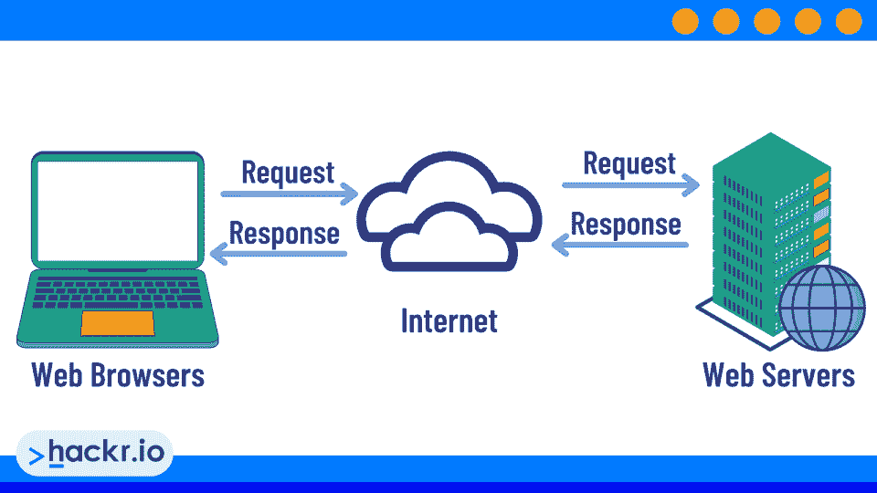

# 什么是 Web 服务器，它们是如何工作的？终极指南[2023]

> 原文：<https://hackr.io/blog/what-is-a-web-server>

web 服务器是为网站存储和提供文件的计算机系统。你访问过的每个网站都托管在网络服务器上。当你输入一个像 www.example.com 这样的网址时，你的电脑会联系 example.com 服务器并请求储存在那里的网页。然后，服务器将请求的网页发送到您的计算机，您的浏览器显示该网页。

网络服务器要么是硬件，要么是软件。硬件 web 服务器是存储网站文件并处理其他计算机对这些文件的请求的物理计算机。软件 web 服务器是运行在物理计算机上的程序，模拟硬件服务器的功能。同理，“web 服务器”可以指硬件本身(物理服务器)或运行服务器的软件架构。

| 

## 什么是 Web 服务器？

*Web 服务器定义:*为用户提供静态和动态网站服务的硬件或软件互联网服务器。 |

## Web 服务器是做什么的？Web 服务器是如何工作的？

一个[网络服务器](https://developer.mozilla.org/en-US/docs/Learn/Common_questions/What_is_a_web_server)在其文件系统中存储一个网站的文件。当用户从网站请求页面时，web 服务器在其文件系统中查找该文件，并将其提供给用户。如果找不到请求的文件，web 服务器将返回 404 错误。如果找到文件但无法呈现，服务器将产生不同的错误(如运行时错误)。

传统上，您会使用域名来访问 web 服务器。例如，您可以键入“Google.com”，然后这个“Google.com”请求会发送到域名服务器。接下来，域名服务器查询自身并询问:

与该地址相关联的互联网服务器是什么？

然后，它将请求重定向到该服务器。

在过去，服务器通常是一台单独的计算机。现在，服务器是由服务器群中的计算机组成的密集网络。

## 你为什么需要网络服务器？

你需要网络服务器来创建网站，像谷歌或亚马逊。

如果没有，你就不得不在个人电脑上存储网站文件。然后，你只能在你的电脑打开时访问你的网站。

当你想起 web 服务器既可以是硬件也可以是软件时，事情就变得令人困惑了。例如，Apache Web 服务器是一个安装在*硬件*计算机上的*软件*解决方案，使计算机成为一个服务器。

## **网络服务器的类型:专用、共享和虚拟**

有三种主要的 web 服务器类型:专用、共享和虚拟。虚拟 web 服务器(纯软件的 web 服务器)可能会使区别变得有点混乱。

*   **专用网络服务器**是租赁给单个客户或由单个客户拥有的单个服务器。服务器软件安装在物理服务器上，物理服务器为网站提供服务。
*   **共享网络服务器**是为多个客户网站提供服务器的单一软件服务器。
*   **虚拟 web 服务器**通过将物理服务器的资源划分为多个虚拟服务器来创建。虚拟服务器不同于共享服务器，因为每个“实例”就像是一个独立的硬件服务器，并且每个都有独立的软件服务器安装。

专用服务器价格昂贵，但功能强大。共享 web 服务器更便宜，但通常可用的资源较少。他们可能会更慢，无法管理更高容量的网站。

| 

### **什么是互联网上的服务器？**

什么是互联网服务器？你可能已经注意到我们在谈论“网络”服务器。但另一种常见的服务器是“邮件”服务器，它只提供电子邮件服务。另一种类型的服务器是“文件”服务器，它只提供文件服务。所有这些服务器都类似地工作；web 服务器就是提供基于 web 的内容的服务器。 |

## **动态与静态网络服务器**

动态 web 服务器提供动态内容:根据用户输入或其他因素而变化的内容。另一方面，静态 web 服务器只提供静态内容(不变的内容)。

动态内容通常由服务器端脚本语言生成，如 [PHP](https://hackr.io/blog/what-is-php) 、Ruby on Rails 或 ASP.NET。静态内容就是不需要由服务器端脚本语言生成的任何内容。这包括 HTML 页面、图像、CSS 文件和 [JavaScript](https://hackr.io/blog/how-to-learn-javascript) 文件。

几乎今天所有的网络服务器都是动态的。

静态 web 服务器最常见的形式是 cdn，它是一种内容交付网络，有助于更快地恢复某些形式的静态内容。

## **网络服务器与网络主机**

在过去，人们可以在自己的房子或公寓里托管网络服务器。今天，人们期望 web 服务一直在线。因此，大多数人将他们的网络服务外包给网络主机。

web 主机是拥有或租赁 web 服务器并向客户提供这些服务器的公司。当你为你的网站购买主机服务时，你只是从一个网络主机那里租用了网络服务器上的空间。

一些虚拟主机提供额外的服务，如电子邮件托管、[域名注册](https://www.namecheap.com/?clickID=wUoTbQ3KtxyNR9L3K50RiSEKUkAx6n2NkXBZwI0&irgwc=1&utm_source=IR&utm_medium=Affiliate&utm_campaign=2890636&affnetwork=ir&ref=ir)和站点构建工具。这些服务通常是可选的；你不需要从你的虚拟主机上购买它们来拥有一个正常运行的网站。然而，他们可以很方便，一些网站所有者更喜欢从一个供应商那里购买所有的服务。

## **网络服务器与云服务器**

近年来，一种新型的服务器开始流行:云服务器。云服务器托管在“云计算”平台上。这些平台允许客户租用各种资源，包括网络服务器。

相比传统的 web 服务器，云服务器有很多优势。它们通常更具可扩展性，这意味着它们能够更好地应对流量高峰。它们也更可靠，因为云服务器通常托管在物理服务器集群上。

但是云服务器可能比传统的网络服务器更贵，因为你是根据你使用的资源付费的。

## **市场上的顶级网络服务器软件**

现在你知道了网络服务器的基本知识，让我们看看市场上最流行的网络服务器软件。

*   **Apache HTTP 服务器。**Apache HTTP Server 是世界上最流行的 web 服务器软件。一半以上的网站都在使用它，而且是免费的。它是用于 web 开发的流行 LAMP 栈(Linux、Apache、MySQL 和 PHP)的一部分。
*   **微软 IIS。**微软 IIS 网络服务器可能是第二大流行的网络服务器软件。与 Apache 不同，它是一个专有的解决方案，但它包含在一些 Windows 包中。
*   **nginx。Nginx 是 Apache 的一个受欢迎的替代产品。它以高性能和低资源使用而闻名。**
*   **Lighttpd。** Lighttpd 是 Apache 和 IIS 的另一个流行替代方案。它是为维基百科和 Flickr 等高流量网站设计的。

虽然 web 服务器软件很重要，但您使用的硬件也很关键。强大的处理器和大量的内存对于一个高流量的网站来说是必不可少的。

## **市场上的顶级虚拟主机服务**

网络服务器和网络服务器软件的基础？检查。现在，让我们看看流行的虚拟主机服务。Web 托管服务提供了 web 服务器的所有好处，而无需自己管理 web 服务器。

*   **[名不虚传。](https://www.namecheap.com/hosting/shared/?clickID=wUoTbQ3KtxyNR9L3K50RiSEKUkAx6E09kXBZwI0&irgwc=1&utm_source=IR&utm_medium=Affiliate&utm_campaign=2890636&affnetwork=ir&ref=ir)** NameCheap 提供大量打折的虚拟主机服务。它们是市场上最受欢迎的托管服务之一，尤其是因为你还可以在它们那里购买和注册你的[域名](https://www.namecheap.com/?clickID=wUoTbQ3KtxyNR9L3K50RiSEKUkAx6n2NkXBZwI0&irgwc=1&utm_source=IR&utm_medium=Affiliate&utm_campaign=2890636&affnetwork=ir&ref=ir)。
*   **蓝色主机。** Bluehost 是全球最大、最受欢迎的网络主机之一。它提供不同价位的各种主机方案。
*   **HostGator。** HostGator 是另一个知名的 web 主机。它提供许多托管计划，包括共享、VPS 和专用计划。
*   InMotion 主机。 InMotion Hosting 以其快速的速度和出色的客户服务而闻名。
*   **A2 托管。** A2 托管提供多种托管计划，包括共享、VPS 和专用计划。
*   **场地。SiteGround 是一家受欢迎的网站，以速度快、客户服务好、价格实惠而闻名。**

## **网络服务器安全实践**

安全性始终是 web 服务器最关心的问题。以下是一些需要记住的最佳实践:

*   让你的软件保持最新。保护您的 web 服务器的最简单方法之一是保持您的软件最新。这包括操作系统、web 服务器软件以及您使用的任何插件或模块。当漏洞被发现时，它们会被迅速修补。如果你不下载补丁，你仍然是一个目标。
*   使用强密码。另一种提高安全性的简单方法是对所有帐户使用强密码。这包括 root 帐户、管理员帐户和任何其他用户帐户。
*   **禁用不必要的服务。**禁用任何并非绝对必要的服务。运行的服务越少，被利用的可能性就越小。
*   **限制访问。**只允许那些需要的人访问你的网络服务器。这包括使用防火墙来阻止不需要的流量。
*   **打开 SSL。**SSL 证书对进出 web 服务器的流量进行加密，保护其免受入侵。

幸运的是，大多数虚拟主机公司也提供安全服务。不仅你的网站会被关闭，你的文件会被删除，而且访问你网站的用户自己的电脑也会受到威胁。

## **结论**

注册 web 服务器是创建自己的 web 应用程序的第一步。虽然您可以使用开发工具包在您的计算机上创建网站，但在您安装 web 服务器之前，没有人能够访问它。

想了解更多关于 web 服务器的信息吗？[注册一个虚拟主机账户](https://www.namecheap.com/hosting/shared/?clickID=wUoTbQ3KtxyNR9L3K50RiSEKUkAx6E09kXBZwI0&irgwc=1&utm_source=IR&utm_medium=Affiliate&utm_campaign=2890636&affnetwork=ir&ref=ir)来建立你自己的网站或者[学习如何创建一个 Python 网络服务器](https://hackr.io/blog/how-to-create-a-python-web-server)。

## **常见问题解答**

#### **1。什么是 Web 服务器(简单定义)？**

web 服务器是存储网站并为互联网上的用户提供服务的任何计算机或软件。“Web 服务器”可以指物理计算机或计算机上支持服务的软件。

#### **2。网络服务器是用来做什么的？**

web 服务器用于存储网站并提供给互联网上的用户。Web 服务器驱动着绝大多数的可见互联网。Web 服务器也可以用于启用某些类型的移动应用程序。

#### **3。Web 服务器的例子是什么？**

亚马逊的“亚马逊网络服务”包括一项名为 Amazon Lightsail 的网络服务。还有虚拟专用服务器(VPS)，它模拟一个完整的硬件服务器，但它们实际上是一台机器上的多个虚拟服务器。

#### **4。谷歌是网络服务器吗？**

Google 不是 web 服务器，但是 Google 运行在服务器上。谷歌等网站的服务器需要非常强大，因为谷歌每天都要为其网站提供许多副本。

#### **5。服务器和 Web 服务器有什么区别？**

服务器是存储数据并向用户提供数据的任何计算机。web 服务器存储网站并为互联网上的用户提供服务。

#### **6。网络服务器是如何工作的？**

网络服务器连接到互联网。当有人想要连接到 web 服务器时，web 服务器会收到用户想要查看的文件列表。然后，这些文件在服务器上呈现，然后发送到用户的浏览器，在用户的浏览器中呈现。

**人也在读:**