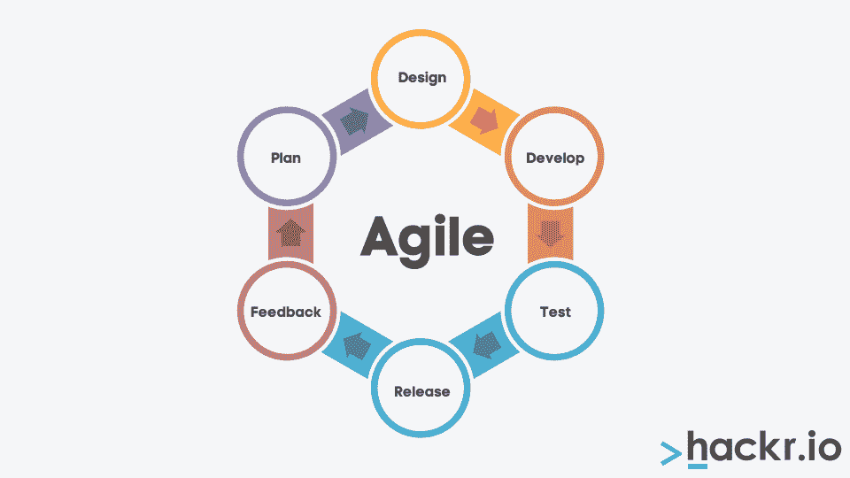
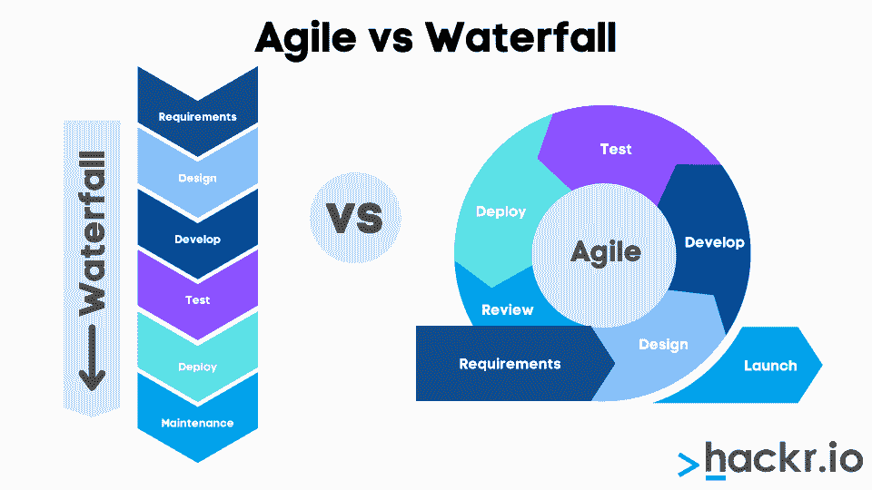

# 什么是敏捷方法论？

> 原文：<https://hackr.io/blog/what-is-agile-methodology>

[软件开发](https://hackr.io/tutorials/learn-software-development)可能是一项复杂的任务，几十年来，人们一直非常关注简化流程，以使跨职能团队和消费者都受益。随着软件开发在我们的生活中占据越来越多的位置，这种对软件目标的一致和可靠交付的需求变得越来越重要。

敏捷软件开发采用迭代开发的思想，并赋予它一种方法论。就像它的名字一样，敏捷指的是快速、稳定和可预测的开发目标的交付。

在这里，我们涵盖了什么是敏捷方法，管理其开发的敏捷宣言，一些具体的敏捷方法，等等。

## 什么是敏捷方法论？概述

敏捷项目管理是指通过迭代开发软件的思想，也就是说，它关注于通过跨职能协作的迭代开发。敏捷开发的一个常见表现是将大型项目分成较小的项目。

这些较小的任务被安排在整个[软件开发生命周期](https://hackr.io/blog/sdlc-methodologies)的短时间内完成。此外，这些任务要经过频繁的重新评估，并适应计划的变化。

敏捷开发是一个相当宽泛的术语，正如我们将看到的，有几种方法都可以称为敏捷开发。任何满足敏捷宣言所建立的标准的开发过程都被认为是敏捷开发。

敏捷过程自 21 世纪初出现以来已经变得很流行，据[项目管理协会](https://www.pmi.org/-/media/pmi/documents/public/pdf/learning/thought-leadership/pulse/pulse-of-the-profession-2017.pdf)称，大约 71%的组织在他们的项目中采用敏捷方法。这并不奇怪，因为这有助于团队更快地完成任务并优化工作流程。以前使用的传统“瀑布方法”不如分而治之的方法有效，尽管它确实有其用途。

## 敏捷的好处是什么？

敏捷给软件开发生态系统中的所有利益相关者带来了一些好处，包括客户、供应商和开发团队。由于迭代开发使得工作更容易生产和交付，所以即使粗略地看一眼，也很容易看到好处。

客户可以在更短的开发周期内更快地获得可交付的产品，并且一致认为供应商对开发请求的响应更快。供应商自己可以用较少的开销专注于高价值的功能。开发团队看到他们的非生产性工作通过允许他们关注那些优先的高价值特性而减少。

产品和项目经理也有更好的计划的好处，因为他们可以更少地推测敏捷带来的可见开发过程。他们对项目的状态有了更好的认识，并根据实际数据做出决策。

## **什么是敏捷宣言？**

任何遵循敏捷宣言中列出的原则的开发过程都被认为是敏捷项目。有 12 个这样的指导原则，以及敏捷宣言概述的四个核心规则。

敏捷宣言于 2001 年由 17 名行业资深人士成立，他们看到了创建不繁琐、不响应的软件开发过程的需要。这个想法是设计一个新的过程，使软件开发更加有效。经过这样的讨论，他们提出了一系列定义高效和响应性软件开发过程的原则。

这就是众所周知的敏捷宣言，从那以后，它在软件开发领域发挥了巨大的作用。通过关注增量发布软件，敏捷是对以前的软件开发模型的一个重大转变，并且很快被主要的技术公司采用。

## 为什么敏捷宣言很重要？

敏捷与以前使用的瀑布模型形成了强烈的对比，瀑布模型会在整个周期的末尾发布项目。敏捷使得在整个开发周期中一致地发布核心特性成为可能，同时还减少了这些短时间冲刺工作的开发周期。

一般来说，焦点更多的是与管道中的利益相关者互动，以交付正确的产品。与[瀑布模型](https://hackr.io/blog/agile-vs-waterfall)相反，在迭代过程中更加强调这一方面，在瀑布模型中，概念和项目周期结束之间有很长的间隔。

## **敏捷宣言的核心价值观**

支持迭代开发愿景的是敏捷宣言的核心价值，它不同于 12 条指导原则本身。这四个核心价值描述了指导原则应该追求的目标，并且在很大程度上与让所有涉众更好地体验项目有关。

敏捷宣言的四个核心价值是:

*   过程和工具之上的个人和交互
*   综合文档之上的工作软件
*   合同谈判中的客户协作
*   按照计划应对变化

第一个核心价值观注重团队合作和沟通。

在项目工作中，有许多工具和资源可以与团队成员和客户进行协调。将这些工具整合到项目中是非常重要的。但是，不建议完全依赖工具。相反，团队应该专注于人际互动或讨论，以解决任何普遍存在的歧义。毕竟，人的因素对于良好的沟通极其重要。

### **综合文档之上的工作软件**

毫无疑问，文档非常重要，是用户的重要参考，但工作软件更重要。软件开发的主要目标是构建保证业务优势的软件，而不是庞大的文档。

### **合同谈判中的客户协作**

开发团队需要与他们的客户进行定期对话，因为他们实际上是开发过程中非常有用的一部分。沟通会议帮助团队理解客户的需求，反馈对于迭代改进是必不可少的。通过这种方式，团队清楚涉众的需求，并交付适当细化的最终产品。

### **按照计划响应变更**

俗话说‘变化是唯一不变的’，敏捷宣言要求你拥抱它。有些情况下，项目需要根据客户的需求进行修改。在这种情况下，您的项目计划必须具有根据需要进行更改的灵活性。

既然你已经知道了四个核心价值，那么是时候分析敏捷宣言的 12 个原则了。这些旨在指导您高效地构建产品。

## **敏捷宣言的 12 条原则**

敏捷宣言包括 12 条原则。 [12 条指导原则](https://agilemanifesto.org/principles.html)如下:

1.  最高优先级是通过软件的早期和持续交付来满足客户。
2.  即使在开发的后期，也欢迎需求的变化。变革可以利用竞争优势。
3.  经常向涉众交付工作软件。
4.  开发人员和客户必须每天一起工作。
5.  围绕有积极性的个人来构建你的项目。给他们提供一个良好的环境和支持。
6.  面对面的谈话是向开发团队传达信息的最有效的方法。
7.  工作软件是衡量进度的基础。
8.  敏捷方法促进可持续发展。开发者、赞助商和用户应该保持持续的合作速度。
9.  对良好设计和技术卓越的持续关注增强了敏捷性。
10.  选择简单，因为这是一门最大化未完成工作量的艺术。
11.  自组织团队交付最好的设计、架构和需求。
12.  团队必须定期反思如何提高效率，并相应地调整自己的行为。

这些原则是不言自明的，可以作为如何开发软件的总体指导方针。很明显，重点是客户和开发团队之间的沟通，并确保没有误解需求的余地。

## **敏捷模型与瀑布方法**

敏捷模型已经取代了旧的瀑布模型。这两者之间有一些明显的区别。

瀑布模型是一个线性顺序模型，与敏捷的迭代风格相反。两者都有优点和缺点，但是重要的是要知道瀑布模型不提供在项目中途改变目标的空间，并且它不适合大规模的项目。

**阅读更多:** [敏捷 vs 瀑布](https://hackr.io/blog/agile-vs-waterfall)

### **敏捷方法**

*   敏捷方法概述了软件设计的交互式方法
*   这种方法将一个大项目分解成更小的子任务。这样，您可以更快、更高效地获得最终产品
*   客户可以经常访问以检查产品的进度，并在需要时进行一些更改
*   与瀑布方法相比，敏捷方法被称为非结构化方法
*   如果项目之间出现任何错误，都可以修复
*   软件开发比文档更受重视

### **瀑布法**

*   软件的开发工作流程从开始到结束按顺序运行
*   在这个模型中，没有将项目分成几个子任务
*   禁止客户查看开发阶段的产品
*   瀑布模型是广泛面向计划的。因此，它被认为更安全
*   项目只有在结束后才进行测试。如果出现任何错误，项目将从头开始
*   文档优先于软件开发

## 有哪些敏捷开发方法？

所以你现在知道敏捷方法概述了一种帮助在整个开发生命周期中持续开发和测试软件的方法。实际上，团队使用了相当多的方法来在他们的项目中实现有效和系统的敏捷方法。

以下是一些组织采用的最流行的方法:

*   混乱
*   适应性软件开发
*   极限编程
*   特性驱动开发
*   动态软件开发方法
*   行为驱动发展
*   看板法

有必要详细研究一下其中的一些。

## 你应该使用哪种敏捷方法——Scrum、看板还是其他？

即使在敏捷方法中，团队也可以使用一整套框架来更好地优化他们的软件开发过程。总的来说，它们遵循相同的总体哲学，只是在过程的细节上有所不同。下面我们描述一些最流行的框架。

### **Scrum**

由 Ken Schwaber 和 Jeff Sutherland 建立的 Scrum 是一个处理复杂适应性问题的轻量级框架。Scrum 执行 8 到 10 个开发人员的小团队，包括一个产品负责人和一个 Scrum 大师。这是最流行的敏捷方法之一。

Scrum 官方网站更喜欢称自己为经验主义的科学方法，而不是方法论。Scrum 事件定义了开发人员之间的会议，每个会议都有自己的时间和目的。其中一些是冲刺，冲刺计划和冲刺回顾。

这个项目被分成 2-3 周的周期——这就是 sprints。sprint 概述了任何项目开发发生的时期。执行多次冲刺，将产品交付给客户。

此外，产品所有者在一组说明中解释产品功能。这些指令被分配了特定的优先级，并被整合到每个 sprint 中。

这种方法的最终目标是让团队在最后向产品所有者解释每个 sprint 的功能和结果。

### 适应性软件开发(ASD)

自适应软件开发是由 Sam Bayer 和 Jim Highsmith 在 20 世纪 90 年代早期创建的，它使用一种叫做推测、合作和学习的动态开发周期。

这个循环意味着客户和开发人员之间的不断学习和不断合作。产品开发中可能会发生频繁的变化。

此外，ASD 包含快速应用程序开发或 RAD。RAD 强调开发速度，以创建在每个阶段都涉及用户的精确产品。

以下是 ASD 的一些关键特征:

*   **推测:**项目的初始阶段，利益相关者通过分析项目生命周期中涉及的风险领域来设定基本目标。
*   **协作:**这个阶段包括开发和沟通。所有的团队相互协调，以了解项目的进展和需求。
*   **学习:**学习阶段侧重于协作周期，团队成员分析在项目工作中获得的知识。它反映了工作的有效性。

### **极限编程(XP)**

极限编程(Extreme Programming)(XP)是一个软件开发框架，它的目标是为开发团队生产更高质量的软件和更高质量的生活。

主要的焦点是加强团队内部的个人联系，以更好地进行软件开发。

XP 的一般特征是:

*   动态变化的软件需求
*   使用新技术的固定时间项目引起的风险
*   小型的、同处一地的扩展开发团队
*   您正在使用的技术允许自动化的单元和功能测试

XP 被推荐用于有高变化需求的项目。

### **功能驱动开发**

由 Jeff De Luca 和 Peter Coad 于 1997 年开发的特性驱动开发框架，特别关注使用短迭代工作的大型团队。目标是在短时间内促进特性的交付。

在 FDD 框架下，该项目通常有 5 个阶段，将各个功能放在前面和中心。最初的三个阶段是连续的——它们是“开发一个整体模型”、“构建一个特性列表”和“按特性计划”阶段。最后两个阶段——“基于特性的设计”和“基于特性的构建”——是交互的。

在 FDD 中，有各种各样的活动来帮助队友解决沟通挑战和更好地协调。它在大型组织中特别有用，但不经常用于较小的项目。

### **动态软件开发方法**

动态软件开发方法(DSDM)是一个框架，它关注于项目的大战略目标，并定制开发过程以最适合实现该目标。它有八个指导原则，与敏捷宣言的原则非常相似。

DSDM 的主要目标之一是根据进度和预算来描述软件项目的特征。它也是独立于供应商的，并建议使用引导式研讨会、建模和迭代开发、莫斯科优先化和时间限制。

DSDM 也与 Scrum 和其他敏捷框架协同工作。在过去的几年里，它越来越受欢迎。

### **行为驱动开发**

行为驱动开发(BDD)框架是从测试驱动开发和验收测试驱动开发演化而来的。

该过程旨在促进非技术人员参与软件开发过程。这个想法是通过明确业务成果是什么来更好地将业务相关的目标集成到产品的功能中。

BDD 激励技术人员和非技术人员通过遵循一定的程序在软件项目上协作工作。这些包括在开发过程中创建测试场景和特性。BDD 帮助团队定期交流，发现错误或缺陷，并构建可持续的软件产品。

### **看板法**

有趣的是，看板方法起源于丰田开发的准时制(JIT)生产流程，其中几个卡片用于识别生产链中的需求。大卫·安德森在 2000 年代中期开发了它。

正如敏捷联盟所描述的，看板方法专注于设计、管理和改进知识工作的流程系统。它的价值观中包含透明、平衡、协作、流动和领导力，尽管还有其他特征。

看板是一个可视化系统，通过可视化工作流程和实际工作来实现工作管理。主要目标是识别开发过程中可能出现的障碍，并随后解决它们。

这种方法是对其他敏捷方法，确切地说是 Scrum 所面临的各种挑战的回应。这种方法与非破坏性进化方法相反。

此外，它有助于连续输送产品，而不是持续 2 至 3 周的时间。这导致了更快的周转。

## **敏捷方法对于软件开发至关重要**

最近几年，组织已经开始关注不同的方法来构建项目，而敏捷是其中的佼佼者。这很重要，因为敏捷方法有助于提高效率和有效性，并减少完成项目所需的时间。

敏捷的采用与日俱增，金融、媒体、技术和政府中的公司也采用了敏捷方法。既然您已经确切地知道了什么是敏捷方法，我们建议您在未来的项目中尝试实践它的核心原则。如果你打算加入一个大规模的组织，这是非常值得知道的，它可以大大简化开发过程。

有兴趣学习敏捷软件开发的基础知识吗？请查看下面的课程。

[敏捷软件开发的基础](https://click.linksynergy.com/link?id=jU79Zysihs4&offerid=1045023.2385176&type=2&murl=https%3A%2F%2Fwww.udemy.com%2Fcourse%2Ffundamentals-of-agile-software-development%2F)

**人也在读:**