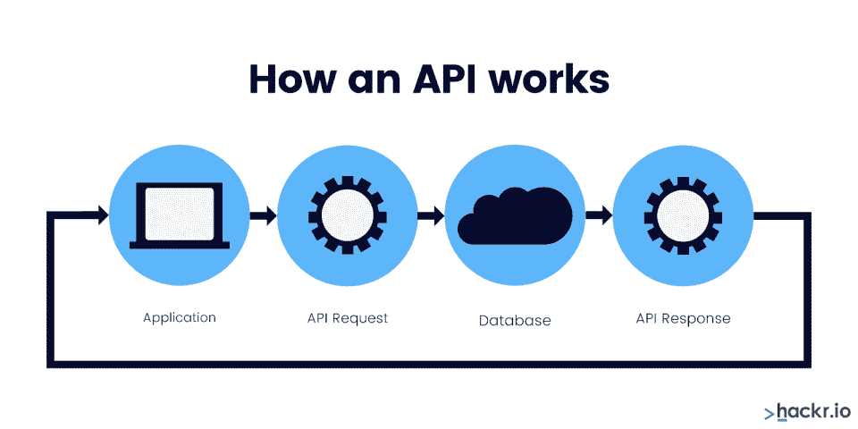
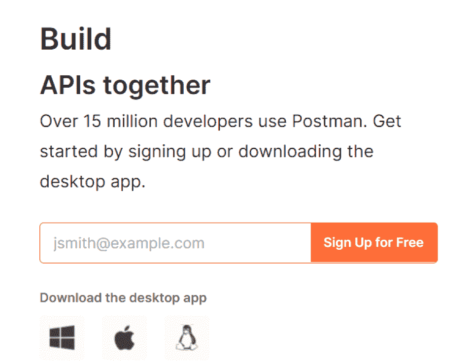
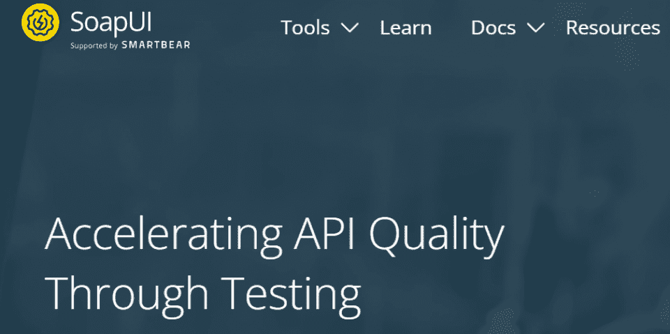
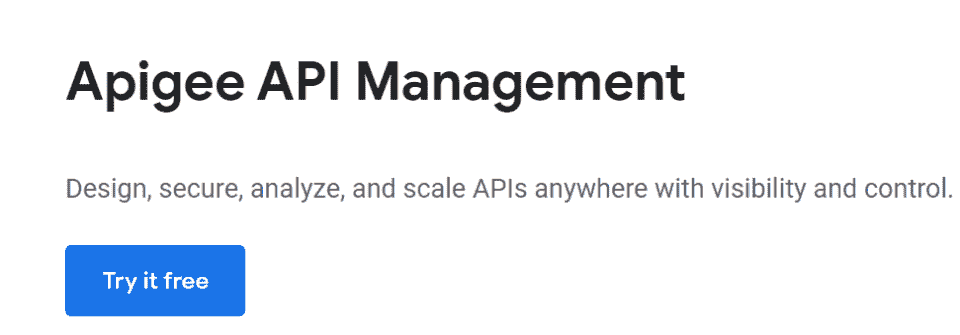
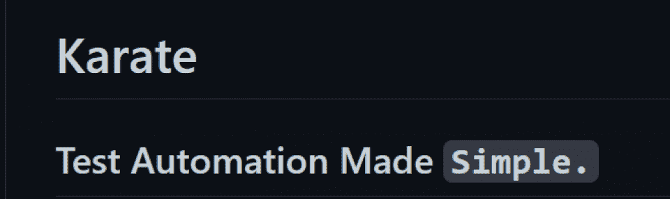

# 什么是 API 测试？了解 API 及其工作原理

> 原文：<https://hackr.io/blog/what-is-api-testing>

您是否正在尝试找出如何执行 API 测试？也许你想开始做，但不确定从哪里开始？不要烦恼。从不同类型的 API 测试方法到 API 测试工具，您将在本文中了解到关于 API 测试的所有知识。

但是在我们开始之前，首先要做的是:

## 什么是 API？

API 或应用程序编程接口就像是两个独立系统之间的中间人。它的主要工作是将用户的响应传递给系统，并将系统的响应返回给用户。

例如， [ProcurementExpress](https://www.procurementexpress.com/) (PE)有一个 API 允许它与 Xero 无缝连接。API 也为 PE 和 Xero 的用户定义了数据格式。这样，两个平台可以相互交换数据。那是怎么发生的？API 有一套算法，告诉 PE 和 Xero 如何互相对话。很酷，对吧？

简而言之，API 有一个接口，允许你提出一个特定的“请求”来处理信息。它还允许你使用像 [JSON](https://hackr.io/blog/json-vs-xml) 这样的编程语言。

## 什么是 API 测试？

像编程中的任何事情一样，用户在使用 API 之前必须对其进行测试。因此，我们称测试过程为“API 测试”如果你不确定什么是软件测试，[看看我们的软件测试指南](https://hackr.io/blog/what-is-software-testing)。

开发人员执行 API 测试，以确认它符合所有条件。它们包括用户友好性、可靠性、性能和安全性。此外，API 测试暴露了不一致性、错误和任何其他与性能相关的问题。

通常，所有应用程序都有三个独立的层:

*   用户界面层
*   应用程序用户界面
*   软件架构层，这是您执行 API 测试的地方

## 为什么 API 测试至关重要？

云应用的兴起增加了 API 和 API 测试的使用。企业和个人使用的大多数应用程序都依赖于互连的 API。因此，API 测试是至关重要的，原因如下:

*   API 测试增强了应用程序的性能。
*   API 测试允许您通过 XML 和 JSON 交换数据。
*   您可以使用 API 测试来检查应用程序的核心功能，识别小错误，并检查系统的强度。
*   您可以使用 API 的特性来创建具有高测试覆盖率的自动化测试。这也包括正面和负面的案例。
*   API 测试节省了您的时间。例如，仅仅通过进行 API 测试，您就可以节省八个小时。相比之下，如果你只做 [UI 测试](https://hackr.io/blog/types-of-software-testing)，你将会花费无数的时间。
*   执行 API 测试的一个主要优势是您可以在早期捕捉错误。
*   您不必等待开发来构建您的 API 测试。另外，您可以开发它们来与您的测试用例兼容。

## **如何进行 API 测试**

您需要遵循特定的步骤来完成 API 测试过程。自然，这将有助于在定义好目标的情况下开始 API 测试。或者至少对 API 的工作原理有透彻的理解。

在进行 API 测试之前要考虑的一些问题是:

*   我将遵循什么程序？
*   我将使用哪些工具进行测试？
*   在测试 API 之前，我应该做的第一件事是什么？
*   每次不成功的测试都会出现哪条错误消息？
*   每个成功的请求都会出现哪条消息？

一旦掌握了上述问题的答案，就可以使用 7 个 API 测试中的一个了。

## **API 测试的类型**

**验证测试**:在这种测试中，你会用到一些基本问题。您可以使用的资格确认问题示例包括:

*   我们是否正确地构建了产品？
*   我们使用的 API 对于解决问题是否足够有效？
*   我们遇到过任何重大的编码障碍吗？如果是的话，这些绊脚石是什么，我们将如何消除它们？
*   我们是否有一些冗长的代码需要花费时间来修复，并且会将 API 推向错误的方向？
*   最重要的是，API 是否准确地存储了数据？

1.  **功能测试:**这个测试将确保 API 执行它需要做的事情。你是怎么做到的？通过分析代码库中的特定函数。这将确保 API 准确地处理错误。
2.  **负载测试**:这种 API 测试决定了一个 API 可以处理多少个请求。在大多数情况下，您将在每个代码库之后使用负载测试。你的目标是确认 API 在压力下是否能正常工作。
3.  **可靠性测试:**该测试帮助您在所有平台上开发一致的结果。
4.  **安全性测试:**假设你要测试一个 API 的安全性。你到底从哪里开始？你开始检查你的 API 的渗透水平。在那里，您确认授权检查和用户权限管理。
5.  **渗透测试**:您将在安全测试之后进行渗透测试。为什么？因为您必须从外部角度分析攻击媒介。一个例子是当你使用渗透测试来针对整个 API。
6.  **模糊测试**:您将使用这个测试来测试系统的负面行为。例如，当您试图强制数据崩溃或溢出时。

## **API 测试的好处**

使用 API 测试有很多好处——让我们来看看其中的一些:

[API 和 Web 服务介绍](https://click.linksynergy.com/deeplink?id=jU79Zysihs4&mid=39197&murl=https%3A%2F%2Fwww.udemy.com%2Fcourse%2Fapi-and-web-service-introduction%2F)

## **如何进行 API 测试**

按照以下步骤执行 API 测试:

*   记录所有的 API 测试要求。这将帮助你计划你的 API 测试。问问你自己:我们将使用 API 做什么？我们的应用程序有工作流吗？如果没有，为什么？哪些应用可以与我们的系统集成？
*   **建立测试环境。**一旦您记录了您的测试需求，看看您的测试环境。您所有的数据库和服务器应用程序都符合标准吗？看看是否还有任何需要执行的配置，并立即执行！
*   **整合应用数据。**接下来，将您的应用程序数据与 API 测试放在一起，以确保一切正常。请记住，您的 API 特性在任何配置下都应该表现良好。
*   决定 API 测试的类型。一旦您集成了您的应用程序数据，您需要决定您将使用哪种 API 测试。我们已经在上面强调了一些不同类型的 API 测试。
*   **考虑文本执行和报告**。如果您想正确地执行 API 测试，就不能忽略文本和报告。最简单的方法是创建测试用例。想一想普通用户在请求 API 时可能面临的场景。测试这些场景并提出一份报告。

考虑使用下面的 [API 测试工具](https://hackr.io/blog/best-api-testing-tools)中的一个来像专家一样执行你的 API 测试。

当 Postman 首次推向市场时，它是一个谷歌 Chrome 插件。今天，你可以使用 Postman 来测试任何 API。有趣的是，Mac 和 Windows 用户也可以使用它。您可以使用 Postman 来自动化测试、执行调试和运行请求。

**特性**

*   Postman 接口允许你提取 web API 数据。
*   您可以使用它来编写布尔测试。
*   它带有内置工具、集合和工作区。
*   Postman 支持各种格式，包括 RAML 和 Swagger。

**定价**

虽然你可以免费使用它，但额外的功能要花 12 美元。

您可以使用这个漂亮的工具来运行 web 服务和 API 测试。它的好处是提供了免费套餐和固定套餐。开发者可以使用它的免费包来授权用户访问完整的源代码。

**特性**

*   它允许您重用安全扫描和功能测试用例的负载测试。

*   它具有点击和拖放功能，可以简单快速地创建测试。

*   它支持异步测试。

*   它具有数据驱动的测试功能。

*   它允许你合成数据生成。

**定价**

你可以免费使用它。然而，如果你希望享受其他福利，费用从每年 640€开始。

Apigee 是你应该考虑的另一个 API 测试工具，由 Google 提供。这是一个跨云 API 测试工具，拥有无数的特性。您可以用它来测量和测试 API 性能。

**特性**

*   Apigee 具有跟踪错误率、API 流量和响应时间的功能。
*   借助“OpenAPI 规范”及其在云中的部署，您可以使用它来创建代理。
*   它与包含大量数据的 API 兼容。

**定价**

你可以免费使用 Apigee。

你熟悉空手道 DSL 吗？如果你不是，你应该试一试。使用这个很酷的 API 测试工具，您可以做很多事情，从为基于 API 的 BDD 测试创建场景到为场景创建定义。

**特性**

*   空手道 DSL 对 WebSocket 有基于同步能力的支持。

*   它允许编写测试，即使是对技术恐惧的人。

*   它支持多线程并行执行和配置升级或切换。

**定价**

空手道 DSL 有开源定价，这意味着它对任何开发者都是可用的。

## 最后的想法

每个企业在某个时间点都需要集成。没有 API 测试，集成是不可能无缝的。如今，大多数公司都使用 API 集成平台，如 [Zapier](https://zapier.com/) ，它允许你与其他尖端技术集成。

对于任何想要正确执行 API 测试的开发人员来说，解决基础问题非常重要。因此，花时间让自己熟悉执行 API 测试的所有技巧和工具。还可以考虑参加一个课程，通过深入了解 API 知识来提升自己。