# Arduino 是什么？理解它的初学者指南

> 原文：<https://hackr.io/blog/what-is-arduino>

如果你是工科学生或专业人士，你可能听说过 Arduino 平台。这个名字最近成了电子专业学生的流行语。

Arduino 是什么？嗯，以前，从事电子工作需要对数学、物理和其他概念有很强的理解。但是随着技术的出现，各种工具和设备改变了电子工作模式，因此不再需要大量的知识。

“Arduino”是这些降临节设备中的一件，它有助于学生在职业生涯的早期阶段理解电子概念。你可能会有很多问题，比如 Arduino 是做什么用的，Arduino 使用什么语言？

我们很快会深入了解 Arduino electronics。

本文向您介绍 Arduino 的含义及其历史。它还将涵盖各种可用的 Arduino 板、Arduino 微处理器、为什么使用 Arduino、Arduino UNO 的组件以及 Arduino 的限制和应用。

让我们开始吧。

## **Arduino 是什么？**

Arduino 是一个 [开源](https://digital.gov/topics/open-source/) 平台，帮助电路开发者构建电子项目。它包括硬件和软件。Arduino 硬件是一个被称为微控制器的可编程电路板。Arduino 软件是一个 IDE(集成开发环境)，开发人员通过它编写代码并上传到微控制器。

我们可以向 Arduino 板输入一个带有一组指令的程序，它可以执行简单到复杂的任务。传统的可编程电路板需要单独的硬件将代码加载到电路板上。但是 Arduino 消除了对硬件的需求；相反，它使用简单的 USB 电缆将代码加载到 Arduino 板上。

Arduino 板使开发人员能够以 C++语言的简化版本输入程序，使他们更容易学习和编码。

### **Arduino UNO 入门套件规格**

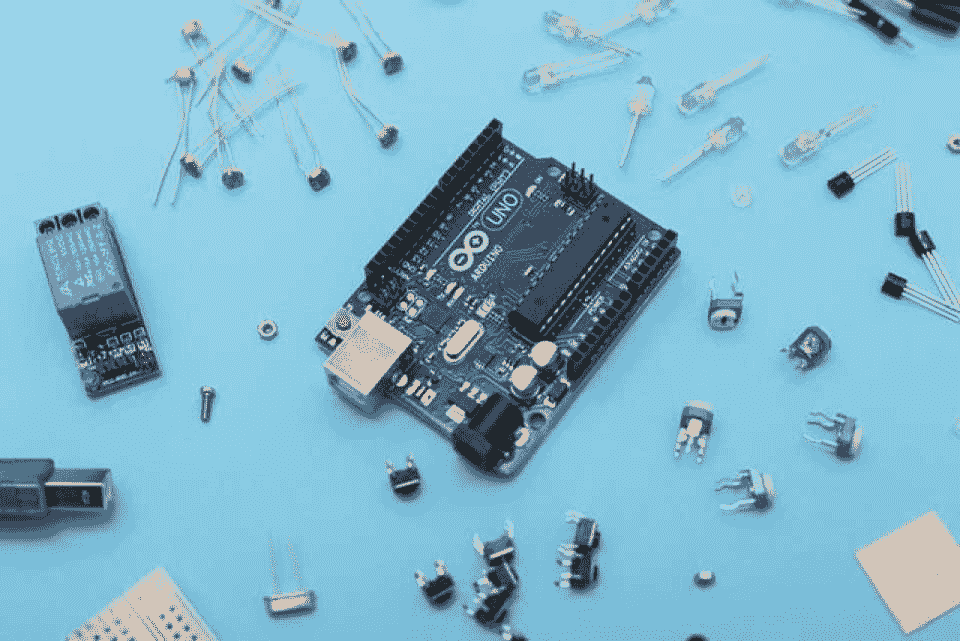

### **Arduino 硬件**

Arduino 的硬件部分是它的可编程电路板。您可能在工作中遇到过各种 Arduino 板，但最常用的 Arduino 板是 Arduino UNO。所有 Arduino 板都有一个被称为小型计算机的微控制器，这是 Arduino 的心脏。

因此，在学习 Arduino 时，了解微控制器以及如何使用它们是必不可少的。Arduino 微控制器负责读取不同的输入并控制输出。

### **Arduino 软件**

Arduino 的软件叫做 Arduino IDE。您可以在电脑上下载该软件，并对 Arduino 板进行编程，以执行相应的各种任务。

[IDE](https://hackr.io/blog/web-development-ide) 类似于一个文本编辑器，在这里你为 Arduino 板编写指令。

**Arduino 代码**

### 除了硬件和软件，Arduino 的第三个最重要的方面是它的代码，也称为草图。您可以在 Arduino IDE 中编写代码，并将其加载到板上。

你可能想知道 Arduino 用什么语言编写代码。Arduino 有其类似于 C++的本地语言，称为 Arduino 编程语言。任何使用 Arduino 编程语言开发的程序都被称为 sketch，并保存在一个带有。ino 分机。

要为 Arduino 板编写指令，您必须对 C 和 C++编程语言有基本的了解。

硬件、软件和代码共同组成了 Arduino。

[Arduino 循序渐进:入门](https://click.linksynergy.com/deeplink?id=jU79Zysihs4&mid=39197&murl=https%3A%2F%2Fwww.udemy.com%2Fcourse%2Farduino-sbs-17gs%2F)

**Arduino 板卡的类型**

## 您可以使用 Arduino 创建不同的板卡，每个板卡都具有额外的功能。这是一个开源硬件，允许任何人进行更改并创建 Arduino 板的各种衍生物。这些变化允许您添加多种功能。

以下是一些即使是电脑新手也能使用的常见 Arduino 类型:

**1。Arduino UNO (R3)**

### 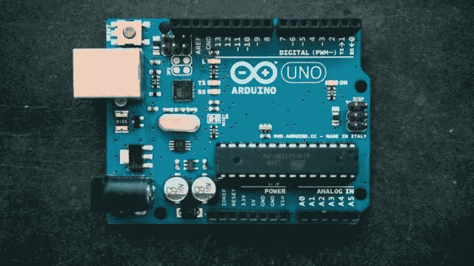

UNO 是涉足电子领域最容易的选择之一。它依赖于基于 ATmega328P 的微控制器，具有以下特点:

14 个数字输入/输出引脚

*   用于 PWM 的 6 个引脚
*   6 个模拟输入引脚
*   一个复位按钮
*   USB 连接
*   Arduino UNO (R3)拥有支撑微控制器所需的一切。你所需要做的就是通过 USB 电缆将它连接到你的电脑上，并提供一个交流到 DC 的适配器或电池来使它工作。

**2。Arduino Nano**

### 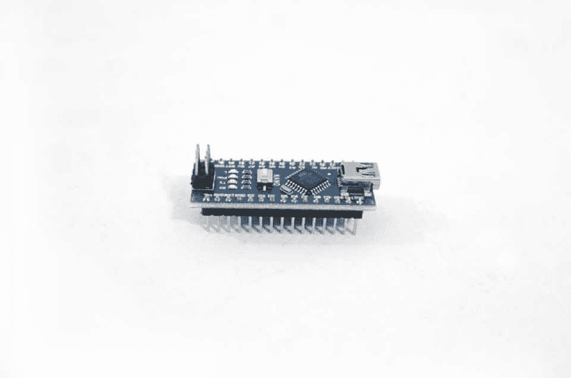
该板的连接类似于 UNO，但基于 ATmega328P 和 ATmega628 微控制器。这款小巧、灵活、可靠的主板配有迷你 USB 接口，非常适合创建项目。

该板带有 8 个模拟引脚、14 个数字引脚和 1 个 I/O 引脚、6 个电源引脚&和 2 个 RST(复位)引脚。

**3。Arduino Micro**

### 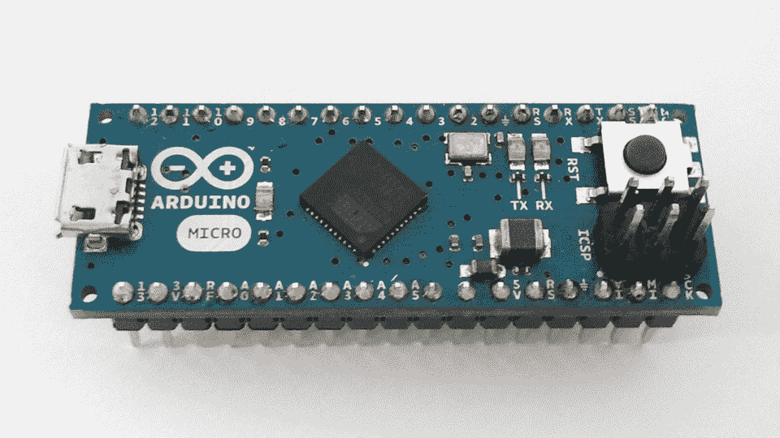

这种类型的 Arduino 有一个基于 ATmega32U4 的微控制器，它有 20 组引脚，其中 7 组用于 PWM，还有 12 个模拟输入引脚。Arduino Micro 还配有 ICSP 接头、RST 按钮、小型 USB 连接和 16 MHz 晶体振荡器。

这款 Arduino Micro 是 Leonardo 电路板的迷你版，内置 USB 接口。

**4。Arduino Lilypad**

### 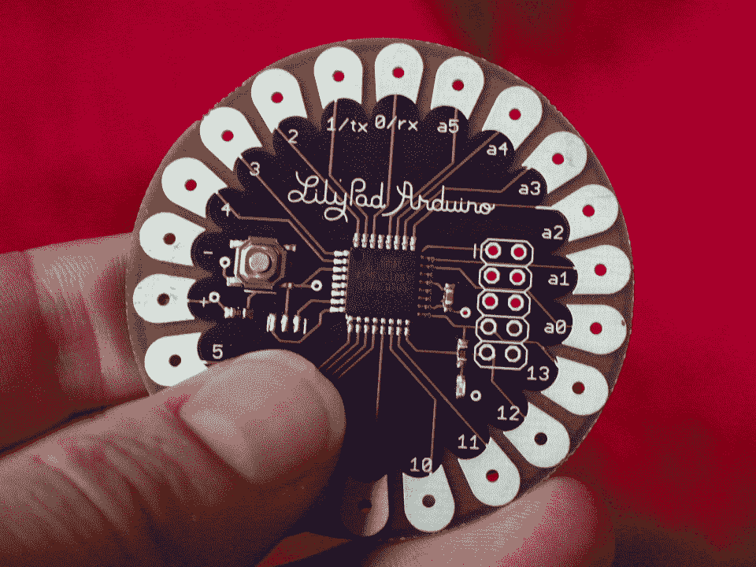

Lily Pad Arduino 板是一种电子纺织技术。这个硬件由 Leah“Buechley”扩展，由“Leah and SparkFun”设计每块电路板都设计有坚固的连接垫，背面光滑，可以用导线缝进衣服里。这个 Arduino 有 I/O、电源和传感器板。一个很好的好处是，这个 Arduino 板甚至可以清洗！

**5。Arduino RedBoard**

### 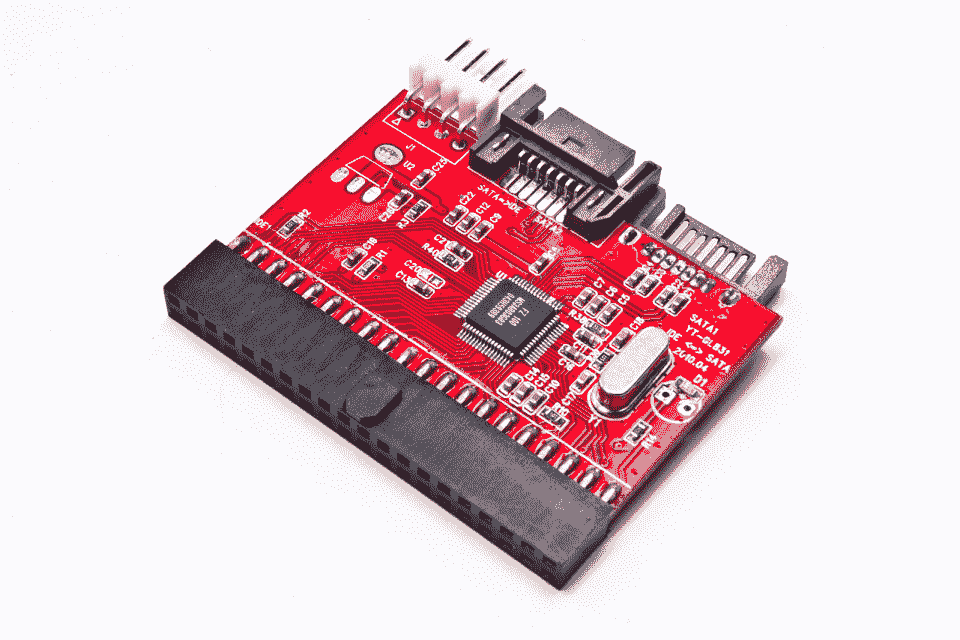

您可以使用 mini-b USB 对该板进行编程。与之前的 Lilypad 一样，这块板的背面是平的，便于放置。您可以在 Windows 8 上有效地使用该板，而无需更改设置。此外，您只需将此板插入您的系统，并编写代码上传到板上。您可以使用桶形插孔和 USB 电缆来控制此板。

**6。Arduino Mega R3**

### 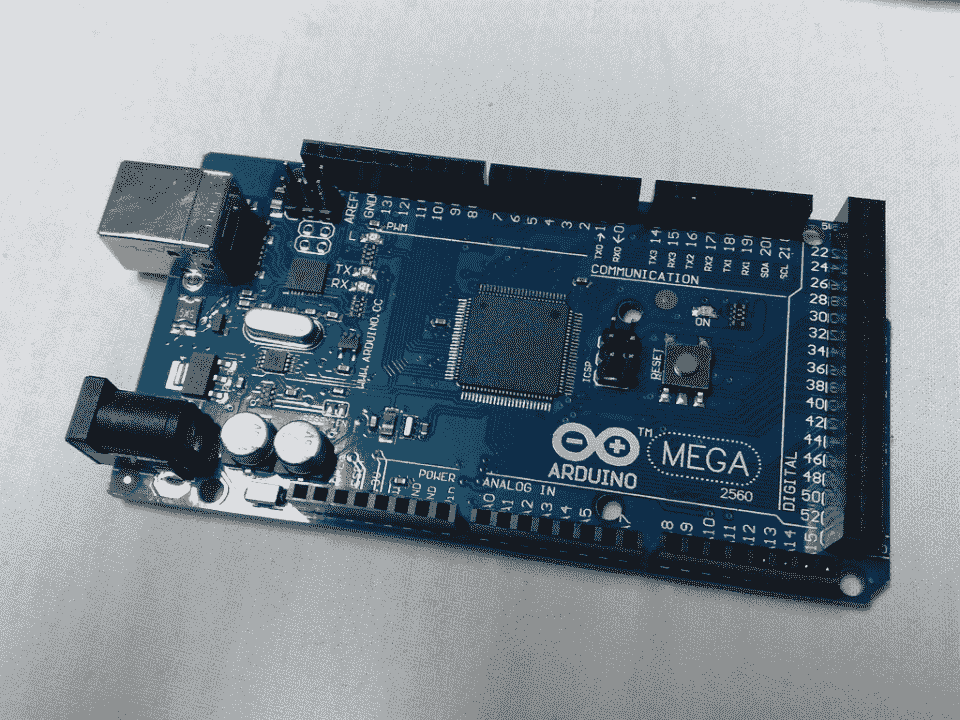

Arduino Mega R3 是 Arduino UNO 的扩展形式，带有一个数字 I/O 引脚。它还有 14 个用作 PWM o/ps 的引脚、6 个用于模拟输入的引脚、一个复位按钮、一个电源插孔和一个 USB 连接。

你可以用 USB 线和电脑交流。这款 Arduino 板非常适合设计需要大量数字输入和输出的项目。

**7。Arduino 莱昂纳多**

### 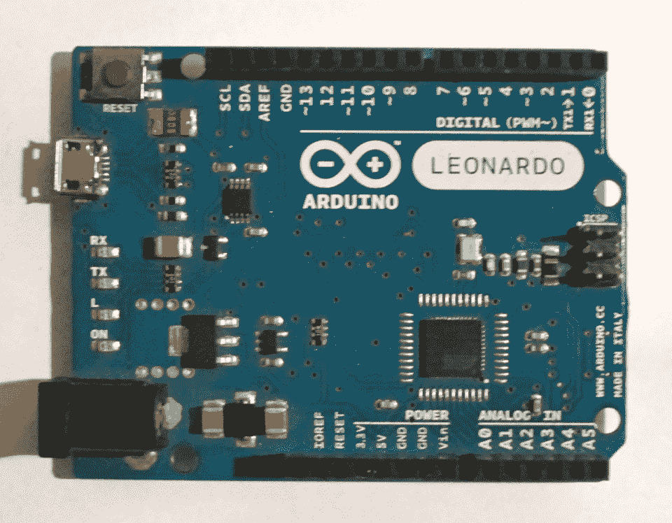

这款 Arduino 是首款带有一个微控制器和一个 USB 的开发板。它是最简单和最便宜的 Arduino 类型，非常适合新手使用。

Arduino 板上有什么？

## 在市面上所有的 Arduino 板卡中，最简单、最常用的是 Arduino UNO。其中一些主板可能有不同的外观和感觉，但都有一些标准组件。因此，让我们在这里讨论它的基本组成部分。

Arduino UNO

#### 这是一个简单而常用的原型板，甚至适合初学者与电子产品相处。作为最基本的一个，对每个电子开发者来说，了解它的不同组成部分是至关重要的。

UNO 配有一个 ATmega328P 微控制器。它有两种变体:一种是通孔微控制器连接，另一种是表面贴装型。在通孔模型中，如果出现任何错误，您可以用新的芯片替换它。

Arduino UNO 是一款采用 AVR 架构的 8 位微控制器，它提供不同的特性和功能。

UNO 共有 14 个数字输入输出(I/O)引脚，您可以将其用作输入或输出。在这 14 个引脚中，您可以使用 6 个引脚来产生 PWM 信号。该板上的每个引脚工作电压为 5V，电流为 20mA。

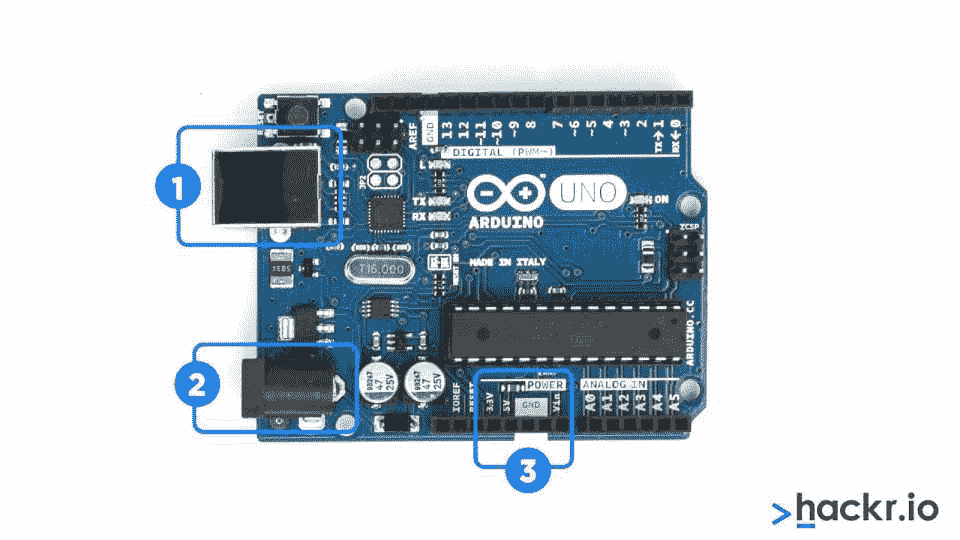

我们总是需要一个电源来使电路板工作。您可以使用 USB 连接到您的计算机为该板供电，也可以使用端接在桶形插孔中的墙壁电源。在上图中，(1)指定 USB ,( 2)指定桶形插孔。

*   您甚至可以使用 USB 连接将代码加载到 Arduino 板上。

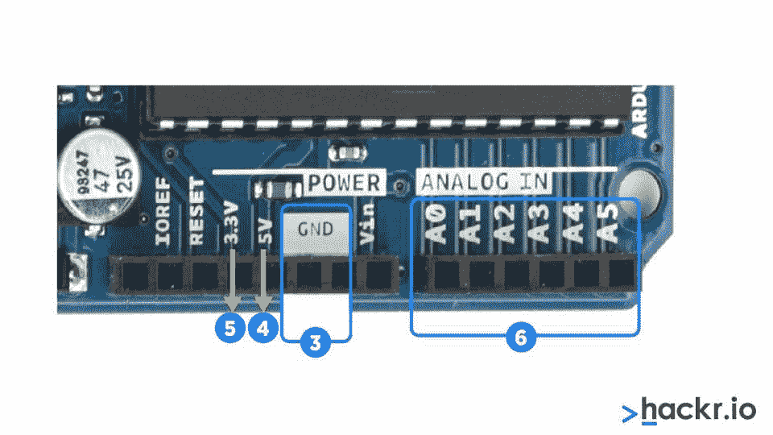

上图显示如下:

**GND(3):**【GND】代表“地”，用来给你的电路接地。

*   **5V(4)&3.3V(5):**5V 管脚可以用来提供 5 伏电源，3.3V 管脚可以用来提供 3.3 伏电源。
*   **模拟(6):** 这些标有(A0 到 A5)的管脚称为模拟管脚。他们将把模拟传感器转换成数字传感器。
*   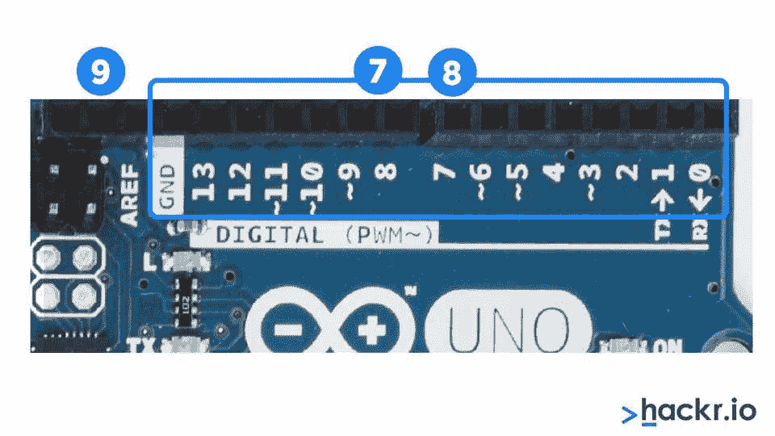

上图的右上角突出显示了 14 个可以执行特定功能的 I/O 引脚，如下所述:

*   With pins 0 and 1, you can carry out serial communication to receive and transmit serial data. You can use them to program the Arduino board and communicate with a user via the serial monitor.

    用管脚 2 和 3，可以提供外部中断。这些引脚触发外部事件。 

*   Six pins (3-11) are used for 8-bit PWM output.
*   Pins 10, 11, 12, and 13 are for SS, MOSI, MISO, and SCK, respectively, especially for SPI communication.
*   Pin 13 comes with a built-in LED connection. When this pin is set to HIGH, the LED is turned on, and when it is LOW, the LED is turned off.
*   AREF stands for Analog Reference, used to set an external reference voltage ( 0 -5 Volts).

    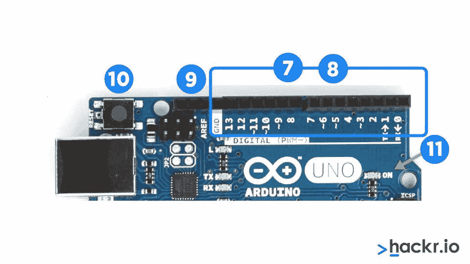

*   At the top left of the above image, (10) specifies the reset button. This button connects the reset pin to the ground and restarts the uploaded code. Pressing the reset button in case of failure will allow you to test your code multiple times. 

    数字(11)表示电源 LED 指示灯，当 Arduino 接通电源时，该指示灯会亮起。

*   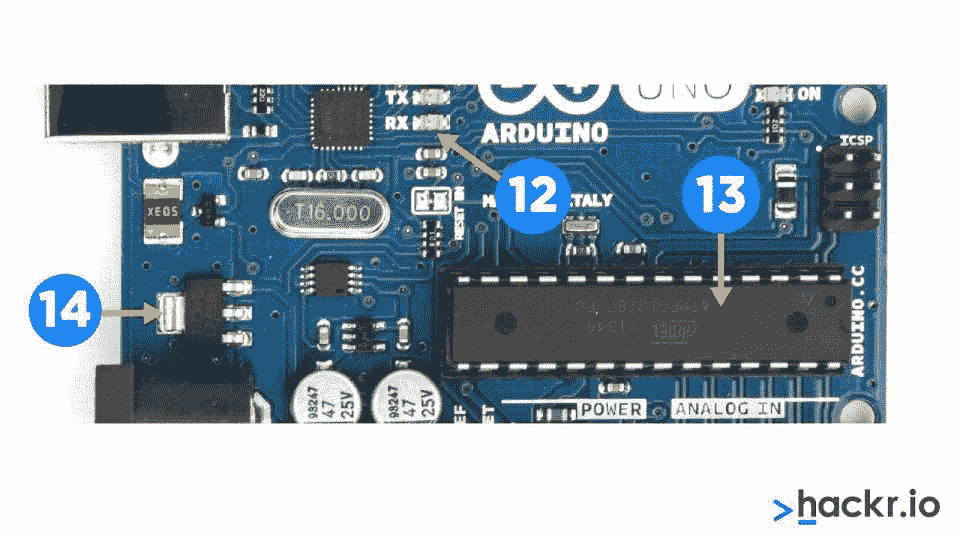

*   In the above image, (12) specifies the TX RX LEDs, where TX stands for *transmit* and RX for *receive*. These are used for serial communication. These LEDs provide visual indications while receiving or transmitting data using Arduino.
*   (13) specifies the Integrated circuit, otherwise known as the brain of Arduino. You can see the IC type mentioned on the top of the IC. 

    (14)指定电压调节器，帮助控制提供给 Arduino 板的电压量。它起着看门人的作用，防止额外的电压进入电路。此外，它有一些限制，因此不要将 Arduino 连接到超过 20 伏的电压。

**为什么要使用 Arduino？**

## 今天，许多人使用 Arduino。它易于使用和编程，因此在初学者和高级用户中更受欢迎。您可以将 Arduino 连接到多个平台，如 Mac、Windows 和 Linux。此外，你可以用它来制造低成本的科学仪器。

Arduino 为你提供了一个玩微控制器的机会。以下是使用 Arduino 的一些重要原因。

*   **Cheap:** Arduino boards are affordable. If you know, you can even assemble Arduino by hand or use the pre-assembled Arduino modules that cost less than $50.
*   **Cross-platform:** You can plug your Arduino board on any platform such as Windows, Mac, and Linux operating systems. 

    **简单的编程环境:**Arduino 软件的 IDE 简单易学，因为它附带了一个简单版本的 [C++。](https://hackr.io/tutorials/learn-c-plus-plus)

*   **Arduino 的约束**

## 尽管有各种理由使用 Arduino，但在使用它之前，你需要了解它的局限性。

**内存** : Arduino 没有足够的内存来存储程序和变量。此外，您不能向其添加外部存储器。ATmega32 和 ATmega128 可用于外部存储器，但不能利用这些引脚的 I/O 功能。

*   由于其基本设计假设，Arduino 板无法容纳外部存储器。重要的是要记住，Arduino 是一种廉价的基于 Intel 的单板计算机，并不是为了取代具有高系统要求的全功能计算机系统而设计的。

*   **Speed**: The Arduino CPU clock rate is between 8 and 20 MHz — that is way slower than most platforms. You can execute several instructions in each clock cycle, and that’s a lot of available CPU activity to be handled in between each pulse.
*   **Electrical power**: When working with Arduino hardware, you need to consider voltage parameters since some devices have 3.3V I/O while others are 5V tolerant. If you connect a 5V transistor-transistor logic to a 3.3V device, it will impact the hardware and can harm your Arduino.

    Arduino 的应用

## 以下是 Arduino 的一些典型应用: 

*   **Robotics**: Arduino is suitable for both entry- and intermediate-level robotics projects. You can give it [basic commands](https://hackr.io/blog/basic-linux-commands) to make a robot function, even with limited resources at hand. Some well-known examples of robots developed using Arduino are [K’Nex Wall-Following Robot](https://youtu.be/qwrAUahxYNo) and [SCARA Robot Arm](https://youtu.be/1QHJksTrk8s).
*   **Audio**: From Hi-Fi to headphones, everything depends on sound quality. Unfortunately, Arduinos are not suitable for audio, but you can use them to add an audio element to your projects.
*   **Tools**: You can design devices like print farms, 3D printers, CNC machines, laser etchers, etc., using Arduino. 
*   **Networking**: Most Arduinos offer built-in networking capabilities, usually in the form of an Ethernet port. You can utilize this facility in various projects, such as IoT and data-logging projects.

    **GPS:** 您可以使用 Arduino 来跟踪设备和车辆，并创建一个最令人印象深刻的 GPS 应用程序。

*   嗯，它的应用没有限制，但我们只提到了几个。

**结论**

## Arduino 是什么？这是你开发创造性新应用和电子项目的第一步。这总结了 Arduino 的基本知识。无论您是初学者还是经验丰富的电路设计师，都可以选择 Arduino，用这个易于安装的程序创建独特的应用。您可以下载 Arduino IDE 进行编码，并开始在您的 Arduino 版本上工作，因为它是免费和开源的。

如果你有足够的热情去创造新的有价值的应用程序，那么 Arduino 就是你要走的路。要了解更多信息，请查看我们的 2023 年 Arduino 最佳课程清单 [。](https://hackr.io/blog/best-arduino-courses)

**了解更多关于 Arduino 的信息:**

**Learn more about Arduino:**