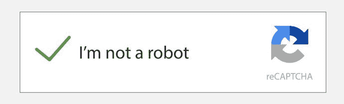
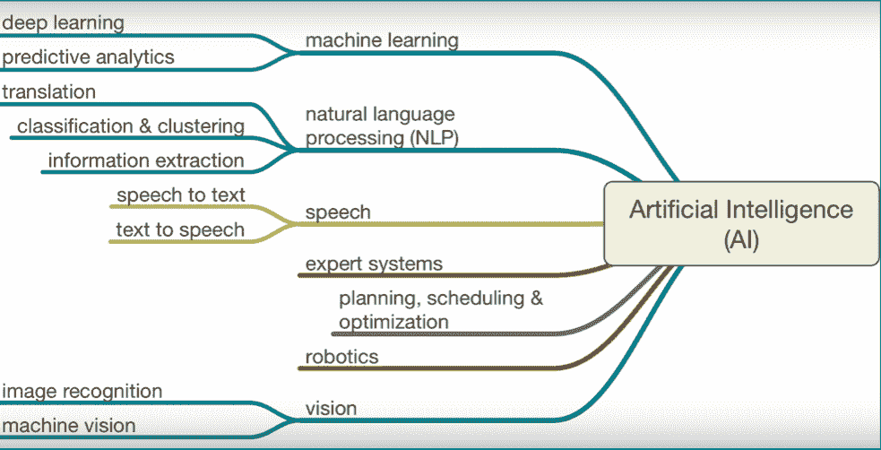
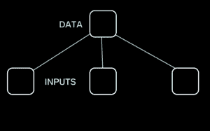
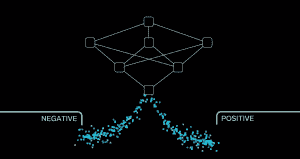

# 什么是人工智能？【定义】类型和应用

> 原文：<https://hackr.io/blog/what-is-artificial-intelligence>

想象一下，和你的电脑进行一次对话，谈论你的工作和想法，并听到关于你的想法的反馈。假设你在市场上推出了某种新口味的冰淇淋，你的电脑提前预测了结果，并指导你时间和金钱的投资是否会有回报。难以置信不是吗？不，这不是看了一些科幻电影后编造出来的。好吧，现在在这个人工智能的时代，这是可能的。

如今，人们对人工智能这一热门技术议论纷纷，不仅在计算机科学领域，而且在所有其他可以想到的领域，从医疗、商业甚至农业领域都有所扩展。那么，什么是人工智能呢？

## **定义术语:什么是人工智能？**

智力被描述为“广义学习”，这种学习能使学习者在以前没有遇到过的情况下表现得更好。智能包括推理、解决问题、感知和分析、物体之间的特征和关系以及对规则和语法的语言理解等领域，只有另一个人可以学习和解释。另一方面，人工智能可以被描述为一个系统或一台机器，它可以被制造来刺激智能的这些特征，从而具有解决和评估那些为我们这些具有自然智能的人类所保留的问题的能力。

## **人工智能的诞生:它是如何产生的？**

尽管人工智能一词是由约翰·麦卡锡于 1955 年在达特茅斯学院首次召开会议时首次提出的，但理解机器是否能够真正思考的旅程在很久以前就已经开始了。1950 年，英国数学家艾伦·图灵发表了一篇题为“计算机器和智能”的论文，为后来被称为人工智能的领域打开了大门。图灵测试是第一个决定机器智能的方法或实验。

图灵测试是一种确定机器是否能像人一样思考的概念性方法。经典测试是一场模仿游戏。在这个游戏中，一个审讯者问了两个参与者一系列问题。其中一个参与者是机器，另一个是人类。审讯者看不到或听不到参与者，也无法知道哪个是哪个。如果询问者不能根据回答判断出哪个参与者是一台机器，这台机器就通过了图灵测试。一个现代的例子可能是验证码测试。你一定在注册或注销账户时遇到过下面的图片，一旦你输入了你的凭证，你能认出它吗？

经过几十年的研究，还没有计算机接近通过图灵测试。专家系统已经发展起来，但还没有变得像人类专家一样普遍，而且我们已经取得了进展，可以在一些游戏中击败人类，开放式游戏仍然远远达不到计算机的水平。

## AI 是如何工作的？

那么，这是如何工作的呢？机器如何像人脑一样思考、分析、决策？如果你曾经养过一只宠物，并注意到它们在没有学习我们的语言的情况下，理解并回应某些信号和话语，你有没有想过它们是如何感知并相应地报复的？很简单，他们所做的只是注意我们的言语或行为，记住它们，最后，他们会记住这些，并为未来创造一个模式。

这是我们的科学家试图从人工智能领域的机器中实现的。这一想法始于设计交互式和可靠的基于计算机的决策系统，该系统使用事实和启发来解决复杂的决策问题。最终，到目前为止，人工智能取得了更多的成就。人工智能现在通过将大量数据与快速、迭代处理和智能算法相结合来工作，允许软件或机器从数据中的模式和特征中自动学习。

### **讲解人工智能的组成和应用**

人工智能是一个广阔而多样化的领域，并支持其领域中的各种子领域。在各个领域有不同的技术来实现不同的目标，从计算机科学、心理学、哲学、神经科学、认知科学、语言学到经济学、概率、逻辑等等。

让我们了解一下当今世界人工智能正在遇到的主要子领域。

[人工智能 A-Z:学习如何构建人工智能](https://click.linksynergy.com/deeplink?id=jU79Zysihs4&mid=39197&murl=https%3A%2F%2Fwww.udemy.com%2Fcourse%2Fartificial-intelligence-az%2F)

### **1。机器学习(ML)**

通常，术语 AI 和 ML 被混淆为同一个术语或互换使用。人工智能被归类为人工智能的一个子领域，你可以把它看作是机器的*训练阶段*，机器以后将有足够的能力阅读、理解、推断并最终解决复杂的问题，就像任何其他生物人脑一样。机器学习完全是关于增强传统编程的概念，传统编程需要带有智能算法的显式指令，以使机器能够推断和分析问题，并在已经反馈的事实和数据的帮助下或从过去的自我学习中提出解决方案。现实世界中机器学习的例子包括设计各种算法来处理一些问题，如果人类将注意力放在这些问题上，这些问题将是困难或耗时的，例如治疗癌症、管理网络安全等等。

### **2。神经网络**

当谈到人工智能时，这是下一个谈论最多的主题。将此理解为将*训练阶段*(如上所述)实施到模型中，这样我们可以将数据和事实传递给算法，它将根据迄今为止收集和推断的信息以及从自我训练和评估中学到的信息，为我们提供预测或解决方案。

这里是帮助你更好理解的图示。

考虑一种情况，我们正在训练机器识别狗的图像。因此，所涉及的步骤应该是这样的:数据和其他事实被输入机器进行理解和学习，以便这些信息可以在稍后的分析阶段使用。在这种情况下，我们会向系统提供大量的狗的图片。

由此产生的模型由相互连接的单元组成，这些单元通过响应外部输入来处理信息，并在彼此之间传递信息。

人工神经网络使用不同层次的数学处理来理解输入的信息。从输入单元开始，数据经过不同的层进行评估和预测，将其转换为合理有效的输出。因此，在我们的例子中，当一张图片被系统审查时，它会检查图片呈现是否是一只狗。

经过多层评估，结果进行相应排序。

在你能想到的几乎每一个领域都有大量使用这种惊人技术的例子，比如字符识别、图像压缩、医学、检测肿瘤、无人驾驶汽车等等。

### **3。**自然语言处理

NLP 被定义为通过软件对自然语言(如语音和文本)的自动操作。

最好的解释方式是举一个我们日常生活中使用的语音助手的例子，比如 Siri 或谷歌助手。我们和他们交流就像和其他人交流一样。此外，有一些正在开发的软件可以分析用户输入的文本并产生预期的结果。下面是它在工作的初始阶段的截图，以帮助更好地理解。

用户向系统输入自然语言文本，系统对其进行评估，并预测结果为 3D 场景。

### **4。计算机视觉**

这个子集依赖于模式识别和机器分析数字图片或视频的能力。人类视觉始于生物相机的“眼睛”，每 200 毫秒拍摄一张照片，而计算机视觉始于向机器提供输入。

市场上有许多计算机视觉应用。以下是其中的一些:

*   自动检测，例如在制造应用中
*   帮助人类完成识别任务，例如物种识别系统
*   检测事件，例如，用于视觉监视或人员计数

### **5。机器人**

机器人或类人机器人是人工智能体，其行为像人类，并拥有人类的思维过程——一种具有我们智力的人造机器。这将包括学习任何东西的能力，推理的能力，使用语言的能力和形成原创想法的能力，而不会感到无聊、分心或疲惫。虽然我们从小就在许多科幻电影中看到机器人，但在 21 世纪，科学取得了进步，机器人已经出现。这里有一些供你参考。

索菲亚

由 Hanson robotics 开发和创建，可以执行多种人类动作。据说她能做出多达五十种面部表情，而且同样能表达感情。

**贾加**

这个机器人是由中国科技大学发明的。她能够进行对话，但行动受限，说话生硬。她还没有完整的表情，但发明者团队计划进一步开发并给她注入学习能力。

除此之外，在这个领域还有很多领域正在被研究和测试。深度学习、认知计算名列榜首，并即将推出自己的应用。

## **结论:人工智能——是福还是祸？**

正如我们从上面的讨论中观察到的，人工智能的最终目标是技术奇点——技术接管人类的点。

人工智能接管是一个假设的场景，其中人工智能成为地球上智能的主导形式。好的一面是，这些自动化技术将取代单调乏味、令人苦恼和失去人性的工作，让我们可以自由地追求自己喜欢的事情。但是，正如我们所知，另一方面，即使这项技术正在获得很大的势头，在内心深处，我们仍然害怕它必须提供的权衡。听起来很危险，但随着如此多的指数智能爆炸和即将到来的超级智能，机器将引导我们的未来。这就产生了一个问题:要不要限制？

随着所有这些技术的进步，我们有一个美好的未来，人类拥有改造世界的梦想。

人工智能很快将成为业务中最具竞争力的优势之一，每个组织都应该有一个计划，不仅要应用人工智能，还要不断思考、适应和创新人工智能如何在旅程中提供帮助。

**人也在读:**