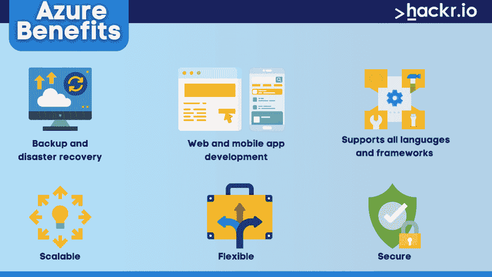

# Azure 是什么？

> 原文：<https://hackr.io/blog/what-is-azure>

云计算应用席卷全球。它们为与之合作的不同行业提供了许多优势。它们使复杂的过程变得更加简单和安全。但是一些企业的系统中仍然没有这项技术。

虽然有数百个知名的云计算平台，但 Azure 在过去一直是一个重大的游戏规则改变者。它提供各种计算服务，使您的运营更加顺畅。

但是 Azure 是什么，它是如何工作的？

在这篇文章中，我们将讨论你需要知道的关于微软 Azure 的一切。我们将仔细看看它的基础——包括它的用途和服务。我们还将讨论为您的公司使用它的利弊。

## **什么是 Azure？**

微软 Azure 原名 Windows Azure，是一个[公共云计算平台](https://azure.microsoft.com/en-us/resources/cloud-computing-dictionary/what-is-azure/)，类似于谷歌云和亚马逊 Web 服务。它让您能够访问重要的计算资源，如虚拟机、数据备份和存储。

截至发稿时，Azure 在全球拥有超过 40 个存储系统。一旦您的企业连接到其数据中心，您就可以访问您以前存储的数据。

通过我们的[Google Cloud vs . AWS vs . Azure](https://hackr.io/blog/google-cloud-vs-aws-vs-azure)指南，了解三大云计算服务之间的主要差异。

## **微软 Azure 是用来做什么的？**

Microsoft Azure 允许您开发、运行和管理应用程序，以满足您公司的目标。你几乎可以在任何行业使用它，比如电子商务和金融。事实上，由于其灵活性和效率，它已经在财富 500 强公司中声名鹊起。

特别是可以在 Azure 中开发数据库、虚拟机等基于云的资源。你也可以在没有编码知识的情况下启动网络和移动应用。您甚至可以将它们整合到您的运营中，并存储必要的公司数据。

## **什么是 Azure 云，为什么要用它？**

你的企业应该使用 Azure computing 的原因有很多。您可以开发新的 web 应用程序，存储大量数据，并在一个集中的 web 门户中将它们集成到您的运营中。

以下是对每个原因的详细分析:

### **1。您可以开发新的 web 应用程序。**

公司可能需要个性化的 web 应用程序来更顺畅地运行他们的业务。有了 Azure，你可以在触手可及的地方创建、测试和托管新的应用。

### **2。你可以运行虚拟机和硬盘。**

你可以通过 Azure 创建虚拟机并使用虚拟硬盘来增加存储。这样，你可以为你的公司收集更多有用的信息。

### **3。您可以存储和恢复重要的公司数据。**

作为一个云计算平台，Azure 的基本功能之一是将你的数据存储在其在线服务器中。您也可以根据最适合您业务的方式随时使用它们。

### **4。您可以将不同的功能集成到您的操作中。**

Azure 允许你将虚拟设备和数据库集成到你现有的操作中。这样，你就可以让你的企业保持运转。

## Azure 是做什么的？

想知道 Azure 是用来做什么的？你会在 Azure 的门户网站上发现超过 200 种服务。您可以执行基于云的服务，例如:

*   分析学
*   计算
*   数据库ˌ资料库
*   数据存储
*   综合
*   移动和网络开发
*   移民
*   建立工作关系网
*   安全性

然而，我们将在本指南中关注三个最好的 Azure 服务——计算、数据存储和网络。

### **计算**

Azure 最好的套件之一是它的计算功能。有了它，您可以为您的应用开发修改云服务、功能和虚拟机:

*   **云服务:**您可以轻松部署可扩展和可配置的基于云的应用。Azure 还会监控它们的健康状况、负载平衡等等。
*   **功能:**你可以在 Azure 上通过不同的编程基础设施开发新的 app。
*   **虚拟机:**你可以在几秒钟内开发出 Linux、Windows 或更高版本下的虚拟机。

### **数据存储**

Azure 也有存储数千万亿字节数据的存储服务。它具有 blob 存储、磁盘存储、队列存储和表存储:

*   **Blob 存储:**你可以通过这个功能在 Azure 上存储文本和二进制数据。
*   **磁盘存储:**你可以在硬盘(HDD)或固态硬盘(SSD)上运行虚拟机和存储数据。
*   **队列存储:**使用这种类型的存储，您可以跨不同的基于云的服务传输和存储消息。
*   **表格存储:**您可以通过此功能存储半结构化的 NoSQL 数据。

### **联网**

微软 Azure cloud 在网络服务方面也很出色。您可以使用他们的 CDN 和 DNS 服务器、负载平衡器和虚拟网络:

*   **内容交付网络(CDN):** Azure 有一个 CDN，可以帮助您在全球范围内传输数据。
*   **域名系统(DNS):** Azure 也有一个 DNS，让你通过它的平台托管域名。
*   **负载平衡器:**您可以通过虚拟机确保网络性能，以抵消互联网流量。
*   **虚拟网络:**通过执行网络隔离和分段，您可以私密安全地访问 Azure 服务。

## **微软 Azure 是如何工作的？**

在使用 Azure 之前，你必须订阅它的一个客户支持选项——基本、开发者、标准、专业直接或企业。

订阅后，你可以通过 Azure 的门户网站访问它的基本服务。然后你可以玩它的云计算应用程序:

*   **基础设施即服务(IaaS):**IaaS 通常由 IT 管理员使用，负责处理、联网和存储等基本操作。

*   **平台即服务(PaaS):** 应用程序开发人员更喜欢 PaaS，因为它的 web 开发特性，如编程语言执行环境和操作系统。

*   软件即服务(SaaS): 不同的用户可以和 SaaS 一起使用一个版本的 Azure 程序。它由单一来源集中托管和管理。

*   **无服务器功能:**不需要有 Azure 无服务器功能的服务器。相反，您可以按需依赖他们的后端服务和机器资源。

这些基于云的服务让您可以为您的企业运行虚拟机和数据库。您还可以托管域名系统(DNS)服务器、网络和 Azure 结构化查询语言(SQL)。

最重要的是，Azure 允许你为备份和灾难恢复创建归档数据存储。

你甚至可以通过其门户网站启动第三方应用程序，但需要额外付费。

## **Azure 福利**

****

使用 Azure 给你的公司带来竞争优势。它可以帮助您轻松开发应用程序，同时保护您的数据并降低费用。

以下是使用 Azure 的一些好处:

### **1。备份和灾难恢复**

你可以随时在 Azure 上备份和恢复数据。由于其异地复制功能，它可以跨数据中心将您的重要公司数据存储长达 90 年。除此之外，您还可以计划每天、每周或每月进行备份，以防止停机。

### **2。网络和移动应用开发**

Azure 可以帮助您满足应用程序托管、开发和管理需求。它支持所有语言和框架，并简化您的代码。通过这种方式，您可以更加专注于改善您的应用程序和客户体验。

### **3。支持持续的公司创新**

Azure 是高度可伸缩、灵活和安全的。它让您[通过连接、监控和管理平台上的多个设备，无缝地运行 hybrid](https://azure.microsoft.com/en-us/resources/cloud-computing-dictionary/what-is-azure/)。你还可以获得关于你的公司的有用见解，以确保其持续改进。

## **Azure Cons**

尽管 Azure 有很多优点，但它并不完美。使用它也有相当多的缺点。

以下是使用 Azure 的一些缺点:

### **1。Azure 基于网络的门户有局限性。**

由于 Azure 是一个云计算平台，如果没有连接到互联网，它就无法正常执行其功能。它也使用了大量的带宽，使得它比你桌面上安装的程序运行得慢。

### **2。Azure 对初学者来说很难学。**

Azure 有四种不同的云计算服务——IaaS、PaaS、SaaS 和它的无服务器功能——很难使用。在数据传输过程中还可能存在隐性费用，这可能会让企业非常头疼。

### **3。Azure 的客户支持速度很慢。**

由于微软拥有 Azure，我们可以预计每天都会有大量客户联系他们的客户支持团队。所以让他们回答你的问题和担忧可能需要一些时间。

## **微软 Azure 案例研究**

不管你公司的定位如何，你都可以使用 Azure 的服务。事实上，数百个案例研究证明，它几乎可以在任何行业工作。

这里有几个你可以使用 Azure 的真实例子:

### **例 1 -生鲜食品&配送行业**

【时间】一家食品行业的公司【时间】想修改现有的配送系统。该公司希望研究客户的购买模式，通过温控货车运送更多新鲜商品。

由于其现有系统使用微软技术，Azure 的 SQL、移动、云和存储服务为该公司提供了积极的成果。它的新系统现在可以处理来自数百万客户的海量数据。它还可以存储和分析他们的购买行为。

另一家使用 Azure 解决问题的公司来自媒体广播行业。该公司的使命是通过电视节目、广播和现场活动提供娱乐和信息。

这家媒体广播代理希望最大限度地减少停机时间和存储成本，以满足观众的需求。但不幸的是，它没有管理结构化和非结构化用户内容的基础架构。

借助 Azure 技术，it 可以访问存储、健康监控、流量控制和活动目录服务。因此，它现在可以举办 500 多场活动，减少停机时间。它还将“上线”功能整合到了现有系统中。

## **结论**

总的来说，微软 Azure 是一个强大的云计算平台。它具有全面的功能和服务，可帮助您开发、部署和管理应用。现在你应该对什么是 Azure 及其功能、优点和缺点有了一个很好的概述。

今天你可以[学习微软 Azure](https://hackr.io/tutorials/learn-microsoft-azure) ，了解如何利用其服务为你的公司带来优势。

准备好成为 Azure 专家了吗？

**[获得 Azure 认证](https://hackr.io/blog/microsoft-azure-certification-guide)**

## **常见问题解答**

#### **1。Azure 好学吗？**

不，Azure 不好学。你需要投入足够的时间和精力去学习它。但是该平台提供了全面的示例和指南来轻松导航其门户网站。如果你以前使用过亚马逊网络服务，使用 Azure 会很容易，因为它们有相似的基础设施。

#### **2。Azure 需要编码吗？**

不需要，使用 Azure 不需要任何编码方面的先验知识。这是一个基于网络的门户，其功能和服务都在云上。

#### **3。Azure 需要哪些技能？**

对于 Azure，你需要解决问题、管理、沟通和批判性思维的技能。具有基于云的应用程序创建、测试和安全方面的知识也是一个优势。可以查看我们的 [Azure 面试问题](https://hackr.io/blog/azure-interview-questions)了解如何评价开发者候选人。

#### **4。Azure 是什么时候推出的？**

微软在 2008 年开始开发 Azure。两年后，它正式推出云计算平台 Windows Azure。但在 2014 年，他们将该程序更名为微软 Azure。