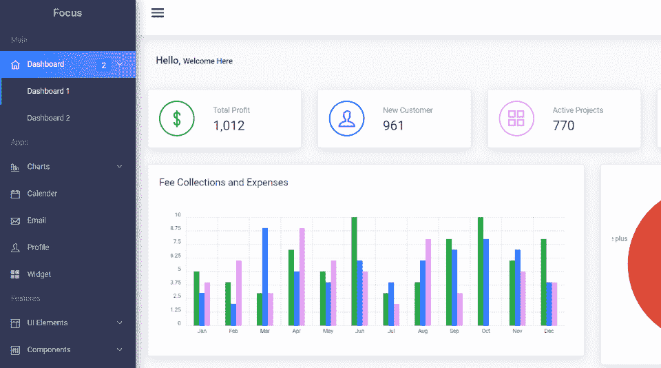
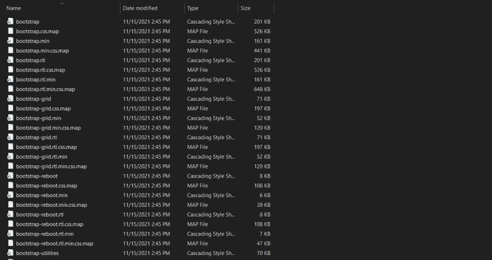
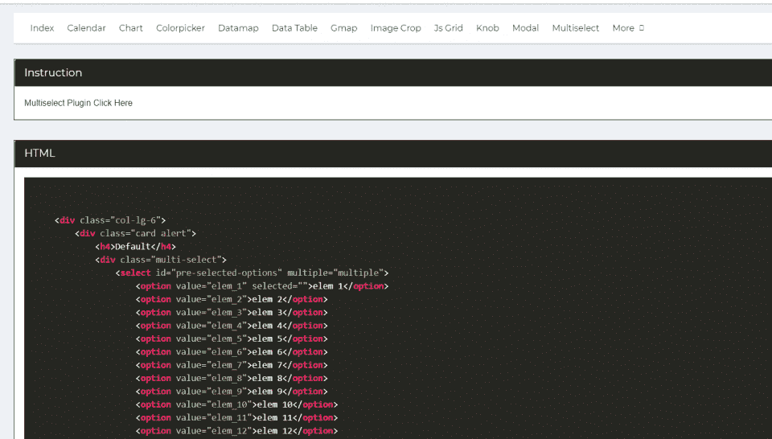
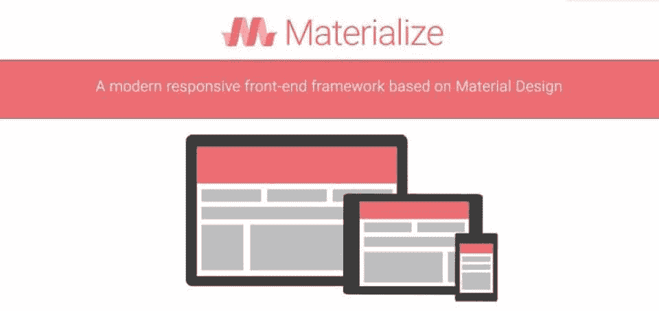
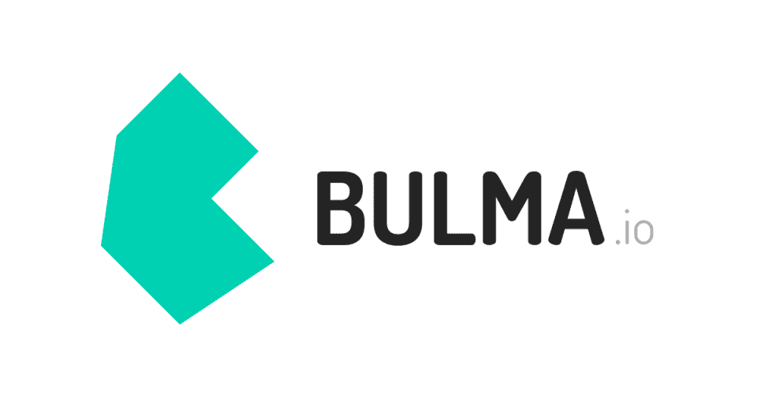
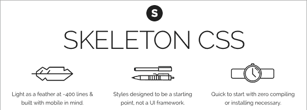
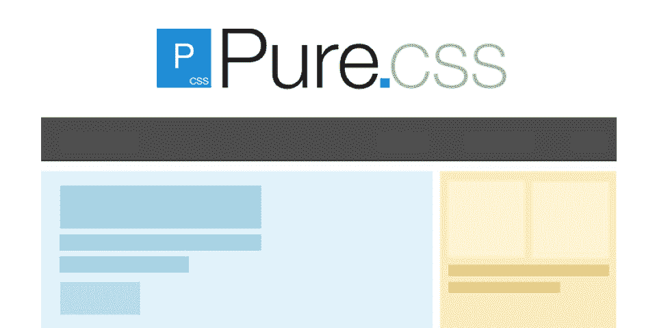

# 什么是自举？这一框架的利弊

> 原文：<https://hackr.io/blog/what-is-bootstrap-framework>

## 什么是自举？

Bootstrap 是世界上最流行的前端 web 开发框架。基于 HTML5、CSS 和 JavaScript，Bootstrap 使开发人员能够快速启动一个功能全面、移动响应的网站。

今天，Bootstrap 被全世界数以百万计的网站使用，这部分归功于它的免费开源模式。

## 编程中的 Bootstrap 是什么？

在程序设计中，启动另一个系统(通常是操作系统)的“引导程序”。在现实世界中，“靴带”是靴子后面的一小块，让你穿上它。在整个软件开发过程中，它指的是一个较小的系统启动一个更大的系统。

因此，Bootstrap 意味着它是一个可以用来快速启动网站的框架。使用 Bootstrap，您不需要执行任何通常必须执行的基础程序。相反，你可以只关注什么是重要的——根据你的项目定制它。

## 为什么要使用 Bootstrap？

当许多开发者需要构建网站最基本的元素时，他们感觉好像是在重新发明轮子。Bootstrap 为你提供了设计一个干净、高效的网站所需的一切。事实上，如果您不愿意，您不需要编写一行代码——您可以只填写内容。

通过 Bootstrap，开发者可以:

*   更快的发射地点。
*   提高他们工作的一致性。
*   直接控制他们网站的许多元素。

与此同时，开发人员确实有时间的前期投资。如果他们想做任何严肃的定制，他们需要先学习 Bootstrap 框架和系统。要真正理解 Bootstrap 框架的复杂性可能需要几个月的时间，因为它是文件的大规模编译。

## 

## Bootstrap 框架好用吗？

看情况。

第一，看你的背景。

那些已经了解 HTML5、CSS 和 JavaScript 的人应该会发现 Bootstrap 的大部分都很容易。Bootstrap 不做任何太复杂的事情。这或多或少是个图书馆。如果您浏览引导文件，您将会清楚地看到它在做什么——控制、提炼和定制页面元素。

但是不懂 HTML5、CSS 或 JavaScript 的人很可能会迷路。至少，需要对 HTML5 和 CSS 有一个基本的了解——如果你想对一个站点进行严肃的定制，JavaScript 更有可能是必需的。

第二，要看你想用它做什么。

用 Bootstrap 在短短一个晚上的时间内建立并运行一个网站是相当容易的。如果你只是想用 Bootstrap 创建一个基本的网站，你可以立即投入运行并尽快完成。

但如果你想定制它，它可能需要更长的时间。Bootstrap 让很多事情成为可能，但是要编辑一些更复杂的东西(比如动画加载屏幕)，你必须深入挖掘。

## Bootstrap 框架包括什么？

[Bootstrap 包含](https://getbootstrap.com/docs/4.0/getting-started/contents/)排版、表单、按钮、导航和其他界面组件，如地图。根据模板的不同，Bootstrap 框架可以扩展为包含更多内容。

事实上，关于 Bootstrap 有趣的事情是，因为它是 CSS 和 [JavaScript 框架，](https://hackr.io/blog/best-javascript-frameworks)它不仅仅提供界面元素；它提供了风格和设计元素。当您选择一个引导模板时，您也选择了您将在整个站点中使用的字体颜色、大小和样式。

有一些免费的引导框架资源:

如果您想要一体化的引导解决方案，可以使用这些资源。通过查看这些模板，您还可以感受到 Bootstrap 可能为您带来的好处。

## Bootstrap 有什么优势？

1200 万个网站使用 Bootstrap 是有原因的。它有很多优点:

*   它有反应。如今，人们更有可能在手机或平板电脑上浏览网页，而不是在个人电脑上。响应式设计会自动调整大小以适应页面。
*   它自动调整图像和元素的大小。开发人员不需要手动处理任何事情——都是为他们做的。
*   它是基于网格的。网格机制使得开发人员更容易管理元素在站点上的显示位置。
*   它包括主要组件。下拉菜单、导航栏、表单和进度条。这都是为你设计的。你只需要把它们放进去。
*   它建立在 JavaScript 和 CSS 之上。这是现存的两种最流行的编程和标记语言。
*   它可以很容易地被定制。因为所有的代码都是开源的，你可以用它做任何事情；高级用户可以大量定制框架。
*   它有一个繁荣的社区。许多人正在致力于改进 Bootstrap 并支持其他 Bootstrap 用户。
*   它有许多模板。如果你不想设计你的网站，你可以从数百个用户提供的模板中下载一个。(确保获得正确的引导版本。)

简而言之，它易于使用，支持良好，可以节省人们很多时间。Bootstrap 目前正处于第五版，在其发展过程中成长了许多。

但是，和任何事情一样，也有一些缺点。

## 自举的缺点是什么？

没有技术是完美的。无论您是严肃的开发人员还是业余爱好者，您都应该意识到:

*   它要求你知道如何编码。如果你根本不知道如何编码，你将会迷失在 Bootstrap 中。对于不知道如何编码的人来说，像 WordPress 这样的 CMS 是更好的选择。
*   它的命名方案可能会令人困惑。您需要投入前期时间来学习 Bootstrap 中提供的内容。这可能需要大量的文档，因为没有办法直观地知道那里有什么或者它的名字是什么。
*   它可能没有你期望的那么流畅。Bootstrap 以臃肿著称，因为它包含了你可能用到的所有东西。如果你想创建一个小而简单的网站，这并不理想。
*   你可能会变得过于依赖它。变得依赖它意味着你永远不会从头开始学习设计一个网站(尽管你可能永远不需要)。

如你所见，缺点比好处少。但是你确实需要质疑 Bootstrap 是否适合你。大多数 Bootstrap 站点看起来都差不多，这取决于你想要定制它的工作量。

## 如何使用 Bootstrap？

自举很容易设置。因为它只是 CSS 和 JavaScript，所以它是一个可下载文件的数组。如果你熟悉其他语言，它本质上是一个库。您的网站将连接到这些 CSS/JavaScript 文件以正确显示。

要开始使用引导程序:

1.  去 GetBootstrap.com。
2.  下载最新版本(引导当前版本:5.1)。
3.  解压到一个目录并上传到您的服务器。

就是这样。你现在“有了自举”

但是一旦设置好了，你也需要使用它。在引导文件中，您将找到展示如何使用所有元素的示例文件。事实上，使用 Bootstrap 经常会导致大量的复制和粘贴。

您可以手动编辑 HTML5 和 CSS 文件，也可以下载许多流行的引导模板。对于初学者来说，使用模板通常更容易。但是如果你打算为你的站点修改它，你至少需要知道一些 HTML。

[具有 6 个项目和 Sass 定制的主引导程序 5](https://click.linksynergy.com/deeplink?id=jU79Zysihs4&mid=39197&murl=https%3A%2F%2Fwww.udemy.com%2Fcourse%2Fbootstrap-5-responsive-web-design-and-development%2F)

## 你的下一个项目应该使用 Bootstrap 吗？

如果你试图从头开始学习如何开发，Bootstrap 可能会阻碍你。Bootstrap 作为一种技术，让程序员更容易从不真正学习基础知识——相反，你处理的是系统提供的抽象层。

同时，这很像是说用 C++编程的人永远不会像机器码甚至 C 语言那样学会操作机器。虽然这在技术上是正确的，但许多程序员永远不需要精确地操作机器及其内存。

如果从头开始开发一个网站并不重要，或者如果你已经是一个高级/超级用户，Bootstrap 没有太多的缺点。这是一种快速、简单的方式来创建一个功能齐全的站点，而不必对每个元素都进行编程。

## 除了自举还有其他选择吗？

Bootstrap 是目前最流行的 HTML5/JavaScript/CSS 框架。很少有系统像 Bootstrap 那样全面地完成它所做的工作。但是对于那些想做一些稍微不同的事情的人来说，还是有一些 Bootstrap 的替代品。

1. [**基础**](https://get.foundation/) 。具有网格和组件的响应性前端框架。

2. [**物化**](https://materializecss.com/) 。HTML/CSS/JavaScript 的 UI 组件库。

3.**。一个基于 Flexbox 的开源 CSS 框架。**

 **

4.[**骷髅**](http://getskeleton.com/)**。响应式 CSS 设计的样板系统。**

 **

5. [**纯 CSS**](https://purecss.io/) 。一系列用于 web 项目设计的响应式 CSS 模块。

如果你想要一个 CSS/JavaScript 框架，这些是你想要探索的技术，但是 Bootstrap 没有做你想要做的。

## 市场中的自举

根据[zipcrealter](https://www.ziprecruiter.com/Salaries/Bootstrap-Developer-Salary)的数据，Bootstrap 开发者的平均薪资为 10.3 万美元。Bootstrap 体验需求很大，不仅是前端开发者，全栈开发者也是如此。那些已经熟悉 HTML5、JavaScript 和 CSS 的人可以通过学习更多关于 Bootstrap 的知识来改善他们的职业生涯。

虽然上面列出了其他替代方案，但没有一个能够立即识别 Bootstrap。

## 是时候了解更多了

Bootstrap 是一个完全开发的前端 web 应用程序框架。因此，它包含在许多前端和全栈开发训练营、web 开发研讨会和在线课程中。

要学习使用 Bootstrap，您可以:

**人也在读:******