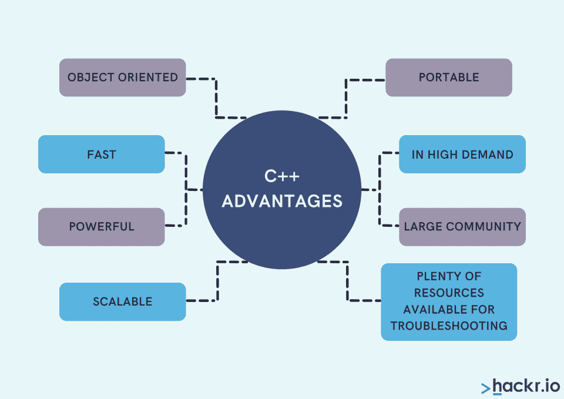
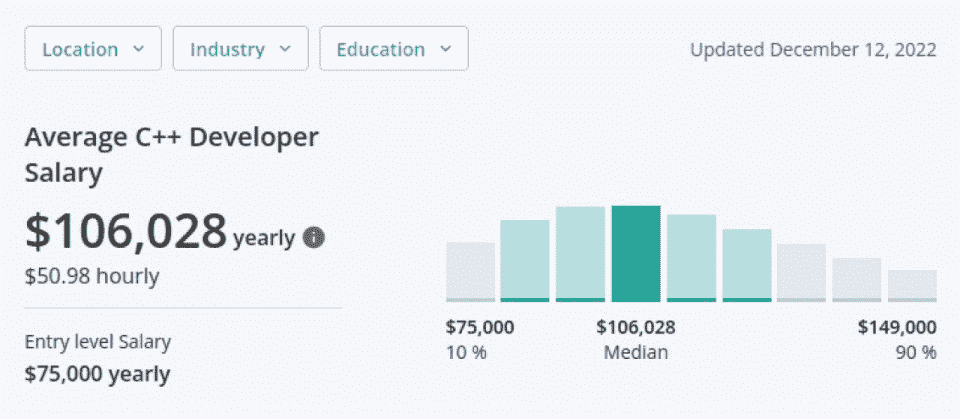
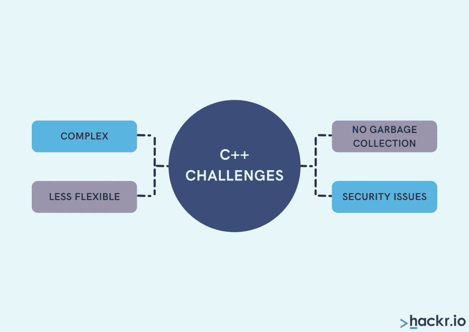
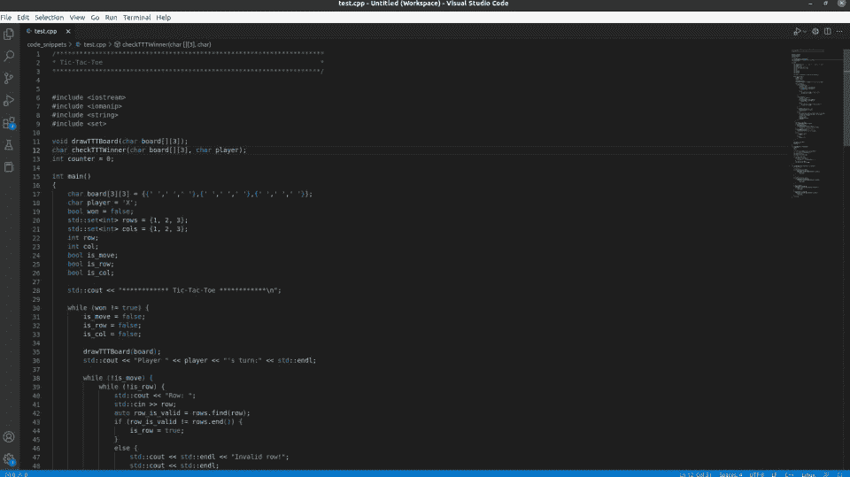

# 什么是 C++？C++编程语言的简单介绍

> 原文：<https://hackr.io/blog/what-is-cpp>

快到 40 岁的时候，C++语言仍然是最受欢迎的语言之一，在 2022 年接受调查的开发人员中，超过 27%的人选择 c++语言。

作为最好的通用语言之一，C++与 Java 和 Python 并列，得到了很好的支持，有很好的文档记录，并且非常健壮。因此，许多程序员将 C++作为他们的第一编程语言来学习，而其他人则在以后学习它来增强他们的技能。

如果你正在寻找 C++的介绍，请继续阅读我们回答的基本问题，比如 C++是什么，你为什么应该使用它，以及你应该用它做什么。

## **什么是 C++？**

C++(有时称为 Cpp)是在 1985 年首次发布的，是 C 的一种进化；当我们在 C 语言中使用' ++ '来增加变量时，有没有注意到这个名字背后的天才？虽然 C 实现了一种[过程化编程方法](https://hackr.io/blog/procedural-programming)，但是 C++编程语言提供了编写面向对象程序的额外能力。

让我们看看 C++编码语言的一些关键特性。

*   **面向对象:**使用类和对象来减少代码重复(D.R.Y 原则)，使代码更加灵活和可扩展
*   多范例:c++不仅是面向对象的，而且像它的哥哥 C 一样，它可以被用作过程语言
*   中级语言:通过面向对象的编程，提供了与硬件交互和操作硬件的低级语言特性，以及高级抽象
*   快速:直接编译成机器代码，这意味着它是速度最快、性能最好的语言之一
*   **Popular:** 广泛使用和记录，包括广泛的社区支持
*   **维护了&更新:**这是一种功能全面的语言，在 2011 年、2014 年、2017 年和 2020 年进行了四次重大更新
*   **可扩展:**由于离散的&直接内存管理和低级机器功能，适合大型可扩展应用
*   **可与 Java 媲美:**在可扩展性、可移植性和可伸缩性方面相似

****

想了解更多关于 C 和它的弟弟妹妹 C++的知识吗？查看我们的 [**关于 C 和 C++**](https://hackr.io/blog/difference-between-c-and-cplusplus) 的区别的文章

## **c++是用来做什么的？**

一些世界上最广泛使用的软件、游戏、操作系统、后端基础设施等等都依赖于 C++。

*   **操作系统(OS):** 微软 Windows，macOS
*   **软件应用:** Adobe Photoshop、Illustrator 等
*   **游戏:**魔兽世界，反恐精英，虚幻引擎，Playstation，Xbox 等
*   **图形:**数字图像处理、计算机生成图形等
*   **嵌入式系统:**物联网、飞行软件等
*   **数据库:** MySQL，MongoDB
*   网络浏览器:谷歌 Chrome、Mozilla Firefox、Safari、Opera
*   **通过 CGI(通用网关接口)后端:** Spotify、YouTube、亚马逊
*   **机器学习:** TensorFlow，谷歌搜索
*   **业务应用:**金融、土木工程、酒店等领域的工具

## **2023 年为什么要学 C++？**

如果你是一个有抱负的软件开发人员或经验丰富的专业人士，但对 C++不确定，考虑一下 2023 年学习 C++的理由。

*   **高薪&抢手:** C++开发人员是各行各业最抢手的，平均年薪[为 106，000 美元](https://www.zippia.com/c-developer-jobs/salary/)
*   内置库:标准模板库(STL)提供了算法、容器、函数和迭代器，有助于加速和简化开发
*   **社区:**广大用户，从初学者到专业人士，都可以提供帮助
*   **可移植:**轻松地在平台之间移植 C++程序
*   **中级语言:**可针对嵌入式系统中的硬件进行优化&物联网
*   **针对** **后端优化:**快速、可靠，可以直接与硬件交互
*   **建立:**依靠它来构建流行的浏览器、应用程序、游戏、操作系统等等

*C++开发者命令有竞争力的薪水:来源:*[*【Zippia.com】*](https://www.zippia.com/c-developer-jobs/salary/)

## **C++编程基础知识**

*   **变量:**用于存储信息，可通过参考标识变量及其信息的“标签”进行检索
*   控制结构:这些处理决策，将代码重定向到新的位置，恢复迭代过程，等等
*   **数据结构:**以特定的方式存储数据；例如，我们可以使用一个数组来存储一系列变量，使用一个堆栈来模拟后进先出(LIFO)数据过程，等等
*   语法:简单地说，就是组成你的 C++代码的字母、单词、数字、符号和表达式的布局，你必须遵循语法规则来防止错误
*   **面向对象编程:**使用类和对象
    *   **类:**用户自定义的具有属性和功能的数据类型
    *   **对象:**具有唯一属性的类的实例
*   **函数重载:**共享不同参数名称的函数

## **C++的缺点**

尽管 Cpp 具有强大的功能、速度和其他优势，但对于初学者或使用 Python 或 JavaScript 等现代语言的有经验的程序员来说，Cpp 编程的某些方面可能会很困难。

*   **内存管理:**内存分配、释放和无垃圾收集
*   安全问题:缓冲区溢出、内存泄漏、不正确的类型转换
*   **高级语法:**不如 Python 这样的现代语言直观，它读起来像英语(或者伪代码，根据一些人的说法！)

****

## C++和 Python & Java 相比如何？

Java 和 Python 是比 C++更年轻的语言，分别出现在 1996 年和 1991 年。虽然它们都有比 C++更容易学习的名声，但你会发现从 C++开始会更容易掌握 Python 和 Java，而不是相反。

与占主导地位的面向对象语言 Java 相比，C++是一种多范例语言，因为它可以是过程化的、面向对象的、泛型的等等。另外，C++是纯编译语言，而 Java 是编译和解释并重。

Java 和 C++都是跨平台的，这意味着您可以编写在任何地方运行的代码，尽管 Java 需要安装 Java 虚拟机(JVM)。一个关键的区别是，用 C++编程提供了运算符重载，而用 Java 是不可能的。同样，Java 没有全局范围的概念，而 C++有(虽然这可能是一个安全问题！).

与 C++不同，Python 是一种现代高级解释语言，与 C++中使用的静态类型相比，它是动态类型的。这种灵活性和类似英语的语法使 Python 成为对初学者有吸引力的语言。与 Python 的解释器相比，C++由于其编译方法而具有速度优势。

## **用 C++编程**

一种选择是使用记事本这样的简单文本编辑器，然后通过 GNU Compiler Collection (GCC)这样的编译器运行代码。通常，使用现代 IDE(集成开发环境)或像 Visual Studio 代码这样的代码编辑器更容易。

*Visual Studio Code 是一个流行的 C++代码编辑器*

使用 IDE 或代码编辑器，您可以利用语法突出显示、“智能感知”(自动完成功能、变量名等)。)，指出语法错误的内置提示，以及使代码可读性更好的自动格式化工具。您还可以在单一环境中编译和运行您的代码。

大多数时候，你的 IDE 或者代码编辑器会需要一些小的配置，包括安装一个 C++编译器；然而，像 Visual Studio 代码这样的流行选项提供了详细的提示来帮助您做到这一点。

当需要让代码通过编译器时，可能会以编译时错误的形式提醒您语法问题。在源文件被正确编译成目标文件之前，您需要修复这些问题。这与 JavaScript 等现代语言不同，JavaScript 会继续执行，直到遇到错误。

一旦编译器完成了它的过程，你就产生了一个可以在适当的平台上运行的可执行文件。

## **2023 年如何学习 c++**

如果你在大学主修计算机科学，你可能会接触到各种 C++课程。但是如果这不是你的选择，有很多方法可以在 2023 年获得 C++编程入门。

最明显的选择就是在网上找一个 [C++课程](https://hackr.io/blog/cpp-course)。这些通常是自定进度的，包括关于 [C++特性和用途的详细视频内容](https://hackr.io/blog/features-uses-applications-of-c-plus-plus-language)，基于项目的学习，以及一个需要帮助的活跃社区。有些学校还提供分级考试和结业证书，这可以大大提升你的简历。

也许你更喜欢更多的结构和明确的时间表？在这种情况下，C++训练营可能是一个很好的选择。这些通常是让你快速上手的集中环境，它们通常包括一个顶点项目和一个完成证书。

如果你喜欢书面的而不是视觉的学习方法，另一个可靠的选择是找一本好的 C++书。这可能是获得 C++入门或者补充你从课程或训练营中所学知识的一个很好的方式。

如果你正在积极寻找 C++开发人员的工作，你也可以考虑查看一下 [C++认证](https://hackr.io/blog/best-cpp-certification)，因为这些可以证明你有合适的 C++技能水平来申请空缺的职位。

我们还建议完成尽可能多的 C++项目，因为这可以巩固你的知识，并建立一个文件夹与潜在雇主分享。确保将这些添加到 GitHub 提交的可靠存储库中。对于招聘经理来说，这是一个很好的信号，表明你是一个了解 C++基础的活跃的开发人员。

**我们建议将本课程作为一个很好的起点:**

**[开始 C++编程——从入门到超越](https://click.linksynergy.com/deeplink?id=jU79Zysihs4&mid=39197&murl=https%3A%2F%2Fwww.udemy.com%2Fcourse%2Fbeginning-c-plus-plus-programming%2F&u1=blog%2Fcpp-course_amcid-3JmosJJJYOEVEBeZg2Uz6)**

## **结论**

本文已经回答了这些问题，什么是 C++，C++是用来做什么的？尽管已经存在了近四十年，C++仍然是十大编程语言之一。作为 C 的弟弟妹妹，它提供了一种多范式的编程方法、一个庞大的开发人员社区和一个已建立的内置库(STL)。

作为一种快速、通用的中级语言，我们可以使用 C++进行软件开发、移动应用程序、游戏、操作系统等等。它还以健壮和可伸缩而闻名，这使得它非常适合大型应用程序和后端开发。

与 Python 或 JavaScript 等现代语言不同，C++编码由于其高级语法而对初学者来说具有挑战性。

初学者和有经验的程序员在 2023 年有各种选择可以学习 C++，包括[课程](https://hackr.io/blog/cpp-course)，新兵训练营和[书籍](https://hackr.io/blog/10-best-c-cpp-books)。另外，[的平均工资为 106，000 美元](https://www.zippia.com/c-developer-jobs/salary/)，各行各业都有很高的需求，C++开发人员并不缺乏职业道路可供选择。

在建立作品集的同时，还在寻找更多学习 C++的方法？查看我们的 [**顶级 C++项目**](https://hackr.io/blog/cpp-projects)

## **常见问题解答**

#### **1。C++是编码语言吗？**

是的，C++是一种编程语言。它可以用于软件工程、游戏开发、应用程序设计等等。

#### **2。C++简而言之是什么？**

C++是一种中级通用编程语言。它是由比雅尼·斯特劳斯特鲁普创建的，并于 1985 年作为 c

#### **3。为什么叫 C++？**

C++是 C 的扩展。C++指的是增量运算符，所以 c++可以被认为是“C 递增的”

#### **4。C++是最好的编程语言吗？**

没有“最好的编程语言”。就像其他编程语言一样，C++有优点也有缺点。然而，C++仍然是[十大编程语言之一](https://www.statista.com/statistics/793628/worldwide-developer-survey-most-used-languages/)，并且它被认为是一种快速、通用的中级语言。