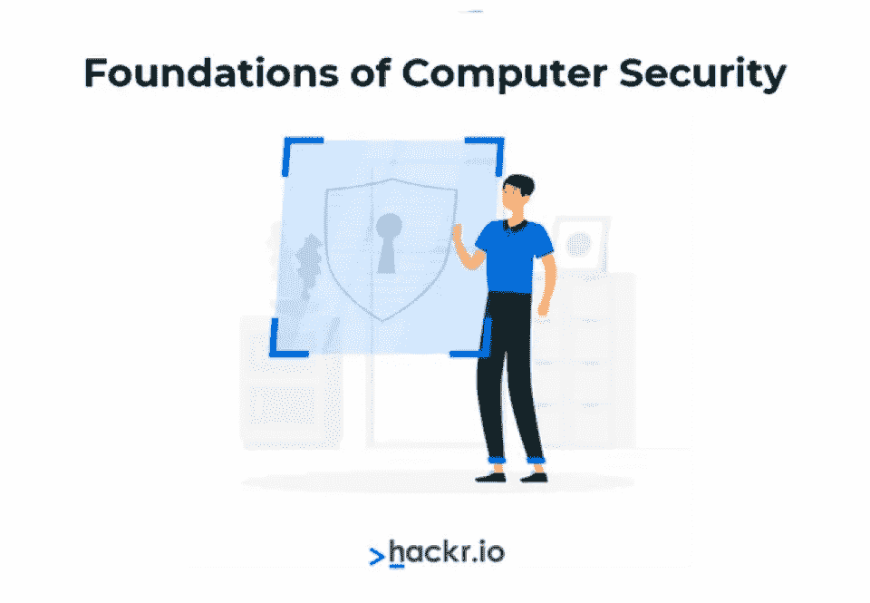

# 什么是网络安全？终极简易指南

> 原文：<https://hackr.io/blog/what-is-cybersecurity>

什么是网络安全？也称为“计算机安全”，网络安全是指保护物理计算设备、软件信息系统和数字数据免受不必要的或恶意的访问、窃取或破坏。

计算机安全是一个广泛且不断发展的领域，基本的网络安全原则对每个人来说都是必不可少的。

除了这个广泛的计算机安全定义，还涉及到许多学科、领域、工具和技术。对于普通的计算机或互联网用户来说，网络安全的一个例子是防病毒软件。然而，网络安全技术远远超出了一般的反病毒技术。

如果你有兴趣成为一名网络安全专家，你将学习所有用于保护数据和计算机系统安全的技巧、技术和工具。参加研讨会，获得认证，甚至获得学位都是学习更多计算机安全技术的可行方法。

这就是网络安全的简要解释——现在，让我们更深入地探讨这个主题。

## **为什么网络安全很重要？**

既然我们已经回答了“什么是网络安全？，“我们来谈谈为什么它如此重要。

如今，几乎所有的东西都使用电脑和互联网。商业、教育、日常生活等等都极大地依赖于技术。在这样一个相互联系的世界里，保护自己免受周围那些伺机而动的坏人的伤害是绝对必要的。

作为个人，你容易受到如此多类型的网络安全威胁。恶意实体可能试图窃取你的数据，获取你的信息并勒索你，窃取你的身份，或者直接窃取你的钱并让你陷入可怕的债务。提高对威胁的认识并尽可能保护您的计算机和设备，有助于保护您的宝贵数据。

同样值得注意的是，不仅仅是个人用户可以从强大的网络安全系统中受益。

医院、银行和发电厂等关键基础设施都是由计算机和类似系统驱动的。为了保持社会平稳运行，保护这些基础设施免受网络安全威胁至关重要。

最重要的是，我们使用的许多服务，如购物应用程序、社交媒体应用程序等，都依赖于互联网和计算机来运行。如果没有足够的网络安全，黑客可以很容易地窃取有价值的数据，其中可能包括识别信息、银行帐户和密码等敏感信息。网络安全也是针对企业间谍和类似攻击的主要防御工具之一。

没有人能免受网络威胁——就在几天前，一个黑客组织声称，他们能够攻破著名的社交媒体应用抖音，并暴露其用户数据和源代码。抖音强烈否认这一所谓的黑客攻击，但坦白地说，世界上许多其他大公司已经成为黑客的受害者。

对网络安全的全球威胁只会继续增长和演变，而且速度非常快。政府和企业明白这一严重威胁，这就是为什么对网络安全专业人员的需求也在快速增长。利润丰厚的信息安全分析师职位平均年薪为 102，600 美元。从 2020 年到 2030 年，其就业前景预计为 33%，这一增长率是平均水平的几倍。

## **网络安全的好处**

网络安全是干什么的？它能为你或你的企业提供什么价值？

网络安全的定义本身就足以让你知道你可以期待什么。然而，网络安全有很多好处——让我们来看看下面的一些好处。

### **对于个人**

作为个人用户，网络安全的主要优势是它能够保护您的数据免受不必要的访问、盗窃或损坏。这意味着防止您的身份和财务信息落入坏人之手，并保护您的其他敏感数据不被用来对付您。这甚至意味着保护你最珍贵的记忆，比如你的家庭照片，不被丢失。

### **针对寻求进入网络安全领域的专业人士**

网络安全是一个快速发展的领域，对专业人员的需求非常大。进入这个领域实际上可以保证你的薪水超过 10 万美元，这取决于你在哪里。如果你能够获得专业认证，并了解最新的威胁和技术信息，你甚至可以继续增加工资。

因为这个领域非常抢手，你也可能有更多的工作保障，尤其是如果你能向公司证明你的技能和价值。

### **对于商家**

#### **网络安全可以防止您的网站、服务或服务器瘫痪**

投资网络安全的最大原因之一是，它可以提供多层保护来抵御 DDoS 攻击。

但是网络安全到底会有什么帮助呢？

充分的网络安全系统可以保护您免受 DDoS 或分布式拒绝服务攻击，这些攻击旨在使您的网站、服务或服务器瘫痪。这些 DDoS 攻击最终会让您的客户和用户感到沮丧，尤其是如果它们经常发生的话。如果不阻止此类事件发生，你可能会失去生意或声誉。

加强你的网络安全可以防止这些攻击发生。如果它们真的发生了，修补任何允许它们发生的漏洞是至关重要的。设置冗余以及其他过度配置有助于完全消除这个问题。

#### **网络安全提供全面保护**

投资于网络安全，也就是一个合适的系统，可以提供针对网络威胁的全面保护。您的员工可以使用他们的计算机和互联网，而不必担心潜在的攻击。您的系统作为一个整体并不总是容易受到大规模的威胁。如果网络中的一台计算机受到危害，一个适当的网络安全系统可以防止你的系统和服务器受到感染。

有了这种全面的保护，您还可以防止数据泄露和盗窃，以及一些通过恶意软件进行的企业间谍活动。

#### **网络安全可以保护您企业的生产力**

病毒、恶意软件、广告软件和间谍软件通常都会产生非常不良的影响:让系统慢如蜗牛。如果您的整个网络受到影响，生产力可能会下降到停滞状态，这是任何企业都不希望看到的，因为这会严重影响他们的底线。

如果你不希望你的自动化流程、生产、员工生产力等受到这种放缓的影响，投资于适当的网络安全是必不可少的。

#### **网络安全可以帮助您获得客户更多的信任和信心**

如果你的公司受到很好的保护，没有遭受数据泄露或类似的攻击，你的客户很可能会进一步信任你的品牌。他们在与您交易和移交他们的敏感数据时会感到更加自信和安全，因为他们知道这些数据会被妥善保管。

## **网络安全神话**

有几个关于网络安全的有害神话今天仍在流传。如果你不小心，这些神话会让你陷入困境。告诉自己这些神话，以增加你的保护:

### 神话#1:所有的网络罪犯和坏演员都是局外人

这个有害的神话很容易让人相信——谁会愿意认为他们信任或应该能够信任的人应对他们遭受的攻击负责？

不幸的是，事实是，违规通常是由恶意的内部人员造成的。这些内部人员可以独立工作，也可以出于任何动机与他人合作。

攻击也可能是由于信息不灵通的内部人员造成的，他们不知道在使用工作站时如何遵循最佳网络安全实践。

### **谣言 2:一些行业不会受到网络攻击**

有些人可能认为某些行业不会受到网络威胁。这可能是真的，尤其是对那些不依赖计算机或互联网的小企业来说，但是今天这些企业和行业变得越来越少了。

所有依赖数字工具的行业都容易受到网络安全风险的影响。如今，间谍软件、广告软件、恶意软件、病毒和勒索软件几乎可以影响任何计算机或网络，包括非营利组织、地方政府、大公司、小企业等等。

### **误区 3:人们知道所有的网络安全风险**

可能有一种普遍的想法，认为我们知道所有的网络安全风险以及如何防范这些风险。不幸的是，事实并非如此——风险只会继续增加。越来越多的旧的和新的应用程序、软件和系统漏洞被报道出来。

随着对技术的依赖也在不断增长，潜在的威胁也在不断扩大。人类有更多的机会犯错误，无论是出于无知、疏忽还是恶意。

说到网络安全的信息，总会有新的东西要学。因此，业内大多数专业人士都需要跟上最新的发展。

### **误解 4:所有攻击媒介都已定义**

网络攻击媒介是不良分子用来非法访问您的系统或数据的方法或途径。黑客经常利用这些攻击媒介来利用您系统中的漏洞，从而窃取您的数据。

有些人可能认为所有潜在的攻击媒介都已经定义好了，并且是众所周知的。毕竟，众所周知，黑客会试图通过电子邮件附件、病毒和与软件下载捆绑在一起的恶意软件、恶意网页链接、弹出窗口，甚至即时消息来接近您，这一点已经得到了很好的证明。

不幸的是，恶意实体每天都在寻找新的攻击方式。

由于攻击媒介不断增加，对网络安全专业人员的需求也在不断增长。

## 谁负责管理网络安全？

作为个人，唯一对你的网络安全负责的人就是你自己。您还可能要对您家人的安全负责，尤其是如果他们不太了解威胁和最佳实践的话。

当涉及到企业和组织时，这种责任并没有明确分配。为组织或公司管理网络安全风险的人可能完全取决于组织的类型、规模及其固有文化。

一些较小的企业和组织没有专门的人员管理网络安全。因此，责任可能经常落在组织的每个成员身上。

在拥有专门 it 部门的大型公司中，人们普遍认为确保企业使用的网络和系统的安全是 IT 专业人员的责任。这离真相不远了。

越来越多的企业开始将网络安全视为一大威胁。Gartner 的这份 2021 [报告](https://www.gartner.com/en/newsroom/press-releases/2021-11-18-gartner-survey-finds-88-percent-of-boards-of-directors-view-cybersecurity-as-a-business-risk)指出，令人震惊的是，88%的公司董事会认为网络安全是一种商业风险。尽管如此，只有 12%接受调查的董事会成员关注网络安全。同一份报告指出，只有 10%的被调查公司甚至让不在 IT 部门的高级经理对组织的网络安全负责。

在 85%接受调查的组织中，负责网络安全的主要角色是 CISO(首席信息安全官)、CIO(首席信息官)或同等职位。在这一点上，是否会有更多的董事会将董事会层面的角色更明确地分配给特定的网络安全专业人士仍悬而未决。

## **计算机安全的基本基础**

****

计算机安全主要涉及三个主要方面:隐私、完整性和可访问性。具体来说:

*   **隐私**是指对必须保护的数据(如个人身份信息)进行保密的能力。
*   **完整性**是指保护数据不被删除、更改或以其他方式被错误管理的能力。
*   **可访问性**是指任何人访问数据的能力，从而可能危及数据的安全。

如您所见，计算机安全的很大一部分都围绕着数据。但这还不是全部。今天，计算机系统运行着世界。网络攻击可以造成巨大的损失——金融系统可能瘫痪，管道可能瘫痪，甚至政府机构也可能停止服务。

如今，员工可以:

*   早上醒来，用他们的私人电话查看他们的电子邮件。如果他们的手机没有锁定，任何人都可以访问他们的电子邮件和帐户。如果他们的手机丢失或被盗，它可以向安全系统提供认证。
*   上班用共享密码登录基于云的终端。如果有人与可信的同事共享密码，风险通常不是可信方的恶意行为。危险在于受信任的同事的设备可能受到威胁。
*   尝试在他们的工作计算机上安装不安全的应用程序。自助服务是出了名的危险。例如，员工可以下载一个修改 pdf 的应用程序，其中包含键盘记录器或病毒。
*   回复一封要求他们“从 IT 部门”获取证书的电子邮件最普遍的威胁被称为社会工程威胁；它们不涉及任何技术，让人防不胜防。
*   意外访问和删除他们不应该访问和删除的文件。如果公司没有零信任政策，员工很容易意外泄露数据。非恶意意图仍然是一个安全隐患。
*   在一天结束时忘记注销他们的计算机。即使他们的账户本身是安全的，如果有人只是走到一台电脑前开始使用它，也无济于事。
*   回家登录他们的个人平板电脑。让员工“始终在线”和“随时可联系”也意味着他们会频繁使用个人设备。在这种情况下，这个个人平板电脑可以供整个家庭使用，一个孩子可以很容易地泄露数据。

每一个员工每天都会遇到各种各样的风险。当你考虑一个普通企业有多少员工时，风险会变得更大。但几乎所有上述风险都可以通过正确的政策和技术来应对。

*员工的疏忽仍然导致了所有网络安全漏洞的 88%***。**

 *## **计算机安全的种类**

如上所述，计算机安全是相当广泛的。计算机安全有很多种类型。主要包括:

*   ****信息安全。**这直接指的是保护数据安全的过程，具体来说，就是保护数据免受损害和泄露。**
***   **网络安全。**这是指保护整个组织网络中的通信，例如当计算机向服务器传输数据时。*   **应用安全。**这是指保护应用程序中的数据，如 web 应用程序或移动应用程序。*   **计算机安全。**这是指保护计算机设备，或者更具体地说，终端用户设备(包括平板电脑、智能手机等)。).*   **网络安全。**这是指保护连接到互联网的计算设备的安全。**

 ***   **云安全。**这是指私有、混合和公共云系统的保护、管理和持续安全维护。

因此，当有人说“计算机安全”时，可能值得更深入地挖掘一下计算机安全的含义；它可能意味着多个学科或包含所有学科。

每一个重点也有相应的认证程序，学位课程和职业道路。

## **网络安全为什么会失败？**

网络安全往往失败的一个主要原因是，没有一个组织、企业或实体是 100%安全的。世上没有无懈可击、密不透风的系统，任何试图告诉你并非如此的人都很可能是蛇油推销员。组织对不良行为者和恶意实体的控制为零。他们也无法控制系统面临的威胁和风险。

组织*唯一能做的事情*就是修补他们发现的任何漏洞。他们还可以进一步投资于备份、故障保护和冗余，以确保在系统受损时最大限度地减少停机时间。

只要有人类参与，网络安全也几乎总会在某一点上失败。人为因素会极大地增加组织的网络安全风险，而不良行为者也意识到了这一点。这正是许多攻击媒介以这样或那样的方式涉及人类的原因——即使是最谨慎的人也会偶尔出现疏忽和判断错误。

黑客、垃圾邮件发送者和窃贼已经找到了改进技术的方法，让人们点击恶意链接。坏演员继续拼凑更复杂的作案手法，诱骗人们落入他们的圈套。

防御这种威胁的最佳方式是确保组织的员工和成员充分了解网络安全风险。当务之急是告诉他们如何识别某个东西是否是潜在的网络安全威胁，以及如何防御这些攻击。

## **计算机安全威胁的类型**

正如计算机安全有多种类型一样，网络安全威胁也有多种形式。计算机安全通常被视为一场军备竞赛，恶意攻击者不断开发新方法来挫败甚至最安全的系统。

一些最常见的威胁包括:

*   **病毒。**病毒潜入计算机系统，然后试图进行恶意操作。通常，病毒旨在制造混乱；它可能会删除文件或阻塞设备。病毒可能是以盈利为目的的；它可能会在不存在的页面上显示广告。但是病毒的关键部分是它能自我复制。
*   **网络钓鱼企图。**在网络钓鱼企图中，恶意攻击者只是简单地向用户询问信息。他们可能伪装成用户的银行、雇主或 IT 部门。由此获得的数据被用于危害账户。
*   **勒索软件。**勒索软件会阻止对设备或数据的访问，直到支付赎金。设备或数据将使用只有创建勒索软件的人知道的密钥进行加密。
*   **DDoS 攻击。**分布式拒绝服务攻击旨在通过反复连接设备并耗尽其资源来阻止对系统、服务或设备的访问。
*   **rootkit。rootkit 通常隐藏在其他软件中，让另一个用户控制设备。“根”是指行政控制。**
*   按键记录程序。这些软件系统记录在设备上按下的按键，试图泄露密码和机密信息。

到目前为止，当今最普遍的计算机安全威胁是勒索软件。自从加密货币出现以来，勒索软件已经成为一种流行的黑客手段——在匿名服务下支付赎金比以往任何时候都更容易。

但是勒索软件可以通过安全措施轻易被击败，比如定期备份。

这就把我们带到了下一部分——你如何为自己辩护？

## 我应该在计算机网络安全上花多少钱？

计算你应该在网络安全上花多少钱可能是一项具有挑战性的任务。简单地在你能承受的范围内投入尽可能多的钱可能很有诱惑力，但事实是你花的钱并不能立即反映出你能期望得到多少保护。

当然，你可以花钱为你的个人电脑买一个杀毒软件来确保一定程度的保护。或者，如果您是一家企业，无论企业解决方案的成本有多高，您都可以保护整个企业的系统。

作为个人，防病毒软件和遵守最佳网络安全实践足以保护您免受大多数威胁。处理未知链接和文件时要格外小心，这有助于进一步保护您的安全。

然而，如果你在经营一家企业，防病毒软件可能不足以保护你的系统。尽管最佳实践、额外的注意和防病毒软件都可以很好地平息大多数攻击，但您可能仍然需要采取额外的措施，例如:

*   就最佳网络安全实践以及如何采取适当措施来防止安全漏洞，对您的员工进行培训或教育
*   整合故障保护和冗余功能，防止恶意软件和勒索软件的传播
*   确保有备份和故障保护，以保持您的网站或服务在尽可能短的停机时间内运行
*   投资雇佣一名及时了解最新威胁和技术的网络安全专业人员

网络安全支出每年可能只有 100 美元(甚至更少！).然而，对于企业来说，这一成本可能高达数千甚至数十万。真正知道你需要花多少钱的最好方法是咨询网络安全专家，他们可以正确评估你的企业应该警惕的具体威胁。

## **常见的计算机安全实践**

想象一下如果你不能进入你的邮箱。您会丢失哪些数据？哪些账户会被泄露？计算机安全是每个人的责任。

虽然雇主提供工具和设备，但员工通常是最薄弱的环节，大多数攻击都是由于员工的疏忽造成的。

让我们来看看一些常见的安全做法。

**对于雇主:**

*   安装下一代防病毒解决方案，这些解决方案可以使用机器学习算法和人工智能来识别潜在的入侵。
*   要求定期对员工进行有关计算机安全最佳实践的培训，并对员工进行适当的培训。
*   使用多因素或生物认证等高级认证系统，而不是密码。
*   简化和整合系统，例如通过身份即服务解决方案。
*   制定了计算机安全政策，并确保这些政策在各级得到遵守。
*   将“工作”设备与个人设备分开，尤其是手机和笔记本电脑。
*   对潜在的安全威胁、安全漏洞和可以进行的改进进行定期审计。
*   需要 VPN 或其他加密和安全的连接。\

**对于员工:**

*   保持适当的认证/密码卫生；保持密码的唯一性、独立性和私密性。
*   避免连接到系统或将数据下载到不安全的平台上，例如家用电脑而不是办公室电脑。
*   报告他们收到的任何奇怪信息，例如明显的网络钓鱼企图。
*   切勿向未经适当核实的来源发送机密信息；即，如果它发送一封要求登录的电子邮件，他们应该打电话给他们，以验证他们发送了请求。他们仍然不应该提供登录。

这些是应该定期审计系统的最佳实践。公司需要不断提高安全性，因为恶意攻击者不断改进他们的企图。

*网络攻击平均可以让一个组织付出***20 万美元的代价。许多企业在成本的重压下倒闭了。**

 ***相关阅读:**

**[十大 Web 应用开源安全测试工具](https://hackr.io/blog/top-10-open-source-security-testing-tools-for-web-applications)**

## **计算机安全软件的种类**

在家里，大多数用户使用防病毒解决方案，如 Avast 防病毒，AVG 防病毒，或迈克菲。这些都是一体化的保护设备，但实际上还有许多类型的安全工具。

*   **防病毒套件。**通常，防病毒套件会附带一系列恶意软件防护和检测实用程序。一个常见的例子是“沙盒”在沙箱中，应用程序运行在一个受保护的环境中，在这个环境中，它不能访问或操作系统上的其他东西。
*   **防火墙。**防火墙是计算机内的一个系统，它决定是否允许连接。
*   **AI 算法。** AI 算法使用机器学习来识别可能对系统有潜在危险的行为。例如，他们可能会发现发生了异常数量的数据传输，并向安全部门发出可能的入侵警报。
*   **备份系统。**备份系统有助于击败勒索软件等攻击。即使您的系统被恶意程序破坏，您也需要能够快速恢复系统。
*   **电子邮件扫描仪。**电子邮件扫描器是抵御网络钓鱼企图的第一线，因为这些企图本质上是非技术性的。这些电子邮件扫描器可以查找潜在的可疑电子邮件。
*   **数据管理解决方案。**现代数据管理解决方案实际上可以识别出特权信息或特权文档何时可能被发送出去，并停止这一过程。
*   **认证服务。**当今大多数身份认证服务都是多因素或双因素的，确保一个人至少有两种身份证明。
*   **移动设备管理平台。** MDM 平台管理连接到网络的移动设备，如智能手机和平板电脑。
*   **VPN。**VPN 提供端到端的加密服务，因此所有发送的数据都是加密的，即使是在潜在的受损线路上(如公共咖啡厅)。

企业通常会使用上述方法的组合来确保其系统的安全性。但它总是在安全性和性能之间小心翼翼地平衡。公司安装的安全性越高，系统运行的速度就越慢——资源正在被消耗。因此，组织必须选择他们能够运行的最安全的系统。

## **基于云的计算机安全**

相当多的系统现在运行在云上，而云带来了新的问题。首先，云服务有三种类型:

私有云，其运行方式非常像一个本地服务器集群。

*   **公共云，**可在线访问，通常不受组织的直接控制。
*   **混合云，**混合了以上两种类型的云服务。

现在有专家专门研究基于云的计算机安全。今天，云安全可以比本地安全先进得多，因为云提供的资源可以用于下一代自适应的学习 AI 工具。

与此同时，云是如此容易访问，以至于它有一个扩展的攻击面，许多员工将在任何地方使用他们的云平台——咖啡店、共享计算机等等。当组织使用云时，他们需要更加小心他们的安全。个人在使用云的时候，也需要兢兢业业。

您的照片、视频和文档会自动上传到云中吗？有多少设备可以访问它们？这些设备会受到威胁吗？

例如，你可能没有意识到，如果你的办公室电脑登录到你的个人 Gmail，那台电脑上的任何人都可以看到你所有的照片！

## **自动化如何用于网络安全？**

如今，网络攻击往往是自动化的。虽然手动防御一些攻击是可能的，但更有可能的是，战斗变成了人机之间的战斗。这篇关于 Forbes.com 的文章指出，没有自动化的网络安全几乎就像在枪战中拿刀一样。出于这个原因，网络安全也必须利用自动化来创造公平的竞争环境。

但是自动化在网络安全中到底是怎么用的呢？

在 AI 和自动化之前，网络安全工具为人类技术人员的接管敲响了警钟。这种方法并不是最糟糕的，而且在大多数情况下确实有效。然而，Phantom 和 ESG Research 的一份[报告发现，多达 74%的安全警报和威胁被忽视，因为安全团队只是被报告和大量威胁淹没了。](https://www.businesswire.com/news/home/20160315005555/en/Phantom-ESG-Research-Finds-Companies-Ignore-Majority)

网络安全的自动化仍然是一个新事物。它是由人工智能和机器学习实现的前沿技术。然而，通过适当的工程和设置，网络安全专业人员和机器学习工程师可以合作创建网络安全解决方案，这些解决方案可以实时响应勒索软件和其他恶意软件，通常不需要太多的人工干预。

还有其他可以实施网络安全自动化的用例，例如物联网(internet of things)、关键基础设施、网络和云服务的安全。

您可能想知道网络安全领域的一些顶级供应商和工具。有不少名字一眼就能认出来。以下是一些最受欢迎的供应商:

以下是一些最流行的网络安全工具:

## **计算机安全职业**

计算机安全是发展最快的领域之一。光是信息安全分析师的增长率[就有 33%](https://www.bls.gov/ooh/computer-and-information-technology/information-security-analysts.htm)，职业发展空间很大。正因为如此，许多人投资于计算机安全职业。

在单独的分类中(如网络安全或网络安全)，安全角色可以包括:

*   管理员。管理员将管理已经开发的系统。
*   **分析师。**分析师将对已开发的系统进行分析、优化和改进。
*   **建筑师。**架构师将创建系统，或者有时对系统执行高级审计。

大多数人在网络安全(比如应用安全)方面选择了一条道路，然后沿着这条道路前进。获得适用经验的方法包括:

*   在邻近的领域工作。
*   获得计算机安全、计算机科学或计算机工程学位。
*   获得认证或参加训练营。

对于那些更愿意实践和在职学习的人来说，计算机安全领域有许多入门级职业。

计算机安全往往是非常基于技能的，因为这个领域变化如此之快。那些从事计算机安全的人将需要在他们的整个职业生涯中接受继续教育。

**相关阅读:**

**[10 大最佳网络安全认证助推你的职业生涯](https://hackr.io/blog/best-cybersecurity-certification)**

## **SaaS MSPs 和外包安全服务**

可以理解的是，并不是每个企业都有内部 IT 安全团队的预算。许多公司将其安全服务外包给 MSP(托管服务提供商),或者简单地使用“即服务”技术。“即服务”技术通常由服务提供商管理，而不是由公司自己管理。

外包安全既有优点也有缺点。一个组织可能会以更低的成本获得更好的资源和技术，但是，在这样做的过程中，他们通常会变得依赖 MSP/SaaS 提供商，并且对他们的系统的控制可能会更少。

*现在约有 64%的小型企业* [*管理自己的 IT 需求*](https://www.insureon.com/blog/small-business-cybersecurity-poll) *。*

## **零信任安全策略**

今天，计算机安全系统通常是按照“零信任”策略来设计的。

过去，系统有一个他们不信任的系统的运行列表。他们会积极否定那些系统。类似地，系统有一个他们保护的文件列表。他们会拒绝访问这些文件，除非有人有正确的凭证。

这是一个“信任”策略，默认情况下，人们被信任可以访问设备和文档。

但是零信任政策已经变得越来越普遍。在零信任策略下，系统有一个它们信任的系统列表。默认情况下，它们拒绝除这些系统之外的所有连接。默认情况下，所有文件都受到保护，只有允许访问它们的人的列表，而不是受保护文件的列表。

零信任是管理文档和计算机系统更有效的方法。这意味着，如果单个帐户受到危害，整个网络及其数据受到危害的可能性要小得多。所有数据都被适当地隔离和分离。

信任与零信任的最佳例子是谁可以用你的银行账户花钱。你更愿意是“所有人，除了 x，x，x？”或者你更愿意是“只有我？”

## **网络安全的未来是什么？**

很容易说，我们正在进入一个网络安全只会以多种方式继续发展的时代。

如今，基础架构、网络和体系结构变得更加复杂，并产生了更多的连接，这些连接很容易成为未来的攻击媒介。威胁变得越来越复杂，这就是为什么威胁感测也需要能够跟上。只要您继续与第三方进行交易、合作或做生意，第三方漏洞就会继续存在。

随着越来越多的组织和企业意识到网络安全的重要性，网络安全支出和债务将继续增长。组织将不断努力使自己跟上速度，跟上该领域的最新威胁和趋势，以便能够在网络威胁面前保持领先。

正如在不断发展的网络安全领域有积极的变化和增长一样，在网络威胁领域也有类似的进展。

下面让我们来看看一些当前的、不断增长的和潜在的威胁:

*   网络犯罪即服务，也称为 CaaS，已经存在了相当一段时间。CaaS 市场允许任何人出于任何目的购买黑客和不良行为者的服务。尽管执法机构和当局一直在努力关闭这些市场，但它们仍然存在。毕竟，这一领域的黑客和不良分子非常精通隐藏其存在和位置的必要技术。

*   恶意软件自动化是非常真实的事情，是网络安全专业人员必须应对的威胁。

*   多态恶意软件，或能够不断改变其特征和识别特征以逃避检测的恶意软件，是另一个需要应对的问题。

*   物联网设备的使用越来越多，这带来了潜在的威胁，可以加以利用。物联网设备本质上是硬件，如家用电器、心脏起搏器等健康设备以及其他通过互联网收集和交换数据的机器。如果不采取适当的网络安全预防措施，物联网设备以后可能会成为攻击媒介。
*   随着越来越多的组织和企业投入资源来改善网络安全，很可能在几年内，网络和系统将变得更加难以攻击。出于这个原因，许多不良行为者正集中更多精力利用网络安全的主要弱点之一:人的因素。黑客、诈骗犯、垃圾邮件发送者以及更多的人正在使用**社会工程**技术来找出让人们点击、打开或下载恶意链接和文件的方法。

最后，网络安全的未来值得期待的是可怕的**人才缺口是否会得到解决。**

 **## **了解更多关于计算机安全的信息**

了解计算机安全定义通常是不够的。即使是一个只随便和技术打交道的上班族，也需要了解计算机安全的基本原理。计算机已经深深扎根于今天每个人的工作方式中，尤其是远程工作者。

**了解计算机安全的方法有很多:**

*   如果你不仅对基础感兴趣，而且有可能把它作为职业，那就参加一个训练营。
*   参加专注于你所在行业的研讨会——每个行业都是不同的，拥有不同的技术。
*   在线了解更多信息。有很多关于新的安全风险、工具和技术的信息。

## **结论**

计算机安全是一个非常广泛的领域。但它也触及到每个行业、每个设备和每个人。通过了解更多的计算机安全知识，您可以确保自己的数据和设备得到保护。因为网络安全正变得越来越受欢迎，你甚至可能想考虑在这个行业中的职业生涯，这可以为你提供丰厚的薪水和工作保障。

我们希望这篇深入的文章能够帮助您回答“什么是网络安全？让你对这个领域有了更多的了解。

如果您想了解更多关于网络安全的信息，请点击[此处](https://hackr.io/tutorials/learn-cyber-security)。对黑客行为的道德层面更感兴趣？了解更多关于[最佳道德黑客课程](https://hackr.io/blog/best-ethical-hacking-courses)。

## **常见问题解答**

#### **1。谁使用网络安全？**

所有人。如果不是，那就应该是。在当今依赖数据和互联网的世界中，网络安全至关重要，已经成为日常生活的一部分。即使是普通用户也应该学习更多关于防御网络安全威胁的最佳实践。

#### **2。网络安全的主要问题是什么？**

目前，网络安全的主要问题之一是人才或技能缺口，这意味着职位空缺远远多于可用的专业人员。另一个问题是坏演员如何开始使用更多的自动化和社会工程技术来寻找漏洞和攻击方式。

#### **3。网络安全最大的威胁是什么？**

不幸的是，网络安全的最大威胁之一是人为因素。系统可以得到尽可能多的保护、修补和保护。然而，只需要一个人点击错误的东西，恶意实体就可以访问系统。

#### **4。黑客坐牢多久？**

这个问题的答案确实取决于你的位置。在美国，黑客初犯可被判入狱十年，再犯可被判入狱二十年。在其他国家，可能会少几年，也可能会比十年或二十年长得多。

**人也在读:********