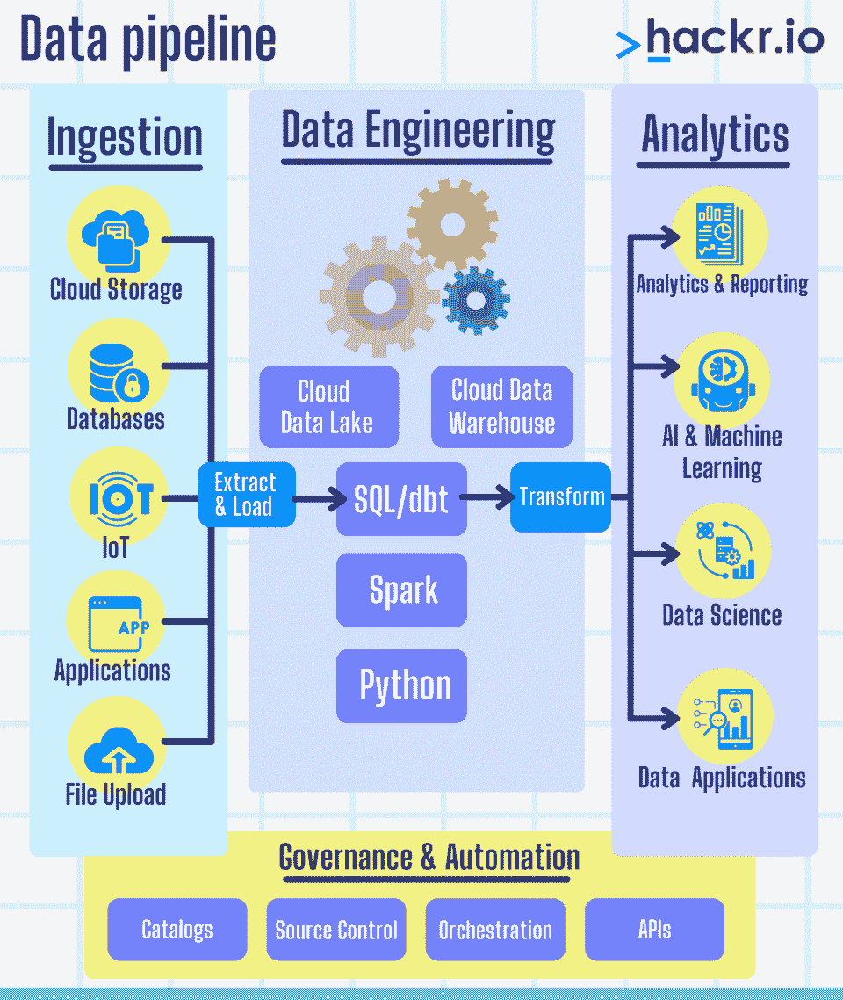

# 什么是数据工程？2023 年你需要知道的一切

> 原文：<https://hackr.io/blog/what-is-data-engineering>

随着世界对数据科学越来越狂热，另一个相关领域也越来越受到关注:数据工程。数据工程师在管理 ETL 过程、工作流、管道等方面扮演着重要的角色。

数据工程师的需求越来越大，他们的薪酬待遇也很有吸引力，因为他们每天都要做令人兴奋且富有挑战性的工作。大多数数据工程师的收入远远超过六位数——在一些城市，高级数据工程师职位的收入可以接近 20 万美元。把数据工程师的工作想象成介于数据分析师和数据科学家之间。

但是到底什么是数据工程，数据工程师是做什么的？

在本文中，我们仔细研究了数据工程的定义，以弄清楚它是什么，它是如何工作的，以及为什么它在当今数据驱动的世界中如此重要。

让我们从基础开始。我们如何定义数据工程？

## **什么是数据工程？**

数据工程是一个有价值的领域，它处理、存储和交付大量数据。如果数据分析是关于数据建模，而数据科学是关于决策，那么**数据工程为这两个领域提供了必要的基础设施。**

数据工程师可以构建或设计管道来传输、存储和转换数据。管道从各种来源获取数据，并将它们存储在单个仓库或存储库中，如数据湖。数据工程师的最后一个角色是提供强大可靠的基础设施来支持和验证大数据。

现在，让我们仔细看看数据工程的历史。

### 数据工程是如何产生的？

在其当前的迭代中，数据工程已经存在了大约十年。但是有些人认为，自从 ETL、数据库和 SQL servers 出现以来，数据工程已经存在很长时间了。

但是数据工程到底是如何产生的呢？

你听说过 [*信息工程*](https://en.wikipedia.org/wiki/Information_engineering_(field)) 吗？这个术语描述了 20 世纪 80 年代数据分析和数据库设计中的软件工程——数据工程的最早形式。

但随后，互联网在 90 年代和 21 世纪初崛起。从那时起，“大数据”开始成为现实。IT 专业人员、SQL 开发人员和数据库管理员是存在的，但他们不被称为数据工程师。

然后，在 21 世纪初，脸书和 Airbnb 开始讨论“数据工程师”这个术语因此，数据量大幅增加，变得更加多样化。

公司意识到他们坐拥黄金。流经他们系统的实时数据有巨大的潜力做出更好的决策并获得利润。为这些数据驱动型公司工作的软件工程师发现他们需要能够快速、高效、正确地处理所有这些数据的工具。所以他们创造了他们！

现在，数据工程是它自己的实体。它描述了一种完全专注于收集、管理和存储数据的软件工程。

### **为什么现在迫切需要数据工程？**

有几份报告在讨论大数据项目惊人的高失败率。这不是开玩笑——Gartner 的一份报告描述了 2017 年数据项目 85%的失败率— *大规模*。这背后最大的原因之一是缺乏不可靠的数据基础设施。公司拥有的许多数据都不值得信赖，不足以作为重大决策的依据。

但 2017 年是 5 年前，所以可能是后来改善了？

不是特别喜欢。

2019 年，IBM 数据科学首席技术官 AI Deborah Leff 表示，87%的组织数据科学项目从未进入生产阶段。

同年， [Gartner](https://blogs.gartner.com/andrew_white/2019/01/03/our-top-data-and-analytics-predicts-for-2019/) 预测，到 2023 年，只有 20%的数据洞察和分析能够提供企业寻求的结果。其他预测包括:

*   到 2023 年，90%的业务战略将把信息和数据作为关键资产和竞争力。
*   到 2023 年，数据素养将成为公司价值的关键驱动力

数字转换继续产生不可逾越的数据量和新的复杂数据类型。公司早就知道数据科学家是解释和分析所有这些数据的关键。但是这些组织没有马上意识到他们需要数据工程和数据工程师来确保数据的安全和可靠。

当时，数据科学家也执行数据工程师的任务和职责。然而，越来越明显的是，数据科学家并不总是具备正确的技能和知识来以正确的方式处理数据。因此，数据变得不太可靠，更多的数据项目失败。

今天，数据工程作为成功的数据科学项目的基础系统变得越来越重要。

### **数据工程在数据科学生命周期中处于什么位置？**

数据工程由以下步骤组成:

*   **数据收集:**您可以从日志、数据库、外部来源、用户生成的内容、传感器、仪器等收集数据。
*   **数据的移动和存储:**这涉及到数据流、管道、结构化和非结构化数据的存储、ETL 和基础设施。
*   **数据准备:**准备包括清理和处理，去除数据中的异常。

### **为什么数据需要通过数据工程进行处理？**

你可能会问，“为什么数据工程是为了数据处理？”

过去，数据工程师创建数据仓库，用索引和数据结构组织数据。这些结构可以快速处理查询并提供足够的性能。

然而，随着大数据和数据工程的扩展，“[数据湖](https://aws.amazon.com/big-data/datalakes-and-analytics/what-is-a-data-lake/)”正在兴起。这些湖允许工程师将他们所有的数据存储在一个集中的存储库中，即使这些数据不是*结构化的*。因此，数据湖通常混合了大量非结构化和无格式的数据。

数据工程格式化、结构化并“清理”数据，使其更容易、更快理解。

由于数据是以难以想象的速度大规模产生的，数据工程算法对于自动化“清理”和准备数据管道中使用的数据的过程是必要的。

#### **数据工程和数据治理**

[数据治理](https://www.talend.com/resources/what-is-data-governance/)包括角色、流程、标准、策略、指标和标准，以确保数据和信息得到有效利用*和*以帮助组织实现其目标。

如今，数据治理实际上是一项需求，尤其是在企业环境中。数据治理最大化数据价值，管理和降低风险，甚至降低成本。

但是数据治理与数据工程有什么关系呢

答案很简单。

数据工程师通常是公司数据治理战略的一部分。这是因为数据工程师通常负责实现由数据管理员决定的数据治理实践。

[使用 SQL、Python 和 PySpark 的数据工程基础知识](https://click.linksynergy.com/deeplink?id=jU79Zysihs4&mid=39197&murl=https%3A%2F%2Fwww.udemy.com%2Fcourse%2Fdata-engineering-essentials-sql-python-and-spark%2F)

## **数据工程师是做什么的？**

早些时候，数据科学家或分析师将不得不编写大型的 [SQL 查询](https://hackr.io/blog/sql-commands)并使用各种工具来执行 ETL。然而，随着大数据的普及，数据分析师、数据工程师和数据科学家的角色进一步缩小。

数据工程师是公司数据战略的关键部分，负责:

*   **数据采集**，或收集和搜集企业周围所有可用的数据
*   **数据清理**，数据工程师定位任何错误和异常

*   **数据转换或变换，将数据湖或数据仓库中的所有数据转换成单一的通用格式**

数据工程师也可能执行其他任务，例如**消除歧义**，在那里他们*解释*数据。它们会删除任何重复或冗余的数据。

数据工程师在以下方面具有专业知识或经验:

*   Python 和 SQL
*   使用 AWS 等云服务
*   Java 还是 Scala
*   了解 SQL 和 NoSQL 数据库之间的差异
*   使用 SQL 和 NoSQL 数据库
*   ETL 工具，如 Informatica PowerCenter、Oracle Data Integrator、AWS Glue 等

由于数据工程师的职责是明确定义的，数据科学家可以更多地关注手头问题的业务方面。大多数数据工程师在技术上是健全的，至少拥有上述技能的 5 分之 4。

### **数据工程师需要哪些技能？**

一些公司确实对数据工程师有更高的期望。例如，科技巨头亚马逊、脸书和谷歌有更多的数据要处理，期待前面提到的技能*和*下面的技能:

*   大数据体验—Spark/Hadoop/Kafka

*   数据结构和分布式系统的基础知识
*   理解算法
*   了解可视化工具，如 Excel、Tableau 或任何其他工具

除此之外，高级数据工程师应该具有一些商业智能经验和创建报告和仪表板的工作知识。

即使有这种明确的区分，数据科学家和数据工程师的角色中仍有一些技能重叠。由于数据工程师是技术人员，他们通常也可以执行数据科学家的任务。然而，反过来并不总是正确的。

记住成为数据工程师的两个关键词——“计算机科学”和“数据”

你需要的工具和技术知识取决于行业。例如，SQL、Sybase、Oracle、 [C++和 Java](https://hackr.io/blog/cpp-vs-java) 等数据工程技术在金融服务领域更受欢迎。相比之下，咨询行业使用更现代的工具，如 Hadoop、Spark、Java/Scala 和云平台，如 AWS、Azure 或 Google。

以下是开始数据工程师职业生涯所需的所有技术知识:

### **1。数据结构和算法**

数据结构是一组能够组织和存储数据以便于访问和操作数据的方法。数据结构的一些例子是数组列表、链接列表、队列、映射、树等。算法是为解决问题而编写的代码集。算法使用数据结构来加快数据处理和解决问题。看看这个很酷的[数据结构和算法教程](https://hackr.io/tutorials/learn-data-structures-algorithms?ref=blog-post)列表。

### **2。SQL**

SQL 是最关键的技能，让你更好的理解数据。如果您可以编写查询，您可以在几分钟内从数据库中获取任何类型的数据。作为一名数据工程师，您应该能够创建数据库模式和表，并执行分组、排序、连接、排序和其他数据操作。SQL 是为进一步分析准备数据的重要步骤。通过[教程](https://hackr.io/tutorials/learn-sql?ref=blog-post)学习 SQL，或者温习 [SQL 备忘单](https://hackr.io/blog/sql-cheat-sheet)。

### **3。Python、Java**

Java 和 Python 是用于数据科学的两种最流行的语言。Python 因其丰富的库而广受欢迎，这些库可以执行几乎所有的统计和数学运算，并应用各种算法，而不需要太多的实际编码。Python 也是易学易读的。你可以通过这些[免费和付费教程](https://hackr.io/tutorials/learn-python?ref=blog-post)开始学习 Python。

Java 对于大数据处理是必不可少的。Apache Hadoop 中的 Map-Reduce 算法使用 Java。Java 容易；但是，不像 Python 那么容易。如果你有一定的编程背景，可以轻松拿起 Java 但是，如果你是编程新手，先从 Python 开始，然后再转到 Java。这里有[个 Java 教程](https://hackr.io/tutorials/learn-java?ref=blog-post)会帮到你！

### **4。大数据**

大数据可以存储海量数据，包括结构化、半结构化和非结构化数据。由于数据科学和 AI，对数据的需求增加了；因此，大数据工具和技术变得比以往任何时候都更加重要。学习大数据将有助于您了解数据是如何存储、处理、清理的，以及如何从庞大的数据集中提取信息。大数据基于三个主要概念:数量、速度和多样性。

许多数据处理框架有助于快速处理巨大的数据集，并通过自身或其他工具执行分布式计算。一些流行的框架是 Apache Spark、Hadoop 和 Apache Kafka。Hackr.io 列出的这些 3:

### **5。云平台**

云系统使资源按需可用，任何用户都可以通过互联网访问。企业可以专注于核心业务用例及问题，而不必担心基础设施或其他 IT 问题。

云系统便宜且易于维护。云客户端可以是网页浏览器、手机 app、终端等。您可能熟悉云平台提供的这三种服务:

*   **SaaS(软件即服务):**例如，电子邮件、游戏、CRM、虚拟桌面等。
*   **PaaS(平台即服务):**例如，数据库，一个 web 服务器
*   **IaaS(基础设施即服务):**例如，服务器、存储、虚拟机、网络等。

谷歌、微软和亚马逊是三大云提供商。Hackr.io 将所有合适的教程整合到了一个地方:

### **6。分布式系统**

分布式系统是一组协同工作的计算机，但对最终用户来说，它们看起来是一台计算机。每台计算机都是相互独立的；如果一个失败了，不会影响到其他的。此外，分布式系统允许水平扩展，这增强了应用程序的整体性能和容错能力。通过这篇 [freecodecamp 文章](https://www.freecodecamp.org/news/a-thorough-introduction-to-distributed-systems-3b91562c9b3c/)了解更多关于分布式系统的知识。

### 7 .**。数据管道**

像 [AWS](https://hackr.io/blog/what-is-aws) 这样的云平台提供数据管道，这是数据工程的核心。AWS 数据管道只是一个 web 服务，可用于自动转换和移动数据。管道可以计划每天和每周的任务，并通过创建单独的实例来运行它们。了解 [AWS 数据管道](https://docs.aws.amazon.com/datapipeline/latest/DeveloperGuide/what-is-datapipeline.html)。

***相关:*** *如果你想了解更多关于在这个领域开始职业生涯的信息，可以查看我们关于* [*如何成为一名数据工程师*](https://hackr.io/blog/how-to-become-a-data-engineer) *的深度文章。*

## 数据工程与数据科学:有什么区别？

曾几何时，数据科学家身兼两职——他们分别扮演数据工程师*和*数据科学家的角色。然而，多年来，数据作为一个整体和一个行业一直在不断发展和演变。

这种演变的一个结果是收集和管理数据变得更加复杂。组织越来越期望从所有分析的数据中获得更多见解、答案和可操作的信息。因此，我们将收集和管理数据的工作留给了数据工程，将分析工作留给了数据科学家。

在某种程度上，数据工程和数据科学是相辅相成的。数据科学家在某种程度上依赖于工程师，因为数据工程师收集和管理数据，然后科学家对这些数据进行分析、解释和报告。简单来说:

*   数据工程师构建、维护和优化数据科学家工作所依赖的系统。他们创建收集、汇总、存储和保护各种来源的原始数据的系统。数据工程师还构建数据生成所需的架构和基础设施，并为实时分析提供便捷的访问。
*   数据科学家使用数据工程师给他们的数据。他们分析、解释并从原始数据中发现新的结论和见解，从而通过数据可视化等方法将其转化为易于理解的信息。数据科学家提供有价值的见解，可以帮助组织或业务领导层做出更好的数据驱动型决策。一些数据科学家也与机器学习工程师密切合作，以实现人工智能和自动化。

总之，数据工程通过创建基础设施和数据管道来存储、转换和传输大量数据，从而处理、存储和交付这些数据。数据科学使用科学的方法、算法、系统和流程来分析数据并从中提取见解。

***相关:*** *觉得数据科学更堵你？阅读我们的文章“* [*什么是数据科学？*](https://hackr.io/blog/what-is-data-science) *“如果你准备好开始学习，你可以查看我们对* [*最佳数据科学课程*](https://hackr.io/blog/data-science-courses) *的推荐。*

## **结论**

对数据工程师的需求只会继续增长，尤其是当他们的角色变得更加明确时。

大多数实时数据是非结构化的，需要大量处理才能有用，这使得数据工程成为一个具有挑战性的领域。但是你可以通过实践和尽可能多的工具、算法和数据结构的知识来掌握数据工程。

当你升到高级水平，你也可以抓住一些人工智能方面，这对数据工程是必不可少的。但是如果数据工程不适合你，考虑与之密切相关的[数据科学家](https://hackr.io/blog/how-to-become-a-data-scientist)职业！

[**探索最好的数据科学课程！**](https://hackr.io/blog/how-to-become-a-data-scientist)

**人也在读:**