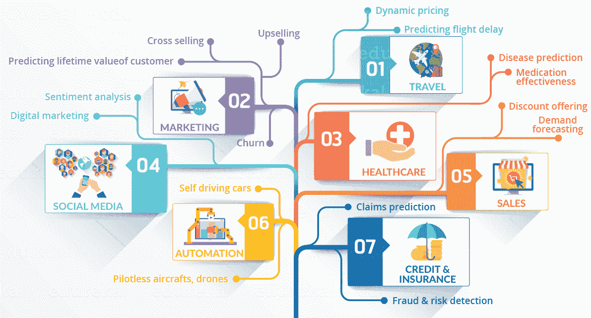
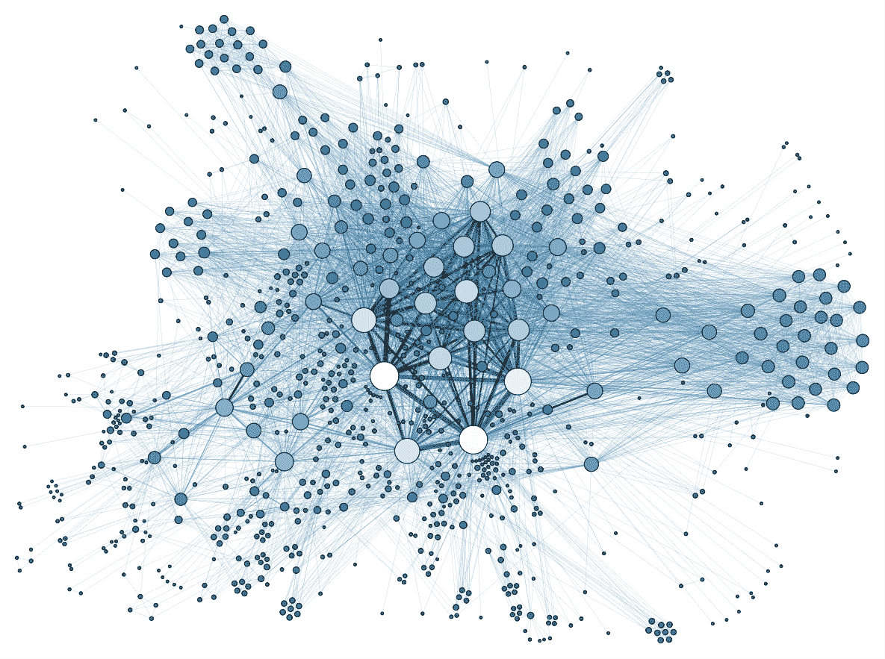
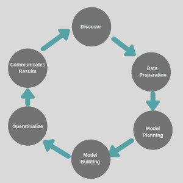
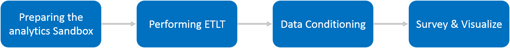
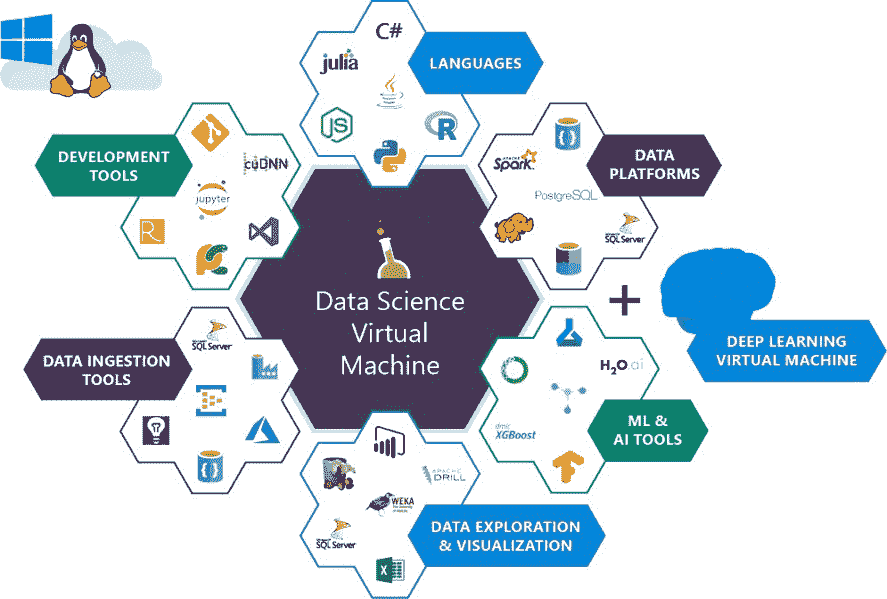

# 什么是数据科学？数据科学初学者指南

> 原文：<https://hackr.io/blog/what-is-data-science>

你知道什么是数据科学吗？我们的小星球现在正在成为一个数字星球，到 2022 年，我们将拥有比宇宙中恒星多 40 倍的 。 当今世界上所有可能的设备和系统中 90%以上的数据都是在过去两年中产生的。

这些海量数据——现在称为大数据——对企业来说意义重大，有助于获得关于用户和用户行为的见解和趋势。结构化和非结构化格式的海量数据很难通过传统的数据库建模和工具来处理。因此，需要使用科学方法、算法和工具来分析和理解大数据，并且需要数据科学和数据分析。

## **什么是数据科学？**

数据科学与创造力息息相关。数据科学的目标是通过分析不同的数据集来获得洞察力和趋势，从而为企业带来竞争优势。数据科学是数学、统计学和软件与应用商业环境领域专业知识的结合。

另一个经常被误解的数据科学术语是商业智能(BI)。BI 主要关注数据分析和报告，但不包括预测建模，因此 BI 可以被视为数据科学的一个子集。构建预测模型是数据科学中最重要的活动之一。数据科学中的其他流程有业务分析 、 [数据分析](https://hackr.io/blog/what-is-data-analytics) 、 数据挖掘、 和 预测分析 。数据科学还涉及数据可视化以及以用户可理解的格式向用户呈现结果。

### **为什么需要数据科学？**

公司需要使用数据来运营和发展业务。数据科学的根本目标是帮助公司做出更快、更好的商业决策，这可以使他们获得更好的市场份额和行业领先地位。此外，它可以帮助他们采取战术方法，在困难的情况下保持竞争力。各种规模的组织都在适应数据驱动的方法，高级数据分析是变革的支点。

下面是一些组织使用数据科学的例子-

*   网飞 分析观看模式，了解是什么驱动了用户的兴趣，并利用这些信息为他们的下一个制作系列做出决定。
*   **目标:**另一方面，**，** 确定什么是主要客户群以及这些客户群中客户的独特购物行为。这有助于他们引导不同的市场受众。
*   Proctor & Gamble 利用时间序列模型更清楚地了解未来需求，这有助于他们更优化地规划生产水平。

### **数据科学的生命周期**

任何数据科学项目的生命周期都有五个阶段。

#### **捕获** : 数据是如何捕获的？

*   **数据获取:**数据获取或数据收集是任何数据科学项目的第一步。所需的完整数据集永远不会在一个地方找到，因为它分布在业务线(LOB)应用程序和系统中。
*   **数据录入:**数据可以由人工操作员或设备为企业创建新的数据值。这是一个耗时的过程，但在某些情况下是必要的。
*   **信号接收:**获取数据的另一个来源是通过数据设备，这通常在控制系统中很重要，但随着“物联网”的发明，现在对信息系统来说更为重要
*   **数据提取:**数据提取是一个涉及从各种来源检索数据的过程。它们可能是 web 服务器、数据库、日志和在线存储库

#### **维护** :抓取的数据怎么处理？

*   **数据仓库:** 数据仓库强调对不同来源的数据进行捕获和存储，以供访问和分析。它是组织收集的所有数据的存储库
*   **数据清理:** 数据清理或数据清理是从数据集、表或数据库中识别并移除(或纠正)不准确记录的过程，是指识别未完成的、不可靠的、不准确的、丢失的值、重复的值或数据的不相关部分，然后恢复、重新建模或移除脏的或原始的数据
*   **数据暂存:** A n 中间存储区用于提取、转换和加载(ETL)过程中的数据 处理。数据 暂存 区域位于数据源和数据目标之间，数据目标通常是数据 仓库、数据集市或其他数据存储库。
*   **数据处理:** 在这个阶段，数据被处理用于解释。处理是使用 机器学习 算法完成的，尽管该过程本身可能会因正在处理的数据的来源(数据湖、社交网络、互联设备等)而略有不同。)及其预期用途(检查广告模式、连接设备的医疗诊断、确定客户需求等)。).
*   **数据架构:** 是一个框架，用于高效地将数据从一个位置传输到另一个位置。它充满了模型和规则，管理什么数据将被收集。它还控制收集的数据应该如何存储、排列、集成并在组织的数据系统中使用。简而言之，数据架构为所有数据系统设置了标准，作为数据系统交互功能的愿景或模型。

#### ***流程** **:** 干净的数据怎么处理？*

现在数据已经收集并存储，我们可以进入下一步数据处理。

*   **数据挖掘:** 数据挖掘是关于发现数据集中的趋势。这些趋势被用来确定未来的模式。它通常包括分析大量以前被忽视的历史数据。
*   **聚类与分类:** 聚类是将总体或数据点划分或分类成若干组，使得同一组中的数据点比其他组中的数据点更相似于同一组中的其他数据点的任务。简而言之，目标是分离具有相似特征的群体，并将它们分配到集群中
*   **数据建模:** 数据建模是产生要存储在数据库中的各种类型的信息之间的关系的描述图的过程。
*   **数据摘要:** 摘要 是一个关键的 数据 挖掘概念，涉及到寻找数据集的紧凑描述的技术。数据汇总是一个简单的术语，指的是在对大数据集进行分析后得出的简短结论。数据摘要在数据挖掘中有着非常重要的作用。T12
    

#### 分析: 现在你已经对你的数据进行了分类和建模，是时候分析你的数据了。你如何分析你的数据？

*   **探索性/验证性:** 检查数据通常分为两个阶段:探索性分析和验证性分析。这两者并行运作最为有效。 探索性数据分析有时被比作侦探工作:它是收集证据的过程。验证性数据分析相当于法庭审判，它是评估证据的过程。
*   **预测分析:**预测分析(Predictive analytics)是利用数据分析，根据数据做出预测的过程。这个过程使用数据以及分析、统计和机器学习技术来创建预测未来事件的预测模型。预测分析用于确定客户反应或购买，以及促进交叉销售机会。预测模型有助于企业吸引、留住和发展利润最高的客户。许多公司使用预测模型来预测库存和管理资源
*   **回归**:回归分析是一种预测建模技术，它调查因变量(目标)和自变量(预测值)之间的关系。这种技术用于预测、时间序列建模和寻找变量之间的因果关系。
*   **文本挖掘:** 这是指使用数据挖掘技术从文本中发现有用的模式。挖掘数据的文本是非结构化的。信息和关系隐藏在语言结构中，不像数据挖掘那样显而易见。
*   **定性分析:** 当数据不是以数字的形式出现时，就更难理解了。定性数据被定义为近似和表征的数据。可以观察和记录定性数据。这种数据类型本质上是非数值型的。这类数据是通过观察、一对一访谈、开展焦点小组和类似方法收集的。

定性数据分析就是检查定性数据以得出对特定现象的解释的过程。定性数据分析通过揭示数据中的模式和主题，让您了解您的研究目标。数据科学家和他们的模型可以从定性方法中受益匪浅。

#### **沟通:** 如何展示自己的成果？

*   **数据报告:** 报告传达了对数据和问题进行研究和分析后汇编的信息。报告可以涵盖广泛的主题，但通常侧重于向特定的受众传递有明确目的的信息。好的报告是准确、客观和完整的文件。
*   **数据可视化:** 数据可视化是信息和数据的图形化表示。通过使用图表、图形和地图等可视化元素，数据可视化工具为查看和理解数据中的趋势、异常值和模式提供了一种便捷的方式。
*   **商业智能:** BI 是数据科学不可或缺的一部分。要进行预测分析，我们首先需要知道哪里出了问题。因此，BI 是数据科学的一个更简单的版本
*   **决策:**数据在决策中的重要性在于一致性和持续增长。它使公司能够创造新的业务机会，创造更多收入，预测未来趋势，优化当前的运营工作，并产生可操作的见解。

所有这五个阶段都需要不同的技术、程序，在某些情况下，还需要不同的技能组合。

[数据科学课程 2023:完整数据科学训练营](https://click.linksynergy.com/deeplink?id=jU79Zysihs4&mid=39197&murl=https%3A%2F%2Fwww.udemy.com%2Fcourse%2Fthe-data-science-course-complete-data-science-bootcamp%2F)

### **数据科学的应用**

数据科学已被证明在几乎每个行业都很有用。

#### **银行业**

数据科学大量应用于银行业。以下是数据科学在银行业的主要应用领域

*   风险建模
*   欺诈检测
*   客户终身价值
*   客户细分
*   实时预测分析

#### **医疗保健**

数据科学在医疗保健行业有许多用途。

*   **患者预测:**A[福布斯文章](https://www.forbes.com/sites/bernardmarr/2016/12/13/big-data-in-healthcare-paris-hospitals-predict-admission-rates-using-machine-learning/#79f2f6ff79a2) 详细介绍了巴黎公共医院援助计划中的四家医院如何使用各种来源的数据来预测每家医院每天和每小时的预计患者人数。这有助于他们的人力资源。
*   **电子健康记录:** 每个病人都有他的数字记录，包括人口统计、病史、过敏、实验室检查结果等。记录通过安全的信息系统共享，可供公共和私营部门的提供者使用。每份记录都由一个可修改的文件组成，这意味着医生可以随着时间的推移实施更改，而无需文书工作，也没有数据复制的危险。
*   当患者需要进行新的实验室检查或跟踪处方以查看患者是否遵守医嘱时，EHR 还可以触发警告和提醒。
*   **患者跟踪:** 患者直接参与对自身健康的监测，健康保险的激励措施可以推动他们过上健康的生活方式(例如:将钱返还给使用智能手表的人)。他们有智能设备跟踪他们的每一步。
*   **预测分析:**医疗保健商业智能 的目标是帮助医生在几秒钟内做出数据驱动的决策，改善患者的治疗。这对于具有复杂病史、患有多种疾病的患者尤其有用。
*   **大数据医疗成像:**医疗保健的大数据分析可能会改变读取图像的方式。分析成千上万张图像的算法可以识别像素中的特定模式，并将其转换为数字，以帮助医生进行诊断。他们甚至走得更远，说放射科医生可能不再需要看图像，而是分析算法的结果，这些算法将不可避免地研究和记忆比他们一生更多的图像。

**制造业:** 以下是制造业中使用的 8 种最流行的数据科学，以及它们如何影响生产力、最小化风险和增加利润。数据驱动型制造商将利用数据科学来:

*   性能、质量保证和缺陷跟踪
*   预测和条件维护
*   需求和吞吐量预测
*   供应链和供应商关系
*   全球市场定价
*   自动化和新设施的设计
*   产品开发和生产技术的新工艺和新材料
*   可持续性和更高的能效

**交通** : 数据科学的另一个重要应用是交通。在交通领域，数据科学正在积极地为司机创造更安全的驾驶环境。它还在优化车辆性能和增加驾驶员自主性方面发挥着关键作用。此外，在交通领域，随着自动驾驶汽车 **的推出，数据科学已经积极地增加了它的多样性。**

此外，像优步这样的各种运输公司正在使用数据科学 进行价格优化，并为他们的客户提供更好的体验。他们使用强大的预测工具，根据天气模式、交通可用性、顾客等参数准确预测价格。

**电子商务:** 您可以探索在线零售商利用数据科学实现商业价值的四种方式。

*   *   确定您最有价值的客户
    *   发现哪些客户可能流失
    *   通过智能产品推荐推动销售
    *   **自动从评论中提取有用的信息**

以下是一些当今流行的数据科学工具。

*   SAS: 它是专门为统计操作设计的[数据科学工具](https://hackr.io/blog/data-science-tools)之一。 SAS 是一个封闭源码的专有软件 ，是大型组织用来分析数据的。SAS 使用用于执行统计建模的基本 SAS 编程语言。
*   [**Apache Spark:**](https://hackr.io/tutorials/learn-apache-spark?ref=blog-post)Apache Spark或简称 Spark 是一个全能的分析引擎，是使用最多的数据科学工具。Spark 是专门为处理批处理和 **流处理而设计的。** 它自带了很多 API，方便数据科学家对数据进行重复访问，用于机器学习，存储在 SQL 等。这是对 Hadoop 的改进，执行速度比 MapReduce 快 100 倍。Spark 有许多机器学习 API，可以帮助数据科学家利用给定的数据进行强大的预测。
*   [**MATLAB**](https://hackr.io/tutorials/learn-matlab?ref=blog-post)**:**在数据科学中，MATLAB 用于模拟 神经网络 和模糊逻辑。使用 MATLAB 图形库，您可以创建强大的可视化。MATLAB 也用于图像和信号处理。这使得它成为数据科学家的一个非常通用的工具，因为他们可以解决所有问题，从数据清理和分析到更高级的 深度学习 算法。
*   [**tensor flow**](https://hackr.io/tutorials/learn-tensorflow?ref=blog-post)**:**tensor flow 已经成为机器学习的标准工具。它被广泛用于高级机器学习算法，如深度学习。开发人员以张量命名 TensorFlow，张量是多维数组。它是一个开源且不断发展的工具包，以其高性能和高计算能力而闻名。
*   [**NLTK**](https://hackr.io/tutorial/hands-on-nltk-tutorial?ref=blog-post) **:自然语言处理** 已经成为数据科学中最热门的领域。它处理帮助计算机理解人类语言的统计模型的发展。这些统计模型是机器学习的一部分，通过它的几种算法，能够帮助计算机理解自然语言。 [Python 语言](https://hackr.io/blog/python-programming-language)附带了一个名为 **的库集合，自然语言工具包(NLTK)** 就是为此特殊目的而开发的 **。**

### **成为数据科学家所需的技能**

要成为一名数据科学家，你可以获得计算机科学、社会科学、物理科学和统计学的学士学位。最常见的研究领域是数学和统计学(32%)，其次是计算机科学(19%)和工程学(16%)。这些课程中的任何一个学位都将为你提供处理和分析大数据所需的技能。

大多数数据科学家都拥有硕士学位或博士学位，他们还接受在线培训，学习一项特殊技能，如如何使用 Hadoop 或大数据查询。因此，您可以报名参加数据科学、数学、天体物理学或任何其他相关领域的硕士学位课程。您在学位课程期间学到的技能将使您能够轻松过渡到数据科学。

在成为数据科学家的过程中可以获得的一些技术技能有 R、Python、Apache Spark、Hadoop 平台、SQL/数据库、[机器学习、AI](https://hackr.io/blog/ai-vs-machine-learning) 和数据可视化。

**你也可以通过**[【https://hackr.io/data-science】](https://hackr.io/data-science?ref=blog-post)的在线教程来了解所有关于数据科学的知识。

**数据科学需求:** 根据 LinkedIn 的 2017 年美国新兴就业报告，自 2012 年以来，数据科学家的数量增长了 650%以上。然而，很少有人利用这个领域的机会。

IBM 预测，到 2021 年，对数据科学家的需求将飙升 28%。机器学习和数据科学正在产生比专家填补的职位更多的工作岗位，这就是为什么这两个领域是当今增长最快的技术就业领域。

未来几年，将需要 14 万至 19 万名执业数据科学家。美国的数据科学家平均年收入为 14.4 万美元。既需要“T1”数据科学咨询公司等专家，也需要通常了解数据的资源，这使得数据成为一种令人信服的职业选择。

**人们也在阅读**