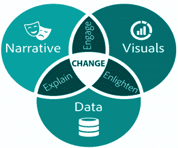
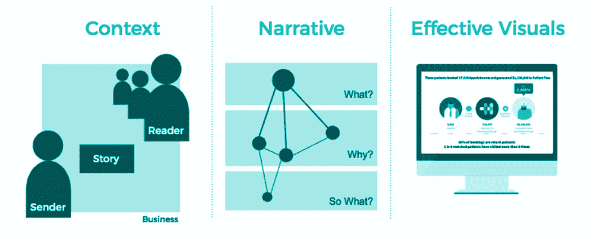

# 什么是数据讲故事？-数据故事定义

> 原文：<https://hackr.io/blog/what-is-data-storytelling>

## 什么是数据讲故事？

数据讲故事可以定义为根据数据分析的结果创建故事的过程，它允许个人理解复杂的方面，并使用它们来采取行动解决问题。由于大数据在各种组织中的高度普及，这项技术变得越来越重要。每一次有影响力的交流都需要精心制作的叙事，视觉是更好地理解人脑的最有效的媒介。因此，数据可视化和讲故事是呈现最佳沟通数据的最佳方式。

众所周知，如果组织能更好地理解数据集中的信息，他们就能更好地处理数据。商业分析和商业智能是两项需要巨额投资的技术，因此从数据中获取信息以改善商业决策至关重要。

数据可视化有助于将复杂的信息转换成更容易理解的格式，以便更好地理解信息，但数据可视化回答了“是什么”的问题。因此，数据故事开始回答“为什么”的问题。数据可视化和数据叙事是可以简化关键信息以改进针对风险和问题的行动的两个方面。

在数据叙事中有三个方面的交流，它们是叙事、视觉和数据。这些方面创造了一个良好的数据故事，并以一种可以创造观众互动和准确解决问题的方式呈现数据，因此它代表了复杂的数据集，并分离了电子表格中看不到的趋势和模式。

**图 1 数据评书的三个方面**

上图显示了这三个方面的重要性:

*   结合叙述和数据可以解释完整的信息
*   数据和视觉启发行动信息
*   叙事和视觉的结合可以让观众参与到交流中来。
*   叙事和视觉的结合可以让观众参与到交流中来。

**
图 2 组合数据评书**

因此，各种组合显示了不同的基本要素，但所有这些方面的组合创造了数据故事。简而言之，将叙事、视觉和适当的数据融合在一起，可以产生最大的影响力，从而创造变革。

[数据可视化&评书](https://click.linksynergy.com/deeplink?id=jU79Zysihs4&mid=39197&murl=https%3A%2F%2Fwww.udemy.com%2Fcourse%2Fdata-visualization-storytelling-d%2F)

## **数据叙事的重要性**

数据叙事之所以重要，是因为它可以通过引人注目的叙述为特定受众量身定制完整的信息。它包括创建引人注目的故事的能力，这些故事可以影响观众，并提供关键信息以做出最佳决策。我们来讨论几个可以阐述数据故事化有效性的策略:

*   组织可以了解他们的受众/客户。
*   这是一项创造性的技术，但同时也避免了分心。
*   它与他人合作，形成一种影响和告知观众的新方式。
*   它创造了一种从组织流程中消除风险和问题的方法。

根据历史，它提供了讲故事不是现代发明的信息，因为有许多像洞穴绘画和小说这样的证据可以证明讲故事有着伟大的历史。

**
图 3 说书的表象**

数据可视化在创建数据故事以更好地理解信息方面发挥着重要作用，因为它为数据故事讲述点提供了足够的可信度和影响力。

根据数据可视化的[定义，通过按概念顺序和时间排列数据，有助于从数据中揭示关键发现、模式和趋势。有一些关键点可以提供数据故事讲述的重要性，它们是:](https://hackr.io/blog/what-is-data-visualization)

*   它帮助你集中精力，创造更有影响力的结果。
*   该流程可以简化数据，让受众更好地理解信息。
*   数据叙事总是不偏不倚地为观众开发信息。
*   这有助于你回顾自己的工作，尽可能获得最佳结果。
*   它为观众创造了高参与度和适当的叙事信息。

数据讲故事的最好例子是脸书，因为社交媒体是讲故事的大师，因为他们通过这项技术采取了无数行动，脸书使用数据讲故事:

*   在你生日之际，将过去几年中值得纪念的时刻融合在一起
*   有类似见解的新年快乐短信
*   突出你们互动深度的朋友周年纪念视频
*   朋友们对你的帖子点赞、喜爱或哈哈大笑的次数
*   浏览次数最多的照片或帖子
*   《在这一天》历史回忆

除了社交媒体，还有各种各样讲故事的例子，比如 Spotify、 [Slack](https://slack.com/intl/en-in/) 和优步。因此，这项技术正成为大品牌的重要组成部分。

## **数据讲述的工作流程**

对于父亲的行为，有一个塑造具体故事中的数据来影响观众的过程，这个过程就是:

*   收集当前情况的信息
*   用真实姓名来描述角色，这样观众可以通过识别故事中的角色来更好地与故事建立联系。
*   建立确定问题的紧迫性
*   针对问题采取适当的行动以寻求解决方案
*   决议
*   解决问题步骤的完整时间框架
*   见解、关键信息和鼓舞人心的结束语

现在，这并不是获得最佳数据叙事所需遵循的唯一流程。个人或时间可以跟随以获得目标，最重要的是，优秀讲故事的训练可以帮助创造更多数据讲故事的模式。

## **数据叙事的优势**

数据讲述有不同的好处，可以对业务计划产生积极影响。这项技术主要被企业用来提高业务质量，因此数据故事的好处是:

*   数据叙事利用数据的全部潜在价值，并从中提取重要信息。
*   它为数据可视化提供解释或见解，以提高受众的参与度。
*   数据讲述可以影响商业行为，并对他们的决策产生积极影响。
*   除了所有这些情况，它还反映了人类讲故事的影响。
*   它有助于更直白地翻译对数据的分析，即讲故事的术语。

## **结论**

数据叙事为更好地理解数据提供了出色的叙事信息，它只是将可视化和叙事结合起来，以解决来自组织的问题。大多数情况下，它有助于影响观众或提高他们的参与度，这些因素可以直接影响未来的决策，以消除其中的问题。

有一点是明确的，通过其简洁、互动和有效的工作机制，数据故事可以成为一项伟大的技术，并成为未来决策过程的完整组成部分。它包含许多好处。因此，它正在成为尽可能实现最佳实际工作的业务的一部分。

**人也在读:**