# 什么是数据可视化？类型、用途和原因很重要

> 原文：<https://hackr.io/blog/what-is-data-visualization>

## 什么是数据可视化？

将大量信息或数据表示出来至关重要，即，将大数据方便地描绘出来，而数据可视化是以图形或图片表示来表示数据的过程。数据可视化有助于以可访问的方式压缩和表示数据，以便任何人都可以发现数据中的漏洞或变化，从而解决业务或其他工作中的问题。这项技术使用各种元素，如图表、地图和图形来表示数据，以分析大量数据。它也是数据呈现体系结构(DPA)的重要组成部分，以最有效的方式识别、操作、定位、格式化和呈现数据。

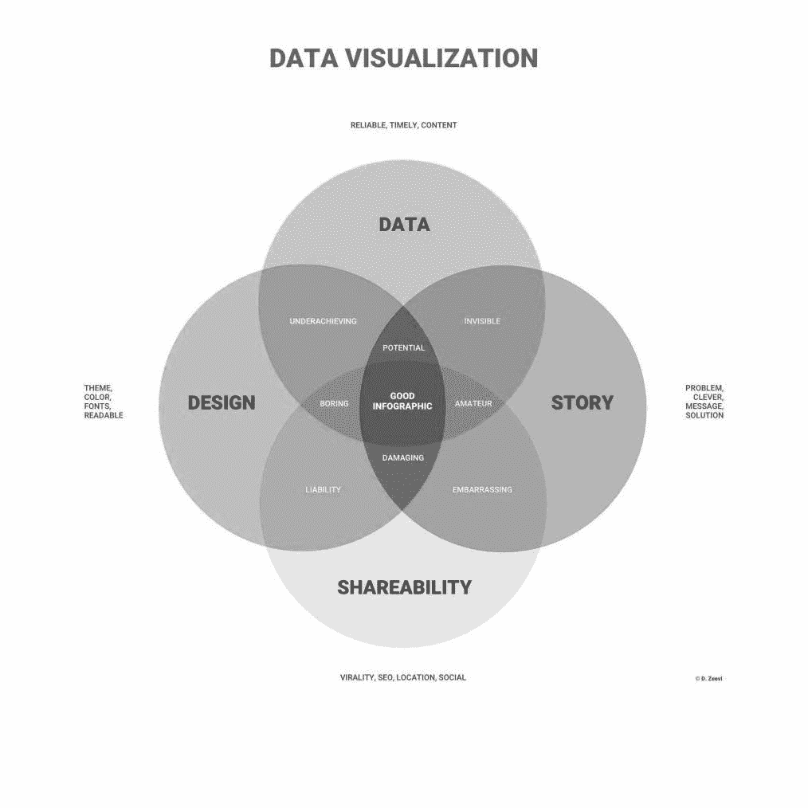

**图 1 数据可视化元素**

数据可视化是每个职业的重要组成部分，因为它可以被教师用来向学生提供关于他们的测试结果的信息。它对大数据项目中的数据科学家也很有用。它是数据科学过程的一个子部分，因为我们需要从各种过程中收集、处理和塑造的数据以可视化的方式呈现。数据的简单表示有助于方便地发现未知的新事实，例如:

*   折线图以直观的形式表示数据，以显示信息的变化
*   折线图或条形图表示在各种信息集合中具有关系和比较的数据。
*   饼图显示了在信息中查找支出和使用的值。

[数据可视化&讲故事](https://click.linksynergy.com/deeplink?id=jU79Zysihs4&mid=39197&murl=https%3A%2F%2Fwww.udemy.com%2Fcourse%2Fdata-visualization-storytelling-d%2F)

## **数据可视化的重要性**

数据可视化提供了一种将大数据集转化为交流和可视化信息的出色而有效的方法。这项技术有助于识别业务中的各种因素，如客户行为或利润和损失，以消除行业中的问题，数据可视化的一些主要优势包括:

*   这项技术可以很快地吸收信息，并从中迅速做出决定。
*   快速决策可以使工作更方便，因此数据可视化可以改善组织的工作。
*   改进的过程和可操作性会引起观众对组织的兴趣。
*   方便的信息分发增加了每个人之间共享适量数据的价值。
*   数据可视化有助于消除相关数据显示过程中的风险，以便个人或组织为未来的工作采取行动。

## **数据可视化类型**

现在我们已经理解了数据可视化，但是在数据可视化中有各种类型的过程或工具可用。这些工具有些是自动化的，有些是手动的。尽管如此，所有流程都通过数据可视化提供了大数据集的表示，因此数据可视化的类型有:

### **1。折线图**

折线图简化了数据，直观地显示了随时间的变化。它由 x 轴通常代表时间，y 轴代表量组成。它有助于找到公司的每月利润。

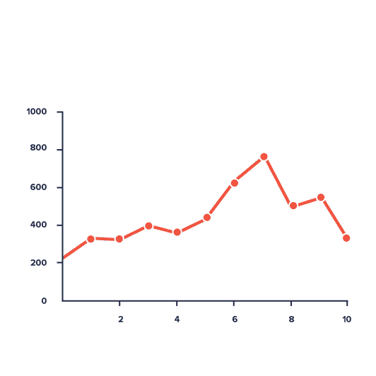

### **2。面积图**

它是对折线图的改编，在折线图中，填充特定区域以强调其重要性，颜色填充应该有点透明，以防区域重叠。

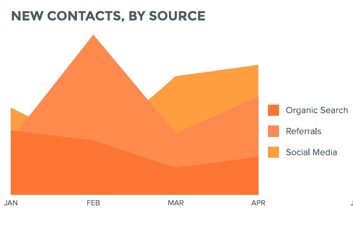

### **3。条形图**

条形图也表示随时间的变化，但它用于数据集中存在多个变量的情况。条形图简化了基于时间的变量比较。

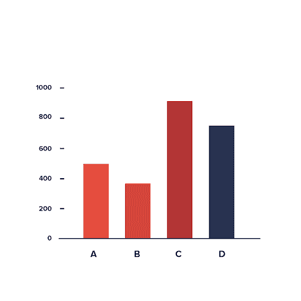

### **4。直方图**

直方图类似于条形图，但它用于测量频率，而不是时间趋势。在直方图中，x 轴代表变量的间隔，y 轴代表频率，因此每个条形可以代表特定变量的频率。

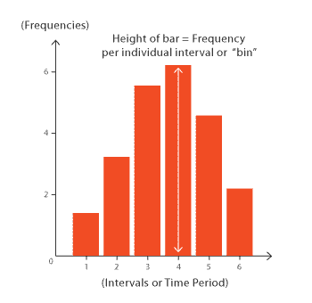

### **5。散点图**

散点图提供关系(相关性)，散点图上的每个点都绘制在 x 和 y 之间，以特定的方式找到适当的关系。

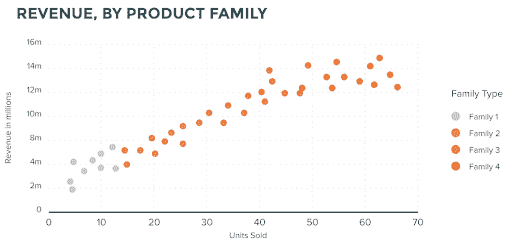

### **6。气泡图**

它是散点图的完全改编，其中每个点代表一个气泡，该气泡根据其在轴之间的位置而包含意义。

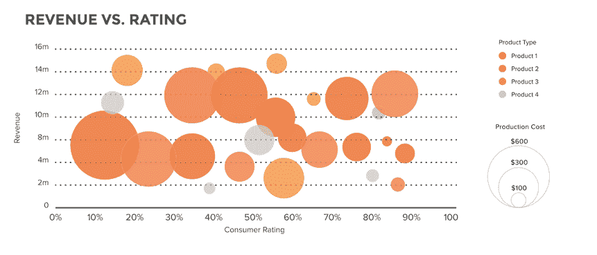

### **7。饼状图**

提供百分比表示是最好的选择，因为它将每个元素表示为整体的一部分。如果信息需要在百分比下解释，饼图以适当的比例表示该部分。

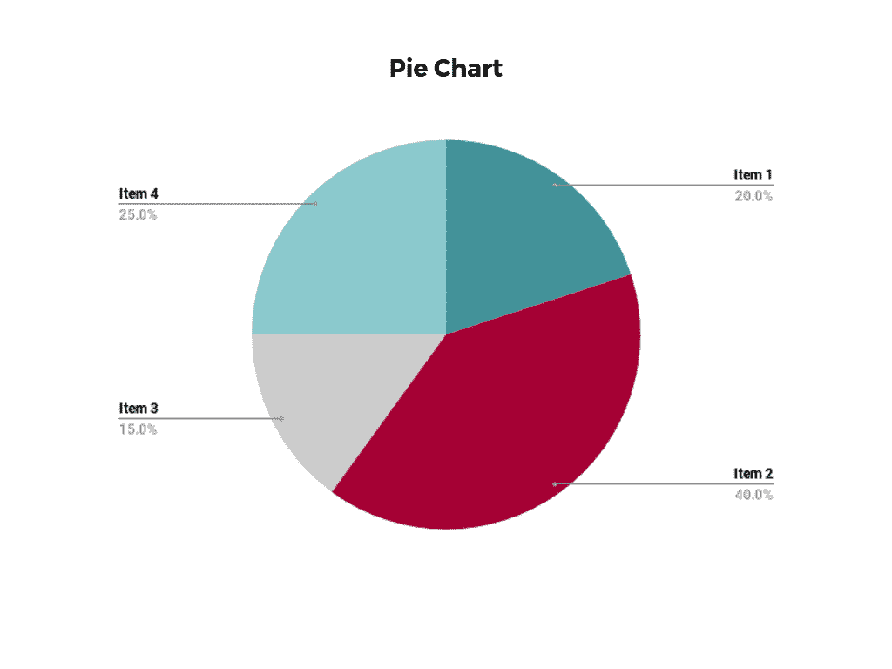

### **8。仪表**

用来表示间隔距离的标尺。它表现为管式仪表、圆钟状仪表，或者类似于[液体温度计](https://www.britannica.com/technology/liquid-thermometer)。多个仪表可以彼此相邻显示，用于表示多个间隔之间的差异。

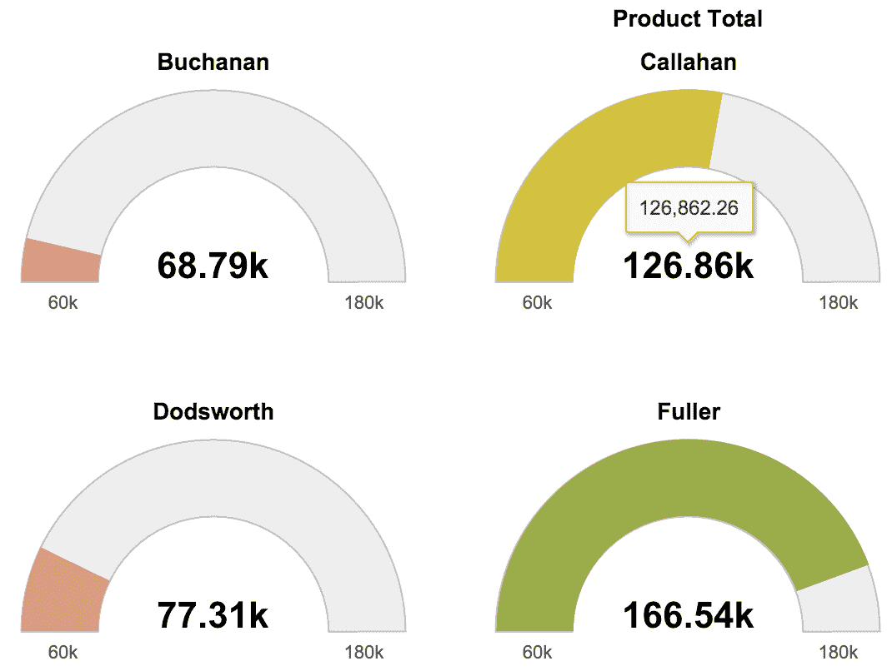

### **9。地图**

业务中有各种数据处理位置元素，使其更容易在地图上显示。这对商业是有益的，因为它直观地提供了位置信息。

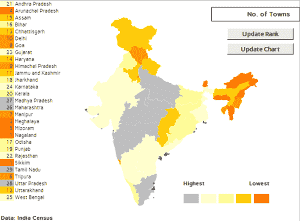

### 10。热图

热图是以颜色编码的矩阵表示数据，因为它需要矩阵的每个单元都有一个特定的公式来以彩色格式表示价值或风险。通常，热图的颜色范围可以从绿色到红色，其中绿色表示较好，红色表示不好。

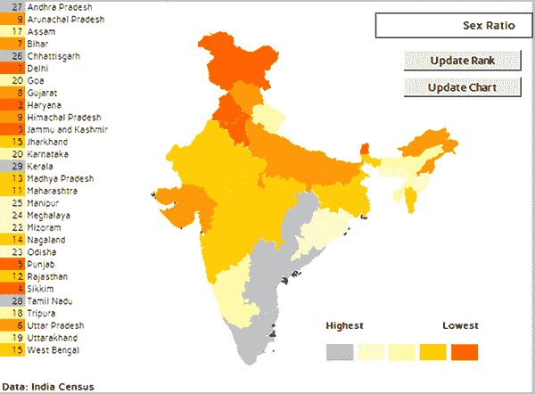

### **11。框架图**

框架图是指显示层次关系结构的树形图。它包括分支，这些分支有更多的分支来表示图表的每个级别。

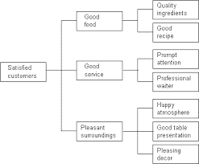

## **数据可视化的用途**

数据可视化有许多用途，下面是一些讨论的使用案例:

### **1。加班变化的确定**

这是数据可视化最常见和最有价值的用途之一，因为每个数据都包含一些时间元素。因此，[数据分析](https://hackr.io/blog/what-is-data-analysis-methods-techniques-tools)的第一步是分析数据随时间的趋势。

### **2。频率确定**

确定任何数据集中信息的频率是至关重要的，因为它有助于在完整的数据集中找到特定信息的适当频率，并且可以通过数据可视化来完成。

### **3。关系确定**

找到各种数据元素之间的关系是至关重要的，而在没有数据可视化的情况下找到关系是一项挑战。因此，这是一个很好的例子，说明数据可视化对于分析是多么有用。

### **4。风险和价值分析**

它需要各种因素来确定风险和价值，因为它是一个复杂的指标，不可能在电子表格中准确地塑造它。数据可视化简化了数据，显示了系统/组织过程中有价值的机会和风险。

### **5。网络检查过程**

市场调查是网络调查的最好例子，因为专业人士需要了解市场中的目标受众。他们分析整个市场，以确定受众的需求和类型。

## **结论**

数据可视化是数据分析中必不可少的最终过程，因为它有助于根据收集的数据做出决策。理解 web 数据集成解决方案中数据可视化的需求是很重要的。因此，数据可视化包括对不同部门有益的各种类型。

在[Northwestern Data Visualization With Tableau](https://getsmarter.sjv.io/c/2890636/1143920/13499)课程中更深入地查看更多信息。它涵盖了我们上面讨论的基础知识和技术。那些需要帮助实施大数据项目的人可能会在 [ProjectPro](https://click.linksynergy.com/fs-bin/click?id=jU79Zysihs4&offerid=1038112.3&type=3&subid=0) 中找到价值。

**人也在读:**