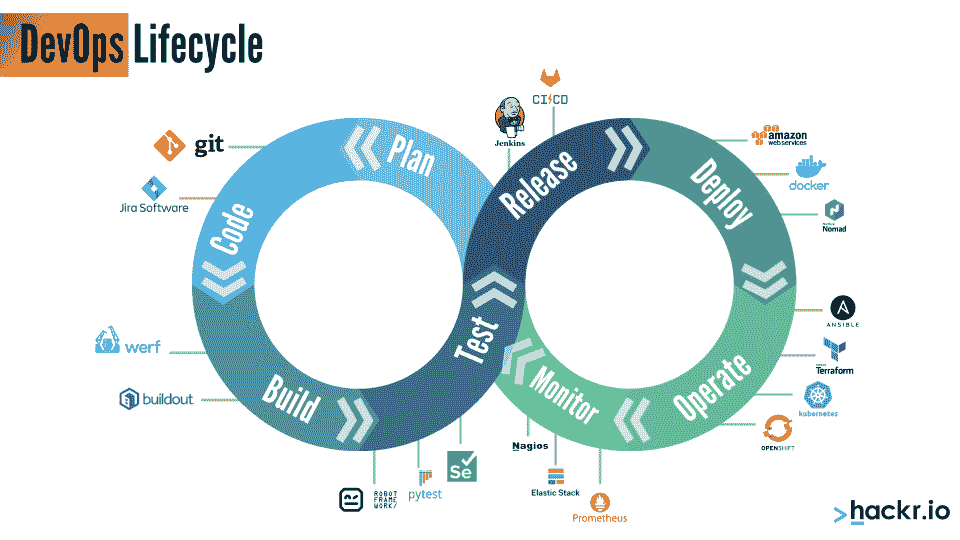
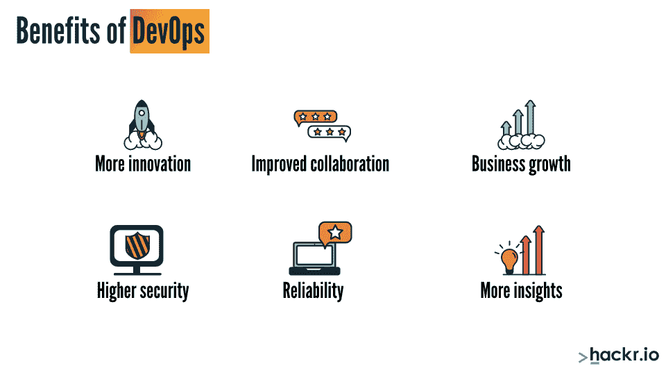

# DevOps 是什么？初学者终极指南

> 原文：<https://hackr.io/blog/what-is-devops>

DevOps 的意思是将许多软件开发阶段组合成一个协作周期，以促进更快的软件开发。传统上，软件开发生命周期是一个一个阶段完成的漫长过程，问题在 IT 测试阶段被发现。这导致了效率低下，因为它给了开发人员和设计人员更少的时间来修复问题，从而增加了人为错误的可能性。

但是 DevOps 到底是什么，DevOps 生命周期如何改进软件开发周期？在本文中，我们将讨论 DevOps 的定义、好处以及更多内容。

## **什么是 DevOps？【定义】**

devo PS 是什么意思？DevOps 是一组实践的名称，这些实践将开发和 IT 操作结合起来，通过持续的交付和反馈来缩短软件开发生命周期。这些实践还鼓励不同业务单位之间更好的沟通和协调。

**开发和运营由什么组成？**

你可能会认为 Dev，就像在开发中一样，仅仅指的是编码员——但这并不完全正确。Dev 包括参与构建产品的整个团队，例如设计和质量保证团队。同样，Op(operations)包括来自运营部门的所有人，而不仅仅是工程师——系统工程师、发布工程师、系统管理员、数据库管理员、网络工程师、运营经理等等都包括在内。

DevOps 生命周期涵盖了软件或产品的整个生命周期。

### **什么是敏捷？**

在我们深入了解 DevOps 的更多细节之前，让我们先来看看敏捷方法。很多人将敏捷和 DevOps 相比较，混淆。虽然两者在某些方面相似，但两者都有不同的目的。

[敏捷方法学](https://hackr.io/blog/what-is-agile-methodology) 包括通过迭代的方法交付小规模、快速的软件。敏捷并不关注自动化；相反，这是一种允许开发团队和客户交流并给出定期工作更新和反馈的方法。用这个 [免费教程](https://hackr.io/tutorial/agile-development-for-serverless-platforms?ref=blog-post) 了解更多关于敏捷的知识。

与敏捷方法不同，DevOps 不涉及与客户的沟通。DevOps 生命周期更专注于内部团队，特别是开发和运营团队之间。它还关注自动化，并使用许多工具进行反馈。有了 DevOps，就有了持续开发、持续测试(CT)、持续部署(CD)、持续监控和持续集成(CI)。

持续监控阶段保证高质量，持续交付保证及时交付。

## **devo PS 生命周期**

****

devo PS 的主要阶段如下:

*   配置管理(持续开发)
*   持续集成
*   制定测试策略(持续测试)
*   部署管道(持续监控)
*   构建自动化
*   部署自动化(集装箱化&虚拟化)
*   连续交货

### **配置管理**

假设软件的一个版本已经准备好进行测试。在测试时，团队注意到一些缺陷，开发人员必须解决这些问题。但是，如果这些早期问题没有得到解决，结果会出现其他问题呢？

配置管理工具允许版本控制。如果出现问题，代码会立即回滚到最稳定的先前版本。它还确保有谁对代码进行了任何更改的记录。这有助于开发人员分离和处理独立的问题，而不会覆盖彼此的更改。

### **为什么不直接做源代码控制？**

版本控制还包括数据库脚本、构建脚本、部署脚本、项目计划、库、配置文件、文档以及与软件特定版本相关的一切。它还确保了当系统由于某种原因出现故障时——无论是代码、数据库还是配置更改——我们都能准确地知道要回滚什么以及回滚到哪个点。

有很多版本控制工具，比如 ClearCase、SVN 等等。许多复杂的项目创建相同代码库的不同分支，并在单个分支上工作。随后，所有的分支被合并以形成最终的源代码。

### **持续集成**

一次合并很多代码变更，出现错误或者出了什么问题会怎么样？对于同时发生的变化，很难找出哪里出了问题，在哪个分支，通常需要一段时间。

通过持续集成，即使是稳定代码库上最小的变化也能通过一组自动化测试用例立即构建和测试。如果出现问题，开发人员必须停止进一步的开发，首先解决问题。这保证了软件始终处于稳定的工作状态。

持续集成是 DevOps 的精髓，因为它确保代码被持续构建和测试——无论何时发生任何变化。

应创建记录的变更和新版本，以执行平稳的 CI 流程。此外，随着项目规模的增加，构建脚本应该是自动化的，并且总是更新为可读的。开发人员还应该准备一个全面的自动化测试套件来查明构建中的代码错误。

然后，CI 服务器执行自动化构建并运行自动化测试。

一些有用的 CI 工具有 [詹金斯](https://hackr.io/blog/what-is-jenkins) 、Buddy、CircleCI、GitLabCI 等等。

#### **CI 软件如何知道是否发生了任何变化？**

CI 工具轮询版本控制工具来触发构建，运行测试，并生成结果。

### **制定测试策略**

在 DevOps 生命周期中，会为每个构建创建一组全面的测试。随着项目功能的增长，新的测试用例，无论是新的还是旧的，都会随着每个构建而被创建和运行。

测试策略阶段确保每个构建的单元测试、验收测试和回归测试都是自动完成的。然后，立即生成反馈报告。剩下的唯一手工工作是测试人员的探索性测试。

有时，需求会随着项目的进展而改变。代码和测试会根据新的需求进行更新，但是我们很少有时间更新需求文档。通过自动化测试和测试套件，可以自动生成需求文档。

听起来很简单，这个阶段给自动化测试套件带来了很多责任，这些测试套件必须足够健壮，以确保在添加新功能时系统不会崩溃，并且所有可能的场景都是可预见的。

一些常用的测试工具有 Junit 和[Selenium](https://hackr.io/blog/what-is-selenium)。

### **部署管道**

前面我们已经看到，CI 是 DevOps 的精髓。然而，要使 CI 正常工作，测试、开发、反馈、运营和发布的所有阶段都应该同步。

但是完全同步并不总是会发生。有时，测试人员必须等待一个稳定的或工作的构建；有时候，开发人员在已经开始下一个版本的工作之后，会得到反馈并发布上一个版本的报告。最后，运营团队可能不得不等待适当的文档和修复，从而导致延迟。

部署管道，也称为构建管道或 CI 管道，有助于解决这些延迟问题。DevOps 周期的这个阶段允许开发人员、测试人员和操作人员进行协作。

一旦交付团队签入一段代码，就会触发一个构建，并在其上运行自动化单元测试。一旦这些测试通过，自动化验收测试就会运行。通过这一步后，用户验收测试(UAT)就完成了，产品就可以发布到阶段或生产了。每一步都有反馈，如果有不到位的地方，可以马上改正，签到。

由于软件版本的持续交付和每个阶段更快的反馈，问题的数量最终会减少，质量会提高。

### **构建自动化和部署**

构建自动化是一个过程，其中每个构建阶段——从存储库中检索软件代码、代码编译、将代码转换成二进制工件以及执行自动化(功能)测试——都在一个文件中编写脚本。

执行构建脚本时，会执行上述所有任务。这导致更快的交付和不同团队之间更好的协作。它还确保了构建中最少的返工和更少的缺陷。一些流行的构建工具有[Ant](https://hackr.io/ant-cole)、Maven 和 Make。

### **部署自动化**

那么在代码通过单元测试阶段后会发生什么呢？对于 CI，部署过程必须立即自动进行。这个阶段包括安装 EAR 文件、配置数据库、配置服务器设置以适应生产环境、将应用程序部署到生产环境，以及在必要时重新启动服务器。

一些有用的部署自动化工具有 Jenkins、Microsoft Visual Studio、AWS CodeDeploy、Puppet 和 Distelli。

也称为持续构建和部署，每个提交或动作都向 CI 服务器发出信号，以执行整个自动化周期。

### **连续交货**

连续交付是整个 DevOps 过程——通过自动化的构建、部署和测试来连续交付工件，从而按时交付缺陷最少的高效代码。

[AZ-400 设计和实施 DevOps 认证 2023](https://click.linksynergy.com/deeplink?id=jU79Zysihs4&mid=39197&murl=https%3A%2F%2Fwww.udemy.com%2Fcourse%2Fazure100%2F)

## **devo PS 用在哪里？**

许多行业，如金融和电信，需要及时的结果，而开发的延迟会给公司带来巨大的利润和客户损失。

对于严重依赖 met 时间表的企业来说，DevOps 流程提供了更快、更稳定的代码生产。

例如，一个在线零售网站可以迎合客户的需求，同时将新的变化部署到服务器上，从而减少停机时间。

此外，DevOps 提供了一种全新的方法来在内部维护项目并减少测试、部署和集成时间，从而减少实施新功能所需的总时间。

## **开发运维的优势**

****

DevOps 革新了项目开发，为公司和 IT 团队节省了大量时间和金钱。以下是 DevOps 众多优势中的几个。

**创新:** 随着软件生产速度的提高，公司受益于更高的效率，有助于将时间分配给创造性和创新性的追求。

协作: 在 DevOps 生命周期之前，许多团队会独立工作，有时会产生阻碍士气和生产力的孤岛。DevOps 确保了更多的协作，提高了公司的士气，并帮助团队了解他们的角色，因为这与彼此和公司的目标有关。更好的合作也与更好的工作满意度和绩效相关。

**业务增长:** DevOps 提高了一致性和速度，允许公司以更快的速度扩展其公司。

**安全性:** 在开发运维之前，IT 团队有时会为了快速交付而牺牲安全性。然而，这让公司和客户面临被黑客攻击的风险。开发运维需要自动化和配置管理，以确保速度而不牺牲安全性。

**可靠性:** 持续的集成和交付确保了产品的质量和安全性，因为它不断地测试功能并针对问题进行快速修复。DevOps 工具还有助于监控和记录提交，使公司能够从指标中获得洞察力。

## **DevOps 最佳实践**

以下是一些基本原则和实践，以确保开发运维流程尽可能顺利地运行。

**利益相关方协商和参与:** 协作是 DevOps 生命周期的基本特征。公司和管理团队应咨询支持人员、开发人员和运营团队，以确保承诺并符合开发运维计划和流程。

**应用程序监控:** 开发人员和 IT 团队应该在解决方案一出现就实时记录下来。这有助于公司报告业绩，并随着时间的推移改进进度。

仪表板: 仪表板是 DevOps 周期中的一大亮点，因为它们允许团队记录关键指标。最佳实践需要充分利用这些仪表板来帮助制定业务战略和提高绩效。

## **常见问题解答**

**1。什么是 DevOps 示例？**

现在有很多 [DevOps 工具](https://hackr.io/blog/top-devops-tools) 可用，但有一个例子就是 Slack。这个工具打开了整个团队和个人之间的交流，并为企业提供了一个工作流的鸟瞰图。

#### **2。DevOps 的主要目的是什么？**

DevOps 帮助 IT 团队简化并加速软件生产，提高产品质量，并最大限度地减少出错机会。它还鼓励团队内部的协作。

#### **3。什么是 DevOps，它是如何工作的？**

DevOps 是一个实践的生命周期，它将孤立的 IT 操作与持续的测试和交付结合成一个过程。它需要一个 7 步流程，通过一致的检查和测试来减少出错的机会，并保持高产品质量和团队协作。

**结论**

## 什么是 DevOps？保证效率和准确性的过程和软件方法。DevOps 帮助整个 IT 团队和公司生产及时、高质量的软件产品，减少出错的机会。

准备好测试你的 DevOps 模型知识了吗？看看这篇 [DevOps 教程](https://hackr.io/tutorial/learn-devops-the-complete-kubernetes-course) ，或者筛选一下我们的[devo PS 顶级问题](https://hackr.io/blog/devops-interview-questions) 为你的梦想工作破解面试。

**人也在读:**

**People are also reading:**