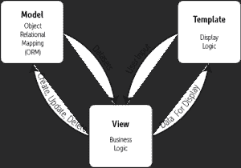
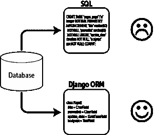
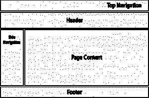

# 姜戈是什么？使用 Django 的优点和缺点

> 原文：<https://hackr.io/blog/what-is-django-advantages-and-disadvantages-of-using-django>

Python 是世界上最著名的编程语言之一，也是 2017 年 GitHub 项目中使用第二多的语言。因此，如果你对 Python 和 web 开发感兴趣，你很可能听说过 [Django](https://www.djangoproject.com/) 。如今，web 框架的名气越来越大，这使得学习一个新的框架和选择使用哪个框架变得非常困惑。 今天，我们来了解一下 Django，以便能够理解这项令人惊叹的技术。

## 什么是 Django？

Django 是一个用于构建网络应用的 MVT 网络框架。它将自己定义为一个“包含电池”的 web 框架，具有健壮性和简单性，可以帮助 web 开发人员编写干净、高效和强大的代码。它是世界上最著名的 web 框架之一，也是使用最多的框架之一。Instagram、Youtube、Google 甚至 NASA 的网站都使用它。因此，让我们进一步分解它，以了解更多信息。

## **结构**

Django 遵循代表模型-视图-模板的 MVT 架构。MVT 是著名的 MVC 结构的 Django 变体，这就是为什么你会觉得它与其他框架的工作方式非常相似。当 Django 服务器收到请求时，URL 路由器会将请求映射到适当的视图。然后，视图通过模型获取数据，填充模板，并将其发送回用户。

## 姜戈的模特们

### Django 是做什么用的？

詹戈的模型利用了强大的 ORM 层，简化了对数据库和数据的处理，加速了开发过程。

如果没有对象关系映射，开发人员将不得不自己创建表，并定义查询或过程，这有时会转化为大量的 SQL，而这些 SQL 往往很复杂且难以跟踪。

ORM 层允许你用简单的 python 代码编写所有的表定义，它负责将这些表定义翻译成合适的查询语言，同时也方便了 CRUD 操作。
事实上，开发人员不需要完全了解复杂的 SQL，也不需要知道它能翻译成什么，但是，值得注意的是，理解 SQL 能让你写出更好更快的查询，也能让你的网站更安全。

与其他框架不同，这些模型都放在一个文件中，通常是 models.py，这可能会让大型项目感到拥挤。

Django 支持许多数据库系统。SQLite 非常适合测试和开发，因为它可以开箱即用，无需安装其他软件。对于生产，你可以选择 [MYSQL 或 PostgreSQL](https://hackr.io/blog/postgresql-vs-mysql) ，如果你正在寻找一个 NoSQL 数据库，你可以使用 MongoDB 和 Django，这里有一个关于这个主题的进一步的 **[阅读](https://code.djangoproject.com/wiki/NoSqlSupport)** 。

[Python Django -实用指南](https://click.linksynergy.com/deeplink?id=jU79Zysihs4&mid=39197&murl=https%3A%2F%2Fwww.udemy.com%2Fcourse%2Fpython-django-the-practical-guide%2F)

## **Django 的模板**

模板层用于将数据与用户实际呈现和查看的方式分离开来。模板层类似于 MVC 的视图层。如果你熟悉其他语言中的模板，在 Django 中也是一样的；您使用类似 HTML 的语法，该语法随后被编译成 HTML，并注入所有相应的数据。当然，如果您想生成 XML 文档或 JSON 文件等，除了 HTML，还有其他格式的模板...

DRY 是 Django 的核心模板设计原则之一，它是一种代表“不要重复自己”的设计模式。听起来确实如此，这意味着你不应该，至少在大多数情况下，通过复制和粘贴代码。相反，举例来说，你的模板应该被分成可重用的组件，比如侧边导航栏、主导航栏、页面页眉、页面页脚等等。这最大限度地减少了重复，有助于编写高效、简洁的代码。

Django 与众不同的一点是它对安全的重视程度。这确实影响了模板的编写。

例如，在 Rails 中，你可以在视图中编写 ruby 代码——不是说这是你应该做的事情——你还可以给变量赋值。

在 Django 中，完全不是这样，你不能在模板中运行 python 代码，也不能给变量赋值。简而言之，Django 禁止在模板层执行代码，只允许访问显示逻辑，这是一个简单但对许多 web 漏洞非常有效的解决方案。

[Python Django -实用指南](https://click.linksynergy.com/deeplink?id=jU79Zysihs4&mid=39197&murl=https%3A%2F%2Fwww.udemy.com%2Fcourse%2Fpython-django-the-practical-guide%2F)

## **姜戈的观点**

Django 中的视图是业务逻辑层。它负责处理用户的请求并发回有效的响应。它从模型中获取数据，让每个模板访问要显示的特定数据，或者它可以预先对数据执行一些处理。如今，Django 的视图可以是处理请求并返回响应的函数，也可以是功能更多的类，类似于 Laravel 和 Rails 控制器。

## **URL 路由器**

Django 中的 URL 路由器比其他框架更复杂，比如 Rails 或 Laravel。它的问题是它使用了正则表达式，这对初学者来说不容易使用。然而，URL 路由器本身的结构一点也不复杂，它只是一种你一开始可能不习惯的语法。

## Django 的优势

### **1。**内含电池

Django 自诩为一个包含电池的框架。这意味着它有很多现成的东西，你可能会用，也可能不会用，这取决于你的应用。您不需要编写自己的代码(功能)，只需要导入您想要使用的包。

这是 Django 参与的配置范例的一部分，它允许您利用由世界级专业人员实现的解决方案。Django 电池涵盖广泛的主题，包括:

*   使用*认证包*进行认证
*   与*管理包*的管理接口
*   使用*会话包*进行会话管理
*   使用*消息包*管理临时或基于会话的消息
*   使用*站点地图包*生成 Google 站点地图 XML
*   带有 *Postgres 软件包*的 Postgres 特殊功能
*   用内容类型*框架*钩住内容的“类型”

**[查看所有 Django 电池/包](https://djangopackages.org/)**

### **2。Python**

由于 Django 使用 python，它利用了 Python 的一些名气和功能来为自己谋利。对于初学者来说，Python 可以说是最容易(如果不是最容易的话)学习的编程语言之一，它在世界各地的计算机科学入门课程中也很受欢迎。2017 年 Stackoverflow 开发者调查显示，Python 现在比 [PHP 和 Python](https://hackr.io/blog/python-vs-php) 更普遍，工作报酬比 [C#和 C++](https://hackr.io/blog/c-sharp-vs-cpp) 更高。

Django 的社区是最棒的地方之一，他们乐于助人，积极致力于使框架更加初学者友好，并在增加新功能的同时稳定框架。Django 的文档非常全面，作为一个独立的教程非常有用，它将帮助您了解各种特性，因此您可以将它作为主要的信息来源。

### **4。可扩展**

大多数开发人员在考虑选择未来的框架计划时。这就是为什么选择一个可伸缩的框架对很多人来说是非常重要的，Django 就是这样。它允许您针对可伸缩性采取许多不同的措施，例如为数据库、媒体和应用程序本身运行单独的服务器，甚至使用集群或负载平衡将应用程序分布在多个服务器上。

### **5。内置管理员**

Django 团队在创建框架时考虑得相当周到，他们将用户和客户满意度放在了心上。仅仅为了能够用基本的 CRUD 操作管理数据而在后端创建自己的管理界面是很不合理的。这就是为什么 Django 提供了一个开箱即用的管理界面，根据开发人员现在可以开发的文档，它既专业又通用。

## **姜戈的缺点**

虽然 Django 是一个令人惊叹的框架，但是有一些缺点对你来说可能是问题，也可能不是问题。首先，用正则表达式指定 URL 不是一件容易的事情，至少对初学者来说是这样。对于小项目来说，它也显得有些臃肿，有些人发现它被大项目占据了，因为模型都包含在一个文件中。默认情况下，模板错误会无声无息地失败，因此如果您不知道这一点，您可能会浪费大量时间来找出应用程序的问题所在，或者更糟糕的是，您可能甚至不知道您的应用程序有问题。这也是一个非常固执己见的框架，给人一种铁板一块的感觉。有一种流行的、被建议的做事方式，你应该遵循它。

## **如何学习 Django**

首先，你要从 Python 开始，了解 web 应用的自然流程。可以在 Hackr.io. 上找到编程社区最好推荐的 **[Django 教程](https://hackr.io/tutorials/learn-django?ref=blog)**

你可以选择最受欢迎的教程，也可以根据你的学习方式选择教程:视频教程或书籍；适合初学者或高级学习者。你可以从 CS50 关于 [web 开发](https://squareboat.com/services/web-development)的讲座开始，你也会得到关于 Python 以及如何使用它的简介。

为了掌握 Python，Bill Weinman 的 Lynda 课程是一门大师课，你也可以在 Udemy 上查看 Python 和 Django 的课程。Django 的官方文档也是一个很好的起点，正如我们之前所说，它提供了全面的教程，而不仅仅是 API 用法。

**人也在读:**