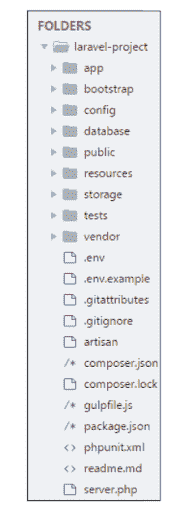

# 什么是框架？[定义]框架的类型

> 原文：<https://hackr.io/blog/what-is-frameworks>

作为一名程序员，当你有工具来帮助你的项目时，你不需要从头开始。框架是由开发人员开发并用于构建应用程序的软件。

## 什么是框架？

由于它们通常是由几个有经验的软件工程师和程序员来构建、测试和优化的，所以软件框架是通用的、健壮的和高效的。

使用软件框架开发应用程序可以让您专注于应用程序的高级功能。这是因为任何底层功能都由框架本身负责。

## 我们为什么要使用框架？

开发软件是一个复杂的过程。它需要过多的任务，包括编码、设计和测试。仅对于编码部分，程序员必须负责语法、声明、垃圾收集、语句、异常等等。

软件框架通过允许开发人员从单一平台控制整个软件开发过程或大部分过程，使他们的生活变得更加轻松。

使用软件框架的优势:

*   协助建立更好的编程实践，并恰当地使用[设计模式](https://hackr.io/tutorials/learn-software-design-patterns)
*   代码更安全
*   可以避免重复和冗余的代码
*   有助于以更少的错误持续开发代码
*   使复杂技术的工作变得更加容易
*   人们可以创建自己的软件框架或贡献开源框架。因此，在功能上有持续的改进
*   几个代码段和功能是预先构建和预先测试的。这使得应用程序更加可靠
*   测试和调试代码要容易得多，甚至不拥有代码的开发人员也可以完成
*   开发应用程序所需的时间显著减少

## 框架中包含什么？

当你安装一个软件框架时，你需要注意的第一件事是系统需求。一旦安装并配置了一个框架，它就会创建一个目录结构。

例如，图(I)说明了 [Laravel 框架](https://laravel.com/)的目录结构。这些文件夹中的每一个都可以有额外的目录。目录可以进一步包含文件、类、测试例程、模板等等。

 图(一)

### 库和框架的区别

有些人可能认为软件框架是库的集合，就像库是预编译例程的集合一样。然而，这是不正确的，因为不是所有的软件框架都使用或依赖库。

库和框架的区别在于后者调用代码。与此相反，代码调用软件库。让我们用一个例子来理解这一点:

curl 是 PHP 中的一个库。当您使用其中一个 curl 函数时，PHP 代码会调用 curl 库中的那个特定函数。您的代码是调用者，库代码是被调用者。

当你使用一个 [PHP 框架](https://hackr.io/blog/best-php-frameworks)，比如 Laravel，这种关系就颠倒了，所以软件框架调用框架中编写的应用程序代码。这在技术上被称为[控制反转(IoC)](https://en.wikipedia.org/wiki/Inversion_of_control) 。

### 编程语言 vs 框架

编程语言告诉计算机它应该做什么。每种编程语言都有一种语法和一套特定的规则，每次编写代码时都需要遵循这些规则。

软件框架是建立在编程语言之上的。举个例子，

Rails，也称为 Ruby on Rails，是一个构建在 Ruby 编程语言之上的 web 框架。

Django 和 Flask 是构建在 [Python 编程](https://hackr.io/blog/python-programming-language)语言之上的两个不同的 web 框架。因此，它们也被称为 [Python 框架](https://hackr.io/blog/python-frameworks)。React 和 Angular 是构建在 JavaScript 编程语言之上的前端 web 框架。

## 框架的类型

作为开发人员，您应该寻找最适合您需求的框架。无论是从事网站、数据科学、数据库管理还是移动应用，软件框架都适用于所有类型的软件编程。

有许多类型的软件框架使得为广泛的应用程序开发领域开发应用程序变得更加容易。让我们深入一些当今流行的软件框架:

### Web 应用程序框架

#### 1.有角的

Angular 是一个基于类型脚本的开源 JS 框架，它使得在 web 上构建应用程序变得很容易。Angular 通过结合声明性模板、依赖注入、端到端工具等等来解决应用程序开发的挑战。

Angular 使开发人员能够构建基于 web、移动和桌面的应用程序。

流行的 [JavaScript 框架](https://hackr.io/blog/best-javascript-frameworks)用于面向公众的应用和网站，如谷歌云平台和 AdWords，以及谷歌的许多内部工具。

使用 AngularJS 开发的一些流行网站有:

*   网飞
*   贝宝
*   向上工作
*   油管（国外视频网站）
*   姜戈

Django 是一个用 Python 编写的免费开源 web 应用框架。Django 由一个经验丰富的开发团队构建，负责 web 开发，这样开发人员就可以专注于编写应用程序，而无需重新发明轮子。

大型组织在其开发中积极使用 Django。使用 Django 开发的一些流行网站有:

*   迪斯克斯
*   照片墙
*   浏览器名
*   拼趣

#### 2.拉勒韦尔

Laravel 是一个基于 PHP 的 web 应用程序框架，具有丰富、优雅的语法。开源框架，并遵循模型-视图-控制器设计模式，这是一种健壮且易于理解的模式。

根据 Google Trends，Laravel 已经获得了最强大的 PHP 框架的地位，它为高性能的 [PHP web 应用程序开发](https://www.techcronus.com/php-web-development-services/)提供了一个标准化和功能丰富的平台。

使用 Laravel 开发的一些流行网站有:

*   Alison.com
*   Barchart.com
*   邻里贷款人
*   世界漫步

[Laravel 9 -建立完整的库存管理系统 A-Z](https://click.linksynergy.com/deeplink?id=jU79Zysihs4&mid=39197&murl=https%3A%2F%2Fwww.udemy.com%2Fcourse%2Flaravel-build-complete-inventory-management-system%2F)

### 数据科学框架

#### 1.阿帕奇火花

Apache Spark 是一个用于大规模数据处理的统一分析引擎。使用 Apache Spark，您可以用 Java、Scala、Python、R 和 SQL 快速编写应用程序。

超过 3，000 家公司正在使用 Apache Spark，包括以下顶级公司:

*   亚马孙
*   加拿大白鲑
*   数据砖
*   霍顿工厂
*   微软
*   神谕
*   威瑞森
*   签证

#### 2.PyTorch

PyTorch 是一个开源的[机器学习框架](https://hackr.io/blog/machine-learning-frameworks)，它加速了从研究和原型到生产部署的过程。

PyTorch 主要由脸书人工智能研究小组开发，可以用于 Python 和 C++。PyTorch 用于计算机视觉和自然语言处理(NLP)。使用 PyTorch 开发的一些流行网站有:

*   康卡斯特公司
*   埃克塞隆
*   特里福
*   Quadient

#### 3\. TensorFlow

TensorFlow 是一个用于机器学习(ML)的端到端开源框架。它有一个全面、灵活的工具、库和社区资源的生态系统，允许研究人员深入 ML，开发人员快速构建和部署 ML 驱动的应用程序。

张量流的三个典型应用是

*   用于图像识别和处理的卷积神经网络。
*   用于数据分析和简单行为预测的大型线性模型。
*   人类语言相关特征的序列间(Seq2Seq)模型。

查看这些[最佳数据科学教程和课程](https://hackr.io/data-science)。

### 移动开发框架

#### 1.离子的

Ionic 是一个免费的开源移动 UI 工具包，用于为 Android、iOS 和 Web 开发高质量的跨平台原生应用程序——所有这些都来自一个代码库。

Ionic 是整个应用程序生命周期的开发平台，允许团队构建更好更快的应用程序。使用 Ionic 开发的一些流行应用有:

*   市场观察
*   麦当劳土耳其餐厅
*   太平洋 3 .萨满

#### Xamarin 是一个免费的开源应用程序开发平台，用于构建 Android、iOS 应用程序。NET 和 C#。Xamarin 是[的一部分。NET 平台](https://dotnet.microsoft.com/platform/open-source)拥有来自 3700 多家公司的 60000 多名贡献者的活跃社区。

使用 Xamarin 开发的一些流行应用程序有:

阿拉斯加航空公司客户申请

*   面向移动银行的 CA Mobile
*   医疗应用程序 Novarum DX
*   4.摆动

#### Flutter 是 Google 的 UI 工具包，用于从单一代码库为移动、web 和桌面构建漂亮的本地编译应用程序。它有一个富有表现力和灵活性的用户界面，并在 iOS 和 Android 平台上提供了原生性能。

使用 Flutter 开发的一些流行应用程序有:

阿里巴巴(电子商务)

*   密码系统
*   谷歌广告(实用工具)
*   在开始使用软件框架之前，给你一点建议

### 在使用框架进行应用程序开发之前，通过学习编程语言的细微差别来学习和发展编码技能是一个好主意。否则，您可能会错过一个框架中底层技术的宝贵经验。

如果你还不是一个专业的程序员，那么理解驱动框架的代码是很重要的。当你遇到复杂的挑战时，这些知识会使你变得更容易，并且会使你成为一个全面熟练的开发人员。

许多前端开发人员为开源框架做出贡献，以支持整个开发人员社区。例如，Google 的开发人员构建 AngularJS 和 Polymer，这两个工具对所有前端开发人员都是免费的。

许多开发人员也通过贡献开源库来支持前端社区。

结论

## 对于希望使用软件框架进行应用程序开发的程序员来说，最基本的建议是根据要开发的应用程序的需求来学习一种新的框架或编程语言。

此外，分析前端、后端、云管理和移动技术等领域，该技术的潜在市场份额、可持续性等，并在决定与某项技术签约之前了解其技术特性。

Further, analyze areas such as front-end, back-end, cloud management, and mobile technology, the potential market share of the technology, sustainability, and more, and understand the technology features before deciding to sign up with one.