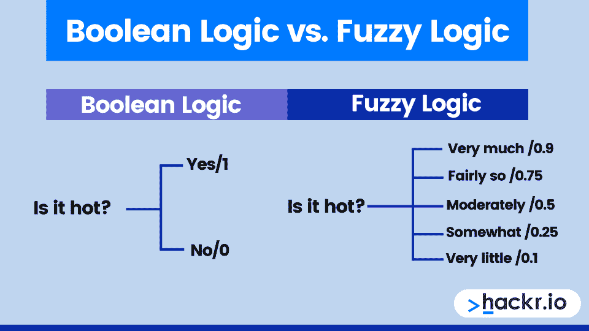

# 什么是模糊逻辑？优点和缺点

> 原文：<https://hackr.io/blog/what-is-fuzzy-logic>

在我们的日常生活中，我们可能会遇到无法决定某件事是真的还是假的情况。

模糊逻辑领域处理这个问题。对于一个数学概念来说，这是一个奇怪的名字，在 20 世纪 60 年代中期首次正式引入。

模糊逻辑在各种各样的领域都有应用，包括[人工智能](https://hackr.io/blog/what-is-artificial-intelligence)，它被用于神经网络。

## **什么是模糊逻辑？**

****

模糊逻辑是一种类似人类思维的计算“思维”技术。通常，计算机处理信息以产生真或假的输出，类似于人的是或否。

洛特菲·扎德在 1965 年提出了模糊逻辑的概念，牢记人类经常有除了是和不是之外的答案。然而，模糊逻辑可以追溯到 20 世纪 20 年代，名为无限值逻辑。

模糊逻辑可用于各种规模和容量的框架中，如小型控制器或基于工作站的框架。此外，它往往用于设备、[编程](https://hackr.io/blog/what-is-programming)或两者的混合。这对[数据分析](https://hackr.io/blog/what-is-data-analysis-methods-techniques-tools)也有影响。

请记住，模糊逻辑算法并不总是准确的。可能存在“噪声”或故障特征。这个领域已经有所改进，比如模糊决策树。后者结合了模糊逻辑和符号决策树来解决任何可能遇到的问题。

### 我们为什么要利用模糊逻辑？

模糊基本原理框架有多种用途。因为它为模糊的人类评估留出了空间，所以它允许在商业和工程中有更多的结果。例如，它可以用来控制机器和购物系统。

模糊逻辑的一些实际应用有:

*   用于大型组织业务中的动态支持网络和个人评估。
*   控制物质业务中的 pH 值、干燥和调制精炼过程。
*   模糊推理用于自然语言处理。
*   广泛用于当今的控制框架，例如主框架。

你可能想知道模糊逻辑和神经网络之间是否有相似之处。有一个区别，那就是模糊逻辑旨在匹配人类的推理和决策，而神经网络试图创建基于人脑神经元的系统。

[Python 模糊逻辑初学者终极指南](https://click.linksynergy.com/deeplink?id=jU79Zysihs4&mid=39197&murl=https%3A%2F%2Fwww.udemy.com%2Fcourse%2Fthe-ultimate-beginners-guide-to-fuzzy-logic-in-python%2F)

## **模糊逻辑的 4 个组成部分**

模糊逻辑框架有 4 个主要部分:模糊化器、模糊规则库、推理机和解模糊器。

1.  规则库包含确定决策的规则和隶属函数。
2.  推理引擎确定如何将规则应用于输入以生成输出。
3.  模糊化器将原始输入转换成模糊集。
4.  解模糊器将模糊集转换成显式输出。

### 什么是去模糊化？

去模糊化是一个过程，通过这个过程我们从模糊集合中得到一个可量化的输出。有各种各样的反模糊化策略，你必须选择一个最合适的专家框架。

### **模糊逻辑 vs 概率:面对面的比较**

| **模糊逻辑** | **概率** |
| 模糊逻辑本质上处理的是思维中的模糊概念。 | 概率与场合而非现实有关，而那些场合要么会发生，要么不会发生。 |
| 模糊逻辑处理不完全真理的意义 | 概率假设捕捉分数信息。 |
| 模糊推理接受真度作为科学基础 | 概率是遗忘的数字模型。 |

### **模糊逻辑的优缺点**

像几乎所有的框架一样，模糊逻辑有一系列的优点和缺点。模糊逻辑的局限性也导致了其他领域的研究得到更多的关注。

| **优势** | **缺点** |
| 模糊逻辑系统的结构简单且合理 | 模糊的基本原理并不总是准确的 |
| 它通常用于商业和有用的目的 | 基于模糊信息的框架的批准和验证需要用设备进行广泛的测试 |
| 它鼓励你控制机器和购买物品 | 设定准确、模糊的指导方针和招生能力可能是一项艰巨的任务 |
| 它要求您管理设计过程中的漏洞 | 有时，模糊的基本原理会被误认为是可能性假设 |
| 一般很强，因为不需要确切的信息来源 |
| 万一输入传感器停止工作，您可以将其编程到环境中 |
| 您可以更改它来改进或修改框架执行 |
| 可以利用经济的传感器，这鼓励你保持一般框架成本和复杂性较低。 |

## **人工智能中模糊逻辑的例子**

然后，将大量规则应用于注册容量，以产生新鲜产出评价。让我们检查一个过程控制的案例，以真正了解模糊逻辑的重要性。

### **第一阶段**

我们将温度作为数据点，将风扇速度作为产量。你需要对每一条信息做出大量的参与能力。一个招生工作基本上就是模糊变量集的图形化刻画。此时，我们将为三种温度设置中的每一种进行登记工作:

### **第二阶段**

在接下来的阶段，我们将利用三个模糊集来表示产量，慢速、中速和快速。关于信息集，每个产量集都有大量的容量。

### **第三阶段**

由于我们已经描述了注册能力，我们可以制定标准来描述如何将参与能力应用到最后一个框架中。我们将为此框架制定三个标准:

*   万一天很热，那就快点
*   万一是热的，就做中号的吧
*   万一天气冷，慢慢来

这些原则适用于招生能力，以提供新的收益和激励来推动框架。沿着这些路线，对于 52 度的信息估计，我们收敛注册容量。这里，我们应用两个准则，因为交叉点发生在两种能力中。您可以将收敛焦点延伸到产量上，以创建一个交叉点。然后，您将能够在交叉焦点的高度上缩短产能。

这是模糊基本原理框架如何工作的基本说明。在一个真正的工作框架中，会有许多信息源和一些产出。

## **结论:模糊逻辑可以改善机器控制**

模糊逻辑有助于理解人们在动态环境中如何以未知的方式表现。因此，它就像一个人工智能或人工智能，提供了可能发生的可能性。模糊逻辑有助于控制机器，并提供一系列充分的思考，这些思考可能作为人类决策过程的一部分出现。

如果你对这些领域感兴趣，你应该看看我们关于数据科学或者其他领域的解释。

## **常见问题解答**

#### **1。什么是机器学习中的模糊逻辑？**

模糊逻辑是一种数学模型，用于各种人工智能应用。存在利用模糊逻辑的机器学习方法。

#### **2。模糊逻辑的四个组成部分是什么？**

模糊逻辑的四个主要组成部分是模糊化器、模糊规则库、推理机和解模糊器。

#### **3。AI 用模糊逻辑吗？**

是的，模糊逻辑是一种数学，在人工智能领域确实有应用。更多模糊逻辑的例子，你可以阅读上面的解释。

#### **4。模糊逻辑是谁发明的？**

洛特菲·扎德被认为是模糊逻辑之父。他在 20 世纪 60 年代中期创建了模糊逻辑的数学框架。

#### **5。模糊逻辑还用吗？**

模糊逻辑仍然存在，虽然其他方法往往给予更多的关注。人工智能领域一直在发展，因此它可能会产生更大的影响。

**人也在读:**