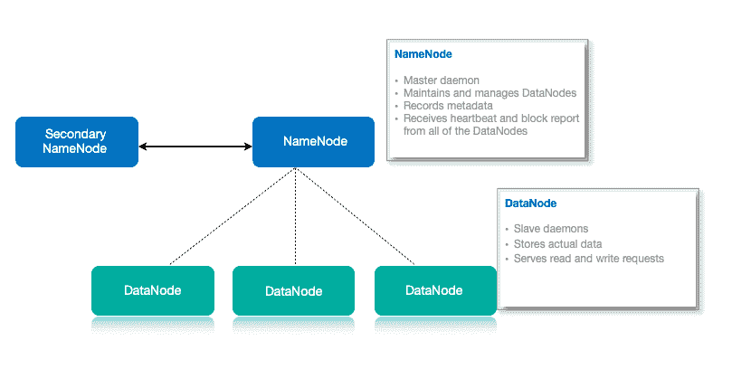
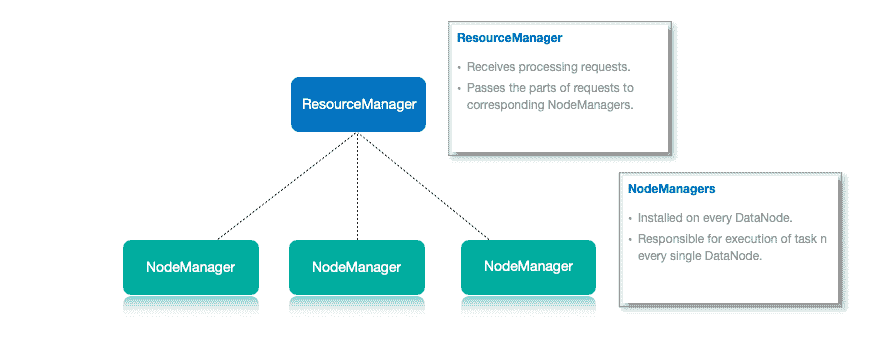

# Hadoop 是什么？

> 原文：<https://hackr.io/blog/what-is-hadoop>

## 导致 Hadoop 发展的问题

处理数据的异构性，即半结构化、结构化和非结构化，一直是数据分析的主要问题。RDBMS 主要关注结构化数据，如银行交易、运营数据等，而 Hadoop 专注于半结构化或非结构化数据，如音频、视频、文本、脸书帖子等。RDBMS 技术是经过验证的、高度一致的、成熟的，许多组织都支持它。由于大数据，Hadoop 的需求很高，大数据大多由不同格式的非结构化数据组成。

大数据带来的问题引发了 Hadoop 的发展:

1.  **指数级大数据集:**以前，存储大量数据是不可行的，因为存储仅限于一个系统，而且数据以惊人的速度增长。
2.  **异构数据的存储:**数据不仅非常庞大，而且有多种格式:半结构化、结构化和非结构化。因此，可用的系统应该存储从多个来源生成的各种数据。
3.  **速度:**随着硬盘容量的增加，访问和处理速度成为比大数据更大的问题，但数据传输速度却没有以类似的速度增加。

科学家 Mike Cafarella 和 Doug Cutting 开发了一个名为 Hadoop 1.0 的平台，并于 2006 年推出，以支持 Nutch 搜索引擎的分发，同时也克服了上述问题。他们的灵感来自谷歌的 MapReduce，它将一个应用程序分割成小部分，在不同的节点上运行，

2012 年 11 月，Apache Hadoop 由 Apache 软件基金会向公众开放。该框架由 Apache Software Foundation 管理，并获得 Apache License 2.0 的许可。

## Hadoop 是什么？

Hadoop 基于 [Java 框架，是一款用于处理和存储大数据的开源软件。Hadoop 允许用户在分布式环境中存储大数据，这样他们就可以并行处理这些数据。Hadoop 通过提供公司的历史数据和各种记录来帮助做出更好的商业决策。因此，通过使用这项技术，公司可以改善其业务。Hadoop 对从公司收集的数据进行大量处理，以推断出结果，这有助于做出未来的决策。](https://hackr.io/blog/java-frameworks)

## Hadoop 的组件

### **1。HDFS**

Hadoop 分布式文件系统允许用户跨集群存储各种格式的数据。HDFS 创建了一个类似于虚拟化的抽象概念，即 HDFS，它是一个用于存储大数据的单元，但数据存储是以分布式方式跨多个节点进行的。HDFS 遵循主从架构。在 HDFS，命名节点充当主节点，数据节点充当从节点。包含在命名节点中的关于存储在数据节点中的数据的元数据，例如数据块的副本保存在哪里，哪个数据块存储在哪个数据节点中，等等。数据节点存储实际数据。

HDFS 主从架构

### **2。纱线**

Yarn 通过分配资源和调度任务来执行所有的处理活动。它由两个组件 ResourceManager 和 NodeManager 组成。资源管理器再次充当主节点；它接收处理请求。然后，它相应地将部分请求传递给相应的节点管理器，在那里进行实际的处理。每个 DataNode 上都安装了节点管理器。它负责在每个 DataNode 上执行任务。

纱线结构

### 其他组件:

*   **Hadoop Common** :包含其他 Hadoop 模块的一组标准实用程序和库
*   MapReduce:通过将数据分布为小块，以并行方式执行任务
*   Ambari :基于 web 的界面，用于管理、配置和测试大数据集群，以支持其组件，如 HDFS、MapReduce 等。该界面提供了一个控制台，用于监控集群的运行状况，还允许以用户友好的方式评估各个组件(如 MapReduce、Pig、Hive 等)的性能。
*   Cassandra :这是一个高度可扩展的开源分布式数据库系统，基于 NoSQL，致力于跨多个商用服务器处理大量数据，从而实现高可用性。
*   **Flume** : Flume 是一个分布式的、可靠的服务，用于收集、聚合大量的流数据，并将其移动到集中的数据存储中。
*   **HBase** : HBase 是运行在大数据 Hadoop 集群上的非关系型分布式数据库，存储大量结构化数据。
*   **HCatalog** :是一层存储管理层和表，允许开发者共享和访问数据。
*   **Hive** : Hive 是为提供数据查询和分析而搭建的数据仓库平台。
*   Oozie 是一个基于服务器的系统，负责管理和调度 Hadoop 任务。
*   Pig 负责在 MapReduce 编译器和一种叫做 Pig Latin 的语言的帮助下操作存储在 HDFS 的数据。
*   Solr :一个高度可扩展的搜索工具，支持索引、集中配置、故障转移和恢复。
*   **Spark** :负责 Hadoop 流和支持 SQL、机器学习、处理图形的快速开源引擎。
*   Sqoop 是一种在 Hadoop 和结构化数据库之间传输大量数据的机制。
*   ZooKeeper :一个开源应用，ZooKeeper 配置并同步分布式系统

[Hadoop 的终极实践:驯服您的大数据！](https://click.linksynergy.com/deeplink?id=jU79Zysihs4&mid=39197&murl=https%3A%2F%2Fwww.udemy.com%2Fcourse%2Fthe-ultimate-hands-on-hadoop-tame-your-big-data%2F)

## Hadoop 如何作为大数据问题的解决方案？

### 1.大数据的存储

HDFS 将大数据存储在分布式系统中。数据跨 DataNodes 存储在块中，用户指定块的大小。例如，如果用户有 512MB 的数据，并且他已将 HDFS 配置为创建 128 MB 的数据块。因此，数据被 HDFS 分为四个块，即 512/128=4，并存储在不同的 DataNodes 中。它还在不同的 DataNodes 上复制数据块。现在，使用商用硬件解决了存储挑战。

缩放问题通过关注*水平缩放*而不是垂直缩放来解决。用户还可以根据需要向 HDFS 集群添加一些额外的数据节点，而不是纵向扩展数据节点的资源。

### 2.存储结构化、非结构化和半结构化数据

HDFS 允许用户存储所有类型的数据，无论是结构化、半结构化还是非结构化的，因为在 HDFS，没有*预转储模式验证*。它也遵循“一写多读”的模式。由于这一点，您可以一次写入数据，并且可以多次读取数据以寻找见解。

### 3.处理和访问数据

大数据面临的一个重大挑战是高效地处理和访问数据。解决这个问题需要将处理转移到数据上，而不是将数据转移到处理上。这是什么意思？在 MapReduce 中，处理逻辑被发送到不同的从节点，然后跨不同的节点并行处理数据。然后，处理后的结果被发送回主节点，在那里结果被合并，响应被发送回客户机。

## 下载和安装

### **硬件要求:**

Hadoop 在任何普通的硬件集群上都是可行的。运行该服务需要商用硬件。

### **操作系统要求**

Hadoop 被开发为在 Windows 和 UNIX 平台上运行。

### **浏览器要求**

Hadoop 几乎支持所有流行的浏览器。根据需要，这些浏览器包括谷歌 Chrome、微软 Internet Explorer、Mozilla Firefox、Safari for Windows 以及 Linux 和 Macintosh 系统。

### **软件需求**

Hadoop 服务需要 Java 软件，因为 Hadoop 框架是用 Java 编程语言编写的。所需的 Java 最低版本是 Java 1.6 版本。

### **数据库需求**

Hive 或 HCatalog 需要 MySQL 数据库才能成功运行 Hadoop 框架。

**安装:**

下面讨论了几种安装 Hadoop 的方法。

#### **1。独立模式**

我们可以在独立实例中的单个节点上安装 Hadoop。因此 Hadoop 平台就像一个执行 Java 的系统；这主要用于调试进程。在大型 Hadoop 集群上运行 MapReduce 应用程序之前，检查单个节点上的 MapReduce 应用程序也很有帮助。

#### **2。完全分布式模式**

商用硬件的几个节点连接到这个分布式节点，形成 Hadoop 集群。NameNode、辅助 NameNode 和 JobTracker 都在主节点上工作，而辅助 DataNode 和 DataNode 在从节点上工作。TaskTracker 也在从属节点上工作。

#### **3。伪分布式模式**

单节点 Java 系统，伪分布式节点运行整个 Hadoop 集群。因此，各种守护进程(如 NameNode、DataNode、TaskTracker 和 JobTracker)在 Java 机器的单个实例上运行，以形成分布式 Hadoop 集群。

## Hadoop 的特性

### **1。适合大数据**

由于数据量巨大，而且各种数据都是结构化、半结构化和非结构化的，因此很有可能会出现数据丢失和数据故障。Hadoop 集群最适合这项工作，因为它们可以处理大型复杂的异构数据。

### **2。计算能力**

Hadoop 提供分布式计算能力，支持通过多个并行运行的节点快速处理大数据。

### **3。容错能力**

Hadoop 生态系统提供了在其他集群节点上复制输入数据的服务，从而减少了故障数量。与集群节点故障的情况一样，作业会自动重定向到其他节点；因此，系统无故障地实时响应。

### **4。不需要预处理**

大量的结构化或非结构化数据无需在存储到数据库之前进行预处理就可以立即检索。

### **5。可扩展性**

Hadoop 工具是完全可扩展的，因为它允许我们将集群规模从单台机器提升到数千台服务器，而不必进行大量管理。

### **6。性价比高**

既然是开源服务，那就实惠。

## Hadoop 的应用

### **1。医疗保健**

医疗保健领域的大数据通过降低成本、治愈疾病、提高利润和预测流行病来预防死亡，从而提高人类生活质量。各种医疗机构、研究实验室和医院都在利用大数据分析，通过改变治疗模式来降低医疗成本。医疗保健中的大数据是一个很好的概念，因为医疗保健数据管理需要管理不同的数据类型和节奏。Hadoop 作为 MapReduce 引擎在医疗行业成功管理了海量医疗数据，而 HDFS 能够处理数千万亿字节的数据。Hadoop 利用廉价的商品硬件，使其成为医疗保健行业的一项口袋友好型投资。

### **2。了解客户需求**

了解客户的需求是使用 Hadoop 的一个重要方面。像电信这样的许多领域使用这种技术，通过分析大量数据并从数据中提取信息来找出客户的需求。社交媒体也使用这项技术；该服务在各种社交媒体网站上向目标客户反复发布广告。信用卡公司使用 Hadoop 为他们的产品找到合适的客户；他们通过各种方式联系顾客来销售他们的产品。许多在线预订网站根据这些信息跟踪用户以前的冲浪，并根据客户的兴趣，向他们提供航班建议。许多电子商务公司还记录一起购买的产品。基于此，当客户试图购买该群体中的相关产品时，他们会建议客户购买其他产品，例如，手机后盖、屏幕保护建议。

### **3。城市和国家的改善**

使用 Hadoop 分析数据可以改善城镇和城市的发展，例如，使用 Hadoop 可以控制交通堵塞。Hadoop 还通过为公共汽车、火车和其他车辆提供适当的路线指南，为智能城市的发展和改善交通服务。

### **4。金融交易**

交易领域使用 Hadoop。它由一个复杂的算法组成，通过预定义的条件扫描市场，以发现交易机会。它被设计成在无人监控的情况下无需人工干预即可工作。高频交易也用 Hadoop。该算法采取了大部分的交易决策。

### **5。优化业务流程**

业务流程需要 Hadoop，因为它以各种方式优化了公司的绩效。它允许零售商根据来自社交媒体、谷歌搜索和其他平台等多个来源的预测定制他们的库存。基于这一点，公司可以做出最佳决策，以改善他们的业务，并最大限度地提高他们的利润。许多公司使用这项技术通过监控员工的行为来改善他们的工作空间。传感器可以嵌入到员工的徽章中，以观察他们与组织中其他人的互动。这对于在员工之间出现问题时做出人力资源决策很有帮助。

### **6。性能优化**

通过监测健康人的睡眠模式、晨跑和日常生活来改善个人生活也涉及到使用 Hadoop。很多交友网站也用 Hadoop 来寻找有共同兴趣的人。

### 7 .**。优化机器性能**

机械领域大规模使用 Hadoop。用于自动化开发自动驾驶汽车。通过使用 GPS、摄像头和强大的传感器，汽车可以在没有人类干预的情况下行驶。Hadoop 的使用在这一领域发挥了巨大的作用，这将永远改变驾驶体验。

## 摘要

我们可以根据我们的业务需求在我们的组织中采用 Hadoop。短短十年间，Hadoop 已经在计算行业崭露头角。它让数据分析成为现实。它广泛用于分析网站访问、欺诈检测、银行应用和医疗保健行业。