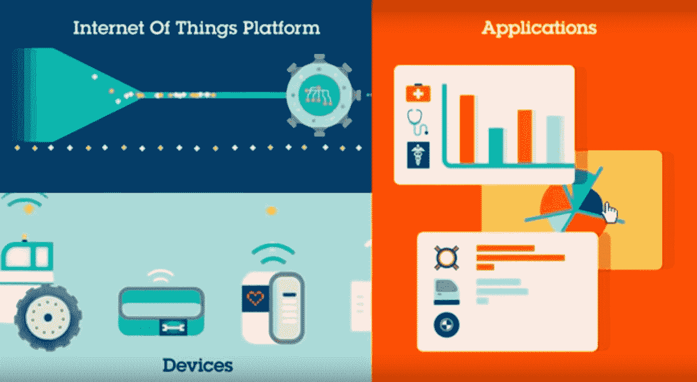

# IoT 是什么？定义和它是如何工作的？

> 原文：<https://hackr.io/blog/what-is-iot>

物联网正从我们的反应方式到行为方式影响着我们的生活方式。从可以由智能手机控制的空调，到提供最短路线的智能汽车，或者跟踪我们日常活动的智能手表。

## IoT 是什么？

物联网是一个由相连设备组成的巨大网络。这些设备收集并共享有关其使用方式和运行环境的数据。传感器嵌入在每个物理设备中。可以是手机、电器、车辆、条码传感器、红绿灯等等。

这些传感器持续发射关于设备工作状态的数据。他们是如何分享这些海量数据的？物联网为设备转储数据提供了一个通用平台，并为所有设备之间的通信提供了一种通用语言。数据从各种传感器发出，并安全地发送到物联网平台。物联网平台整合了从各种来源收集的数据。此外，对数据执行分析，并根据需要提取有价值的信息。最后，结果将与其他设备共享，以实现更好的用户体验自动化。

## 它是如何工作的？

复杂的传感器和芯片嵌入在我们周围的物理设备中，每个都传输有价值的数据，让我们更好地了解这些东西如何协同工作。这里，问题出现了，我们如何把信息

工作？答案是一个通用的物联网平台，它将我们的各种信息汇集在一起，并为设备和应用程序相互通信提供一种通用语言。该过程始于与物联网平台安全通信的设备，集成来自许多设备的数据，并应用分析与解决特定行业需求的应用程序共享最有价值的数据。

物联网如何改变世界？

[https://www.youtube.com/embed/QSIPNhOiMoE](https://www.youtube.com/embed/QSIPNhOiMoE)

VIDEO

## 物联网凭借其实现设备到设备通信的能力正在重塑每个行业；它提供了设备间的自动化支持和通信。

**不再堵车:**车内的传感器与环境连接，信息经过处理，向车内发回一条信息，让司机和人们知道走哪条路可以避开车流。

1.  **拯救生命:**医生可以更好地获取更多信息，从而做出更好、更快的诊断，减少错误。
2.  **智慧城市:**传感器遍布城市，又因为物联网技术；因此，有更多的空间和更好的维护。
3.  **绿色家居:**如今的家居都配备了足够智能的自动化设备，可以自行决策和维护，例如:
4.  恒温器知道何时升高或降低温度。
    *   房子需要的水很容易维护。
    *   该系统还能保持最佳照明。
    *   不通电的电器会自动关闭，这样既节能又省钱。
    *   **用衣服付款:**衣服由导电线制成，并嵌入了与你的身份绑定的微芯片。它可以让你获得优惠，支付，知道什么时候回收，解锁你的手机，获得建议，等等。
5.  物联网为什么重要？

## 近年来，物联网已经成为本世纪最关键的技术之一。我们现在可以通过嵌入传感器的设备将厨房电器、汽车、恒温器、婴儿监视器等日常物品连接到互联网，人、过程和事物之间的无缝通信成为可能。

物联网技术帮助人们更智能地生活和工作，并完全控制他们的生活，使用低成本计算、云、大数据、分析和[移动技术](https://www.computerworld.com/article/2539461/13-future-mobile-technologies-that-will-change-your-life.html)，在最少的人工干预下收集和共享数据。在这个超连接的世界里，数字系统记录、监控和调整相互连接的事物之间的相互作用，从而使物理世界和数字世界相互合作。

此外，物联网为企业提供了对其公司系统工作方式的实时观察，为供应链和物流提供了对机器性能的洞察。

物联网通过让公司实现流程自动化来降低劳动力成本。它改善了服务交付，从而降低了制造和交付商品的成本，并提高了客户交易的透明度。

物联网正在几个行业中变得流行，包括金融、医疗保健、零售、制造等。

物联网是我们生活中必不可少的技术之一，随着越来越多的组织意识到联网设备保持竞争力的潜力，物联网将继续发展。

哪些技术让物联网成为可能？

### 以下技术在物联网的实际实施中发挥了至关重要的作用:

1.云计算

#### 从设备的传感器收集了大量数据。因此，不仅需要一些相当大的空间来处理这些数据，还需要存储这些数据，这就是云计算发挥作用的地方。云计算有可能快速无误地处理大量数据。身份管理平台就是一个使用物联网解决方案来提供数据安全性的例子。使用云的优势在于它更具可扩展性和效率。

2.传感器

#### 传感器被认为是物联网的主要组成部分，因为它们收集和收集来自设备的数据，然后将其广播到物联网云平台以处理数据。传感器允许设备间交互，因为它们使用类似于微处理器工作方式的光刻程序。因此，低成本和可靠的传感器使物联网技术成为更多制造商的可能。

3.IPv6

#### IPv6 是主要通信的高级版本，能够识别和定位互联网上的计算机和设备。它提高了性能，提供了更有效的数据包处理，并提高了安全性。

IPv6 的相关性有三个因素？

安全性:提供端到端加密，支持更安全的名称解析。

1.  可量测性
2.  连通性
3.  4.机器学习和分析

#### 随着机器学习成为世纪技术，企业可以通过访问存储在云中的大量数据来更快、更有效地收集见解。这些联合技术的出现不断推动物联网的边界，物联网产生的数据也为这些技术提供了信息。

5.对话式人工智能

#### 神经网络已经为数字个人助理 Alexa、Cortana 和 Siri 等物联网设备实现了自然语言处理(NLP ),并使这些设备变得更具吸引力、价格更低廉，并且适合家庭使用。

[打造 IOT 事物从无到有走向市场的完整指南](https://click.linksynergy.com/deeplink?id=jU79Zysihs4&mid=39197&murl=https%3A%2F%2Fwww.udemy.com%2Fcourse%2Fcomplete-guide-to-build-iot-things-from-scratch-to-market%2F)

什么样的行业受益于物联网？

## 1.工业物联网(IIoT)

### 物联网技术在行业中的应用被称为工业物联网(IIoT)。该技术利用了仪器仪表和对采用云技术的传感器设备的控制。现在的工业使用 M2M ( [机器对机器通信](https://en.wikipedia.org/wiki/Machine_to_machine))来实现无线控制和自动化。但随着云技术的出现，行业可以实现新的自动化层，从而创造商业模式。IIoT 被称为工业革命的第四次浪潮，或工业 4.0。

以下是 IIoT 的一些常见用法:

智能城市

*   互联智能物流
*   智能数字供应链
*   智能制造
*   预防性和预测性维护
*   智能电网
*   以下行业利用物联网技术:

1.制造业

#### 如果传感器检测到即将发生的故障，制造商可以利用生产线监控对设备进行主动维护，从而获得优势。传感器能够测量产量何时受到影响。因此，制造商可以快速检查设备的准确性，或将其从生产中移除，直到在传感器警报的帮助下修复。它允许公司降低运营成本，获得更好的正常运行时间，并改善资产性能管理。

2.汽车的

#### 物联网在汽车行业具有显著优势，通过从生产线申请其优势，传感器可以检测道路上车辆中的设备故障，并向驾驶员提供详细信息和建议。汽车供应商和制造商通过物联网收集的聚合信息数据了解如何保持车辆行驶和车主信息。

3.运输和物流

#### 物流和运输系统利用物联网应用。由于物联网传感器数据，运载库存的卡车、汽车、船只和火车车队会根据天气、交通、车辆可用性、司机可用性等因素进行改道。货物或库存可以配备有传感器，并且还可以被检查以进行温度监控和跟踪。

温度监控食品和饮料、制药等商品行业利用物联网传感器及时监控其商品的温度，并在温度上升或下降到可能对产品构成威胁的水平时发出警报。

4.卫生保健

#### 物联网技术为医疗保健行业带来了巨大的好处。在物联网传感器的帮助下，轮椅等耐心协助资产可以轻松找到。类似地，可以跟踪许多其他医院资产，确保适当的患者护理。

物联网的利弊

## 物联网的优势

### 物联网的一些优势包括:

能够随时随地通过任何设备访问信息。

*   连接的电子设备之间改进的通信
*   通过连接的网络传输数据包，节省金钱和时间
*   自动化任务提高了业务服务的质量，从而减少了人工干预。
*   物联网的缺点

### 下面提到了物联网的一些缺点，包括:

随着共享信息的设备数量的增加，黑客窃取机密信息的机会也在增加。

*   组织可能会处理大量的物联网设备，从所有这些设备中收集和管理数据可能会面临挑战。
*   如果在系统中发现错误，每个连接的设备都会被破坏。
*   来自不同制造商的设备发现相互通信具有挑战性，因为没有物联网兼容性的国际标准。
*   物联网的应用

## 1.智能家居

### 智能家居被认为是物联网应用的重要组成部分，既重要又高效。每月约有 6 万人搜索智能家居。用于物联网分析的智能家居数据库包括 256 家公司和初创公司，旨在为客户提供最佳生活体验。AlertMe 或 Nest 等知名初创公司，以及飞利浦、海尔或 Belkin 等几家跨国公司都是提供智能家居解决方案的组织。

2.衣服

### 全球的忠实消费者每年都热切期待最新款苹果智能手表的发布。让我们的生活变得轻松的可穿戴设备有 LookSee 手环、索尼智能 B 训练器、Myo 手势控制等等。

3.智能城市

### 事实证明，智能城市是一项重大创新，涵盖了广泛的应用，如水分配和交通管理、废物管理、环境监测等。它越来越受欢迎的原因是它试图减少城市居民的不适和问题。智能城市领域的物联网解决方案解决了各种与地铁相关的问题，如交通、空气和噪音污染，并使城市更加安全。

4.智能电网

### 智能电网根据电力供应商和消费者的行为自动提取信息，以提高电力分配的效率、经济性和可靠性。

5.工业互联网

### 发电、石油、天然气和医疗保健等行业使用物联网连接其机器和设备。在物联网的帮助下，可以避免导致危及生命的系统损坏和故障以及计划外停机。用于心脏监测的健身带或智能家用电器等设备嵌入了物联网传感器，易于使用，但不可靠，因为如果停机，它们通常不会造成紧急情况。

6.联网汽车

### 联网汽车技术是一个由多种天线、传感器、嵌入式软件和技术组成的广泛而复杂的网络，有助于在复杂的世界中进行通信导航。当人类放弃对方向盘和刹车的控制，转向目前正在公路上测试的自动驾驶汽车时，这些要求变得至关重要。因此，这些车辆的制造应该是高效、精确和可靠的。

更多应用，可以[访问这里](https://hackr.io/blog/top-10-iot-applications)。

**未来范围**

物联网连接设备是在各种系统中嵌入传感器以连接到互联网。当设备可以从任何地方进行控制时，当它们以数字方式表示自己时，连接可以从更多地方捕获数据，这确保了提高安全性、提高效率和**物联网安全性**的方法。

物联网技术通过物联网分析和物联网安全来帮助公司提高绩效，从而提供高效的产出。公用事业、石油和天然气、保险、制造、运输、基础设施和零售部门的行业受益于物联网，他们可以在大量交互和交易数据的帮助下做出明智的决策。

物联网市场评估不乏其人。例如，其中一些包括:

贝恩公司预计，到 2020 年，硬件和软件的物联网年收入将超过 4500 亿美元

*   麦肯锡公司估计，到 2025 年，物联网将产生 11.1 万亿美元的影响
*   联网物联网设备的数量预计将每年增长 12%，到 2030 年将达到 1250 亿台。
*   Gartner 估计，到 2020 年，将有 208 亿物联网设备投入使用，到 2018 年，物联网设备和服务的总支出将达到 3.7 万亿美元。
*   结论

## 正如我们所知，物联网技术已经在我们的家中、公共场所、办公室和工厂中变得非常舒适，并且以这样的发展速度，物联网短语“任何可以连接的东西都将被连接”即将成为现实的日子不远了。

因此，真正的问题应该是如何连接才能实现最高的效率，同时保持安全性和成本效益等关键特性，而不是何时实现。这种设备的部署需要大量的低带宽、低功率设备。这将进一步要求使用 LwM2M，这是一种轻量级协议，专为管理这种资源受限的机器而设计。因此，从这样一个实用的角度来看，物联网应用的成功问题归结为从大量现有解决方案中选择合适的物联网技术。

**人们也在阅读:**

**People are also reading:**